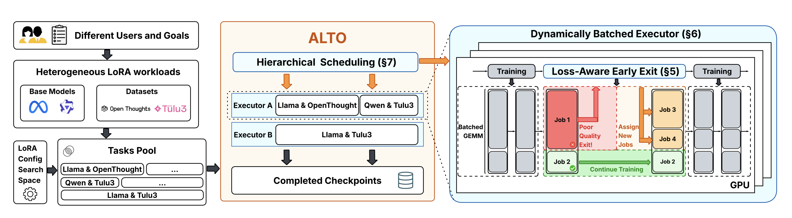
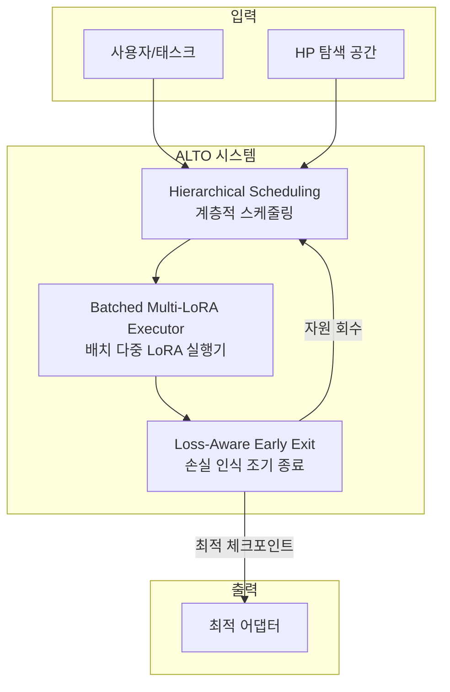
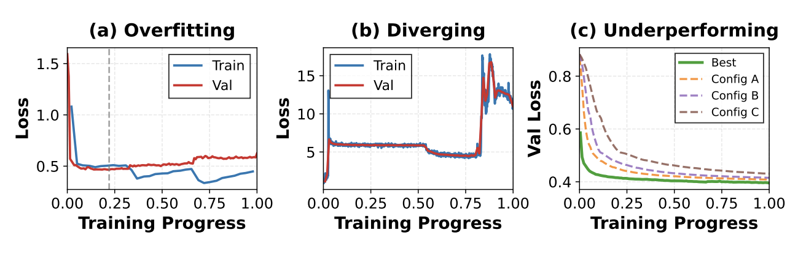
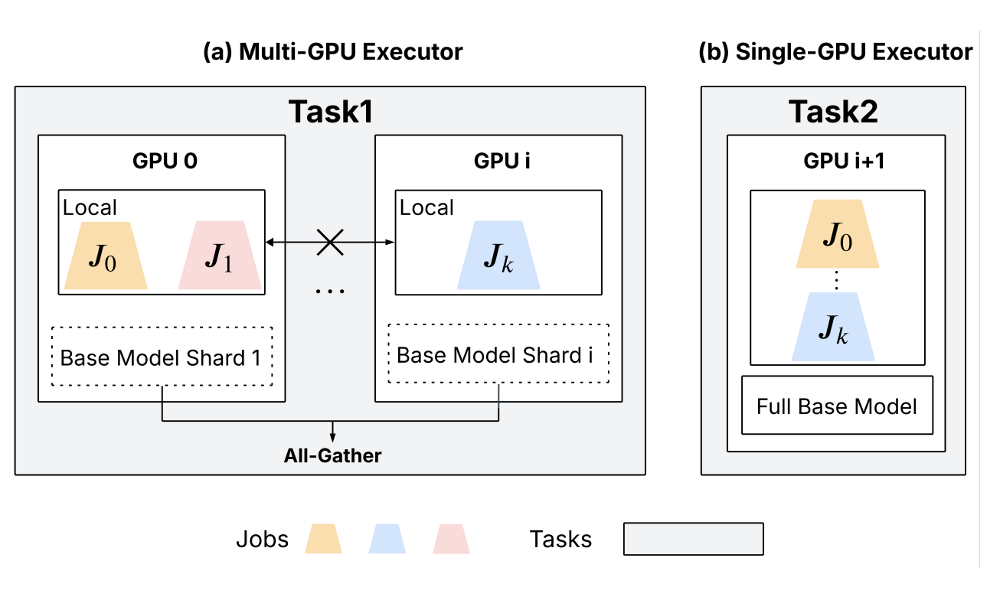
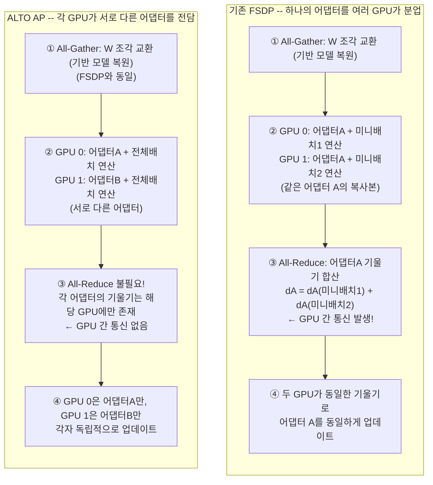
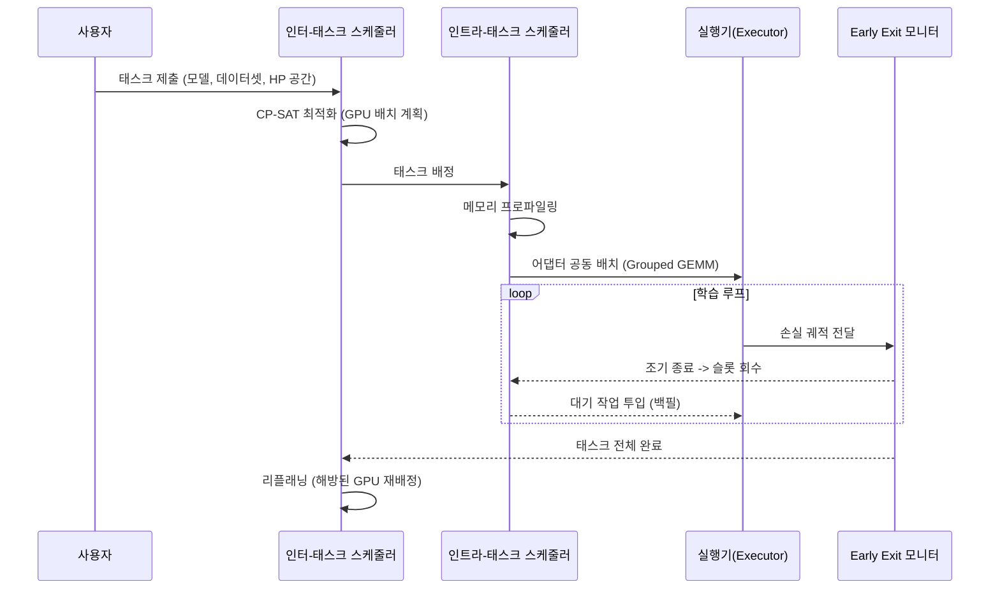
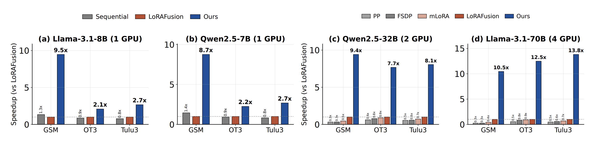
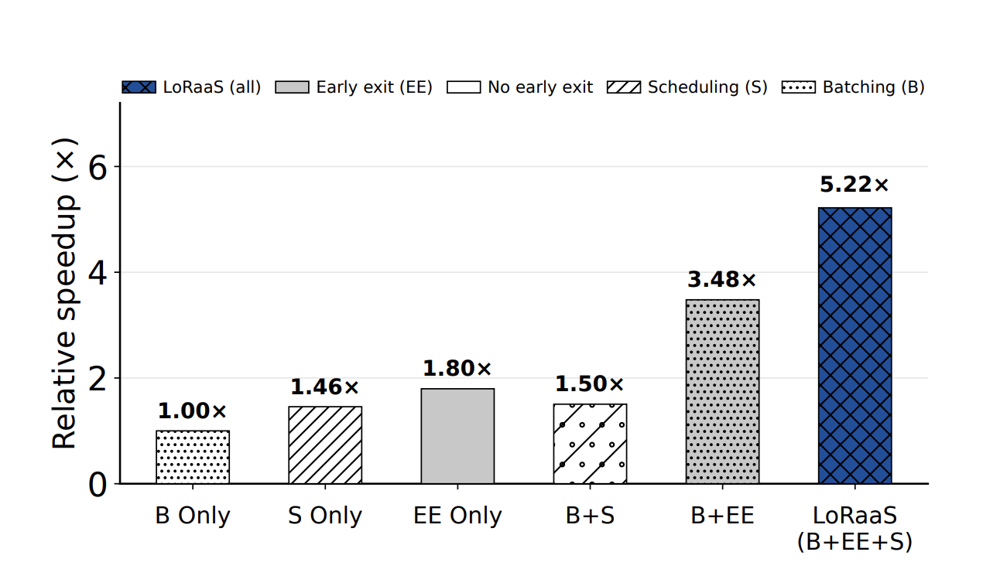
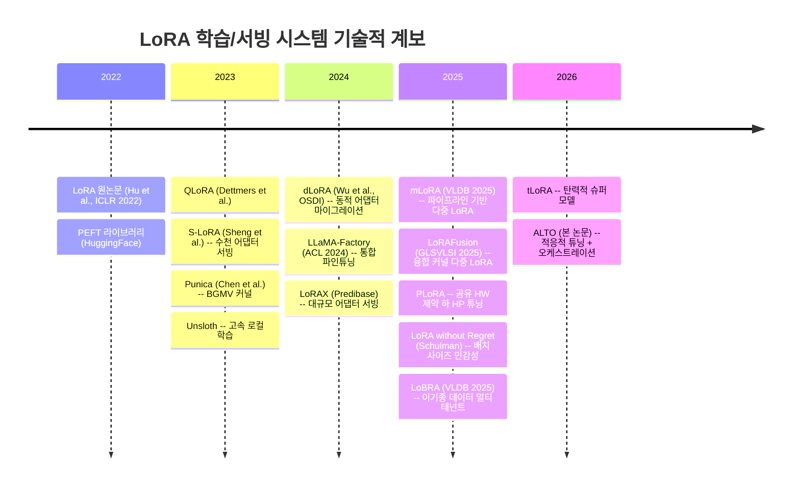
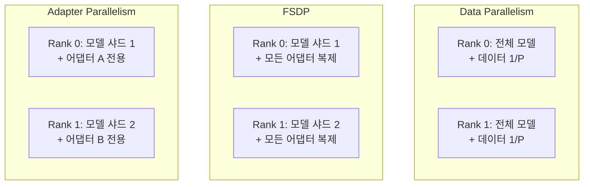

# ALTO: 이기종 LoRA 학습 워크로드를 위한 적응적 튜닝 및 오케스트레이션 -- 종합 분석 보고서

> **원논문**: *ALTO: Adaptive LoRA Tuning and Orchestration for Heterogeneous LoRA Training Workloads*
> **저자**: Jingwei Zuo\*, Xinze Feng\*, Zien Liu, Kaijian Wang, Fanjiang Ye, Ye Cao, Zhuang Wang, Yuke Wang
> **소속**: Rice University (\*공동 1저자)
> **출처**: arXiv:2604.05426v1 [cs.LG] (2026.04.07)
> **보고서 작성일**: 2026.04.10

> **[주석] "이기종(Heterogeneous)"이란?** 동일하지 않은 여러 종류가 섞여 있다는 뜻이다. 이 논문에서 "이기종 LoRA 학습 워크로드"란, 서로 다른 기반 모델(Llama-8B, Qwen-32B 등), 서로 다른 데이터셋(수학, 명령 수행, 추론 등), 서로 다른 HP 설정(학습률, 랭크, 배치 사이즈), 서로 다른 GPU 요구량(1~4 GPU)이 혼재하는 실제 클라우드 환경의 학습 작업 묶음을 의미한다. 반대인 "동종(Homogeneous)"은 모든 작업이 동일한 모델, 데이터셋, 설정을 사용하는 경우이다.

---

## 목차

1. [배경 및 문제 정의](#1-배경-및-문제-정의)
2. [핵심 방법론 상세 설명](#2-핵심-방법론-상세-설명)
   - 2.1 [Loss-Aware Early Exit](#21-loss-aware-early-exit-손실-인식-조기-종료)
   - 2.2 [Batched Multi-LoRA Execution](#22-batched-multi-lora-execution배치-다중-lora-실행)
   - 2.3 [Adapter Parallelism](#23-adapter-parallelism어댑터-병렬화)
   - 2.4 [Hierarchical Scheduling](#24-hierarchical-scheduling계층적-스케줄링)
3. [실험 결과 요약](#3-실험-결과-요약)
4. [관련 스토리 및 실제 영향](#4-관련-스토리-및-실제-영향)
5. [기술적 배경 지식](#5-기술적-배경-지식)
6. [논문의 한계 및 향후 전망](#6-논문의-한계-및-향후-전망)
7. [참고문헌 및 관련 자료](#7-참고문헌-및-관련-자료)

---

## 1. 배경 및 문제 정의

> **TL;DR**: LoRA 파인튜닝은 하이퍼파라미터에 극도로 민감하여 체계적 탐색이 필수적이지만, 기존 시스템은 개별 작업을 독립적으로 처리하여 GPU 자원을 심각하게 낭비한다. ALTO는 다중 LoRA 하이퍼파라미터 튜닝을 하나의 통합 시스템 워크로드로 재구성하여 최대 13.8배 속도 향상을 달성한다.

### 1.1 LoRA 파인튜닝의 부상

Low-Rank Adaptation(LoRA)은 대규모 언어 모델(LLM)의 파라미터 효율적 파인튜닝(PEFT) 방법 중 가장 널리 채택된 기법이다. 사전 학습된 가중치 행렬 $W \in \mathbb{R}^{k \times n}$을 동결(freeze)한 채, 저랭크 분해 행렬 $A \in \mathbb{R}^{k \times r}$, $B \in \mathbb{R}^{r \times n}$ (단, $r \ll \min(k, n)$)만 학습하여 전체 파라미터의 1% 미만으로 도메인 특화가 가능하다. 이때 학습되는 행렬 쌍 $(A, B)$를 **LoRA 어댑터(adapter)** 라 부른다.

> **[주석] 어댑터(Adapter)란?** 기반 모델(base model) 자체는 건드리지 않고, 그 위에 얹는 작고 가벼운 학습 가능한 모듈을 어댑터라 한다. 콘센트에 여행용 변환 어댑터를 끼우듯, 기반 모델에 어댑터를 끼우면 특정 용도(의료, 법률, 코딩 등)에 맞게 동작이 바뀐다. LoRA에서 어댑터는 구체적으로 저랭크 행렬 쌍 $(A, B)$이며, 기반 모델의 각 선형 레이어에 하나씩 부착된다. 어댑터의 크기는 기반 모델의 1% 미만이므로 저장, 교체, 동시 운용이 매우 가볍다. 이 논문에서 "여러 어댑터를 동시에 학습한다"는 것은 동일한 기반 모델 위에 서로 다른 HP 설정의 $(A, B)$ 쌍들을 동시에 학습한다는 뜻이다.

2023~2024년 사이 기업의 LLM 파인튜닝 지출은 2.5배 증가하여 조직당 평균 1,800만 달러에 달했다. Azure OpenAI, AWS SageMaker, Google Vertex AI 등 주요 클라우드 플랫폼이 관리형 LoRA 파인튜닝 API를 제공하고 있어, **Training-as-a-Service(TaaS)** 모델이 산업 표준으로 자리잡고 있다.

### 1.2 세 가지 핵심 관찰

ALTO의 설계는 저자들이 대규모 실증 연구를 통해 도출한 세 가지 관찰에 기반한다.

| 관찰                    | 핵심 내용                                                  | 시스템적 시사점                                  |
| ----------------------- | ---------------------------------------------------------- | ------------------------------------------------ |
| **Observation 1** | LoRA 하이퍼파라미터(HP) 튜닝은 필수이나 막대한 중복을 유발 | 조기 종료(Early Exit)로 불필요한 연산 제거 가능  |
| **Observation 2** | 작은 배치가 통계적으로 유리하나 GPU 활용도가 낮음          | 다중 어댑터 배칭(Adapter Batching)으로 해결 가능 |
| **Observation 3** | LoRA 작업의 실행 시간이 사전에 예측 가능                   | 최적 스케줄링(Makespan Optimization)이 가능      |

> **[주석]** 이후 본 보고서에서 **HP**는 **하이퍼파라미터(Hyperparameter)** 의 약어로 사용한다. LoRA 학습에서 주요 HP는 학습률(learning rate), 배치 사이즈(batch size), LoRA 랭크(rank) 등이다.

**Observation 1 -- HP 민감성**: 165개 하이퍼파라미터 설정에 대한 실험에서, 최고-최저 설정 간 GSM8K 정확도 차이가 최대 73.9%에 달했다. DPO(Direct Preference Optimization) 실험에서도 보상 정확도가 26.7%까지 벌어졌다. 최적 HP는 모델과 데이터셋에 따라 달라지며, 보편적 경험 법칙(rule of thumb)이 존재하지 않는다.

**Observation 2 -- 배치 사이즈 딜레마**: 아래 그래프와 같이 LoRA 파인튜닝은 작은 배치 사이즈(1~16)에서 가장 좋은 수렴 성능을 보인다. 그러나 단일 LoRA 어댑터를 배치 사이즈 1로 학습하면 H100 GPU 메모리의 15%만 사용하고, SM(Streaming Multiprocessor) 활성율은 7.7%에 불과하다.

> **[주석]** SM 활용도(SM Occupancy)란 GPU의 실제 연산 유닛이 유의미한 작업을 수행하는 비율이다. 7.7%라 함은 GPU 연산 능력의 92.3%가 놀고 있다는 뜻이다. 이는 LoRA의 저랭크 행렬이 매우 작아 GPU의 대규모 병렬 연산 능력을 충분히 활용하지 못하기 때문이다.

**Observation 3 -- 예측 가능성**: LLM 서빙 워크로드와 달리, LoRA 파인튜닝 작업은 설정 수, 설정당 스텝 수, 스텝당 학습 시간을 사전에 알 수 있어 실행 시간을 안정적으로 추정할 수 있다. 이는 오프라인 최적화 기반 스케줄링의 기회를 제공한다.

### 1.3 기존 시스템의 한계

"기존 시스템이 개별 작업을 독립적으로 처리한다"는 것은 다음을 의미한다: 예컨대 60개의 HP 설정을 시도해야 할 때, 기존 시스템은 60개 학습 작업을 한 번에 하나씩 순차 실행한다. 작업 간에 동결된 기반 모델의 순방향 패스를 공유하지 않고, 어떤 설정이 발산하거나 성능이 나빠도 끝까지 돌리며, 작은 배치로 GPU가 15%만 사용되어도 남은 85% 용량에 다른 작업을 올리지 않는다. 즉, 작업 간 관계를 전혀 활용하지 못하고 자원을 낭비하는 것이다.

| 시스템                         | 유형                 | 한계점                                        |
| ------------------------------ | -------------------- | --------------------------------------------- |
| PEFT / LLaMA-Factory / Unsloth | LoRA 학습 프레임워크 | HP 민감성 미인식, 순차 실행, 단일 작업        |
| mLoRA                          | 다중 LoRA 학습       | 파이프라인 병렬화의 스테이지 불균형           |
| LoRAFusion                     | 다중 LoRA 학습       | 융합 커널에서 cuBLAS 성능 손실, FLOP 낭비     |
| S-LoRA / Punica                | 다중 LoRA 서빙       | 추론 전용 커널, 역방향 패스 미지원            |
| FSDP                           | 분산 학습            | 글로벌 배치 < 월드 사이즈일 때 유휴 랭크 발생 |

> **[주석] 각 시스템 설명**
>
> - **PEFT**: HuggingFace가 개발한 파라미터 효율적 파인튜닝 라이브러리. LoRA, Prefix-Tuning 등 다양한 PEFT 기법을 통합 제공하며, 사실상 LoRA 파인튜닝의 표준 인터페이스이다.
> - **LLaMA-Factory**: 100개 이상 LLM의 파인튜닝을 지원하는 통합 프레임워크 (ACL 2024). GUI 기반으로 초보자도 쉽게 LoRA 학습을 수행할 수 있으나, 한 번에 하나의 작업만 처리한다.
> - **Unsloth**: LoRA 파인튜닝의 속도를 2~5배 높인 로컬 학습 도구. 커스텀 커널과 메모리 최적화로 단일 GPU에서의 학습 효율이 뛰어나지만, 다중 작업 동시 실행이나 HP 탐색 기능이 없다.
> - **mLoRA**: 파이프라인 병렬화와 배치 LoRA 연산자를 활용한 다중 LoRA 학습 시스템 (VLDB 2025). 여러 어댑터를 동시에 학습하지만, 파이프라인 스테이지 간 작업량 불균형으로 효율이 떨어진다.
> - **LoRAFusion**: Base GEMM과 LoRA GEMM을 하나의 Triton 커널로 융합한 다중 LoRA 학습 시스템 (GLSVLSI 2025). 커널 런치 횟수를 줄이지만, cuBLAS보다 10-20% 느린 Triton으로 Base GEMM까지 처리하고, 서로 다른 어댑터의 배치를 넓은 행렬로 합쳐 불필요한 연산(FLOP)을 유발한다.
> - **S-LoRA**: 수천 개의 LoRA 어댑터를 단일 GPU에서 동시에 서빙하는 시스템. 페이지 기반 통합 메모리 관리로 어댑터를 효율적으로 스왑하지만, 추론(서빙) 전용이므로 학습에 필요한 역방향 패스를 지원하지 않는다.
> - **Punica**: 다중 테넌트 LoRA 서빙을 위한 BGMV(Batched Gather Matrix-Vector) 커널을 제안한 시스템 (MLSys 2024). 디코딩 단계의 벡터 연산에 최적화되어 있어, 배치 행렬 곱이 필요한 학습에는 적용 불가하다.
> - **FSDP (Fully Sharded Data Parallelism)**: PyTorch의 분산 학습 표준. 모델 파라미터, 기울기, 옵티마이저 상태를 GPU들에 걸쳐 샤딩하여 메모리를 절약하지만, 글로벌 배치 사이즈가 GPU 수보다 작으면 일부 GPU가 할 일 없이 유휴 상태가 된다.

### 1.4 ALTO 시스템 개요

ALTO는 위 세 관찰에 대응하는 세 가지 기법을 공동 설계(co-design)한 통합 LoRA 학습 시스템이다.





---

## 2. 핵심 방법론 상세 설명

> **TL;DR**: ALTO는 (1) 손실 궤적 기반 3가지 패턴 탐지로 조기 종료, (2) Decoupled Grouped GEMM으로 다중 어댑터 배칭, (3) Rank-Local Adapter Parallelism으로 멀티 GPU 확장, (4) CP-SAT 기반 계층적 스케줄링을 결합한다.

### 2.1 Loss-Aware Early Exit (손실 인식 조기 종료)

ALTO는 학습 중 손실 궤적(loss trajectory)을 모니터링하여 세 가지 비효율 패턴을 자동 탐지하고 조기 종료한다.



#### 2.1.1 온라인 패턴 기반 탐지

학습 손실은 지수 이동 평균(EMA)으로 평활화하여 노이즈를 제거한다:

$$
\hat{\ell}_t = \alpha \cdot \ell_t + (1 - \alpha) \cdot \hat{\ell}_{t-1}
$$

> **[주석]** EMA(Exponential Moving Average)는 최근 값에 더 높은 가중치를 부여하는 이동 평균이다. $\alpha$가 클수록 최근 값에 민감하고, 작을수록 더 많은 과거를 반영한다. 학습 손실의 순간적 진동을 완화하여 안정적인 추세 판단을 가능케 한다.

**패턴 1 -- 발산(Divergence)**: 과도한 학습률 등으로 학습 손실과 검증 손실이 동시에 상승하는 경우. 최근 $w$개 손실 값에 선형 회귀를 적용하여 기울기를 계산한다.

$$
s_{\text{train}} = \text{linregSlope}(\hat{\ell}_{\text{train}}[-w:]), \quad s_{\text{val}} = \text{linregSlope}(\ell_{\text{val}}[-w:])
$$

두 기울기 모두 임계값 $\tau_{\text{slope}}$를 초과하는 상태가 $p_{\text{div}}$번 연속되면 즉시 종료한다.

**패턴 2 -- 과적합(Overfitting)**: 학습 손실은 감소하나 검증 손실은 상승하는 경우. 격차 비율(gap ratio)을 모니터링한다:

$$
g = \frac{\ell_{\text{val}} - \hat{\ell}_{\text{train}}}{\hat{\ell}_{\text{train}}}
$$

$g$가 임계값 $\tau_{\text{gap}}$를 $p_{\text{ovf}}$번 연속 초과하면, 최적 검증 손실 시점의 체크포인트를 저장하고 종료한다.

**패턴 3 -- 성능 부진(Underperforming)**: 다른 설정 대비 지속적으로 뒤처지는 경우. 워밍업 경계에서만 평가하며, 검증 손실 기준 하위 (1 - select_ratio) 비율의 설정을 제거한다.

> **[주석] 왜 성능 부진 탐지는 워밍업 경계에서만 수행하는가?** 패턴 1(발산)과 패턴 2(과적합)는 단일 어댑터의 손실 곡선만 보면 판단할 수 있는 "절대적" 패턴이다. 손실이 올라가거나 학습-검증 격차가 벌어지면 해당 어댑터 자체가 문제인 것이다. 반면 패턴 3(성능 부진)은 "다른 어댑터들보다 상대적으로 뒤처진다"는 **상대 비교**가 필요하다. 이 비교가 공정하려면 모든 후보가 동일한 스텝 수만큼 학습된 시점이어야 한다. 따라서 모든 후보가 일정량의 학습을 마친 워밍업 경계(전체 스텝의 5%)에서 한 번에 랭킹을 매겨 하위권을 탈락시키는 것이다. 본학습(continue-training) 단계에서는 어댑터별 진행 속도가 달라 공정한 비교가 어려우므로, 패턴 1과 패턴 2만 계속 모니터링한다.

#### 2.1.2 Loss-Aware Pattern Detection의 동작 흐름

세 가지 패턴 탐지가 학습의 어느 시점에 적용되는지 정리하면 다음과 같다.

ALTO는 하나의 태스크(태스크 = 기반 모델 + 데이터셋의 조합) 학습을 **워밍업 단계**와 **본학습 단계**로 나눈다. 워밍업 단계에서는 세 가지 패턴을 모두 감시한다. 매 평가 스텝마다 패턴 1(발산)과 패턴 2(과적합)를 확인하여 즉시 문제 있는 설정을 제거하고, 워밍업이 끝나는 시점에 패턴 3(성능 부진)을 한 번 적용하여 상대적으로 뒤처지는 설정을 추가로 탈락시킨다. 본학습 단계로 진입한 뒤에는 패턴 1과 패턴 2만 지속적으로 모니터링하며, 패턴 3은 더 이상 적용하지 않는다. 이는 본학습에서는 살아남은 소수의 우수 설정만 학습하고, 이들 사이의 상대 비교보다는 개별 설정의 절대적 건전성(발산하지 않는가, 과적합하지 않는가)을 감시하는 것이 더 효과적이기 때문이다.

| 학습 단계                         |     패턴 1 (발산)     |    패턴 2 (과적합)    |     패턴 3 (성능 부진)     |
| --------------------------------- | :-------------------: | :-------------------: | :-------------------------: |
| **워밍업** (전체 스텝의 5%) | 매 평가 스텝마다 감시 | 매 평가 스텝마다 감시 | 워밍업 종료 시점에 1회 적용 |
| **본학습** (나머지 95%)     | 매 평가 스텝마다 감시 | 매 평가 스텝마다 감시 |         적용 안 함         |

#### 2.1.3 워밍업 기반 필터링

> **[주석] 태스크와 잡의 정의** 원논문은 이 두 용어를 명확히 구분한다. **태스크(Task)** = 하나의 기반 모델 + 하나의 데이터셋 조합으로, 고품질 LoRA 어댑터를 얻는 것이 목표이다. 예: "Llama-3.1-8B + GSM8K"가 하나의 태스크. **잡(Job)** = 특정 HP 설정 하나로 어댑터를 학습하는 단일 실행이다. 예: "학습률 5e-5, 랭크 32, 배치 4"가 하나의 잡. 따라서 하나의 태스크는 여러 개의 잡으로 구성된다.

ALTO는 각 태스크를 **워밍업 단계**와 **본학습 단계**로 나눈다. 하나의 태스크에 대해 $K$개의 후보 HP 설정(= 잡)이 있다.

> **[주석] K개 후보 설정은 어떻게 도출되는가?** K개 후보는 랜덤 선택이 아니라, 사전에 정의된 **그리드 서치(grid search)** 공간의 전체 조합이다. 예를 들어 단일 GPU 실험에서는 학습률 5종 {1e-5, 5e-5, 2e-4, 3e-4, 5e-4} x LoRA 랭크 3종 {16, 32, 64} x 배치 사이즈 4종 {1, 2, 4, 8} = **60개** 설정이 K가 된다. 멀티 GPU 실험에서는 학습률 4종 x 랭크 4종 x 배치 4종 = **64개**이다. 사용자가 ALTO API를 호출할 때 `search_space` 파라미터로 이 탐색 공간을 직접 지정한다(Listing 1 참고).

이 $K$개 후보가 워밍업을 거치면서:

1. 워밍업 중에도 온라인 패턴 탐지(패턴 1, 2)가 활성화되어, 명확히 발산하는 HP 설정을 즉시 제거
2. 제거된 슬롯에 대기 중인 다른 후보를 즉시 투입하여 전체 $K$개 후보를 순환 탐색 (GPU 메모리 제약으로 동시에 모든 후보를 올릴 수 없으므로, 일부만 동시 학습하고 나머지는 대기열에서 교대)
3. 워밍업 경계에서 패턴 3(성능 부진)을 적용: 살아남은 후보를 검증 손실로 랭킹하여 상위 $k$개(= 전체의 25%)만 본학습으로 진입

저자들의 랭크 상관 분석(Appendix A.2)에 따르면, 전체 스텝의 5%만 워밍업해도 최종 성능 랭킹과의 Spearman 상관계수가 0.7 이상이며, 최종 최적 설정이 상위 25% 안에 항상 포함된다.

> **[주석] 워밍업 비율은 어떻게 정해지는가?** 저자들은 워밍업 비율을 1%부터 20%까지 변화시키며 7개 모델-데이터셋 조합에서 세 가지 지표를 측정했다:
>
> |      워밍업 비율      |   Spearman 랭크 상관   | Top-25% 커버리지 | 최적 설정이 Top-25%에 포함? |
> | :-------------------: | :--------------------: | :--------------: | :-------------------------: |
> |         1~2%         |     < 0.5 (불안정)     |       낮음       |          일부 누락          |
> | **5% (기본값)** | **> 0.7 (안정)** | **60~80%** |  **모든 경우 포함**  |
> |        10~20%        |         > 0.7         |      60~80%      |       모든 경우 포함       |
>
> 2% 이하에서는 학습이 너무 짧아 설정 간 순위가 아직 확립되지 않아 랭킹이 불안정하다. 5%에서 모든 지표가 안정화되므로 이를 기본값으로 채택했다. 10% 이상으로 늘려도 예측 품질은 개선되지 않으면서 조기 종료 판단만 늦어져 자원이 낭비된다. 즉 5%는 "너무 짧아서 판단이 부정확한 것"과 "너무 길어서 자원을 낭비하는 것" 사이의 최적 지점이다.

> **[주석] 온라인 패턴 탐지는 얼마나 자주 실행되는가?** 패턴 1(발산)과 패턴 2(과적합)는 **매 평가 스텝(evaluation step)** 마다 실행된다. 평가 스텝 간격은 학습 프레임워크의 설정(`eval_steps`)에 따르며, 논문에서는 구체적 간격을 명시하지 않는다. 다만 탐지기의 핵심 파라미터인 윈도우 $w = 2$, 인내값 $p = 2$로부터 동작 방식을 알 수 있다: 최소 2번의 평가 결과가 쌓인 후 기울기를 계산하고, 그 기울기가 2번 연속 임계값을 초과해야 종료가 발동한다. 따라서 가장 빠른 경우 평가 4회차에서 최초로 조기 종료가 가능하다. 이는 의도적으로 보수적인 설계로, 일시적 손실 변동에 의한 오판을 방지한다.

#### 2.1.4 Algorithm 1: Loss-Aware Pattern Detection

```
Algorithm 1: Loss-Aware Pattern Detection
-------------------------------------------
입력: EMA 학습 손실 l_train_hat, 원본 검증 손실 l_val,
      윈도우 w, 임계값 tau_slope, tau_gap, 인내값 p_div, p_ovf

[발산 탐지]
1: if |l_train_hat| >= w AND |l_val| >= w then
2:   s_train <- linregSlope(l_train_hat[-w:])
3:   s_val   <- linregSlope(l_val[-w:])
4:   cnt_div <- (s_train >= tau_slope AND s_val >= tau_slope) ? cnt_div+1 : 0
5:   if cnt_div >= p_div then return EXIT(diverging)

[과적합 탐지]
6: g <- (l_val[-1] - l_train_hat[-1]) / l_train_hat[-1]
7: cnt_ovf <- (g > tau_gap) ? cnt_ovf+1 : 0
8: if cnt_ovf >= p_ovf then
9:   checkpoint(best_val_loss_model)
10:  return EXIT(overfitting)

[성능 부진 탐지 -- 워밍업 경계에서만]
11: if warmup_finished then
12:   ranked <- sortByValLoss(all_surviving_adapters)
13:   k <- ceil(select_ratio * |ranked|)
14:   for adapter in ranked[k:] do return EXIT(underperforming)
```

| 파라미터                | 기본값 | 설명                               |
| ----------------------- | ------ | ---------------------------------- |
| $w$                   | 2      | 기울기 계산에 사용하는 윈도우 크기 |
| $\tau_{\text{slope}}$ | 0.001  | 발산 감지 기울기 임계값            |
| $\tau_{\text{gap}}$   | 0.1    | 과적합 감지 격차 비율 임계값       |
| $p_{\text{div}}$      | 2      | 발산 인내 횟수                     |
| $p_{\text{ovf}}$      | 2      | 과적합 인내 횟수                   |
| warmup ratio            | 5%     | 전체 스텝 중 워밍업 비율           |
| select ratio            | 25%    | 워밍업 후 선택 비율                |

### 2.2 Batched Multi-LoRA Execution(배치 다중 LoRA 실행)

#### 2.2.1 Decoupled Base-LoRA 실행

모든 LoRA 어댑터는 동일한 동결 기반 모델을 공유하므로, 단일 순방향 패스로 여러 어댑터를 동시에 서비스할 수 있다. 핵심 관찰은 두 경로의 연산 특성이 근본적으로 다르다는 점이다:

| 경로                | 연산                   | 병목                                       |
| ------------------- | ---------------------- | ------------------------------------------ |
| **Base GEMM** | $Y = XW$             | Compute-bound (큰 가중치 행렬)             |
| **LoRA GEMM** | $S = XA$, $L = SB$ | Memory-bandwidth-bound (저랭크$r \ll H$) |

ALTO는 이 비대칭성을 활용하여 두 경로를 독립적으로 처리한다:

1. **Base GEMM**: 연결된 배치에 대해 cuBLAS로 실행 (최대 성능 보존)
2. **LoRA Down(A)**: Triton Grouped GEMM으로 $\{S_i = X_i A_i\}$를 단일 커널 런치로 실행
3. **LoRA Up(B) + Fuse**: 융합 GEMM-Add $Y = S_i B_i + Y_{\text{base}}$를 단일 커널로 실행

> **[주석] GEMM, cuBLAS, 커널 런치란?**
>
> **GEMM(General Matrix Multiply)** 은 $C = \alpha AB + \beta C$ 형태의 행렬 곱셈으로, 딥러닝의 거의 모든 연산(선형 레이어, 어텐션 등)이 결국 GEMM으로 귀결된다. GPU는 수천 개의 코어로 행렬 곱셈을 병렬 처리하는 데 특화되어 있다.
>
> **cuBLAS**는 NVIDIA가 제공하는 GPU용 선형대수 라이브러리로, GEMM의 "공식 최적 구현"이다. 수십 년간 하드웨어에 맞춰 튜닝되어 있어 대형 행렬 곱셈에서 최고 성능을 낸다. 기반 모델의 가중치 행렬은 수천x수천 크기의 대형 행렬이므로 cuBLAS가 최적이다.
>
> **Triton**은 OpenAI가 만든 GPU 프로그래밍 언어로, cuBLAS처럼 미리 만들어진 함수를 쓰는 대신 커스텀 연산을 직접 작성할 수 있다. LoRA의 작은 행렬 여러 개를 묶어 한번에 처리하는 Grouped GEMM 같은 특수 연산은 cuBLAS에 없으므로 Triton으로 직접 구현한다.
>
> **커널(Kernel)** 이란 GPU에서 실행되는 하나의 함수/프로그램이다. **커널 런치(Kernel Launch)** 는 CPU가 GPU에게 "이 커널을 실행하라"고 명령을 보내는 과정이다. **커널 런치 오버헤드**가 문제인 이유는 다음과 같다:
>
> ```
> [커널 런치 1회의 비용]
> CPU -> GPU 명령 전송: ~5-10 마이크로초
> GPU 스케줄러 설정:   ~2-5 마이크로초
> 실제 연산 시작:      그제서야 GPU 코어가 일을 시작
> ```
>
> LoRA의 저랭크 행렬 곱셈은 행렬이 작아서 실제 연산 자체가 수 마이크로초밖에 안 걸린다. 그런데 매번 커널을 따로 런치하면 "명령 전송 + 설정" 시간이 "실제 연산" 시간보다 더 클 수 있다. 이것이 커널 런치 오버헤드이다.

> **[주석] mLoRA vs ALTO: 구체적으로 무엇이 다른가?**
>
> 어댑터 N개가 있고, 각 어댑터는 LoRA Down ($S_i = X_i A_i$), LoRA Up ($L_i = S_i B_i$), Base 출력 더하기 ($Y_i = L_i + Y_{\text{base}}$) 총 3단계를 거친다.
>
> **mLoRA 방식** -- 어댑터마다 개별 커널을 런치:
>
> ```
> 레이어 1개 처리 시:
>   어댑터 1: 커널런치(X1*A1) -> 커널런치(S1*B1) -> 커널런치(L1+Ybase)
>   어댑터 2: 커널런치(X2*A2) -> 커널런치(S2*B2) -> 커널런치(L2+Ybase)
>   ...
>   어댑터 N: 커널런치(XN*AN) -> 커널런치(SN*BN) -> 커널런치(LN+Ybase)
>   -> 총 3N번 커널 런치 (N=32이면 96번!)
> ```
>
> **ALTO 방식** -- 모든 어댑터를 묶어서 2번만 런치:
>
> ```
> 레이어 1개 처리 시:
>   커널런치 1회: Grouped GEMM으로 {X1*A1, X2*A2, ..., XN*AN} 한꺼번에 계산
>   커널런치 1회: Grouped Fused GEMM-Add로 {S1*B1+Ybase, S2*B2+Ybase, ...} 한꺼번에 계산
>   -> 총 2번 커널 런치 (N=32여도 2번!)
> ```
>
> Grouped GEMM은 하나의 커널 안에서 N개 어댑터의 행렬 곱셈을 각각의 스레드 블록에 배정하여 동시에 실행한다. 어댑터별 배치 사이즈나 랭크가 달라도 패딩 없이 처리할 수 있도록 스케줄 테이블을 사전에 구성한다.

기존 시스템과의 비교:

| 시스템         | Base GEMM                    | LoRA 경로            | 커널 런치 수 | 문제점                                                                                                                      |
| -------------- | ---------------------------- | -------------------- | ------------ | --------------------------------------------------------------------------------------------------------------------------- |
| mLoRA          | cuBLAS (최적)                | 어댑터마다 개별 커널 | O(3N)/layer  | 런치 오버헤드, 낮은 SM 활용                                                                                                 |
| LoRAFusion     | Triton 융합 (Base+LoRA 통합) | Triton 융합          | O(1)/layer   | Base GEMM까지 Triton으로 처리하여 cuBLAS 대비 10-20% 성능 하락, 서로 다른 어댑터 배치를 넓은 행렬로 합쳐 불필요한 FLOP 발생 |
| **ALTO** | cuBLAS (최적)                | Triton Grouped GEMM  | O(1)/layer   | Base는 cuBLAS 최고 성능 유지, LoRA는 Grouped로 런치 횟수 최소화 -- 두 장점을 모두 취함                                      |

#### 2.2.2 역방향 패스

학습의 역방향 패스도 효율적으로 처리한다:

- **입력 기울기**: $dS = \text{scale} \cdot dY \cdot B_i^{\top}$, $dX = dS \cdot A_i^{\top}$ -- 동일한 Grouped Triton 커널로 O(1) 런치
- **가중치 기울기**: $dA_i = X_i^{\top} \cdot dS_i$, $dB_i = S_i^{\top} \cdot dY_i$ -- `grouped_mm`으로 O(1) 런치
- 순방향 중간값 $S$를 캐시하여 재계산을 방지 (메모리-연산 트레이드오프)

### 2.3 Adapter Parallelism(어댑터 병렬화)

기반 모델이 단일 GPU 메모리를 초과하면 분산 학습이 필수적이다. ALTO는 FSDP로 기반 모델을 샤딩하되, 기존과 근본적으로 다른 접근을 취한다.



#### 2.3.1 All-Gather와 All-Reduce: 분산 통신 기본 연산

두 방식의 차이를 이해하려면 먼저 GPU 간 통신의 두 핵심 연산을 알아야 한다.

> **[주석] All-Gather와 All-Reduce**
>
> **All-Gather**: 각 GPU가 자기 조각(shard)을 전체 GPU에 **브로드캐스트**하여, 모든 GPU가 완전한 데이터를 갖게 하는 연산이다. "흩어진 퍼즐 조각을 모아서 각자 완성된 그림을 갖는 것"과 같다. FSDP에서 기반 모델 가중치 $W$는 GPU 메모리 절약을 위해 조각조각 나뉘어 저장되어 있으므로, 특정 레이어의 연산을 수행하기 직전에 All-Gather로 해당 레이어의 완전한 가중치를 임시 복원한다.
>
> ```
> All-Gather 예시 (GPU 2개, 모델 가중치 W를 절반씩 저장):
>
>   [실행 전]                         [All-Gather 후]
>   GPU 0: W의 앞절반                 GPU 0: W 전체 (임시)
>   GPU 1: W의 뒷절반                 GPU 1: W 전체 (임시)
>                  ──────────→
>            각자 가진 조각을 교환         연산 수행 후 임시 복사본 해제
> ```
>
> **All-Reduce**: 각 GPU가 가진 값을 모두 **합산**하여, 합산 결과를 모든 GPU에 배포하는 연산이다. "각자 채점한 점수를 모아 평균 내서 모두에게 알려주는 것"과 같다. 분산 학습에서 각 GPU가 서로 다른 데이터 조각으로 계산한 기울기(gradient)를 합산하여 동일한 업데이트를 적용하기 위해 사용된다.
>
> ```
> All-Reduce 예시 (GPU 2개, 어댑터 A의 기울기):
>
>   [실행 전]                         [All-Reduce 후]
>   GPU 0: dA(미니배치1) = 0.3        GPU 0: dA(합산) = 0.3 + 0.5 = 0.8
>   GPU 1: dA(미니배치2) = 0.5        GPU 1: dA(합산) = 0.3 + 0.5 = 0.8
>                  ──────────→
>           각자 계산한 기울기를 합산      두 GPU가 동일한 기울기로 어댑터 업데이트
> ```

#### 2.3.2 기존 FSDP 방식의 문제: "하나의 어댑터를 여러 GPU가 분업"

기존 FSDP에서 하나의 HP 설정(예: lr=1e-5, rank=32, batch=4)에 대한 어댑터 학습은 다음과 같이 진행된다. 배치 사이즈 4의 데이터를 GPU 2개에 2개씩 나눠서 처리한다. 즉 **하나의 어댑터에 대해 여러 GPU가 데이터를 분할 처리**하는 데이터 병렬화 방식이다.

```
FSDP: 어댑터 A 하나를 GPU 2개로 학습 (배치=4, GPU당 2개씩)

[순방향 패스 -- 레이어 l 처리]

  ① All-Gather: W_l의 조각을 교환 → 두 GPU 모두 완전한 W_l 확보

  ② 기반 모델 연산 (각자 자기 데이터로):
     GPU 0: Y_base = X(미니배치1) × W_l
     GPU 1: Y_base = X(미니배치2) × W_l

  ③ LoRA 연산 (같은 어댑터 A의 복사본으로):
     GPU 0: Y = Y_base + X(미니배치1) × A × B     ← A, B는 GPU 0의 복사본
     GPU 1: Y = Y_base + X(미니배치2) × A × B     ← A, B는 GPU 1의 복사본 (동일)

[역방향 패스]

  ④ 각 GPU가 자기 미니배치로 기울기 계산:
     GPU 0: dA₀, dB₀ (미니배치 1에서 계산한 어댑터 기울기)
     GPU 1: dA₁, dB₁ (미니배치 2에서 계산한 어댑터 기울기)

  ⑤ All-Reduce: 어댑터 기울기를 합산하여 동기화
     GPU 0: dA = dA₀ + dA₁        ← 통신 발생!
     GPU 1: dA = dA₀ + dA₁        ← 통신 발생!

  ⑥ 두 GPU가 동일한 합산 기울기로 어댑터 A를 업데이트
     → 다음 스텝에서도 두 GPU의 A, B가 동일하게 유지됨
```

이 방식의 핵심 문제는 세 가지이다:

1. **배치가 작으면 GPU가 논다**: 배치 사이즈가 1인데 GPU가 2개이면, 1개의 데이터를 2개로 나눌 수 없으므로 GPU 1개가 완전히 유휴 상태가 된다. GPU가 4개이면 3개가 논다.
2. **어댑터 기울기 All-Reduce 통신**: 매 스텝마다 dA, dB를 GPU 간에 교환해야 한다. 어댑터 연산 자체가 마이크로초 단위로 빠른데, 통신 오버헤드가 상대적으로 크다.
3. **어댑터 가중치 중복**: 모든 GPU가 동일한 A, B 복사본을 메모리에 들고 있으므로, 매번 HBM에서 SRAM으로 로드할 때 P개 GPU에서 P번 중복 전송이 발생한다.

> **[주석]** HBM-to-SRAM 전송이란 GPU의 고대역 메모리(HBM)에서 실제 연산이 이루어지는 스트리밍 멀티프로세서(SM)의 레지스터/공유 메모리(SRAM)로 데이터를 로드하는 과정이다. LoRA 파인튜닝은 대부분의 시간이 기반 모델 가중치를 HBM에서 SRAM으로 로드하는 데 소비되므로, 중복 전송을 제거하는 것이 성능에 결정적이다.

#### 2.3.3 ALTO의 Adapter Parallelism: "각 GPU가 서로 다른 어댑터를 전담"

Adapter Parallelism의 핵심 아이디어는 발상의 전환이다. 기존 FSDP가 "하나의 어댑터를 여러 GPU로 분업"하는 것과 달리, AP는 "각 GPU가 서로 다른 HP 설정의 어댑터를 독립적으로 담당"한다. 예를 들어 GPU 0은 어댑터 A(lr=1e-5, rank=32)를, GPU 1은 어댑터 B(lr=5e-5, rank=64)를 전담한다. 두 어댑터는 서로 독립적인 HP 설정이므로 기울기를 합산할 이유가 없다.

```
AP: 어댑터 A와 B를 각각 GPU 0, GPU 1이 전담

[순방향 패스 -- 레이어 l 처리]

  ① All-Gather: W_l의 조각을 교환 → 두 GPU 모두 완전한 W_l 확보
     (여기까지는 FSDP와 동일)

  ② 기반 모델 연산 (각자 자기 어댑터의 데이터로):
     GPU 0: Y_base = X_A × W_l       (어댑터 A의 학습 데이터)
     GPU 1: Y_base = X_B × W_l       (어댑터 B의 학습 데이터)

  ③ LoRA 연산 (각자 자기 전용 어댑터로):
     GPU 0: Y = Y_base + X_A × A₁ × B₁     ← 어댑터 A (이 GPU에만 존재)
     GPU 1: Y = Y_base + X_B × A₂ × B₂     ← 어댑터 B (이 GPU에만 존재)

[역방향 패스]

  ④ 각 GPU가 자기 어댑터의 기울기만 계산:
     GPU 0: dA₁, dB₁ (어댑터 A 전용)
     GPU 1: dA₂, dB₂ (어댑터 B 전용)

  ⑤ All-Reduce 불필요! (어댑터 기울기 통신 = 0)
     GPU 0은 어댑터 A만 갖고 있으므로, dA₁이 곧 최종 기울기
     GPU 1은 어댑터 B만 갖고 있으므로, dA₂가 곧 최종 기울기
     → 합산할 대상이 없다

  ⑥ 각 GPU가 독립적으로 자기 어댑터만 업데이트
     GPU 0: A₁ ← A₁ - lr × dA₁
     GPU 1: A₂ ← A₂ - lr × dA₂
```



> **[주석] "각 랭크가 서로 다른 어댑터를 처리한다"는 것의 의미**: FSDP에서 하나의 어댑터(= 하나의 HP 설정)를 학습할 때, 배치 데이터를 GPU 수만큼 쪼개서 각 GPU(= 랭크)에 분배하고, 각 GPU가 계산한 기울기를 합산(All-Reduce)하여 하나의 어댑터를 공동으로 업데이트한다. 반면 AP에서는 각 GPU가 서로 다른 HP 설정의 어댑터를 독립적으로 학습한다. GPU 0이 "lr=1e-5, rank=32"인 어댑터 A를, GPU 1이 "lr=5e-5, rank=64"인 어댑터 B를 맡아 각자의 전체 배치를 처리한다. 두 어댑터는 서로 다른 HP 설정이므로 기울기를 합산할 이유가 전혀 없다. 이것이 All-Reduce를 제거할 수 있는 근본적 이유이다.

#### 2.3.4 AP의 세 가지 핵심 장점 요약

| 장점                   | FSDP                            | Adapter Parallelism             |
| ---------------------- | ------------------------------- | ------------------------------- |
| 유휴 랭크              | 글로벌 배치 < P일 때 P-1개 유휴 | 항상 모든 랭크 활성             |
| 어댑터 기울기 통신     | All-Reduce 필요                 | **완전 제거** (로컬 유지) |
| 어댑터 가중치 HBM 전송 | P배 중복 (모든 랭크 복제)       | 정확히 1회 (각 랭크 고유)       |

AP는 Grouped GEMM과 자연스럽게 결합된다: 각 랭크 내에서 여러 어댑터를 공동 배치하여 단일 GPU와 멀티 GPU 효율을 모두 극대화한다.

### 2.4 Hierarchical Scheduling(계층적 스케줄링)

배치 다중 LoRA 엔진과 조기 종료는 작업이 지속적으로 진입/퇴장하는 동적 워크로드를 생성한다. ALTO는 이를 2계층 스케줄러로 관리한다. **인트라-태스크 스케줄러**는 하나의 태스크 내부에서 "어댑터를 GPU에 몇 개씩 올릴 것인가"를 결정하고, **인터-태스크 스케줄러**는 여러 태스크를 "어떤 GPU에, 언제 배치할 것인가"를 결정한다.

#### 2.4.1 온라인 그리디 인트라-태스크 스케줄링

단일 태스크 내에서 어댑터의 공동 배치(co-location) 밀도를 결정한다.

**메모리 프로파일링**: 학습 전 자동으로 경량 선형 모델을 적합:

$$
\hat{M}(B) = k_0 + k_1 \cdot B \cdot L
$$

여기서 $B$는 총 배치 사이즈, $L$은 시퀀스 길이이다. 이 모델로 런타임에 새 어댑터 추가 시 메모리 안전성을 즉시 판정한다.

**입출력 정책**:

1. 어댑터를 배치 사이즈별로 그룹화 (Grouped GEMM 효율 극대화)
2. 배치 사이즈 내림차순으로 탐욕적 투입 ($\hat{M}$이 안전 여유 이내일 때만)
3. 어댑터 종료 시, 동일 배치 사이즈의 대기 작업 우선 투입 (동종 패킹 유지)
4. 동일 배치 사이즈가 없으면 혼합 패킹으로 대체

> **[주석] 인트라-태스크 스케줄링 예시**: "Llama-3.1-8B + GSM8K" 태스크에 60개 HP 설정이 있고, GPU 1개에 어댑터 8개를 동시에 올릴 수 있다고 하자. 처음에 8개 어댑터를 올려서 학습을 시작한다. 학습 중 어댑터 3번이 발산(패턴 1)으로 조기 종료되면, 그 슬롯이 비워지고 대기열의 9번 어댑터가 즉시 투입된다. 워밍업 경계에서 하위 75%가 탈락하면 대량의 슬롯이 비워지고, 아직 워밍업을 시작하지 못한 나머지 후보들이 순차적으로 투입되어 워밍업을 거친다. 이렇게 GPU 메모리 한도 내에서 어댑터를 순환시키면서 60개 전체를 탐색한다.

#### 2.4.2 동적 인터-태스크 스케줄링

여러 태스크가 제출되면, $G$개 GPU를 태스크에 시간-공간적으로 배치하여 전체 메이크스팬(makespan)을 최소화한다.

**작업 시간 추정**: 각 태스크의 처리량(throughput)을 짧은 프로파일링으로 측정하고, 전체 샘플 수와 결합하여 예상 소요 시간을 산출:

$$
d_i = \frac{\text{total\_samples}_i}{\text{throughput}_i}
$$

##### 스트립 패킹 문제란?

> **[주석] 이기종 자원 스트립 패킹(Heterogeneous-Resource Strip-Packing) 문제**
>
> 스트립 패킹은 직관적으로 **"정해진 폭의 긴 띠(strip) 위에 다양한 크기의 직사각형 블록을 빈틈 없이 쌓아서, 띠의 총 높이(= 소요 시간)를 최소화하는 문제"** 이다. 택배 상자를 트럭에 실을 때 빈 공간을 최소화하는 것과 유사하다.
>
> ALTO의 GPU 스케줄링에 대응시키면:
>
> - **띠의 폭** = 총 GPU 개수 (예: 8개)
> - **띠의 높이** = 시간축 (아래서 위로 시간이 흐름)
> - **직사각형 블록 하나** = 하나의 태스크 (폭 = 필요한 GPU 수, 높이 = 소요 시간)
> - **"이기종(heterogeneous)"** = 블록마다 폭(GPU 요구량)과 높이(소요 시간)가 제각각
> - **목표** = 모든 블록을 띠 안에 겹치지 않게 배치하여 **총 높이(메이크스팬)를 최소화**
>
> ```
> [스트립 패킹의 직관적 이해]
>
> GPU 0  GPU 1  GPU 2  GPU 3  GPU 4  GPU 5  GPU 6  GPU 7    ← 띠의 폭 = 8 GPU
> ┌──────────────────┐ ┌───────────────────────────────┐
> │ 태스크 C (2GPU)  │ │     태스크 A (4GPU, 5시간)    │ ↑
> │     3시간        │ │                               │ │
> ├──────────────────┤ │                               │ │ 시간축
> │ 태스크 D (2GPU)  │ │                               │ │ (높이)
> │     2시간        │ ├───────────────────────────────┤ │
> ├──────────────────┤ │   태스크 E (4GPU, 1시간)      │ ↓
> │ 태스크 B (2GPU)  │ └───────────────────────────────┘
> │     1시간        │                              메이크스팬 = 6시간
> └──────────────────┘
> ```
>
> 이 그림에서 각 태스크는 서로 다른 폭(GPU 수)과 높이(소요 시간)를 가진 블록이다. 이 블록들을 빈틈 없이 채워 넣어 전체 높이를 줄이는 것이 인터-태스크 스케줄링의 목표이다. 블록 배치 순서에 따라 메이크스팬이 크게 달라질 수 있으므로 최적화가 필요하다.

##### 구체적 스케줄링 예시

다음 예시로 인터-태스크 스케줄링이 어떻게 동작하는지 단계별로 설명한다. 8개의 H100 GPU에 5개 태스크가 동시에 제출된 상황이다:

| 태스크 | 기반 모델      | 필요 GPU | 예상 소요 시간 |
| ------ | -------------- | -------- | -------------- |
| T1     | Llama-3.1-70B  | 4 GPU    | 5시간          |
| T2     | Qwen2.5-32B    | 2 GPU    | 3시간          |
| T3     | Llama-3.1-8B   | 1 GPU    | 2시간          |
| T4     | Qwen2.5-7B     | 1 GPU    | 2시간          |
| T5     | Llama-3.1-8B   | 1 GPU    | 1시간          |

**나이브한 스케줄링 (짧은 작업 우선, Shortest-Job-First)**:

```
시간  GPU0   GPU1   GPU2   GPU3   GPU4   GPU5   GPU6   GPU7
 0h  [ T5 ] [ T3        ] [ T4        ] [              T1               ]
 1h  [빈칸] [   T3      ] [   T4      ] [              T1               ]
 2h  [빈칸] [   T2             ] [빈칸] [              T1               ]
 3h  [빈칸] [빈칸] [빈칸] [빈칸] [빈칸] [              T1               ]
 4h  [빈칸] [빈칸] [빈칸] [빈칸] [빈칸] [              T1               ]
 5h  ── 완료 ──                                     메이크스팬 = 5시간

문제: T5가 1시간에 끝나면 GPU 0이 4시간 동안 유휴
      T3, T4가 2시간에 끝나면 GPU 1~2가 3시간 동안 유휴
      → GPU 시간의 상당 부분이 낭비
```

**ALTO의 CP-SAT 최적 스케줄링**:

```
시간  GPU0   GPU1   GPU2   GPU3   GPU4   GPU5   GPU6   GPU7
 0h  [         T2        ] [ T3 ] [ T4 ] [              T1               ]
 1h  [         T2        ] [ T3 ] [ T4 ] [              T1               ]
 2h  [         T2        ] [ T5 ] [빈칸] [              T1               ]
 3h  [빈칸] [빈칸] [빈칸] [빈칸] [빈칸] [              T1               ]
 4h  ... ... ... ... ... [              T1               ]
 5h  ── 완료 ──                                     메이크스팬 = 5시간

→ T2(3시간)를 먼저 시작하여 T1과 병렬 실행
→ T3, T4(각 2시간)도 T1과 병렬 실행
→ T3 종료 후 빈 GPU에 T5(1시간)를 즉시 투입
→ GPU 유휴 시간 최소화
```

**조기 종료로 인한 리플래닝**: 여기서 만약 T1이 조기 종료로 예상 5시간이 아니라 3시간에 완료되면 어떻게 되는가?

```
시간  GPU0   GPU1   GPU2   GPU3   GPU4   GPU5   GPU6   GPU7
 0h  [         T2        ] [ T3 ] [ T4 ] [              T1               ]
 1h  [         T2        ] [ T3 ] [ T4 ] [              T1               ]
 2h  [         T2        ] [ T5 ] [빈칸] [              T1               ]
 3h  [빈칸] ... ... ...       ↑ T1 조기 완료! GPU 4~7 해방!
     ── 이벤트 발생: 리플래닝 ──
     해방된 GPU 4~7에 새로 도착한 태스크 또는 대기 태스크를 즉시 배정

메이크스팬 = 3시간 (원래 5시간 → 2시간 단축)
```

이것이 이벤트 기반 리플래닝의 핵심이다. 조기 종료로 GPU가 예상보다 일찍 해방되면, CP-SAT 솔버가 즉시 재실행되어 남은 태스크를 해방된 GPU에 최적으로 배치한다.

##### CP 정식화 상세

위의 최적 배치를 자동으로 찾기 위해 ALTO는 제약 프로그래밍(Constraint Programming)으로 문제를 정식화한다.

기호 정의 (입력 파라미터):

| 기호    | 의미                                                                                        |
| ------- | ------------------------------------------------------------------------------------------- |
| $n$   | 제출된 태스크의 총 개수                                                                     |
| $G$   | 클러스터의 총 GPU 개수 (위 예시에서 8)                                                      |
| $g_i$ | 태스크 $i$가 요구하는 GPU 개수 (예: T1=4, T2=2, T3=1)                                    |
| $d_i$ | 태스크 $i$의 예상 소요 시간 (프로파일링으로 측정, 예: T1=5시간, T2=3시간)                 |
| $M$   | Big-M 상수. $M = \sum_i d_i$ (모든 태스크 소요 시간의 합). 제약을 무력화하기 위한 충분히 큰 값 |
| $g$   | 개별 GPU의 인덱스 ($g = 1, 2, \ldots, G$)                                              |

결정 변수 (솔버가 찾아야 할 값):

| 변수         | 도메인                  | 설명                                                                              |
| ------------ | ----------------------- | --------------------------------------------------------------------------------- |
| $s_i$      | $\mathbb{R}_{\geq 0}$ | 태스크 $i$의 시작 시간 (예: T1은 0시간에 시작, T5는 2시간에 시작)              |
| $x_{ig}$   | $\{0, 1\}$            | 태스크 $i$가 GPU $g$를 점유하면 1, 아니면 0 (어떤 GPU에 배치할지 결정)       |
| $y_{ij}$   | $\{0, 1\}$            | 태스크 $i$가 $j$보다 먼저 실행되면 1 (같은 GPU 공유 시 시간 순서 결정용, $i < j$) |
| $C_{\max}$ | $\mathbb{R}_{\geq 0}$ | 메이크스팬 -- 모든 태스크가 완료되는 최종 시점 (이것을 최소화하는 것이 목표)       |

목적 함수 및 제약:

$$
\min C_{\max}
$$

$$
\text{s.t.} \quad \sum_{g=1}^{G} x_{ig} = g_i, \quad s_i + d_i \leq C_{\max} \quad \forall i
$$

$$
s_i + d_i \leq s_j + M(3 - x_{ig} - x_{jg} - y_{ij}) \quad \forall i < j, g
$$

$$
s_j + d_j \leq s_i + M(2 - x_{ig} - x_{jg} + y_{ij}) \quad \forall i < j, g
$$

> **[주석] 제약식의 의미를 예시로 이해하기**
>
> 위 예시에서 T2(GPU 0~1, 0~3시간)와 T5(GPU 2, 2~3시간)를 생각해 보자.
>
> - $\sum_g x_{ig} = g_i$: "T2는 정확히 2개의 GPU를 사용해야 한다" → $x_{T2,0} + x_{T2,1} + \ldots = 2$
> - $s_i + d_i \leq C_{\max}$: "T2의 시작(0시간) + 소요(3시간) = 3시간 $\leq$ 메이크스팬" → 메이크스팬이 최소 3시간 이상이어야 함
> - Big-M 비겹침 제약: T2와 T5가 **같은 GPU를 공유하지 않으면** ($x_{T2,g} = 0$ 또는 $x_{T5,g} = 0$), Big-M 상수 때문에 제약이 자동으로 만족되어 시간 순서가 자유롭다. 만약 같은 GPU를 공유한다면, "T2가 끝난 뒤 T5가 시작" 또는 "T5가 끝난 뒤 T2가 시작" 중 하나를 강제한다. 즉 **같은 GPU에서 두 태스크가 시간적으로 겹치는 것을 방지**하는 제약이다.
>
> Google의 CP-SAT 솔버가 이 제약들을 만족하는 최적 배치를 1초 이내에 찾는다.

**이벤트 기반 리플래닝**: 정적 스케줄러가 아닌 동적 "라이브 큐"를 유지한다. 두 이벤트가 리플래닝을 촉발한다:

1. **태스크 도착**: 새 워크로드 제출 시
2. **태스크 완료**: 조기 종료로 예상보다 일찍 완료 시

이 이벤트 기반 루프가 해방된 GPU를 즉시 다음 최적 태스크에 배정하여 자원 낭비를 제거한다.

##### 2계층 스케줄링의 전체 흐름



---

## 3. 실험 결과 요약

> **TL;DR**: ALTO는 단일 GPU에서 최대 9.5배, 멀티 GPU에서 최대 13.8배 속도 향상을 달성하며, 어댑터 품질은 전문가 추천 HP와 동등하거나 우수하다. 세 컴포넌트가 상보적으로 기여하여 전체 시스템에서 5.2배의 메이크스팬 감소를 이룬다.

### 3.1 실험 설정

| 항목                       | 설정                                                                         |
| -------------------------- | ---------------------------------------------------------------------------- |
| **하드웨어**         | NVIDIA H100 SXM5 80GB, NVLink 연결                                           |
| **모델**             | Llama-3.1-8B, Qwen2.5-7B (1 GPU), Qwen2.5-32B (2 GPU), Llama-3.1-70B (4 GPU) |
| **SFT 데이터셋**     | GSM8K (수학), Tulu-3 (명령 수행), OpenThoughts3 (범용 추론)                  |
| **DPO 데이터셋**     | UltraFeedback                                                                |
| **HP 탐색**          | 60개(1 GPU) / 64개(멀티 GPU) 설정                                            |
| **학습률**           | 1e-5 ~ 5e-4                                                                  |
| **LoRA 랭크**        | 16, 32, 64 (1 GPU) / 16, 32, 64, 128 (멀티 GPU)                              |
| **배치 사이즈**      | 1, 2, 4, 8                                                                   |
| **에폭**             | 3                                                                            |
| **옵티마이저**       | Paged AdamW 8-bit, weight decay 0.01                                         |
| **LoRA 적용 레이어** | 모든 Attention + MLP (q, k, v, o, gate, up, down),$\alpha = 2r$            |
| **베이스라인**       | Sequential, LoRAFusion, mLoRA, PP, FSDP                                      |

> **[주석] 실험에 등장하는 주요 용어 정리**
>
> - **GSM8K (Grade School Math 8K)**: 초등학교 수준의 수학 문장제 8,000여 개로 구성된 데이터셋. 모델이 문제를 읽고 풀이 과정을 생성한 후 최종 숫자 답을 출력한다. **정확도(Accuracy)** 는 모델이 생성한 최종 답의 숫자가 정답과 정확히 일치(strict match)하는 비율로 계산한다. 예를 들어 정답이 "42"인데 모델이 "42.0"이나 "42명"이라 답하면 오답으로 처리한다.
> - **SFT (Supervised Fine-Tuning)**: 지도 파인튜닝. 입력-출력 쌍으로 구성된 데이터로 모델을 학습하는 가장 기본적인 파인튜닝 방법이다. "이 질문에 이렇게 답하라"는 예시를 직접 보여주는 방식.
> - **DPO (Direct Preference Optimization)**: 직접 선호도 최적화. 사람이 선호하는 답변과 비선호하는 답변 쌍을 사용하여, 선호 답변의 확률을 높이고 비선호 답변의 확률을 낮추도록 모델을 학습한다. 기존의 PPO 기반 RLHF보다 구현이 간단하며, 보상 모델 없이 직접 선호도를 최적화한다. 이 논문에서 DPO 실험의 **Preference Accuracy**는 모델이 선호/비선호 응답 쌍에서 올바르게 선호 응답을 선택하는 비율이다.
> - **UltraFeedback**: 다양한 LLM이 생성한 응답에 대해 GPT-4가 품질 피드백을 부여한 대규모 선호도 데이터셋. DPO 학습의 표준 벤치마크로 널리 사용된다.
> - **Tulu-3**: Allen AI에서 공개한 명령 수행(instruction-following) 데이터셋. 다양한 유형의 지시를 따르는 능력을 학습/평가한다.
> - **OpenThoughts3 (OT3)**: 범용 추론 데이터셋. 다양한 사고 과정을 포함한 학습 데이터로, 모델의 추론 능력을 향상시킨다.
> - **메이크스팬(Makespan)**: 모든 작업이 완료되기까지의 총 소요 시간. 첫 번째 작업 시작부터 마지막 작업 종료까지의 벽시계(wall-clock) 시간이다.
> - **에폭(Epoch)**: 전체 학습 데이터셋을 한 번 완전히 순회하는 단위. "3 에폭"이면 전체 데이터를 3번 반복 학습한다.

### 3.2 종합 속도 향상 (End-to-End)



**단일 GPU 결과** (LoRAFusion 대비 속도 향상):

| 모델                   | GSM8K          | OpenThoughts3 | Tulu-3 |
| ---------------------- | -------------- | ------------- | ------ |
| **Llama-3.1-8B** | **9.5x** | 2.1x          | 2.7x   |
| **Qwen2.5-7B**   | **8.7x** | 2.2x          | 2.7x   |

**멀티 GPU 결과** (LoRAFusion 대비 속도 향상):

| 모델                    | GPU 수 | GSM8K | OpenThoughts3 | Tulu-3          |
| ----------------------- | ------ | ----- | ------------- | --------------- |
| **Qwen2.5-32B**   | 2      | 9.4x  | 7.7x          | 8.1x            |
| **Llama-3.1-70B** | 4      | 10.5x | 12.5x         | **13.8x** |

멀티 GPU에서의 더 큰 향상은 Adapter Parallelism이 유휴 랭크를 완전히 제거하고, 어댑터 기울기 통신을 없애기 때문이다.

### 3.3 어댑터 품질 보존

ALTO가 배치 실행과 조기 종료에도 불구하고 최종 어댑터 품질을 유지하는지 검증했다.

| 모델         | 데이터셋      | Unsloth HP | Tinker HP | **ALTO**  |
| ------------ | ------------- | ---------- | --------- | --------------- |
| Llama-3.1-8B | GSM8K (Acc)   | 43.5%      | 42.3%     | **49.5%** |
| Qwen2.5-7B   | GSM8K (Acc)   | 60.3%      | 60.9%     | **62.6%** |
| Llama-3.1-8B | Tulu-3 (Loss) | 0.763      | 0.760     | **0.744** |
| Qwen2.5-7B   | Tulu-3 (Loss) | 0.668      | 0.691     | **0.666** |
| Llama-3.1-8B | OT3 (Loss)    | 0.999      | 1.029     | **1.027** |
| Qwen2.5-7B   | OT3 (Loss)    | 0.895      | 0.926     | **0.920** |

ALTO는 모든 모델-데이터셋 조합에서 전문가 추천 HP와 동등하거나 우수한 성능을 달성했다. 전문가 추천 HP가 항상 최적이 아니라는 점은 체계적 HP 탐색의 필요성을 재확인해준다.

### 3.4 DPO 실험 결과

UltraFeedback 데이터셋에서 DPO 학습 결과:

| 설정                                | 속도 향상      | Preference Accuracy |
| ----------------------------------- | -------------- | ------------------- |
| Sequential                          | 1.0x           | 76.17%              |
| Batched-LoRA                        | 1.8x           | 76.17%              |
| **Batched-LoRA + Early Exit** | **4.7x** | **76.17%**    |

세 방식 모두 **동일한 76.17% Preference Accuracy**를 달성했다. 이는 ALTO의 배칭과 조기 종료가 **최적 어댑터를 제거하지 않으면서** 속도만 향상시킨다는 것을 입증하는 결과이다.

### 3.5 Ablation Study

#### 3.5.1 커널 마이크로벤치마크 (Llama-3.2-1B, GSM8K, 32개 어댑터)

| 배치 사이즈 | PyTorch (s) | Sequential (s) | **Fused (s)** | vs PyTorch | vs Sequential |
| ----------- | ----------- | -------------- | ------------------- | ---------- | ------------- |
| 1           | 754.1       | 2016.6         | **394.6**     | 1.91x      | 5.1x          |
| 2           | 514.4       | 1098.4         | **296.0**     | 1.74x      | 3.7x          |
| 4           | 328.5       | 599.2          | **240.8**     | 1.36x      | 2.5x          |

작은 배치 사이즈에서 속도 향상이 더 크다 -- LoRA 경로가 전체 연산에서 차지하는 비중이 높아지기 때문이다.

#### 3.5.2 인터-태스크 스케줄링 Ablation



8x H100 GPU에서 11개 이기종 태스크(4개 모델 규모)를 사용한 실험:

| 구성                             | 속도 향상       |
| -------------------------------- | --------------- |
| Batching Only (B)                | 1.00x           |
| Scheduling Only (S)              | 1.46x           |
| Early Exit Only (EE)             | 1.80x           |
| B + S                            | 1.50x           |
| B + EE                           | 3.48x           |
| **B + EE + S (ALTO 전체)** | **5.22x** |

세 컴포넌트가 상보적으로 기여한다: 조기 종료가 태스크별 연산을 줄이고, 스케줄러가 태스크 간 단편화를 줄이며, 배칭이 스텝당 비용을 분산한다.

#### 3.5.3 조기 종료 효과성

7개 모델-데이터셋 조합에서 동일한 탐지기 파라미터로 전체 학습 샘플의 **72~83%를 절약**했다.

| 패턴             | SFT 기여      | DPO 기여 |
| ---------------- | ------------- | -------- |
| 성능 부진 필터링 | ~66% (지배적) | ~48%     |
| 과적합           | ~6-8%         | ~24%     |
| 발산             | ~2-4%         | ~12%     |

DPO의 더 불안정한 손실 역학으로 인해 과적합과 발산의 상대적 기여가 증가한다. 동일한 알고리즘과 임계값이 SFT에서 DPO까지 수정 없이 일반화된다.

---

## 4. 관련 스토리 및 실제 영향

> **TL;DR**: ALTO는 LoRA 파인튜닝의 산업적 수요 급증, 배치 사이즈 민감성에 대한 최근 발견, 그리고 다중 LoRA 학습 시스템의 기술적 진화라는 세 흐름이 만나는 교차점에 위치한다.

### 4.1 LoRA Training-as-a-Service 시장 동향

클라우드 플랫폼의 LoRA 파인튜닝 서비스 현황:

| 플랫폼           | 서비스명               | 특징                       |
| ---------------- | ---------------------- | -------------------------- |
| Azure OpenAI     | Managed Fine-Tuning    | GPT 모델 LoRA 파인튜닝 API |
| AWS SageMaker    | JumpStart Fine-Tuning  | 관리형 LoRA 학습 환경      |
| Google Vertex AI | Supervised Fine-Tuning | Gemini 모델 LoRA 지원      |
| Together AI      | Fine-Tuning API        | 오픈소스 모델 LoRA 학습    |
| Fireworks AI     | Fine-Tuning Service    | 빠른 LoRA 어댑터 학습      |

기업 LLM 파인튜닝 지출이 2023~2024년 사이 2.5배 증가하여 조직당 평균 $18M에 달하는 가운데, 대부분의 조직이 자체 ML 전문 인력과 GPU 인프라를 갖추지 못하고 있다. ALTO와 같은 멀티 테넌트 LoRA 학습 시스템은 이 수요-공급 격차를 해소하는 핵심 인프라가 될 수 있다.

### 4.2 "LoRA without Regret"과 배치 사이즈 민감성 발견

2025년 9월, John Schulman과 Thinking Machines Lab이 발표한 "LoRA without Regret" 블로그는 LoRA 파인튜닝 커뮤니티에 큰 반향을 일으켰다. 핵심 발견:

- LoRA는 풀 파인튜닝보다 큰 배치 사이즈에 덜 관대하며, 배치 사이즈 증가 시 더 큰 손실 페널티를 받는다
- 이 민감성은 LoRA의 행렬 곱(product-of-matrices) 파라미터화에 기인
- 유효 배치 사이즈를 32 미만으로 유지할 것을 권장

이 발견은 ALTO의 Observation 2와 정확히 일치하며, 작은 배치에서의 GPU 저활용 문제를 어댑터 배칭으로 해결하는 ALTO의 접근 방식에 강력한 근거를 제공한다.

2026년 2월에는 Lee & Lee의 "Beware of the Batch Size: Hyperparameter Bias in Evaluating LoRA" (arXiv:2602.09492)가 LoRA 변형들의 보고된 성능 우위가 종종 하이퍼파라미터 편향에 의해 혼동된다는 점을 경고하며, 바닐라 LoRA가 올바르게 최적화되면 여전히 강력한 베이스라인임을 보였다.

### 4.3 기술적 계보



### 4.4 경쟁 시스템 비교

| 시스템     | 발표         | 핵심 기법                         | ALTO 대비 한계                |
| ---------- | ------------ | --------------------------------- | ----------------------------- |
| mLoRA      | VLDB 2025    | 파이프라인 병렬화 + 그래프 프루닝 | 스테이지 불균형, HP 인식 없음 |
| LoRAFusion | GLSVLSI 2025 | 융합 Triton 커널 + MILP 스케줄링  | cuBLAS 성능 손실, FLOP 낭비   |
| PLoRA      | 2025         | 공유 HW에서 HP 튜닝 조율          | 조기 종료 미지원              |
| tLoRA      | 2026         | 랭크 인식 나노배치 슈퍼 모델      | 이기종 태스크 스케줄링 미지원 |
| LoBRA      | VLDB 2025    | 이기종 데이터 멀티 테넌트         | HP 튜닝 과정 미최적화         |

### 4.5 학계 반응

ALTO는 2026년 4월 arXiv에 공개된 매우 최근의 논문으로, 아직 피어리뷰를 거치지 않았다.

**긍정적 관점**:

- LoRA HP 튜닝의 시스템적 비효율을 정량적으로 규명하고, 통계-시스템-스케줄링을 공동 최적화한 최초의 연구
- 13.8배 속도 향상이라는 실질적 성능 개선을 광범위한 모델/데이터셋에서 입증
- Adapter Parallelism은 기존 FSDP의 근본적 한계를 해결하는 새로운 병렬화 전략
- 교신저자 Yuke Wang(Rice University 조교수)은 NVIDIA Graduate Fellowship(2022-2023), Google ML and Systems Junior Faculty Award(2025) 수상자로, GPU 시스템 분야에서 확립된 연구 실적 보유

**잠재적 비판**:

- HP 탐색이 그리드 서치에 한정되어 있으며, Bayesian 최적화 등 적응적 탐색과의 비교가 부재
- 조기 종료의 이론적 보장(후회 한계 등)이 없이 경험적 검증에 의존
- 실험이 모두 동종 GPU 클러스터(H100)에서 수행되어, 이종 하드웨어 환경에서의 일반화가 미검증
- Multi-LoRA 서빙 시스템(S-LoRA, Punica)과의 학습-서빙 통합 파이프라인은 범위 밖

---

## 5. 기술적 배경 지식

> **TL;DR**: ALTO를 이해하기 위해 필요한 선행 지식 -- LoRA의 수학적 원리, 분산 학습 병렬화 전략, Grouped GEMM 커널, 하이퍼파라미터 최적화 기법을 정리한다.

### 5.1 LoRA (Low-Rank Adaptation) 원리

사전 학습된 가중치 행렬 $W \in \mathbb{R}^{k \times n}$이 있는 선형 레이어에서, LoRA는 저랭크 잔차 분기(residual branch)를 삽입한다:

$$
Y = XW + XAB
$$

여기서 $A \in \mathbb{R}^{k \times r}$, $B \in \mathbb{R}^{r \times n}$이 유일한 학습 파라미터이며, 랭크 $r \ll \min(k, n)$이다. 실제로 LoRA는 기반 모델 대비 1% 미만의 추가 파라미터만 도입한다.

> **[주석]** 직관적으로, LoRA는 "큰 행렬 $W$의 변화량 $\Delta W$를 직접 학습하는 대신, $\Delta W \approx AB$로 저랭크 근사하여 학습 파라미터를 줄인다"고 이해할 수 있다. 랭크 $r$이 작을수록 파라미터는 적지만 표현력이 제한되고, 클수록 표현력은 높지만 파인튜닝 효율이 감소한다. 스케일링 팩터 $\alpha$는 LoRA 업데이트의 크기를 조절하며, 통상 $\alpha = r$ 또는 $\alpha = 2r$로 설정한다.

#### LoRA Down과 LoRA Up: 순방향 패스의 두 단계

LoRA 분기의 연산 $XAB$를 실제 GPU에서 실행할 때는 두 번의 행렬 곱셈으로 분리된다:

$$
\underbrace{S = XA}_{\text{LoRA Down}} \quad \rightarrow \quad \underbrace{L = SB}_{\text{LoRA Up}}
$$

| 단계                | 연산       | 입력 차원             | 출력 차원             | 의미                                                                       |
| ------------------- | ---------- | --------------------- | --------------------- | -------------------------------------------------------------------------- |
| **LoRA Down** | $S = XA$ | $(\text{batch}, k)$ | $(\text{batch}, r)$ | 입력을 고차원($k$)에서 저차원($r$) 병목(bottleneck)으로 **압축** |
| **LoRA Up**   | $L = SB$ | $(\text{batch}, r)$ | $(\text{batch}, n)$ | 저차원 표현을 다시 원래 차원($n$)으로 **복원**                     |

```
입력 X                  LoRA Down (A)            LoRA Up (B)
[batch, k]              [k, r]                   [r, n]
                            
 ┌─────────┐     ×     ┌─────┐     =     ┌─────┐     ×     ┌─────────┐     =     ┌─────────┐
 │         │           │     │           │     │           │         │           │         │
 │  X      │           │  A  │           │  S  │           │    B    │           │    L    │
 │         │           │     │           │     │           │         │           │         │
 │ (4096)  │           │(128)│           │(128)│           │ (4096)  │           │ (4096)  │
 └─────────┘           └─────┘           └─────┘           └─────────┘           └─────────┘
  고차원 입력         차원 축소 행렬       저차원 병목       차원 복원 행렬         LoRA 출력
                     (학습 파라미터)                       (학습 파라미터)
```

> **[주석] 왜 $X(AB)$를 한번에 곱하지 않고 두 단계로 나누는가?**
>
> 수학적으로 $X(AB) = (XA)B$이므로 결과는 동일하다. 그러나 연산량이 크게 다르다:
>
> - **한번에 계산**: 먼저 $AB$를 계산하면 $(k \times r) \cdot (r \times n) = k \times n$ 크기의 밀집 행렬이 생긴다. 이후 $X \cdot (AB)$를 계산하면 연산량이 $O(\text{batch} \times k \times n)$으로, 원래 $W$를 곱하는 것과 같아져서 LoRA의 효율성 이점이 사라진다.
> - **두 단계 계산**: $XA$는 $O(\text{batch} \times k \times r)$, 이후 $SB$는 $O(\text{batch} \times r \times n)$이므로 총 연산량은 $O(\text{batch} \times (k + n) \times r)$이다. $r \ll k, n$이므로 원래 연산의 $\frac{2r}{k}$ 배 수준으로 줄어든다.
>
> 예를 들어, LLaMA-7B의 어텐션 레이어에서 $k = n = 4096$, $r = 128$이면:
>
> - 한번에 계산: $\text{batch} \times 4096 \times 4096 = \text{batch} \times 16.7M$ FLOPs
> - 두 단계 계산: $\text{batch} \times (4096 + 4096) \times 128 = \text{batch} \times 1.05M$ FLOPs -- **약 16배 절약**
>
> "Down"과 "Up"이라는 이름은 오토인코더의 인코더-디코더 구조와 유사한 차원 변화에서 유래한다. Down은 고차원을 저차원으로 내리고(차원 축소), Up은 저차원을 고차원으로 올린다(차원 복원). 이 병목(bottleneck) 구조가 곧 "저랭크(low-rank)"의 실체이다.

> **[주석] $A$와 $B$는 어떻게 학습되는가?**
>
> $A$와 $B$는 일반 신경망 가중치와 동일하게 **역전파(backpropagation)** 로 학습된다. 핵심은 기반 모델 가중치 $W$는 동결(freeze)하여 기울기를 계산하지 않고, $A$와 $B$에 대해서만 기울기를 계산하여 업데이트한다는 점이다.
>
> **순방향 패스(Forward)**: 입력 $X$가 들어오면 두 경로를 동시에 통과한다.
>
> ```
> X ──┬── W (동결) ──────────> Y_base = XW
>     │
>     └── A (학습) ──> S=XA ──> B (학습) ──> L=SB
>
> 최종 출력: Y = Y_base + L = XW + XAB
> ```
>
> **역방향 패스(Backward)**: 손실 $\mathcal{L}$에서 출력까지의 기울기 $\frac{\partial \mathcal{L}}{\partial Y}$가 주어지면, 연쇄법칙(chain rule)으로 $A$와 $B$ 각각의 기울기를 계산한다:
>
> $$
> \frac{\partial \mathcal{L}}{\partial B} = S^\top \frac{\partial \mathcal{L}}{\partial L} = (XA)^\top \frac{\partial \mathcal{L}}{\partial Y}
> $$
>
> $$
> \frac{\partial \mathcal{L}}{\partial A} = X^\top \frac{\partial \mathcal{L}}{\partial S} = X^\top \left(\frac{\partial \mathcal{L}}{\partial Y} \cdot B^\top\right)
> $$
>
> $W$에 대한 기울기는 **아예 계산하지 않는다** (`requires_grad=False`). 이것이 LoRA가 메모리를 절약하는 핵심 이유이다. 풀 파인튜닝에서는 $W$의 기울기와 옵티마이저 상태(Adam 기준 momentum, variance)까지 저장해야 하므로 가중치의 3배 메모리가 필요하지만, LoRA는 $A$, $B$에 대해서만 이를 저장하면 된다.
>
> **초기화**: $A$는 랜덤 가우시안(Kaiming uniform)으로 초기화하고, $B$는 **영행렬(zero matrix)** 로 초기화한다. 따라서 학습 시작 시점에 $AB = 0$이 되어 LoRA 분기의 출력이 0이다. 즉 학습이 시작되는 순간에는 원래 사전학습 모델과 동일하게 동작하며, 학습이 진행되면서 $B$가 점진적으로 0에서 벗어나 모델 행동을 조금씩 변화시킨다. 이 "안전한 시작점" 설계 덕분에 학습이 안정적이다.

> **[주석] 왜 하필 "$A$=랜덤, $B$=0" 인가? -- 초기화 전략의 심층 분석**
>
> $AB = 0$을 만족하는 조합은 여러 가지가 있다. 각 조합이 어떤 문제를 일으키는지 기울기 수식으로 분석해 보자.
>
> 위의 역전파 수식을 다시 보면:
>
> - $B$의 기울기: $\frac{\partial \mathcal{L}}{\partial B} = \underbrace{(XA)^\top}_{S^\top} \cdot \frac{\partial \mathcal{L}}{\partial Y}$ -- **$A$의 값**에 의존
> - $A$의 기울기: $\frac{\partial \mathcal{L}}{\partial A} = X^\top \cdot \left(\frac{\partial \mathcal{L}}{\partial Y} \cdot \underbrace{B^\top}_{}\right)$ -- **$B$의 값**에 의존
>
> 이제 네 가지 조합을 비교한다:
>
> |            초기화            |       $AB=0$?       | $\frac{\partial \mathcal{L}}{\partial B}$ | $\frac{\partial \mathcal{L}}{\partial A}$ | 결과                                                                                                                                                  |
> | :---------------------------: | :-------------------: | :-----------------------------------------: | :-----------------------------------------: | :---------------------------------------------------------------------------------------------------------------------------------------------------- |
> |       $A=0$, $B=0$       |           O           |         $= 0$ (∵ $S = XA = 0$)         |         $= 0$ (∵ $B^\top = 0$)         | **완전 사망** -- 두 행렬 모두 기울기가 0이므로 영원히 학습 불가                                                                                 |
> |      $A=0$, $B=$랜덤      | O ($0 \cdot B = 0$) |     $= 0$ (∵ $S = X \cdot 0 = 0$)     |      $\neq 0$ (∵ $B^\top \neq 0$)      | $AB = 0$이므로 사전학습 모델은 보존됨. $A$가 먼저 깨어나고 2단계에서 $B$도 깨어남. 그러나 **느린 램프업 문제** 발생 (아래 상세 비교 참조) |
> |    $A=$랜덤, $B=$랜덤    |           X           |                 $\neq 0$                 |                 $\neq 0$                 | 두 행렬 모두 학습 가능하지만$AB \neq 0$이므로 **초기에 사전학습 모델이 랜덤하게 교란**되어 학습 불안정 (아래 상세 설명 참조)                  |
> | **$A=$랜덤, $B=0$** |      **O**      | **$\neq 0$ (∵ $S = XA \neq 0$)** |    **$= 0$ (∵ $B^\top = 0$)**    | **$B$가 먼저 의미있는 기울기를 받아 깨어남. 이후 $B \neq 0$이 되면 $A$도 기울기를 받기 시작**                                             |
>
> **"$A$=랜덤, $B$=0" vs "$A$=0, $B$=랜덤" -- 대칭적으로 보이지만 결정적으로 다른 이유:**
>
> 언뜻 보면 두 경우가 대칭적이다. 둘 다 $AB = 0$이고, 둘 다 한쪽이 먼저 깨어나고 2단계에서 나머지가 따라 깨어난다. 그러나 결정적 차이는 **"깨어나지 않은 행렬의 크기가 이후 기울기의 크기를 결정한다"** 는 점이다.
>
> **Case 1: $A=$랜덤(Kaiming), $B=0$**
>
> ```
> 스텝 1:
>   A의 크기: ||A|| ~ O(1/√k) ≈ 0.015  (Kaiming 초기화, k=4096 기준)
>   S = XA → ||S||가 유의미한 크기
>   B의 기울기 = S^T · dL/dY → 크기가 충분 → B가 한번에 의미있게 업데이트
>
> 스텝 2:
>   B는 이미 의미있는 크기로 성장 → A의 기울기도 충분
>   → 두 행렬 모두 정상적으로 학습 중
> ```
>
> **Case 2: $A=0$, $B=$랜덤**
>
> ```
> 스텝 1:
>   B의 크기: ||B|| ~ O(1/√r) (랜덤 초기화)
>   A의 기울기 = X^T · (dL/dY · B^T) → 크기가 충분 → A가 업데이트됨
>   그런데 A는 0에서 출발하여 한 스텝 업데이트 → ||A|| ~ O(η) ≈ 0.0001  (학습률 η=1e-4)
>
> 스텝 2:
>   S = XA → ||S|| ~ O(η) ≈ 0.0001  (A가 아직 매우 작으므로)
>   B의 기울기 = S^T · dL/dY → 크기 ~ O(η) ≈ 0.0001  (매우 미약)
>   → B가 거의 업데이트되지 않음
>
> 스텝 3~수십:
>   A가 조금씩 자람 → S도 조금씩 자람 → B의 기울기도 조금씩 자람
>   → 느린 램프업(slow ramp-up)이 수십 스텝 이상 지속
> ```
>
> 핵심은 **Kaiming 초기화의 크기($\sim 0.015$)와 한 스텝 기울기 업데이트의 크기($\sim 0.0001$)가 약 100배 차이**난다는 점이다. Case 1에서 $A$는 처음부터 Kaiming 스케일의 크기를 가지므로 $S = XA$가 즉시 유의미하고, $B$가 첫 스텝부터 강한 기울기를 받는다. Case 2에서 $A$는 0에서 시작해 학습률 크기만큼만 자라므로, $S$가 유의미해지기까지 수십 스텝이 걸린다. 그 동안 $B$는 사실상 정체된다.
>
> 추가적으로, **$A$가 랜덤일 때 대칭 파괴(symmetry breaking)가 제공된다**: Kaiming 초기화로 $A$의 각 열이 서로 다른 랜덤 방향을 가지므로, 저랭크 공간의 $r$개 축이 서로 다른 특징을 포착할 수 있다. $A$가 0에서 시작하면 기울기 방향이 전적으로 $B$에 의존하여 다양성이 제한된다.
>
> 정리하면, "$A$=랜덤, $B$=0"은 (1) $AB = 0$으로 사전학습 모델을 보존하면서, (2) Kaiming 스케일의 $A$가 $B$에게 첫 스텝부터 **충분한 크기의** 기울기를 제공하고, (3) 저랭크 공간의 다양성을 즉시 확보하는 조합이다. "$A$=0, $B$=랜덤"은 $AB = 0$은 만족하지만 느린 램프업으로 학습 초반 수십 스텝을 낭비하게 된다.

> **[주석] "랜덤 노이즈로 교란"이란 구체적으로 무엇인가?**
>
> LLM의 한 선형 레이어 출력을 생각해 보자. 사전학습된 모델은 수조 토큰으로 학습하여 가중치 $W$가 정밀하게 조정되어 있다. "오늘 날씨는"이라는 입력에 대해 다음과 같이 동작한다:
>
> ```
> [사전학습 모델의 정상 출력 -- B=0일 때]
>
> Y = XW + X·A·B(=0)
>   = XW
>   = [0.12, -0.34, 0.87, 0.03, -0.15, ...]   <- W가 수조 토큰으로 학습한 정밀한 값
>
> 이 값이 다음 레이어로 전달되어 최종적으로 "맑습니다" 토큰의 확률이 높아진다.
> ```
>
> 이제 $A$와 $B$를 모두 랜덤으로 초기화하면, $AB$는 무작위 값을 가진 행렬이 된다:
>
> ```
> [교란된 출력 -- A, B 모두 랜덤일 때]
>
> Y = XW + X·A·B(≠0)
>   = [0.12, -0.34, 0.87, 0.03, -0.15, ...]    <- 원래 사전학습 출력
>   + [0.45, -1.23, 0.67, -0.89, 2.01, ...]    <- 랜덤 노이즈 (AB의 결과)
>   = [0.57, -1.57, 1.54, -0.86, 1.86, ...]    <- 사전학습과 전혀 다른 값
>
> 이 왜곡된 값이 다음 레이어로 전달된다.
> ```
>
> 문제는 이 교란이 **모든 레이어에서 동시에 발생**한다는 점이다. LLM은 수십 개의 레이어가 순차적으로 연결되어 있으므로, 각 레이어의 랜덤 교란이 다음 레이어로 전파되면서 **증폭**된다:
>
> ```
> 레이어 1: 출력 = 정상값 + 랜덤 노이즈₁     (약간 틀림)
> 레이어 2: 출력 = f(틀린 입력) + 랜덤 노이즈₂  (더 틀림 -- 입력도 틀리고 자기도 노이즈 추가)
> 레이어 3: 출력 = f(많이 틀린 입력) + 랜덤 노이즈₃  (크게 틀림)
>   ...
> 레이어 32: 출력 = 완전히 무의미한 값             (사전학습 지식이 사실상 파괴됨)
> ```
>
> 결과적으로 모델은 "오늘 날씨는" → "맑습니다" 대신 "오늘 날씨는" → "바나나 철학적 #@!" 같은 무의미한 출력을 내놓게 된다. 학습의 첫 수십~수백 스텝은 이 랜덤 교란을 **되돌리는 데 낭비**되며, 이 과정에서 학습률이 크면 발산할 수도 있다.
>
> $B = 0$으로 초기화하면 모든 레이어에서 $XAB = 0$이므로 모델은 **학습 시작 시점에 사전학습된 그대로** 동작한다. 학습이 $B$를 0에서 서서히 벗어나게 하면서, 모델은 사전학습 지식을 보존한 채 새로운 능력을 점진적으로 얻는다.

### 5.2 분산 병렬화 전략

| 전략                                     | 분할 대상                           | 통신 패턴                   | LoRA에서의 문제점                              |
| ---------------------------------------- | ----------------------------------- | --------------------------- | ---------------------------------------------- |
| **Data Parallelism (DP)**          | 학습 데이터                         | 기울기 동기화               | 모델이 단일 GPU에 안 들어가면 불가             |
| **FSDP (Fully Sharded DP)**        | 파라미터 + 기울기 + 옵티마이저 상태 | All-gather + Reduce-scatter | 글로벌 배치 < 월드 사이즈면 유휴 랭크          |
| **Tensor Parallelism (TP)**        | 개별 선형 레이어                    | 레이어 경계 All-reduce      | LoRA GEMM이 마이크로초 단위라 통신 비용이 지배 |
| **Pipeline Parallelism (PP)**      | 모델을 순차 스테이지로 분할         | 스테이지 간 Activation 전달 | 마이크로배치가 적으면 버블 증가                |
| **Adapter Parallelism (AP, ALTO)** | 어댑터                              | Base model All-gather만     | LoRA에 최적화된 새로운 전략                    |



### 5.3 Grouped GEMM과 Triton

**GEMM(General Matrix Multiply)** 은 GPU 연산의 핵심 프리미티브이다. Grouped GEMM은 서로 다른 크기의 행렬 곱셈 여러 개를 하나의 커널로 실행한다.

**Triton**은 OpenAI가 개발한 GPU 프로그래밍 언어로, CUDA보다 높은 수준의 추상화를 제공하면서도 커스텀 커널 작성을 가능케 한다. ALTO는 Triton으로 Grouped GEMM 커널을 구현하여:

- 어댑터별 다른 배치 사이즈를 패딩 없이 처리 (schedule-driven dispatch)
- 다른 LoRA 랭크는 랭크 차원에서만 최소 패딩 (rank-only padding)
- LoRA Up과 Base 출력 덧셈을 융합 (fused base-output addition)

### 5.4 하이퍼파라미터 최적화 기법

ALTO의 조기 종료 메커니즘은 아래 선행 기법들과 관련된다:

| 기법                                               | 원리                                 | ALTO와의 관계                                                      |
| -------------------------------------------------- | ------------------------------------ | ------------------------------------------------------------------ |
| **Hyperband** (Li et al., 2018)              | 밴딧 기반 자원 할당, 단계적 탈락     | ALTO의 워밍업 기반 필터링과 유사하나, LoRA 특화 패턴 탐지가 추가됨 |
| **ASHA** (Li et al., 2020)                   | 비동기 연속 반감(successive halving) | 분산 환경에 적합하나 LoRA의 짧은 학습에서 과도한 오버헤드          |
| **학습 곡선 외삽** (Domhan et al., 2015)     | 부분 학습 곡선으로 최종 성능 예측    | 외삽 모델 학습이 필요한 반면, ALTO는 경량 패턴 매칭 사용           |
| **Patience 기반 조기 종료** (Prechelt, 2002) | 검증 손실 정체 시 중단               | ALTO의 과적합 탐지와 유사하나, 발산/성능 부진 탐지가 없음          |

---

## 6. 논문의 한계 및 향후 전망

> **TL;DR**: ALTO는 동일 기반 모델 내 LoRA 작업에 최적화되어 있으며, 적응적 HP 탐색 전략 통합, 이종 하드웨어 지원, 학습-서빙 파이프라인 통합이 주요 미래 과제이다.

### 6.1 저자가 명시한 한계

논문에서 직접적으로 한계를 명시하지는 않았으나, 시스템 설계에서 다음과 같은 범위 제한이 존재한다:

- **동일 기반 모델 제약**: 어댑터 배칭은 동일한 동결 기반 모델을 공유하는 작업에서만 동작한다. 서로 다른 기반 모델의 어댑터를 공동 배치할 수 없다.
- **정적 탐색 공간**: HP 탐색이 그리드 서치에 기반하며, 학습 중 관찰을 활용한 적응적 탐색(Bayesian 최적화 등)은 적용되지 않는다.
- **SFT/DPO에 한정**: PPO 등 온라인 RL 방법에 대한 실험이 부재하다.

### 6.2 보고서 작성자의 추가 판단

- **이론적 보장 부재**: 조기 종료 메커니즘에 대한 후회 한계(regret bound)나 오류 확률의 이론적 분석이 없다. 경험적으로 5% 워밍업 + 25% 선택이 잘 동작하지만, 이 수치가 다른 도메인(예: 의료, 법률)에서도 보편적으로 유효한지는 불확실하다.
- **동종 GPU 클러스터**: 모든 실험이 NVIDIA H100 SXM5에서 수행되었다. A100, L40S 등 이종 GPU가 혼재하는 실제 클라우드 환경에서의 성능은 검증되지 않았다.
- **메모리 프로파일링 오버헤드**: 각 태스크마다 실행 전 프로파일링이 필요하며, 이 오버헤드가 매우 짧은 태스크에서는 상대적으로 클 수 있다.
- **결함 내성(Fault Tolerance)**: 대규모 멀티 GPU 학습에서 노드 장애 시 복구 메커니즘이 논의되지 않았다.
- **학습-서빙 통합**: 학습된 어댑터를 즉시 서빙 시스템(S-LoRA, vLLM)에 전달하는 종단간 파이프라인은 범위 밖이다.

### 6.3 향후 연구 방향

1. **적응적 HP 탐색 통합**: Bayesian 최적화 또는 언어 모델 기반 HP 추천(arXiv:2602.11171)과 ALTO의 시스템 최적화를 결합
2. **이종 하드웨어 인식 스케줄링**: GPU 종류별 처리량 차이를 고려한 CP-SAT 정식화 확장
3. **온라인 RL 워크로드 지원**: PPO, GRPO 등 탐색-활용 루프가 포함된 RL 학습에 대한 어댑터 배칭 전략
4. **학습-서빙 공동 최적화**: 학습 완료된 어댑터의 핫 스왑과 서빙 시스템 연동
5. **이론적 분석**: 조기 종료의 최적성 보장, 워밍업 비율과 선택 비율의 이론적 도출

---

## 7. 참고문헌 및 관련 자료

### 원논문

- ALTO 원논문: [arXiv:2604.05426](https://arxiv.org/abs/2604.05426)
- ALTO HTML 버전: [arxiv.org/html/2604.05426](https://arxiv.org/html/2604.05426)

### 핵심 선행 연구

- LoRA 원논문: Hu et al., "LoRA: Low-Rank Adaptation of Large Language Models", ICLR 2022
- QLoRA: Dettmers et al., "QLoRA: Efficient Finetuning of Quantized LLMs", NeurIPS 2023
- S-LoRA: Sheng et al., "S-LoRA: Serving Thousands of Concurrent LoRA Adapters", [arXiv:2311.03285](https://arxiv.org/abs/2311.03285)
- Punica: Chen et al., "Punica: Multi-Tenant LoRA Serving", MLSys 2024
- dLoRA: Wu et al., "dLoRA: Dynamically Orchestrating Requests and Adapters for LoRA LLM Serving", OSDI 2024
- mLoRA: Ye et al., "mLoRA: Fine-Tuning LoRA Adapters via Highly-Efficient Pipeline Parallelism", VLDB 2025
- LoRAFusion: Guo et al., "LoRAFusion: A Crossbar-Aware Multi-Task Adaption Framework", GLSVLSI 2025
- tLoRA: Li et al., "tLoRA: Efficient Multi-LoRA Training with Elastic Shared Super-Models", arXiv:2602.07263, 2026
- PLoRA: Yan et al., "PLoRA: Efficient LoRA Hyperparameter Tuning for Large Models", arXiv:2508.02932, 2025

### 관련 블로그 및 기술 문서

- "LoRA without Regret": [Thinking Machines Lab](https://thinkingmachines.ai/blog/lora/) (2025.09)
- "Beware of the Batch Size": Lee & Lee, [arXiv:2602.09492](https://arxiv.org/abs/2602.09492) (2026.02)
- Unsloth LoRA Hyperparameters Guide: [unsloth.ai](https://unsloth.ai/docs/get-started/fine-tuning-llms-guide/lora-hyperparameters-guide)
- HuggingFace TRL -- LoRA without Regret: [huggingface.co/docs/trl](https://huggingface.co/docs/trl/lora_without_regret)

### 저자 정보

- Yuke Wang (교신저자): Rice University 컴퓨터과학부 조교수, [프로필](https://profiles.rice.edu/faculty/yuke-wang)
  - NVIDIA Graduate Fellowship (2022-2023)
  - Google ML and Systems Junior Faculty Award (2025)
  - UCSB 박사, AWS AI 포스닥 출신

### 하이퍼파라미터 최적화 관련

- Hyperband: Li et al., "Hyperband: A Novel Bandit-Based Approach to Hyperparameter Optimization", JMLR 2018
- ASHA: Li et al., "A System for Massively Parallel Hyperparameter Tuning", MLSys 2020
- CP-SAT Solver: Google OR-Tools, [or-tools.github.io](https://developers.google.com/optimization/cp/cp_solver)

### 분산 학습 프레임워크

- PyTorch FSDP: Zhao et al., [arXiv:2304.11277](https://arxiv.org/abs/2304.11277)
- ZeRO: Rajbhandari et al., SC 2020
- Megatron-LM: Shoeybi et al., [arXiv:1909.08053](https://arxiv.org/abs/1909.08053)
- Triton: Tillet et al., MAPL 2019
