# Power BI Desktop 기능·DAX·M 통합 리포트

**보고서 목적**: Power BI Desktop에서 사용자가 만지는 메뉴·창·시각화 서식 옵션을 **UI에 보이는 문장**을 기준으로 줄글로 풀어 쓰고, DAX·M은 **함수(식별자) 단위**로 동일 틀의 설명과 공식 문서 링크를 제공한다. 여러 작성자가 같은 체크리스트로 빠짐을 검토할 수 있도록 부록에 검토용 체크리스트를 둔다.

**대상 독자**: 보고서 제작자, 모델 설계자, 교육 담당자.

**한글 UI·영문 병기**: 가능한 한 실제 한글 메뉴 이름을 쓰고, 처음 등장 시 괄호 안에 영문을 병기한다.

**작성일**: 2026-04-20

**조사 기준일**: 2026-04-20

**참고 버전·문서**: Power BI Desktop 최신 채널 기준 UI를 가정한다. 세부 동작은 Microsoft Learn의 Power BI, DAX, Power Query M 문서를 우선한다.

---

## 목차

1. [Desktop 전체 워크플로](#1-desktop-전체-워크플로)
2. [시작 화면·파일·게시 요약](#2-시작-화면파일게시-요약)
3. [리본(보고서 뷰)](#3-리본보고서-뷰)
4. [보고서 캔버스·페이지](#4-보고서-캔버스페이지)
5. [필드·데이터 창](#5-필드데이터-창)
6. [시각화 유형별 설명](#6-시각화-유형별-설명)
7. [Power Query 편집기](#7-power-query-편집기)
8. [데이터 뷰](#8-데이터-뷰)
9. [모델 뷰](#9-모델-뷰)
10. [행 수준 보안(RLS)](#10-행-수준-보안rls)
11. [옵션 대화상자](#11-옵션-대화상자)
12. [Learn 문서 매핑(체크리스트 A–N)](#12-learn-문서-매핑체크리스트-an)
13. [부록 D: DAX 함수 레퍼런스](#부록-d-dax-함수-레퍼런스)
14. [부록 E: M 함수 레퍼런스](#부록-e-power-query-m-함수-레퍼런스자동-생성-목록)
15. [부록 F: 검토용 체크리스트](#부록-f-검토용-체크리스트)

---

## 1. Desktop 전체 워크플로

데이터를 **가져오기**로 연결한 뒤, 필요하면 **Power Query 편집기**에서 변환한다. 그 결과가 모델에 로드되면 **데이터 뷰**에서 값을 확인하고, **모델 뷰**에서 관계·계층·측정값을 정리한다. **보고서 뷰**에서 시각적 개체를 배치하고 서식을 맞춘 다음 파일을 저장하고, 조직 정책에 따라 **게시**하여 Power BI 서비스로 올린다. 서비스에서의 공유·새로 고침·권한은 본 보고서 범위 밖이지만, Desktop에서 정의한 쿼리·RLS·모델이 그대로 시맨틱 모델(데이터 세트)로 전달된다는 점만 기억하면 된다.

---

## 2. 시작 화면·파일·게시 요약

**시작 화면**에서는 최근 파일, 템플릿, 다른 소스에서 데이터 가져오기 바로가기를 제공한다. **파일** 메뉴의 **새로 만들기**는 빈 보고서를 만들고, **열기**는 기존 PBIX를 연다. **저장**·**다른 이름으로 저장**은 로컬 파일 경로를 관리한다. **가져오기** 계열(템플릿 PBIX 등)은 조직에 따라 노출이 다를 수 있다.

**게시**는 로컬 PBIX를 선택한 Power BI 워크스페이스의 항목으로 업로드한다. 이후 예약 새로 고침·게이트웨이 연결은 서비스 쪽 설정이며, Desktop에서는 **데이터 원본 자격 증명**과 쿼리·모델이 올바른지까지가 책임 범위이다.

---

## 3. 리본(보고서 뷰)

**홈**: 클립보드, **데이터 가져오기**, **데이터 변환**(Power Query), **새로 고침**, 시각적 개체 붙여넣기, **새 시각적 개체** 삽입, **빠른 측정값**, **민감도**(정보 보호 라벨), **공유** 등이 모여 있다. 보고서 작성의 빈도가 높은 명령이 모인 탭이다.

**삽입**: 텍스트 상자, 단추, 도형, 이미지 등 **비차트 개체**를 넣는다. **페이지 매김** 등 페이지 장식과 연동되는 항목이 있다.

**모델링**: **관계 관리**, 새 **테이블·열·측정값**, **빠른 측정값**, **역할**(RLS), 일부 빌드에서 **Q&A** 관련 항목이 보인다.

**보기**: **페이지 보기** 크기, **모바일 레이아웃**, **성능 분석기**, **테마**, 시각적 개체 **헤더** 표시 등 보고서 전반의 보기 옵션이다.

**외형**: 선택한 시각적 개체의 **서식 복사** 등 외형 관련 도구가 있다.

**도움말**: 버전 정보, 문서, 커뮤니티 링크로 이어진다.

---

## 4. 보고서 캔버스·페이지

**페이지**는 왼쪽 탭에서 추가·복제·숨기기·순서 변경이 가능하다. **페이지 크기·배경·벽지**는 캔버스 전체의 해상도와 인쇄·보내기에 영향을 준다.

**선택 창**은 겹친 시각적 개체를 목록에서 고르고, **숨기기**와 **탭 순서**(키보드 포커스 순서)를 조절한다.

**북마크**는 특정 필터·시각적 개체 표시 상태를 이름 붙여 저장하고, 단추와 연결해 재현한다. **기본 북마크**를 지정하면 열람 시 시작 상태가 된다.

**드릴스루**는 대상 페이지를 지정하고, 필드 웰에 **드릴스루**로 넘길 열을 두어 다른 시각적 개체에서 “드릴스루로 이동”을 수행할 때 필터가 전달되게 한다.

**시각적 상호 작용** 편집에서 시각적 개체마다 **필터**, **강조 표시**, **없음**을 지정해 교차 필터링 동작을 세밀하게 맞춘다.

**슬라이서 동기화**는 같은 필드를 쓰는 슬라이서를 그룹으로 맞춰 선택 상태를 공유한다.

**성능 분석기**는 시각적 개체별 DAX·렌더링 비용을 대략 보여 주어 느린 개체를 찾는 데 도움이 된다.

---

## 5. 필드·데이터 창

**필드** 창은 모델의 테이블·열·측정값·계층을 트리로 보여 준다. 검색과 **표시 폴더**로 팀이 읽기 쉬운 구조를 만든다. 열의 **데이터 형식**과 **기본 요약**(합계·평균 등)은 숫자 열이 차트에 처음 올라갈 때의 동작을 바꾼다.

---

## 6. 시각화 유형별 설명

각 소절은 **그 절만 읽어도 이해되도록** 용어를 풀어 쓰고, 예시 이미지를 1장 이상 포함한다. 이미지 출처는 모두 Microsoft Learn의 Power BI 문서(오픈 소스 저장소 `MicrosoftDocs/powerbi-docs`)이며, 파일은 [`report/img/power_bi/`](./img/power_bi/)에 로컬로 캐시되어 있다. 공통 구성은 다음과 같다.

- **필드 웰(Field Well)**: **시각화** 창 아래쪽에 나타나는 **드롭 영역**으로, 선택한 시각적 개체가 필요로 하는 역할(축, 범례, 값, 도구 설명 등) 별로 한 줄씩 배치되어 있다. **필드** 창의 열·측정값을 드래그해 **필드 웰**에 놓으면 그 역할로 바인딩된다. 어떤 웰이 나오는지는 시각적 개체 유형에 따라 다르다.
- **서식(Format) 창**: 시각적 개체를 선택하면 나타나는 페인으로, **시각적 개체** 탭(개체 고유 옵션), **일반** 탭(제목·배경·테두리·패딩 등 모든 개체 공통 옵션)이 있다. 각 그룹은 **토글(스위치)**, **슬라이더(값 드래그)**, **드롭다운**, **색 선택기** 등의 컨트롤로 구성된다.
- **분석(Analytics) 창**: 선이나 영역을 얹어 값을 해석하기 쉽게 만드는 페인이다. **상수선**(특정 값에 가로/세로 기준선), **평균선·중앙값·최소·최대·백분위수**(지정 통계량을 선으로 표시), **추세선**(데이터 전반의 기울기), **오류 막대**(값의 편차 범위), **예측**(선형·지수 모형으로 미래 값 확장) 등을 제공하며, 지원되는 개체 유형(주로 시계열·연속축)에서만 보인다.
- **상호 작용**: **교차 필터(cross-filter)**는 한 시각적 개체에서 값을 선택하면 같은 페이지의 다른 시각적 개체 값이 **필터**되어 보이는 것, **강조 표시(highlight)**는 다른 시각적 개체 안의 해당 범주만 **진하게**, 나머지는 **흐리게** 보이는 것이다. 보기 리본의 **상호 작용 편집**에서 시각적 개체별로 모드를 바꿀 수 있다.
- **드릴(Drill)**: 계층(연도 → 분기 → 월 식) 데이터를 다음 수준으로 파고드는 기능이다. **시각적 개체 헤더**의 아래 화살표(**드릴 다운**), 두 층을 한 번에 여는 **다음 수준으로 확장**, **드릴 업**(상위 수준으로 복귀) 아이콘이 있다.

### 6.0 모든 시각적 개체 공통

**한 줄 정의**: 유형을 불문하고 모든 시각적 개체가 공유하는 배치·제목·테두리·접근성·분석 보조선·상호 작용 등의 기반 옵션을 관리하는 공통 규약 계층이다.

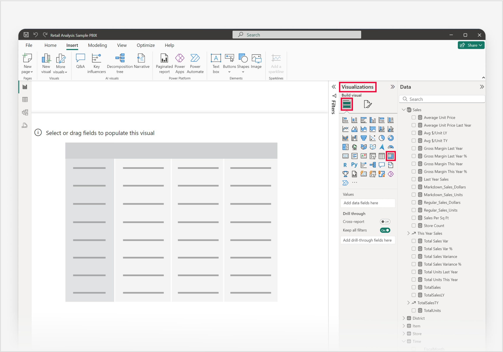

> 출처: Microsoft Learn — Build a matrix visual in Power BI (`visuals/power-bi-visualization-matrix-visual`).

**필드 웰**: 모든 개체의 최하단에는 **도구 설명(Tooltip)** 웰(마우스를 개체 위에 올렸을 때 뜨는 팝업에 보여 줄 추가 측정값)과 **드릴스루(Drillthrough)** 필터(다른 페이지로 넘어갈 때 자동으로 전달되는 필터 값)가 존재한다.

**서식 창 주요 항목**:

- **시각적 개체 헤더(Visual header)**: 개체 우측 상단의 아이콘 줄(필터, 초점, 드릴 다운 등)을 켜거나 끈다. **아이콘 색**·**배경**·**투명도**를 지정해 다크/라이트 테마에 맞춘다.
- **제목(Title)**: 개체 맨 위의 문자열로, **텍스트**·**글꼴**·**맞춤(왼쪽/가운데/오른쪽)**·**배경색**을 개별 지정한다. **조건부 서식**(값에 따라 색·텍스트가 변하는 규칙)으로 측정값을 이용한 동적 제목도 가능하다.
- **배경(Background)**: 개체 내부의 **색**·**투명도**·**이미지 채우기**.
- **테두리(Border)** / **그림자(Shadow)** / **둥근 모서리(Rounded corners)**: 윤곽선 색·두께, 그림자의 거리·흐림, 모서리 반지름을 숫자 슬라이더로 조정한다.
- **자물쇠 종횡비(Lock aspect)**: 켜면 드래그로 크기를 바꿔도 **가로:세로 비율**이 유지된다.
- **패딩(Padding)**: 개체 내부 콘텐츠와 테두리 사이 **여백**(픽셀)이다.
- **접근성(Alt text)**: 스크린 리더가 읽을 **대체 텍스트**를 정의한다.

**분석·드릴·상호 작용**: **분석** 창의 **상수선·추세선·평균선**은 위 정의에 따라 동작한다. 보고서 리본의 **상호 작용 편집**을 켜면 각 개체에서 다른 개체로 내보내는 **교차 필터**(필터 아이콘)·**강조 표시**(꺾쇠) 모드를 개별로 선택할 수 있다. **드릴** 메뉴는 계층이 포함된 웰(축·행·범례)이 있을 때만 활성화된다.

### 6.1 테이블(Table)

**한 줄 정의**: 열과 행으로 값을 나열하는 2차원 **표(grid)** 형태의 시각적 개체. 평활한 목록 성격의 데이터를 그대로 보여 주는 용도에 맞다.

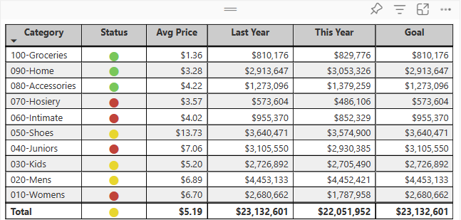

> 출처: Microsoft Learn — Work with tables in Power BI reports (`visuals/power-bi-visualization-tables`).

**필드 웰**: **값(Values)** 웰 하나만 있다. 범주 열과 측정값을 순서대로 끌어 놓으며, 웰의 드롭다운으로 **열마다** 요약 함수(합계·평균·개수 등)·이름 바꾸기·표시 단위를 바꾼다.

**서식 창 주요 항목**:

- **스타일 설정(Style presets)**: “최소”, “굵은 머리글”, “교대 행” 같은 **프리셋**(기본 서식 세트)을 한 번에 적용한다.
- **그리드(Grid)**: **행 간격(row padding)**(행 높이 여백), **열 간격**, **세로선·가로선**(테두리선), **교대 행 배경색**(지브라 스트라이프)을 설정한다.
- **열 머리글(Column headers)**: 머리글 행의 **글꼴·배경색·맞춤**, **텍스트 줄 바꿈**(긴 이름을 여러 줄로), **자동 크기 조정**(사용자 드래그 기억) 옵션.
- **값(Values)**: 데이터 셀의 **글꼴·맞춤·URL 아이콘**(URL 값을 링크 아이콘으로 치환)·**표시 단위**(천, 백만 등).
- **특정 열(Specific column)**: 선택한 한 열에만 다른 글꼴·색을 적용하여 강조한다.
- **총계(Total)** / **소계(Subtotal)**: 맨 아래 합계 행의 표시·이름·글꼴.
- **셀 요소(Cell elements)**: 선택 열에 **배경색**(색 눈금/규칙 기반), **글꼴색**, **데이터 막대(Data bars)**(셀 안에 값 크기에 비례한 가로 막대), **아이콘(Icons)**(상태 신호등), **웹 URL**(셀 값을 하이퍼링크로) 등 **조건부 서식**을 적용한다.

**분석·드릴·상호 작용**: 테이블은 계층이 없으므로 **드릴**은 쓰이지 않는다. 셀을 클릭하면 다른 시각적 개체에 **교차 필터**가 적용된다. 열 머리글을 클릭하면 정렬 방향이 바뀐다.

### 6.2 매트릭스(Matrix)

**한 줄 정의**: **행·열·값** 세 축을 모두 가진 **피벗형 표**로, 계층을 접고 펼치며 **총계·소계·조건부 서식**을 지원하는 교차 집계 개체이다.

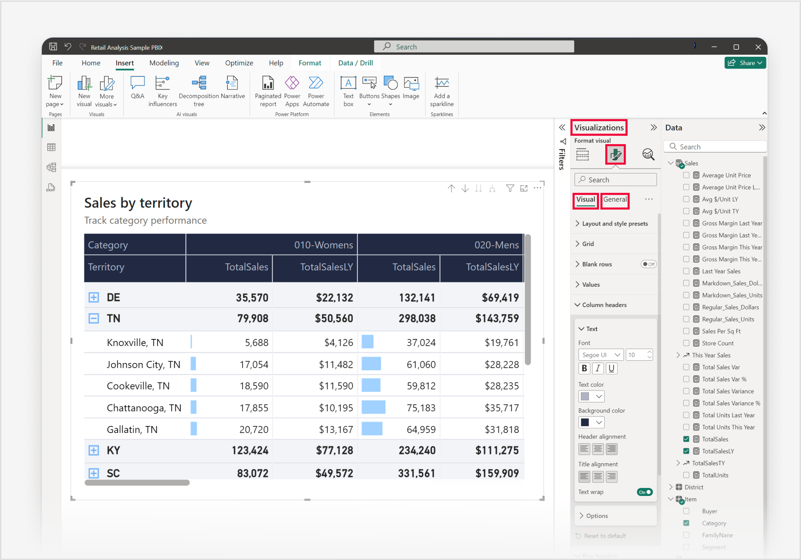

> 출처: Microsoft Learn — Build a matrix visual in Power BI (`visuals/power-bi-visualization-matrix-visual`).

**필드 웰**: **행(Rows)**, **열(Columns)**, **값(Values)** 3개. 행과 열 웰에 여러 필드를 쌓으면 자동으로 **계층**(위에서 아래 순서로 하위 수준)이 만들어진다.

**서식 창 주요 항목**:

- **스타일 설정(Style presets)**: 테이블과 마찬가지로 **프리셋**을 적용한다.
- **행 머리글(Row headers)** > **계단형 레이아웃(Stepped layout)**: 켜면 하위 수준이 한 열 안에서 **들여쓰기 계단**으로 쌓이고, 끄면 하위 수준이 **새 열**로 펼쳐진다. 보고서 UI에 보이는 **“계측 구조의 마지막 수준까지 확장”**과 **“서로 다른 열로 모든 행을 나열”** 옵션을 켜는 것은 사실상 **계단형 레이아웃 끄기**와 동일한 결과, 즉 계층을 열로 확장한 넓은 피벗 모양을 만드는 것이다.
- **행 머리글 – +/- 아이콘(Expand/Collapse)**: 머리글 옆에 **접기/펼치기 단추**를 표시한다.
- **분할 머리글(Subtotal) / 반복 레이블(Repeat labels)**: 수준이 바뀔 때 상위 레이블을 각 하위 행에 **반복 출력**하여 엑셀 피벗처럼 읽기 쉽게 한다.
- **열 머리글**: 열 축의 **글꼴·배경**·**자동 크기** 옵션.
- **값**: 데이터 셀 **글꼴·맞춤·음수 표시 색**·**표시 단위**.
- **총계·소계**: **행 총계**, **열 총계**, 각 수준별 소계의 **On/Off**와 글꼴·배경을 각각 지정한다.
- **셀 요소(조건부 서식)**: 테이블과 동일하게 **배경색·글꼴색·데이터 막대·아이콘**을 값에 따라 지정한다.

**분석·드릴·상호 작용**: 계층이 있으므로 **드릴** 메뉴가 활성화된다. **드릴 다운(다음 수준으로 이동)**, **다음 수준으로 확장**(현 수준을 유지하며 아래를 함께 표시), **수준 확장/축소**가 있다. 한 셀을 선택하면 다른 개체에 교차 필터가 전달된다.

### 6.3 카드(Card)·다중 행 카드(Multi-row card)

**한 줄 정의**: **카드**는 하나의 숫자(또는 값)를 크게 강조하는 **KPI 숫자판**이고, **다중 행 카드**는 여러 열의 값을 한 카드 블록에 세로로 나열하는 **라벨-값 쌍 목록**이다.


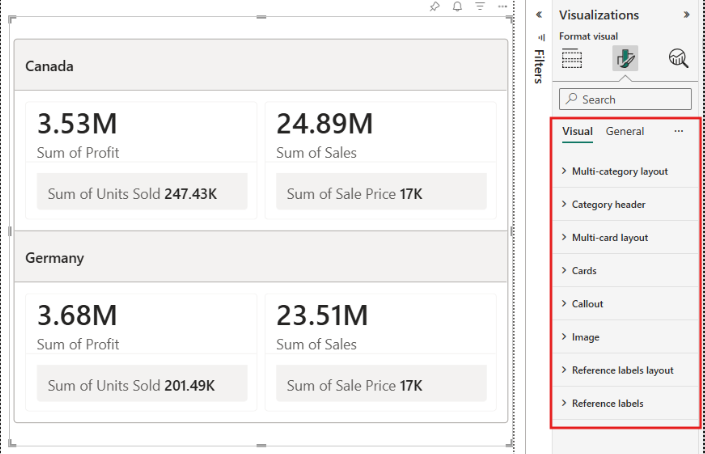

> 출처: Microsoft Learn — Create Card visuals in Power BI reports (`visuals/power-bi-visualization-card`).

**필드 웰**: 카드는 **필드(Fields)** 웰 1개(보통 측정값)를 받는다. 다중 행 카드는 **필드** 웰에 여러 열을 받아 각 열마다 레코드 별 값을 행으로 표시한다.

**서식 창 주요 항목**:

- **콜아웃 값(Callout value)**: 카드의 큰 숫자 자체로, **글꼴·색·표시 단위(K/M/B)**·**소수 자릿수**를 지정한다.
- **범주 레이블(Category label)**: 큰 숫자 아래 설명 텍스트(예: “매출 합계”) 글꼴·색.
- **단어 줄 바꿈(Word wrap)**: 긴 값·레이블을 여러 줄로 잘라 보여 준다.
- **카드(Card)** 그룹(다중 행 카드 한정): 카드 블록의 **윤곽선**, **막대 색/두께**(좌측 색 막대), **카드 간격**.
- **이미지(Image)**(신 카드): 값 옆에 **아이콘/이미지**를 표시한다.

**분석·드릴·상호 작용**: 카드는 단일 값이라 **드릴**이 없다. 카드를 선택해도 다른 개체에 교차 필터가 가지 않지만, 다른 개체의 선택에 **필터 수신**만 한다는 점을 기억한다.

### 6.4 꺾은선형·누적 꺾은선형(Line / Stacked Line)

**한 줄 정의**: **연속 축**(주로 시간)의 값을 선으로 이어 **추세**를 보여 주는 시각적 개체. 누적 꺾은선형은 여러 계열을 더해 쌓은 값을 선으로 그린다.

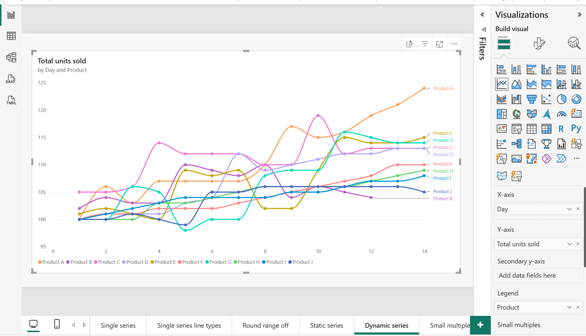

> 출처: Microsoft Learn — Line charts in Power BI (`visuals/power-bi-line-chart`).

**필드 웰**: **X축**(보통 날짜/연속 범주), **Y축**(측정값 여러 개 가능), **범례(Legend)**(색으로 구분할 동적 계열 열), **작은 배수(Small multiples)**(아래 참조), **도구 설명** 웰.

- **작은 배수(Small multiples)**: 하나의 범주 열을 주어 **동일한 차트를 격자 형태로 여러 장** 그리는 기능이다(예: “지역”별로 같은 꺾은선형을 나란히). **서식**의 **그리드 레이아웃**에서 행·열 수, 패딩을 지정한다.

**서식 창 주요 항목**:

- **X축(X-axis)** / **Y축(Y-axis)**: 축의 **유형(연속/범주)**, **최소·최대**, **표시 단위(K/M/B)**, **소수 자릿수**, **제목 텍스트**, **레이블 각도/글꼴**.
- **범례(Legend)**: 범례의 **위치(위/아래/왼쪽/오른쪽)**, **글꼴**, **제목 표시**.
- **선(Lines)**: **두께**(픽셀), **결합 유형(단계형/부드러움/직선)** — **단계형(stepped)**은 값이 갑자기 바뀌는 곳에서 수직·수평 직각으로 꺾이는 모양, **부드러움(smooth)**은 곡선 보간이다.
- **마커(Markers)**: 각 데이터 점에 **점**을 찍는다. **모양(원·사각·삼각)**, **크기**, **색**.
- **데이터 레이블(Data labels)**: 점마다 값을 **숫자로 표기**. **위치(위/아래/위 왼쪽/자동)**, **표시 단위**, **배경색**.
- **줌 슬라이더(Zoom slider)**: 차트 축 아래에 생기는 **드래그 가능한 막대**로, 양쪽 핸들로 범위를 좁히면 그 구간만 **확대**되어 그려진다. 모바일에서 많이 쓰이며 **툴팁 모드**(슬라이더 끝에 값 표시)를 선택할 수 있다.

**분석·드릴·상호 작용**: **분석** 창에서 **상수선·평균선·중앙값·최소·최대·백분위수·추세선·예측(Forecast)**을 추가한다. 예측은 선형 모형으로 미래 구간을 **점선**으로 그린다. X축에 **날짜 계층**이 있으면 헤더 아이콘으로 **드릴 다운**을 수행한다.

### 6.5 클러스터형·누적·100% 누적 막대·가로 막대(Column / Bar)

**한 줄 정의**: 범주 축을 따라 값을 **막대(bar)**로 표시하는 시각적 개체. 세로면 **열(column)**, 가로면 **가로 막대(bar)**이다. **클러스터형**은 범주당 여러 계열을 **나란히** 두고, **누적**은 하나의 막대 안에 쌓고, **100% 누적**은 막대 길이를 동일하게 맞춰 **비율**을 보여 준다.

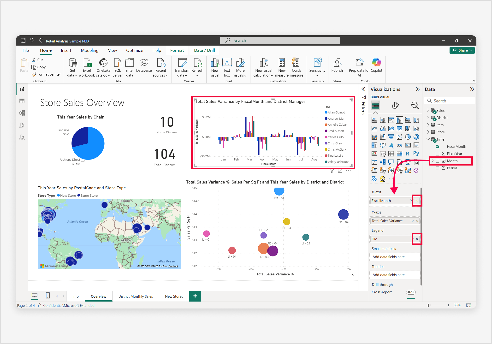
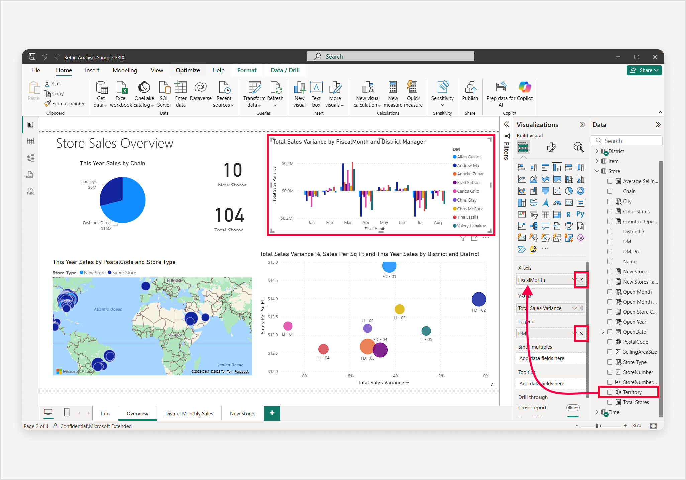

> 출처: Microsoft Learn — Column charts in Power BI (`visuals/power-bi-visualization-column-charts`).

**필드 웰**: **X축(열 기준)** 또는 **Y축(가로 막대 기준)**, 반대축은 값(측정값 여러 개), **범례(Legend)**, **작은 배수**, **도구 설명**.

**서식 창 주요 항목**:

- **막대(Bars)**: **간격(Space between bars)**(막대 사이 여백 비율), **모서리 둥글림(Rounded corners)**(픽셀 반경), **막대 색**(단색 또는 범주별 규칙).
- **색 채우기(Fill)**: 값 기반 **조건부 서식**을 적용해 값이 클수록 진하게 그릴 수 있다.
- **축(Axis)**: 로그 스케일(연속 축), **최소값 고정**, **값 표시 단위** 등 6.4와 동일.
- **데이터 레이블(Data labels)**: 막대 위·안·끝에 값 표시. **100% 누적**에서는 비율(%)로 자동 표기된다.
- **Total labels**(누적/100% 전용): 각 막대의 **총합**을 위쪽에 추가로 표시한다.
- **줌 슬라이더(Zoom slider)**: 6.4 정의와 동일. 범주 축이 **연속**일 때만 가능.

**분석·드릴·상호 작용**: **분석** 창에 **상수선·평균선·최솟값·최댓값·오류 막대(Error bars)**를 얹을 수 있다. **오류 막대**는 각 막대 끝에 **위·아래 범위**를 그리는 I자 모양 표식이다. 범주 축에 계층을 넣으면 **드릴 다운**이 동작한다.

### 6.6 묶은 막대·꺾은선형(결합형 Combo)

**한 줄 정의**: **막대(열)**와 **꺾은선형**을 같은 축 공간에 겹쳐 그린 **결합형 차트**. 서로 단위가 다른 두 측정값(예: 매출 막대와 마진율 선)을 한 눈에 비교할 때 쓴다.

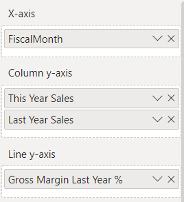

> 출처: Microsoft Learn — Use a combo chart in Power BI (`visuals/power-bi-visualization-combo-chart`).

**필드 웰**: **X축**, **열 y축 값(Column y-axis values)**(막대로 그릴 측정값), **선 y축 값(Line y-axis values)**(선으로 그릴 측정값), **열 범례**, **작은 배수**, **도구 설명**.

**서식 창 주요 항목**:

- **Y축**: 왼쪽 **기본 Y축**(막대 스케일), 오른쪽 **보조 Y축(Secondary y-axis)**(선 스케일) 각각의 **최소·최대·표시 단위**. 보조 축을 끄면 두 계열이 같은 축을 공유한다.
- **선(Lines)** / **막대(Bars)**: 각 계열의 **색·두께·모서리 둥글림·마커**.
- **데이터 레이블**: 계열별로 표시/숨김·위치 독립 설정.
- **범례**: 막대·선 계열의 범례 **제목·위치**.

**분석·드릴·상호 작용**: **분석** 창에 상수선·추세선·예측 등을 얹을 수 있다. 범주 축이 날짜 계층이면 **드릴**이 동작한다.

### 6.7 분산형(Scatter / Bubble / Dot Plot)

**한 줄 정의**: 두 수치 축의 교차점에 점을 찍어 **상관·분포**를 보는 개체. 점 크기를 세 번째 값으로 키우면 **거품(Bubble)** 차트, 한 축이 범주이면 **점 플롯(Dot plot)**이 된다.

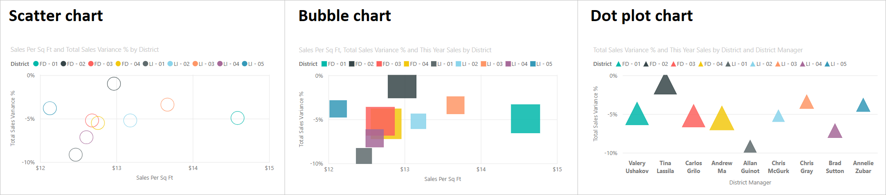

> 출처: Microsoft Learn — Scatter, bubble, and dot plot charts in Power BI (`visuals/power-bi-visualization-scatter`).

**필드 웰**: **X축(X Axis)**, **Y축(Y Axis)**, **크기(Size)**(거품 크기), **범례(Legend)**(점 색 구분), **재생 축(Play axis)**(시간이 흐르며 점이 움직임), **값(Values)**(점 1개에 대응되는 세부 행을 지정) 등.

**서식 창 주요 항목**:

- **마커(Markers)**: **모양(Shape)**(원·사각·다이아 등), **크기(Size)**, **색 채도(Color saturation)**(측정값 값에 따라 채도를 진하게/연하게), **이미지**(이미지 URL 열이 있으면 점을 이미지로 교체).
- **카테고리 레이블(Category labels)**: 각 점 옆에 범주 이름을 **주석**으로 적는다.
- **재생 축(Play axis)**: 화면 아래에 **재생 버튼**이 생기며, **축 색·폰트**와 **현재 프레임** 라벨을 커스터마이즈한다.
- **대칭 음영(Symmetry shading)** / **비율 선(Ratio line)**: X=Y 대각선·비율 선 같은 **참조선**을 그려 분포 비교를 돕는다.
- **줌 슬라이더**: 6.4와 동일. X·Y 각각에 켤 수 있다.

**분석·드릴·상호 작용**: **분석** 창에서 **중앙값·백분위 선·추세선**을 각 축에 얹는다. 점을 선택하면 다른 개체에 교차 필터가 간다.

### 6.8 영역형·누적 영역형(Area / Stacked Area)

**한 줄 정의**: 꺾은선형과 같은 방식으로 값을 잇되, 선 아래 영역을 **색으로 채워** 누적 추이를 강조하는 개체.

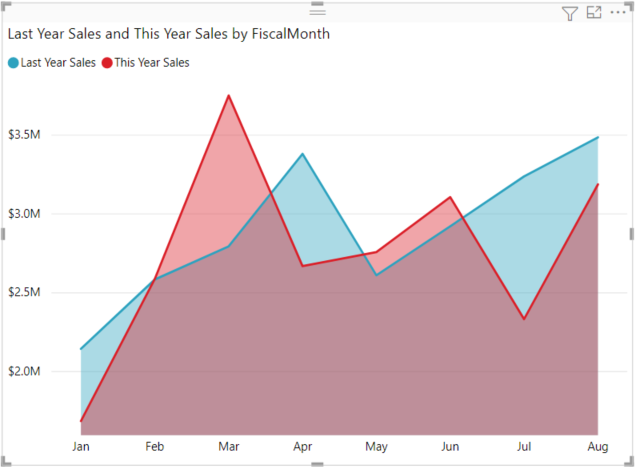

> 출처: Microsoft Learn — Basic area chart in Power BI (`visuals/power-bi-visualization-basic-area-chart`).

**필드 웰**: 6.4 꺾은선형과 동일(**X축·Y축·범례·작은 배수·도구 설명**).

**서식 창 주요 항목**:

- **도형(Shape)**: 영역의 **투명도(Transparency)**(0 = 완전 불투명, 100 = 완전 투명), **보간 유형(선형/단계형/부드러움)**.
- **데이터 레이블**: 영역 위에 값 표시.
- **누적**: 계열을 쌓아 총합의 변화를 동시에 표현한다.

**분석·드릴·상호 작용**: 6.4 꺾은선형과 같다.

### 6.9 리본 차트(Ribbon chart)

**한 줄 정의**: 각 범주 구간에서 **범례 항목의 순위 변동**을 두께가 있는 **띠(리본)**로 연결해, “누가 앞서가는가”를 한눈에 보여 주는 누적 열 차트의 변형.

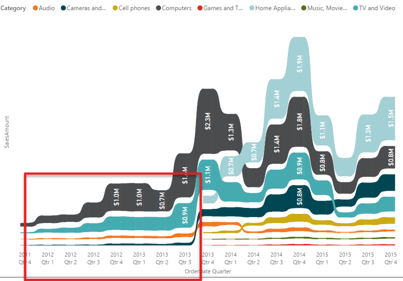

> 출처: Microsoft Learn — Ribbon charts in Power BI (`visuals/desktop-ribbon-charts`).

**필드 웰**: **X축**(범주 축, 주로 날짜), **Y축**(값), **범례**(리본으로 연결할 그룹 키), **작은 배수**, **도구 설명**.

**서식 창 주요 항목**:

- **리본(Ribbons)**: 리본의 **간격(Space)**, **경계선(Border)**, **투명도**, **간극(Spacing between ribbons)**. 투명도를 높이면 아래의 값 막대와 리본이 겹쳐 보인다.
- **색**: 범례 항목별 색 지정.
- **Y축·데이터 레이블**: 6.5 누적 열과 유사.

**분석·드릴·상호 작용**: 분석 창은 평균선·상수선을 얹는다. 범주 축에 계층이 있으면 드릴 동작.

### 6.10 폭포 차트(Waterfall)

**한 줄 정의**: 시작 값에서 **증감(+/-) 기여**를 한 칸씩 쌓아 최종 값까지의 **흐름**을 보여 주는 개체. 브리지 차트(bridge chart)로도 불린다.

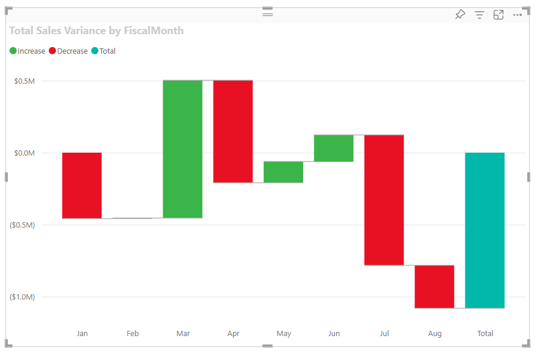

> 출처: Microsoft Learn — Waterfall charts in Power BI (`visuals/power-bi-visualization-waterfall-charts`).

**필드 웰**: **범주(Category)**(가로 축 단계 이름), **값(Values)**(단계별 변화량), **분해(Breakdown)**(각 단계 내부를 다시 쪼갤 하위 범주; 양/음 기여의 세부 요인 표시).

**서식 창 주요 항목**:

- **색**: **증가(Increase)**, **감소(Decrease)**, **합계(Total)**의 막대 색을 별도로 지정한다.
- **분해 열(Breakdown)**: 한 단계 내 기여 요인 **최대 개수**. 초과하면 “기타”로 합친다.
- **연결선(Connector)**: 단계 사이를 잇는 점선·실선 표시.

**분석·드릴·상호 작용**: 분석 창은 제한적이다. 단계 이름은 보통 고정 범주이므로 드릴은 드물다.

### 6.11 깔때기 차트(Funnel)

**한 줄 정의**: 단계가 **줄어드는 프로세스**(예: 방문 → 장바구니 → 결제)의 **전환율**을 막대 폭 차이로 보여 주는 개체.

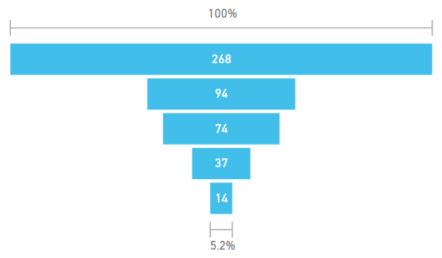

> 출처: Microsoft Learn — Funnel charts in Power BI (`visuals/power-bi-visualization-funnel-charts`).

**필드 웰**: **범주(Group)**(단계 이름), **값(Values)**(각 단계의 수량).

**서식 창 주요 항목**:

- **전환율(Conversion rate)** 레이블: 첫 단계 대비 각 단계의 비율을 표시.
- **배율 바(Percent of first)**: 이전/첫 단계 대비 비율을 **얇은 바**로 덧대어 시각화.
- **막대 색·글꼴**: 단계별 색 지정.

**분석·드릴·상호 작용**: 분석 창은 없거나 매우 제한적. 단계 선택 시 다른 개체에 교차 필터 전달.

### 6.12 원형·도넛(Pie / Doughnut)

**한 줄 정의**: 전체에 대한 **비율(part-of-whole)**을 각도로 표현하는 개체. 도넛은 원형의 가운데가 비어 **공간에 제목/총합**을 둘 수 있다.

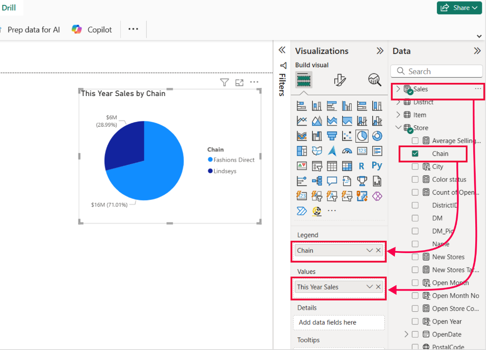

> 출처: Microsoft Learn — Pie and doughnut charts in Power BI (`visuals/power-bi-visualization-pie-donut-chart`).

**필드 웰**: **범례(Legend)**(조각 색 구분 열), **값(Values)**(조각 크기에 매핑될 측정값), **세부 정보(Details)**(부차 범주로 더 작게 나눔).

**서식 창 주요 항목**:

- **조각(Slices)**: 조각 **색·윤곽선·간격**.
- **데이터 레이블(Data labels)**: **위치(안쪽/바깥/우선 바깥)**, **표시 단위**, **백분율/값/범주명** 세 종류를 각각 On/Off.
- **내경(Inner radius)**(도넛 전용): 0이면 원형, 값이 커질수록 구멍이 커진다(퍼센트 단위).
- **세부 정보 레이블(Detail label) – 리더선(Leader line)**: 밖으로 빠진 레이블과 조각을 잇는 얇은 선.

**분석·드릴·상호 작용**: 분석 창 없음. 조각 클릭 시 교차 필터. 범례에 계층이 있으면 드릴 동작.

### 6.13 트리맵(Treemap)

**한 줄 정의**: 전체를 **직사각형**으로 채우되, 각 사각형의 **면적**을 값에 비례하게 배치하는 2차원 부분-전체 시각화.

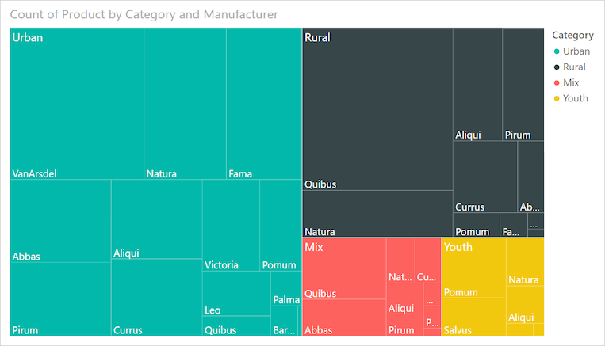

> 출처: Microsoft Learn — Create treemaps in Power BI (`visuals/power-bi-visualization-treemaps`).

**필드 웰**: **범주(Group)**(상위 분할), **세부 정보(Details)**(하위 분할), **값(Values)**(면적 크기), **색 채도(Color saturation)**(측정값으로 채도 결정), **범례**.

**서식 창 주요 항목**:

- **데이터 색(Data colors)** / **색 채도**: 값이 크면 진하게/연하게. **발산색(diverging)**·**분기점(midpoint)** 설정.
- **범주 레이블/데이터 레이블**: 각 사각형 안에 **범주 이름**과 **값**을 표시.
- **머리글(Header)**: 상위 블록 머리글을 굵게.

**분석·드릴·상호 작용**: 분석 창 없음. **범주 → 세부 정보**로 드릴 다운 가능.

### 6.14 맵(Map·기본 / Filled map·채워진 맵)

**한 줄 정의**: 지리 좌표나 지명 범주를 지도 위에 점(기본 맵)이나 면(채워진 맵)으로 올리는 지도 시각화.

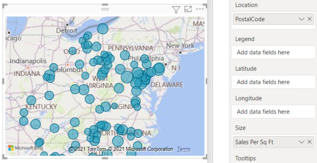
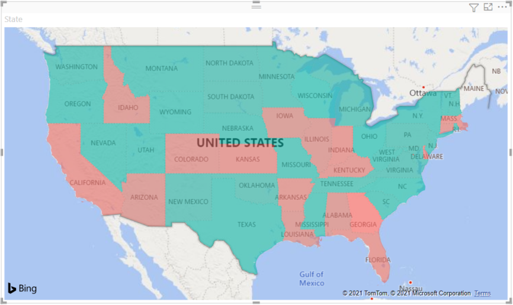

> 출처: Microsoft Learn — Map tips and tricks / Filled maps (choropleths) (`visuals/power-bi-map-tips-and-tricks`, `visuals/power-bi-visualization-filled-maps-choropleths`).

**필드 웰**:

- **기본 맵**: **위치(Location)**(국가/도시 등 지명 열; **데이터 범주**가 지리 유형이어야 제대로 매핑됨), **위도(Latitude)**·**경도(Longitude)**(정확한 좌표), **크기(Size)**(거품 크기), **범례**(색 구분), **도구 설명**, **재생 축**.
- **채워진 맵**: **위치**·**위도/경도**·**범례**·**도구 설명**. 지역 경계로 폴리곤을 채색한다.

**서식 창 주요 항목**:

- **맵 스타일(Map styles)**: **공중(Aerial)**, **거리(Road)**, **어두움(Dark)**, **연한 회색(Light)** 등 배경 스타일.
- **맵 컨트롤(Map controls)**: **자동 확대/축소(Auto zoom)**, **헤더 확대/축소 단추(Zoom buttons)**, **레이저블 라벨(Labels)**.
- **거품(Bubbles)**(기본 맵): **크기 스케일·투명도·색 채도**.
- **범주(Category) / 범례 색**.
- **버블 레이어/영역 색(Fill)**(채워진 맵): 지역 색·테두리.

**분석·드릴·상호 작용**: 분석 창은 제한적. 지도에서 **스파이럴 선택(lasso)**·범례 선택으로 교차 필터 전달. 국가 → 시/도 → 시로 계층이 있으면 드릴.

### 6.15 게이지·KPI(Gauge·Radial / KPI)

**한 줄 정의**: **게이지(Radial gauge)**는 반원 눈금으로 **값이 목표 대비 얼마나 왔는지**를 한눈에 보여 주고, **KPI**는 **표시값·목표·추세**를 색(좋음/나쁨)과 방향으로 강조하는 단일 지표 개체이다.

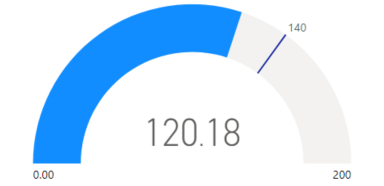
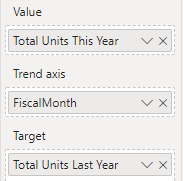

> 출처: Microsoft Learn — Radial gauge charts / KPI visuals in Power BI (`visuals/power-bi-visualization-radial-gauge-charts`, `visuals/power-bi-visualization-kpi`).

**필드 웰**:

- **게이지**: **값(Value)**(현재 수치), **최솟값(Minimum value)**·**최댓값(Maximum value)**·**목표값(Target value)**. 값이 생략되면 최소/최대는 자동(0 ~ 값×2) 계산된다.
- **KPI**: **값(Value)**(현재 측정값), **추세 축(Trend axis)**(시간 열; 내부에 **스파크 라인**으로 그려짐), **목표(Target goals)**(달성 기준값).

**서식 창 주요 항목**:

- **게이지 축(Gauge axis)**: **최소/최대/목표** 색과 위치, 축 눈금 글꼴.
- **데이터 색**: 값 막대의 색·그라디언트.
- **콜아웃 값·목표 이름** 서식.
- (KPI) **표시값(Indicator)**: 숫자 글꼴·색.
- (KPI) **추세 축(Trend axis)**: **스파크 라인**(값 변화를 KPI 타일 배경에 얇은 선으로 깔아 보여 주는 선)의 색·두께.
- (KPI) **목표(Goals)**: 좋음/나쁨 임계값, 방향(**High is good / Low is good**) 설정.
- (KPI) **배경 기호/색**: 달성 시 초록, 미달 시 빨강 등 상태 기반 배경.

**분석·드릴·상호 작용**: 분석 창 없음. 추세 축이 있으면 시간 선택에 반응해 KPI가 바뀐다.

### 6.16 분해 트리·키 인플루언서(AI 시각화)

**한 줄 정의**: **분해 트리(Decomposition tree)**는 측정값을 범주별로 **펼치며 파고드는 탐색 트리**이고, **키 인플루언서(Key influencers)**는 타겟 열에 영향을 크게 주는 **요인을 순위로 보여 주는 통계 시각화**이다.

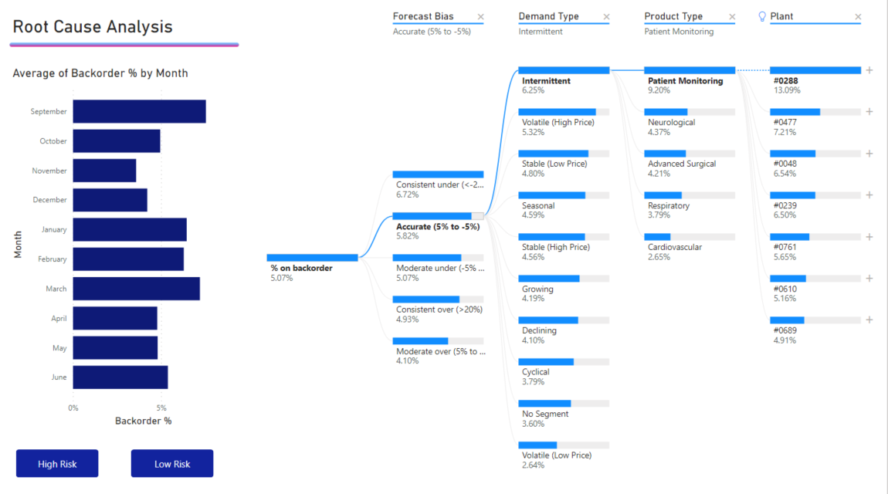
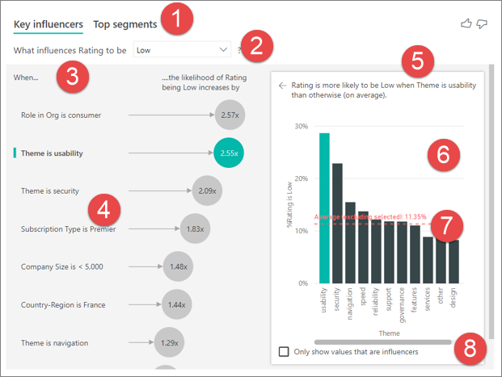

> 출처: Microsoft Learn — Decomposition tree visuals / Key influencers visuals (`visuals/power-bi-visualization-decomposition-tree`, `visuals/power-bi-visualization-influencers`).

**필드 웰**:

- **분해 트리**: **분석(Analyze)**(분해할 측정값 한 개), **설명 기준(Explain by)**(펼칠 후보 범주 열 다수). 사용자가 노드를 클릭하면 해당 범주의 값이 **최고/최저**나 **지정 값**으로 분해된다.
- **키 인플루언서**: **분석(Analyze)**(설명하려는 타겟 열), **설명 기준(Explain by)**(영향 요인 후보 열들), **확장(Expand by)**(데이터를 집계 없이 행 단위로 확장할 열).

**서식 창 주요 항목**:

- **분해 트리**: **레벨 머리글**·**막대 색**·**AI 분할 아이콘(Artificial intelligence split)** 색(AI가 고른 분할은 특별한 아이콘으로 표시). **잠금/해제**로 트리 경로를 고정한다.
- **키 인플루언서**: **탭**(“이것이 증가한다는 것은…” 등) 글꼴, **드롭다운** 색, **오른쪽 차트(보조 차트)** 유형(도트/막대).
- 두 개체 모두 **텍스트·색·아이콘**의 글꼴·크기 옵션을 제공한다.

**분석·드릴·상호 작용**: **분해 트리**는 노드 클릭이 사실상 드릴이고, 트리 안에서 **AI 분할(+ AI 아이콘)**은 Power BI가 제안하는 분기 규칙이다. **키 인플루언서**는 **세그먼트 탭**에서 비슷한 값 덩어리(세그먼트)를 자동으로 찾아 보여 준다. 조직 정책이나 모델 제약에 따라 AI 시각화가 비활성일 수 있다.

### 6.17 Q&A 시각적 개체

**한 줄 정의**: 자연어로 질문을 입력하면 **Power BI가 해석해** 차트/표로 응답하는 **입력-응답형** 개체이다.

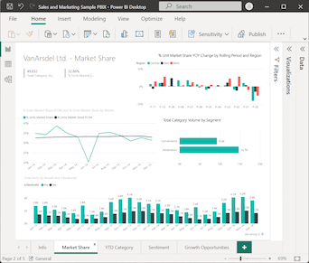

> 출처: Microsoft Learn — Create a Q&A visual (`visuals/power-bi-visualization-q-and-a`).

**필드 웰**: 공식적으로 필드 웰은 없지만, **시각화 → Q&A → Q&A 설정**에서 **동의어(synonyms)**, **용어(terms)**, **제안된 질문**을 관리한다(모델 전체에 영향).

**서식 창 주요 항목**:

- **질문 필드(Question field)**: 입력 상자의 **배경·테두리·플레이스홀더 텍스트**.
- **제안된 질문(Suggested questions)**: 입력 상자 아래에 **클릭 가능한 예시 질문 버튼** 목록. 버튼 색·글꼴 조정.
- **시각적 개체 머리글 아이콘**: 질문 결과를 표준 개체로 **전환** 아이콘 표시.

**분석·드릴·상호 작용**: 결과가 테이블/차트로 전환되면 해당 유형의 상호 작용 규칙을 따른다.

### 6.18 슬라이서(Slicer)

**한 줄 정의**: 페이지에 올려 두고 사용자가 값을 선택해 **페이지 전체 필터를 바꾸는 컨트롤**. 목록·드롭다운·상대 날짜·숫자 범위 등 여러 스타일이 있다.

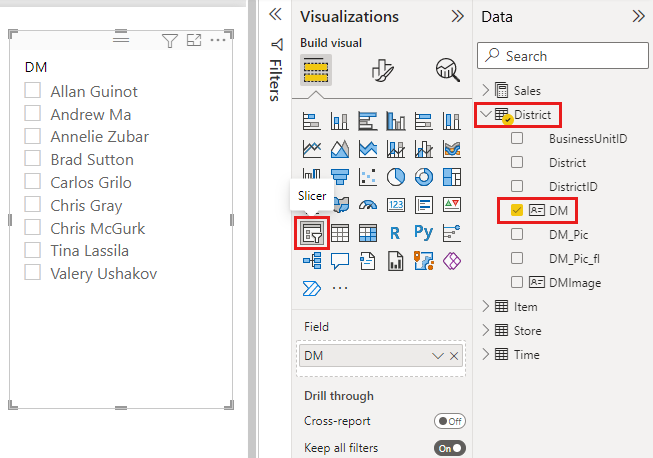

> 출처: Microsoft Learn — Slicers in Power BI (`visuals/power-bi-visualization-slicers`).

**필드 웰**: **필드(Field)** 하나(또는 계층). 스타일별로 동작이 달라진다.

**서식 창 주요 항목**:

- **슬라이서 설정(Slicer settings) → 스타일(Style)**: **세로 목록(Vertical list)**, **타일(Tile)**, **드롭다운(Dropdown)**, **상대 날짜(Relative date)**, **상대 시간(Relative time)**, **Between(범위 슬라이더)**, **날짜 범위 슬라이더(Date range slider)** 등. 필드 유형이 날짜/숫자일 때만 일부 스타일이 보인다.
- **슬라이더 머리글(Slicer header)**: 맨 위의 라벨·확장 버튼·**모두 지우기**·**초점 모드** 아이콘.
- **선택(Selection)**: **다중 선택(Multi-select)**, **모두 선택 옵션(Show Select All)**, **Ctrl 없이 다중 선택**(`Single select` 토글).
- **항목(Values)** 또는 **버튼**: 항목 글꼴·배경·선택됨/호버 상태 색.
- **날짜 범위 슬라이더**: 양쪽 핸들로 범위를 좁히는 막대. **최소/최대**, **값 표시**.
- **동기화 슬라이서(Sync slicers)**: **보기** 탭의 **동기화 슬라이서** 페인에서 페이지별로 **표시(Show) / 동기화(Sync)**를 각각 체크해, 여러 페이지가 같은 선택 상태를 공유하도록 한다.

**분석·드릴·상호 작용**: 슬라이서는 **분석** 창을 사용하지 않는다. 선택 변경은 페이지의 모든 개체에 기본으로 **필터**로 전달되며, **상호 작용 편집**에서 대상 개체별로 무시 또는 강조로 바꿀 수 있다.

### 6.19 단추 슬라이서·세그먼트(Button slicer / Segment)

**한 줄 정의**: **단추 슬라이서**는 선택지를 **타일/버튼**으로 펼쳐 바로 누르게 하는 슬라이서 변형이다. 보고서에서 “세그먼트”라고 불리는 개체 대부분이 이 유형에 해당한다.

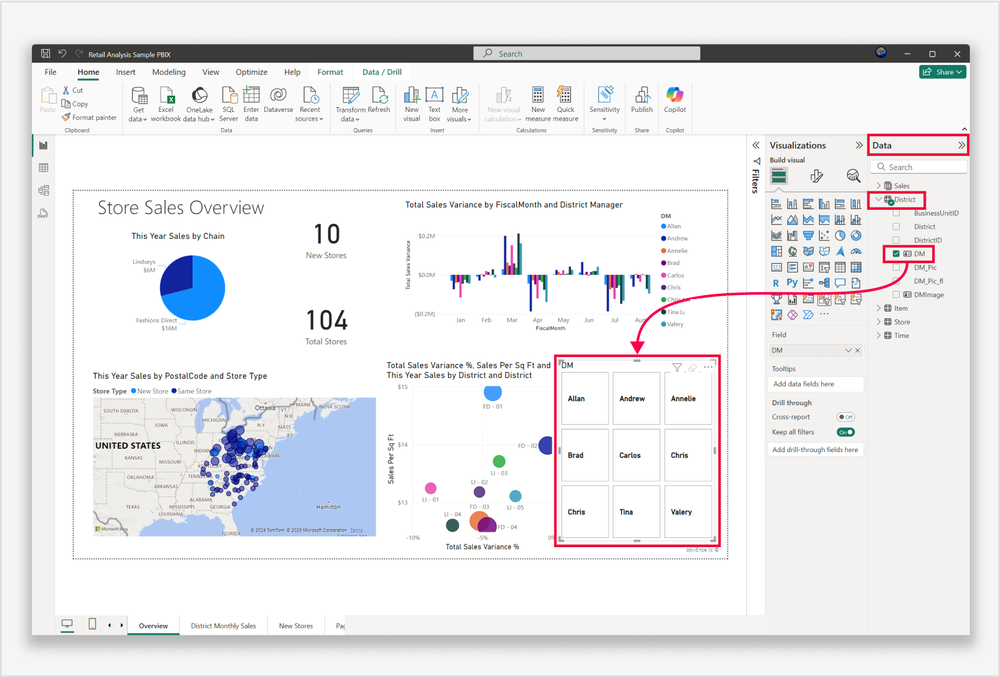

> 출처: Microsoft Learn — Button slicer in Power BI (`visuals/power-bi-visualization-button-slicer`).

**필드 웰**: **필드(Field)**(버튼으로 펼칠 범주 열). 선택 사항으로 **툴팁** 웰을 제공한다.

**서식 창 주요 항목**:

- **레이아웃(Layout)**: **방향(가로/세로)**, **행·열 수**, **자동 맞춤(Auto fit)** — 단추가 영역에 맞게 자동 배치된다.
- **단추(Buttons)**: **크기**, **간격**, **모양(직사각형/알약)**, **그림자**.
- **상태(State)**: **기본**, **선택됨**, **마우스 오버**, **눌림** 각각에 대해 **배경색·글꼴색·테두리**를 따로 지정한다.
- **선택(Selection)**: **단일 선택(Single select)**, **다중 선택(Multi-select)**, **Ctrl 없이 다중 선택**, **모두 지우기(Clear)** 버튼 표시.
- **아이콘(Icon)**: 단추마다 **이미지 URL** 열이 있으면 아이콘을 덧붙일 수 있다.

**분석·드릴·상호 작용**: 슬라이서 계열이므로 6.18과 동일한 상호 작용을 가진다.

### 6.20 R·Python 시각적 개체

**한 줄 정의**: 모델에 있는 열을 **데이터 프레임**으로 넘겨 **R 또는 Python 스크립트**로 차트를 직접 그리는 코드 기반 시각화.

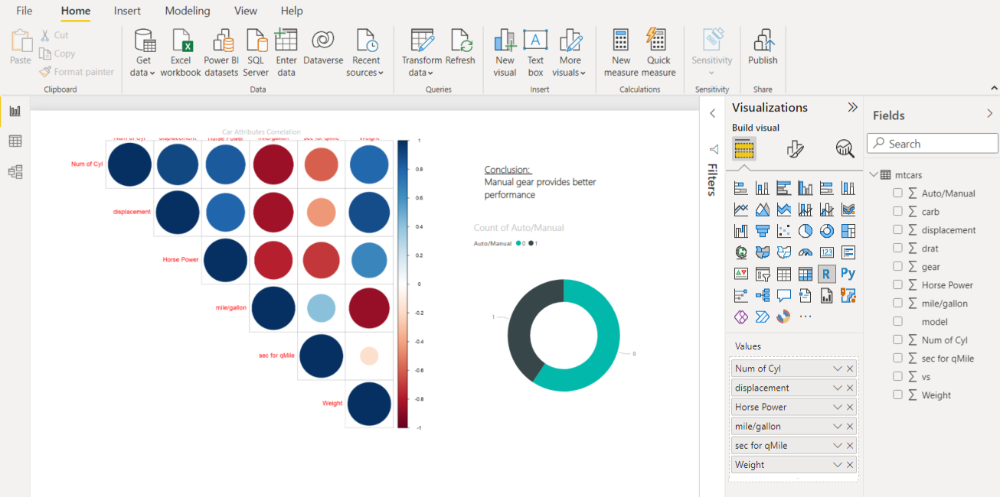
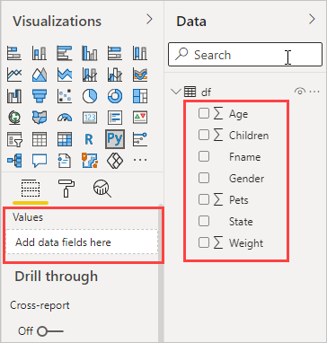

> 출처: Microsoft Learn — Create R visuals / Create Python visuals in Power BI Desktop (`visuals/service-r-visuals`, `connect-data/desktop-python-visuals`).

**필드 웰**: **값(Values)** 웰 하나. 끌어 놓은 열은 스크립트에서 `dataset` 변수(R) 또는 `dataset` 데이터프레임(Python)으로 자동 제공된다.

**서식 창 주요 항목**:

- **스크립트 옵션**: 일부 빌드에서 스크립트 편집기의 **서식**·**테마**가 노출된다.
- **제목·배경 등 일반 옵션**은 6.0과 동일.
- 실제 차트 서식(범례·축·색)은 **스크립트 내부의 플로팅 라이브러리**(`ggplot2`, `matplotlib`, `seaborn` 등)에서 설정해야 한다.

**분석·드릴·상호 작용**: 코드 결과 이미지를 **인터랙션하지 못한다**(정적 이미지 출력). 대신 슬라이서·필터에 반응해 스크립트가 재실행되어 이미지가 갱신된다. **옵션 → 전역 → Python/R 스크립팅**에서 **인터프리터 경로**와 **실행 디렉터리**를 먼저 설정해야 한다.

### 6.21 사용자 지정 시각적 개체(Custom visual)

**한 줄 정의**: **AppSource 마켓플레이스** 또는 조직이 가져온 **사용자 지정 개체(.pbiviz)**로, 표준 개체 외의 차트·컨트롤을 제공한다.

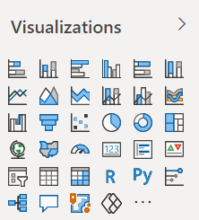

> 출처: Microsoft Learn — Visualizations in Power BI (`developer/visuals/power-bi-custom-visuals`).

**필드 웰**: 개체마다 다르다. 대부분 표준 개체와 유사한 **카테고리·값·범례**를 요구하지만, 개체가 정의한 **고유 웰**(예: 날짜 축, 제어 필드)이 추가될 수 있다.

**서식 창 주요 항목**:

- 개체가 **cap.json**으로 정의한 **서식 속성(capability)**이 그대로 나타난다.
- 표준 **일반** 그룹(제목·배경·테두리·패딩)은 Power BI가 공통으로 제공한다.
- 인증 개체는 **인증 배지**가 **시각화** 창에 표시된다.

**분석·드릴·상호 작용**: 분석 창은 개체가 지원해야만 보인다. **관리자 포털**에서 **조직 테넌트 정책**으로 **사용자 지정 개체 가져오기 차단**이 걸려 있을 수 있다.

### 6.22 기타 기본 시각화 / 작은 배수 정리

**한 줄 정의**: 시각화 창에 기본으로 포함될 수 있는 **이미지**, **텍스트 상자**, **단추**, **도형**과 같은 비차트 개체, 그리고 여러 유형에서 켤 수 있는 **작은 배수(Small multiples)** 기능을 정리한다.

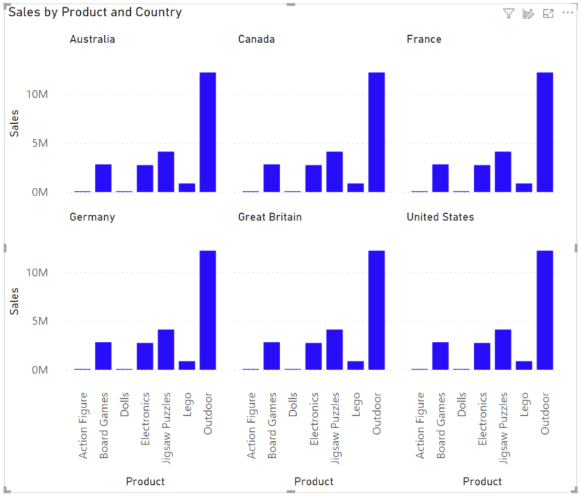

> 출처: Microsoft Learn — Small multiples in Power BI (`visuals/power-bi-visualization-small-multiples`).

**작은 배수(Small multiples)**: 6.4·6.5·6.7·6.8에서 언급했듯, **범주 열 하나**를 `작은 배수` 웰에 넣으면 **동일한 차트가 격자 형태로 반복**된다. **서식**의 **그리드 레이아웃**에서 **행·열 수**, **패딩**, **머리글 글꼴**, **공유 축(Share axis)**(모든 격자 칸이 같은 축을 공유할지 여부)을 설정한다. 한 칸의 값 규모가 매우 다를 때는 공유 축을 꺼서 각 칸이 자체 스케일로 그려지도록 한다.

**기타 비차트 개체**:

- **텍스트 상자(Text box)**: 제목·주석용 서식 텍스트 블록. 하이퍼링크 삽입 가능.
- **단추(Buttons)**: **빈 단추**, **드릴스루**, **페이지 탐색**, **Q&A 시작**, **뒤로** 등 동작이 정의된 단추. **작업(Action)**에서 **유형**(북마크·페이지 탐색·Web URL·Q&A·드릴스루)을 선택한다.
- **이미지(Image)**: 로고·인포그래픽을 삽입. 크기·크롭·링크를 지원한다.
- **도형(Shapes)**: 직사각형·선·화살표 등. **채우기·테두리·그림자**를 조정한다.

설치된 빌드의 **시각화** 창을 한 번 순회하여 조직에 기본 포함된 사용자 지정 개체·공식 갤러리 개체가 있는지 확인하고, 없는 유형은 본 절의 **자립 템플릿**(정의 → 예시 이미지 → 필드 웰 → 서식 → 상호 작용)에 맞춰 추가 기록한다.

---

## 7. Power Query 편집기

**쿼리** 목록에서 복제·그룹·종속성을 관리한다. **홈** 리본에서 **닫기 및 적용**, **고급 편집기**, **데이터 원본 설정**을 연다. **변환**과 **추가 열** 리본은 테이블·열 단위 변환을 제공한다. **단계 적용된 쿼리**에서 각 단계를 선택·삭제·순서 변경하고, **프라이버시 수준**과 **방화벽** 경고를 해소한다. **매개 변수**로 환경별 경로를 분리한다.

---

## 8. 데이터 뷰

테이블을 선택해 **행 미리 보기**를 본다. **데이터 범주**와 **기본 요약**은 보고서 기본 동작에 영향을 준다.

---

## 9. 모델 뷰

**다이어그램**에서 드래그로 테이블을 배치하고, 관계선을 만든다. 관계 편집에서 **카디널리티**, **교차 필터 방향**, **참조 무결성 가정**을 설정한다. **계층**은 날짜·지리 등에 자주 쓴다. Import·DirectQuery·복합 모델의 제약은 Learn의 “복합 모델” 항목을 따른다.

---

## 10. 행 수준 보안(RLS)

**역할**을 만들고 DAX 필터로 행을 제한한다. **다른 역할로 보기**로 미리 본다. 서비스 게이트웨이·멤버 자격은 서비스 쪽 주제이다.

---

## 11. 옵션 대화상자

**현재 파일**에서는 이 PBIX에만 적용할 **데이터 로드**, **쿼리**, **데이터 세트** 일반·보안·개인 정보 옵션을 연다. **전역**에서는 모든 파일에 적용할 동일 범주와 **DirectQuery**, **업데이트 채널** 등을 연다.

---

## 12. Learn 문서 매핑(체크리스트 A–N)

| 체크리스트 | Microsoft Learn 시작점 |
| --- | --- |
| A 메타 | [Power BI 설명서](https://learn.microsoft.com/power-bi/) |
| B 파일·시작 | Desktop 기본 도움말·시작 |
| C 리본 | 보고서 뷰 도움말 |
| D 캔버스 | [보고서 뷰에서 디자인](https://learn.microsoft.com/power-bi/create-reports/desktop-report-view) |
| E 필드 | [필드 목록](https://learn.microsoft.com/power-bi/transform-model/desktop-field-list) |
| F 시각화 | 각 시각화 도움말(예: [매트릭스](https://learn.microsoft.com/power-bi/visuals/desktop-matrix-visual)) |
| G Power Query | [Power Query 편집기](https://learn.microsoft.com/power-bi/transform-model/desktop-query-overview) |
| H 데이터 뷰 | [데이터 뷰](https://learn.microsoft.com/power-bi/transform-model/desktop-data-view) |
| I 모델 뷰 | [모델 뷰](https://learn.microsoft.com/power-bi/transform-model/desktop-modeling-view) |
| J RLS | [행 수준 보안](https://learn.microsoft.com/power-bi/admin/service-admin-rls) |
| K 옵션 | Desktop 옵션 도움말 |
| L DAX | [DAX 함수 참조](https://learn.microsoft.com/dax/dax-function-reference) |
| M 함수 | [M 함수 참조](https://learn.microsoft.com/powerquery-m/power-query-m-function-reference) |
| N 참고 | 위 링크 모음 |

<!-- annotation: DAX appendix generated by scripts/generate_power_bi_dax_m_appendices.py -->

## 부록 D: DAX 함수 레퍼런스

이 부록은 **읽고 바로 따라 할 수 있도록** 다음 순서로 구성한다.

1. **D.0 기초 개념과 샘플 모델** — 모든 예제에서 공통으로 쓰는 테이블(`Sales`, `'Date'`, `Product`, `Customer`)과 필터·행 컨텍스트, `CALCULATE`의 역할을 설명한다.
2. **D.1 실무 중심 심층 예제** — 가장 자주 쓰이는 약 140개 함수를 **시그니처 → 의미 → 입력 → DAX 식 → 결과**로 보여 준다.
3. **D.2 카테고리별 전 함수 색인** — dax.guide 사이트맵에서 확인한 DAX 함수 전수를 카테고리별로 나눠 한 줄 설명 + Microsoft Learn·DAX Guide 링크로 정리한다. 심층 예제에 포함된 함수도 색인에 함께 실어 완결성을 유지한다.

### D.0 기초 개념과 샘플 모델

**샘플 모델(예제에서 공통 사용)**:

| 테이블 | 주요 열 | 관계 |
| --- | --- | --- |
| `Sales` | `OrderId`, `OrderDate`, `ShipDate`, `CustomerId`, `ProductId`, `Qty`, `UnitPrice`, `Amount`(= Qty×UnitPrice), `Note` | `Sales[CustomerId] → Customer[Id]`, `Sales[ProductId] → Product[Id]`, `Sales[OrderDate] → 'Date'[Date]` |
| `'Date'` | `Date`, `Year`, `Quarter`, `Month`, `MonthName`, `DayOfWeek` | 날짜 테이블로 표시 |
| `Customer` | `Id`, `Name`, `Country`, `Email` | |
| `Product` | `Id`, `Name`, `Category`, `Color`, `Cost` | |

**샘플 데이터 일부**:

```
Sales
OrderId | OrderDate   | CustomerId | ProductId | Qty | UnitPrice | Amount
1001    | 2026-01-03  | C001       | P001      | 2   | 100       | 200
1002    | 2026-01-05  | C002       | P002      |10   |  20       | 200
1003    | 2026-02-11  | C001       | P003      | 1   | 500       | 500
1004    | 2026-03-02  | C003       | P001      | 5   | 100       | 500
```

**필터 컨텍스트(Filter context)**: 보고서 시각화의 축·슬라이서·페이지 필터로 만들어지는 **WHERE 조건 모음**. 측정값이 평가될 때 이 조건으로 테이블이 먼저 걸러진다.

**행 컨텍스트(Row context)**: 계산 열과 `SUMX`·`FILTER` 같은 **행 반복 함수(iterator)** 내부에서만 존재한다. 행 하나를 가리키고, 그 행의 열 값을 식에서 직접 참조할 수 있다. 행 컨텍스트에서 다른 테이블 열을 보려면 `RELATED`가 필요하다.

**CALCULATE**: 필터 컨텍스트를 **수정하고** 식을 다시 평가한다. 인수로 주어지는 열=값 형태의 조건은 내부적으로 `FILTER(ALL(<table>), ...)`로 해석된다. `CALCULATE` 호출은 동시에 **행 컨텍스트 → 필터 컨텍스트 전환**을 수행하므로, 계산 열 내부에서 측정값을 호출하면 자동으로 `CALCULATE`로 감싸는 효과가 난다.

**VAR / RETURN**: 중간 결과를 변수에 담아 **한 번만 평가**하고 재사용한다. 가독성·성능 모두에서 권장.

```
[Profit Margin] =
VAR _sales = SUM(Sales[Amount])
VAR _cost = SUMX(Sales, Sales[Qty] * RELATED(Product[Cost]))
RETURN DIVIDE(_sales - _cost, _sales)
```

이 절의 모든 예제는 위 샘플 모델을 전제로 한다. `[측정값]` 대괄호 표기는 측정값 이름을 의미하며 테이블 참조가 생략된 형태이다.

### D.1 실무 중심 심층 예제

카테고리 순서대로 가장 자주 쓰이는 함수를 **시그니처 → 의미 → 입력 → DAX 식 → 결과** 형식으로 정리했다. 예제는 D.0의 샘플 모델을 전제로 한다.

#### 분류: 집계(Aggregation)

##### AVERAGE

- **시그니처**: `AVERAGE(<column>)`
- **의미**: 숫자 열의 산술 평균을 계산한다.
- **입력 예**: `Sales[Amount]` = { 100, 200, 300 }
- **DAX 식**:

    ```DAX
    [Avg Amount] = AVERAGE(Sales[Amount])
    ```

- **결과**: 200
- **주의**: 빈 값은 **개수에서 제외**된다. 0이 포함되면 평균이 달라진다.
- **참고**: [Microsoft Learn](https://learn.microsoft.com/en-us/dax/average-function-dax) · [DAX Guide](https://dax.guide/average/)

##### AVERAGEX

- **시그니처**: `AVERAGEX(<table>, <expression>)`
- **의미**: 테이블의 각 행에 식을 평가해 평균을 낸다. 식 내부에서 행 간 곱셈·비교가 필요한 경우에 쓴다.
- **입력 예**: Sales = { (Qty=2, UnitPrice=10), (Qty=3, UnitPrice=20) }
- **DAX 식**:

    ```DAX
    [Avg Line Revenue] = AVERAGEX(Sales, Sales[Qty] * Sales[UnitPrice])
    ```

- **결과**: (20 + 60) / 2 = 40
- **참고**: [Microsoft Learn](https://learn.microsoft.com/en-us/dax/averagex-function-dax) · [DAX Guide](https://dax.guide/averagex/)

##### COUNT

- **시그니처**: `COUNT(<column>)`
- **의미**: 숫자·날짜·논리 열에서 **비어 있지 않은 값의 개수**를 센다.
- **입력 예**: Sales 행 5개 중 OrderId BLANK 1개
- **DAX 식**:

    ```DAX
    [Order Count] = COUNT(Sales[OrderId])
    ```

- **결과**: 4
- **주의**: 텍스트 열에는 `COUNTA`를 쓴다.
- **참고**: [Microsoft Learn](https://learn.microsoft.com/en-us/dax/count-function-dax) · [DAX Guide](https://dax.guide/count/)

##### COUNTA

- **시그니처**: `COUNTA(<column>)`
- **의미**: 빈 값을 제외한 **모든 형식**의 값 개수를 센다. 텍스트 열에 유용.
- **DAX 식**:

    ```DAX
    [With Note] = COUNTA(Sales[Note])
    ```

- **결과**: Sales 5행 중 Note가 비어있지 않은 3행 → 3
- **참고**: [Microsoft Learn](https://learn.microsoft.com/en-us/dax/counta-function-dax) · [DAX Guide](https://dax.guide/counta/)

##### COUNTBLANK

- **시그니처**: `COUNTBLANK(<column>)`
- **의미**: 열에서 BLANK(공란)의 개수를 센다. 데이터 품질 측정에 유용.
- **DAX 식**:

    ```DAX
    [Missing Email] = COUNTBLANK(Customer[Email])
    ```

- **결과**: 빈 이메일 행 수
- **참고**: [Microsoft Learn](https://learn.microsoft.com/en-us/dax/countblank-function-dax) · [DAX Guide](https://dax.guide/countblank/)

##### COUNTROWS

- **시그니처**: `COUNTROWS(<table>)`
- **의미**: 테이블(또는 식의 결과 테이블) 행 수를 센다. 집계 중 가장 명확·빠른 함수.
- **DAX 식**:

    ```DAX
    [Sales Lines] = COUNTROWS(Sales)
    ```

- **결과**: 예: 1204
- **주의**: `COUNT(Sales[OrderId])`는 빈 값을 빼지만 `COUNTROWS`는 BLANK 행도 포함한다.
- **참고**: [Microsoft Learn](https://learn.microsoft.com/en-us/dax/countrows-function-dax) · [DAX Guide](https://dax.guide/countrows/)

##### COUNTX

- **시그니처**: `COUNTX(<table>, <expression>)`
- **의미**: 식이 비어 있지 않은 행의 수를 센다. 필터 조건을 카운트로 표현할 때 쓴다.
- **DAX 식**:

    ```DAX
    [Big Orders] = COUNTX(Sales, IF(Sales[Amount] > 1000, 1))
    ```

- **결과**: Amount > 1000 인 행의 수
- **참고**: [Microsoft Learn](https://learn.microsoft.com/en-us/dax/countx-function-dax) · [DAX Guide](https://dax.guide/countx/)

##### DISTINCTCOUNT

- **시그니처**: `DISTINCTCOUNT(<column>)`
- **의미**: 열의 **고유 값 수**(BLANK 포함).
- **DAX 식**:

    ```DAX
    [Customers] = DISTINCTCOUNT(Sales[CustomerId])
    ```

- **결과**: 예: 57
- **주의**: BLANK를 세고 싶지 않으면 `DISTINCTCOUNTNOBLANK`.
- **참고**: [Microsoft Learn](https://learn.microsoft.com/en-us/dax/distinctcount-function-dax) · [DAX Guide](https://dax.guide/distinctcount/)

##### DISTINCTCOUNTNOBLANK

- **시그니처**: `DISTINCTCOUNTNOBLANK(<column>)`
- **의미**: 열의 고유 값 수에서 BLANK를 제외한다.
- **DAX 식**:

    ```DAX
    [Customers (no blank)] = DISTINCTCOUNTNOBLANK(Sales[CustomerId])
    ```

- **결과**: 예: 56
- **참고**: [Microsoft Learn](https://learn.microsoft.com/en-us/dax/distinctcountnoblank-function-dax) · [DAX Guide](https://dax.guide/distinctcountnoblank/)

##### MAX

- **시그니처**: `MAX(<column>)`
- **의미**: 숫자·날짜 열의 최댓값을 반환한다.
- **DAX 식**:

    ```DAX
    [Latest Order] = MAX(Sales[OrderDate])
    ```

- **결과**: 2026-04-20
- **참고**: [Microsoft Learn](https://learn.microsoft.com/en-us/dax/max-function-dax) · [DAX Guide](https://dax.guide/max/)

##### MAXX

- **시그니처**: `MAXX(<table>, <expression>)`
- **의미**: 각 행에서 평가한 식의 최댓값을 돌려주는 행 반복 함수.
- **DAX 식**:

    ```DAX
    [Max Line Revenue] = MAXX(Sales, Sales[Qty] * Sales[UnitPrice])
    ```

- **결과**: 60
- **참고**: [Microsoft Learn](https://learn.microsoft.com/en-us/dax/maxx-function-dax) · [DAX Guide](https://dax.guide/maxx/)

##### MIN

- **시그니처**: `MIN(<column>)`
- **의미**: 숫자·날짜 열의 최솟값을 반환한다.
- **입력 예**: Sales[OrderDate] 최솟값이 2026-01-03
- **DAX 식**:

    ```DAX
    [First Order] = MIN(Sales[OrderDate])
    ```

- **결과**: 2026-01-03
- **참고**: [Microsoft Learn](https://learn.microsoft.com/en-us/dax/min-function-dax) · [DAX Guide](https://dax.guide/min/)

##### MINX

- **시그니처**: `MINX(<table>, <expression>)`
- **의미**: 각 행에서 평가한 식의 최솟값을 돌려주는 행 반복 함수.
- **입력 예**: Sales = { (2, 10), (3, 20) } → 20, 60
- **DAX 식**:

    ```DAX
    [Min Line Revenue] = MINX(Sales, Sales[Qty] * Sales[UnitPrice])
    ```

- **결과**: 20
- **참고**: [Microsoft Learn](https://learn.microsoft.com/en-us/dax/minx-function-dax) · [DAX Guide](https://dax.guide/minx/)

##### PRODUCTX

- **시그니처**: `PRODUCTX(<table>, <expression>)`
- **의미**: 각 행에서 평가한 식의 **곱**을 반환한다(복합 성장률 등에 사용).
- **DAX 식**:

    ```DAX
    [Compound Growth] = PRODUCTX('Growth', 1 + 'Growth'[Rate]) - 1
    ```

- **참고**: [Microsoft Learn](https://learn.microsoft.com/en-us/dax/productx-function-dax) · [DAX Guide](https://dax.guide/productx/)

##### SUM

- **시그니처**: `SUM(<column>)`
- **의미**: 한 숫자 열의 모든 값을 단순 합계한다. 내부적으로 `SUMX(VALUES(...), ...)`에 가깝게 동작하며 필터 컨텍스트를 존중한다.
- **입력 예**: `Sales[Amount]` = { 100, 200, 300 }
- **DAX 식**:

    ```DAX
    [Total Amount] = SUM(Sales[Amount])
    ```

- **결과**: 600
- **주의**: 빈(BLANK) 값은 무시, 비숫자가 섞이면 오류. 문자열 형태 숫자는 자동 변환되지 않는다.
- **참고**: [Microsoft Learn](https://learn.microsoft.com/en-us/dax/sum-function-dax) · [DAX Guide](https://dax.guide/sum/)

##### SUMX

- **시그니처**: `SUMX(<table>, <expression>)`
- **의미**: 테이블의 각 행에 식을 평가한 뒤 결과를 합산하는 행 반복 함수(iterator). 각 행이 **행 컨텍스트**를 만든다.
- **입력 예**: Sales = { (Qty=2, UnitPrice=10), (Qty=3, UnitPrice=20) }
- **DAX 식**:

    ```DAX
    [Revenue] = SUMX(Sales, Sales[Qty] * Sales[UnitPrice])
    ```

- **결과**: 2*10 + 3*20 = 80
- **주의**: 행 컨텍스트에서 다른 테이블 열을 참조하려면 `RELATED`가 필요하다.
- **참고**: [Microsoft Learn](https://learn.microsoft.com/en-us/dax/sumx-function-dax) · [DAX Guide](https://dax.guide/sumx/)

#### 분류: 논리(Logical)

##### AND

- **시그니처**: `AND(<logical1>, <logical2>)`
- **의미**: 두 식이 모두 TRUE면 TRUE. 연산자 `&&`와 동일하며 두 개 이상에는 `&&`가 가독성이 좋다.
- **DAX 식**:

    ```DAX
    IF(AND(Sales[Amount] > 1000, Sales[Qty] > 10), "VIP", "")
    ```

- **참고**: [Microsoft Learn](https://learn.microsoft.com/en-us/dax/and-function-dax) · [DAX Guide](https://dax.guide/and/)

##### COALESCE

- **시그니처**: `COALESCE(<value1>, <value2>, ...)`
- **의미**: 첫 번째 **비-BLANK** 값을 반환한다. `IF(ISBLANK(x), y, x)`의 간결한 대안.
- **DAX 식**:

    ```DAX
    [Revenue Safe] = COALESCE(SUM(Sales[Amount]), 0)
    ```

- **결과**: 빈 필터에서 BLANK 대신 0
- **참고**: [Microsoft Learn](https://learn.microsoft.com/en-us/dax/coalesce-function-dax) · [DAX Guide](https://dax.guide/coalesce/)

##### FALSE

- **시그니처**: `FALSE()`
- **의미**: 상수 FALSE.
- **참고**: [Microsoft Learn](https://learn.microsoft.com/en-us/dax/false-function-dax) · [DAX Guide](https://dax.guide/false/)

##### IF

- **시그니처**: `IF(<logical>, <value_if_true>, [<value_if_false>])`
- **의미**: 조건이 참이면 첫 값을, 아니면 둘째 값을 반환. 셋째 인수 생략 시 BLANK.
- **입력 예**: Amount=1500 행 → "High", Amount=200 행 → "Low"
- **DAX 식**:

    ```DAX
    [Segment] = IF(Sales[Amount] >= 1000, "High", "Low")
    ```

- **결과**: 각 행마다 문자열 라벨
- **주의**: 반환 타입이 두 가지면 두 분기의 데이터 형이 일치해야 예측 가능한 결과가 나온다. 복잡한 분기에는 `SWITCH`가 좋다.
- **참고**: [Microsoft Learn](https://learn.microsoft.com/en-us/dax/if-function-dax) · [DAX Guide](https://dax.guide/if/)

##### IFERROR

- **시그니처**: `IFERROR(<value>, <value_if_error>)`
- **의미**: 첫 식이 오류를 발생시키면 두 번째 식을 대신 반환한다.
- **DAX 식**:

    ```DAX
    [Ratio Safe] = IFERROR(DIVIDE(Sales[Amount], Sales[Qty]), 0)
    ```

- **결과**: Qty=0인 행에서도 오류 대신 0
- **주의**: 가능하면 `DIVIDE` 자체의 오류 방지를 먼저 쓰는 것이 빠르다.
- **참고**: [Microsoft Learn](https://learn.microsoft.com/en-us/dax/iferror-function-dax) · [DAX Guide](https://dax.guide/iferror/)

##### NOT

- **시그니처**: `NOT(<logical>)`
- **의미**: 논리값을 뒤집는다.
- **DAX 식**:

    ```DAX
    FILTER(Sales, NOT(ISBLANK(Sales[Discount])))
    ```

- **참고**: [Microsoft Learn](https://learn.microsoft.com/en-us/dax/not-function-dax) · [DAX Guide](https://dax.guide/not/)

##### OR

- **시그니처**: `OR(<logical1>, <logical2>)`
- **의미**: 둘 중 하나만 TRUE면 TRUE. 연산자 `||`와 동일.
- **DAX 식**:

    ```DAX
    IF(OR(Customer[Country]="KR", Customer[Country]="JP"), 1, 0)
    ```

- **참고**: [Microsoft Learn](https://learn.microsoft.com/en-us/dax/or-function-dax) · [DAX Guide](https://dax.guide/or/)

##### SWITCH

- **시그니처**: `SWITCH(<expression>, <v1>, <r1>, [v2, r2, ...], [<else>])`
- **의미**: 식 결과와 값 목록을 차례로 비교해 일치하는 결과를 돌려준다. `SWITCH(TRUE(), ...)` 패턴으로 다중 조건 분기에도 사용.
- **DAX 식**:

    ```DAX
    [Grade] = SWITCH(TRUE(), [Score] >= 90, "A", [Score] >= 80, "B", "C")
    ```

- **결과**: 점수별 A/B/C
- **참고**: [Microsoft Learn](https://learn.microsoft.com/en-us/dax/switch-function-dax) · [DAX Guide](https://dax.guide/switch/)

##### TRUE

- **시그니처**: `TRUE()`
- **의미**: 상수 TRUE. `SWITCH(TRUE(), ...)` 패턴에 자주 쓴다.
- **참고**: [Microsoft Learn](https://learn.microsoft.com/en-us/dax/true-function-dax) · [DAX Guide](https://dax.guide/true/)

#### 분류: 필터(Filter)

##### ALL

- **시그니처**: `ALL([<table> | <column>[, <column>, ...]])`
- **의미**: 지정한 테이블 또는 열의 **필터를 제거**한 테이블을 돌려준다. `CALCULATE`의 필터 인수로 넣어 컨텍스트를 무시한다.
- **DAX 식**:

    ```DAX
    [Total (All Years)] = CALCULATE(SUM(Sales[Amount]), ALL('Date'))
    ```

- **결과**: 슬라이서·열 필터 무관 연도 합계
- **참고**: [Microsoft Learn](https://learn.microsoft.com/en-us/dax/all-function-dax) · [DAX Guide](https://dax.guide/all/)

##### ALLEXCEPT

- **시그니처**: `ALLEXCEPT(<table>, <column1>[, <column2>, ...])`
- **의미**: 지정한 열 **외에는** 전부 필터 제거. 상위 총계 비율 계산 시 표준 패턴.
- **DAX 식**:

    ```DAX
    [% of Country] = DIVIDE([Sales], CALCULATE([Sales], ALLEXCEPT(Customer, Customer[Country])))
    ```

- **결과**: 각 행이 속한 국가 내 비중
- **참고**: [Microsoft Learn](https://learn.microsoft.com/en-us/dax/allexcept-function-dax) · [DAX Guide](https://dax.guide/allexcept/)

##### ALLSELECTED

- **시그니처**: `ALLSELECTED([<table_or_column>])`
- **의미**: **시각적 개체 외부 필터**(슬라이서·페이지 필터)는 유지하고, **내부 좌표 축 필터**만 제거한다. “보이는 데이터 대비 비율”을 구할 때 쓴다.
- **DAX 식**:

    ```DAX
    [% Visible] = DIVIDE([Sales], CALCULATE([Sales], ALLSELECTED(Sales)))
    ```

- **참고**: [Microsoft Learn](https://learn.microsoft.com/en-us/dax/allselected-function-dax) · [DAX Guide](https://dax.guide/allselected/)

##### CALCULATE

- **시그니처**: `CALCULATE(<expression>, [<filter1>, <filter2>, ...])`
- **의미**: 식을 **변경된 필터 컨텍스트**에서 평가한다. DAX에서 가장 중요한 함수이며, 행 컨텍스트를 필터 컨텍스트로 **컨텍스트 전환**하는 역할도 한다.
- **DAX 식**:

    ```DAX
    [Sales KR] = CALCULATE(SUM(Sales[Amount]), Customer[Country] = "KR")
    ```

- **결과**: 전체 Amount 1,000,000 중 KR 고객분 230,000
- **주의**: 암시적 필터 인수는 자동으로 `FILTER(ALL(table), ...)` 로 변환된다. 기존 필터를 유지하려면 `KEEPFILTERS(...)`를 감싼다.
- **참고**: [Microsoft Learn](https://learn.microsoft.com/en-us/dax/calculate-function-dax) · [DAX Guide](https://dax.guide/calculate/)

##### CALCULATETABLE

- **시그니처**: `CALCULATETABLE(<table_expr>, [<filter1>, ...])`
- **의미**: `CALCULATE`의 테이블 반환 버전. 변경된 컨텍스트에서 테이블을 돌려준다.
- **DAX 식**:

    ```DAX
    Top Customers KR = CALCULATETABLE(TOPN(10, Customer, [Revenue]), Customer[Country]="KR")
    ```

- **결과**: KR 고객 중 매출 상위 10행 테이블
- **참고**: [Microsoft Learn](https://learn.microsoft.com/en-us/dax/calculatetable-function-dax) · [DAX Guide](https://dax.guide/calculatetable/)

##### CROSSFILTER

- **시그니처**: `CROSSFILTER(<col1>, <col2>, <direction>)`
- **의미**: 특정 계산에서만 관계의 교차 필터 방향을 바꾼다. `None`/`OneWay`/`Both`.
- **참고**: [Microsoft Learn](https://learn.microsoft.com/en-us/dax/crossfilter-function-dax) · [DAX Guide](https://dax.guide/crossfilter/)

##### FILTER

- **시그니처**: `FILTER(<table>, <condition>)`
- **의미**: 테이블에서 조건을 만족하는 **행만** 남긴다. `CALCULATE`의 부울식 필터보다 복잡한 조건을 쓸 때 사용.
- **DAX 식**:

    ```DAX
    [High Qty Sales] = CALCULATE(SUM(Sales[Amount]), FILTER(Sales, Sales[Qty] > 10))
    ```

- **결과**: Qty>10인 행만의 Amount 합
- **주의**: `FILTER(ALL(Sales), ...)` 처럼 `ALL`과 자주 조합해 “모든 행 중 조건”을 만든다.
- **참고**: [Microsoft Learn](https://learn.microsoft.com/en-us/dax/filter-function-dax) · [DAX Guide](https://dax.guide/filter/)

##### HASONEFILTER

- **시그니처**: `HASONEFILTER(<column>)`
- **의미**: 열에 **필터 자체가 1개**인지 확인한다(값이 1개와는 미묘하게 다르다).
- **참고**: [Microsoft Learn](https://learn.microsoft.com/en-us/dax/hasonefilter-function-dax) · [DAX Guide](https://dax.guide/hasonefilter/)

##### HASONEVALUE

- **시그니처**: `HASONEVALUE(<column>)`
- **의미**: 열이 정확히 1개 값으로 필터되어 있으면 TRUE.
- **DAX 식**:

    ```DAX
    IF(HASONEVALUE('Date'[Year]), [YoY], BLANK())
    ```

- **참고**: [Microsoft Learn](https://learn.microsoft.com/en-us/dax/hasonevalue-function-dax) · [DAX Guide](https://dax.guide/hasonevalue/)

##### ISCROSSFILTERED

- **시그니처**: `ISCROSSFILTERED(<table_or_column>)`
- **의미**: 다른 테이블의 관계 경로로 **교차 필터**되어 있는지 검사.
- **참고**: [Microsoft Learn](https://learn.microsoft.com/en-us/dax/iscrossfiltered-function-dax) · [DAX Guide](https://dax.guide/iscrossfiltered/)

##### ISFILTERED

- **시그니처**: `ISFILTERED(<table_or_column>)`
- **의미**: 직접 필터가 걸려 있는지 검사.
- **참고**: [Microsoft Learn](https://learn.microsoft.com/en-us/dax/isfiltered-function-dax) · [DAX Guide](https://dax.guide/isfiltered/)

##### KEEPFILTERS

- **시그니처**: `KEEPFILTERS(<expression>)`
- **의미**: `CALCULATE`의 필터 인수를 감싸, 같은 열의 기존 필터를 **대체하지 않고 교집합**으로 적용한다.
- **DAX 식**:

    ```DAX
    [Sales HE] = CALCULATE([Sales], KEEPFILTERS(Product[Color] = "Red"))
    ```

- **결과**: 기존 슬라이서로 고른 색 중 Red도 포함된 행만
- **참고**: [Microsoft Learn](https://learn.microsoft.com/en-us/dax/keepfilters-function-dax) · [DAX Guide](https://dax.guide/keepfilters/)

##### LOOKUPVALUE

- **시그니처**: `LOOKUPVALUE(<result_col>, <search_col1>, <search_value1>[, ...])`
- **의미**: 조건을 만족하는 **단일 행**의 값을 돌려준다. 관계가 없을 때도 동작.
- **DAX 식**:

    ```DAX
    [Country] = LOOKUPVALUE(Customer[Country], Customer[Id], Sales[CustomerId])
    ```

- **주의**: 여러 행이 일치하면 오류. 네 번째 인수로 대체 값을 지정할 수 있다.
- **참고**: [Microsoft Learn](https://learn.microsoft.com/en-us/dax/lookupvalue-function-dax) · [DAX Guide](https://dax.guide/lookupvalue/)

##### REMOVEFILTERS

- **시그니처**: `REMOVEFILTERS([<table> | <column>[, ...]])`
- **의미**: `CALCULATE`의 **수식 한정 필터 인수**로 설계된 `ALL`의 명시적 대안. 필터만 제거하고 테이블을 반환하지 않는다.
- **DAX 식**:

    ```DAX
    [Grand Total] = CALCULATE([Sales], REMOVEFILTERS())
    ```

- **참고**: [Microsoft Learn](https://learn.microsoft.com/en-us/dax/removefilters-function-dax) · [DAX Guide](https://dax.guide/removefilters/)

##### SELECTEDVALUE

- **시그니처**: `SELECTEDVALUE(<column>[, <alternate>])`
- **의미**: 현재 필터 컨텍스트에서 열에 **정확히 하나**의 값만 있으면 그 값, 아니면 대체 값(기본 BLANK)을 돌려준다.
- **DAX 식**:

    ```DAX
    [Current Country] = SELECTEDVALUE(Customer[Country], "(여러 국가)")
    ```

- **참고**: [Microsoft Learn](https://learn.microsoft.com/en-us/dax/selectedvalue-function-dax) · [DAX Guide](https://dax.guide/selectedvalue/)

##### TREATAS

- **시그니처**: `TREATAS(<expression>, <column>[, <column>, ...])`
- **의미**: **관계가 없는** 테이블 간에도 열 값을 필터로 **가상 연결**한다.
- **DAX 식**:

    ```DAX
    VAR kr_ids = VALUES(Customer[Id]) RETURN CALCULATE([Sales Foreign], TREATAS(kr_ids, Foreign[CustId]))
    ```

- **참고**: [Microsoft Learn](https://learn.microsoft.com/en-us/dax/treatas-function-dax) · [DAX Guide](https://dax.guide/treatas/)

##### USERELATIONSHIP

- **시그니처**: `USERELATIONSHIP(<col1>, <col2>)`
- **의미**: `CALCULATE`의 수식 한정 인수. **비활성 관계**를 이번 평가에만 활성화한다.
- **DAX 식**:

    ```DAX
    [Sales by Ship Date] = CALCULATE([Sales], USERELATIONSHIP(Sales[ShipDate], 'Date'[Date]))
    ```

- **주의**: 비활성 관계가 이미 모델 뷰에 정의되어 있어야 동작한다.
- **참고**: [Microsoft Learn](https://learn.microsoft.com/en-us/dax/userelationship-function-dax) · [DAX Guide](https://dax.guide/userelationship/)

#### 분류: 관계(Relationships)

##### RELATED

- **시그니처**: `RELATED(<column>)`
- **의미**: 현재 **행 컨텍스트**에서 관계의 ‘1’ 쪽 테이블의 열 값을 가져온다. 계산 열과 이터레이터 안에서 사용.
- **DAX 식**:

    ```DAX
    Sales[Country] = RELATED(Customer[Country])
    ```

- **결과**: 각 Sales 행에 고객 국가 값 추가
- **참고**: [Microsoft Learn](https://learn.microsoft.com/en-us/dax/related-function-dax) · [DAX Guide](https://dax.guide/related/)

##### RELATEDTABLE

- **시그니처**: `RELATEDTABLE(<table>)`
- **의미**: 현재 행에 연결된 **다대일의 다(多)쪽** 테이블 서브셋을 반환한다.
- **DAX 식**:

    ```DAX
    Customer[Orders Count] = COUNTROWS(RELATEDTABLE(Sales))
    ```

- **참고**: [Microsoft Learn](https://learn.microsoft.com/en-us/dax/relatedtable-function-dax) · [DAX Guide](https://dax.guide/relatedtable/)

#### 분류: 테이블(Table)

##### ADDCOLUMNS

- **시그니처**: `ADDCOLUMNS(<table>, <name1>, <expr1>[, ...])`
- **의미**: 테이블에 계산 열을 추가한 **새 테이블**을 반환한다. 시각화에 직접 보이는 계산 테이블 생성에 사용.
- **DAX 식**:

    ```DAX
    EVALUATE ADDCOLUMNS(VALUES(Customer[Country]), "Sales", [Total Sales])
    ```

- **결과**: 국가 | Sales 두 열의 테이블
- **참고**: [Microsoft Learn](https://learn.microsoft.com/en-us/dax/addcolumns-function-dax) · [DAX Guide](https://dax.guide/addcolumns/)

##### CROSSJOIN

- **시그니처**: `CROSSJOIN(<table1>, <table2>[, ...])`
- **의미**: 모든 행의 카르테시안 곱.
- **참고**: [Microsoft Learn](https://learn.microsoft.com/en-us/dax/crossjoin-function-dax) · [DAX Guide](https://dax.guide/crossjoin/)

##### DATATABLE

- **시그니처**: `DATATABLE(<col1_name>, <col1_type>, ..., {{<row1>}, ...})`
- **의미**: DAX 내부에서 **정적 데이터 테이블**을 정의한다. 룩업 상수 테이블에 쓰인다.
- **DAX 식**:

    ```DAX
    DATATABLE("Grade", STRING, "Min", INTEGER, {{"A", 90}, {"B", 80}})
    ```

- **참고**: [Microsoft Learn](https://learn.microsoft.com/en-us/dax/datatable-function-dax) · [DAX Guide](https://dax.guide/datatable/)

##### DISTINCT

- **시그니처**: `DISTINCT(<table_or_column>)`
- **의미**: BLANK를 포함해 **중복을 제거**한 테이블/열 값을 반환. `VALUES`와 달리 모델에 의해 자동 추가되는 빈 행(관계 위반)을 포함하지 않는다.
- **참고**: [Microsoft Learn](https://learn.microsoft.com/en-us/dax/distinct-function-dax) · [DAX Guide](https://dax.guide/distinct/)

##### EXCEPT

- **시그니처**: `EXCEPT(<table1>, <table2>)`
- **의미**: `<table1>`에서 `<table2>`의 행을 뺀 차집합.
- **참고**: [Microsoft Learn](https://learn.microsoft.com/en-us/dax/except-function-dax) · [DAX Guide](https://dax.guide/except/)

##### GENERATE

- **시그니처**: `GENERATE(<table1>, <table2_expr>)`
- **의미**: 왼쪽 테이블의 각 행마다 오른쪽 식을 평가해 **조인** 하듯 결합. 오른쪽이 빈 테이블이면 행이 제외된다.
- **참고**: [Microsoft Learn](https://learn.microsoft.com/en-us/dax/generate-function-dax) · [DAX Guide](https://dax.guide/generate/)

##### GENERATEALL

- **시그니처**: `GENERATEALL(<table1>, <table2_expr>)`
- **의미**: `GENERATE`와 유사하나 오른쪽이 비어도 왼쪽 행은 NULL과 함께 남긴다(왼쪽 외부 조인).
- **참고**: [Microsoft Learn](https://learn.microsoft.com/en-us/dax/generateall-function-dax) · [DAX Guide](https://dax.guide/generateall/)

##### GENERATESERIES

- **시그니처**: `GENERATESERIES(<start>, <end>[, <increment>])`
- **의미**: 시작/끝/간격으로 **숫자 시퀀스 테이블**을 만든다. 파라미터 슬라이서용.
- **DAX 식**:

    ```DAX
    GENERATESERIES(0, 100, 10)
    ```

- **결과**: Value 열 { 0, 10, 20, ..., 100 }
- **참고**: [Microsoft Learn](https://learn.microsoft.com/en-us/dax/generateseries-function-dax) · [DAX Guide](https://dax.guide/generateseries/)

##### GROUPBY

- **시그니처**: `GROUPBY(<table>, <groupCol1>[, ...][, <name>, <expression>])`
- **의미**: `SUMMARIZE`의 확장. `CURRENTGROUP()`을 통해 집계 식 내부에서 그룹의 서브셋을 참조할 수 있다.
- **DAX 식**:

    ```DAX
    GROUPBY(Sales, Customer[Country], "Qty", SUMX(CURRENTGROUP(), Sales[Qty]))
    ```

- **참고**: [Microsoft Learn](https://learn.microsoft.com/en-us/dax/groupby-function-dax) · [DAX Guide](https://dax.guide/groupby/)

##### INTERSECT

- **시그니처**: `INTERSECT(<table1>, <table2>)`
- **의미**: 두 테이블의 **교집합**을 반환(왼쪽 테이블의 열 이름 사용).
- **참고**: [Microsoft Learn](https://learn.microsoft.com/en-us/dax/intersect-function-dax) · [DAX Guide](https://dax.guide/intersect/)

##### NATURALINNERJOIN

- **시그니처**: `NATURALINNERJOIN(<table1>, <table2>)`
- **의미**: 공통 관계·이름으로 **내부 조인**한 표.
- **참고**: [Microsoft Learn](https://learn.microsoft.com/en-us/dax/naturalinnerjoin-function-dax) · [DAX Guide](https://dax.guide/naturalinnerjoin/)

##### NATURALLEFTOUTERJOIN

- **시그니처**: `NATURALLEFTOUTERJOIN(<table1>, <table2>)`
- **의미**: 공통 관계·이름으로 **좌외부 조인**한 표.
- **참고**: [Microsoft Learn](https://learn.microsoft.com/en-us/dax/naturalleftouterjoin-function-dax) · [DAX Guide](https://dax.guide/naturalleftouterjoin/)

##### ROW

- **시그니처**: `ROW(<name1>, <expr1>[, ...])`
- **의미**: 한 줄짜리 테이블을 만든다. 대시보드의 KPI 요약 테이블 생성에 유용.
- **DAX 식**:

    ```DAX
    EVALUATE ROW("Sales", [Total Sales], "Customers", [Customer Count])
    ```

- **참고**: [Microsoft Learn](https://learn.microsoft.com/en-us/dax/row-function-dax) · [DAX Guide](https://dax.guide/row/)

##### SELECTCOLUMNS

- **시그니처**: `SELECTCOLUMNS(<table>, <name1>, <expr1>[, ...])`
- **의미**: 입력 테이블에서 원하는 열만 골라 **새 이름으로 투영**한다.
- **DAX 식**:

    ```DAX
    SELECTCOLUMNS(Customer, "Cust", Customer[Name], "Country", Customer[Country])
    ```

- **참고**: [Microsoft Learn](https://learn.microsoft.com/en-us/dax/selectcolumns-function-dax) · [DAX Guide](https://dax.guide/selectcolumns/)

##### SUMMARIZE

- **시그니처**: `SUMMARIZE(<table>, <groupBy_col1>[, ...][, <name>, <expr>[, ...]])`
- **의미**: 그룹화 열로 집계한 표를 만든다. 단순 그룹화 용도로는 `SUMMARIZECOLUMNS`가 더 안전하다.
- **DAX 식**:

    ```DAX
    SUMMARIZE(Sales, Customer[Country], "Sales", SUM(Sales[Amount]))
    ```

- **참고**: [Microsoft Learn](https://learn.microsoft.com/en-us/dax/summarize-function-dax) · [DAX Guide](https://dax.guide/summarize/)

##### SUMMARIZECOLUMNS

- **시그니처**: `SUMMARIZECOLUMNS(<groupBy_col1>[, ...][, <filter>][, <name>, <expr>[, ...]])`
- **의미**: `SUMMARIZE`를 단순화한 버전. 필터·그룹·측정값을 한 번에 쓸 수 있어 쿼리·계산 테이블의 **표준 집계 함수**이다.
- **DAX 식**:

    ```DAX
    SUMMARIZECOLUMNS(Customer[Country], 'Date'[Year], "Sales", [Total Sales])
    ```

- **참고**: [Microsoft Learn](https://learn.microsoft.com/en-us/dax/summarizecolumns-function-dax) · [DAX Guide](https://dax.guide/summarizecolumns/)

##### TOPN

- **시그니처**: `TOPN(<n>, <table>, [<orderBy>, [<order>]...])`
- **의미**: 정렬 기준으로 상위 N개 행을 반환한다. 동률 포함.
- **DAX 식**:

    ```DAX
    TOPN(10, Customer, [Sales], DESC)
    ```

- **참고**: [Microsoft Learn](https://learn.microsoft.com/en-us/dax/topn-function-dax) · [DAX Guide](https://dax.guide/topn/)

##### UNION

- **시그니처**: `UNION(<table1>, <table2>[, ...])`
- **의미**: 같은 열 구조를 가진 테이블들을 **세로로 결합**한다. 중복 유지.
- **참고**: [Microsoft Learn](https://learn.microsoft.com/en-us/dax/union-function-dax) · [DAX Guide](https://dax.guide/union/)

##### VALUES

- **시그니처**: `VALUES(<table_or_column>)`
- **의미**: 열의 **고유 값 테이블** 또는 테이블의 고유 행 테이블을 반환. 필터 컨텍스트를 존중한다.
- **DAX 식**:

    ```DAX
    COUNTROWS(VALUES(Customer[Country]))
    ```

- **참고**: [Microsoft Learn](https://learn.microsoft.com/en-us/dax/values-function-dax) · [DAX Guide](https://dax.guide/values/)

#### 분류: 시간 인텔리전스(Time Intelligence)

##### CALENDAR

- **시그니처**: `CALENDAR(<start_date>, <end_date>)`
- **의미**: 지정 범위의 연속 날짜 테이블을 생성한다. 날짜 테이블 만들 때 기본.
- **DAX 식**:

    ```DAX
    DateTable = CALENDAR(DATE(2024,1,1), DATE(2026,12,31))
    ```

- **결과**: 1096행 Date 열
- **참고**: [Microsoft Learn](https://learn.microsoft.com/en-us/dax/calendar-function-dax) · [DAX Guide](https://dax.guide/calendar/)

##### CALENDARAUTO

- **시그니처**: `CALENDARAUTO([<fiscal_year_end_month>])`
- **의미**: 모델의 모든 날짜 열 범위를 탐지해 **자동으로** 연속 날짜 테이블을 만든다.
- **참고**: [Microsoft Learn](https://learn.microsoft.com/en-us/dax/calendarauto-function-dax) · [DAX Guide](https://dax.guide/calendarauto/)

##### DATEADD

- **시그니처**: `DATEADD(<dates>, <number_of_intervals>, <interval>)`
- **의미**: 날짜 열을 **연/분기/월/일 단위로 이동**시킨 날짜 테이블 반환. `<interval>` = YEAR/QUARTER/MONTH/DAY.
- **DAX 식**:

    ```DAX
    [Sales LY] = CALCULATE([Sales], DATEADD('Date'[Date], -1, YEAR))
    ```

- **참고**: [Microsoft Learn](https://learn.microsoft.com/en-us/dax/dateadd-function-dax) · [DAX Guide](https://dax.guide/dateadd/)

##### DATESBETWEEN

- **시그니처**: `DATESBETWEEN(<dates>, <start_date>, <end_date>)`
- **의미**: 두 날짜 사이의 날짜 집합 테이블. 누적 합계·지연 기간 계산에 쓴다.
- **DAX 식**:

    ```DAX
    [Running Sales] = CALCULATE([Sales], DATESBETWEEN('Date'[Date], BLANK(), MAX('Date'[Date])))
    ```

- **참고**: [Microsoft Learn](https://learn.microsoft.com/en-us/dax/datesbetween-function-dax) · [DAX Guide](https://dax.guide/datesbetween/)

##### DATESINPERIOD

- **시그니처**: `DATESINPERIOD(<dates>, <start_date>, <number_of_intervals>, <interval>)`
- **의미**: 시작일로부터 N 단위 앞뒤 날짜를 반환.
- **DAX 식**:

    ```DAX
    [Last 3 Months] = CALCULATE([Sales], DATESINPERIOD('Date'[Date], MAX('Date'[Date]), -3, MONTH))
    ```

- **참고**: [Microsoft Learn](https://learn.microsoft.com/en-us/dax/datesinperiod-function-dax) · [DAX Guide](https://dax.guide/datesinperiod/)

##### DATESYTD

- **시그니처**: `DATESYTD(<dates>[, <year_end_date>])`
- **의미**: 현재 필터 내 연초부터 오늘까지의 날짜 집합.
- **DAX 식**:

    ```DAX
    [Sales YTD] = CALCULATE([Sales], DATESYTD('Date'[Date]))
    ```

- **참고**: [Microsoft Learn](https://learn.microsoft.com/en-us/dax/datesytd-function-dax) · [DAX Guide](https://dax.guide/datesytd/)

##### ENDOFMONTH

- **시그니처**: `ENDOFMONTH(<dates>)`
- **의미**: 현재 필터 내 최대 날짜가 속한 **월의 마지막 날**을 반환.
- **참고**: [Microsoft Learn](https://learn.microsoft.com/en-us/dax/endofmonth-function-dax) · [DAX Guide](https://dax.guide/endofmonth/)

##### PARALLELPERIOD

- **시그니처**: `PARALLELPERIOD(<dates>, <number>, <interval>)`
- **의미**: `DATEADD`와 유사하나 **전체 구간**(예: 한 달 전체)을 반환한다.
- **참고**: [Microsoft Learn](https://learn.microsoft.com/en-us/dax/parallelperiod-function-dax) · [DAX Guide](https://dax.guide/parallelperiod/)

##### PREVIOUSMONTH

- **시그니처**: `PREVIOUSMONTH(<dates>)`
- **의미**: 현재 필터된 달의 **바로 이전 월 전체**를 반환.
- **참고**: [Microsoft Learn](https://learn.microsoft.com/en-us/dax/previousmonth-function-dax) · [DAX Guide](https://dax.guide/previousmonth/)

##### SAMEPERIODLASTYEAR

- **시그니처**: `SAMEPERIODLASTYEAR(<dates>)`
- **의미**: 현재 필터된 날짜 구간을 **정확히 1년 전**으로 이동.
- **DAX 식**:

    ```DAX
    [Sales PY] = CALCULATE([Sales], SAMEPERIODLASTYEAR('Date'[Date]))
    ```

- **참고**: [Microsoft Learn](https://learn.microsoft.com/en-us/dax/sameperiodlastyear-function-dax) · [DAX Guide](https://dax.guide/sameperiodlastyear/)

##### STARTOFMONTH

- **시그니처**: `STARTOFMONTH(<dates>)`
- **의미**: 현재 필터 내 최소 날짜가 속한 **월의 첫날**을 반환.
- **참고**: [Microsoft Learn](https://learn.microsoft.com/en-us/dax/startofmonth-function-dax) · [DAX Guide](https://dax.guide/startofmonth/)

##### TOTALYTD

- **시그니처**: `TOTALYTD(<expression>, <dates>[, <filter>][, <year_end_date>])`
- **의미**: `CALCULATE([Sales], DATESYTD(...))`의 단축형. 빠르게 YTD 측정값을 만들 때 쓴다.
- **DAX 식**:

    ```DAX
    [Sales YTD] = TOTALYTD([Sales], 'Date'[Date])
    ```

- **참고**: [Microsoft Learn](https://learn.microsoft.com/en-us/dax/totalytd-function-dax) · [DAX Guide](https://dax.guide/totalytd/)

#### 분류: 날짜·시간(Date & Time)

##### DATE

- **시그니처**: `DATE(<year>, <month>, <day>)`
- **의미**: 세 숫자로부터 날짜 값을 생성.
- **DAX 식**:

    ```DAX
    DATE(2026, 4, 20)
    ```

- **결과**: 2026-04-20
- **참고**: [Microsoft Learn](https://learn.microsoft.com/en-us/dax/date-function-dax) · [DAX Guide](https://dax.guide/date/)

##### DATEDIFF

- **시그니처**: `DATEDIFF(<start>, <end>, <interval>)`
- **의미**: 두 날짜 사이의 간격을 지정 단위로 측정. `<interval>` = SECOND/MINUTE/HOUR/DAY/WEEK/MONTH/QUARTER/YEAR.
- **DAX 식**:

    ```DAX
    DATEDIFF(Sales[OrderDate], Sales[ShipDate], DAY)
    ```

- **결과**: 배송 소요 일수
- **참고**: [Microsoft Learn](https://learn.microsoft.com/en-us/dax/datediff-function-dax) · [DAX Guide](https://dax.guide/datediff/)

##### DAY

- **시그니처**: `DAY(<date>)`
- **의미**: 날짜에서 일(1~31) 추출.
- **참고**: [Microsoft Learn](https://learn.microsoft.com/en-us/dax/day-function-dax) · [DAX Guide](https://dax.guide/day/)

##### EDATE

- **시그니처**: `EDATE(<start>, <months>)`
- **의미**: 월 단위로 날짜를 이동. `EOMONTH`의 임의 날짜 버전.
- **참고**: [Microsoft Learn](https://learn.microsoft.com/en-us/dax/edate-function-dax) · [DAX Guide](https://dax.guide/edate/)

##### EOMONTH

- **시그니처**: `EOMONTH(<start>, <months>)`
- **의미**: 지정 월수만큼 이동한 월의 **마지막 날** 반환.
- **DAX 식**:

    ```DAX
    EOMONTH(DATE(2026,4,15), 0)
    ```

- **결과**: 2026-04-30
- **참고**: [Microsoft Learn](https://learn.microsoft.com/en-us/dax/eomonth-function-dax) · [DAX Guide](https://dax.guide/eomonth/)

##### MONTH

- **시그니처**: `MONTH(<date>)`
- **의미**: 날짜에서 월(1~12) 추출.
- **참고**: [Microsoft Learn](https://learn.microsoft.com/en-us/dax/month-function-dax) · [DAX Guide](https://dax.guide/month/)

##### NOW

- **시그니처**: `NOW()`
- **의미**: 현재 날짜와 시각.
- **결과**: 2026-04-20 13:42:05
- **참고**: [Microsoft Learn](https://learn.microsoft.com/en-us/dax/now-function-dax) · [DAX Guide](https://dax.guide/now/)

##### TODAY

- **시그니처**: `TODAY()`
- **의미**: 오늘의 날짜(시각 없음).
- **결과**: 2026-04-20
- **참고**: [Microsoft Learn](https://learn.microsoft.com/en-us/dax/today-function-dax) · [DAX Guide](https://dax.guide/today/)

##### WEEKDAY

- **시그니처**: `WEEKDAY(<date>[, <return_type>])`
- **의미**: 요일을 숫자로 반환. `return_type`에 따라 기준이 다름(1: 일=1).
- **참고**: [Microsoft Learn](https://learn.microsoft.com/en-us/dax/weekday-function-dax) · [DAX Guide](https://dax.guide/weekday/)

##### WEEKNUM

- **시그니처**: `WEEKNUM(<date>[, <return_type>])`
- **의미**: 해의 주 번호(1~54).
- **참고**: [Microsoft Learn](https://learn.microsoft.com/en-us/dax/weeknum-function-dax) · [DAX Guide](https://dax.guide/weeknum/)

##### YEAR

- **시그니처**: `YEAR(<date>)`
- **의미**: 날짜에서 연도(숫자) 추출.
- **참고**: [Microsoft Learn](https://learn.microsoft.com/en-us/dax/year-function-dax) · [DAX Guide](https://dax.guide/year/)

##### YEARFRAC

- **시그니처**: `YEARFRAC(<start>, <end>[, <basis>])`
- **의미**: 두 날짜의 연 단위 소수 차이.
- **참고**: [Microsoft Learn](https://learn.microsoft.com/en-us/dax/yearfrac-function-dax) · [DAX Guide](https://dax.guide/yearfrac/)

#### 분류: 텍스트(Text)

##### COMBINEVALUES

- **시그니처**: `COMBINEVALUES(<delimiter>, <expr1>, <expr2>[, ...])`
- **의미**: 여러 값을 **키 구분자**로 합친다. 복합키 조인 준비 시 사용.
- **DAX 식**:

    ```DAX
    COMBINEVALUES("|", Sales[Year], Sales[Month])
    ```

- **참고**: [Microsoft Learn](https://learn.microsoft.com/en-us/dax/combinevalues-function-dax) · [DAX Guide](https://dax.guide/combinevalues/)

##### CONCATENATE

- **시그니처**: `CONCATENATE(<t1>, <t2>)`
- **의미**: 두 문자열을 이어 붙인다. 연산자 `&`와 동일.
- **DAX 식**:

    ```DAX
    CONCATENATE("Hello ", "World")
    ```

- **결과**: "Hello World"
- **참고**: [Microsoft Learn](https://learn.microsoft.com/en-us/dax/concatenate-function-dax) · [DAX Guide](https://dax.guide/concatenate/)

##### CONCATENATEX

- **시그니처**: `CONCATENATEX(<table>, <expression>[, <delimiter>[, <orderBy>[, <order>]]])`
- **의미**: 각 행에 식을 평가하고 구분자로 이어 붙여 하나의 문자열 반환.
- **DAX 식**:

    ```DAX
    CONCATENATEX(TOPN(3, Customer, [Sales], DESC), Customer[Name], ", ")
    ```

- **결과**: "Alice, Bob, Chan"
- **참고**: [Microsoft Learn](https://learn.microsoft.com/en-us/dax/concatenatex-function-dax) · [DAX Guide](https://dax.guide/concatenatex/)

##### FIND

- **시그니처**: `FIND(<find_text>, <within>[, <start>[, <if_not_found>]])`
- **의미**: 대소문자 구분 위치 찾기(1부터). 없으면 오류 또는 대체 값.
- **DAX 식**:

    ```DAX
    FIND("BC", "ABCDE")
    ```

- **결과**: 2
- **참고**: [Microsoft Learn](https://learn.microsoft.com/en-us/dax/find-function-dax) · [DAX Guide](https://dax.guide/find/)

##### FORMAT

- **시그니처**: `FORMAT(<value>, <format_string>[, <locale>])`
- **의미**: 값을 지정한 서식 문자열로 **문자열**로 변환.
- **DAX 식**:

    ```DAX
    FORMAT(TODAY(), "yyyy-MM-dd")
    ```

- **결과**: "2026-04-20"
- **주의**: 시각화 숫자 포맷과 달리 결과 타입이 문자열로 바뀌어 산술 집계에 바로 쓰기 어렵다.
- **참고**: [Microsoft Learn](https://learn.microsoft.com/en-us/dax/format-function-dax) · [DAX Guide](https://dax.guide/format/)

##### LEFT

- **시그니처**: `LEFT(<text>, <num>)`
- **의미**: 왼쪽에서 N자 문자열.
- **DAX 식**:

    ```DAX
    LEFT("ABCDE", 2)
    ```

- **결과**: "AB"
- **참고**: [Microsoft Learn](https://learn.microsoft.com/en-us/dax/left-function-dax) · [DAX Guide](https://dax.guide/left/)

##### LEN

- **시그니처**: `LEN(<text>)`
- **의미**: 문자열 길이.
- **DAX 식**:

    ```DAX
    LEN("Seoul")
    ```

- **결과**: 5
- **참고**: [Microsoft Learn](https://learn.microsoft.com/en-us/dax/len-function-dax) · [DAX Guide](https://dax.guide/len/)

##### LOWER

- **시그니처**: `LOWER(<text>)`
- **의미**: 소문자화.
- **참고**: [Microsoft Learn](https://learn.microsoft.com/en-us/dax/lower-function-dax) · [DAX Guide](https://dax.guide/lower/)

##### MID

- **시그니처**: `MID(<text>, <start>, <num>)`
- **의미**: 지정 위치부터 N자.
- **DAX 식**:

    ```DAX
    MID("ABCDE", 2, 3)
    ```

- **결과**: "BCD"
- **참고**: [Microsoft Learn](https://learn.microsoft.com/en-us/dax/mid-function-dax) · [DAX Guide](https://dax.guide/mid/)

##### REPLACE

- **시그니처**: `REPLACE(<text>, <start>, <num>, <new_text>)`
- **의미**: 지정 위치의 N자를 새 문자열로 바꾼다.
- **DAX 식**:

    ```DAX
    REPLACE("ABCDE", 2, 2, "XX")
    ```

- **결과**: "AXXDE"
- **참고**: [Microsoft Learn](https://learn.microsoft.com/en-us/dax/replace-function-dax) · [DAX Guide](https://dax.guide/replace/)

##### RIGHT

- **시그니처**: `RIGHT(<text>, <num>)`
- **의미**: 오른쪽에서 N자.
- **DAX 식**:

    ```DAX
    RIGHT("ABCDE", 2)
    ```

- **결과**: "DE"
- **참고**: [Microsoft Learn](https://learn.microsoft.com/en-us/dax/right-function-dax) · [DAX Guide](https://dax.guide/right/)

##### SEARCH

- **시그니처**: `SEARCH(<find>, <within>[, <start>[, <if_not_found>]])`
- **의미**: 대소문자 **구분 없이** 찾기. 와일드카드 `?`, `*` 허용.
- **참고**: [Microsoft Learn](https://learn.microsoft.com/en-us/dax/search-function-dax) · [DAX Guide](https://dax.guide/search/)

##### SUBSTITUTE

- **시그니처**: `SUBSTITUTE(<text>, <old>, <new>[, <instance>])`
- **의미**: 문자열에서 지정 패턴을 치환. N번째 발생만 바꿀 수 있음.
- **DAX 식**:

    ```DAX
    SUBSTITUTE("A-B-C", "-", "/")
    ```

- **결과**: "A/B/C"
- **참고**: [Microsoft Learn](https://learn.microsoft.com/en-us/dax/substitute-function-dax) · [DAX Guide](https://dax.guide/substitute/)

##### TRIM

- **시그니처**: `TRIM(<text>)`
- **의미**: 앞뒤 공백과 중간 중복 공백을 **단일 공백**으로 정리.
- **참고**: [Microsoft Learn](https://learn.microsoft.com/en-us/dax/trim-function-dax) · [DAX Guide](https://dax.guide/trim/)

##### UPPER

- **시그니처**: `UPPER(<text>)`
- **의미**: 대문자화.
- **참고**: [Microsoft Learn](https://learn.microsoft.com/en-us/dax/upper-function-dax) · [DAX Guide](https://dax.guide/upper/)

##### VALUE

- **시그니처**: `VALUE(<text>)`
- **의미**: 문자열을 숫자로 변환. 로케일 문제를 주의.
- **DAX 식**:

    ```DAX
    VALUE("1,234.5")
    ```

- **결과**: 1234.5(로케일에 따라 다를 수 있음)
- **참고**: [Microsoft Learn](https://learn.microsoft.com/en-us/dax/value-function-dax) · [DAX Guide](https://dax.guide/value/)

#### 분류: 수학·삼각(Math & Trig)

##### ABS

- **시그니처**: `ABS(<number>)`
- **의미**: 절댓값.
- **DAX 식**:

    ```DAX
    ABS(-3)
    ```

- **결과**: 3
- **참고**: [Microsoft Learn](https://learn.microsoft.com/en-us/dax/abs-function-dax) · [DAX Guide](https://dax.guide/abs/)

##### CEILING

- **시그니처**: `CEILING(<number>, <significance>)`
- **의미**: 지정 배수로 올림.
- **DAX 식**:

    ```DAX
    CEILING(7, 5)
    ```

- **결과**: 10
- **참고**: [Microsoft Learn](https://learn.microsoft.com/en-us/dax/ceiling-function-dax) · [DAX Guide](https://dax.guide/ceiling/)

##### DIVIDE

- **시그니처**: `DIVIDE(<numerator>, <denominator>[, <alternate>])`
- **의미**: 안전 나눗셈. 분모가 0/BLANK면 대체값(기본 BLANK). `/`연산자보다 먼저 고려.
- **DAX 식**:

    ```DAX
    DIVIDE([Profit], [Sales], 0)
    ```

- **결과**: 매출이 0이면 0, 아니면 이익률
- **참고**: [Microsoft Learn](https://learn.microsoft.com/en-us/dax/divide-function-dax) · [DAX Guide](https://dax.guide/divide/)

##### EXP

- **시그니처**: `EXP(<number>)`
- **의미**: `e`의 거듭제곱.
- **참고**: [Microsoft Learn](https://learn.microsoft.com/en-us/dax/exp-function-dax) · [DAX Guide](https://dax.guide/exp/)

##### FLOOR

- **시그니처**: `FLOOR(<number>, <significance>)`
- **의미**: 지정 배수로 내림.
- **DAX 식**:

    ```DAX
    FLOOR(7, 5)
    ```

- **결과**: 5
- **참고**: [Microsoft Learn](https://learn.microsoft.com/en-us/dax/floor-function-dax) · [DAX Guide](https://dax.guide/floor/)

##### INT

- **시그니처**: `INT(<number>)`
- **의미**: 가장 가까운 **작은 정수**로 내림.
- **DAX 식**:

    ```DAX
    INT(-3.2)
    ```

- **결과**: -4
- **참고**: [Microsoft Learn](https://learn.microsoft.com/en-us/dax/int-function-dax) · [DAX Guide](https://dax.guide/int/)

##### LN

- **시그니처**: `LN(<number>)`
- **의미**: 자연로그.
- **참고**: [Microsoft Learn](https://learn.microsoft.com/en-us/dax/ln-function-dax) · [DAX Guide](https://dax.guide/ln/)

##### LOG

- **시그니처**: `LOG(<number>[, <base>])`
- **의미**: 지정 밑의 로그(기본 10).
- **참고**: [Microsoft Learn](https://learn.microsoft.com/en-us/dax/log-function-dax) · [DAX Guide](https://dax.guide/log/)

##### LOG10

- **시그니처**: `LOG10(<number>)`
- **의미**: 상용로그.
- **참고**: [Microsoft Learn](https://learn.microsoft.com/en-us/dax/log10-function-dax) · [DAX Guide](https://dax.guide/log10/)

##### MOD

- **시그니처**: `MOD(<number>, <divisor>)`
- **의미**: 나머지.
- **DAX 식**:

    ```DAX
    MOD(10, 3)
    ```

- **결과**: 1
- **참고**: [Microsoft Learn](https://learn.microsoft.com/en-us/dax/mod-function-dax) · [DAX Guide](https://dax.guide/mod/)

##### POWER

- **시그니처**: `POWER(<number>, <power>)`
- **의미**: 거듭제곱.
- **DAX 식**:

    ```DAX
    POWER(2, 10)
    ```

- **결과**: 1024
- **참고**: [Microsoft Learn](https://learn.microsoft.com/en-us/dax/power-function-dax) · [DAX Guide](https://dax.guide/power/)

##### RAND

- **시그니처**: `RAND()`
- **의미**: 0 이상 1 미만 난수.
- **참고**: [Microsoft Learn](https://learn.microsoft.com/en-us/dax/rand-function-dax) · [DAX Guide](https://dax.guide/rand/)

##### RANDBETWEEN

- **시그니처**: `RANDBETWEEN(<min>, <max>)`
- **의미**: 정수 난수.
- **참고**: [Microsoft Learn](https://learn.microsoft.com/en-us/dax/randbetween-function-dax) · [DAX Guide](https://dax.guide/randbetween/)

##### ROUND

- **시그니처**: `ROUND(<number>, <num_digits>)`
- **의미**: 반올림.
- **DAX 식**:

    ```DAX
    ROUND(123.456, 1)
    ```

- **결과**: 123.5
- **참고**: [Microsoft Learn](https://learn.microsoft.com/en-us/dax/round-function-dax) · [DAX Guide](https://dax.guide/round/)

##### ROUNDDOWN

- **시그니처**: `ROUNDDOWN(<number>, <digits>)`
- **의미**: 0 쪽으로 내림.
- **참고**: [Microsoft Learn](https://learn.microsoft.com/en-us/dax/rounddown-function-dax) · [DAX Guide](https://dax.guide/rounddown/)

##### ROUNDUP

- **시그니처**: `ROUNDUP(<number>, <digits>)`
- **의미**: 0에서 먼 쪽으로 올림.
- **참고**: [Microsoft Learn](https://learn.microsoft.com/en-us/dax/roundup-function-dax) · [DAX Guide](https://dax.guide/roundup/)

##### SQRT

- **시그니처**: `SQRT(<number>)`
- **의미**: 양의 제곱근.
- **참고**: [Microsoft Learn](https://learn.microsoft.com/en-us/dax/sqrt-function-dax) · [DAX Guide](https://dax.guide/sqrt/)

#### 분류: 통계(Statistical)

##### GEOMEAN

- **시그니처**: `GEOMEAN(<column>)`
- **의미**: 기하 평균. 수익률 계열에 사용.
- **참고**: [Microsoft Learn](https://learn.microsoft.com/en-us/dax/geomean-function-dax) · [DAX Guide](https://dax.guide/geomean/)

##### MEDIAN

- **시그니처**: `MEDIAN(<column>)`
- **의미**: 중앙값.
- **참고**: [Microsoft Learn](https://learn.microsoft.com/en-us/dax/median-function-dax) · [DAX Guide](https://dax.guide/median/)

##### PERCENTILE.EXC

- **시그니처**: `PERCENTILE.EXC(<column>, <k>)`
- **의미**: k 분위수(배타식).
- **참고**: [Microsoft Learn](https://learn.microsoft.com/en-us/dax/percentile-exc-function-dax) · [DAX Guide](https://dax.guide/percentile-exc/)

##### PERCENTILE.INC

- **시그니처**: `PERCENTILE.INC(<column>, <k>)`
- **의미**: 열의 **k 분위수**(0~1 포함식).
- **DAX 식**:

    ```DAX
    PERCENTILE.INC(Sales[Amount], 0.9)
    ```

- **결과**: 상위 10% 컷오프
- **참고**: [Microsoft Learn](https://learn.microsoft.com/en-us/dax/percentile-inc-function-dax) · [DAX Guide](https://dax.guide/percentile-inc/)

##### RANK.EQ

- **시그니처**: `RANK.EQ(<value>, <ref>[, <order>])`
- **의미**: 값이 참조 열에서 차지하는 순위(동률 같은 순위).
- **참고**: [Microsoft Learn](https://learn.microsoft.com/en-us/dax/rank-eq-function-dax) · [DAX Guide](https://dax.guide/rank-eq/)

##### RANKX

- **시그니처**: `RANKX(<table>, <expression>[, <value>[, <order>[, <ties>]]])`
- **의미**: 테이블을 식으로 정렬하고 현재 컨텍스트의 값 **순위**를 돌려준다.
- **DAX 식**:

    ```DAX
    [Sales Rank] = RANKX(ALL(Customer), [Sales], , DESC, DENSE)
    ```

- **주의**: ALL로 기준 테이블을 펼쳐야 전체 순위가 나온다.
- **참고**: [Microsoft Learn](https://learn.microsoft.com/en-us/dax/rankx-function-dax) · [DAX Guide](https://dax.guide/rankx/)

##### STDEV.P

- **시그니처**: `STDEV.P(<column>)`
- **의미**: 모집단 표준편차.
- **참고**: [Microsoft Learn](https://learn.microsoft.com/en-us/dax/stdev-p-function-dax) · [DAX Guide](https://dax.guide/stdev-p/)

##### STDEV.S

- **시그니처**: `STDEV.S(<column>)`
- **의미**: 표본 표준편차.
- **참고**: [Microsoft Learn](https://learn.microsoft.com/en-us/dax/stdev-s-function-dax) · [DAX Guide](https://dax.guide/stdev-s/)

##### VAR.P

- **시그니처**: `VAR.P(<column>)`
- **의미**: 모집단 분산.
- **참고**: [Microsoft Learn](https://learn.microsoft.com/en-us/dax/var-p-function-dax) · [DAX Guide](https://dax.guide/var-p/)

##### VAR.S

- **시그니처**: `VAR.S(<column>)`
- **의미**: 표본 분산.
- **참고**: [Microsoft Learn](https://learn.microsoft.com/en-us/dax/var-s-function-dax) · [DAX Guide](https://dax.guide/var-s/)

#### 분류: 정보(Information)

##### BLANK

- **시그니처**: `BLANK()`
- **의미**: NULL 상수. 집계 시 무시됨.
- **참고**: [Microsoft Learn](https://learn.microsoft.com/en-us/dax/blank-function-dax) · [DAX Guide](https://dax.guide/blank/)

##### COLUMNSTATISTICS

- **시그니처**: `COLUMNSTATISTICS()`
- **의미**: 엔진이 기록한 열 통계 테이블을 반환(엔지니어링 진단용).
- **참고**: [Microsoft Learn](https://learn.microsoft.com/en-us/dax/columnstatistics-function-dax) · [DAX Guide](https://dax.guide/columnstatistics/)

##### CUSTOMDATA

- **시그니처**: `CUSTOMDATA()`
- **의미**: 연결 문자열에 담긴 사용자 지정 식별자. 임베드 시나리오에서 사용.
- **참고**: [Microsoft Learn](https://learn.microsoft.com/en-us/dax/customdata-function-dax) · [DAX Guide](https://dax.guide/customdata/)

##### ISBLANK

- **시그니처**: `ISBLANK(<value>)`
- **의미**: 값이 BLANK이면 TRUE. BLANK는 DAX의 NULL에 해당.
- **DAX 식**:

    ```DAX
    IF(ISBLANK([Sales]), 0, [Sales])
    ```

- **참고**: [Microsoft Learn](https://learn.microsoft.com/en-us/dax/isblank-function-dax) · [DAX Guide](https://dax.guide/isblank/)

##### ISERROR

- **시그니처**: `ISERROR(<expr>)`
- **의미**: 식이 오류를 내는지 검사.
- **참고**: [Microsoft Learn](https://learn.microsoft.com/en-us/dax/iserror-function-dax) · [DAX Guide](https://dax.guide/iserror/)

##### ISINSCOPE

- **시그니처**: `ISINSCOPE(<column>)`
- **의미**: 현재 시각적 개체에서 그 **열이 그룹화 키**로 쓰이는 수준에 있는지 검사. 매트릭스의 소계 여부 판정에 쓴다.
- **DAX 식**:

    ```DAX
    IF(ISINSCOPE('Date'[Month]), "Month total", "Higher total")
    ```

- **참고**: [Microsoft Learn](https://learn.microsoft.com/en-us/dax/isinscope-function-dax) · [DAX Guide](https://dax.guide/isinscope/)

##### ISNUMBER

- **시그니처**: `ISNUMBER(<value>)`
- **의미**: 숫자형 값인지 검사.
- **참고**: [Microsoft Learn](https://learn.microsoft.com/en-us/dax/isnumber-function-dax) · [DAX Guide](https://dax.guide/isnumber/)

##### ISSUBTOTAL

- **시그니처**: `ISSUBTOTAL(<column>)`
- **의미**: `SUMMARIZE` 결과 행이 소계 행인지 표시. `ROLLUP*`과 함께 쓴다.
- **참고**: [Microsoft Learn](https://learn.microsoft.com/en-us/dax/issubtotal-function-dax) · [DAX Guide](https://dax.guide/issubtotal/)

##### ISTEXT

- **시그니처**: `ISTEXT(<value>)`
- **의미**: 텍스트형 값인지 검사.
- **참고**: [Microsoft Learn](https://learn.microsoft.com/en-us/dax/istext-function-dax) · [DAX Guide](https://dax.guide/istext/)

##### SELECTEDMEASURE

- **시그니처**: `SELECTEDMEASURE()`
- **의미**: **계산 그룹**에서 현재 적용되는 측정값을 나타낸다. 계산 항목의 식 안에서만 의미가 있다.
- **참고**: [Microsoft Learn](https://learn.microsoft.com/en-us/dax/selectedmeasure-function-dax) · [DAX Guide](https://dax.guide/selectedmeasure/)

##### SELECTEDMEASURENAME

- **시그니처**: `SELECTEDMEASURENAME()`
- **의미**: 현재 선택된 측정값의 이름(문자열).
- **참고**: [Microsoft Learn](https://learn.microsoft.com/en-us/dax/selectedmeasurename-function-dax) · [DAX Guide](https://dax.guide/selectedmeasurename/)

##### USERNAME

- **시그니처**: `USERNAME()`
- **의미**: 현재 보고서 사용자 ID(`domain\user` 또는 UPN). RLS에 필수.
- **참고**: [Microsoft Learn](https://learn.microsoft.com/en-us/dax/username-function-dax) · [DAX Guide](https://dax.guide/username/)

##### USERPRINCIPALNAME

- **시그니처**: `USERPRINCIPALNAME()`
- **의미**: 현재 사용자의 UPN(이메일 형식).
- **참고**: [Microsoft Learn](https://learn.microsoft.com/en-us/dax/userprincipalname-function-dax) · [DAX Guide](https://dax.guide/userprincipalname/)

### D.2 카테고리별 전 함수 색인

dax.guide 사이트맵에서 확인한 DAX 함수 전수를 카테고리별로 나눠 한 줄 설명과 공식 문서 링크로 정리한다. 심층 예제가 있는 함수는 표제 옆에 **(D.1 예제 있음)**이라고 덧붙인다.

#### 집계(Aggregation) (22개)

- **APPROXIMATEDISTINCTCOUNT** — APPROXIMATEDISTINCTCOUNT 집계 함수. 숫자 열/식을 대상으로 값을 계산한다. [Learn](https://learn.microsoft.com/en-us/dax/approximatedistinctcount-function-dax) · [DAX Guide](https://dax.guide/approximatedistinctcount/)
- **AVERAGE** **(D.1 예제 있음)** — 숫자 열의 산술 평균을 계산한다. [Learn](https://learn.microsoft.com/en-us/dax/average-function-dax) · [DAX Guide](https://dax.guide/average/)
- **AVERAGEA** — AVERAGEA 집계 함수. 숫자 열/식을 대상으로 값을 계산한다. [Learn](https://learn.microsoft.com/en-us/dax/averagea-function-dax) · [DAX Guide](https://dax.guide/averagea/)
- **AVERAGEX** **(D.1 예제 있음)** — 테이블의 각 행에 식을 평가해 평균을 낸다. 식 내부에서 행 간 곱셈·비교가 필요한 경우에 쓴다. [Learn](https://learn.microsoft.com/en-us/dax/averagex-function-dax) · [DAX Guide](https://dax.guide/averagex/)
- **COUNT** **(D.1 예제 있음)** — 숫자·날짜·논리 열에서 **비어 있지 않은 값의 개수**를 센다. [Learn](https://learn.microsoft.com/en-us/dax/count-function-dax) · [DAX Guide](https://dax.guide/count/)
- **COUNTA** **(D.1 예제 있음)** — 빈 값을 제외한 **모든 형식**의 값 개수를 센다. 텍스트 열에 유용. [Learn](https://learn.microsoft.com/en-us/dax/counta-function-dax) · [DAX Guide](https://dax.guide/counta/)
- **COUNTAX** — COUNTAX 집계 함수. 숫자 열/식을 대상으로 값을 계산한다. [Learn](https://learn.microsoft.com/en-us/dax/countax-function-dax) · [DAX Guide](https://dax.guide/countax/)
- **COUNTBLANK** **(D.1 예제 있음)** — 열에서 BLANK(공란)의 개수를 센다. 데이터 품질 측정에 유용. [Learn](https://learn.microsoft.com/en-us/dax/countblank-function-dax) · [DAX Guide](https://dax.guide/countblank/)
- **COUNTROWS** **(D.1 예제 있음)** — 테이블(또는 식의 결과 테이블) 행 수를 센다. 집계 중 가장 명확·빠른 함수. [Learn](https://learn.microsoft.com/en-us/dax/countrows-function-dax) · [DAX Guide](https://dax.guide/countrows/)
- **COUNTX** **(D.1 예제 있음)** — 식이 비어 있지 않은 행의 수를 센다. 필터 조건을 카운트로 표현할 때 쓴다. [Learn](https://learn.microsoft.com/en-us/dax/countx-function-dax) · [DAX Guide](https://dax.guide/countx/)
- **DISTINCTCOUNT** **(D.1 예제 있음)** — 열의 **고유 값 수**(BLANK 포함). [Learn](https://learn.microsoft.com/en-us/dax/distinctcount-function-dax) · [DAX Guide](https://dax.guide/distinctcount/)
- **DISTINCTCOUNTNOBLANK** **(D.1 예제 있음)** — 열의 고유 값 수에서 BLANK를 제외한다. [Learn](https://learn.microsoft.com/en-us/dax/distinctcountnoblank-function-dax) · [DAX Guide](https://dax.guide/distinctcountnoblank/)
- **MAX** **(D.1 예제 있음)** — 숫자·날짜 열의 최댓값을 반환한다. [Learn](https://learn.microsoft.com/en-us/dax/max-function-dax) · [DAX Guide](https://dax.guide/max/)
- **MAXA** — MAXA 집계 함수. 숫자 열/식을 대상으로 값을 계산한다. [Learn](https://learn.microsoft.com/en-us/dax/maxa-function-dax) · [DAX Guide](https://dax.guide/maxa/)
- **MAXX** **(D.1 예제 있음)** — 각 행에서 평가한 식의 최댓값을 돌려주는 행 반복 함수. [Learn](https://learn.microsoft.com/en-us/dax/maxx-function-dax) · [DAX Guide](https://dax.guide/maxx/)
- **MIN** **(D.1 예제 있음)** — 숫자·날짜 열의 최솟값을 반환한다. [Learn](https://learn.microsoft.com/en-us/dax/min-function-dax) · [DAX Guide](https://dax.guide/min/)
- **MINA** — MINA 집계 함수. 숫자 열/식을 대상으로 값을 계산한다. [Learn](https://learn.microsoft.com/en-us/dax/mina-function-dax) · [DAX Guide](https://dax.guide/mina/)
- **MINX** **(D.1 예제 있음)** — 각 행에서 평가한 식의 최솟값을 돌려주는 행 반복 함수. [Learn](https://learn.microsoft.com/en-us/dax/minx-function-dax) · [DAX Guide](https://dax.guide/minx/)
- **PRODUCT** — PRODUCT 집계 함수. 숫자 열/식을 대상으로 값을 계산한다. [Learn](https://learn.microsoft.com/en-us/dax/product-function-dax) · [DAX Guide](https://dax.guide/product/)
- **PRODUCTX** **(D.1 예제 있음)** — 각 행에서 평가한 식의 **곱**을 반환한다(복합 성장률 등에 사용). [Learn](https://learn.microsoft.com/en-us/dax/productx-function-dax) · [DAX Guide](https://dax.guide/productx/)
- **SUM** **(D.1 예제 있음)** — 한 숫자 열의 모든 값을 단순 합계한다. 내부적으로 `SUMX(VALUES(...), ...)`에 가깝게 동작하며 필터 컨텍스트를 존중한다. [Learn](https://learn.microsoft.com/en-us/dax/sum-function-dax) · [DAX Guide](https://dax.guide/sum/)
- **SUMX** **(D.1 예제 있음)** — 테이블의 각 행에 식을 평가한 뒤 결과를 합산하는 행 반복 함수(iterator). 각 행이 **행 컨텍스트**를 만든다. [Learn](https://learn.microsoft.com/en-us/dax/sumx-function-dax) · [DAX Guide](https://dax.guide/sumx/)

#### 논리(Logical) (10개)

- **AND** **(D.1 예제 있음)** — 두 식이 모두 TRUE면 TRUE. 연산자 `&&`와 동일하며 두 개 이상에는 `&&`가 가독성이 좋다. [Learn](https://learn.microsoft.com/en-us/dax/and-function-dax) · [DAX Guide](https://dax.guide/and/)
- **COALESCE** **(D.1 예제 있음)** — 첫 번째 **비-BLANK** 값을 반환한다. `IF(ISBLANK(x), y, x)`의 간결한 대안. [Learn](https://learn.microsoft.com/en-us/dax/coalesce-function-dax) · [DAX Guide](https://dax.guide/coalesce/)
- **FALSE** **(D.1 예제 있음)** — 상수 FALSE. [Learn](https://learn.microsoft.com/en-us/dax/false-function-dax) · [DAX Guide](https://dax.guide/false/)
- **IF** **(D.1 예제 있음)** — 조건이 참이면 첫 값을, 아니면 둘째 값을 반환. 셋째 인수 생략 시 BLANK. [Learn](https://learn.microsoft.com/en-us/dax/if-function-dax) · [DAX Guide](https://dax.guide/if/)
- **IF.EAGER** — IF.EAGER 논리 연산자/함수. TRUE·FALSE·BLANK 중 하나를 돌려준다. [Learn](https://learn.microsoft.com/en-us/dax/if-eager-function-dax) · [DAX Guide](https://dax.guide/if-eager/)
- **IFERROR** **(D.1 예제 있음)** — 첫 식이 오류를 발생시키면 두 번째 식을 대신 반환한다. [Learn](https://learn.microsoft.com/en-us/dax/iferror-function-dax) · [DAX Guide](https://dax.guide/iferror/)
- **NOT** **(D.1 예제 있음)** — 논리값을 뒤집는다. [Learn](https://learn.microsoft.com/en-us/dax/not-function-dax) · [DAX Guide](https://dax.guide/not/)
- **OR** **(D.1 예제 있음)** — 둘 중 하나만 TRUE면 TRUE. 연산자 `||`와 동일. [Learn](https://learn.microsoft.com/en-us/dax/or-function-dax) · [DAX Guide](https://dax.guide/or/)
- **SWITCH** **(D.1 예제 있음)** — 식 결과와 값 목록을 차례로 비교해 일치하는 결과를 돌려준다. `SWITCH(TRUE(), ...)` 패턴으로 다중 조건 분기에도 사용. [Learn](https://learn.microsoft.com/en-us/dax/switch-function-dax) · [DAX Guide](https://dax.guide/switch/)
- **TRUE** **(D.1 예제 있음)** — 상수 TRUE. `SWITCH(TRUE(), ...)` 패턴에 자주 쓴다. [Learn](https://learn.microsoft.com/en-us/dax/true-function-dax) · [DAX Guide](https://dax.guide/true/)

#### 필터(Filter) (37개)

- **ALL** **(D.1 예제 있음)** — 지정한 테이블 또는 열의 **필터를 제거**한 테이블을 돌려준다. `CALCULATE`의 필터 인수로 넣어 컨텍스트를 무시한다. [Learn](https://learn.microsoft.com/en-us/dax/all-function-dax) · [DAX Guide](https://dax.guide/all/)
- **ALLCROSSFILTERED** — ALLCROSSFILTERED 필터 함수. `CALCULATE` 등과 조합해 현재 컨텍스트를 수정하거나 조회한다. [Learn](https://learn.microsoft.com/en-us/dax/allcrossfiltered-function-dax) · [DAX Guide](https://dax.guide/allcrossfiltered/)
- **ALLEXCEPT** **(D.1 예제 있음)** — 지정한 열 **외에는** 전부 필터 제거. 상위 총계 비율 계산 시 표준 패턴. [Learn](https://learn.microsoft.com/en-us/dax/allexcept-function-dax) · [DAX Guide](https://dax.guide/allexcept/)
- **ALLNOBLANKROW** — ALLNOBLANKROW 필터 함수. `CALCULATE` 등과 조합해 현재 컨텍스트를 수정하거나 조회한다. [Learn](https://learn.microsoft.com/en-us/dax/allnoblankrow-function-dax) · [DAX Guide](https://dax.guide/allnoblankrow/)
- **ALLSELECTED** **(D.1 예제 있음)** — **시각적 개체 외부 필터**(슬라이서·페이지 필터)는 유지하고, **내부 좌표 축 필터**만 제거한다. “보이는 데이터 대비 비율”을 구할 때 쓴다. [Learn](https://learn.microsoft.com/en-us/dax/allselected-function-dax) · [DAX Guide](https://dax.guide/allselected/)
- **ALLSELECTEDAPPLY** — ALLSELECTEDAPPLY 필터 함수. `CALCULATE` 등과 조합해 현재 컨텍스트를 수정하거나 조회한다. [Learn](https://learn.microsoft.com/en-us/dax/allselectedapply-function-dax) · [DAX Guide](https://dax.guide/allselectedapply/)
- **ALLSELECTEDREMOVE** — ALLSELECTEDREMOVE 필터 함수. `CALCULATE` 등과 조합해 현재 컨텍스트를 수정하거나 조회한다. [Learn](https://learn.microsoft.com/en-us/dax/allselectedremove-function-dax) · [DAX Guide](https://dax.guide/allselectedremove/)
- **ALWAYSAPPLY** — ALWAYSAPPLY 필터 함수. `CALCULATE` 등과 조합해 현재 컨텍스트를 수정하거나 조회한다. [Learn](https://learn.microsoft.com/en-us/dax/alwaysapply-function-dax) · [DAX Guide](https://dax.guide/alwaysapply/)
- **CALCULATE** **(D.1 예제 있음)** — 식을 **변경된 필터 컨텍스트**에서 평가한다. DAX에서 가장 중요한 함수이며, 행 컨텍스트를 필터 컨텍스트로 **컨텍스트 전환**하는 역할도 한다. [Learn](https://learn.microsoft.com/en-us/dax/calculate-function-dax) · [DAX Guide](https://dax.guide/calculate/)
- **CALCULATETABLE** **(D.1 예제 있음)** — `CALCULATE`의 테이블 반환 버전. 변경된 컨텍스트에서 테이블을 돌려준다. [Learn](https://learn.microsoft.com/en-us/dax/calculatetable-function-dax) · [DAX Guide](https://dax.guide/calculatetable/)
- **CROSSFILTER** **(D.1 예제 있음)** — 특정 계산에서만 관계의 교차 필터 방향을 바꾼다. `None`/`OneWay`/`Both`. [Learn](https://learn.microsoft.com/en-us/dax/crossfilter-function-dax) · [DAX Guide](https://dax.guide/crossfilter/)
- **FILTER** **(D.1 예제 있음)** — 테이블에서 조건을 만족하는 **행만** 남긴다. `CALCULATE`의 부울식 필터보다 복잡한 조건을 쓸 때 사용. [Learn](https://learn.microsoft.com/en-us/dax/filter-function-dax) · [DAX Guide](https://dax.guide/filter/)
- **FILTERCLUSTER** — FILTERCLUSTER 필터 함수. `CALCULATE` 등과 조합해 현재 컨텍스트를 수정하거나 조회한다. [Learn](https://learn.microsoft.com/en-us/dax/filtercluster-function-dax) · [DAX Guide](https://dax.guide/filtercluster/)
- **FILTERS** — FILTERS 필터 함수. `CALCULATE` 등과 조합해 현재 컨텍스트를 수정하거나 조회한다. [Learn](https://learn.microsoft.com/en-us/dax/filters-function-dax) · [DAX Guide](https://dax.guide/filters/)
- **HASONEFILTER** **(D.1 예제 있음)** — 열에 **필터 자체가 1개**인지 확인한다(값이 1개와는 미묘하게 다르다). [Learn](https://learn.microsoft.com/en-us/dax/hasonefilter-function-dax) · [DAX Guide](https://dax.guide/hasonefilter/)
- **HASONEVALUE** **(D.1 예제 있음)** — 열이 정확히 1개 값으로 필터되어 있으면 TRUE. [Learn](https://learn.microsoft.com/en-us/dax/hasonevalue-function-dax) · [DAX Guide](https://dax.guide/hasonevalue/)
- **IGNORE** — IGNORE 필터 함수. `CALCULATE` 등과 조합해 현재 컨텍스트를 수정하거나 조회한다. [Learn](https://learn.microsoft.com/en-us/dax/ignore-function-dax) · [DAX Guide](https://dax.guide/ignore/)
- **INDEX** — INDEX 필터 함수. `CALCULATE` 등과 조합해 현재 컨텍스트를 수정하거나 조회한다. [Learn](https://learn.microsoft.com/en-us/dax/index-function-dax) · [DAX Guide](https://dax.guide/index/)
- **ISCROSSFILTERED** **(D.1 예제 있음)** — 다른 테이블의 관계 경로로 **교차 필터**되어 있는지 검사. [Learn](https://learn.microsoft.com/en-us/dax/iscrossfiltered-function-dax) · [DAX Guide](https://dax.guide/iscrossfiltered/)
- **ISFILTERED** **(D.1 예제 있음)** — 직접 필터가 걸려 있는지 검사. [Learn](https://learn.microsoft.com/en-us/dax/isfiltered-function-dax) · [DAX Guide](https://dax.guide/isfiltered/)
- **KEEPFILTERS** **(D.1 예제 있음)** — `CALCULATE`의 필터 인수를 감싸, 같은 열의 기존 필터를 **대체하지 않고 교집합**으로 적용한다. [Learn](https://learn.microsoft.com/en-us/dax/keepfilters-function-dax) · [DAX Guide](https://dax.guide/keepfilters/)
- **LOOKUPVALUE** **(D.1 예제 있음)** — 조건을 만족하는 **단일 행**의 값을 돌려준다. 관계가 없을 때도 동작. [Learn](https://learn.microsoft.com/en-us/dax/lookupvalue-function-dax) · [DAX Guide](https://dax.guide/lookupvalue/)
- **LOOKUPWITHTOTALS** — LOOKUPWITHTOTALS 필터 함수. `CALCULATE` 등과 조합해 현재 컨텍스트를 수정하거나 조회한다. [Learn](https://learn.microsoft.com/en-us/dax/lookupwithtotals-function-dax) · [DAX Guide](https://dax.guide/lookupwithtotals/)
- **MATCHBY** — MATCHBY 필터 함수. `CALCULATE` 등과 조합해 현재 컨텍스트를 수정하거나 조회한다. [Learn](https://learn.microsoft.com/en-us/dax/matchby-function-dax) · [DAX Guide](https://dax.guide/matchby/)
- **NONFILTER** — NONFILTER 필터 함수. `CALCULATE` 등과 조합해 현재 컨텍스트를 수정하거나 조회한다. [Learn](https://learn.microsoft.com/en-us/dax/nonfilter-function-dax) · [DAX Guide](https://dax.guide/nonfilter/)
- **NONVISUAL** — NONVISUAL 필터 함수. `CALCULATE` 등과 조합해 현재 컨텍스트를 수정하거나 조회한다. [Learn](https://learn.microsoft.com/en-us/dax/nonvisual-function-dax) · [DAX Guide](https://dax.guide/nonvisual/)
- **OFFSET** — OFFSET 필터 함수. `CALCULATE` 등과 조합해 현재 컨텍스트를 수정하거나 조회한다. [Learn](https://learn.microsoft.com/en-us/dax/offset-function-dax) · [DAX Guide](https://dax.guide/offset/)
- **ORDERBY** — ORDERBY 필터 함수. `CALCULATE` 등과 조합해 현재 컨텍스트를 수정하거나 조회한다. [Learn](https://learn.microsoft.com/en-us/dax/orderby-function-dax) · [DAX Guide](https://dax.guide/orderby/)
- **PARTITIONBY** — PARTITIONBY 필터 함수. `CALCULATE` 등과 조합해 현재 컨텍스트를 수정하거나 조회한다. [Learn](https://learn.microsoft.com/en-us/dax/partitionby-function-dax) · [DAX Guide](https://dax.guide/partitionby/)
- **RANK** — RANK 필터 함수. `CALCULATE` 등과 조합해 현재 컨텍스트를 수정하거나 조회한다. [Learn](https://learn.microsoft.com/en-us/dax/rank-function-dax) · [DAX Guide](https://dax.guide/rank/)
- **REMOVEFILTERS** **(D.1 예제 있음)** — `CALCULATE`의 **수식 한정 필터 인수**로 설계된 `ALL`의 명시적 대안. 필터만 제거하고 테이블을 반환하지 않는다. [Learn](https://learn.microsoft.com/en-us/dax/removefilters-function-dax) · [DAX Guide](https://dax.guide/removefilters/)
- **ROWNUMBER** — ROWNUMBER 필터 함수. `CALCULATE` 등과 조합해 현재 컨텍스트를 수정하거나 조회한다. [Learn](https://learn.microsoft.com/en-us/dax/rownumber-function-dax) · [DAX Guide](https://dax.guide/rownumber/)
- **SELECTEDVALUE** **(D.1 예제 있음)** — 현재 필터 컨텍스트에서 열에 **정확히 하나**의 값만 있으면 그 값, 아니면 대체 값(기본 BLANK)을 돌려준다. [Learn](https://learn.microsoft.com/en-us/dax/selectedvalue-function-dax) · [DAX Guide](https://dax.guide/selectedvalue/)
- **SHADOWCLUSTER** — SHADOWCLUSTER 필터 함수. `CALCULATE` 등과 조합해 현재 컨텍스트를 수정하거나 조회한다. [Learn](https://learn.microsoft.com/en-us/dax/shadowcluster-function-dax) · [DAX Guide](https://dax.guide/shadowcluster/)
- **TREATAS** **(D.1 예제 있음)** — **관계가 없는** 테이블 간에도 열 값을 필터로 **가상 연결**한다. [Learn](https://learn.microsoft.com/en-us/dax/treatas-function-dax) · [DAX Guide](https://dax.guide/treatas/)
- **USERELATIONSHIP** **(D.1 예제 있음)** — `CALCULATE`의 수식 한정 인수. **비활성 관계**를 이번 평가에만 활성화한다. [Learn](https://learn.microsoft.com/en-us/dax/userelationship-function-dax) · [DAX Guide](https://dax.guide/userelationship/)
- **WINDOW** — WINDOW 필터 함수. `CALCULATE` 등과 조합해 현재 컨텍스트를 수정하거나 조회한다. [Learn](https://learn.microsoft.com/en-us/dax/window-function-dax) · [DAX Guide](https://dax.guide/window/)

#### 관계(Relationships) (2개)

- **RELATED** **(D.1 예제 있음)** — 현재 **행 컨텍스트**에서 관계의 ‘1’ 쪽 테이블의 열 값을 가져온다. 계산 열과 이터레이터 안에서 사용. [Learn](https://learn.microsoft.com/en-us/dax/related-function-dax) · [DAX Guide](https://dax.guide/related/)
- **RELATEDTABLE** **(D.1 예제 있음)** — 현재 행에 연결된 **다대일의 다(多)쪽** 테이블 서브셋을 반환한다. [Learn](https://learn.microsoft.com/en-us/dax/relatedtable-function-dax) · [DAX Guide](https://dax.guide/relatedtable/)

#### 테이블(Table) (46개)

- **ADDCOLUMNS** **(D.1 예제 있음)** — 테이블에 계산 열을 추가한 **새 테이블**을 반환한다. 시각화에 직접 보이는 계산 테이블 생성에 사용. [Learn](https://learn.microsoft.com/en-us/dax/addcolumns-function-dax) · [DAX Guide](https://dax.guide/addcolumns/)
- **ADDMISSINGITEMS** — ADDMISSINGITEMS 테이블 조작 함수. 계산 테이블·계산 쿼리에서 표를 변형한다. [Learn](https://learn.microsoft.com/en-us/dax/addmissingitems-function-dax) · [DAX Guide](https://dax.guide/addmissingitems/)
- **COLLAPSE** — COLLAPSE 테이블 조작 함수. 계산 테이블·계산 쿼리에서 표를 변형한다. [Learn](https://learn.microsoft.com/en-us/dax/collapse-function-dax) · [DAX Guide](https://dax.guide/collapse/)
- **COLLAPSEALL** — COLLAPSEALL 테이블 조작 함수. 계산 테이블·계산 쿼리에서 표를 변형한다. [Learn](https://learn.microsoft.com/en-us/dax/collapseall-function-dax) · [DAX Guide](https://dax.guide/collapseall/)
- **CROSSJOIN** **(D.1 예제 있음)** — 모든 행의 카르테시안 곱. [Learn](https://learn.microsoft.com/en-us/dax/crossjoin-function-dax) · [DAX Guide](https://dax.guide/crossjoin/)
- **CURRENTGROUP** — CURRENTGROUP 테이블 조작 함수. 계산 테이블·계산 쿼리에서 표를 변형한다. [Learn](https://learn.microsoft.com/en-us/dax/currentgroup-function-dax) · [DAX Guide](https://dax.guide/currentgroup/)
- **DATATABLE** **(D.1 예제 있음)** — DAX 내부에서 **정적 데이터 테이블**을 정의한다. 룩업 상수 테이블에 쓰인다. [Learn](https://learn.microsoft.com/en-us/dax/datatable-function-dax) · [DAX Guide](https://dax.guide/datatable/)
- **DETAILROWS** — DETAILROWS 테이블 조작 함수. 계산 테이블·계산 쿼리에서 표를 변형한다. [Learn](https://learn.microsoft.com/en-us/dax/detailrows-function-dax) · [DAX Guide](https://dax.guide/detailrows/)
- **DISTINCT** **(D.1 예제 있음)** — BLANK를 포함해 **중복을 제거**한 테이블/열 값을 반환. `VALUES`와 달리 모델에 의해 자동 추가되는 빈 행(관계 위반)을 포함하지 않는다. [Learn](https://learn.microsoft.com/en-us/dax/distinct-function-dax) · [DAX Guide](https://dax.guide/distinct/)
- **EARLIER** — EARLIER 테이블 조작 함수. 계산 테이블·계산 쿼리에서 표를 변형한다. [Learn](https://learn.microsoft.com/en-us/dax/earlier-function-dax) · [DAX Guide](https://dax.guide/earlier/)
- **EARLIEST** — EARLIEST 테이블 조작 함수. 계산 테이블·계산 쿼리에서 표를 변형한다. [Learn](https://learn.microsoft.com/en-us/dax/earliest-function-dax) · [DAX Guide](https://dax.guide/earliest/)
- **EXCEPT** **(D.1 예제 있음)** — `<table1>`에서 `<table2>`의 행을 뺀 차집합. [Learn](https://learn.microsoft.com/en-us/dax/except-function-dax) · [DAX Guide](https://dax.guide/except/)
- **EXPAND** — EXPAND 테이블 조작 함수. 계산 테이블·계산 쿼리에서 표를 변형한다. [Learn](https://learn.microsoft.com/en-us/dax/expand-function-dax) · [DAX Guide](https://dax.guide/expand/)
- **EXPANDALL** — EXPANDALL 테이블 조작 함수. 계산 테이블·계산 쿼리에서 표를 변형한다. [Learn](https://learn.microsoft.com/en-us/dax/expandall-function-dax) · [DAX Guide](https://dax.guide/expandall/)
- **EXTERNALMEASURE** — EXTERNALMEASURE 테이블 조작 함수. 계산 테이블·계산 쿼리에서 표를 변형한다. [Learn](https://learn.microsoft.com/en-us/dax/externalmeasure-function-dax) · [DAX Guide](https://dax.guide/externalmeasure/)
- **FIRST** — FIRST 테이블 조작 함수. 계산 테이블·계산 쿼리에서 표를 변형한다. [Learn](https://learn.microsoft.com/en-us/dax/first-function-dax) · [DAX Guide](https://dax.guide/first/)
- **GENERATE** **(D.1 예제 있음)** — 왼쪽 테이블의 각 행마다 오른쪽 식을 평가해 **조인** 하듯 결합. 오른쪽이 빈 테이블이면 행이 제외된다. [Learn](https://learn.microsoft.com/en-us/dax/generate-function-dax) · [DAX Guide](https://dax.guide/generate/)
- **GENERATEALL** **(D.1 예제 있음)** — `GENERATE`와 유사하나 오른쪽이 비어도 왼쪽 행은 NULL과 함께 남긴다(왼쪽 외부 조인). [Learn](https://learn.microsoft.com/en-us/dax/generateall-function-dax) · [DAX Guide](https://dax.guide/generateall/)
- **GENERATESERIES** **(D.1 예제 있음)** — 시작/끝/간격으로 **숫자 시퀀스 테이블**을 만든다. 파라미터 슬라이서용. [Learn](https://learn.microsoft.com/en-us/dax/generateseries-function-dax) · [DAX Guide](https://dax.guide/generateseries/)
- **GROUPBY** **(D.1 예제 있음)** — `SUMMARIZE`의 확장. `CURRENTGROUP()`을 통해 집계 식 내부에서 그룹의 서브셋을 참조할 수 있다. [Learn](https://learn.microsoft.com/en-us/dax/groupby-function-dax) · [DAX Guide](https://dax.guide/groupby/)
- **GROUPCROSSAPPLY** — GROUPCROSSAPPLY 테이블 조작 함수. 계산 테이블·계산 쿼리에서 표를 변형한다. [Learn](https://learn.microsoft.com/en-us/dax/groupcrossapply-function-dax) · [DAX Guide](https://dax.guide/groupcrossapply/)
- **GROUPCROSSAPPLYTABLE** — GROUPCROSSAPPLYTABLE 테이블 조작 함수. 계산 테이블·계산 쿼리에서 표를 변형한다. [Learn](https://learn.microsoft.com/en-us/dax/groupcrossapplytable-function-dax) · [DAX Guide](https://dax.guide/groupcrossapplytable/)
- **INTERSECT** **(D.1 예제 있음)** — 두 테이블의 **교집합**을 반환(왼쪽 테이블의 열 이름 사용). [Learn](https://learn.microsoft.com/en-us/dax/intersect-function-dax) · [DAX Guide](https://dax.guide/intersect/)
- **LAST** — LAST 테이블 조작 함수. 계산 테이블·계산 쿼리에서 표를 변형한다. [Learn](https://learn.microsoft.com/en-us/dax/last-function-dax) · [DAX Guide](https://dax.guide/last/)
- **NAMEOF** — NAMEOF 테이블 조작 함수. 계산 테이블·계산 쿼리에서 표를 변형한다. [Learn](https://learn.microsoft.com/en-us/dax/nameof-function-dax) · [DAX Guide](https://dax.guide/nameof/)
- **NATURALINNERJOIN** **(D.1 예제 있음)** — 공통 관계·이름으로 **내부 조인**한 표. [Learn](https://learn.microsoft.com/en-us/dax/naturalinnerjoin-function-dax) · [DAX Guide](https://dax.guide/naturalinnerjoin/)
- **NATURALJOINUSAGE** — NATURALJOINUSAGE 테이블 조작 함수. 계산 테이블·계산 쿼리에서 표를 변형한다. [Learn](https://learn.microsoft.com/en-us/dax/naturaljoinusage-function-dax) · [DAX Guide](https://dax.guide/naturaljoinusage/)
- **NATURALLEFTOUTERJOIN** **(D.1 예제 있음)** — 공통 관계·이름으로 **좌외부 조인**한 표. [Learn](https://learn.microsoft.com/en-us/dax/naturalleftouterjoin-function-dax) · [DAX Guide](https://dax.guide/naturalleftouterjoin/)
- **NEXT** — NEXT 테이블 조작 함수. 계산 테이블·계산 쿼리에서 표를 변형한다. [Learn](https://learn.microsoft.com/en-us/dax/next-function-dax) · [DAX Guide](https://dax.guide/next/)
- **PREVIOUS** — PREVIOUS 테이블 조작 함수. 계산 테이블·계산 쿼리에서 표를 변형한다. [Learn](https://learn.microsoft.com/en-us/dax/previous-function-dax) · [DAX Guide](https://dax.guide/previous/)
- **RANGE** — RANGE 테이블 조작 함수. 계산 테이블·계산 쿼리에서 표를 변형한다. [Learn](https://learn.microsoft.com/en-us/dax/range-function-dax) · [DAX Guide](https://dax.guide/range/)
- **ROLLUP** — ROLLUP 테이블 조작 함수. 계산 테이블·계산 쿼리에서 표를 변형한다. [Learn](https://learn.microsoft.com/en-us/dax/rollup-function-dax) · [DAX Guide](https://dax.guide/rollup/)
- **ROLLUPADDISSUBTOTAL** — ROLLUPADDISSUBTOTAL 테이블 조작 함수. 계산 테이블·계산 쿼리에서 표를 변형한다. [Learn](https://learn.microsoft.com/en-us/dax/rollupaddissubtotal-function-dax) · [DAX Guide](https://dax.guide/rollupaddissubtotal/)
- **ROLLUPGROUP** — ROLLUPGROUP 테이블 조작 함수. 계산 테이블·계산 쿼리에서 표를 변형한다. [Learn](https://learn.microsoft.com/en-us/dax/rollupgroup-function-dax) · [DAX Guide](https://dax.guide/rollupgroup/)
- **ROLLUPISSUBTOTAL** — ROLLUPISSUBTOTAL 테이블 조작 함수. 계산 테이블·계산 쿼리에서 표를 변형한다. [Learn](https://learn.microsoft.com/en-us/dax/rollupissubtotal-function-dax) · [DAX Guide](https://dax.guide/rollupissubtotal/)
- **ROW** **(D.1 예제 있음)** — 한 줄짜리 테이블을 만든다. 대시보드의 KPI 요약 테이블 생성에 유용. [Learn](https://learn.microsoft.com/en-us/dax/row-function-dax) · [DAX Guide](https://dax.guide/row/)
- **SELECTCOLUMNS** **(D.1 예제 있음)** — 입력 테이블에서 원하는 열만 골라 **새 이름으로 투영**한다. [Learn](https://learn.microsoft.com/en-us/dax/selectcolumns-function-dax) · [DAX Guide](https://dax.guide/selectcolumns/)
- **SUBSTITUTEWITHINDEX** — SUBSTITUTEWITHINDEX 테이블 조작 함수. 계산 테이블·계산 쿼리에서 표를 변형한다. [Learn](https://learn.microsoft.com/en-us/dax/substitutewithindex-function-dax) · [DAX Guide](https://dax.guide/substitutewithindex/)
- **SUMMARIZE** **(D.1 예제 있음)** — 그룹화 열로 집계한 표를 만든다. 단순 그룹화 용도로는 `SUMMARIZECOLUMNS`가 더 안전하다. [Learn](https://learn.microsoft.com/en-us/dax/summarize-function-dax) · [DAX Guide](https://dax.guide/summarize/)
- **SUMMARIZECOLUMNS** **(D.1 예제 있음)** — `SUMMARIZE`를 단순화한 버전. 필터·그룹·측정값을 한 번에 쓸 수 있어 쿼리·계산 테이블의 **표준 집계 함수**이다. [Learn](https://learn.microsoft.com/en-us/dax/summarizecolumns-function-dax) · [DAX Guide](https://dax.guide/summarizecolumns/)
- **TABLEOF** — TABLEOF 테이블 조작 함수. 계산 테이블·계산 쿼리에서 표를 변형한다. [Learn](https://learn.microsoft.com/en-us/dax/tableof-function-dax) · [DAX Guide](https://dax.guide/tableof/)
- **TOPN** **(D.1 예제 있음)** — 정렬 기준으로 상위 N개 행을 반환한다. 동률 포함. [Learn](https://learn.microsoft.com/en-us/dax/topn-function-dax) · [DAX Guide](https://dax.guide/topn/)
- **TOPNPERLEVEL** — TOPNPERLEVEL 테이블 조작 함수. 계산 테이블·계산 쿼리에서 표를 변형한다. [Learn](https://learn.microsoft.com/en-us/dax/topnperlevel-function-dax) · [DAX Guide](https://dax.guide/topnperlevel/)
- **TOPNSKIP** — TOPNSKIP 테이블 조작 함수. 계산 테이블·계산 쿼리에서 표를 변형한다. [Learn](https://learn.microsoft.com/en-us/dax/topnskip-function-dax) · [DAX Guide](https://dax.guide/topnskip/)
- **UNION** **(D.1 예제 있음)** — 같은 열 구조를 가진 테이블들을 **세로로 결합**한다. 중복 유지. [Learn](https://learn.microsoft.com/en-us/dax/union-function-dax) · [DAX Guide](https://dax.guide/union/)
- **VALUES** **(D.1 예제 있음)** — 열의 **고유 값 테이블** 또는 테이블의 고유 행 테이블을 반환. 필터 컨텍스트를 존중한다. [Learn](https://learn.microsoft.com/en-us/dax/values-function-dax) · [DAX Guide](https://dax.guide/values/)

#### 시간 인텔리전스(Time Intelligence) (47개)

- **CALENDAR** **(D.1 예제 있음)** — 지정 범위의 연속 날짜 테이블을 생성한다. 날짜 테이블 만들 때 기본. [Learn](https://learn.microsoft.com/en-us/dax/calendar-function-dax) · [DAX Guide](https://dax.guide/calendar/)
- **CALENDARAUTO** **(D.1 예제 있음)** — 모델의 모든 날짜 열 범위를 탐지해 **자동으로** 연속 날짜 테이블을 만든다. [Learn](https://learn.microsoft.com/en-us/dax/calendarauto-function-dax) · [DAX Guide](https://dax.guide/calendarauto/)
- **CLOSINGBALANCEMONTH** — CLOSINGBALANCEMONTH 시간 인텔리전스 함수. 날짜 테이블이 표시되어 있어야 동작한다. [Learn](https://learn.microsoft.com/en-us/dax/closingbalancemonth-function-dax) · [DAX Guide](https://dax.guide/closingbalancemonth/)
- **CLOSINGBALANCEQUARTER** — CLOSINGBALANCEQUARTER 시간 인텔리전스 함수. 날짜 테이블이 표시되어 있어야 동작한다. [Learn](https://learn.microsoft.com/en-us/dax/closingbalancequarter-function-dax) · [DAX Guide](https://dax.guide/closingbalancequarter/)
- **CLOSINGBALANCEWEEK** — CLOSINGBALANCEWEEK 시간 인텔리전스 함수. 날짜 테이블이 표시되어 있어야 동작한다. [Learn](https://learn.microsoft.com/en-us/dax/closingbalanceweek-function-dax) · [DAX Guide](https://dax.guide/closingbalanceweek/)
- **CLOSINGBALANCEYEAR** — CLOSINGBALANCEYEAR 시간 인텔리전스 함수. 날짜 테이블이 표시되어 있어야 동작한다. [Learn](https://learn.microsoft.com/en-us/dax/closingbalanceyear-function-dax) · [DAX Guide](https://dax.guide/closingbalanceyear/)
- **DATEADD** **(D.1 예제 있음)** — 날짜 열을 **연/분기/월/일 단위로 이동**시킨 날짜 테이블 반환. `<interval>` = YEAR/QUARTER/MONTH/DAY. [Learn](https://learn.microsoft.com/en-us/dax/dateadd-function-dax) · [DAX Guide](https://dax.guide/dateadd/)
- **DATESBETWEEN** **(D.1 예제 있음)** — 두 날짜 사이의 날짜 집합 테이블. 누적 합계·지연 기간 계산에 쓴다. [Learn](https://learn.microsoft.com/en-us/dax/datesbetween-function-dax) · [DAX Guide](https://dax.guide/datesbetween/)
- **DATESINPERIOD** **(D.1 예제 있음)** — 시작일로부터 N 단위 앞뒤 날짜를 반환. [Learn](https://learn.microsoft.com/en-us/dax/datesinperiod-function-dax) · [DAX Guide](https://dax.guide/datesinperiod/)
- **DATESMTD** — DATESMTD 시간 인텔리전스 함수. 날짜 테이블이 표시되어 있어야 동작한다. [Learn](https://learn.microsoft.com/en-us/dax/datesmtd-function-dax) · [DAX Guide](https://dax.guide/datesmtd/)
- **DATESQTD** — DATESQTD 시간 인텔리전스 함수. 날짜 테이블이 표시되어 있어야 동작한다. [Learn](https://learn.microsoft.com/en-us/dax/datesqtd-function-dax) · [DAX Guide](https://dax.guide/datesqtd/)
- **DATESWTD** — DATESWTD 시간 인텔리전스 함수. 날짜 테이블이 표시되어 있어야 동작한다. [Learn](https://learn.microsoft.com/en-us/dax/dateswtd-function-dax) · [DAX Guide](https://dax.guide/dateswtd/)
- **DATESYTD** **(D.1 예제 있음)** — 현재 필터 내 연초부터 오늘까지의 날짜 집합. [Learn](https://learn.microsoft.com/en-us/dax/datesytd-function-dax) · [DAX Guide](https://dax.guide/datesytd/)
- **ENDOFMONTH** **(D.1 예제 있음)** — 현재 필터 내 최대 날짜가 속한 **월의 마지막 날**을 반환. [Learn](https://learn.microsoft.com/en-us/dax/endofmonth-function-dax) · [DAX Guide](https://dax.guide/endofmonth/)
- **ENDOFQUARTER** — ENDOFQUARTER 시간 인텔리전스 함수. 날짜 테이블이 표시되어 있어야 동작한다. [Learn](https://learn.microsoft.com/en-us/dax/endofquarter-function-dax) · [DAX Guide](https://dax.guide/endofquarter/)
- **ENDOFWEEK** — ENDOFWEEK 시간 인텔리전스 함수. 날짜 테이블이 표시되어 있어야 동작한다. [Learn](https://learn.microsoft.com/en-us/dax/endofweek-function-dax) · [DAX Guide](https://dax.guide/endofweek/)
- **ENDOFYEAR** — ENDOFYEAR 시간 인텔리전스 함수. 날짜 테이블이 표시되어 있어야 동작한다. [Learn](https://learn.microsoft.com/en-us/dax/endofyear-function-dax) · [DAX Guide](https://dax.guide/endofyear/)
- **FIRSTDATE** — FIRSTDATE 시간 인텔리전스 함수. 날짜 테이블이 표시되어 있어야 동작한다. [Learn](https://learn.microsoft.com/en-us/dax/firstdate-function-dax) · [DAX Guide](https://dax.guide/firstdate/)
- **FIRSTNONBLANK** — FIRSTNONBLANK 시간 인텔리전스 함수. 날짜 테이블이 표시되어 있어야 동작한다. [Learn](https://learn.microsoft.com/en-us/dax/firstnonblank-function-dax) · [DAX Guide](https://dax.guide/firstnonblank/)
- **FIRSTNONBLANKVALUE** — FIRSTNONBLANKVALUE 시간 인텔리전스 함수. 날짜 테이블이 표시되어 있어야 동작한다. [Learn](https://learn.microsoft.com/en-us/dax/firstnonblankvalue-function-dax) · [DAX Guide](https://dax.guide/firstnonblankvalue/)
- **LASTDATE** — LASTDATE 시간 인텔리전스 함수. 날짜 테이블이 표시되어 있어야 동작한다. [Learn](https://learn.microsoft.com/en-us/dax/lastdate-function-dax) · [DAX Guide](https://dax.guide/lastdate/)
- **LASTNONBLANK** — LASTNONBLANK 시간 인텔리전스 함수. 날짜 테이블이 표시되어 있어야 동작한다. [Learn](https://learn.microsoft.com/en-us/dax/lastnonblank-function-dax) · [DAX Guide](https://dax.guide/lastnonblank/)
- **LASTNONBLANKVALUE** — LASTNONBLANKVALUE 시간 인텔리전스 함수. 날짜 테이블이 표시되어 있어야 동작한다. [Learn](https://learn.microsoft.com/en-us/dax/lastnonblankvalue-function-dax) · [DAX Guide](https://dax.guide/lastnonblankvalue/)
- **NEXTDAY** — NEXTDAY 시간 인텔리전스 함수. 날짜 테이블이 표시되어 있어야 동작한다. [Learn](https://learn.microsoft.com/en-us/dax/nextday-function-dax) · [DAX Guide](https://dax.guide/nextday/)
- **NEXTMONTH** — NEXTMONTH 시간 인텔리전스 함수. 날짜 테이블이 표시되어 있어야 동작한다. [Learn](https://learn.microsoft.com/en-us/dax/nextmonth-function-dax) · [DAX Guide](https://dax.guide/nextmonth/)
- **NEXTQUARTER** — NEXTQUARTER 시간 인텔리전스 함수. 날짜 테이블이 표시되어 있어야 동작한다. [Learn](https://learn.microsoft.com/en-us/dax/nextquarter-function-dax) · [DAX Guide](https://dax.guide/nextquarter/)
- **NEXTWEEK** — NEXTWEEK 시간 인텔리전스 함수. 날짜 테이블이 표시되어 있어야 동작한다. [Learn](https://learn.microsoft.com/en-us/dax/nextweek-function-dax) · [DAX Guide](https://dax.guide/nextweek/)
- **NEXTYEAR** — NEXTYEAR 시간 인텔리전스 함수. 날짜 테이블이 표시되어 있어야 동작한다. [Learn](https://learn.microsoft.com/en-us/dax/nextyear-function-dax) · [DAX Guide](https://dax.guide/nextyear/)
- **OPENINGBALANCEMONTH** — OPENINGBALANCEMONTH 시간 인텔리전스 함수. 날짜 테이블이 표시되어 있어야 동작한다. [Learn](https://learn.microsoft.com/en-us/dax/openingbalancemonth-function-dax) · [DAX Guide](https://dax.guide/openingbalancemonth/)
- **OPENINGBALANCEQUARTER** — OPENINGBALANCEQUARTER 시간 인텔리전스 함수. 날짜 테이블이 표시되어 있어야 동작한다. [Learn](https://learn.microsoft.com/en-us/dax/openingbalancequarter-function-dax) · [DAX Guide](https://dax.guide/openingbalancequarter/)
- **OPENINGBALANCEWEEK** — OPENINGBALANCEWEEK 시간 인텔리전스 함수. 날짜 테이블이 표시되어 있어야 동작한다. [Learn](https://learn.microsoft.com/en-us/dax/openingbalanceweek-function-dax) · [DAX Guide](https://dax.guide/openingbalanceweek/)
- **OPENINGBALANCEYEAR** — OPENINGBALANCEYEAR 시간 인텔리전스 함수. 날짜 테이블이 표시되어 있어야 동작한다. [Learn](https://learn.microsoft.com/en-us/dax/openingbalanceyear-function-dax) · [DAX Guide](https://dax.guide/openingbalanceyear/)
- **PARALLELPERIOD** **(D.1 예제 있음)** — `DATEADD`와 유사하나 **전체 구간**(예: 한 달 전체)을 반환한다. [Learn](https://learn.microsoft.com/en-us/dax/parallelperiod-function-dax) · [DAX Guide](https://dax.guide/parallelperiod/)
- **PREVIOUSDAY** — PREVIOUSDAY 시간 인텔리전스 함수. 날짜 테이블이 표시되어 있어야 동작한다. [Learn](https://learn.microsoft.com/en-us/dax/previousday-function-dax) · [DAX Guide](https://dax.guide/previousday/)
- **PREVIOUSMONTH** **(D.1 예제 있음)** — 현재 필터된 달의 **바로 이전 월 전체**를 반환. [Learn](https://learn.microsoft.com/en-us/dax/previousmonth-function-dax) · [DAX Guide](https://dax.guide/previousmonth/)
- **PREVIOUSQUARTER** — PREVIOUSQUARTER 시간 인텔리전스 함수. 날짜 테이블이 표시되어 있어야 동작한다. [Learn](https://learn.microsoft.com/en-us/dax/previousquarter-function-dax) · [DAX Guide](https://dax.guide/previousquarter/)
- **PREVIOUSWEEK** — PREVIOUSWEEK 시간 인텔리전스 함수. 날짜 테이블이 표시되어 있어야 동작한다. [Learn](https://learn.microsoft.com/en-us/dax/previousweek-function-dax) · [DAX Guide](https://dax.guide/previousweek/)
- **PREVIOUSYEAR** — PREVIOUSYEAR 시간 인텔리전스 함수. 날짜 테이블이 표시되어 있어야 동작한다. [Learn](https://learn.microsoft.com/en-us/dax/previousyear-function-dax) · [DAX Guide](https://dax.guide/previousyear/)
- **SAMEPERIODLASTYEAR** **(D.1 예제 있음)** — 현재 필터된 날짜 구간을 **정확히 1년 전**으로 이동. [Learn](https://learn.microsoft.com/en-us/dax/sameperiodlastyear-function-dax) · [DAX Guide](https://dax.guide/sameperiodlastyear/)
- **STARTOFMONTH** **(D.1 예제 있음)** — 현재 필터 내 최소 날짜가 속한 **월의 첫날**을 반환. [Learn](https://learn.microsoft.com/en-us/dax/startofmonth-function-dax) · [DAX Guide](https://dax.guide/startofmonth/)
- **STARTOFQUARTER** — STARTOFQUARTER 시간 인텔리전스 함수. 날짜 테이블이 표시되어 있어야 동작한다. [Learn](https://learn.microsoft.com/en-us/dax/startofquarter-function-dax) · [DAX Guide](https://dax.guide/startofquarter/)
- **STARTOFWEEK** — STARTOFWEEK 시간 인텔리전스 함수. 날짜 테이블이 표시되어 있어야 동작한다. [Learn](https://learn.microsoft.com/en-us/dax/startofweek-function-dax) · [DAX Guide](https://dax.guide/startofweek/)
- **STARTOFYEAR** — STARTOFYEAR 시간 인텔리전스 함수. 날짜 테이블이 표시되어 있어야 동작한다. [Learn](https://learn.microsoft.com/en-us/dax/startofyear-function-dax) · [DAX Guide](https://dax.guide/startofyear/)
- **TOTALMTD** — TOTALMTD 시간 인텔리전스 함수. 날짜 테이블이 표시되어 있어야 동작한다. [Learn](https://learn.microsoft.com/en-us/dax/totalmtd-function-dax) · [DAX Guide](https://dax.guide/totalmtd/)
- **TOTALQTD** — TOTALQTD 시간 인텔리전스 함수. 날짜 테이블이 표시되어 있어야 동작한다. [Learn](https://learn.microsoft.com/en-us/dax/totalqtd-function-dax) · [DAX Guide](https://dax.guide/totalqtd/)
- **TOTALWTD** — TOTALWTD 시간 인텔리전스 함수. 날짜 테이블이 표시되어 있어야 동작한다. [Learn](https://learn.microsoft.com/en-us/dax/totalwtd-function-dax) · [DAX Guide](https://dax.guide/totalwtd/)
- **TOTALYTD** **(D.1 예제 있음)** — `CALCULATE([Sales], DATESYTD(...))`의 단축형. 빠르게 YTD 측정값을 만들 때 쓴다. [Learn](https://learn.microsoft.com/en-us/dax/totalytd-function-dax) · [DAX Guide](https://dax.guide/totalytd/)

#### 날짜·시간(Date & Time) (23개)

- **DATE** **(D.1 예제 있음)** — 세 숫자로부터 날짜 값을 생성. [Learn](https://learn.microsoft.com/en-us/dax/date-function-dax) · [DAX Guide](https://dax.guide/date/)
- **DATEDIFF** **(D.1 예제 있음)** — 두 날짜 사이의 간격을 지정 단위로 측정. `<interval>` = SECOND/MINUTE/HOUR/DAY/WEEK/MONTH/QUARTER/YEAR. [Learn](https://learn.microsoft.com/en-us/dax/datediff-function-dax) · [DAX Guide](https://dax.guide/datediff/)
- **DATEVALUE** — DATEVALUE 날짜/시간 조작 함수. 스칼라 날짜 값을 다룬다. [Learn](https://learn.microsoft.com/en-us/dax/datevalue-function-dax) · [DAX Guide](https://dax.guide/datevalue/)
- **DAY** **(D.1 예제 있음)** — 날짜에서 일(1~31) 추출. [Learn](https://learn.microsoft.com/en-us/dax/day-function-dax) · [DAX Guide](https://dax.guide/day/)
- **DURATION** — DURATION 날짜/시간 조작 함수. 스칼라 날짜 값을 다룬다. [Learn](https://learn.microsoft.com/en-us/dax/duration-function-dax) · [DAX Guide](https://dax.guide/duration/)
- **EDATE** **(D.1 예제 있음)** — 월 단위로 날짜를 이동. `EOMONTH`의 임의 날짜 버전. [Learn](https://learn.microsoft.com/en-us/dax/edate-function-dax) · [DAX Guide](https://dax.guide/edate/)
- **EOMONTH** **(D.1 예제 있음)** — 지정 월수만큼 이동한 월의 **마지막 날** 반환. [Learn](https://learn.microsoft.com/en-us/dax/eomonth-function-dax) · [DAX Guide](https://dax.guide/eomonth/)
- **HOUR** — HOUR 날짜/시간 조작 함수. 스칼라 날짜 값을 다룬다. [Learn](https://learn.microsoft.com/en-us/dax/hour-function-dax) · [DAX Guide](https://dax.guide/hour/)
- **MINUTE** — MINUTE 날짜/시간 조작 함수. 스칼라 날짜 값을 다룬다. [Learn](https://learn.microsoft.com/en-us/dax/minute-function-dax) · [DAX Guide](https://dax.guide/minute/)
- **MONTH** **(D.1 예제 있음)** — 날짜에서 월(1~12) 추출. [Learn](https://learn.microsoft.com/en-us/dax/month-function-dax) · [DAX Guide](https://dax.guide/month/)
- **NETWORKDAYS** — NETWORKDAYS 날짜/시간 조작 함수. 스칼라 날짜 값을 다룬다. [Learn](https://learn.microsoft.com/en-us/dax/networkdays-function-dax) · [DAX Guide](https://dax.guide/networkdays/)
- **NOW** **(D.1 예제 있음)** — 현재 날짜와 시각. [Learn](https://learn.microsoft.com/en-us/dax/now-function-dax) · [DAX Guide](https://dax.guide/now/)
- **QUARTER** — QUARTER 날짜/시간 조작 함수. 스칼라 날짜 값을 다룬다. [Learn](https://learn.microsoft.com/en-us/dax/quarter-function-dax) · [DAX Guide](https://dax.guide/quarter/)
- **SECOND** — SECOND 날짜/시간 조작 함수. 스칼라 날짜 값을 다룬다. [Learn](https://learn.microsoft.com/en-us/dax/second-function-dax) · [DAX Guide](https://dax.guide/second/)
- **TIME** — TIME 날짜/시간 조작 함수. 스칼라 날짜 값을 다룬다. [Learn](https://learn.microsoft.com/en-us/dax/time-function-dax) · [DAX Guide](https://dax.guide/time/)
- **TIMEVALUE** — TIMEVALUE 날짜/시간 조작 함수. 스칼라 날짜 값을 다룬다. [Learn](https://learn.microsoft.com/en-us/dax/timevalue-function-dax) · [DAX Guide](https://dax.guide/timevalue/)
- **TODAY** **(D.1 예제 있음)** — 오늘의 날짜(시각 없음). [Learn](https://learn.microsoft.com/en-us/dax/today-function-dax) · [DAX Guide](https://dax.guide/today/)
- **UTCNOW** — UTCNOW 날짜/시간 조작 함수. 스칼라 날짜 값을 다룬다. [Learn](https://learn.microsoft.com/en-us/dax/utcnow-function-dax) · [DAX Guide](https://dax.guide/utcnow/)
- **UTCTODAY** — UTCTODAY 날짜/시간 조작 함수. 스칼라 날짜 값을 다룬다. [Learn](https://learn.microsoft.com/en-us/dax/utctoday-function-dax) · [DAX Guide](https://dax.guide/utctoday/)
- **WEEKDAY** **(D.1 예제 있음)** — 요일을 숫자로 반환. `return_type`에 따라 기준이 다름(1: 일=1). [Learn](https://learn.microsoft.com/en-us/dax/weekday-function-dax) · [DAX Guide](https://dax.guide/weekday/)
- **WEEKNUM** **(D.1 예제 있음)** — 해의 주 번호(1~54). [Learn](https://learn.microsoft.com/en-us/dax/weeknum-function-dax) · [DAX Guide](https://dax.guide/weeknum/)
- **YEAR** **(D.1 예제 있음)** — 날짜에서 연도(숫자) 추출. [Learn](https://learn.microsoft.com/en-us/dax/year-function-dax) · [DAX Guide](https://dax.guide/year/)
- **YEARFRAC** **(D.1 예제 있음)** — 두 날짜의 연 단위 소수 차이. [Learn](https://learn.microsoft.com/en-us/dax/yearfrac-function-dax) · [DAX Guide](https://dax.guide/yearfrac/)

#### 텍스트(Text) (25개)

- **COMBINEVALUES** **(D.1 예제 있음)** — 여러 값을 **키 구분자**로 합친다. 복합키 조인 준비 시 사용. [Learn](https://learn.microsoft.com/en-us/dax/combinevalues-function-dax) · [DAX Guide](https://dax.guide/combinevalues/)
- **CONCATENATE** **(D.1 예제 있음)** — 두 문자열을 이어 붙인다. 연산자 `&`와 동일. [Learn](https://learn.microsoft.com/en-us/dax/concatenate-function-dax) · [DAX Guide](https://dax.guide/concatenate/)
- **CONCATENATEX** **(D.1 예제 있음)** — 각 행에 식을 평가하고 구분자로 이어 붙여 하나의 문자열 반환. [Learn](https://learn.microsoft.com/en-us/dax/concatenatex-function-dax) · [DAX Guide](https://dax.guide/concatenatex/)
- **EXACT** — EXACT 문자열 조작 함수. [Learn](https://learn.microsoft.com/en-us/dax/exact-function-dax) · [DAX Guide](https://dax.guide/exact/)
- **FIND** **(D.1 예제 있음)** — 대소문자 구분 위치 찾기(1부터). 없으면 오류 또는 대체 값. [Learn](https://learn.microsoft.com/en-us/dax/find-function-dax) · [DAX Guide](https://dax.guide/find/)
- **FIXED** — FIXED 문자열 조작 함수. [Learn](https://learn.microsoft.com/en-us/dax/fixed-function-dax) · [DAX Guide](https://dax.guide/fixed/)
- **FORMAT** **(D.1 예제 있음)** — 값을 지정한 서식 문자열로 **문자열**로 변환. [Learn](https://learn.microsoft.com/en-us/dax/format-function-dax) · [DAX Guide](https://dax.guide/format/)
- **HASH** — HASH 문자열 조작 함수. [Learn](https://learn.microsoft.com/en-us/dax/hash-function-dax) · [DAX Guide](https://dax.guide/hash/)
- **KEYWORDMATCH** — KEYWORDMATCH 문자열 조작 함수. [Learn](https://learn.microsoft.com/en-us/dax/keywordmatch-function-dax) · [DAX Guide](https://dax.guide/keywordmatch/)
- **LEFT** **(D.1 예제 있음)** — 왼쪽에서 N자 문자열. [Learn](https://learn.microsoft.com/en-us/dax/left-function-dax) · [DAX Guide](https://dax.guide/left/)
- **LEN** **(D.1 예제 있음)** — 문자열 길이. [Learn](https://learn.microsoft.com/en-us/dax/len-function-dax) · [DAX Guide](https://dax.guide/len/)
- **LOWER** **(D.1 예제 있음)** — 소문자화. [Learn](https://learn.microsoft.com/en-us/dax/lower-function-dax) · [DAX Guide](https://dax.guide/lower/)
- **MID** **(D.1 예제 있음)** — 지정 위치부터 N자. [Learn](https://learn.microsoft.com/en-us/dax/mid-function-dax) · [DAX Guide](https://dax.guide/mid/)
- **REPLACE** **(D.1 예제 있음)** — 지정 위치의 N자를 새 문자열로 바꾼다. [Learn](https://learn.microsoft.com/en-us/dax/replace-function-dax) · [DAX Guide](https://dax.guide/replace/)
- **REPT** — REPT 문자열 조작 함수. [Learn](https://learn.microsoft.com/en-us/dax/rept-function-dax) · [DAX Guide](https://dax.guide/rept/)
- **RIGHT** **(D.1 예제 있음)** — 오른쪽에서 N자. [Learn](https://learn.microsoft.com/en-us/dax/right-function-dax) · [DAX Guide](https://dax.guide/right/)
- **SEARCH** **(D.1 예제 있음)** — 대소문자 **구분 없이** 찾기. 와일드카드 `?`, `*` 허용. [Learn](https://learn.microsoft.com/en-us/dax/search-function-dax) · [DAX Guide](https://dax.guide/search/)
- **SUBSTITUTE** **(D.1 예제 있음)** — 문자열에서 지정 패턴을 치환. N번째 발생만 바꿀 수 있음. [Learn](https://learn.microsoft.com/en-us/dax/substitute-function-dax) · [DAX Guide](https://dax.guide/substitute/)
- **TOCSV** — TOCSV 문자열 조작 함수. [Learn](https://learn.microsoft.com/en-us/dax/tocsv-function-dax) · [DAX Guide](https://dax.guide/tocsv/)
- **TOJSON** — TOJSON 문자열 조작 함수. [Learn](https://learn.microsoft.com/en-us/dax/tojson-function-dax) · [DAX Guide](https://dax.guide/tojson/)
- **TRIM** **(D.1 예제 있음)** — 앞뒤 공백과 중간 중복 공백을 **단일 공백**으로 정리. [Learn](https://learn.microsoft.com/en-us/dax/trim-function-dax) · [DAX Guide](https://dax.guide/trim/)
- **UNICHAR** — UNICHAR 문자열 조작 함수. [Learn](https://learn.microsoft.com/en-us/dax/unichar-function-dax) · [DAX Guide](https://dax.guide/unichar/)
- **UNICODE** — UNICODE 문자열 조작 함수. [Learn](https://learn.microsoft.com/en-us/dax/unicode-function-dax) · [DAX Guide](https://dax.guide/unicode/)
- **UPPER** **(D.1 예제 있음)** — 대문자화. [Learn](https://learn.microsoft.com/en-us/dax/upper-function-dax) · [DAX Guide](https://dax.guide/upper/)
- **VALUE** **(D.1 예제 있음)** — 문자열을 숫자로 변환. 로케일 문제를 주의. [Learn](https://learn.microsoft.com/en-us/dax/value-function-dax) · [DAX Guide](https://dax.guide/value/)

#### 수학·삼각(Math & Trig) (59개)

- **ABS** **(D.1 예제 있음)** — 절댓값. [Learn](https://learn.microsoft.com/en-us/dax/abs-function-dax) · [DAX Guide](https://dax.guide/abs/)
- **ACOS** — ACOS 수학 또는 삼각 함수. 대부분 스칼라 숫자를 받는다. [Learn](https://learn.microsoft.com/en-us/dax/acos-function-dax) · [DAX Guide](https://dax.guide/acos/)
- **ACOSH** — ACOSH 수학 또는 삼각 함수. 대부분 스칼라 숫자를 받는다. [Learn](https://learn.microsoft.com/en-us/dax/acosh-function-dax) · [DAX Guide](https://dax.guide/acosh/)
- **ACOT** — ACOT 수학 또는 삼각 함수. 대부분 스칼라 숫자를 받는다. [Learn](https://learn.microsoft.com/en-us/dax/acot-function-dax) · [DAX Guide](https://dax.guide/acot/)
- **ACOTH** — ACOTH 수학 또는 삼각 함수. 대부분 스칼라 숫자를 받는다. [Learn](https://learn.microsoft.com/en-us/dax/acoth-function-dax) · [DAX Guide](https://dax.guide/acoth/)
- **ASIN** — ASIN 수학 또는 삼각 함수. 대부분 스칼라 숫자를 받는다. [Learn](https://learn.microsoft.com/en-us/dax/asin-function-dax) · [DAX Guide](https://dax.guide/asin/)
- **ASINH** — ASINH 수학 또는 삼각 함수. 대부분 스칼라 숫자를 받는다. [Learn](https://learn.microsoft.com/en-us/dax/asinh-function-dax) · [DAX Guide](https://dax.guide/asinh/)
- **ATAN** — ATAN 수학 또는 삼각 함수. 대부분 스칼라 숫자를 받는다. [Learn](https://learn.microsoft.com/en-us/dax/atan-function-dax) · [DAX Guide](https://dax.guide/atan/)
- **ATANH** — ATANH 수학 또는 삼각 함수. 대부분 스칼라 숫자를 받는다. [Learn](https://learn.microsoft.com/en-us/dax/atanh-function-dax) · [DAX Guide](https://dax.guide/atanh/)
- **BITAND** — BITAND 수학 또는 삼각 함수. 대부분 스칼라 숫자를 받는다. [Learn](https://learn.microsoft.com/en-us/dax/bitand-function-dax) · [DAX Guide](https://dax.guide/bitand/)
- **BITLSHIFT** — BITLSHIFT 수학 또는 삼각 함수. 대부분 스칼라 숫자를 받는다. [Learn](https://learn.microsoft.com/en-us/dax/bitlshift-function-dax) · [DAX Guide](https://dax.guide/bitlshift/)
- **BITOR** — BITOR 수학 또는 삼각 함수. 대부분 스칼라 숫자를 받는다. [Learn](https://learn.microsoft.com/en-us/dax/bitor-function-dax) · [DAX Guide](https://dax.guide/bitor/)
- **BITRSHIFT** — BITRSHIFT 수학 또는 삼각 함수. 대부분 스칼라 숫자를 받는다. [Learn](https://learn.microsoft.com/en-us/dax/bitrshift-function-dax) · [DAX Guide](https://dax.guide/bitrshift/)
- **BITXOR** — BITXOR 수학 또는 삼각 함수. 대부분 스칼라 숫자를 받는다. [Learn](https://learn.microsoft.com/en-us/dax/bitxor-function-dax) · [DAX Guide](https://dax.guide/bitxor/)
- **CEILING** **(D.1 예제 있음)** — 지정 배수로 올림. [Learn](https://learn.microsoft.com/en-us/dax/ceiling-function-dax) · [DAX Guide](https://dax.guide/ceiling/)
- **COMBIN** — COMBIN 수학 또는 삼각 함수. 대부분 스칼라 숫자를 받는다. [Learn](https://learn.microsoft.com/en-us/dax/combin-function-dax) · [DAX Guide](https://dax.guide/combin/)
- **COMBINA** — COMBINA 수학 또는 삼각 함수. 대부분 스칼라 숫자를 받는다. [Learn](https://learn.microsoft.com/en-us/dax/combina-function-dax) · [DAX Guide](https://dax.guide/combina/)
- **CONVERT** — CONVERT 수학 또는 삼각 함수. 대부분 스칼라 숫자를 받는다. [Learn](https://learn.microsoft.com/en-us/dax/convert-function-dax) · [DAX Guide](https://dax.guide/convert/)
- **COS** — COS 수학 또는 삼각 함수. 대부분 스칼라 숫자를 받는다. [Learn](https://learn.microsoft.com/en-us/dax/cos-function-dax) · [DAX Guide](https://dax.guide/cos/)
- **COSH** — COSH 수학 또는 삼각 함수. 대부분 스칼라 숫자를 받는다. [Learn](https://learn.microsoft.com/en-us/dax/cosh-function-dax) · [DAX Guide](https://dax.guide/cosh/)
- **COT** — COT 수학 또는 삼각 함수. 대부분 스칼라 숫자를 받는다. [Learn](https://learn.microsoft.com/en-us/dax/cot-function-dax) · [DAX Guide](https://dax.guide/cot/)
- **COTH** — COTH 수학 또는 삼각 함수. 대부분 스칼라 숫자를 받는다. [Learn](https://learn.microsoft.com/en-us/dax/coth-function-dax) · [DAX Guide](https://dax.guide/coth/)
- **CURRENCY** — CURRENCY 수학 또는 삼각 함수. 대부분 스칼라 숫자를 받는다. [Learn](https://learn.microsoft.com/en-us/dax/currency-function-dax) · [DAX Guide](https://dax.guide/currency/)
- **DEGREES** — DEGREES 수학 또는 삼각 함수. 대부분 스칼라 숫자를 받는다. [Learn](https://learn.microsoft.com/en-us/dax/degrees-function-dax) · [DAX Guide](https://dax.guide/degrees/)
- **DIVIDE** **(D.1 예제 있음)** — 안전 나눗셈. 분모가 0/BLANK면 대체값(기본 BLANK). `/`연산자보다 먼저 고려. [Learn](https://learn.microsoft.com/en-us/dax/divide-function-dax) · [DAX Guide](https://dax.guide/divide/)
- **EVEN** — EVEN 수학 또는 삼각 함수. 대부분 스칼라 숫자를 받는다. [Learn](https://learn.microsoft.com/en-us/dax/even-function-dax) · [DAX Guide](https://dax.guide/even/)
- **EXP** **(D.1 예제 있음)** — `e`의 거듭제곱. [Learn](https://learn.microsoft.com/en-us/dax/exp-function-dax) · [DAX Guide](https://dax.guide/exp/)
- **FACT** — FACT 수학 또는 삼각 함수. 대부분 스칼라 숫자를 받는다. [Learn](https://learn.microsoft.com/en-us/dax/fact-function-dax) · [DAX Guide](https://dax.guide/fact/)
- **FLOOR** **(D.1 예제 있음)** — 지정 배수로 내림. [Learn](https://learn.microsoft.com/en-us/dax/floor-function-dax) · [DAX Guide](https://dax.guide/floor/)
- **GCD** — GCD 수학 또는 삼각 함수. 대부분 스칼라 숫자를 받는다. [Learn](https://learn.microsoft.com/en-us/dax/gcd-function-dax) · [DAX Guide](https://dax.guide/gcd/)
- **INT** **(D.1 예제 있음)** — 가장 가까운 **작은 정수**로 내림. [Learn](https://learn.microsoft.com/en-us/dax/int-function-dax) · [DAX Guide](https://dax.guide/int/)
- **ISO.CEILING** — ISO.CEILING 수학 또는 삼각 함수. 대부분 스칼라 숫자를 받는다. [Learn](https://learn.microsoft.com/en-us/dax/iso-ceiling-function-dax) · [DAX Guide](https://dax.guide/iso-ceiling/)
- **LCM** — LCM 수학 또는 삼각 함수. 대부분 스칼라 숫자를 받는다. [Learn](https://learn.microsoft.com/en-us/dax/lcm-function-dax) · [DAX Guide](https://dax.guide/lcm/)
- **LN** **(D.1 예제 있음)** — 자연로그. [Learn](https://learn.microsoft.com/en-us/dax/ln-function-dax) · [DAX Guide](https://dax.guide/ln/)
- **LOG** **(D.1 예제 있음)** — 지정 밑의 로그(기본 10). [Learn](https://learn.microsoft.com/en-us/dax/log-function-dax) · [DAX Guide](https://dax.guide/log/)
- **LOG10** **(D.1 예제 있음)** — 상용로그. [Learn](https://learn.microsoft.com/en-us/dax/log10-function-dax) · [DAX Guide](https://dax.guide/log10/)
- **MOD** **(D.1 예제 있음)** — 나머지. [Learn](https://learn.microsoft.com/en-us/dax/mod-function-dax) · [DAX Guide](https://dax.guide/mod/)
- **MOVINGAVERAGE** — MOVINGAVERAGE 수학 또는 삼각 함수. 대부분 스칼라 숫자를 받는다. [Learn](https://learn.microsoft.com/en-us/dax/movingaverage-function-dax) · [DAX Guide](https://dax.guide/movingaverage/)
- **MROUND** — MROUND 수학 또는 삼각 함수. 대부분 스칼라 숫자를 받는다. [Learn](https://learn.microsoft.com/en-us/dax/mround-function-dax) · [DAX Guide](https://dax.guide/mround/)
- **ODD** — ODD 수학 또는 삼각 함수. 대부분 스칼라 숫자를 받는다. [Learn](https://learn.microsoft.com/en-us/dax/odd-function-dax) · [DAX Guide](https://dax.guide/odd/)
- **PERMUT** — PERMUT 수학 또는 삼각 함수. 대부분 스칼라 숫자를 받는다. [Learn](https://learn.microsoft.com/en-us/dax/permut-function-dax) · [DAX Guide](https://dax.guide/permut/)
- **PI** — PI 수학 또는 삼각 함수. 대부분 스칼라 숫자를 받는다. [Learn](https://learn.microsoft.com/en-us/dax/pi-function-dax) · [DAX Guide](https://dax.guide/pi/)
- **POWER** **(D.1 예제 있음)** — 거듭제곱. [Learn](https://learn.microsoft.com/en-us/dax/power-function-dax) · [DAX Guide](https://dax.guide/power/)
- **QUOTIENT** — QUOTIENT 수학 또는 삼각 함수. 대부분 스칼라 숫자를 받는다. [Learn](https://learn.microsoft.com/en-us/dax/quotient-function-dax) · [DAX Guide](https://dax.guide/quotient/)
- **RADIANS** — RADIANS 수학 또는 삼각 함수. 대부분 스칼라 숫자를 받는다. [Learn](https://learn.microsoft.com/en-us/dax/radians-function-dax) · [DAX Guide](https://dax.guide/radians/)
- **RAND** **(D.1 예제 있음)** — 0 이상 1 미만 난수. [Learn](https://learn.microsoft.com/en-us/dax/rand-function-dax) · [DAX Guide](https://dax.guide/rand/)
- **RANDBETWEEN** **(D.1 예제 있음)** — 정수 난수. [Learn](https://learn.microsoft.com/en-us/dax/randbetween-function-dax) · [DAX Guide](https://dax.guide/randbetween/)
- **ROUND** **(D.1 예제 있음)** — 반올림. [Learn](https://learn.microsoft.com/en-us/dax/round-function-dax) · [DAX Guide](https://dax.guide/round/)
- **ROUNDDOWN** **(D.1 예제 있음)** — 0 쪽으로 내림. [Learn](https://learn.microsoft.com/en-us/dax/rounddown-function-dax) · [DAX Guide](https://dax.guide/rounddown/)
- **ROUNDUP** **(D.1 예제 있음)** — 0에서 먼 쪽으로 올림. [Learn](https://learn.microsoft.com/en-us/dax/roundup-function-dax) · [DAX Guide](https://dax.guide/roundup/)
- **RUNNINGSUM** — RUNNINGSUM 수학 또는 삼각 함수. 대부분 스칼라 숫자를 받는다. [Learn](https://learn.microsoft.com/en-us/dax/runningsum-function-dax) · [DAX Guide](https://dax.guide/runningsum/)
- **SIGN** — SIGN 수학 또는 삼각 함수. 대부분 스칼라 숫자를 받는다. [Learn](https://learn.microsoft.com/en-us/dax/sign-function-dax) · [DAX Guide](https://dax.guide/sign/)
- **SIN** — SIN 수학 또는 삼각 함수. 대부분 스칼라 숫자를 받는다. [Learn](https://learn.microsoft.com/en-us/dax/sin-function-dax) · [DAX Guide](https://dax.guide/sin/)
- **SINH** — SINH 수학 또는 삼각 함수. 대부분 스칼라 숫자를 받는다. [Learn](https://learn.microsoft.com/en-us/dax/sinh-function-dax) · [DAX Guide](https://dax.guide/sinh/)
- **SQRT** **(D.1 예제 있음)** — 양의 제곱근. [Learn](https://learn.microsoft.com/en-us/dax/sqrt-function-dax) · [DAX Guide](https://dax.guide/sqrt/)
- **SQRTPI** — SQRTPI 수학 또는 삼각 함수. 대부분 스칼라 숫자를 받는다. [Learn](https://learn.microsoft.com/en-us/dax/sqrtpi-function-dax) · [DAX Guide](https://dax.guide/sqrtpi/)
- **TAN** — TAN 수학 또는 삼각 함수. 대부분 스칼라 숫자를 받는다. [Learn](https://learn.microsoft.com/en-us/dax/tan-function-dax) · [DAX Guide](https://dax.guide/tan/)
- **TANH** — TANH 수학 또는 삼각 함수. 대부분 스칼라 숫자를 받는다. [Learn](https://learn.microsoft.com/en-us/dax/tanh-function-dax) · [DAX Guide](https://dax.guide/tanh/)
- **TRUNC** — TRUNC 수학 또는 삼각 함수. 대부분 스칼라 숫자를 받는다. [Learn](https://learn.microsoft.com/en-us/dax/trunc-function-dax) · [DAX Guide](https://dax.guide/trunc/)

#### 통계(Statistical) (42개)

- **BETA.DIST** — BETA.DIST 통계·분포 함수. 확률·분포·적합 계산에 쓴다. [Learn](https://learn.microsoft.com/en-us/dax/beta-dist-function-dax) · [DAX Guide](https://dax.guide/beta-dist/)
- **BETA.INV** — BETA.INV 통계·분포 함수. 확률·분포·적합 계산에 쓴다. [Learn](https://learn.microsoft.com/en-us/dax/beta-inv-function-dax) · [DAX Guide](https://dax.guide/beta-inv/)
- **CHISQ.DIST** — CHISQ.DIST 통계·분포 함수. 확률·분포·적합 계산에 쓴다. [Learn](https://learn.microsoft.com/en-us/dax/chisq-dist-function-dax) · [DAX Guide](https://dax.guide/chisq-dist/)
- **CHISQ.DIST.RT** — CHISQ.DIST.RT 통계·분포 함수. 확률·분포·적합 계산에 쓴다. [Learn](https://learn.microsoft.com/en-us/dax/chisq-dist-rt-function-dax) · [DAX Guide](https://dax.guide/chisq-dist-rt/)
- **CHISQ.INV** — CHISQ.INV 통계·분포 함수. 확률·분포·적합 계산에 쓴다. [Learn](https://learn.microsoft.com/en-us/dax/chisq-inv-function-dax) · [DAX Guide](https://dax.guide/chisq-inv/)
- **CHISQ.INV.RT** — CHISQ.INV.RT 통계·분포 함수. 확률·분포·적합 계산에 쓴다. [Learn](https://learn.microsoft.com/en-us/dax/chisq-inv-rt-function-dax) · [DAX Guide](https://dax.guide/chisq-inv-rt/)
- **CONFIDENCE.NORM** — CONFIDENCE.NORM 통계·분포 함수. 확률·분포·적합 계산에 쓴다. [Learn](https://learn.microsoft.com/en-us/dax/confidence-norm-function-dax) · [DAX Guide](https://dax.guide/confidence-norm/)
- **CONFIDENCE.T** — CONFIDENCE.T 통계·분포 함수. 확률·분포·적합 계산에 쓴다. [Learn](https://learn.microsoft.com/en-us/dax/confidence-t-function-dax) · [DAX Guide](https://dax.guide/confidence-t/)
- **EXPON.DIST** — EXPON.DIST 통계·분포 함수. 확률·분포·적합 계산에 쓴다. [Learn](https://learn.microsoft.com/en-us/dax/expon-dist-function-dax) · [DAX Guide](https://dax.guide/expon-dist/)
- **GEOMEAN** **(D.1 예제 있음)** — 기하 평균. 수익률 계열에 사용. [Learn](https://learn.microsoft.com/en-us/dax/geomean-function-dax) · [DAX Guide](https://dax.guide/geomean/)
- **GEOMEANX** — GEOMEANX 통계·분포 함수. 확률·분포·적합 계산에 쓴다. [Learn](https://learn.microsoft.com/en-us/dax/geomeanx-function-dax) · [DAX Guide](https://dax.guide/geomeanx/)
- **LINEST** — LINEST 통계·분포 함수. 확률·분포·적합 계산에 쓴다. [Learn](https://learn.microsoft.com/en-us/dax/linest-function-dax) · [DAX Guide](https://dax.guide/linest/)
- **LINESTX** — LINESTX 통계·분포 함수. 확률·분포·적합 계산에 쓴다. [Learn](https://learn.microsoft.com/en-us/dax/linestx-function-dax) · [DAX Guide](https://dax.guide/linestx/)
- **MEDIAN** **(D.1 예제 있음)** — 중앙값. [Learn](https://learn.microsoft.com/en-us/dax/median-function-dax) · [DAX Guide](https://dax.guide/median/)
- **MEDIANX** — MEDIANX 통계·분포 함수. 확률·분포·적합 계산에 쓴다. [Learn](https://learn.microsoft.com/en-us/dax/medianx-function-dax) · [DAX Guide](https://dax.guide/medianx/)
- **NORM.DIST** — NORM.DIST 통계·분포 함수. 확률·분포·적합 계산에 쓴다. [Learn](https://learn.microsoft.com/en-us/dax/norm-dist-function-dax) · [DAX Guide](https://dax.guide/norm-dist/)
- **NORM.INV** — NORM.INV 통계·분포 함수. 확률·분포·적합 계산에 쓴다. [Learn](https://learn.microsoft.com/en-us/dax/norm-inv-function-dax) · [DAX Guide](https://dax.guide/norm-inv/)
- **NORM.S.DIST** — NORM.S.DIST 통계·분포 함수. 확률·분포·적합 계산에 쓴다. [Learn](https://learn.microsoft.com/en-us/dax/norm-s-dist-function-dax) · [DAX Guide](https://dax.guide/norm-s-dist/)
- **NORM.S.INV** — NORM.S.INV 통계·분포 함수. 확률·분포·적합 계산에 쓴다. [Learn](https://learn.microsoft.com/en-us/dax/norm-s-inv-function-dax) · [DAX Guide](https://dax.guide/norm-s-inv/)
- **PERCENTILE.EXC** **(D.1 예제 있음)** — k 분위수(배타식). [Learn](https://learn.microsoft.com/en-us/dax/percentile-exc-function-dax) · [DAX Guide](https://dax.guide/percentile-exc/)
- **PERCENTILE.INC** **(D.1 예제 있음)** — 열의 **k 분위수**(0~1 포함식). [Learn](https://learn.microsoft.com/en-us/dax/percentile-inc-function-dax) · [DAX Guide](https://dax.guide/percentile-inc/)
- **PERCENTILEX.EXC** — PERCENTILEX.EXC 통계·분포 함수. 확률·분포·적합 계산에 쓴다. [Learn](https://learn.microsoft.com/en-us/dax/percentilex-exc-function-dax) · [DAX Guide](https://dax.guide/percentilex-exc/)
- **PERCENTILEX.INC** — PERCENTILEX.INC 통계·분포 함수. 확률·분포·적합 계산에 쓴다. [Learn](https://learn.microsoft.com/en-us/dax/percentilex-inc-function-dax) · [DAX Guide](https://dax.guide/percentilex-inc/)
- **POISSON.DIST** — POISSON.DIST 통계·분포 함수. 확률·분포·적합 계산에 쓴다. [Learn](https://learn.microsoft.com/en-us/dax/poisson-dist-function-dax) · [DAX Guide](https://dax.guide/poisson-dist/)
- **RANK.EQ** **(D.1 예제 있음)** — 값이 참조 열에서 차지하는 순위(동률 같은 순위). [Learn](https://learn.microsoft.com/en-us/dax/rank-eq-function-dax) · [DAX Guide](https://dax.guide/rank-eq/)
- **RANKX** **(D.1 예제 있음)** — 테이블을 식으로 정렬하고 현재 컨텍스트의 값 **순위**를 돌려준다. [Learn](https://learn.microsoft.com/en-us/dax/rankx-function-dax) · [DAX Guide](https://dax.guide/rankx/)
- **SAMPLE** — SAMPLE 통계·분포 함수. 확률·분포·적합 계산에 쓴다. [Learn](https://learn.microsoft.com/en-us/dax/sample-function-dax) · [DAX Guide](https://dax.guide/sample/)
- **SAMPLEAXISWITHLOCALMINMAX** — SAMPLEAXISWITHLOCALMINMAX 통계·분포 함수. 확률·분포·적합 계산에 쓴다. [Learn](https://learn.microsoft.com/en-us/dax/sampleaxiswithlocalminmax-function-dax) · [DAX Guide](https://dax.guide/sampleaxiswithlocalminmax/)
- **SAMPLECARTESIANPOINTSBYCOVER** — SAMPLECARTESIANPOINTSBYCOVER 통계·분포 함수. 확률·분포·적합 계산에 쓴다. [Learn](https://learn.microsoft.com/en-us/dax/samplecartesianpointsbycover-function-dax) · [DAX Guide](https://dax.guide/samplecartesianpointsbycover/)
- **STDEV.P** **(D.1 예제 있음)** — 모집단 표준편차. [Learn](https://learn.microsoft.com/en-us/dax/stdev-p-function-dax) · [DAX Guide](https://dax.guide/stdev-p/)
- **STDEV.S** **(D.1 예제 있음)** — 표본 표준편차. [Learn](https://learn.microsoft.com/en-us/dax/stdev-s-function-dax) · [DAX Guide](https://dax.guide/stdev-s/)
- **STDEVX.P** — STDEVX.P 통계·분포 함수. 확률·분포·적합 계산에 쓴다. [Learn](https://learn.microsoft.com/en-us/dax/stdevx-p-function-dax) · [DAX Guide](https://dax.guide/stdevx-p/)
- **STDEVX.S** — STDEVX.S 통계·분포 함수. 확률·분포·적합 계산에 쓴다. [Learn](https://learn.microsoft.com/en-us/dax/stdevx-s-function-dax) · [DAX Guide](https://dax.guide/stdevx-s/)
- **T.DIST** — T.DIST 통계·분포 함수. 확률·분포·적합 계산에 쓴다. [Learn](https://learn.microsoft.com/en-us/dax/t-dist-function-dax) · [DAX Guide](https://dax.guide/t-dist/)
- **T.DIST.2T** — T.DIST.2T 통계·분포 함수. 확률·분포·적합 계산에 쓴다. [Learn](https://learn.microsoft.com/en-us/dax/t-dist-2t-function-dax) · [DAX Guide](https://dax.guide/t-dist-2t/)
- **T.DIST.RT** — T.DIST.RT 통계·분포 함수. 확률·분포·적합 계산에 쓴다. [Learn](https://learn.microsoft.com/en-us/dax/t-dist-rt-function-dax) · [DAX Guide](https://dax.guide/t-dist-rt/)
- **T.INV** — T.INV 통계·분포 함수. 확률·분포·적합 계산에 쓴다. [Learn](https://learn.microsoft.com/en-us/dax/t-inv-function-dax) · [DAX Guide](https://dax.guide/t-inv/)
- **T.INV.2T** — T.INV.2T 통계·분포 함수. 확률·분포·적합 계산에 쓴다. [Learn](https://learn.microsoft.com/en-us/dax/t-inv-2t-function-dax) · [DAX Guide](https://dax.guide/t-inv-2t/)
- **VAR.P** **(D.1 예제 있음)** — 모집단 분산. [Learn](https://learn.microsoft.com/en-us/dax/var-p-function-dax) · [DAX Guide](https://dax.guide/var-p/)
- **VAR.S** **(D.1 예제 있음)** — 표본 분산. [Learn](https://learn.microsoft.com/en-us/dax/var-s-function-dax) · [DAX Guide](https://dax.guide/var-s/)
- **VARX.P** — VARX.P 통계·분포 함수. 확률·분포·적합 계산에 쓴다. [Learn](https://learn.microsoft.com/en-us/dax/varx-p-function-dax) · [DAX Guide](https://dax.guide/varx-p/)
- **VARX.S** — VARX.S 통계·분포 함수. 확률·분포·적합 계산에 쓴다. [Learn](https://learn.microsoft.com/en-us/dax/varx-s-function-dax) · [DAX Guide](https://dax.guide/varx-s/)

#### 정보(Information) (37개)

- **BLANK** **(D.1 예제 있음)** — NULL 상수. 집계 시 무시됨. [Learn](https://learn.microsoft.com/en-us/dax/blank-function-dax) · [DAX Guide](https://dax.guide/blank/)
- **COLUMNSTATISTICS** **(D.1 예제 있음)** — 엔진이 기록한 열 통계 테이블을 반환(엔지니어링 진단용). [Learn](https://learn.microsoft.com/en-us/dax/columnstatistics-function-dax) · [DAX Guide](https://dax.guide/columnstatistics/)
- **CUSTOMDATA** **(D.1 예제 있음)** — 연결 문자열에 담긴 사용자 지정 식별자. 임베드 시나리오에서 사용. [Learn](https://learn.microsoft.com/en-us/dax/customdata-function-dax) · [DAX Guide](https://dax.guide/customdata/)
- **ERROR** — ERROR 정보 함수. 값의 형식·상태·환경을 검사한다. [Learn](https://learn.microsoft.com/en-us/dax/error-function-dax) · [DAX Guide](https://dax.guide/error/)
- **EVALUATEANDLOG** — EVALUATEANDLOG 정보 함수. 값의 형식·상태·환경을 검사한다. [Learn](https://learn.microsoft.com/en-us/dax/evaluateandlog-function-dax) · [DAX Guide](https://dax.guide/evaluateandlog/)
- **ISAFTER** — ISAFTER 정보 함수. 값의 형식·상태·환경을 검사한다. [Learn](https://learn.microsoft.com/en-us/dax/isafter-function-dax) · [DAX Guide](https://dax.guide/isafter/)
- **ISATLEVEL** — ISATLEVEL 정보 함수. 값의 형식·상태·환경을 검사한다. [Learn](https://learn.microsoft.com/en-us/dax/isatlevel-function-dax) · [DAX Guide](https://dax.guide/isatlevel/)
- **ISBLANK** **(D.1 예제 있음)** — 값이 BLANK이면 TRUE. BLANK는 DAX의 NULL에 해당. [Learn](https://learn.microsoft.com/en-us/dax/isblank-function-dax) · [DAX Guide](https://dax.guide/isblank/)
- **ISBOOLEAN** — ISBOOLEAN 정보 함수. 값의 형식·상태·환경을 검사한다. [Learn](https://learn.microsoft.com/en-us/dax/isboolean-function-dax) · [DAX Guide](https://dax.guide/isboolean/)
- **ISCURRENCY** — ISCURRENCY 정보 함수. 값의 형식·상태·환경을 검사한다. [Learn](https://learn.microsoft.com/en-us/dax/iscurrency-function-dax) · [DAX Guide](https://dax.guide/iscurrency/)
- **ISDATETIME** — ISDATETIME 정보 함수. 값의 형식·상태·환경을 검사한다. [Learn](https://learn.microsoft.com/en-us/dax/isdatetime-function-dax) · [DAX Guide](https://dax.guide/isdatetime/)
- **ISDECIMAL** — ISDECIMAL 정보 함수. 값의 형식·상태·환경을 검사한다. [Learn](https://learn.microsoft.com/en-us/dax/isdecimal-function-dax) · [DAX Guide](https://dax.guide/isdecimal/)
- **ISDOUBLE** — ISDOUBLE 정보 함수. 값의 형식·상태·환경을 검사한다. [Learn](https://learn.microsoft.com/en-us/dax/isdouble-function-dax) · [DAX Guide](https://dax.guide/isdouble/)
- **ISEMPTY** — ISEMPTY 정보 함수. 값의 형식·상태·환경을 검사한다. [Learn](https://learn.microsoft.com/en-us/dax/isempty-function-dax) · [DAX Guide](https://dax.guide/isempty/)
- **ISERROR** **(D.1 예제 있음)** — 식이 오류를 내는지 검사. [Learn](https://learn.microsoft.com/en-us/dax/iserror-function-dax) · [DAX Guide](https://dax.guide/iserror/)
- **ISEVEN** — ISEVEN 정보 함수. 값의 형식·상태·환경을 검사한다. [Learn](https://learn.microsoft.com/en-us/dax/iseven-function-dax) · [DAX Guide](https://dax.guide/iseven/)
- **ISINSCOPE** **(D.1 예제 있음)** — 현재 시각적 개체에서 그 **열이 그룹화 키**로 쓰이는 수준에 있는지 검사. 매트릭스의 소계 여부 판정에 쓴다. [Learn](https://learn.microsoft.com/en-us/dax/isinscope-function-dax) · [DAX Guide](https://dax.guide/isinscope/)
- **ISINT64** — ISINT64 정보 함수. 값의 형식·상태·환경을 검사한다. [Learn](https://learn.microsoft.com/en-us/dax/isint64-function-dax) · [DAX Guide](https://dax.guide/isint64/)
- **ISINTEGER** — ISINTEGER 정보 함수. 값의 형식·상태·환경을 검사한다. [Learn](https://learn.microsoft.com/en-us/dax/isinteger-function-dax) · [DAX Guide](https://dax.guide/isinteger/)
- **ISLOGICAL** — ISLOGICAL 정보 함수. 값의 형식·상태·환경을 검사한다. [Learn](https://learn.microsoft.com/en-us/dax/islogical-function-dax) · [DAX Guide](https://dax.guide/islogical/)
- **ISNONTEXT** — ISNONTEXT 정보 함수. 값의 형식·상태·환경을 검사한다. [Learn](https://learn.microsoft.com/en-us/dax/isnontext-function-dax) · [DAX Guide](https://dax.guide/isnontext/)
- **ISNUMBER** **(D.1 예제 있음)** — 숫자형 값인지 검사. [Learn](https://learn.microsoft.com/en-us/dax/isnumber-function-dax) · [DAX Guide](https://dax.guide/isnumber/)
- **ISNUMERIC** — ISNUMERIC 정보 함수. 값의 형식·상태·환경을 검사한다. [Learn](https://learn.microsoft.com/en-us/dax/isnumeric-function-dax) · [DAX Guide](https://dax.guide/isnumeric/)
- **ISODD** — ISODD 정보 함수. 값의 형식·상태·환경을 검사한다. [Learn](https://learn.microsoft.com/en-us/dax/isodd-function-dax) · [DAX Guide](https://dax.guide/isodd/)
- **ISONORAFTER** — ISONORAFTER 정보 함수. 값의 형식·상태·환경을 검사한다. [Learn](https://learn.microsoft.com/en-us/dax/isonorafter-function-dax) · [DAX Guide](https://dax.guide/isonorafter/)
- **ISSELECTEDMEASURE** — ISSELECTEDMEASURE 정보 함수. 값의 형식·상태·환경을 검사한다. [Learn](https://learn.microsoft.com/en-us/dax/isselectedmeasure-function-dax) · [DAX Guide](https://dax.guide/isselectedmeasure/)
- **ISSTRING** — ISSTRING 정보 함수. 값의 형식·상태·환경을 검사한다. [Learn](https://learn.microsoft.com/en-us/dax/isstring-function-dax) · [DAX Guide](https://dax.guide/isstring/)
- **ISSUBTOTAL** **(D.1 예제 있음)** — `SUMMARIZE` 결과 행이 소계 행인지 표시. `ROLLUP*`과 함께 쓴다. [Learn](https://learn.microsoft.com/en-us/dax/issubtotal-function-dax) · [DAX Guide](https://dax.guide/issubtotal/)
- **ISTEXT** **(D.1 예제 있음)** — 텍스트형 값인지 검사. [Learn](https://learn.microsoft.com/en-us/dax/istext-function-dax) · [DAX Guide](https://dax.guide/istext/)
- **LOOKUP** — LOOKUP 정보 함수. 값의 형식·상태·환경을 검사한다. [Learn](https://learn.microsoft.com/en-us/dax/lookup-function-dax) · [DAX Guide](https://dax.guide/lookup/)
- **SELECTEDMEASURE** **(D.1 예제 있음)** — **계산 그룹**에서 현재 적용되는 측정값을 나타낸다. 계산 항목의 식 안에서만 의미가 있다. [Learn](https://learn.microsoft.com/en-us/dax/selectedmeasure-function-dax) · [DAX Guide](https://dax.guide/selectedmeasure/)
- **SELECTEDMEASUREFORMATSTRING** — SELECTEDMEASUREFORMATSTRING 정보 함수. 값의 형식·상태·환경을 검사한다. [Learn](https://learn.microsoft.com/en-us/dax/selectedmeasureformatstring-function-dax) · [DAX Guide](https://dax.guide/selectedmeasureformatstring/)
- **SELECTEDMEASURENAME** **(D.1 예제 있음)** — 현재 선택된 측정값의 이름(문자열). [Learn](https://learn.microsoft.com/en-us/dax/selectedmeasurename-function-dax) · [DAX Guide](https://dax.guide/selectedmeasurename/)
- **USERCULTURE** — USERCULTURE 정보 함수. 값의 형식·상태·환경을 검사한다. [Learn](https://learn.microsoft.com/en-us/dax/userculture-function-dax) · [DAX Guide](https://dax.guide/userculture/)
- **USERNAME** **(D.1 예제 있음)** — 현재 보고서 사용자 ID(`domain\user` 또는 UPN). RLS에 필수. [Learn](https://learn.microsoft.com/en-us/dax/username-function-dax) · [DAX Guide](https://dax.guide/username/)
- **USEROBJECTID** — USEROBJECTID 정보 함수. 값의 형식·상태·환경을 검사한다. [Learn](https://learn.microsoft.com/en-us/dax/userobjectid-function-dax) · [DAX Guide](https://dax.guide/userobjectid/)
- **USERPRINCIPALNAME** **(D.1 예제 있음)** — 현재 사용자의 UPN(이메일 형식). [Learn](https://learn.microsoft.com/en-us/dax/userprincipalname-function-dax) · [DAX Guide](https://dax.guide/userprincipalname/)

#### 재무(Financial) (50개)

- **ACCRINT** — ACCRINT 재무 함수. Excel 계열 재무 공식과 동일한 모델. [Learn](https://learn.microsoft.com/en-us/dax/accrint-function-dax) · [DAX Guide](https://dax.guide/accrint/)
- **ACCRINTM** — ACCRINTM 재무 함수. Excel 계열 재무 공식과 동일한 모델. [Learn](https://learn.microsoft.com/en-us/dax/accrintm-function-dax) · [DAX Guide](https://dax.guide/accrintm/)
- **AMORDEGRC** — AMORDEGRC 재무 함수. Excel 계열 재무 공식과 동일한 모델. [Learn](https://learn.microsoft.com/en-us/dax/amordegrc-function-dax) · [DAX Guide](https://dax.guide/amordegrc/)
- **AMORLINC** — AMORLINC 재무 함수. Excel 계열 재무 공식과 동일한 모델. [Learn](https://learn.microsoft.com/en-us/dax/amorlinc-function-dax) · [DAX Guide](https://dax.guide/amorlinc/)
- **COUPDAYBS** — COUPDAYBS 재무 함수. Excel 계열 재무 공식과 동일한 모델. [Learn](https://learn.microsoft.com/en-us/dax/coupdaybs-function-dax) · [DAX Guide](https://dax.guide/coupdaybs/)
- **COUPDAYS** — COUPDAYS 재무 함수. Excel 계열 재무 공식과 동일한 모델. [Learn](https://learn.microsoft.com/en-us/dax/coupdays-function-dax) · [DAX Guide](https://dax.guide/coupdays/)
- **COUPDAYSNC** — COUPDAYSNC 재무 함수. Excel 계열 재무 공식과 동일한 모델. [Learn](https://learn.microsoft.com/en-us/dax/coupdaysnc-function-dax) · [DAX Guide](https://dax.guide/coupdaysnc/)
- **COUPNCD** — COUPNCD 재무 함수. Excel 계열 재무 공식과 동일한 모델. [Learn](https://learn.microsoft.com/en-us/dax/coupncd-function-dax) · [DAX Guide](https://dax.guide/coupncd/)
- **COUPNUM** — COUPNUM 재무 함수. Excel 계열 재무 공식과 동일한 모델. [Learn](https://learn.microsoft.com/en-us/dax/coupnum-function-dax) · [DAX Guide](https://dax.guide/coupnum/)
- **COUPPCD** — COUPPCD 재무 함수. Excel 계열 재무 공식과 동일한 모델. [Learn](https://learn.microsoft.com/en-us/dax/couppcd-function-dax) · [DAX Guide](https://dax.guide/couppcd/)
- **CUMIPMT** — CUMIPMT 재무 함수. Excel 계열 재무 공식과 동일한 모델. [Learn](https://learn.microsoft.com/en-us/dax/cumipmt-function-dax) · [DAX Guide](https://dax.guide/cumipmt/)
- **CUMPRINC** — CUMPRINC 재무 함수. Excel 계열 재무 공식과 동일한 모델. [Learn](https://learn.microsoft.com/en-us/dax/cumprinc-function-dax) · [DAX Guide](https://dax.guide/cumprinc/)
- **DB** — DB 재무 함수. Excel 계열 재무 공식과 동일한 모델. [Learn](https://learn.microsoft.com/en-us/dax/db-function-dax) · [DAX Guide](https://dax.guide/db/)
- **DDB** — DDB 재무 함수. Excel 계열 재무 공식과 동일한 모델. [Learn](https://learn.microsoft.com/en-us/dax/ddb-function-dax) · [DAX Guide](https://dax.guide/ddb/)
- **DISC** — DISC 재무 함수. Excel 계열 재무 공식과 동일한 모델. [Learn](https://learn.microsoft.com/en-us/dax/disc-function-dax) · [DAX Guide](https://dax.guide/disc/)
- **DOLLARDE** — DOLLARDE 재무 함수. Excel 계열 재무 공식과 동일한 모델. [Learn](https://learn.microsoft.com/en-us/dax/dollarde-function-dax) · [DAX Guide](https://dax.guide/dollarde/)
- **DOLLARFR** — DOLLARFR 재무 함수. Excel 계열 재무 공식과 동일한 모델. [Learn](https://learn.microsoft.com/en-us/dax/dollarfr-function-dax) · [DAX Guide](https://dax.guide/dollarfr/)
- **EFFECT** — EFFECT 재무 함수. Excel 계열 재무 공식과 동일한 모델. [Learn](https://learn.microsoft.com/en-us/dax/effect-function-dax) · [DAX Guide](https://dax.guide/effect/)
- **FV** — FV 재무 함수. Excel 계열 재무 공식과 동일한 모델. [Learn](https://learn.microsoft.com/en-us/dax/fv-function-dax) · [DAX Guide](https://dax.guide/fv/)
- **INTRATE** — INTRATE 재무 함수. Excel 계열 재무 공식과 동일한 모델. [Learn](https://learn.microsoft.com/en-us/dax/intrate-function-dax) · [DAX Guide](https://dax.guide/intrate/)
- **IPMT** — IPMT 재무 함수. Excel 계열 재무 공식과 동일한 모델. [Learn](https://learn.microsoft.com/en-us/dax/ipmt-function-dax) · [DAX Guide](https://dax.guide/ipmt/)
- **ISPMT** — ISPMT 재무 함수. Excel 계열 재무 공식과 동일한 모델. [Learn](https://learn.microsoft.com/en-us/dax/ispmt-function-dax) · [DAX Guide](https://dax.guide/ispmt/)
- **MDURATION** — MDURATION 재무 함수. Excel 계열 재무 공식과 동일한 모델. [Learn](https://learn.microsoft.com/en-us/dax/mduration-function-dax) · [DAX Guide](https://dax.guide/mduration/)
- **NOMINAL** — NOMINAL 재무 함수. Excel 계열 재무 공식과 동일한 모델. [Learn](https://learn.microsoft.com/en-us/dax/nominal-function-dax) · [DAX Guide](https://dax.guide/nominal/)
- **NPER** — NPER 재무 함수. Excel 계열 재무 공식과 동일한 모델. [Learn](https://learn.microsoft.com/en-us/dax/nper-function-dax) · [DAX Guide](https://dax.guide/nper/)
- **ODDFPRICE** — ODDFPRICE 재무 함수. Excel 계열 재무 공식과 동일한 모델. [Learn](https://learn.microsoft.com/en-us/dax/oddfprice-function-dax) · [DAX Guide](https://dax.guide/oddfprice/)
- **ODDFYIELD** — ODDFYIELD 재무 함수. Excel 계열 재무 공식과 동일한 모델. [Learn](https://learn.microsoft.com/en-us/dax/oddfyield-function-dax) · [DAX Guide](https://dax.guide/oddfyield/)
- **ODDLPRICE** — ODDLPRICE 재무 함수. Excel 계열 재무 공식과 동일한 모델. [Learn](https://learn.microsoft.com/en-us/dax/oddlprice-function-dax) · [DAX Guide](https://dax.guide/oddlprice/)
- **ODDLYIELD** — ODDLYIELD 재무 함수. Excel 계열 재무 공식과 동일한 모델. [Learn](https://learn.microsoft.com/en-us/dax/oddlyield-function-dax) · [DAX Guide](https://dax.guide/oddlyield/)
- **PDURATION** — PDURATION 재무 함수. Excel 계열 재무 공식과 동일한 모델. [Learn](https://learn.microsoft.com/en-us/dax/pduration-function-dax) · [DAX Guide](https://dax.guide/pduration/)
- **PMT** — PMT 재무 함수. Excel 계열 재무 공식과 동일한 모델. [Learn](https://learn.microsoft.com/en-us/dax/pmt-function-dax) · [DAX Guide](https://dax.guide/pmt/)
- **PPMT** — PPMT 재무 함수. Excel 계열 재무 공식과 동일한 모델. [Learn](https://learn.microsoft.com/en-us/dax/ppmt-function-dax) · [DAX Guide](https://dax.guide/ppmt/)
- **PRICE** — PRICE 재무 함수. Excel 계열 재무 공식과 동일한 모델. [Learn](https://learn.microsoft.com/en-us/dax/price-function-dax) · [DAX Guide](https://dax.guide/price/)
- **PRICEDISC** — PRICEDISC 재무 함수. Excel 계열 재무 공식과 동일한 모델. [Learn](https://learn.microsoft.com/en-us/dax/pricedisc-function-dax) · [DAX Guide](https://dax.guide/pricedisc/)
- **PRICEMAT** — PRICEMAT 재무 함수. Excel 계열 재무 공식과 동일한 모델. [Learn](https://learn.microsoft.com/en-us/dax/pricemat-function-dax) · [DAX Guide](https://dax.guide/pricemat/)
- **PV** — PV 재무 함수. Excel 계열 재무 공식과 동일한 모델. [Learn](https://learn.microsoft.com/en-us/dax/pv-function-dax) · [DAX Guide](https://dax.guide/pv/)
- **RATE** — RATE 재무 함수. Excel 계열 재무 공식과 동일한 모델. [Learn](https://learn.microsoft.com/en-us/dax/rate-function-dax) · [DAX Guide](https://dax.guide/rate/)
- **RECEIVED** — RECEIVED 재무 함수. Excel 계열 재무 공식과 동일한 모델. [Learn](https://learn.microsoft.com/en-us/dax/received-function-dax) · [DAX Guide](https://dax.guide/received/)
- **RRI** — RRI 재무 함수. Excel 계열 재무 공식과 동일한 모델. [Learn](https://learn.microsoft.com/en-us/dax/rri-function-dax) · [DAX Guide](https://dax.guide/rri/)
- **SLN** — SLN 재무 함수. Excel 계열 재무 공식과 동일한 모델. [Learn](https://learn.microsoft.com/en-us/dax/sln-function-dax) · [DAX Guide](https://dax.guide/sln/)
- **SYD** — SYD 재무 함수. Excel 계열 재무 공식과 동일한 모델. [Learn](https://learn.microsoft.com/en-us/dax/syd-function-dax) · [DAX Guide](https://dax.guide/syd/)
- **TBILLEQ** — TBILLEQ 재무 함수. Excel 계열 재무 공식과 동일한 모델. [Learn](https://learn.microsoft.com/en-us/dax/tbilleq-function-dax) · [DAX Guide](https://dax.guide/tbilleq/)
- **TBILLPRICE** — TBILLPRICE 재무 함수. Excel 계열 재무 공식과 동일한 모델. [Learn](https://learn.microsoft.com/en-us/dax/tbillprice-function-dax) · [DAX Guide](https://dax.guide/tbillprice/)
- **TBILLYIELD** — TBILLYIELD 재무 함수. Excel 계열 재무 공식과 동일한 모델. [Learn](https://learn.microsoft.com/en-us/dax/tbillyield-function-dax) · [DAX Guide](https://dax.guide/tbillyield/)
- **VDB** — VDB 재무 함수. Excel 계열 재무 공식과 동일한 모델. [Learn](https://learn.microsoft.com/en-us/dax/vdb-function-dax) · [DAX Guide](https://dax.guide/vdb/)
- **XIRR** — XIRR 재무 함수. Excel 계열 재무 공식과 동일한 모델. [Learn](https://learn.microsoft.com/en-us/dax/xirr-function-dax) · [DAX Guide](https://dax.guide/xirr/)
- **XNPV** — XNPV 재무 함수. Excel 계열 재무 공식과 동일한 모델. [Learn](https://learn.microsoft.com/en-us/dax/xnpv-function-dax) · [DAX Guide](https://dax.guide/xnpv/)
- **YIELD** — YIELD 재무 함수. Excel 계열 재무 공식과 동일한 모델. [Learn](https://learn.microsoft.com/en-us/dax/yield-function-dax) · [DAX Guide](https://dax.guide/yield/)
- **YIELDDISC** — YIELDDISC 재무 함수. Excel 계열 재무 공식과 동일한 모델. [Learn](https://learn.microsoft.com/en-us/dax/yielddisc-function-dax) · [DAX Guide](https://dax.guide/yielddisc/)
- **YIELDMAT** — YIELDMAT 재무 함수. Excel 계열 재무 공식과 동일한 모델. [Learn](https://learn.microsoft.com/en-us/dax/yieldmat-function-dax) · [DAX Guide](https://dax.guide/yieldmat/)

#### 부모-자식(Parent-Child) (5개)

- **PATH** — PATH 부모-자식 경로 함수. 관계 대신 경로 문자열로 계층을 표현한다. [Learn](https://learn.microsoft.com/en-us/dax/path-function-dax) · [DAX Guide](https://dax.guide/path/)
- **PATHCONTAINS** — PATHCONTAINS 부모-자식 경로 함수. 관계 대신 경로 문자열로 계층을 표현한다. [Learn](https://learn.microsoft.com/en-us/dax/pathcontains-function-dax) · [DAX Guide](https://dax.guide/pathcontains/)
- **PATHITEM** — PATHITEM 부모-자식 경로 함수. 관계 대신 경로 문자열로 계층을 표현한다. [Learn](https://learn.microsoft.com/en-us/dax/pathitem-function-dax) · [DAX Guide](https://dax.guide/pathitem/)
- **PATHITEMREVERSE** — PATHITEMREVERSE 부모-자식 경로 함수. 관계 대신 경로 문자열로 계층을 표현한다. [Learn](https://learn.microsoft.com/en-us/dax/pathitemreverse-function-dax) · [DAX Guide](https://dax.guide/pathitemreverse/)
- **PATHLENGTH** — PATHLENGTH 부모-자식 경로 함수. 관계 대신 경로 문자열로 계층을 표현한다. [Learn](https://learn.microsoft.com/en-us/dax/pathlength-function-dax) · [DAX Guide](https://dax.guide/pathlength/)

#### 기타(Other) (4개)

- **CONTAINS** — CONTAINS 함수. 세부 동작은 Learn 문서를 따른다. [Learn](https://learn.microsoft.com/en-us/dax/contains-function-dax) · [DAX Guide](https://dax.guide/contains/)
- **CONTAINSROW** — CONTAINSROW 함수. 세부 동작은 Learn 문서를 따른다. [Learn](https://learn.microsoft.com/en-us/dax/containsrow-function-dax) · [DAX Guide](https://dax.guide/containsrow/)
- **CONTAINSSTRING** — CONTAINSSTRING 함수. 세부 동작은 Learn 문서를 따른다. [Learn](https://learn.microsoft.com/en-us/dax/containsstring-function-dax) · [DAX Guide](https://dax.guide/containsstring/)
- **CONTAINSSTRINGEXACT** — CONTAINSSTRINGEXACT 함수. 세부 동작은 Learn 문서를 따른다. [Learn](https://learn.microsoft.com/en-us/dax/containsstringexact-function-dax) · [DAX Guide](https://dax.guide/containsstringexact/)

_총 409개 DAX 함수 색인(그 중 143개는 D.1 심층 예제를 제공)._

<!-- annotation: M appendix generated by scripts/generate_power_bi_dax_m_appendices.py -->

## 부록 E: Power Query M 함수 레퍼런스(자동 생성 목록)

각 항목의 Learn URL은 `https://learn.microsoft.com/en-us/powerquery-m/{slug}` 형식이다. 표시명은 슬러그를 토큰 사전으로 나눈 **가독용 추정 라벨**이며, 고급 편집기에서의 정확한 식·대소문자는 Learn 페이지를 따른다.

### AccessControlKind.Allow

- **의미**: Power Query M 엔진이 제공하는 식별자(함수·형·열거형 등)로, 쿼리 단계의 논리를 표현한다.
- **구문 요지**: 인수·반환 형은 [Microsoft Learn](https://learn.microsoft.com/en-us/powerquery-m/accesscontrolkind-allow)을 따른다.
- **전형적 사용**: Power Query 편집기의 리본 동작이 생성하는 M과 대응하거나, 고급 편집기에서 직접 호출한다.
- **주의**: 프라이버시 수준, 쿼리 접기, 네이티브 쿼리 전달 여부는 커넥터·단계에 따라 달라진다.
- **참고**: [Microsoft Learn](https://learn.microsoft.com/en-us/powerquery-m/accesscontrolkind-allow), [PowerQuery.how](https://powerquery.how/accesscontrolkind-allow/)

### AccessControlKind.Deny

- **의미**: Power Query M 엔진이 제공하는 식별자(함수·형·열거형 등)로, 쿼리 단계의 논리를 표현한다.
- **구문 요지**: 인수·반환 형은 [Microsoft Learn](https://learn.microsoft.com/en-us/powerquery-m/accesscontrolkind-deny)을 따른다.
- **전형적 사용**: Power Query 편집기의 리본 동작이 생성하는 M과 대응하거나, 고급 편집기에서 직접 호출한다.
- **주의**: 프라이버시 수준, 쿼리 접기, 네이티브 쿼리 전달 여부는 커넥터·단계에 따라 달라진다.
- **참고**: [Microsoft Learn](https://learn.microsoft.com/en-us/powerquery-m/accesscontrolkind-deny), [PowerQuery.how](https://powerquery.how/accesscontrolkind-deny/)

### AccessControlKind.Type

- **의미**: Power Query M 엔진이 제공하는 식별자(함수·형·열거형 등)로, 쿼리 단계의 논리를 표현한다.
- **구문 요지**: 인수·반환 형은 [Microsoft Learn](https://learn.microsoft.com/en-us/powerquery-m/accesscontrolkind-type)을 따른다.
- **전형적 사용**: Power Query 편집기의 리본 동작이 생성하는 M과 대응하거나, 고급 편집기에서 직접 호출한다.
- **주의**: 프라이버시 수준, 쿼리 접기, 네이티브 쿼리 전달 여부는 커넥터·단계에 따라 달라진다.
- **참고**: [Microsoft Learn](https://learn.microsoft.com/en-us/powerquery-m/accesscontrolkind-type), [PowerQuery.how](https://powerquery.how/accesscontrolkind-type/)

### Action.Donothing

- **의미**: Power Query M 엔진이 제공하는 식별자(함수·형·열거형 등)로, 쿼리 단계의 논리를 표현한다.
- **구문 요지**: 인수·반환 형은 [Microsoft Learn](https://learn.microsoft.com/en-us/powerquery-m/action-donothing)을 따른다.
- **전형적 사용**: Power Query 편집기의 리본 동작이 생성하는 M과 대응하거나, 고급 편집기에서 직접 호출한다.
- **주의**: 프라이버시 수준, 쿼리 접기, 네이티브 쿼리 전달 여부는 커넥터·단계에 따라 달라진다.
- **참고**: [Microsoft Learn](https://learn.microsoft.com/en-us/powerquery-m/action-donothing), [PowerQuery.how](https://powerquery.how/action-donothing/)

### Action.Witherrorcontext

- **의미**: Power Query M 엔진이 제공하는 식별자(함수·형·열거형 등)로, 쿼리 단계의 논리를 표현한다.
- **구문 요지**: 인수·반환 형은 [Microsoft Learn](https://learn.microsoft.com/en-us/powerquery-m/action-witherrorcontext)을 따른다.
- **전형적 사용**: Power Query 편집기의 리본 동작이 생성하는 M과 대응하거나, 고급 편집기에서 직접 호출한다.
- **주의**: 프라이버시 수준, 쿼리 접기, 네이티브 쿼리 전달 여부는 커넥터·단계에 따라 달라진다.
- **참고**: [Microsoft Learn](https://learn.microsoft.com/en-us/powerquery-m/action-witherrorcontext), [PowerQuery.how](https://powerquery.how/action-witherrorcontext/)

### Binary.Approximatelength

- **의미**: Power Query M 엔진이 제공하는 식별자(함수·형·열거형 등)로, 쿼리 단계의 논리를 표현한다.
- **구문 요지**: 인수·반환 형은 [Microsoft Learn](https://learn.microsoft.com/en-us/powerquery-m/binary-approximatelength)을 따른다.
- **전형적 사용**: Power Query 편집기의 리본 동작이 생성하는 M과 대응하거나, 고급 편집기에서 직접 호출한다.
- **주의**: 프라이버시 수준, 쿼리 접기, 네이티브 쿼리 전달 여부는 커넥터·단계에 따라 달라진다.
- **참고**: [Microsoft Learn](https://learn.microsoft.com/en-us/powerquery-m/binary-approximatelength), [PowerQuery.how](https://powerquery.how/binary-approximatelength/)

### Binary.Buffer

- **의미**: Power Query M 엔진이 제공하는 식별자(함수·형·열거형 등)로, 쿼리 단계의 논리를 표현한다.
- **구문 요지**: 인수·반환 형은 [Microsoft Learn](https://learn.microsoft.com/en-us/powerquery-m/binary-buffer)을 따른다.
- **전형적 사용**: Power Query 편집기의 리본 동작이 생성하는 M과 대응하거나, 고급 편집기에서 직접 호출한다.
- **주의**: 프라이버시 수준, 쿼리 접기, 네이티브 쿼리 전달 여부는 커넥터·단계에 따라 달라진다.
- **참고**: [Microsoft Learn](https://learn.microsoft.com/en-us/powerquery-m/binary-buffer), [PowerQuery.how](https://powerquery.how/binary-buffer/)

### Binary.Combine

- **의미**: Power Query M 엔진이 제공하는 식별자(함수·형·열거형 등)로, 쿼리 단계의 논리를 표현한다.
- **구문 요지**: 인수·반환 형은 [Microsoft Learn](https://learn.microsoft.com/en-us/powerquery-m/binary-combine)을 따른다.
- **전형적 사용**: Power Query 편집기의 리본 동작이 생성하는 M과 대응하거나, 고급 편집기에서 직접 호출한다.
- **주의**: 프라이버시 수준, 쿼리 접기, 네이티브 쿼리 전달 여부는 커넥터·단계에 따라 달라진다.
- **참고**: [Microsoft Learn](https://learn.microsoft.com/en-us/powerquery-m/binary-combine), [PowerQuery.how](https://powerquery.how/binary-combine/)

### Binary.Compress

- **의미**: Power Query M 엔진이 제공하는 식별자(함수·형·열거형 등)로, 쿼리 단계의 논리를 표현한다.
- **구문 요지**: 인수·반환 형은 [Microsoft Learn](https://learn.microsoft.com/en-us/powerquery-m/binary-compress)을 따른다.
- **전형적 사용**: Power Query 편집기의 리본 동작이 생성하는 M과 대응하거나, 고급 편집기에서 직접 호출한다.
- **주의**: 프라이버시 수준, 쿼리 접기, 네이티브 쿼리 전달 여부는 커넥터·단계에 따라 달라진다.
- **참고**: [Microsoft Learn](https://learn.microsoft.com/en-us/powerquery-m/binary-compress), [PowerQuery.how](https://powerquery.how/binary-compress/)

### Binary.Decompress

- **의미**: Power Query M 엔진이 제공하는 식별자(함수·형·열거형 등)로, 쿼리 단계의 논리를 표현한다.
- **구문 요지**: 인수·반환 형은 [Microsoft Learn](https://learn.microsoft.com/en-us/powerquery-m/binary-decompress)을 따른다.
- **전형적 사용**: Power Query 편집기의 리본 동작이 생성하는 M과 대응하거나, 고급 편집기에서 직접 호출한다.
- **주의**: 프라이버시 수준, 쿼리 접기, 네이티브 쿼리 전달 여부는 커넥터·단계에 따라 달라진다.
- **참고**: [Microsoft Learn](https://learn.microsoft.com/en-us/powerquery-m/binary-decompress), [PowerQuery.how](https://powerquery.how/binary-decompress/)

### Binary.End

- **의미**: Power Query M 엔진이 제공하는 식별자(함수·형·열거형 등)로, 쿼리 단계의 논리를 표현한다.
- **구문 요지**: 인수·반환 형은 [Microsoft Learn](https://learn.microsoft.com/en-us/powerquery-m/binary-end)을 따른다.
- **전형적 사용**: Power Query 편집기의 리본 동작이 생성하는 M과 대응하거나, 고급 편집기에서 직접 호출한다.
- **주의**: 프라이버시 수준, 쿼리 접기, 네이티브 쿼리 전달 여부는 커넥터·단계에 따라 달라진다.
- **참고**: [Microsoft Learn](https://learn.microsoft.com/en-us/powerquery-m/binary-end), [PowerQuery.how](https://powerquery.how/binary-end/)

### Binary.From

- **의미**: Power Query M 엔진이 제공하는 식별자(함수·형·열거형 등)로, 쿼리 단계의 논리를 표현한다.
- **구문 요지**: 인수·반환 형은 [Microsoft Learn](https://learn.microsoft.com/en-us/powerquery-m/binary-from)을 따른다.
- **전형적 사용**: Power Query 편집기의 리본 동작이 생성하는 M과 대응하거나, 고급 편집기에서 직접 호출한다.
- **주의**: 프라이버시 수준, 쿼리 접기, 네이티브 쿼리 전달 여부는 커넥터·단계에 따라 달라진다.
- **참고**: [Microsoft Learn](https://learn.microsoft.com/en-us/powerquery-m/binary-from), [PowerQuery.how](https://powerquery.how/binary-from/)

### Binary.Fromlist

- **의미**: Power Query M 엔진이 제공하는 식별자(함수·형·열거형 등)로, 쿼리 단계의 논리를 표현한다.
- **구문 요지**: 인수·반환 형은 [Microsoft Learn](https://learn.microsoft.com/en-us/powerquery-m/binary-fromlist)을 따른다.
- **전형적 사용**: Power Query 편집기의 리본 동작이 생성하는 M과 대응하거나, 고급 편집기에서 직접 호출한다.
- **주의**: 프라이버시 수준, 쿼리 접기, 네이티브 쿼리 전달 여부는 커넥터·단계에 따라 달라진다.
- **참고**: [Microsoft Learn](https://learn.microsoft.com/en-us/powerquery-m/binary-fromlist), [PowerQuery.how](https://powerquery.how/binary-fromlist/)

### Binary.Fromtext

- **의미**: Power Query M 엔진이 제공하는 식별자(함수·형·열거형 등)로, 쿼리 단계의 논리를 표현한다.
- **구문 요지**: 인수·반환 형은 [Microsoft Learn](https://learn.microsoft.com/en-us/powerquery-m/binary-fromtext)을 따른다.
- **전형적 사용**: Power Query 편집기의 리본 동작이 생성하는 M과 대응하거나, 고급 편집기에서 직접 호출한다.
- **주의**: 프라이버시 수준, 쿼리 접기, 네이티브 쿼리 전달 여부는 커넥터·단계에 따라 달라진다.
- **참고**: [Microsoft Learn](https://learn.microsoft.com/en-us/powerquery-m/binary-fromtext), [PowerQuery.how](https://powerquery.how/binary-fromtext/)

### Binary.Infercontenttype

- **의미**: Power Query M 엔진이 제공하는 식별자(함수·형·열거형 등)로, 쿼리 단계의 논리를 표현한다.
- **구문 요지**: 인수·반환 형은 [Microsoft Learn](https://learn.microsoft.com/en-us/powerquery-m/binary-infercontenttype)을 따른다.
- **전형적 사용**: Power Query 편집기의 리본 동작이 생성하는 M과 대응하거나, 고급 편집기에서 직접 호출한다.
- **주의**: 프라이버시 수준, 쿼리 접기, 네이티브 쿼리 전달 여부는 커넥터·단계에 따라 달라진다.
- **참고**: [Microsoft Learn](https://learn.microsoft.com/en-us/powerquery-m/binary-infercontenttype), [PowerQuery.how](https://powerquery.how/binary-infercontenttype/)

### Binary.Length

- **의미**: Power Query M 엔진이 제공하는 식별자(함수·형·열거형 등)로, 쿼리 단계의 논리를 표현한다.
- **구문 요지**: 인수·반환 형은 [Microsoft Learn](https://learn.microsoft.com/en-us/powerquery-m/binary-length)을 따른다.
- **전형적 사용**: Power Query 편집기의 리본 동작이 생성하는 M과 대응하거나, 고급 편집기에서 직접 호출한다.
- **주의**: 프라이버시 수준, 쿼리 접기, 네이티브 쿼리 전달 여부는 커넥터·단계에 따라 달라진다.
- **참고**: [Microsoft Learn](https://learn.microsoft.com/en-us/powerquery-m/binary-length), [PowerQuery.how](https://powerquery.how/binary-length/)

### Binary.Range

- **의미**: Power Query M 엔진이 제공하는 식별자(함수·형·열거형 등)로, 쿼리 단계의 논리를 표현한다.
- **구문 요지**: 인수·반환 형은 [Microsoft Learn](https://learn.microsoft.com/en-us/powerquery-m/binary-range)을 따른다.
- **전형적 사용**: Power Query 편집기의 리본 동작이 생성하는 M과 대응하거나, 고급 편집기에서 직접 호출한다.
- **주의**: 프라이버시 수준, 쿼리 접기, 네이티브 쿼리 전달 여부는 커넥터·단계에 따라 달라진다.
- **참고**: [Microsoft Learn](https://learn.microsoft.com/en-us/powerquery-m/binary-range), [PowerQuery.how](https://powerquery.how/binary-range/)

### Binary.Split

- **의미**: Power Query M 엔진이 제공하는 식별자(함수·형·열거형 등)로, 쿼리 단계의 논리를 표현한다.
- **구문 요지**: 인수·반환 형은 [Microsoft Learn](https://learn.microsoft.com/en-us/powerquery-m/binary-split)을 따른다.
- **전형적 사용**: Power Query 편집기의 리본 동작이 생성하는 M과 대응하거나, 고급 편집기에서 직접 호출한다.
- **주의**: 프라이버시 수준, 쿼리 접기, 네이티브 쿼리 전달 여부는 커넥터·단계에 따라 달라진다.
- **참고**: [Microsoft Learn](https://learn.microsoft.com/en-us/powerquery-m/binary-split), [PowerQuery.how](https://powerquery.how/binary-split/)

### Binary.Tolist

- **의미**: Power Query M 엔진이 제공하는 식별자(함수·형·열거형 등)로, 쿼리 단계의 논리를 표현한다.
- **구문 요지**: 인수·반환 형은 [Microsoft Learn](https://learn.microsoft.com/en-us/powerquery-m/binary-tolist)을 따른다.
- **전형적 사용**: Power Query 편집기의 리본 동작이 생성하는 M과 대응하거나, 고급 편집기에서 직접 호출한다.
- **주의**: 프라이버시 수준, 쿼리 접기, 네이티브 쿼리 전달 여부는 커넥터·단계에 따라 달라진다.
- **참고**: [Microsoft Learn](https://learn.microsoft.com/en-us/powerquery-m/binary-tolist), [PowerQuery.how](https://powerquery.how/binary-tolist/)

### Binary.Totext

- **의미**: Power Query M 엔진이 제공하는 식별자(함수·형·열거형 등)로, 쿼리 단계의 논리를 표현한다.
- **구문 요지**: 인수·반환 형은 [Microsoft Learn](https://learn.microsoft.com/en-us/powerquery-m/binary-totext)을 따른다.
- **전형적 사용**: Power Query 편집기의 리본 동작이 생성하는 M과 대응하거나, 고급 편집기에서 직접 호출한다.
- **주의**: 프라이버시 수준, 쿼리 접기, 네이티브 쿼리 전달 여부는 커넥터·단계에 따라 달라진다.
- **참고**: [Microsoft Learn](https://learn.microsoft.com/en-us/powerquery-m/binary-totext), [PowerQuery.how](https://powerquery.how/binary-totext/)

### Binary.View

- **의미**: Power Query M 엔진이 제공하는 식별자(함수·형·열거형 등)로, 쿼리 단계의 논리를 표현한다.
- **구문 요지**: 인수·반환 형은 [Microsoft Learn](https://learn.microsoft.com/en-us/powerquery-m/binary-view)을 따른다.
- **전형적 사용**: Power Query 편집기의 리본 동작이 생성하는 M과 대응하거나, 고급 편집기에서 직접 호출한다.
- **주의**: 프라이버시 수준, 쿼리 접기, 네이티브 쿼리 전달 여부는 커넥터·단계에 따라 달라진다.
- **참고**: [Microsoft Learn](https://learn.microsoft.com/en-us/powerquery-m/binary-view), [PowerQuery.how](https://powerquery.how/binary-view/)

### Binary.Viewerror

- **의미**: Power Query M 엔진이 제공하는 식별자(함수·형·열거형 등)로, 쿼리 단계의 논리를 표현한다.
- **구문 요지**: 인수·반환 형은 [Microsoft Learn](https://learn.microsoft.com/en-us/powerquery-m/binary-viewerror)을 따른다.
- **전형적 사용**: Power Query 편집기의 리본 동작이 생성하는 M과 대응하거나, 고급 편집기에서 직접 호출한다.
- **주의**: 프라이버시 수준, 쿼리 접기, 네이티브 쿼리 전달 여부는 커넥터·단계에 따라 달라진다.
- **참고**: [Microsoft Learn](https://learn.microsoft.com/en-us/powerquery-m/binary-viewerror), [PowerQuery.how](https://powerquery.how/binary-viewerror/)

### Binary.Viewfunction

- **의미**: Power Query M 엔진이 제공하는 식별자(함수·형·열거형 등)로, 쿼리 단계의 논리를 표현한다.
- **구문 요지**: 인수·반환 형은 [Microsoft Learn](https://learn.microsoft.com/en-us/powerquery-m/binary-viewfunction)을 따른다.
- **전형적 사용**: Power Query 편집기의 리본 동작이 생성하는 M과 대응하거나, 고급 편집기에서 직접 호출한다.
- **주의**: 프라이버시 수준, 쿼리 접기, 네이티브 쿼리 전달 여부는 커넥터·단계에 따라 달라진다.
- **참고**: [Microsoft Learn](https://learn.microsoft.com/en-us/powerquery-m/binary-viewfunction), [PowerQuery.how](https://powerquery.how/binary-viewfunction/)

### Binaryencoding.Base64

- **의미**: Power Query M 엔진이 제공하는 식별자(함수·형·열거형 등)로, 쿼리 단계의 논리를 표현한다.
- **구문 요지**: 인수·반환 형은 [Microsoft Learn](https://learn.microsoft.com/en-us/powerquery-m/binaryencoding-base64)을 따른다.
- **전형적 사용**: Power Query 편집기의 리본 동작이 생성하는 M과 대응하거나, 고급 편집기에서 직접 호출한다.
- **주의**: 프라이버시 수준, 쿼리 접기, 네이티브 쿼리 전달 여부는 커넥터·단계에 따라 달라진다.
- **참고**: [Microsoft Learn](https://learn.microsoft.com/en-us/powerquery-m/binaryencoding-base64), [PowerQuery.how](https://powerquery.how/binaryencoding-base64/)

### Binaryencoding.Hex

- **의미**: Power Query M 엔진이 제공하는 식별자(함수·형·열거형 등)로, 쿼리 단계의 논리를 표현한다.
- **구문 요지**: 인수·반환 형은 [Microsoft Learn](https://learn.microsoft.com/en-us/powerquery-m/binaryencoding-hex)을 따른다.
- **전형적 사용**: Power Query 편집기의 리본 동작이 생성하는 M과 대응하거나, 고급 편집기에서 직접 호출한다.
- **주의**: 프라이버시 수준, 쿼리 접기, 네이티브 쿼리 전달 여부는 커넥터·단계에 따라 달라진다.
- **참고**: [Microsoft Learn](https://learn.microsoft.com/en-us/powerquery-m/binaryencoding-hex), [PowerQuery.how](https://powerquery.how/binaryencoding-hex/)

### Binaryencoding.Type

- **의미**: Power Query M 엔진이 제공하는 식별자(함수·형·열거형 등)로, 쿼리 단계의 논리를 표현한다.
- **구문 요지**: 인수·반환 형은 [Microsoft Learn](https://learn.microsoft.com/en-us/powerquery-m/binaryencoding-type)을 따른다.
- **전형적 사용**: Power Query 편집기의 리본 동작이 생성하는 M과 대응하거나, 고급 편집기에서 직접 호출한다.
- **주의**: 프라이버시 수준, 쿼리 접기, 네이티브 쿼리 전달 여부는 커넥터·단계에 따라 달라진다.
- **참고**: [Microsoft Learn](https://learn.microsoft.com/en-us/powerquery-m/binaryencoding-type), [PowerQuery.how](https://powerquery.how/binaryencoding-type/)

### Binaryformat.7bitencodedsignedinteger

- **의미**: Power Query M 엔진이 제공하는 식별자(함수·형·열거형 등)로, 쿼리 단계의 논리를 표현한다.
- **구문 요지**: 인수·반환 형은 [Microsoft Learn](https://learn.microsoft.com/en-us/powerquery-m/binaryformat-7bitencodedsignedinteger)을 따른다.
- **전형적 사용**: Power Query 편집기의 리본 동작이 생성하는 M과 대응하거나, 고급 편집기에서 직접 호출한다.
- **주의**: 프라이버시 수준, 쿼리 접기, 네이티브 쿼리 전달 여부는 커넥터·단계에 따라 달라진다.
- **참고**: [Microsoft Learn](https://learn.microsoft.com/en-us/powerquery-m/binaryformat-7bitencodedsignedinteger), [PowerQuery.how](https://powerquery.how/binaryformat-7bitencodedsignedinteger/)

### Binaryformat.7bitencodedunsignedinteger

- **의미**: Power Query M 엔진이 제공하는 식별자(함수·형·열거형 등)로, 쿼리 단계의 논리를 표현한다.
- **구문 요지**: 인수·반환 형은 [Microsoft Learn](https://learn.microsoft.com/en-us/powerquery-m/binaryformat-7bitencodedunsignedinteger)을 따른다.
- **전형적 사용**: Power Query 편집기의 리본 동작이 생성하는 M과 대응하거나, 고급 편집기에서 직접 호출한다.
- **주의**: 프라이버시 수준, 쿼리 접기, 네이티브 쿼리 전달 여부는 커넥터·단계에 따라 달라진다.
- **참고**: [Microsoft Learn](https://learn.microsoft.com/en-us/powerquery-m/binaryformat-7bitencodedunsignedinteger), [PowerQuery.how](https://powerquery.how/binaryformat-7bitencodedunsignedinteger/)

### Binaryformat.Binary

- **의미**: Power Query M 엔진이 제공하는 식별자(함수·형·열거형 등)로, 쿼리 단계의 논리를 표현한다.
- **구문 요지**: 인수·반환 형은 [Microsoft Learn](https://learn.microsoft.com/en-us/powerquery-m/binaryformat-binary)을 따른다.
- **전형적 사용**: Power Query 편집기의 리본 동작이 생성하는 M과 대응하거나, 고급 편집기에서 직접 호출한다.
- **주의**: 프라이버시 수준, 쿼리 접기, 네이티브 쿼리 전달 여부는 커넥터·단계에 따라 달라진다.
- **참고**: [Microsoft Learn](https://learn.microsoft.com/en-us/powerquery-m/binaryformat-binary), [PowerQuery.how](https://powerquery.how/binaryformat-binary/)

### Binaryformat.Byte

- **의미**: Power Query M 엔진이 제공하는 식별자(함수·형·열거형 등)로, 쿼리 단계의 논리를 표현한다.
- **구문 요지**: 인수·반환 형은 [Microsoft Learn](https://learn.microsoft.com/en-us/powerquery-m/binaryformat-byte)을 따른다.
- **전형적 사용**: Power Query 편집기의 리본 동작이 생성하는 M과 대응하거나, 고급 편집기에서 직접 호출한다.
- **주의**: 프라이버시 수준, 쿼리 접기, 네이티브 쿼리 전달 여부는 커넥터·단계에 따라 달라진다.
- **참고**: [Microsoft Learn](https://learn.microsoft.com/en-us/powerquery-m/binaryformat-byte), [PowerQuery.how](https://powerquery.how/binaryformat-byte/)

### Binaryformat.Byteorder

- **의미**: Power Query M 엔진이 제공하는 식별자(함수·형·열거형 등)로, 쿼리 단계의 논리를 표현한다.
- **구문 요지**: 인수·반환 형은 [Microsoft Learn](https://learn.microsoft.com/en-us/powerquery-m/binaryformat-byteorder)을 따른다.
- **전형적 사용**: Power Query 편집기의 리본 동작이 생성하는 M과 대응하거나, 고급 편집기에서 직접 호출한다.
- **주의**: 프라이버시 수준, 쿼리 접기, 네이티브 쿼리 전달 여부는 커넥터·단계에 따라 달라진다.
- **참고**: [Microsoft Learn](https://learn.microsoft.com/en-us/powerquery-m/binaryformat-byteorder), [PowerQuery.how](https://powerquery.how/binaryformat-byteorder/)

### Binaryformat.Choice

- **의미**: Power Query M 엔진이 제공하는 식별자(함수·형·열거형 등)로, 쿼리 단계의 논리를 표현한다.
- **구문 요지**: 인수·반환 형은 [Microsoft Learn](https://learn.microsoft.com/en-us/powerquery-m/binaryformat-choice)을 따른다.
- **전형적 사용**: Power Query 편집기의 리본 동작이 생성하는 M과 대응하거나, 고급 편집기에서 직접 호출한다.
- **주의**: 프라이버시 수준, 쿼리 접기, 네이티브 쿼리 전달 여부는 커넥터·단계에 따라 달라진다.
- **참고**: [Microsoft Learn](https://learn.microsoft.com/en-us/powerquery-m/binaryformat-choice), [PowerQuery.how](https://powerquery.how/binaryformat-choice/)

### Binaryformat.Decimal

- **의미**: Power Query M 엔진이 제공하는 식별자(함수·형·열거형 등)로, 쿼리 단계의 논리를 표현한다.
- **구문 요지**: 인수·반환 형은 [Microsoft Learn](https://learn.microsoft.com/en-us/powerquery-m/binaryformat-decimal)을 따른다.
- **전형적 사용**: Power Query 편집기의 리본 동작이 생성하는 M과 대응하거나, 고급 편집기에서 직접 호출한다.
- **주의**: 프라이버시 수준, 쿼리 접기, 네이티브 쿼리 전달 여부는 커넥터·단계에 따라 달라진다.
- **참고**: [Microsoft Learn](https://learn.microsoft.com/en-us/powerquery-m/binaryformat-decimal), [PowerQuery.how](https://powerquery.how/binaryformat-decimal/)

### Binaryformat.Double

- **의미**: Power Query M 엔진이 제공하는 식별자(함수·형·열거형 등)로, 쿼리 단계의 논리를 표현한다.
- **구문 요지**: 인수·반환 형은 [Microsoft Learn](https://learn.microsoft.com/en-us/powerquery-m/binaryformat-double)을 따른다.
- **전형적 사용**: Power Query 편집기의 리본 동작이 생성하는 M과 대응하거나, 고급 편집기에서 직접 호출한다.
- **주의**: 프라이버시 수준, 쿼리 접기, 네이티브 쿼리 전달 여부는 커넥터·단계에 따라 달라진다.
- **참고**: [Microsoft Learn](https://learn.microsoft.com/en-us/powerquery-m/binaryformat-double), [PowerQuery.how](https://powerquery.how/binaryformat-double/)

### Binaryformat.Group

- **의미**: Power Query M 엔진이 제공하는 식별자(함수·형·열거형 등)로, 쿼리 단계의 논리를 표현한다.
- **구문 요지**: 인수·반환 형은 [Microsoft Learn](https://learn.microsoft.com/en-us/powerquery-m/binaryformat-group)을 따른다.
- **전형적 사용**: Power Query 편집기의 리본 동작이 생성하는 M과 대응하거나, 고급 편집기에서 직접 호출한다.
- **주의**: 프라이버시 수준, 쿼리 접기, 네이티브 쿼리 전달 여부는 커넥터·단계에 따라 달라진다.
- **참고**: [Microsoft Learn](https://learn.microsoft.com/en-us/powerquery-m/binaryformat-group), [PowerQuery.how](https://powerquery.how/binaryformat-group/)

### Binaryformat.Length

- **의미**: Power Query M 엔진이 제공하는 식별자(함수·형·열거형 등)로, 쿼리 단계의 논리를 표현한다.
- **구문 요지**: 인수·반환 형은 [Microsoft Learn](https://learn.microsoft.com/en-us/powerquery-m/binaryformat-length)을 따른다.
- **전형적 사용**: Power Query 편집기의 리본 동작이 생성하는 M과 대응하거나, 고급 편집기에서 직접 호출한다.
- **주의**: 프라이버시 수준, 쿼리 접기, 네이티브 쿼리 전달 여부는 커넥터·단계에 따라 달라진다.
- **참고**: [Microsoft Learn](https://learn.microsoft.com/en-us/powerquery-m/binaryformat-length), [PowerQuery.how](https://powerquery.how/binaryformat-length/)

### Binaryformat.List

- **의미**: Power Query M 엔진이 제공하는 식별자(함수·형·열거형 등)로, 쿼리 단계의 논리를 표현한다.
- **구문 요지**: 인수·반환 형은 [Microsoft Learn](https://learn.microsoft.com/en-us/powerquery-m/binaryformat-list)을 따른다.
- **전형적 사용**: Power Query 편집기의 리본 동작이 생성하는 M과 대응하거나, 고급 편집기에서 직접 호출한다.
- **주의**: 프라이버시 수준, 쿼리 접기, 네이티브 쿼리 전달 여부는 커넥터·단계에 따라 달라진다.
- **참고**: [Microsoft Learn](https://learn.microsoft.com/en-us/powerquery-m/binaryformat-list), [PowerQuery.how](https://powerquery.how/binaryformat-list/)

### Binaryformat.Null

- **의미**: Power Query M 엔진이 제공하는 식별자(함수·형·열거형 등)로, 쿼리 단계의 논리를 표현한다.
- **구문 요지**: 인수·반환 형은 [Microsoft Learn](https://learn.microsoft.com/en-us/powerquery-m/binaryformat-null)을 따른다.
- **전형적 사용**: Power Query 편집기의 리본 동작이 생성하는 M과 대응하거나, 고급 편집기에서 직접 호출한다.
- **주의**: 프라이버시 수준, 쿼리 접기, 네이티브 쿼리 전달 여부는 커넥터·단계에 따라 달라진다.
- **참고**: [Microsoft Learn](https://learn.microsoft.com/en-us/powerquery-m/binaryformat-null), [PowerQuery.how](https://powerquery.how/binaryformat-null/)

### Binaryformat.Record

- **의미**: Power Query M 엔진이 제공하는 식별자(함수·형·열거형 등)로, 쿼리 단계의 논리를 표현한다.
- **구문 요지**: 인수·반환 형은 [Microsoft Learn](https://learn.microsoft.com/en-us/powerquery-m/binaryformat-record)을 따른다.
- **전형적 사용**: Power Query 편집기의 리본 동작이 생성하는 M과 대응하거나, 고급 편집기에서 직접 호출한다.
- **주의**: 프라이버시 수준, 쿼리 접기, 네이티브 쿼리 전달 여부는 커넥터·단계에 따라 달라진다.
- **참고**: [Microsoft Learn](https://learn.microsoft.com/en-us/powerquery-m/binaryformat-record), [PowerQuery.how](https://powerquery.how/binaryformat-record/)

### Binaryformat.Signedinteger16

- **의미**: Power Query M 엔진이 제공하는 식별자(함수·형·열거형 등)로, 쿼리 단계의 논리를 표현한다.
- **구문 요지**: 인수·반환 형은 [Microsoft Learn](https://learn.microsoft.com/en-us/powerquery-m/binaryformat-signedinteger16)을 따른다.
- **전형적 사용**: Power Query 편집기의 리본 동작이 생성하는 M과 대응하거나, 고급 편집기에서 직접 호출한다.
- **주의**: 프라이버시 수준, 쿼리 접기, 네이티브 쿼리 전달 여부는 커넥터·단계에 따라 달라진다.
- **참고**: [Microsoft Learn](https://learn.microsoft.com/en-us/powerquery-m/binaryformat-signedinteger16), [PowerQuery.how](https://powerquery.how/binaryformat-signedinteger16/)

### Binaryformat.Signedinteger32

- **의미**: Power Query M 엔진이 제공하는 식별자(함수·형·열거형 등)로, 쿼리 단계의 논리를 표현한다.
- **구문 요지**: 인수·반환 형은 [Microsoft Learn](https://learn.microsoft.com/en-us/powerquery-m/binaryformat-signedinteger32)을 따른다.
- **전형적 사용**: Power Query 편집기의 리본 동작이 생성하는 M과 대응하거나, 고급 편집기에서 직접 호출한다.
- **주의**: 프라이버시 수준, 쿼리 접기, 네이티브 쿼리 전달 여부는 커넥터·단계에 따라 달라진다.
- **참고**: [Microsoft Learn](https://learn.microsoft.com/en-us/powerquery-m/binaryformat-signedinteger32), [PowerQuery.how](https://powerquery.how/binaryformat-signedinteger32/)

### Binaryformat.Signedinteger64

- **의미**: Power Query M 엔진이 제공하는 식별자(함수·형·열거형 등)로, 쿼리 단계의 논리를 표현한다.
- **구문 요지**: 인수·반환 형은 [Microsoft Learn](https://learn.microsoft.com/en-us/powerquery-m/binaryformat-signedinteger64)을 따른다.
- **전형적 사용**: Power Query 편집기의 리본 동작이 생성하는 M과 대응하거나, 고급 편집기에서 직접 호출한다.
- **주의**: 프라이버시 수준, 쿼리 접기, 네이티브 쿼리 전달 여부는 커넥터·단계에 따라 달라진다.
- **참고**: [Microsoft Learn](https://learn.microsoft.com/en-us/powerquery-m/binaryformat-signedinteger64), [PowerQuery.how](https://powerquery.how/binaryformat-signedinteger64/)

### Binaryformat.Single

- **의미**: Power Query M 엔진이 제공하는 식별자(함수·형·열거형 등)로, 쿼리 단계의 논리를 표현한다.
- **구문 요지**: 인수·반환 형은 [Microsoft Learn](https://learn.microsoft.com/en-us/powerquery-m/binaryformat-single)을 따른다.
- **전형적 사용**: Power Query 편집기의 리본 동작이 생성하는 M과 대응하거나, 고급 편집기에서 직접 호출한다.
- **주의**: 프라이버시 수준, 쿼리 접기, 네이티브 쿼리 전달 여부는 커넥터·단계에 따라 달라진다.
- **참고**: [Microsoft Learn](https://learn.microsoft.com/en-us/powerquery-m/binaryformat-single), [PowerQuery.how](https://powerquery.how/binaryformat-single/)

### Binaryformat.Text

- **의미**: Power Query M 엔진이 제공하는 식별자(함수·형·열거형 등)로, 쿼리 단계의 논리를 표현한다.
- **구문 요지**: 인수·반환 형은 [Microsoft Learn](https://learn.microsoft.com/en-us/powerquery-m/binaryformat-text)을 따른다.
- **전형적 사용**: Power Query 편집기의 리본 동작이 생성하는 M과 대응하거나, 고급 편집기에서 직접 호출한다.
- **주의**: 프라이버시 수준, 쿼리 접기, 네이티브 쿼리 전달 여부는 커넥터·단계에 따라 달라진다.
- **참고**: [Microsoft Learn](https://learn.microsoft.com/en-us/powerquery-m/binaryformat-text), [PowerQuery.how](https://powerquery.how/binaryformat-text/)

### Binaryformat.Transform

- **의미**: Power Query M 엔진이 제공하는 식별자(함수·형·열거형 등)로, 쿼리 단계의 논리를 표현한다.
- **구문 요지**: 인수·반환 형은 [Microsoft Learn](https://learn.microsoft.com/en-us/powerquery-m/binaryformat-transform)을 따른다.
- **전형적 사용**: Power Query 편집기의 리본 동작이 생성하는 M과 대응하거나, 고급 편집기에서 직접 호출한다.
- **주의**: 프라이버시 수준, 쿼리 접기, 네이티브 쿼리 전달 여부는 커넥터·단계에 따라 달라진다.
- **참고**: [Microsoft Learn](https://learn.microsoft.com/en-us/powerquery-m/binaryformat-transform), [PowerQuery.how](https://powerquery.how/binaryformat-transform/)

### Binaryformat.Unsignedinteger16

- **의미**: Power Query M 엔진이 제공하는 식별자(함수·형·열거형 등)로, 쿼리 단계의 논리를 표현한다.
- **구문 요지**: 인수·반환 형은 [Microsoft Learn](https://learn.microsoft.com/en-us/powerquery-m/binaryformat-unsignedinteger16)을 따른다.
- **전형적 사용**: Power Query 편집기의 리본 동작이 생성하는 M과 대응하거나, 고급 편집기에서 직접 호출한다.
- **주의**: 프라이버시 수준, 쿼리 접기, 네이티브 쿼리 전달 여부는 커넥터·단계에 따라 달라진다.
- **참고**: [Microsoft Learn](https://learn.microsoft.com/en-us/powerquery-m/binaryformat-unsignedinteger16), [PowerQuery.how](https://powerquery.how/binaryformat-unsignedinteger16/)

### Binaryformat.Unsignedinteger32

- **의미**: Power Query M 엔진이 제공하는 식별자(함수·형·열거형 등)로, 쿼리 단계의 논리를 표현한다.
- **구문 요지**: 인수·반환 형은 [Microsoft Learn](https://learn.microsoft.com/en-us/powerquery-m/binaryformat-unsignedinteger32)을 따른다.
- **전형적 사용**: Power Query 편집기의 리본 동작이 생성하는 M과 대응하거나, 고급 편집기에서 직접 호출한다.
- **주의**: 프라이버시 수준, 쿼리 접기, 네이티브 쿼리 전달 여부는 커넥터·단계에 따라 달라진다.
- **참고**: [Microsoft Learn](https://learn.microsoft.com/en-us/powerquery-m/binaryformat-unsignedinteger32), [PowerQuery.how](https://powerquery.how/binaryformat-unsignedinteger32/)

### Binaryformat.Unsignedinteger64

- **의미**: Power Query M 엔진이 제공하는 식별자(함수·형·열거형 등)로, 쿼리 단계의 논리를 표현한다.
- **구문 요지**: 인수·반환 형은 [Microsoft Learn](https://learn.microsoft.com/en-us/powerquery-m/binaryformat-unsignedinteger64)을 따른다.
- **전형적 사용**: Power Query 편집기의 리본 동작이 생성하는 M과 대응하거나, 고급 편집기에서 직접 호출한다.
- **주의**: 프라이버시 수준, 쿼리 접기, 네이티브 쿼리 전달 여부는 커넥터·단계에 따라 달라진다.
- **참고**: [Microsoft Learn](https://learn.microsoft.com/en-us/powerquery-m/binaryformat-unsignedinteger64), [PowerQuery.how](https://powerquery.how/binaryformat-unsignedinteger64/)

### Binaryoccurrence.Optional

- **의미**: Power Query M 엔진이 제공하는 식별자(함수·형·열거형 등)로, 쿼리 단계의 논리를 표현한다.
- **구문 요지**: 인수·반환 형은 [Microsoft Learn](https://learn.microsoft.com/en-us/powerquery-m/binaryoccurrence-optional)을 따른다.
- **전형적 사용**: Power Query 편집기의 리본 동작이 생성하는 M과 대응하거나, 고급 편집기에서 직접 호출한다.
- **주의**: 프라이버시 수준, 쿼리 접기, 네이티브 쿼리 전달 여부는 커넥터·단계에 따라 달라진다.
- **참고**: [Microsoft Learn](https://learn.microsoft.com/en-us/powerquery-m/binaryoccurrence-optional), [PowerQuery.how](https://powerquery.how/binaryoccurrence-optional/)

### Binaryoccurrence.Repeating

- **의미**: Power Query M 엔진이 제공하는 식별자(함수·형·열거형 등)로, 쿼리 단계의 논리를 표현한다.
- **구문 요지**: 인수·반환 형은 [Microsoft Learn](https://learn.microsoft.com/en-us/powerquery-m/binaryoccurrence-repeating)을 따른다.
- **전형적 사용**: Power Query 편집기의 리본 동작이 생성하는 M과 대응하거나, 고급 편집기에서 직접 호출한다.
- **주의**: 프라이버시 수준, 쿼리 접기, 네이티브 쿼리 전달 여부는 커넥터·단계에 따라 달라진다.
- **참고**: [Microsoft Learn](https://learn.microsoft.com/en-us/powerquery-m/binaryoccurrence-repeating), [PowerQuery.how](https://powerquery.how/binaryoccurrence-repeating/)

### Binaryoccurrence.Required

- **의미**: Power Query M 엔진이 제공하는 식별자(함수·형·열거형 등)로, 쿼리 단계의 논리를 표현한다.
- **구문 요지**: 인수·반환 형은 [Microsoft Learn](https://learn.microsoft.com/en-us/powerquery-m/binaryoccurrence-required)을 따른다.
- **전형적 사용**: Power Query 편집기의 리본 동작이 생성하는 M과 대응하거나, 고급 편집기에서 직접 호출한다.
- **주의**: 프라이버시 수준, 쿼리 접기, 네이티브 쿼리 전달 여부는 커넥터·단계에 따라 달라진다.
- **참고**: [Microsoft Learn](https://learn.microsoft.com/en-us/powerquery-m/binaryoccurrence-required), [PowerQuery.how](https://powerquery.how/binaryoccurrence-required/)

### Binaryoccurrence.Type

- **의미**: Power Query M 엔진이 제공하는 식별자(함수·형·열거형 등)로, 쿼리 단계의 논리를 표현한다.
- **구문 요지**: 인수·반환 형은 [Microsoft Learn](https://learn.microsoft.com/en-us/powerquery-m/binaryoccurrence-type)을 따른다.
- **전형적 사용**: Power Query 편집기의 리본 동작이 생성하는 M과 대응하거나, 고급 편집기에서 직접 호출한다.
- **주의**: 프라이버시 수준, 쿼리 접기, 네이티브 쿼리 전달 여부는 커넥터·단계에 따라 달라진다.
- **참고**: [Microsoft Learn](https://learn.microsoft.com/en-us/powerquery-m/binaryoccurrence-type), [PowerQuery.how](https://powerquery.how/binaryoccurrence-type/)

### Buffermode.Delayed

- **의미**: Power Query M 엔진이 제공하는 식별자(함수·형·열거형 등)로, 쿼리 단계의 논리를 표현한다.
- **구문 요지**: 인수·반환 형은 [Microsoft Learn](https://learn.microsoft.com/en-us/powerquery-m/buffermode-delayed)을 따른다.
- **전형적 사용**: Power Query 편집기의 리본 동작이 생성하는 M과 대응하거나, 고급 편집기에서 직접 호출한다.
- **주의**: 프라이버시 수준, 쿼리 접기, 네이티브 쿼리 전달 여부는 커넥터·단계에 따라 달라진다.
- **참고**: [Microsoft Learn](https://learn.microsoft.com/en-us/powerquery-m/buffermode-delayed), [PowerQuery.how](https://powerquery.how/buffermode-delayed/)

### Buffermode.Eager

- **의미**: Power Query M 엔진이 제공하는 식별자(함수·형·열거형 등)로, 쿼리 단계의 논리를 표현한다.
- **구문 요지**: 인수·반환 형은 [Microsoft Learn](https://learn.microsoft.com/en-us/powerquery-m/buffermode-eager)을 따른다.
- **전형적 사용**: Power Query 편집기의 리본 동작이 생성하는 M과 대응하거나, 고급 편집기에서 직접 호출한다.
- **주의**: 프라이버시 수준, 쿼리 접기, 네이티브 쿼리 전달 여부는 커넥터·단계에 따라 달라진다.
- **참고**: [Microsoft Learn](https://learn.microsoft.com/en-us/powerquery-m/buffermode-eager), [PowerQuery.how](https://powerquery.how/buffermode-eager/)

### Buffermode.Type

- **의미**: Power Query M 엔진이 제공하는 식별자(함수·형·열거형 등)로, 쿼리 단계의 논리를 표현한다.
- **구문 요지**: 인수·반환 형은 [Microsoft Learn](https://learn.microsoft.com/en-us/powerquery-m/buffermode-type)을 따른다.
- **전형적 사용**: Power Query 편집기의 리본 동작이 생성하는 M과 대응하거나, 고급 편집기에서 직접 호출한다.
- **주의**: 프라이버시 수준, 쿼리 접기, 네이티브 쿼리 전달 여부는 커넥터·단계에 따라 달라진다.
- **참고**: [Microsoft Learn](https://learn.microsoft.com/en-us/powerquery-m/buffermode-type), [PowerQuery.how](https://powerquery.how/buffermode-type/)

### Byte.From

- **의미**: Power Query M 엔진이 제공하는 식별자(함수·형·열거형 등)로, 쿼리 단계의 논리를 표현한다.
- **구문 요지**: 인수·반환 형은 [Microsoft Learn](https://learn.microsoft.com/en-us/powerquery-m/byte-from)을 따른다.
- **전형적 사용**: Power Query 편집기의 리본 동작이 생성하는 M과 대응하거나, 고급 편집기에서 직접 호출한다.
- **주의**: 프라이버시 수준, 쿼리 접기, 네이티브 쿼리 전달 여부는 커넥터·단계에 따라 달라진다.
- **참고**: [Microsoft Learn](https://learn.microsoft.com/en-us/powerquery-m/byte-from), [PowerQuery.how](https://powerquery.how/byte-from/)

### Byteorder.Bigendian

- **의미**: Power Query M 엔진이 제공하는 식별자(함수·형·열거형 등)로, 쿼리 단계의 논리를 표현한다.
- **구문 요지**: 인수·반환 형은 [Microsoft Learn](https://learn.microsoft.com/en-us/powerquery-m/byteorder-bigendian)을 따른다.
- **전형적 사용**: Power Query 편집기의 리본 동작이 생성하는 M과 대응하거나, 고급 편집기에서 직접 호출한다.
- **주의**: 프라이버시 수준, 쿼리 접기, 네이티브 쿼리 전달 여부는 커넥터·단계에 따라 달라진다.
- **참고**: [Microsoft Learn](https://learn.microsoft.com/en-us/powerquery-m/byteorder-bigendian), [PowerQuery.how](https://powerquery.how/byteorder-bigendian/)

### Byteorder.Littleendian

- **의미**: Power Query M 엔진이 제공하는 식별자(함수·형·열거형 등)로, 쿼리 단계의 논리를 표현한다.
- **구문 요지**: 인수·반환 형은 [Microsoft Learn](https://learn.microsoft.com/en-us/powerquery-m/byteorder-littleendian)을 따른다.
- **전형적 사용**: Power Query 편집기의 리본 동작이 생성하는 M과 대응하거나, 고급 편집기에서 직접 호출한다.
- **주의**: 프라이버시 수준, 쿼리 접기, 네이티브 쿼리 전달 여부는 커넥터·단계에 따라 달라진다.
- **참고**: [Microsoft Learn](https://learn.microsoft.com/en-us/powerquery-m/byteorder-littleendian), [PowerQuery.how](https://powerquery.how/byteorder-littleendian/)

### Byteorder.Type

- **의미**: Power Query M 엔진이 제공하는 식별자(함수·형·열거형 등)로, 쿼리 단계의 논리를 표현한다.
- **구문 요지**: 인수·반환 형은 [Microsoft Learn](https://learn.microsoft.com/en-us/powerquery-m/byteorder-type)을 따른다.
- **전형적 사용**: Power Query 편집기의 리본 동작이 생성하는 M과 대응하거나, 고급 편집기에서 직접 호출한다.
- **주의**: 프라이버시 수준, 쿼리 접기, 네이티브 쿼리 전달 여부는 커넥터·단계에 따라 달라진다.
- **참고**: [Microsoft Learn](https://learn.microsoft.com/en-us/powerquery-m/byteorder-type), [PowerQuery.how](https://powerquery.how/byteorder-type/)

### Character.Fromnumber

- **의미**: Power Query M 엔진이 제공하는 식별자(함수·형·열거형 등)로, 쿼리 단계의 논리를 표현한다.
- **구문 요지**: 인수·반환 형은 [Microsoft Learn](https://learn.microsoft.com/en-us/powerquery-m/character-fromnumber)을 따른다.
- **전형적 사용**: Power Query 편집기의 리본 동작이 생성하는 M과 대응하거나, 고급 편집기에서 직접 호출한다.
- **주의**: 프라이버시 수준, 쿼리 접기, 네이티브 쿼리 전달 여부는 커넥터·단계에 따라 달라진다.
- **참고**: [Microsoft Learn](https://learn.microsoft.com/en-us/powerquery-m/character-fromnumber), [PowerQuery.how](https://powerquery.how/character-fromnumber/)

### Character.Tonumber

- **의미**: Power Query M 엔진이 제공하는 식별자(함수·형·열거형 등)로, 쿼리 단계의 논리를 표현한다.
- **구문 요지**: 인수·반환 형은 [Microsoft Learn](https://learn.microsoft.com/en-us/powerquery-m/character-tonumber)을 따른다.
- **전형적 사용**: Power Query 편집기의 리본 동작이 생성하는 M과 대응하거나, 고급 편집기에서 직접 호출한다.
- **주의**: 프라이버시 수준, 쿼리 접기, 네이티브 쿼리 전달 여부는 커넥터·단계에 따라 달라진다.
- **참고**: [Microsoft Learn](https://learn.microsoft.com/en-us/powerquery-m/character-tonumber), [PowerQuery.how](https://powerquery.how/character-tonumber/)

### Combiner.Combinetextbydelimiter

- **의미**: Power Query M 엔진이 제공하는 식별자(함수·형·열거형 등)로, 쿼리 단계의 논리를 표현한다.
- **구문 요지**: 인수·반환 형은 [Microsoft Learn](https://learn.microsoft.com/en-us/powerquery-m/combiner-combinetextbydelimiter)을 따른다.
- **전형적 사용**: Power Query 편집기의 리본 동작이 생성하는 M과 대응하거나, 고급 편집기에서 직접 호출한다.
- **주의**: 프라이버시 수준, 쿼리 접기, 네이티브 쿼리 전달 여부는 커넥터·단계에 따라 달라진다.
- **참고**: [Microsoft Learn](https://learn.microsoft.com/en-us/powerquery-m/combiner-combinetextbydelimiter), [PowerQuery.how](https://powerquery.how/combiner-combinetextbydelimiter/)

### Combiner.Combinetextbyeachdelimiter

- **의미**: Power Query M 엔진이 제공하는 식별자(함수·형·열거형 등)로, 쿼리 단계의 논리를 표현한다.
- **구문 요지**: 인수·반환 형은 [Microsoft Learn](https://learn.microsoft.com/en-us/powerquery-m/combiner-combinetextbyeachdelimiter)을 따른다.
- **전형적 사용**: Power Query 편집기의 리본 동작이 생성하는 M과 대응하거나, 고급 편집기에서 직접 호출한다.
- **주의**: 프라이버시 수준, 쿼리 접기, 네이티브 쿼리 전달 여부는 커넥터·단계에 따라 달라진다.
- **참고**: [Microsoft Learn](https://learn.microsoft.com/en-us/powerquery-m/combiner-combinetextbyeachdelimiter), [PowerQuery.how](https://powerquery.how/combiner-combinetextbyeachdelimiter/)

### Combiner.Combinetextbylengths

- **의미**: Power Query M 엔진이 제공하는 식별자(함수·형·열거형 등)로, 쿼리 단계의 논리를 표현한다.
- **구문 요지**: 인수·반환 형은 [Microsoft Learn](https://learn.microsoft.com/en-us/powerquery-m/combiner-combinetextbylengths)을 따른다.
- **전형적 사용**: Power Query 편집기의 리본 동작이 생성하는 M과 대응하거나, 고급 편집기에서 직접 호출한다.
- **주의**: 프라이버시 수준, 쿼리 접기, 네이티브 쿼리 전달 여부는 커넥터·단계에 따라 달라진다.
- **참고**: [Microsoft Learn](https://learn.microsoft.com/en-us/powerquery-m/combiner-combinetextbylengths), [PowerQuery.how](https://powerquery.how/combiner-combinetextbylengths/)

### Combiner.Combinetextbypositions

- **의미**: Power Query M 엔진이 제공하는 식별자(함수·형·열거형 등)로, 쿼리 단계의 논리를 표현한다.
- **구문 요지**: 인수·반환 형은 [Microsoft Learn](https://learn.microsoft.com/en-us/powerquery-m/combiner-combinetextbypositions)을 따른다.
- **전형적 사용**: Power Query 편집기의 리본 동작이 생성하는 M과 대응하거나, 고급 편집기에서 직접 호출한다.
- **주의**: 프라이버시 수준, 쿼리 접기, 네이티브 쿼리 전달 여부는 커넥터·단계에 따라 달라진다.
- **참고**: [Microsoft Learn](https://learn.microsoft.com/en-us/powerquery-m/combiner-combinetextbypositions), [PowerQuery.how](https://powerquery.how/combiner-combinetextbypositions/)

### Combiner.Combinetextbyranges

- **의미**: Power Query M 엔진이 제공하는 식별자(함수·형·열거형 등)로, 쿼리 단계의 논리를 표현한다.
- **구문 요지**: 인수·반환 형은 [Microsoft Learn](https://learn.microsoft.com/en-us/powerquery-m/combiner-combinetextbyranges)을 따른다.
- **전형적 사용**: Power Query 편집기의 리본 동작이 생성하는 M과 대응하거나, 고급 편집기에서 직접 호출한다.
- **주의**: 프라이버시 수준, 쿼리 접기, 네이티브 쿼리 전달 여부는 커넥터·단계에 따라 달라진다.
- **참고**: [Microsoft Learn](https://learn.microsoft.com/en-us/powerquery-m/combiner-combinetextbyranges), [PowerQuery.how](https://powerquery.how/combiner-combinetextbyranges/)

### Comparer.Equals

- **의미**: Power Query M 엔진이 제공하는 식별자(함수·형·열거형 등)로, 쿼리 단계의 논리를 표현한다.
- **구문 요지**: 인수·반환 형은 [Microsoft Learn](https://learn.microsoft.com/en-us/powerquery-m/comparer-equals)을 따른다.
- **전형적 사용**: Power Query 편집기의 리본 동작이 생성하는 M과 대응하거나, 고급 편집기에서 직접 호출한다.
- **주의**: 프라이버시 수준, 쿼리 접기, 네이티브 쿼리 전달 여부는 커넥터·단계에 따라 달라진다.
- **참고**: [Microsoft Learn](https://learn.microsoft.com/en-us/powerquery-m/comparer-equals), [PowerQuery.how](https://powerquery.how/comparer-equals/)

### Comparer.FromCulture

- **의미**: Power Query M 엔진이 제공하는 식별자(함수·형·열거형 등)로, 쿼리 단계의 논리를 표현한다.
- **구문 요지**: 인수·반환 형은 [Microsoft Learn](https://learn.microsoft.com/en-us/powerquery-m/comparer-fromculture)을 따른다.
- **전형적 사용**: Power Query 편집기의 리본 동작이 생성하는 M과 대응하거나, 고급 편집기에서 직접 호출한다.
- **주의**: 프라이버시 수준, 쿼리 접기, 네이티브 쿼리 전달 여부는 커넥터·단계에 따라 달라진다.
- **참고**: [Microsoft Learn](https://learn.microsoft.com/en-us/powerquery-m/comparer-fromculture), [PowerQuery.how](https://powerquery.how/comparer-fromculture/)

### Comparer.Ordinal

- **의미**: Power Query M 엔진이 제공하는 식별자(함수·형·열거형 등)로, 쿼리 단계의 논리를 표현한다.
- **구문 요지**: 인수·반환 형은 [Microsoft Learn](https://learn.microsoft.com/en-us/powerquery-m/comparer-ordinal)을 따른다.
- **전형적 사용**: Power Query 편집기의 리본 동작이 생성하는 M과 대응하거나, 고급 편집기에서 직접 호출한다.
- **주의**: 프라이버시 수준, 쿼리 접기, 네이티브 쿼리 전달 여부는 커넥터·단계에 따라 달라진다.
- **참고**: [Microsoft Learn](https://learn.microsoft.com/en-us/powerquery-m/comparer-ordinal), [PowerQuery.how](https://powerquery.how/comparer-ordinal/)

### Comparer.Ordinalignorecase

- **의미**: Power Query M 엔진이 제공하는 식별자(함수·형·열거형 등)로, 쿼리 단계의 논리를 표현한다.
- **구문 요지**: 인수·반환 형은 [Microsoft Learn](https://learn.microsoft.com/en-us/powerquery-m/comparer-ordinalignorecase)을 따른다.
- **전형적 사용**: Power Query 편집기의 리본 동작이 생성하는 M과 대응하거나, 고급 편집기에서 직접 호출한다.
- **주의**: 프라이버시 수준, 쿼리 접기, 네이티브 쿼리 전달 여부는 커넥터·단계에 따라 달라진다.
- **참고**: [Microsoft Learn](https://learn.microsoft.com/en-us/powerquery-m/comparer-ordinalignorecase), [PowerQuery.how](https://powerquery.how/comparer-ordinalignorecase/)

### Cube.Transform

- **의미**: Power Query M 엔진이 제공하는 식별자(함수·형·열거형 등)로, 쿼리 단계의 논리를 표현한다.
- **구문 요지**: 인수·반환 형은 [Microsoft Learn](https://learn.microsoft.com/en-us/powerquery-m/cube-transform)을 따른다.
- **전형적 사용**: Power Query 편집기의 리본 동작이 생성하는 M과 대응하거나, 고급 편집기에서 직접 호출한다.
- **주의**: 프라이버시 수준, 쿼리 접기, 네이티브 쿼리 전달 여부는 커넥터·단계에 따라 달라진다.
- **참고**: [Microsoft Learn](https://learn.microsoft.com/en-us/powerquery-m/cube-transform), [PowerQuery.how](https://powerquery.how/cube-transform/)

### Culture.Current

- **의미**: Power Query M 엔진이 제공하는 식별자(함수·형·열거형 등)로, 쿼리 단계의 논리를 표현한다.
- **구문 요지**: 인수·반환 형은 [Microsoft Learn](https://learn.microsoft.com/en-us/powerquery-m/culture-current)을 따른다.
- **전형적 사용**: Power Query 편집기의 리본 동작이 생성하는 M과 대응하거나, 고급 편집기에서 직접 호출한다.
- **주의**: 프라이버시 수준, 쿼리 접기, 네이티브 쿼리 전달 여부는 커넥터·단계에 따라 달라진다.
- **참고**: [Microsoft Learn](https://learn.microsoft.com/en-us/powerquery-m/culture-current), [PowerQuery.how](https://powerquery.how/culture-current/)

### Currency.From

- **의미**: Power Query M 엔진이 제공하는 식별자(함수·형·열거형 등)로, 쿼리 단계의 논리를 표현한다.
- **구문 요지**: 인수·반환 형은 [Microsoft Learn](https://learn.microsoft.com/en-us/powerquery-m/currency-from)을 따른다.
- **전형적 사용**: Power Query 편집기의 리본 동작이 생성하는 M과 대응하거나, 고급 편집기에서 직접 호출한다.
- **주의**: 프라이버시 수준, 쿼리 접기, 네이티브 쿼리 전달 여부는 커넥터·단계에 따라 달라진다.
- **참고**: [Microsoft Learn](https://learn.microsoft.com/en-us/powerquery-m/currency-from), [PowerQuery.how](https://powerquery.how/currency-from/)

### Date.AddDays

- **의미**: Power Query M 엔진이 제공하는 식별자(함수·형·열거형 등)로, 쿼리 단계의 논리를 표현한다.
- **구문 요지**: 인수·반환 형은 [Microsoft Learn](https://learn.microsoft.com/en-us/powerquery-m/date-adddays)을 따른다.
- **전형적 사용**: Power Query 편집기의 리본 동작이 생성하는 M과 대응하거나, 고급 편집기에서 직접 호출한다.
- **주의**: 프라이버시 수준, 쿼리 접기, 네이티브 쿼리 전달 여부는 커넥터·단계에 따라 달라진다.
- **참고**: [Microsoft Learn](https://learn.microsoft.com/en-us/powerquery-m/date-adddays), [PowerQuery.how](https://powerquery.how/date-adddays/)

### Date.AddMonths

- **의미**: Power Query M 엔진이 제공하는 식별자(함수·형·열거형 등)로, 쿼리 단계의 논리를 표현한다.
- **구문 요지**: 인수·반환 형은 [Microsoft Learn](https://learn.microsoft.com/en-us/powerquery-m/date-addmonths)을 따른다.
- **전형적 사용**: Power Query 편집기의 리본 동작이 생성하는 M과 대응하거나, 고급 편집기에서 직접 호출한다.
- **주의**: 프라이버시 수준, 쿼리 접기, 네이티브 쿼리 전달 여부는 커넥터·단계에 따라 달라진다.
- **참고**: [Microsoft Learn](https://learn.microsoft.com/en-us/powerquery-m/date-addmonths), [PowerQuery.how](https://powerquery.how/date-addmonths/)

### Date.AddQuarters

- **의미**: Power Query M 엔진이 제공하는 식별자(함수·형·열거형 등)로, 쿼리 단계의 논리를 표현한다.
- **구문 요지**: 인수·반환 형은 [Microsoft Learn](https://learn.microsoft.com/en-us/powerquery-m/date-addquarters)을 따른다.
- **전형적 사용**: Power Query 편집기의 리본 동작이 생성하는 M과 대응하거나, 고급 편집기에서 직접 호출한다.
- **주의**: 프라이버시 수준, 쿼리 접기, 네이티브 쿼리 전달 여부는 커넥터·단계에 따라 달라진다.
- **참고**: [Microsoft Learn](https://learn.microsoft.com/en-us/powerquery-m/date-addquarters), [PowerQuery.how](https://powerquery.how/date-addquarters/)

### Date.AddWeeks

- **의미**: Power Query M 엔진이 제공하는 식별자(함수·형·열거형 등)로, 쿼리 단계의 논리를 표현한다.
- **구문 요지**: 인수·반환 형은 [Microsoft Learn](https://learn.microsoft.com/en-us/powerquery-m/date-addweeks)을 따른다.
- **전형적 사용**: Power Query 편집기의 리본 동작이 생성하는 M과 대응하거나, 고급 편집기에서 직접 호출한다.
- **주의**: 프라이버시 수준, 쿼리 접기, 네이티브 쿼리 전달 여부는 커넥터·단계에 따라 달라진다.
- **참고**: [Microsoft Learn](https://learn.microsoft.com/en-us/powerquery-m/date-addweeks), [PowerQuery.how](https://powerquery.how/date-addweeks/)

### Date.AddYears

- **의미**: Power Query M 엔진이 제공하는 식별자(함수·형·열거형 등)로, 쿼리 단계의 논리를 표현한다.
- **구문 요지**: 인수·반환 형은 [Microsoft Learn](https://learn.microsoft.com/en-us/powerquery-m/date-addyears)을 따른다.
- **전형적 사용**: Power Query 편집기의 리본 동작이 생성하는 M과 대응하거나, 고급 편집기에서 직접 호출한다.
- **주의**: 프라이버시 수준, 쿼리 접기, 네이티브 쿼리 전달 여부는 커넥터·단계에 따라 달라진다.
- **참고**: [Microsoft Learn](https://learn.microsoft.com/en-us/powerquery-m/date-addyears), [PowerQuery.how](https://powerquery.how/date-addyears/)

### Date.Day

- **의미**: Power Query M 엔진이 제공하는 식별자(함수·형·열거형 등)로, 쿼리 단계의 논리를 표현한다.
- **구문 요지**: 인수·반환 형은 [Microsoft Learn](https://learn.microsoft.com/en-us/powerquery-m/date-day)을 따른다.
- **전형적 사용**: Power Query 편집기의 리본 동작이 생성하는 M과 대응하거나, 고급 편집기에서 직접 호출한다.
- **주의**: 프라이버시 수준, 쿼리 접기, 네이티브 쿼리 전달 여부는 커넥터·단계에 따라 달라진다.
- **참고**: [Microsoft Learn](https://learn.microsoft.com/en-us/powerquery-m/date-day), [PowerQuery.how](https://powerquery.how/date-day/)

### Date.Dayofweek

- **의미**: Power Query M 엔진이 제공하는 식별자(함수·형·열거형 등)로, 쿼리 단계의 논리를 표현한다.
- **구문 요지**: 인수·반환 형은 [Microsoft Learn](https://learn.microsoft.com/en-us/powerquery-m/date-dayofweek)을 따른다.
- **전형적 사용**: Power Query 편집기의 리본 동작이 생성하는 M과 대응하거나, 고급 편집기에서 직접 호출한다.
- **주의**: 프라이버시 수준, 쿼리 접기, 네이티브 쿼리 전달 여부는 커넥터·단계에 따라 달라진다.
- **참고**: [Microsoft Learn](https://learn.microsoft.com/en-us/powerquery-m/date-dayofweek), [PowerQuery.how](https://powerquery.how/date-dayofweek/)

### Date.Dayofweekname

- **의미**: Power Query M 엔진이 제공하는 식별자(함수·형·열거형 등)로, 쿼리 단계의 논리를 표현한다.
- **구문 요지**: 인수·반환 형은 [Microsoft Learn](https://learn.microsoft.com/en-us/powerquery-m/date-dayofweekname)을 따른다.
- **전형적 사용**: Power Query 편집기의 리본 동작이 생성하는 M과 대응하거나, 고급 편집기에서 직접 호출한다.
- **주의**: 프라이버시 수준, 쿼리 접기, 네이티브 쿼리 전달 여부는 커넥터·단계에 따라 달라진다.
- **참고**: [Microsoft Learn](https://learn.microsoft.com/en-us/powerquery-m/date-dayofweekname), [PowerQuery.how](https://powerquery.how/date-dayofweekname/)

### Date.Dayofyear

- **의미**: Power Query M 엔진이 제공하는 식별자(함수·형·열거형 등)로, 쿼리 단계의 논리를 표현한다.
- **구문 요지**: 인수·반환 형은 [Microsoft Learn](https://learn.microsoft.com/en-us/powerquery-m/date-dayofyear)을 따른다.
- **전형적 사용**: Power Query 편집기의 리본 동작이 생성하는 M과 대응하거나, 고급 편집기에서 직접 호출한다.
- **주의**: 프라이버시 수준, 쿼리 접기, 네이티브 쿼리 전달 여부는 커넥터·단계에 따라 달라진다.
- **참고**: [Microsoft Learn](https://learn.microsoft.com/en-us/powerquery-m/date-dayofyear), [PowerQuery.how](https://powerquery.how/date-dayofyear/)

### Date.Daysinmonth

- **의미**: Power Query M 엔진이 제공하는 식별자(함수·형·열거형 등)로, 쿼리 단계의 논리를 표현한다.
- **구문 요지**: 인수·반환 형은 [Microsoft Learn](https://learn.microsoft.com/en-us/powerquery-m/date-daysinmonth)을 따른다.
- **전형적 사용**: Power Query 편집기의 리본 동작이 생성하는 M과 대응하거나, 고급 편집기에서 직접 호출한다.
- **주의**: 프라이버시 수준, 쿼리 접기, 네이티브 쿼리 전달 여부는 커넥터·단계에 따라 달라진다.
- **참고**: [Microsoft Learn](https://learn.microsoft.com/en-us/powerquery-m/date-daysinmonth), [PowerQuery.how](https://powerquery.how/date-daysinmonth/)

### Date.Endofday

- **의미**: Power Query M 엔진이 제공하는 식별자(함수·형·열거형 등)로, 쿼리 단계의 논리를 표현한다.
- **구문 요지**: 인수·반환 형은 [Microsoft Learn](https://learn.microsoft.com/en-us/powerquery-m/date-endofday)을 따른다.
- **전형적 사용**: Power Query 편집기의 리본 동작이 생성하는 M과 대응하거나, 고급 편집기에서 직접 호출한다.
- **주의**: 프라이버시 수준, 쿼리 접기, 네이티브 쿼리 전달 여부는 커넥터·단계에 따라 달라진다.
- **참고**: [Microsoft Learn](https://learn.microsoft.com/en-us/powerquery-m/date-endofday), [PowerQuery.how](https://powerquery.how/date-endofday/)

### Date.Endofmonth

- **의미**: Power Query M 엔진이 제공하는 식별자(함수·형·열거형 등)로, 쿼리 단계의 논리를 표현한다.
- **구문 요지**: 인수·반환 형은 [Microsoft Learn](https://learn.microsoft.com/en-us/powerquery-m/date-endofmonth)을 따른다.
- **전형적 사용**: Power Query 편집기의 리본 동작이 생성하는 M과 대응하거나, 고급 편집기에서 직접 호출한다.
- **주의**: 프라이버시 수준, 쿼리 접기, 네이티브 쿼리 전달 여부는 커넥터·단계에 따라 달라진다.
- **참고**: [Microsoft Learn](https://learn.microsoft.com/en-us/powerquery-m/date-endofmonth), [PowerQuery.how](https://powerquery.how/date-endofmonth/)

### Date.Endofquarter

- **의미**: Power Query M 엔진이 제공하는 식별자(함수·형·열거형 등)로, 쿼리 단계의 논리를 표현한다.
- **구문 요지**: 인수·반환 형은 [Microsoft Learn](https://learn.microsoft.com/en-us/powerquery-m/date-endofquarter)을 따른다.
- **전형적 사용**: Power Query 편집기의 리본 동작이 생성하는 M과 대응하거나, 고급 편집기에서 직접 호출한다.
- **주의**: 프라이버시 수준, 쿼리 접기, 네이티브 쿼리 전달 여부는 커넥터·단계에 따라 달라진다.
- **참고**: [Microsoft Learn](https://learn.microsoft.com/en-us/powerquery-m/date-endofquarter), [PowerQuery.how](https://powerquery.how/date-endofquarter/)

### Date.Endofweek

- **의미**: Power Query M 엔진이 제공하는 식별자(함수·형·열거형 등)로, 쿼리 단계의 논리를 표현한다.
- **구문 요지**: 인수·반환 형은 [Microsoft Learn](https://learn.microsoft.com/en-us/powerquery-m/date-endofweek)을 따른다.
- **전형적 사용**: Power Query 편집기의 리본 동작이 생성하는 M과 대응하거나, 고급 편집기에서 직접 호출한다.
- **주의**: 프라이버시 수준, 쿼리 접기, 네이티브 쿼리 전달 여부는 커넥터·단계에 따라 달라진다.
- **참고**: [Microsoft Learn](https://learn.microsoft.com/en-us/powerquery-m/date-endofweek), [PowerQuery.how](https://powerquery.how/date-endofweek/)

### Date.Endofyear

- **의미**: Power Query M 엔진이 제공하는 식별자(함수·형·열거형 등)로, 쿼리 단계의 논리를 표현한다.
- **구문 요지**: 인수·반환 형은 [Microsoft Learn](https://learn.microsoft.com/en-us/powerquery-m/date-endofyear)을 따른다.
- **전형적 사용**: Power Query 편집기의 리본 동작이 생성하는 M과 대응하거나, 고급 편집기에서 직접 호출한다.
- **주의**: 프라이버시 수준, 쿼리 접기, 네이티브 쿼리 전달 여부는 커넥터·단계에 따라 달라진다.
- **참고**: [Microsoft Learn](https://learn.microsoft.com/en-us/powerquery-m/date-endofyear), [PowerQuery.how](https://powerquery.how/date-endofyear/)

### Date.From

- **의미**: Power Query M 엔진이 제공하는 식별자(함수·형·열거형 등)로, 쿼리 단계의 논리를 표현한다.
- **구문 요지**: 인수·반환 형은 [Microsoft Learn](https://learn.microsoft.com/en-us/powerquery-m/date-from)을 따른다.
- **전형적 사용**: Power Query 편집기의 리본 동작이 생성하는 M과 대응하거나, 고급 편집기에서 직접 호출한다.
- **주의**: 프라이버시 수준, 쿼리 접기, 네이티브 쿼리 전달 여부는 커넥터·단계에 따라 달라진다.
- **참고**: [Microsoft Learn](https://learn.microsoft.com/en-us/powerquery-m/date-from), [PowerQuery.how](https://powerquery.how/date-from/)

### Date.Fromtext

- **의미**: Power Query M 엔진이 제공하는 식별자(함수·형·열거형 등)로, 쿼리 단계의 논리를 표현한다.
- **구문 요지**: 인수·반환 형은 [Microsoft Learn](https://learn.microsoft.com/en-us/powerquery-m/date-fromtext)을 따른다.
- **전형적 사용**: Power Query 편집기의 리본 동작이 생성하는 M과 대응하거나, 고급 편집기에서 직접 호출한다.
- **주의**: 프라이버시 수준, 쿼리 접기, 네이티브 쿼리 전달 여부는 커넥터·단계에 따라 달라진다.
- **참고**: [Microsoft Learn](https://learn.microsoft.com/en-us/powerquery-m/date-fromtext), [PowerQuery.how](https://powerquery.how/date-fromtext/)

### Date.Isincurrentday

- **의미**: Power Query M 엔진이 제공하는 식별자(함수·형·열거형 등)로, 쿼리 단계의 논리를 표현한다.
- **구문 요지**: 인수·반환 형은 [Microsoft Learn](https://learn.microsoft.com/en-us/powerquery-m/date-isincurrentday)을 따른다.
- **전형적 사용**: Power Query 편집기의 리본 동작이 생성하는 M과 대응하거나, 고급 편집기에서 직접 호출한다.
- **주의**: 프라이버시 수준, 쿼리 접기, 네이티브 쿼리 전달 여부는 커넥터·단계에 따라 달라진다.
- **참고**: [Microsoft Learn](https://learn.microsoft.com/en-us/powerquery-m/date-isincurrentday), [PowerQuery.how](https://powerquery.how/date-isincurrentday/)

### Date.Isincurrentmonth

- **의미**: Power Query M 엔진이 제공하는 식별자(함수·형·열거형 등)로, 쿼리 단계의 논리를 표현한다.
- **구문 요지**: 인수·반환 형은 [Microsoft Learn](https://learn.microsoft.com/en-us/powerquery-m/date-isincurrentmonth)을 따른다.
- **전형적 사용**: Power Query 편집기의 리본 동작이 생성하는 M과 대응하거나, 고급 편집기에서 직접 호출한다.
- **주의**: 프라이버시 수준, 쿼리 접기, 네이티브 쿼리 전달 여부는 커넥터·단계에 따라 달라진다.
- **참고**: [Microsoft Learn](https://learn.microsoft.com/en-us/powerquery-m/date-isincurrentmonth), [PowerQuery.how](https://powerquery.how/date-isincurrentmonth/)

### Date.Isincurrentquarter

- **의미**: Power Query M 엔진이 제공하는 식별자(함수·형·열거형 등)로, 쿼리 단계의 논리를 표현한다.
- **구문 요지**: 인수·반환 형은 [Microsoft Learn](https://learn.microsoft.com/en-us/powerquery-m/date-isincurrentquarter)을 따른다.
- **전형적 사용**: Power Query 편집기의 리본 동작이 생성하는 M과 대응하거나, 고급 편집기에서 직접 호출한다.
- **주의**: 프라이버시 수준, 쿼리 접기, 네이티브 쿼리 전달 여부는 커넥터·단계에 따라 달라진다.
- **참고**: [Microsoft Learn](https://learn.microsoft.com/en-us/powerquery-m/date-isincurrentquarter), [PowerQuery.how](https://powerquery.how/date-isincurrentquarter/)

### Date.Isincurrentweek

- **의미**: Power Query M 엔진이 제공하는 식별자(함수·형·열거형 등)로, 쿼리 단계의 논리를 표현한다.
- **구문 요지**: 인수·반환 형은 [Microsoft Learn](https://learn.microsoft.com/en-us/powerquery-m/date-isincurrentweek)을 따른다.
- **전형적 사용**: Power Query 편집기의 리본 동작이 생성하는 M과 대응하거나, 고급 편집기에서 직접 호출한다.
- **주의**: 프라이버시 수준, 쿼리 접기, 네이티브 쿼리 전달 여부는 커넥터·단계에 따라 달라진다.
- **참고**: [Microsoft Learn](https://learn.microsoft.com/en-us/powerquery-m/date-isincurrentweek), [PowerQuery.how](https://powerquery.how/date-isincurrentweek/)

### Date.Isincurrentyear

- **의미**: Power Query M 엔진이 제공하는 식별자(함수·형·열거형 등)로, 쿼리 단계의 논리를 표현한다.
- **구문 요지**: 인수·반환 형은 [Microsoft Learn](https://learn.microsoft.com/en-us/powerquery-m/date-isincurrentyear)을 따른다.
- **전형적 사용**: Power Query 편집기의 리본 동작이 생성하는 M과 대응하거나, 고급 편집기에서 직접 호출한다.
- **주의**: 프라이버시 수준, 쿼리 접기, 네이티브 쿼리 전달 여부는 커넥터·단계에 따라 달라진다.
- **참고**: [Microsoft Learn](https://learn.microsoft.com/en-us/powerquery-m/date-isincurrentyear), [PowerQuery.how](https://powerquery.how/date-isincurrentyear/)

### Date.Isinnextday

- **의미**: Power Query M 엔진이 제공하는 식별자(함수·형·열거형 등)로, 쿼리 단계의 논리를 표현한다.
- **구문 요지**: 인수·반환 형은 [Microsoft Learn](https://learn.microsoft.com/en-us/powerquery-m/date-isinnextday)을 따른다.
- **전형적 사용**: Power Query 편집기의 리본 동작이 생성하는 M과 대응하거나, 고급 편집기에서 직접 호출한다.
- **주의**: 프라이버시 수준, 쿼리 접기, 네이티브 쿼리 전달 여부는 커넥터·단계에 따라 달라진다.
- **참고**: [Microsoft Learn](https://learn.microsoft.com/en-us/powerquery-m/date-isinnextday), [PowerQuery.how](https://powerquery.how/date-isinnextday/)

### Date.Isinnextmonth

- **의미**: Power Query M 엔진이 제공하는 식별자(함수·형·열거형 등)로, 쿼리 단계의 논리를 표현한다.
- **구문 요지**: 인수·반환 형은 [Microsoft Learn](https://learn.microsoft.com/en-us/powerquery-m/date-isinnextmonth)을 따른다.
- **전형적 사용**: Power Query 편집기의 리본 동작이 생성하는 M과 대응하거나, 고급 편집기에서 직접 호출한다.
- **주의**: 프라이버시 수준, 쿼리 접기, 네이티브 쿼리 전달 여부는 커넥터·단계에 따라 달라진다.
- **참고**: [Microsoft Learn](https://learn.microsoft.com/en-us/powerquery-m/date-isinnextmonth), [PowerQuery.how](https://powerquery.how/date-isinnextmonth/)

### Date.Isinnextndays

- **의미**: Power Query M 엔진이 제공하는 식별자(함수·형·열거형 등)로, 쿼리 단계의 논리를 표현한다.
- **구문 요지**: 인수·반환 형은 [Microsoft Learn](https://learn.microsoft.com/en-us/powerquery-m/date-isinnextndays)을 따른다.
- **전형적 사용**: Power Query 편집기의 리본 동작이 생성하는 M과 대응하거나, 고급 편집기에서 직접 호출한다.
- **주의**: 프라이버시 수준, 쿼리 접기, 네이티브 쿼리 전달 여부는 커넥터·단계에 따라 달라진다.
- **참고**: [Microsoft Learn](https://learn.microsoft.com/en-us/powerquery-m/date-isinnextndays), [PowerQuery.how](https://powerquery.how/date-isinnextndays/)

### Date.Isinnextnmonths

- **의미**: Power Query M 엔진이 제공하는 식별자(함수·형·열거형 등)로, 쿼리 단계의 논리를 표현한다.
- **구문 요지**: 인수·반환 형은 [Microsoft Learn](https://learn.microsoft.com/en-us/powerquery-m/date-isinnextnmonths)을 따른다.
- **전형적 사용**: Power Query 편집기의 리본 동작이 생성하는 M과 대응하거나, 고급 편집기에서 직접 호출한다.
- **주의**: 프라이버시 수준, 쿼리 접기, 네이티브 쿼리 전달 여부는 커넥터·단계에 따라 달라진다.
- **참고**: [Microsoft Learn](https://learn.microsoft.com/en-us/powerquery-m/date-isinnextnmonths), [PowerQuery.how](https://powerquery.how/date-isinnextnmonths/)

### Date.Isinnextnquarters

- **의미**: Power Query M 엔진이 제공하는 식별자(함수·형·열거형 등)로, 쿼리 단계의 논리를 표현한다.
- **구문 요지**: 인수·반환 형은 [Microsoft Learn](https://learn.microsoft.com/en-us/powerquery-m/date-isinnextnquarters)을 따른다.
- **전형적 사용**: Power Query 편집기의 리본 동작이 생성하는 M과 대응하거나, 고급 편집기에서 직접 호출한다.
- **주의**: 프라이버시 수준, 쿼리 접기, 네이티브 쿼리 전달 여부는 커넥터·단계에 따라 달라진다.
- **참고**: [Microsoft Learn](https://learn.microsoft.com/en-us/powerquery-m/date-isinnextnquarters), [PowerQuery.how](https://powerquery.how/date-isinnextnquarters/)

### Date.Isinnextnweeks

- **의미**: Power Query M 엔진이 제공하는 식별자(함수·형·열거형 등)로, 쿼리 단계의 논리를 표현한다.
- **구문 요지**: 인수·반환 형은 [Microsoft Learn](https://learn.microsoft.com/en-us/powerquery-m/date-isinnextnweeks)을 따른다.
- **전형적 사용**: Power Query 편집기의 리본 동작이 생성하는 M과 대응하거나, 고급 편집기에서 직접 호출한다.
- **주의**: 프라이버시 수준, 쿼리 접기, 네이티브 쿼리 전달 여부는 커넥터·단계에 따라 달라진다.
- **참고**: [Microsoft Learn](https://learn.microsoft.com/en-us/powerquery-m/date-isinnextnweeks), [PowerQuery.how](https://powerquery.how/date-isinnextnweeks/)

### Date.Isinnextnyears

- **의미**: Power Query M 엔진이 제공하는 식별자(함수·형·열거형 등)로, 쿼리 단계의 논리를 표현한다.
- **구문 요지**: 인수·반환 형은 [Microsoft Learn](https://learn.microsoft.com/en-us/powerquery-m/date-isinnextnyears)을 따른다.
- **전형적 사용**: Power Query 편집기의 리본 동작이 생성하는 M과 대응하거나, 고급 편집기에서 직접 호출한다.
- **주의**: 프라이버시 수준, 쿼리 접기, 네이티브 쿼리 전달 여부는 커넥터·단계에 따라 달라진다.
- **참고**: [Microsoft Learn](https://learn.microsoft.com/en-us/powerquery-m/date-isinnextnyears), [PowerQuery.how](https://powerquery.how/date-isinnextnyears/)

### Date.Isinnextquarter

- **의미**: Power Query M 엔진이 제공하는 식별자(함수·형·열거형 등)로, 쿼리 단계의 논리를 표현한다.
- **구문 요지**: 인수·반환 형은 [Microsoft Learn](https://learn.microsoft.com/en-us/powerquery-m/date-isinnextquarter)을 따른다.
- **전형적 사용**: Power Query 편집기의 리본 동작이 생성하는 M과 대응하거나, 고급 편집기에서 직접 호출한다.
- **주의**: 프라이버시 수준, 쿼리 접기, 네이티브 쿼리 전달 여부는 커넥터·단계에 따라 달라진다.
- **참고**: [Microsoft Learn](https://learn.microsoft.com/en-us/powerquery-m/date-isinnextquarter), [PowerQuery.how](https://powerquery.how/date-isinnextquarter/)

### Date.Isinnextweek

- **의미**: Power Query M 엔진이 제공하는 식별자(함수·형·열거형 등)로, 쿼리 단계의 논리를 표현한다.
- **구문 요지**: 인수·반환 형은 [Microsoft Learn](https://learn.microsoft.com/en-us/powerquery-m/date-isinnextweek)을 따른다.
- **전형적 사용**: Power Query 편집기의 리본 동작이 생성하는 M과 대응하거나, 고급 편집기에서 직접 호출한다.
- **주의**: 프라이버시 수준, 쿼리 접기, 네이티브 쿼리 전달 여부는 커넥터·단계에 따라 달라진다.
- **참고**: [Microsoft Learn](https://learn.microsoft.com/en-us/powerquery-m/date-isinnextweek), [PowerQuery.how](https://powerquery.how/date-isinnextweek/)

### Date.Isinnextyear

- **의미**: Power Query M 엔진이 제공하는 식별자(함수·형·열거형 등)로, 쿼리 단계의 논리를 표현한다.
- **구문 요지**: 인수·반환 형은 [Microsoft Learn](https://learn.microsoft.com/en-us/powerquery-m/date-isinnextyear)을 따른다.
- **전형적 사용**: Power Query 편집기의 리본 동작이 생성하는 M과 대응하거나, 고급 편집기에서 직접 호출한다.
- **주의**: 프라이버시 수준, 쿼리 접기, 네이티브 쿼리 전달 여부는 커넥터·단계에 따라 달라진다.
- **참고**: [Microsoft Learn](https://learn.microsoft.com/en-us/powerquery-m/date-isinnextyear), [PowerQuery.how](https://powerquery.how/date-isinnextyear/)

### Date.Isinpreviousday

- **의미**: Power Query M 엔진이 제공하는 식별자(함수·형·열거형 등)로, 쿼리 단계의 논리를 표현한다.
- **구문 요지**: 인수·반환 형은 [Microsoft Learn](https://learn.microsoft.com/en-us/powerquery-m/date-isinpreviousday)을 따른다.
- **전형적 사용**: Power Query 편집기의 리본 동작이 생성하는 M과 대응하거나, 고급 편집기에서 직접 호출한다.
- **주의**: 프라이버시 수준, 쿼리 접기, 네이티브 쿼리 전달 여부는 커넥터·단계에 따라 달라진다.
- **참고**: [Microsoft Learn](https://learn.microsoft.com/en-us/powerquery-m/date-isinpreviousday), [PowerQuery.how](https://powerquery.how/date-isinpreviousday/)

### Date.Isinpreviousmonth

- **의미**: Power Query M 엔진이 제공하는 식별자(함수·형·열거형 등)로, 쿼리 단계의 논리를 표현한다.
- **구문 요지**: 인수·반환 형은 [Microsoft Learn](https://learn.microsoft.com/en-us/powerquery-m/date-isinpreviousmonth)을 따른다.
- **전형적 사용**: Power Query 편집기의 리본 동작이 생성하는 M과 대응하거나, 고급 편집기에서 직접 호출한다.
- **주의**: 프라이버시 수준, 쿼리 접기, 네이티브 쿼리 전달 여부는 커넥터·단계에 따라 달라진다.
- **참고**: [Microsoft Learn](https://learn.microsoft.com/en-us/powerquery-m/date-isinpreviousmonth), [PowerQuery.how](https://powerquery.how/date-isinpreviousmonth/)

### Date.Isinpreviousndays

- **의미**: Power Query M 엔진이 제공하는 식별자(함수·형·열거형 등)로, 쿼리 단계의 논리를 표현한다.
- **구문 요지**: 인수·반환 형은 [Microsoft Learn](https://learn.microsoft.com/en-us/powerquery-m/date-isinpreviousndays)을 따른다.
- **전형적 사용**: Power Query 편집기의 리본 동작이 생성하는 M과 대응하거나, 고급 편집기에서 직접 호출한다.
- **주의**: 프라이버시 수준, 쿼리 접기, 네이티브 쿼리 전달 여부는 커넥터·단계에 따라 달라진다.
- **참고**: [Microsoft Learn](https://learn.microsoft.com/en-us/powerquery-m/date-isinpreviousndays), [PowerQuery.how](https://powerquery.how/date-isinpreviousndays/)

### Date.Isinpreviousnmonths

- **의미**: Power Query M 엔진이 제공하는 식별자(함수·형·열거형 등)로, 쿼리 단계의 논리를 표현한다.
- **구문 요지**: 인수·반환 형은 [Microsoft Learn](https://learn.microsoft.com/en-us/powerquery-m/date-isinpreviousnmonths)을 따른다.
- **전형적 사용**: Power Query 편집기의 리본 동작이 생성하는 M과 대응하거나, 고급 편집기에서 직접 호출한다.
- **주의**: 프라이버시 수준, 쿼리 접기, 네이티브 쿼리 전달 여부는 커넥터·단계에 따라 달라진다.
- **참고**: [Microsoft Learn](https://learn.microsoft.com/en-us/powerquery-m/date-isinpreviousnmonths), [PowerQuery.how](https://powerquery.how/date-isinpreviousnmonths/)

### Date.Isinpreviousnquarters

- **의미**: Power Query M 엔진이 제공하는 식별자(함수·형·열거형 등)로, 쿼리 단계의 논리를 표현한다.
- **구문 요지**: 인수·반환 형은 [Microsoft Learn](https://learn.microsoft.com/en-us/powerquery-m/date-isinpreviousnquarters)을 따른다.
- **전형적 사용**: Power Query 편집기의 리본 동작이 생성하는 M과 대응하거나, 고급 편집기에서 직접 호출한다.
- **주의**: 프라이버시 수준, 쿼리 접기, 네이티브 쿼리 전달 여부는 커넥터·단계에 따라 달라진다.
- **참고**: [Microsoft Learn](https://learn.microsoft.com/en-us/powerquery-m/date-isinpreviousnquarters), [PowerQuery.how](https://powerquery.how/date-isinpreviousnquarters/)

### Date.Isinpreviousnweeks

- **의미**: Power Query M 엔진이 제공하는 식별자(함수·형·열거형 등)로, 쿼리 단계의 논리를 표현한다.
- **구문 요지**: 인수·반환 형은 [Microsoft Learn](https://learn.microsoft.com/en-us/powerquery-m/date-isinpreviousnweeks)을 따른다.
- **전형적 사용**: Power Query 편집기의 리본 동작이 생성하는 M과 대응하거나, 고급 편집기에서 직접 호출한다.
- **주의**: 프라이버시 수준, 쿼리 접기, 네이티브 쿼리 전달 여부는 커넥터·단계에 따라 달라진다.
- **참고**: [Microsoft Learn](https://learn.microsoft.com/en-us/powerquery-m/date-isinpreviousnweeks), [PowerQuery.how](https://powerquery.how/date-isinpreviousnweeks/)

### Date.Isinpreviousnyears

- **의미**: Power Query M 엔진이 제공하는 식별자(함수·형·열거형 등)로, 쿼리 단계의 논리를 표현한다.
- **구문 요지**: 인수·반환 형은 [Microsoft Learn](https://learn.microsoft.com/en-us/powerquery-m/date-isinpreviousnyears)을 따른다.
- **전형적 사용**: Power Query 편집기의 리본 동작이 생성하는 M과 대응하거나, 고급 편집기에서 직접 호출한다.
- **주의**: 프라이버시 수준, 쿼리 접기, 네이티브 쿼리 전달 여부는 커넥터·단계에 따라 달라진다.
- **참고**: [Microsoft Learn](https://learn.microsoft.com/en-us/powerquery-m/date-isinpreviousnyears), [PowerQuery.how](https://powerquery.how/date-isinpreviousnyears/)

### Date.Isinpreviousquarter

- **의미**: Power Query M 엔진이 제공하는 식별자(함수·형·열거형 등)로, 쿼리 단계의 논리를 표현한다.
- **구문 요지**: 인수·반환 형은 [Microsoft Learn](https://learn.microsoft.com/en-us/powerquery-m/date-isinpreviousquarter)을 따른다.
- **전형적 사용**: Power Query 편집기의 리본 동작이 생성하는 M과 대응하거나, 고급 편집기에서 직접 호출한다.
- **주의**: 프라이버시 수준, 쿼리 접기, 네이티브 쿼리 전달 여부는 커넥터·단계에 따라 달라진다.
- **참고**: [Microsoft Learn](https://learn.microsoft.com/en-us/powerquery-m/date-isinpreviousquarter), [PowerQuery.how](https://powerquery.how/date-isinpreviousquarter/)

### Date.Isinpreviousweek

- **의미**: Power Query M 엔진이 제공하는 식별자(함수·형·열거형 등)로, 쿼리 단계의 논리를 표현한다.
- **구문 요지**: 인수·반환 형은 [Microsoft Learn](https://learn.microsoft.com/en-us/powerquery-m/date-isinpreviousweek)을 따른다.
- **전형적 사용**: Power Query 편집기의 리본 동작이 생성하는 M과 대응하거나, 고급 편집기에서 직접 호출한다.
- **주의**: 프라이버시 수준, 쿼리 접기, 네이티브 쿼리 전달 여부는 커넥터·단계에 따라 달라진다.
- **참고**: [Microsoft Learn](https://learn.microsoft.com/en-us/powerquery-m/date-isinpreviousweek), [PowerQuery.how](https://powerquery.how/date-isinpreviousweek/)

### Date.Isinpreviousyear

- **의미**: Power Query M 엔진이 제공하는 식별자(함수·형·열거형 등)로, 쿼리 단계의 논리를 표현한다.
- **구문 요지**: 인수·반환 형은 [Microsoft Learn](https://learn.microsoft.com/en-us/powerquery-m/date-isinpreviousyear)을 따른다.
- **전형적 사용**: Power Query 편집기의 리본 동작이 생성하는 M과 대응하거나, 고급 편집기에서 직접 호출한다.
- **주의**: 프라이버시 수준, 쿼리 접기, 네이티브 쿼리 전달 여부는 커넥터·단계에 따라 달라진다.
- **참고**: [Microsoft Learn](https://learn.microsoft.com/en-us/powerquery-m/date-isinpreviousyear), [PowerQuery.how](https://powerquery.how/date-isinpreviousyear/)

### Date.Isinyeartodate

- **의미**: Power Query M 엔진이 제공하는 식별자(함수·형·열거형 등)로, 쿼리 단계의 논리를 표현한다.
- **구문 요지**: 인수·반환 형은 [Microsoft Learn](https://learn.microsoft.com/en-us/powerquery-m/date-isinyeartodate)을 따른다.
- **전형적 사용**: Power Query 편집기의 리본 동작이 생성하는 M과 대응하거나, 고급 편집기에서 직접 호출한다.
- **주의**: 프라이버시 수준, 쿼리 접기, 네이티브 쿼리 전달 여부는 커넥터·단계에 따라 달라진다.
- **참고**: [Microsoft Learn](https://learn.microsoft.com/en-us/powerquery-m/date-isinyeartodate), [PowerQuery.how](https://powerquery.how/date-isinyeartodate/)

### Date.Isleapyear

- **의미**: Power Query M 엔진이 제공하는 식별자(함수·형·열거형 등)로, 쿼리 단계의 논리를 표현한다.
- **구문 요지**: 인수·반환 형은 [Microsoft Learn](https://learn.microsoft.com/en-us/powerquery-m/date-isleapyear)을 따른다.
- **전형적 사용**: Power Query 편집기의 리본 동작이 생성하는 M과 대응하거나, 고급 편집기에서 직접 호출한다.
- **주의**: 프라이버시 수준, 쿼리 접기, 네이티브 쿼리 전달 여부는 커넥터·단계에 따라 달라진다.
- **참고**: [Microsoft Learn](https://learn.microsoft.com/en-us/powerquery-m/date-isleapyear), [PowerQuery.how](https://powerquery.how/date-isleapyear/)

### Date.Month

- **의미**: Power Query M 엔진이 제공하는 식별자(함수·형·열거형 등)로, 쿼리 단계의 논리를 표현한다.
- **구문 요지**: 인수·반환 형은 [Microsoft Learn](https://learn.microsoft.com/en-us/powerquery-m/date-month)을 따른다.
- **전형적 사용**: Power Query 편집기의 리본 동작이 생성하는 M과 대응하거나, 고급 편집기에서 직접 호출한다.
- **주의**: 프라이버시 수준, 쿼리 접기, 네이티브 쿼리 전달 여부는 커넥터·단계에 따라 달라진다.
- **참고**: [Microsoft Learn](https://learn.microsoft.com/en-us/powerquery-m/date-month), [PowerQuery.how](https://powerquery.how/date-month/)

### Date.Monthname

- **의미**: Power Query M 엔진이 제공하는 식별자(함수·형·열거형 등)로, 쿼리 단계의 논리를 표현한다.
- **구문 요지**: 인수·반환 형은 [Microsoft Learn](https://learn.microsoft.com/en-us/powerquery-m/date-monthname)을 따른다.
- **전형적 사용**: Power Query 편집기의 리본 동작이 생성하는 M과 대응하거나, 고급 편집기에서 직접 호출한다.
- **주의**: 프라이버시 수준, 쿼리 접기, 네이티브 쿼리 전달 여부는 커넥터·단계에 따라 달라진다.
- **참고**: [Microsoft Learn](https://learn.microsoft.com/en-us/powerquery-m/date-monthname), [PowerQuery.how](https://powerquery.how/date-monthname/)

### Date.Quarterofyear

- **의미**: Power Query M 엔진이 제공하는 식별자(함수·형·열거형 등)로, 쿼리 단계의 논리를 표현한다.
- **구문 요지**: 인수·반환 형은 [Microsoft Learn](https://learn.microsoft.com/en-us/powerquery-m/date-quarterofyear)을 따른다.
- **전형적 사용**: Power Query 편집기의 리본 동작이 생성하는 M과 대응하거나, 고급 편집기에서 직접 호출한다.
- **주의**: 프라이버시 수준, 쿼리 접기, 네이티브 쿼리 전달 여부는 커넥터·단계에 따라 달라진다.
- **참고**: [Microsoft Learn](https://learn.microsoft.com/en-us/powerquery-m/date-quarterofyear), [PowerQuery.how](https://powerquery.how/date-quarterofyear/)

### Date.Startofday

- **의미**: Power Query M 엔진이 제공하는 식별자(함수·형·열거형 등)로, 쿼리 단계의 논리를 표현한다.
- **구문 요지**: 인수·반환 형은 [Microsoft Learn](https://learn.microsoft.com/en-us/powerquery-m/date-startofday)을 따른다.
- **전형적 사용**: Power Query 편집기의 리본 동작이 생성하는 M과 대응하거나, 고급 편집기에서 직접 호출한다.
- **주의**: 프라이버시 수준, 쿼리 접기, 네이티브 쿼리 전달 여부는 커넥터·단계에 따라 달라진다.
- **참고**: [Microsoft Learn](https://learn.microsoft.com/en-us/powerquery-m/date-startofday), [PowerQuery.how](https://powerquery.how/date-startofday/)

### Date.Startofmonth

- **의미**: Power Query M 엔진이 제공하는 식별자(함수·형·열거형 등)로, 쿼리 단계의 논리를 표현한다.
- **구문 요지**: 인수·반환 형은 [Microsoft Learn](https://learn.microsoft.com/en-us/powerquery-m/date-startofmonth)을 따른다.
- **전형적 사용**: Power Query 편집기의 리본 동작이 생성하는 M과 대응하거나, 고급 편집기에서 직접 호출한다.
- **주의**: 프라이버시 수준, 쿼리 접기, 네이티브 쿼리 전달 여부는 커넥터·단계에 따라 달라진다.
- **참고**: [Microsoft Learn](https://learn.microsoft.com/en-us/powerquery-m/date-startofmonth), [PowerQuery.how](https://powerquery.how/date-startofmonth/)

### Date.Startofquarter

- **의미**: Power Query M 엔진이 제공하는 식별자(함수·형·열거형 등)로, 쿼리 단계의 논리를 표현한다.
- **구문 요지**: 인수·반환 형은 [Microsoft Learn](https://learn.microsoft.com/en-us/powerquery-m/date-startofquarter)을 따른다.
- **전형적 사용**: Power Query 편집기의 리본 동작이 생성하는 M과 대응하거나, 고급 편집기에서 직접 호출한다.
- **주의**: 프라이버시 수준, 쿼리 접기, 네이티브 쿼리 전달 여부는 커넥터·단계에 따라 달라진다.
- **참고**: [Microsoft Learn](https://learn.microsoft.com/en-us/powerquery-m/date-startofquarter), [PowerQuery.how](https://powerquery.how/date-startofquarter/)

### Date.Startofweek

- **의미**: Power Query M 엔진이 제공하는 식별자(함수·형·열거형 등)로, 쿼리 단계의 논리를 표현한다.
- **구문 요지**: 인수·반환 형은 [Microsoft Learn](https://learn.microsoft.com/en-us/powerquery-m/date-startofweek)을 따른다.
- **전형적 사용**: Power Query 편집기의 리본 동작이 생성하는 M과 대응하거나, 고급 편집기에서 직접 호출한다.
- **주의**: 프라이버시 수준, 쿼리 접기, 네이티브 쿼리 전달 여부는 커넥터·단계에 따라 달라진다.
- **참고**: [Microsoft Learn](https://learn.microsoft.com/en-us/powerquery-m/date-startofweek), [PowerQuery.how](https://powerquery.how/date-startofweek/)

### Date.Startofyear

- **의미**: Power Query M 엔진이 제공하는 식별자(함수·형·열거형 등)로, 쿼리 단계의 논리를 표현한다.
- **구문 요지**: 인수·반환 형은 [Microsoft Learn](https://learn.microsoft.com/en-us/powerquery-m/date-startofyear)을 따른다.
- **전형적 사용**: Power Query 편집기의 리본 동작이 생성하는 M과 대응하거나, 고급 편집기에서 직접 호출한다.
- **주의**: 프라이버시 수준, 쿼리 접기, 네이티브 쿼리 전달 여부는 커넥터·단계에 따라 달라진다.
- **참고**: [Microsoft Learn](https://learn.microsoft.com/en-us/powerquery-m/date-startofyear), [PowerQuery.how](https://powerquery.how/date-startofyear/)

### Date.Torecord

- **의미**: Power Query M 엔진이 제공하는 식별자(함수·형·열거형 등)로, 쿼리 단계의 논리를 표현한다.
- **구문 요지**: 인수·반환 형은 [Microsoft Learn](https://learn.microsoft.com/en-us/powerquery-m/date-torecord)을 따른다.
- **전형적 사용**: Power Query 편집기의 리본 동작이 생성하는 M과 대응하거나, 고급 편집기에서 직접 호출한다.
- **주의**: 프라이버시 수준, 쿼리 접기, 네이티브 쿼리 전달 여부는 커넥터·단계에 따라 달라진다.
- **참고**: [Microsoft Learn](https://learn.microsoft.com/en-us/powerquery-m/date-torecord), [PowerQuery.how](https://powerquery.how/date-torecord/)

### Date.Totext

- **의미**: Power Query M 엔진이 제공하는 식별자(함수·형·열거형 등)로, 쿼리 단계의 논리를 표현한다.
- **구문 요지**: 인수·반환 형은 [Microsoft Learn](https://learn.microsoft.com/en-us/powerquery-m/date-totext)을 따른다.
- **전형적 사용**: Power Query 편집기의 리본 동작이 생성하는 M과 대응하거나, 고급 편집기에서 직접 호출한다.
- **주의**: 프라이버시 수준, 쿼리 접기, 네이티브 쿼리 전달 여부는 커넥터·단계에 따라 달라진다.
- **참고**: [Microsoft Learn](https://learn.microsoft.com/en-us/powerquery-m/date-totext), [PowerQuery.how](https://powerquery.how/date-totext/)

### Date.Weekofmonth

- **의미**: Power Query M 엔진이 제공하는 식별자(함수·형·열거형 등)로, 쿼리 단계의 논리를 표현한다.
- **구문 요지**: 인수·반환 형은 [Microsoft Learn](https://learn.microsoft.com/en-us/powerquery-m/date-weekofmonth)을 따른다.
- **전형적 사용**: Power Query 편집기의 리본 동작이 생성하는 M과 대응하거나, 고급 편집기에서 직접 호출한다.
- **주의**: 프라이버시 수준, 쿼리 접기, 네이티브 쿼리 전달 여부는 커넥터·단계에 따라 달라진다.
- **참고**: [Microsoft Learn](https://learn.microsoft.com/en-us/powerquery-m/date-weekofmonth), [PowerQuery.how](https://powerquery.how/date-weekofmonth/)

### Date.Weekofyear

- **의미**: Power Query M 엔진이 제공하는 식별자(함수·형·열거형 등)로, 쿼리 단계의 논리를 표현한다.
- **구문 요지**: 인수·반환 형은 [Microsoft Learn](https://learn.microsoft.com/en-us/powerquery-m/date-weekofyear)을 따른다.
- **전형적 사용**: Power Query 편집기의 리본 동작이 생성하는 M과 대응하거나, 고급 편집기에서 직접 호출한다.
- **주의**: 프라이버시 수준, 쿼리 접기, 네이티브 쿼리 전달 여부는 커넥터·단계에 따라 달라진다.
- **참고**: [Microsoft Learn](https://learn.microsoft.com/en-us/powerquery-m/date-weekofyear), [PowerQuery.how](https://powerquery.how/date-weekofyear/)

### Date.Year

- **의미**: Power Query M 엔진이 제공하는 식별자(함수·형·열거형 등)로, 쿼리 단계의 논리를 표현한다.
- **구문 요지**: 인수·반환 형은 [Microsoft Learn](https://learn.microsoft.com/en-us/powerquery-m/date-year)을 따른다.
- **전형적 사용**: Power Query 편집기의 리본 동작이 생성하는 M과 대응하거나, 고급 편집기에서 직접 호출한다.
- **주의**: 프라이버시 수준, 쿼리 접기, 네이티브 쿼리 전달 여부는 커넥터·단계에 따라 달라진다.
- **참고**: [Microsoft Learn](https://learn.microsoft.com/en-us/powerquery-m/date-year), [PowerQuery.how](https://powerquery.how/date-year/)

### Datetime.AddZone

- **의미**: Power Query M 엔진이 제공하는 식별자(함수·형·열거형 등)로, 쿼리 단계의 논리를 표현한다.
- **구문 요지**: 인수·반환 형은 [Microsoft Learn](https://learn.microsoft.com/en-us/powerquery-m/datetime-addzone)을 따른다.
- **전형적 사용**: Power Query 편집기의 리본 동작이 생성하는 M과 대응하거나, 고급 편집기에서 직접 호출한다.
- **주의**: 프라이버시 수준, 쿼리 접기, 네이티브 쿼리 전달 여부는 커넥터·단계에 따라 달라진다.
- **참고**: [Microsoft Learn](https://learn.microsoft.com/en-us/powerquery-m/datetime-addzone), [PowerQuery.how](https://powerquery.how/datetime-addzone/)

### Datetime.Date

- **의미**: Power Query M 엔진이 제공하는 식별자(함수·형·열거형 등)로, 쿼리 단계의 논리를 표현한다.
- **구문 요지**: 인수·반환 형은 [Microsoft Learn](https://learn.microsoft.com/en-us/powerquery-m/datetime-date)을 따른다.
- **전형적 사용**: Power Query 편집기의 리본 동작이 생성하는 M과 대응하거나, 고급 편집기에서 직접 호출한다.
- **주의**: 프라이버시 수준, 쿼리 접기, 네이티브 쿼리 전달 여부는 커넥터·단계에 따라 달라진다.
- **참고**: [Microsoft Learn](https://learn.microsoft.com/en-us/powerquery-m/datetime-date), [PowerQuery.how](https://powerquery.how/datetime-date/)

### Datetime.Fixedlocalnow

- **의미**: Power Query M 엔진이 제공하는 식별자(함수·형·열거형 등)로, 쿼리 단계의 논리를 표현한다.
- **구문 요지**: 인수·반환 형은 [Microsoft Learn](https://learn.microsoft.com/en-us/powerquery-m/datetime-fixedlocalnow)을 따른다.
- **전형적 사용**: Power Query 편집기의 리본 동작이 생성하는 M과 대응하거나, 고급 편집기에서 직접 호출한다.
- **주의**: 프라이버시 수준, 쿼리 접기, 네이티브 쿼리 전달 여부는 커넥터·단계에 따라 달라진다.
- **참고**: [Microsoft Learn](https://learn.microsoft.com/en-us/powerquery-m/datetime-fixedlocalnow), [PowerQuery.how](https://powerquery.how/datetime-fixedlocalnow/)

### Datetime.From

- **의미**: Power Query M 엔진이 제공하는 식별자(함수·형·열거형 등)로, 쿼리 단계의 논리를 표현한다.
- **구문 요지**: 인수·반환 형은 [Microsoft Learn](https://learn.microsoft.com/en-us/powerquery-m/datetime-from)을 따른다.
- **전형적 사용**: Power Query 편집기의 리본 동작이 생성하는 M과 대응하거나, 고급 편집기에서 직접 호출한다.
- **주의**: 프라이버시 수준, 쿼리 접기, 네이티브 쿼리 전달 여부는 커넥터·단계에 따라 달라진다.
- **참고**: [Microsoft Learn](https://learn.microsoft.com/en-us/powerquery-m/datetime-from), [PowerQuery.how](https://powerquery.how/datetime-from/)

### Datetime.FromFiletime

- **의미**: Power Query M 엔진이 제공하는 식별자(함수·형·열거형 등)로, 쿼리 단계의 논리를 표현한다.
- **구문 요지**: 인수·반환 형은 [Microsoft Learn](https://learn.microsoft.com/en-us/powerquery-m/datetime-fromfiletime)을 따른다.
- **전형적 사용**: Power Query 편집기의 리본 동작이 생성하는 M과 대응하거나, 고급 편집기에서 직접 호출한다.
- **주의**: 프라이버시 수준, 쿼리 접기, 네이티브 쿼리 전달 여부는 커넥터·단계에 따라 달라진다.
- **참고**: [Microsoft Learn](https://learn.microsoft.com/en-us/powerquery-m/datetime-fromfiletime), [PowerQuery.how](https://powerquery.how/datetime-fromfiletime/)

### Datetime.Fromtext

- **의미**: Power Query M 엔진이 제공하는 식별자(함수·형·열거형 등)로, 쿼리 단계의 논리를 표현한다.
- **구문 요지**: 인수·반환 형은 [Microsoft Learn](https://learn.microsoft.com/en-us/powerquery-m/datetime-fromtext)을 따른다.
- **전형적 사용**: Power Query 편집기의 리본 동작이 생성하는 M과 대응하거나, 고급 편집기에서 직접 호출한다.
- **주의**: 프라이버시 수준, 쿼리 접기, 네이티브 쿼리 전달 여부는 커넥터·단계에 따라 달라진다.
- **참고**: [Microsoft Learn](https://learn.microsoft.com/en-us/powerquery-m/datetime-fromtext), [PowerQuery.how](https://powerquery.how/datetime-fromtext/)

### Datetime.Isincurrenthour

- **의미**: Power Query M 엔진이 제공하는 식별자(함수·형·열거형 등)로, 쿼리 단계의 논리를 표현한다.
- **구문 요지**: 인수·반환 형은 [Microsoft Learn](https://learn.microsoft.com/en-us/powerquery-m/datetime-isincurrenthour)을 따른다.
- **전형적 사용**: Power Query 편집기의 리본 동작이 생성하는 M과 대응하거나, 고급 편집기에서 직접 호출한다.
- **주의**: 프라이버시 수준, 쿼리 접기, 네이티브 쿼리 전달 여부는 커넥터·단계에 따라 달라진다.
- **참고**: [Microsoft Learn](https://learn.microsoft.com/en-us/powerquery-m/datetime-isincurrenthour), [PowerQuery.how](https://powerquery.how/datetime-isincurrenthour/)

### Datetime.Isincurrentminute

- **의미**: Power Query M 엔진이 제공하는 식별자(함수·형·열거형 등)로, 쿼리 단계의 논리를 표현한다.
- **구문 요지**: 인수·반환 형은 [Microsoft Learn](https://learn.microsoft.com/en-us/powerquery-m/datetime-isincurrentminute)을 따른다.
- **전형적 사용**: Power Query 편집기의 리본 동작이 생성하는 M과 대응하거나, 고급 편집기에서 직접 호출한다.
- **주의**: 프라이버시 수준, 쿼리 접기, 네이티브 쿼리 전달 여부는 커넥터·단계에 따라 달라진다.
- **참고**: [Microsoft Learn](https://learn.microsoft.com/en-us/powerquery-m/datetime-isincurrentminute), [PowerQuery.how](https://powerquery.how/datetime-isincurrentminute/)

### Datetime.Isincurrentsecond

- **의미**: Power Query M 엔진이 제공하는 식별자(함수·형·열거형 등)로, 쿼리 단계의 논리를 표현한다.
- **구문 요지**: 인수·반환 형은 [Microsoft Learn](https://learn.microsoft.com/en-us/powerquery-m/datetime-isincurrentsecond)을 따른다.
- **전형적 사용**: Power Query 편집기의 리본 동작이 생성하는 M과 대응하거나, 고급 편집기에서 직접 호출한다.
- **주의**: 프라이버시 수준, 쿼리 접기, 네이티브 쿼리 전달 여부는 커넥터·단계에 따라 달라진다.
- **참고**: [Microsoft Learn](https://learn.microsoft.com/en-us/powerquery-m/datetime-isincurrentsecond), [PowerQuery.how](https://powerquery.how/datetime-isincurrentsecond/)

### Datetime.Isinnexthour

- **의미**: Power Query M 엔진이 제공하는 식별자(함수·형·열거형 등)로, 쿼리 단계의 논리를 표현한다.
- **구문 요지**: 인수·반환 형은 [Microsoft Learn](https://learn.microsoft.com/en-us/powerquery-m/datetime-isinnexthour)을 따른다.
- **전형적 사용**: Power Query 편집기의 리본 동작이 생성하는 M과 대응하거나, 고급 편집기에서 직접 호출한다.
- **주의**: 프라이버시 수준, 쿼리 접기, 네이티브 쿼리 전달 여부는 커넥터·단계에 따라 달라진다.
- **참고**: [Microsoft Learn](https://learn.microsoft.com/en-us/powerquery-m/datetime-isinnexthour), [PowerQuery.how](https://powerquery.how/datetime-isinnexthour/)

### Datetime.Isinnextminute

- **의미**: Power Query M 엔진이 제공하는 식별자(함수·형·열거형 등)로, 쿼리 단계의 논리를 표현한다.
- **구문 요지**: 인수·반환 형은 [Microsoft Learn](https://learn.microsoft.com/en-us/powerquery-m/datetime-isinnextminute)을 따른다.
- **전형적 사용**: Power Query 편집기의 리본 동작이 생성하는 M과 대응하거나, 고급 편집기에서 직접 호출한다.
- **주의**: 프라이버시 수준, 쿼리 접기, 네이티브 쿼리 전달 여부는 커넥터·단계에 따라 달라진다.
- **참고**: [Microsoft Learn](https://learn.microsoft.com/en-us/powerquery-m/datetime-isinnextminute), [PowerQuery.how](https://powerquery.how/datetime-isinnextminute/)

### Datetime.Isinnextnhours

- **의미**: Power Query M 엔진이 제공하는 식별자(함수·형·열거형 등)로, 쿼리 단계의 논리를 표현한다.
- **구문 요지**: 인수·반환 형은 [Microsoft Learn](https://learn.microsoft.com/en-us/powerquery-m/datetime-isinnextnhours)을 따른다.
- **전형적 사용**: Power Query 편집기의 리본 동작이 생성하는 M과 대응하거나, 고급 편집기에서 직접 호출한다.
- **주의**: 프라이버시 수준, 쿼리 접기, 네이티브 쿼리 전달 여부는 커넥터·단계에 따라 달라진다.
- **참고**: [Microsoft Learn](https://learn.microsoft.com/en-us/powerquery-m/datetime-isinnextnhours), [PowerQuery.how](https://powerquery.how/datetime-isinnextnhours/)

### Datetime.Isinnextnminutes

- **의미**: Power Query M 엔진이 제공하는 식별자(함수·형·열거형 등)로, 쿼리 단계의 논리를 표현한다.
- **구문 요지**: 인수·반환 형은 [Microsoft Learn](https://learn.microsoft.com/en-us/powerquery-m/datetime-isinnextnminutes)을 따른다.
- **전형적 사용**: Power Query 편집기의 리본 동작이 생성하는 M과 대응하거나, 고급 편집기에서 직접 호출한다.
- **주의**: 프라이버시 수준, 쿼리 접기, 네이티브 쿼리 전달 여부는 커넥터·단계에 따라 달라진다.
- **참고**: [Microsoft Learn](https://learn.microsoft.com/en-us/powerquery-m/datetime-isinnextnminutes), [PowerQuery.how](https://powerquery.how/datetime-isinnextnminutes/)

### Datetime.Isinnextnseconds

- **의미**: Power Query M 엔진이 제공하는 식별자(함수·형·열거형 등)로, 쿼리 단계의 논리를 표현한다.
- **구문 요지**: 인수·반환 형은 [Microsoft Learn](https://learn.microsoft.com/en-us/powerquery-m/datetime-isinnextnseconds)을 따른다.
- **전형적 사용**: Power Query 편집기의 리본 동작이 생성하는 M과 대응하거나, 고급 편집기에서 직접 호출한다.
- **주의**: 프라이버시 수준, 쿼리 접기, 네이티브 쿼리 전달 여부는 커넥터·단계에 따라 달라진다.
- **참고**: [Microsoft Learn](https://learn.microsoft.com/en-us/powerquery-m/datetime-isinnextnseconds), [PowerQuery.how](https://powerquery.how/datetime-isinnextnseconds/)

### Datetime.Isinnextsecond

- **의미**: Power Query M 엔진이 제공하는 식별자(함수·형·열거형 등)로, 쿼리 단계의 논리를 표현한다.
- **구문 요지**: 인수·반환 형은 [Microsoft Learn](https://learn.microsoft.com/en-us/powerquery-m/datetime-isinnextsecond)을 따른다.
- **전형적 사용**: Power Query 편집기의 리본 동작이 생성하는 M과 대응하거나, 고급 편집기에서 직접 호출한다.
- **주의**: 프라이버시 수준, 쿼리 접기, 네이티브 쿼리 전달 여부는 커넥터·단계에 따라 달라진다.
- **참고**: [Microsoft Learn](https://learn.microsoft.com/en-us/powerquery-m/datetime-isinnextsecond), [PowerQuery.how](https://powerquery.how/datetime-isinnextsecond/)

### Datetime.Isinprevioushour

- **의미**: Power Query M 엔진이 제공하는 식별자(함수·형·열거형 등)로, 쿼리 단계의 논리를 표현한다.
- **구문 요지**: 인수·반환 형은 [Microsoft Learn](https://learn.microsoft.com/en-us/powerquery-m/datetime-isinprevioushour)을 따른다.
- **전형적 사용**: Power Query 편집기의 리본 동작이 생성하는 M과 대응하거나, 고급 편집기에서 직접 호출한다.
- **주의**: 프라이버시 수준, 쿼리 접기, 네이티브 쿼리 전달 여부는 커넥터·단계에 따라 달라진다.
- **참고**: [Microsoft Learn](https://learn.microsoft.com/en-us/powerquery-m/datetime-isinprevioushour), [PowerQuery.how](https://powerquery.how/datetime-isinprevioushour/)

### Datetime.Isinpreviousminute

- **의미**: Power Query M 엔진이 제공하는 식별자(함수·형·열거형 등)로, 쿼리 단계의 논리를 표현한다.
- **구문 요지**: 인수·반환 형은 [Microsoft Learn](https://learn.microsoft.com/en-us/powerquery-m/datetime-isinpreviousminute)을 따른다.
- **전형적 사용**: Power Query 편집기의 리본 동작이 생성하는 M과 대응하거나, 고급 편집기에서 직접 호출한다.
- **주의**: 프라이버시 수준, 쿼리 접기, 네이티브 쿼리 전달 여부는 커넥터·단계에 따라 달라진다.
- **참고**: [Microsoft Learn](https://learn.microsoft.com/en-us/powerquery-m/datetime-isinpreviousminute), [PowerQuery.how](https://powerquery.how/datetime-isinpreviousminute/)

### Datetime.Isinpreviousnhours

- **의미**: Power Query M 엔진이 제공하는 식별자(함수·형·열거형 등)로, 쿼리 단계의 논리를 표현한다.
- **구문 요지**: 인수·반환 형은 [Microsoft Learn](https://learn.microsoft.com/en-us/powerquery-m/datetime-isinpreviousnhours)을 따른다.
- **전형적 사용**: Power Query 편집기의 리본 동작이 생성하는 M과 대응하거나, 고급 편집기에서 직접 호출한다.
- **주의**: 프라이버시 수준, 쿼리 접기, 네이티브 쿼리 전달 여부는 커넥터·단계에 따라 달라진다.
- **참고**: [Microsoft Learn](https://learn.microsoft.com/en-us/powerquery-m/datetime-isinpreviousnhours), [PowerQuery.how](https://powerquery.how/datetime-isinpreviousnhours/)

### Datetime.Isinpreviousnminutes

- **의미**: Power Query M 엔진이 제공하는 식별자(함수·형·열거형 등)로, 쿼리 단계의 논리를 표현한다.
- **구문 요지**: 인수·반환 형은 [Microsoft Learn](https://learn.microsoft.com/en-us/powerquery-m/datetime-isinpreviousnminutes)을 따른다.
- **전형적 사용**: Power Query 편집기의 리본 동작이 생성하는 M과 대응하거나, 고급 편집기에서 직접 호출한다.
- **주의**: 프라이버시 수준, 쿼리 접기, 네이티브 쿼리 전달 여부는 커넥터·단계에 따라 달라진다.
- **참고**: [Microsoft Learn](https://learn.microsoft.com/en-us/powerquery-m/datetime-isinpreviousnminutes), [PowerQuery.how](https://powerquery.how/datetime-isinpreviousnminutes/)

### Datetime.Isinpreviousnseconds

- **의미**: Power Query M 엔진이 제공하는 식별자(함수·형·열거형 등)로, 쿼리 단계의 논리를 표현한다.
- **구문 요지**: 인수·반환 형은 [Microsoft Learn](https://learn.microsoft.com/en-us/powerquery-m/datetime-isinpreviousnseconds)을 따른다.
- **전형적 사용**: Power Query 편집기의 리본 동작이 생성하는 M과 대응하거나, 고급 편집기에서 직접 호출한다.
- **주의**: 프라이버시 수준, 쿼리 접기, 네이티브 쿼리 전달 여부는 커넥터·단계에 따라 달라진다.
- **참고**: [Microsoft Learn](https://learn.microsoft.com/en-us/powerquery-m/datetime-isinpreviousnseconds), [PowerQuery.how](https://powerquery.how/datetime-isinpreviousnseconds/)

### Datetime.Isinprevioussecond

- **의미**: Power Query M 엔진이 제공하는 식별자(함수·형·열거형 등)로, 쿼리 단계의 논리를 표현한다.
- **구문 요지**: 인수·반환 형은 [Microsoft Learn](https://learn.microsoft.com/en-us/powerquery-m/datetime-isinprevioussecond)을 따른다.
- **전형적 사용**: Power Query 편집기의 리본 동작이 생성하는 M과 대응하거나, 고급 편집기에서 직접 호출한다.
- **주의**: 프라이버시 수준, 쿼리 접기, 네이티브 쿼리 전달 여부는 커넥터·단계에 따라 달라진다.
- **참고**: [Microsoft Learn](https://learn.microsoft.com/en-us/powerquery-m/datetime-isinprevioussecond), [PowerQuery.how](https://powerquery.how/datetime-isinprevioussecond/)

### Datetime.Localnow

- **의미**: Power Query M 엔진이 제공하는 식별자(함수·형·열거형 등)로, 쿼리 단계의 논리를 표현한다.
- **구문 요지**: 인수·반환 형은 [Microsoft Learn](https://learn.microsoft.com/en-us/powerquery-m/datetime-localnow)을 따른다.
- **전형적 사용**: Power Query 편집기의 리본 동작이 생성하는 M과 대응하거나, 고급 편집기에서 직접 호출한다.
- **주의**: 프라이버시 수준, 쿼리 접기, 네이티브 쿼리 전달 여부는 커넥터·단계에 따라 달라진다.
- **참고**: [Microsoft Learn](https://learn.microsoft.com/en-us/powerquery-m/datetime-localnow), [PowerQuery.how](https://powerquery.how/datetime-localnow/)

### Datetime.Time

- **의미**: Power Query M 엔진이 제공하는 식별자(함수·형·열거형 등)로, 쿼리 단계의 논리를 표현한다.
- **구문 요지**: 인수·반환 형은 [Microsoft Learn](https://learn.microsoft.com/en-us/powerquery-m/datetime-time)을 따른다.
- **전형적 사용**: Power Query 편집기의 리본 동작이 생성하는 M과 대응하거나, 고급 편집기에서 직접 호출한다.
- **주의**: 프라이버시 수준, 쿼리 접기, 네이티브 쿼리 전달 여부는 커넥터·단계에 따라 달라진다.
- **참고**: [Microsoft Learn](https://learn.microsoft.com/en-us/powerquery-m/datetime-time), [PowerQuery.how](https://powerquery.how/datetime-time/)

### Datetime.Torecord

- **의미**: Power Query M 엔진이 제공하는 식별자(함수·형·열거형 등)로, 쿼리 단계의 논리를 표현한다.
- **구문 요지**: 인수·반환 형은 [Microsoft Learn](https://learn.microsoft.com/en-us/powerquery-m/datetime-torecord)을 따른다.
- **전형적 사용**: Power Query 편집기의 리본 동작이 생성하는 M과 대응하거나, 고급 편집기에서 직접 호출한다.
- **주의**: 프라이버시 수준, 쿼리 접기, 네이티브 쿼리 전달 여부는 커넥터·단계에 따라 달라진다.
- **참고**: [Microsoft Learn](https://learn.microsoft.com/en-us/powerquery-m/datetime-torecord), [PowerQuery.how](https://powerquery.how/datetime-torecord/)

### Datetime.Totext

- **의미**: Power Query M 엔진이 제공하는 식별자(함수·형·열거형 등)로, 쿼리 단계의 논리를 표현한다.
- **구문 요지**: 인수·반환 형은 [Microsoft Learn](https://learn.microsoft.com/en-us/powerquery-m/datetime-totext)을 따른다.
- **전형적 사용**: Power Query 편집기의 리본 동작이 생성하는 M과 대응하거나, 고급 편집기에서 직접 호출한다.
- **주의**: 프라이버시 수준, 쿼리 접기, 네이티브 쿼리 전달 여부는 커넥터·단계에 따라 달라진다.
- **참고**: [Microsoft Learn](https://learn.microsoft.com/en-us/powerquery-m/datetime-totext), [PowerQuery.how](https://powerquery.how/datetime-totext/)

### Datetimezone.Fixedlocalnow

- **의미**: Power Query M 엔진이 제공하는 식별자(함수·형·열거형 등)로, 쿼리 단계의 논리를 표현한다.
- **구문 요지**: 인수·반환 형은 [Microsoft Learn](https://learn.microsoft.com/en-us/powerquery-m/datetimezone-fixedlocalnow)을 따른다.
- **전형적 사용**: Power Query 편집기의 리본 동작이 생성하는 M과 대응하거나, 고급 편집기에서 직접 호출한다.
- **주의**: 프라이버시 수준, 쿼리 접기, 네이티브 쿼리 전달 여부는 커넥터·단계에 따라 달라진다.
- **참고**: [Microsoft Learn](https://learn.microsoft.com/en-us/powerquery-m/datetimezone-fixedlocalnow), [PowerQuery.how](https://powerquery.how/datetimezone-fixedlocalnow/)

### Datetimezone.Fixedutcnow

- **의미**: Power Query M 엔진이 제공하는 식별자(함수·형·열거형 등)로, 쿼리 단계의 논리를 표현한다.
- **구문 요지**: 인수·반환 형은 [Microsoft Learn](https://learn.microsoft.com/en-us/powerquery-m/datetimezone-fixedutcnow)을 따른다.
- **전형적 사용**: Power Query 편집기의 리본 동작이 생성하는 M과 대응하거나, 고급 편집기에서 직접 호출한다.
- **주의**: 프라이버시 수준, 쿼리 접기, 네이티브 쿼리 전달 여부는 커넥터·단계에 따라 달라진다.
- **참고**: [Microsoft Learn](https://learn.microsoft.com/en-us/powerquery-m/datetimezone-fixedutcnow), [PowerQuery.how](https://powerquery.how/datetimezone-fixedutcnow/)

### Datetimezone.From

- **의미**: Power Query M 엔진이 제공하는 식별자(함수·형·열거형 등)로, 쿼리 단계의 논리를 표현한다.
- **구문 요지**: 인수·반환 형은 [Microsoft Learn](https://learn.microsoft.com/en-us/powerquery-m/datetimezone-from)을 따른다.
- **전형적 사용**: Power Query 편집기의 리본 동작이 생성하는 M과 대응하거나, 고급 편집기에서 직접 호출한다.
- **주의**: 프라이버시 수준, 쿼리 접기, 네이티브 쿼리 전달 여부는 커넥터·단계에 따라 달라진다.
- **참고**: [Microsoft Learn](https://learn.microsoft.com/en-us/powerquery-m/datetimezone-from), [PowerQuery.how](https://powerquery.how/datetimezone-from/)

### Datetimezone.FromFiletime

- **의미**: Power Query M 엔진이 제공하는 식별자(함수·형·열거형 등)로, 쿼리 단계의 논리를 표현한다.
- **구문 요지**: 인수·반환 형은 [Microsoft Learn](https://learn.microsoft.com/en-us/powerquery-m/datetimezone-fromfiletime)을 따른다.
- **전형적 사용**: Power Query 편집기의 리본 동작이 생성하는 M과 대응하거나, 고급 편집기에서 직접 호출한다.
- **주의**: 프라이버시 수준, 쿼리 접기, 네이티브 쿼리 전달 여부는 커넥터·단계에 따라 달라진다.
- **참고**: [Microsoft Learn](https://learn.microsoft.com/en-us/powerquery-m/datetimezone-fromfiletime), [PowerQuery.how](https://powerquery.how/datetimezone-fromfiletime/)

### Datetimezone.Fromtext

- **의미**: Power Query M 엔진이 제공하는 식별자(함수·형·열거형 등)로, 쿼리 단계의 논리를 표현한다.
- **구문 요지**: 인수·반환 형은 [Microsoft Learn](https://learn.microsoft.com/en-us/powerquery-m/datetimezone-fromtext)을 따른다.
- **전형적 사용**: Power Query 편집기의 리본 동작이 생성하는 M과 대응하거나, 고급 편집기에서 직접 호출한다.
- **주의**: 프라이버시 수준, 쿼리 접기, 네이티브 쿼리 전달 여부는 커넥터·단계에 따라 달라진다.
- **참고**: [Microsoft Learn](https://learn.microsoft.com/en-us/powerquery-m/datetimezone-fromtext), [PowerQuery.how](https://powerquery.how/datetimezone-fromtext/)

### Datetimezone.Localnow

- **의미**: Power Query M 엔진이 제공하는 식별자(함수·형·열거형 등)로, 쿼리 단계의 논리를 표현한다.
- **구문 요지**: 인수·반환 형은 [Microsoft Learn](https://learn.microsoft.com/en-us/powerquery-m/datetimezone-localnow)을 따른다.
- **전형적 사용**: Power Query 편집기의 리본 동작이 생성하는 M과 대응하거나, 고급 편집기에서 직접 호출한다.
- **주의**: 프라이버시 수준, 쿼리 접기, 네이티브 쿼리 전달 여부는 커넥터·단계에 따라 달라진다.
- **참고**: [Microsoft Learn](https://learn.microsoft.com/en-us/powerquery-m/datetimezone-localnow), [PowerQuery.how](https://powerquery.how/datetimezone-localnow/)

### Datetimezone.RemoveZone

- **의미**: Power Query M 엔진이 제공하는 식별자(함수·형·열거형 등)로, 쿼리 단계의 논리를 표현한다.
- **구문 요지**: 인수·반환 형은 [Microsoft Learn](https://learn.microsoft.com/en-us/powerquery-m/datetimezone-removezone)을 따른다.
- **전형적 사용**: Power Query 편집기의 리본 동작이 생성하는 M과 대응하거나, 고급 편집기에서 직접 호출한다.
- **주의**: 프라이버시 수준, 쿼리 접기, 네이티브 쿼리 전달 여부는 커넥터·단계에 따라 달라진다.
- **참고**: [Microsoft Learn](https://learn.microsoft.com/en-us/powerquery-m/datetimezone-removezone), [PowerQuery.how](https://powerquery.how/datetimezone-removezone/)

### Datetimezone.Switchzone

- **의미**: Power Query M 엔진이 제공하는 식별자(함수·형·열거형 등)로, 쿼리 단계의 논리를 표현한다.
- **구문 요지**: 인수·반환 형은 [Microsoft Learn](https://learn.microsoft.com/en-us/powerquery-m/datetimezone-switchzone)을 따른다.
- **전형적 사용**: Power Query 편집기의 리본 동작이 생성하는 M과 대응하거나, 고급 편집기에서 직접 호출한다.
- **주의**: 프라이버시 수준, 쿼리 접기, 네이티브 쿼리 전달 여부는 커넥터·단계에 따라 달라진다.
- **참고**: [Microsoft Learn](https://learn.microsoft.com/en-us/powerquery-m/datetimezone-switchzone), [PowerQuery.how](https://powerquery.how/datetimezone-switchzone/)

### Datetimezone.Tolocal

- **의미**: Power Query M 엔진이 제공하는 식별자(함수·형·열거형 등)로, 쿼리 단계의 논리를 표현한다.
- **구문 요지**: 인수·반환 형은 [Microsoft Learn](https://learn.microsoft.com/en-us/powerquery-m/datetimezone-tolocal)을 따른다.
- **전형적 사용**: Power Query 편집기의 리본 동작이 생성하는 M과 대응하거나, 고급 편집기에서 직접 호출한다.
- **주의**: 프라이버시 수준, 쿼리 접기, 네이티브 쿼리 전달 여부는 커넥터·단계에 따라 달라진다.
- **참고**: [Microsoft Learn](https://learn.microsoft.com/en-us/powerquery-m/datetimezone-tolocal), [PowerQuery.how](https://powerquery.how/datetimezone-tolocal/)

### Datetimezone.Torecord

- **의미**: Power Query M 엔진이 제공하는 식별자(함수·형·열거형 등)로, 쿼리 단계의 논리를 표현한다.
- **구문 요지**: 인수·반환 형은 [Microsoft Learn](https://learn.microsoft.com/en-us/powerquery-m/datetimezone-torecord)을 따른다.
- **전형적 사용**: Power Query 편집기의 리본 동작이 생성하는 M과 대응하거나, 고급 편집기에서 직접 호출한다.
- **주의**: 프라이버시 수준, 쿼리 접기, 네이티브 쿼리 전달 여부는 커넥터·단계에 따라 달라진다.
- **참고**: [Microsoft Learn](https://learn.microsoft.com/en-us/powerquery-m/datetimezone-torecord), [PowerQuery.how](https://powerquery.how/datetimezone-torecord/)

### Datetimezone.Totext

- **의미**: Power Query M 엔진이 제공하는 식별자(함수·형·열거형 등)로, 쿼리 단계의 논리를 표현한다.
- **구문 요지**: 인수·반환 형은 [Microsoft Learn](https://learn.microsoft.com/en-us/powerquery-m/datetimezone-totext)을 따른다.
- **전형적 사용**: Power Query 편집기의 리본 동작이 생성하는 M과 대응하거나, 고급 편집기에서 직접 호출한다.
- **주의**: 프라이버시 수준, 쿼리 접기, 네이티브 쿼리 전달 여부는 커넥터·단계에 따라 달라진다.
- **참고**: [Microsoft Learn](https://learn.microsoft.com/en-us/powerquery-m/datetimezone-totext), [PowerQuery.how](https://powerquery.how/datetimezone-totext/)

### Datetimezone.Toutc

- **의미**: Power Query M 엔진이 제공하는 식별자(함수·형·열거형 등)로, 쿼리 단계의 논리를 표현한다.
- **구문 요지**: 인수·반환 형은 [Microsoft Learn](https://learn.microsoft.com/en-us/powerquery-m/datetimezone-toutc)을 따른다.
- **전형적 사용**: Power Query 편집기의 리본 동작이 생성하는 M과 대응하거나, 고급 편집기에서 직접 호출한다.
- **주의**: 프라이버시 수준, 쿼리 접기, 네이티브 쿼리 전달 여부는 커넥터·단계에 따라 달라진다.
- **참고**: [Microsoft Learn](https://learn.microsoft.com/en-us/powerquery-m/datetimezone-toutc), [PowerQuery.how](https://powerquery.how/datetimezone-toutc/)

### Datetimezone.Utcnow

- **의미**: Power Query M 엔진이 제공하는 식별자(함수·형·열거형 등)로, 쿼리 단계의 논리를 표현한다.
- **구문 요지**: 인수·반환 형은 [Microsoft Learn](https://learn.microsoft.com/en-us/powerquery-m/datetimezone-utcnow)을 따른다.
- **전형적 사용**: Power Query 편집기의 리본 동작이 생성하는 M과 대응하거나, 고급 편집기에서 직접 호출한다.
- **주의**: 프라이버시 수준, 쿼리 접기, 네이티브 쿼리 전달 여부는 커넥터·단계에 따라 달라진다.
- **참고**: [Microsoft Learn](https://learn.microsoft.com/en-us/powerquery-m/datetimezone-utcnow), [PowerQuery.how](https://powerquery.how/datetimezone-utcnow/)

### Datetimezone.Zonehours

- **의미**: Power Query M 엔진이 제공하는 식별자(함수·형·열거형 등)로, 쿼리 단계의 논리를 표현한다.
- **구문 요지**: 인수·반환 형은 [Microsoft Learn](https://learn.microsoft.com/en-us/powerquery-m/datetimezone-zonehours)을 따른다.
- **전형적 사용**: Power Query 편집기의 리본 동작이 생성하는 M과 대응하거나, 고급 편집기에서 직접 호출한다.
- **주의**: 프라이버시 수준, 쿼리 접기, 네이티브 쿼리 전달 여부는 커넥터·단계에 따라 달라진다.
- **참고**: [Microsoft Learn](https://learn.microsoft.com/en-us/powerquery-m/datetimezone-zonehours), [PowerQuery.how](https://powerquery.how/datetimezone-zonehours/)

### Datetimezone.Zoneminutes

- **의미**: Power Query M 엔진이 제공하는 식별자(함수·형·열거형 등)로, 쿼리 단계의 논리를 표현한다.
- **구문 요지**: 인수·반환 형은 [Microsoft Learn](https://learn.microsoft.com/en-us/powerquery-m/datetimezone-zoneminutes)을 따른다.
- **전형적 사용**: Power Query 편집기의 리본 동작이 생성하는 M과 대응하거나, 고급 편집기에서 직접 호출한다.
- **주의**: 프라이버시 수준, 쿼리 접기, 네이티브 쿼리 전달 여부는 커넥터·단계에 따라 달라진다.
- **참고**: [Microsoft Learn](https://learn.microsoft.com/en-us/powerquery-m/datetimezone-zoneminutes), [PowerQuery.how](https://powerquery.how/datetimezone-zoneminutes/)

### Day.Friday

- **의미**: Power Query M 엔진이 제공하는 식별자(함수·형·열거형 등)로, 쿼리 단계의 논리를 표현한다.
- **구문 요지**: 인수·반환 형은 [Microsoft Learn](https://learn.microsoft.com/en-us/powerquery-m/day-friday)을 따른다.
- **전형적 사용**: Power Query 편집기의 리본 동작이 생성하는 M과 대응하거나, 고급 편집기에서 직접 호출한다.
- **주의**: 프라이버시 수준, 쿼리 접기, 네이티브 쿼리 전달 여부는 커넥터·단계에 따라 달라진다.
- **참고**: [Microsoft Learn](https://learn.microsoft.com/en-us/powerquery-m/day-friday), [PowerQuery.how](https://powerquery.how/day-friday/)

### Day.Monday

- **의미**: Power Query M 엔진이 제공하는 식별자(함수·형·열거형 등)로, 쿼리 단계의 논리를 표현한다.
- **구문 요지**: 인수·반환 형은 [Microsoft Learn](https://learn.microsoft.com/en-us/powerquery-m/day-monday)을 따른다.
- **전형적 사용**: Power Query 편집기의 리본 동작이 생성하는 M과 대응하거나, 고급 편집기에서 직접 호출한다.
- **주의**: 프라이버시 수준, 쿼리 접기, 네이티브 쿼리 전달 여부는 커넥터·단계에 따라 달라진다.
- **참고**: [Microsoft Learn](https://learn.microsoft.com/en-us/powerquery-m/day-monday), [PowerQuery.how](https://powerquery.how/day-monday/)

### Day.Saturday

- **의미**: Power Query M 엔진이 제공하는 식별자(함수·형·열거형 등)로, 쿼리 단계의 논리를 표현한다.
- **구문 요지**: 인수·반환 형은 [Microsoft Learn](https://learn.microsoft.com/en-us/powerquery-m/day-saturday)을 따른다.
- **전형적 사용**: Power Query 편집기의 리본 동작이 생성하는 M과 대응하거나, 고급 편집기에서 직접 호출한다.
- **주의**: 프라이버시 수준, 쿼리 접기, 네이티브 쿼리 전달 여부는 커넥터·단계에 따라 달라진다.
- **참고**: [Microsoft Learn](https://learn.microsoft.com/en-us/powerquery-m/day-saturday), [PowerQuery.how](https://powerquery.how/day-saturday/)

### Day.Sunday

- **의미**: Power Query M 엔진이 제공하는 식별자(함수·형·열거형 등)로, 쿼리 단계의 논리를 표현한다.
- **구문 요지**: 인수·반환 형은 [Microsoft Learn](https://learn.microsoft.com/en-us/powerquery-m/day-sunday)을 따른다.
- **전형적 사용**: Power Query 편집기의 리본 동작이 생성하는 M과 대응하거나, 고급 편집기에서 직접 호출한다.
- **주의**: 프라이버시 수준, 쿼리 접기, 네이티브 쿼리 전달 여부는 커넥터·단계에 따라 달라진다.
- **참고**: [Microsoft Learn](https://learn.microsoft.com/en-us/powerquery-m/day-sunday), [PowerQuery.how](https://powerquery.how/day-sunday/)

### Day.Thursday

- **의미**: Power Query M 엔진이 제공하는 식별자(함수·형·열거형 등)로, 쿼리 단계의 논리를 표현한다.
- **구문 요지**: 인수·반환 형은 [Microsoft Learn](https://learn.microsoft.com/en-us/powerquery-m/day-thursday)을 따른다.
- **전형적 사용**: Power Query 편집기의 리본 동작이 생성하는 M과 대응하거나, 고급 편집기에서 직접 호출한다.
- **주의**: 프라이버시 수준, 쿼리 접기, 네이티브 쿼리 전달 여부는 커넥터·단계에 따라 달라진다.
- **참고**: [Microsoft Learn](https://learn.microsoft.com/en-us/powerquery-m/day-thursday), [PowerQuery.how](https://powerquery.how/day-thursday/)

### Day.Tuesday

- **의미**: Power Query M 엔진이 제공하는 식별자(함수·형·열거형 등)로, 쿼리 단계의 논리를 표현한다.
- **구문 요지**: 인수·반환 형은 [Microsoft Learn](https://learn.microsoft.com/en-us/powerquery-m/day-tuesday)을 따른다.
- **전형적 사용**: Power Query 편집기의 리본 동작이 생성하는 M과 대응하거나, 고급 편집기에서 직접 호출한다.
- **주의**: 프라이버시 수준, 쿼리 접기, 네이티브 쿼리 전달 여부는 커넥터·단계에 따라 달라진다.
- **참고**: [Microsoft Learn](https://learn.microsoft.com/en-us/powerquery-m/day-tuesday), [PowerQuery.how](https://powerquery.how/day-tuesday/)

### Day.Type

- **의미**: Power Query M 엔진이 제공하는 식별자(함수·형·열거형 등)로, 쿼리 단계의 논리를 표현한다.
- **구문 요지**: 인수·반환 형은 [Microsoft Learn](https://learn.microsoft.com/en-us/powerquery-m/day-type)을 따른다.
- **전형적 사용**: Power Query 편집기의 리본 동작이 생성하는 M과 대응하거나, 고급 편집기에서 직접 호출한다.
- **주의**: 프라이버시 수준, 쿼리 접기, 네이티브 쿼리 전달 여부는 커넥터·단계에 따라 달라진다.
- **참고**: [Microsoft Learn](https://learn.microsoft.com/en-us/powerquery-m/day-type), [PowerQuery.how](https://powerquery.how/day-type/)

### Day.Wednesday

- **의미**: Power Query M 엔진이 제공하는 식별자(함수·형·열거형 등)로, 쿼리 단계의 논리를 표현한다.
- **구문 요지**: 인수·반환 형은 [Microsoft Learn](https://learn.microsoft.com/en-us/powerquery-m/day-wednesday)을 따른다.
- **전형적 사용**: Power Query 편집기의 리본 동작이 생성하는 M과 대응하거나, 고급 편집기에서 직접 호출한다.
- **주의**: 프라이버시 수준, 쿼리 접기, 네이티브 쿼리 전달 여부는 커넥터·단계에 따라 달라진다.
- **참고**: [Microsoft Learn](https://learn.microsoft.com/en-us/powerquery-m/day-wednesday), [PowerQuery.how](https://powerquery.how/day-wednesday/)

### Diagnostics.Activityid

- **의미**: Power Query M 엔진이 제공하는 식별자(함수·형·열거형 등)로, 쿼리 단계의 논리를 표현한다.
- **구문 요지**: 인수·반환 형은 [Microsoft Learn](https://learn.microsoft.com/en-us/powerquery-m/diagnostics-activityid)을 따른다.
- **전형적 사용**: Power Query 편집기의 리본 동작이 생성하는 M과 대응하거나, 고급 편집기에서 직접 호출한다.
- **주의**: 프라이버시 수준, 쿼리 접기, 네이티브 쿼리 전달 여부는 커넥터·단계에 따라 달라진다.
- **참고**: [Microsoft Learn](https://learn.microsoft.com/en-us/powerquery-m/diagnostics-activityid), [PowerQuery.how](https://powerquery.how/diagnostics-activityid/)

### Diagnostics.Correlationid

- **의미**: Power Query M 엔진이 제공하는 식별자(함수·형·열거형 등)로, 쿼리 단계의 논리를 표현한다.
- **구문 요지**: 인수·반환 형은 [Microsoft Learn](https://learn.microsoft.com/en-us/powerquery-m/diagnostics-correlationid)을 따른다.
- **전형적 사용**: Power Query 편집기의 리본 동작이 생성하는 M과 대응하거나, 고급 편집기에서 직접 호출한다.
- **주의**: 프라이버시 수준, 쿼리 접기, 네이티브 쿼리 전달 여부는 커넥터·단계에 따라 달라진다.
- **참고**: [Microsoft Learn](https://learn.microsoft.com/en-us/powerquery-m/diagnostics-correlationid), [PowerQuery.how](https://powerquery.how/diagnostics-correlationid/)

### Diagnostics.Trace

- **의미**: Power Query M 엔진이 제공하는 식별자(함수·형·열거형 등)로, 쿼리 단계의 논리를 표현한다.
- **구문 요지**: 인수·반환 형은 [Microsoft Learn](https://learn.microsoft.com/en-us/powerquery-m/diagnostics-trace)을 따른다.
- **전형적 사용**: Power Query 편집기의 리본 동작이 생성하는 M과 대응하거나, 고급 편집기에서 직접 호출한다.
- **주의**: 프라이버시 수준, 쿼리 접기, 네이티브 쿼리 전달 여부는 커넥터·단계에 따라 달라진다.
- **참고**: [Microsoft Learn](https://learn.microsoft.com/en-us/powerquery-m/diagnostics-trace), [PowerQuery.how](https://powerquery.how/diagnostics-trace/)

### Duration.Days

- **의미**: Power Query M 엔진이 제공하는 식별자(함수·형·열거형 등)로, 쿼리 단계의 논리를 표현한다.
- **구문 요지**: 인수·반환 형은 [Microsoft Learn](https://learn.microsoft.com/en-us/powerquery-m/duration-days)을 따른다.
- **전형적 사용**: Power Query 편집기의 리본 동작이 생성하는 M과 대응하거나, 고급 편집기에서 직접 호출한다.
- **주의**: 프라이버시 수준, 쿼리 접기, 네이티브 쿼리 전달 여부는 커넥터·단계에 따라 달라진다.
- **참고**: [Microsoft Learn](https://learn.microsoft.com/en-us/powerquery-m/duration-days), [PowerQuery.how](https://powerquery.how/duration-days/)

### Duration.From

- **의미**: Power Query M 엔진이 제공하는 식별자(함수·형·열거형 등)로, 쿼리 단계의 논리를 표현한다.
- **구문 요지**: 인수·반환 형은 [Microsoft Learn](https://learn.microsoft.com/en-us/powerquery-m/duration-from)을 따른다.
- **전형적 사용**: Power Query 편집기의 리본 동작이 생성하는 M과 대응하거나, 고급 편집기에서 직접 호출한다.
- **주의**: 프라이버시 수준, 쿼리 접기, 네이티브 쿼리 전달 여부는 커넥터·단계에 따라 달라진다.
- **참고**: [Microsoft Learn](https://learn.microsoft.com/en-us/powerquery-m/duration-from), [PowerQuery.how](https://powerquery.how/duration-from/)

### Duration.Fromtext

- **의미**: Power Query M 엔진이 제공하는 식별자(함수·형·열거형 등)로, 쿼리 단계의 논리를 표현한다.
- **구문 요지**: 인수·반환 형은 [Microsoft Learn](https://learn.microsoft.com/en-us/powerquery-m/duration-fromtext)을 따른다.
- **전형적 사용**: Power Query 편집기의 리본 동작이 생성하는 M과 대응하거나, 고급 편집기에서 직접 호출한다.
- **주의**: 프라이버시 수준, 쿼리 접기, 네이티브 쿼리 전달 여부는 커넥터·단계에 따라 달라진다.
- **참고**: [Microsoft Learn](https://learn.microsoft.com/en-us/powerquery-m/duration-fromtext), [PowerQuery.how](https://powerquery.how/duration-fromtext/)

### Duration.Hours

- **의미**: Power Query M 엔진이 제공하는 식별자(함수·형·열거형 등)로, 쿼리 단계의 논리를 표현한다.
- **구문 요지**: 인수·반환 형은 [Microsoft Learn](https://learn.microsoft.com/en-us/powerquery-m/duration-hours)을 따른다.
- **전형적 사용**: Power Query 편집기의 리본 동작이 생성하는 M과 대응하거나, 고급 편집기에서 직접 호출한다.
- **주의**: 프라이버시 수준, 쿼리 접기, 네이티브 쿼리 전달 여부는 커넥터·단계에 따라 달라진다.
- **참고**: [Microsoft Learn](https://learn.microsoft.com/en-us/powerquery-m/duration-hours), [PowerQuery.how](https://powerquery.how/duration-hours/)

### Duration.Minutes

- **의미**: Power Query M 엔진이 제공하는 식별자(함수·형·열거형 등)로, 쿼리 단계의 논리를 표현한다.
- **구문 요지**: 인수·반환 형은 [Microsoft Learn](https://learn.microsoft.com/en-us/powerquery-m/duration-minutes)을 따른다.
- **전형적 사용**: Power Query 편집기의 리본 동작이 생성하는 M과 대응하거나, 고급 편집기에서 직접 호출한다.
- **주의**: 프라이버시 수준, 쿼리 접기, 네이티브 쿼리 전달 여부는 커넥터·단계에 따라 달라진다.
- **참고**: [Microsoft Learn](https://learn.microsoft.com/en-us/powerquery-m/duration-minutes), [PowerQuery.how](https://powerquery.how/duration-minutes/)

### Duration.Seconds

- **의미**: Power Query M 엔진이 제공하는 식별자(함수·형·열거형 등)로, 쿼리 단계의 논리를 표현한다.
- **구문 요지**: 인수·반환 형은 [Microsoft Learn](https://learn.microsoft.com/en-us/powerquery-m/duration-seconds)을 따른다.
- **전형적 사용**: Power Query 편집기의 리본 동작이 생성하는 M과 대응하거나, 고급 편집기에서 직접 호출한다.
- **주의**: 프라이버시 수준, 쿼리 접기, 네이티브 쿼리 전달 여부는 커넥터·단계에 따라 달라진다.
- **참고**: [Microsoft Learn](https://learn.microsoft.com/en-us/powerquery-m/duration-seconds), [PowerQuery.how](https://powerquery.how/duration-seconds/)

### Duration.Torecord

- **의미**: Power Query M 엔진이 제공하는 식별자(함수·형·열거형 등)로, 쿼리 단계의 논리를 표현한다.
- **구문 요지**: 인수·반환 형은 [Microsoft Learn](https://learn.microsoft.com/en-us/powerquery-m/duration-torecord)을 따른다.
- **전형적 사용**: Power Query 편집기의 리본 동작이 생성하는 M과 대응하거나, 고급 편집기에서 직접 호출한다.
- **주의**: 프라이버시 수준, 쿼리 접기, 네이티브 쿼리 전달 여부는 커넥터·단계에 따라 달라진다.
- **참고**: [Microsoft Learn](https://learn.microsoft.com/en-us/powerquery-m/duration-torecord), [PowerQuery.how](https://powerquery.how/duration-torecord/)

### Duration.Totaldays

- **의미**: Power Query M 엔진이 제공하는 식별자(함수·형·열거형 등)로, 쿼리 단계의 논리를 표현한다.
- **구문 요지**: 인수·반환 형은 [Microsoft Learn](https://learn.microsoft.com/en-us/powerquery-m/duration-totaldays)을 따른다.
- **전형적 사용**: Power Query 편집기의 리본 동작이 생성하는 M과 대응하거나, 고급 편집기에서 직접 호출한다.
- **주의**: 프라이버시 수준, 쿼리 접기, 네이티브 쿼리 전달 여부는 커넥터·단계에 따라 달라진다.
- **참고**: [Microsoft Learn](https://learn.microsoft.com/en-us/powerquery-m/duration-totaldays), [PowerQuery.how](https://powerquery.how/duration-totaldays/)

### Duration.Totalhours

- **의미**: Power Query M 엔진이 제공하는 식별자(함수·형·열거형 등)로, 쿼리 단계의 논리를 표현한다.
- **구문 요지**: 인수·반환 형은 [Microsoft Learn](https://learn.microsoft.com/en-us/powerquery-m/duration-totalhours)을 따른다.
- **전형적 사용**: Power Query 편집기의 리본 동작이 생성하는 M과 대응하거나, 고급 편집기에서 직접 호출한다.
- **주의**: 프라이버시 수준, 쿼리 접기, 네이티브 쿼리 전달 여부는 커넥터·단계에 따라 달라진다.
- **참고**: [Microsoft Learn](https://learn.microsoft.com/en-us/powerquery-m/duration-totalhours), [PowerQuery.how](https://powerquery.how/duration-totalhours/)

### Duration.Totalminutes

- **의미**: Power Query M 엔진이 제공하는 식별자(함수·형·열거형 등)로, 쿼리 단계의 논리를 표현한다.
- **구문 요지**: 인수·반환 형은 [Microsoft Learn](https://learn.microsoft.com/en-us/powerquery-m/duration-totalminutes)을 따른다.
- **전형적 사용**: Power Query 편집기의 리본 동작이 생성하는 M과 대응하거나, 고급 편집기에서 직접 호출한다.
- **주의**: 프라이버시 수준, 쿼리 접기, 네이티브 쿼리 전달 여부는 커넥터·단계에 따라 달라진다.
- **참고**: [Microsoft Learn](https://learn.microsoft.com/en-us/powerquery-m/duration-totalminutes), [PowerQuery.how](https://powerquery.how/duration-totalminutes/)

### Duration.Totalseconds

- **의미**: Power Query M 엔진이 제공하는 식별자(함수·형·열거형 등)로, 쿼리 단계의 논리를 표현한다.
- **구문 요지**: 인수·반환 형은 [Microsoft Learn](https://learn.microsoft.com/en-us/powerquery-m/duration-totalseconds)을 따른다.
- **전형적 사용**: Power Query 편집기의 리본 동작이 생성하는 M과 대응하거나, 고급 편집기에서 직접 호출한다.
- **주의**: 프라이버시 수준, 쿼리 접기, 네이티브 쿼리 전달 여부는 커넥터·단계에 따라 달라진다.
- **참고**: [Microsoft Learn](https://learn.microsoft.com/en-us/powerquery-m/duration-totalseconds), [PowerQuery.how](https://powerquery.how/duration-totalseconds/)

### Duration.Totext

- **의미**: Power Query M 엔진이 제공하는 식별자(함수·형·열거형 등)로, 쿼리 단계의 논리를 표현한다.
- **구문 요지**: 인수·반환 형은 [Microsoft Learn](https://learn.microsoft.com/en-us/powerquery-m/duration-totext)을 따른다.
- **전형적 사용**: Power Query 편집기의 리본 동작이 생성하는 M과 대응하거나, 고급 편집기에서 직접 호출한다.
- **주의**: 프라이버시 수준, 쿼리 접기, 네이티브 쿼리 전달 여부는 커넥터·단계에 따라 달라진다.
- **참고**: [Microsoft Learn](https://learn.microsoft.com/en-us/powerquery-m/duration-totext), [PowerQuery.how](https://powerquery.how/duration-totext/)

### Error.Messages

- **의미**: Power Query M 엔진이 제공하는 식별자(함수·형·열거형 등)로, 쿼리 단계의 논리를 표현한다.
- **구문 요지**: 인수·반환 형은 [Microsoft Learn](https://learn.microsoft.com/en-us/powerquery-m/error-messages)을 따른다.
- **전형적 사용**: Power Query 편집기의 리본 동작이 생성하는 M과 대응하거나, 고급 편집기에서 직접 호출한다.
- **주의**: 프라이버시 수준, 쿼리 접기, 네이티브 쿼리 전달 여부는 커넥터·단계에 따라 달라진다.
- **참고**: [Microsoft Learn](https://learn.microsoft.com/en-us/powerquery-m/error-messages), [PowerQuery.how](https://powerquery.how/error-messages/)

### Error.Record

- **의미**: Power Query M 엔진이 제공하는 식별자(함수·형·열거형 등)로, 쿼리 단계의 논리를 표현한다.
- **구문 요지**: 인수·반환 형은 [Microsoft Learn](https://learn.microsoft.com/en-us/powerquery-m/error-record)을 따른다.
- **전형적 사용**: Power Query 편집기의 리본 동작이 생성하는 M과 대응하거나, 고급 편집기에서 직접 호출한다.
- **주의**: 프라이버시 수준, 쿼리 접기, 네이티브 쿼리 전달 여부는 커넥터·단계에 따라 달라진다.
- **참고**: [Microsoft Learn](https://learn.microsoft.com/en-us/powerquery-m/error-record), [PowerQuery.how](https://powerquery.how/error-record/)

### Error.Unexpected

- **의미**: Power Query M 엔진이 제공하는 식별자(함수·형·열거형 등)로, 쿼리 단계의 논리를 표현한다.
- **구문 요지**: 인수·반환 형은 [Microsoft Learn](https://learn.microsoft.com/en-us/powerquery-m/error-unexpected)을 따른다.
- **전형적 사용**: Power Query 편집기의 리본 동작이 생성하는 M과 대응하거나, 고급 편집기에서 직접 호출한다.
- **주의**: 프라이버시 수준, 쿼리 접기, 네이티브 쿼리 전달 여부는 커넥터·단계에 따라 달라진다.
- **참고**: [Microsoft Learn](https://learn.microsoft.com/en-us/powerquery-m/error-unexpected), [PowerQuery.how](https://powerquery.how/error-unexpected/)

### Expression.Constant

- **의미**: Power Query M 엔진이 제공하는 식별자(함수·형·열거형 등)로, 쿼리 단계의 논리를 표현한다.
- **구문 요지**: 인수·반환 형은 [Microsoft Learn](https://learn.microsoft.com/en-us/powerquery-m/expression-constant)을 따른다.
- **전형적 사용**: Power Query 편집기의 리본 동작이 생성하는 M과 대응하거나, 고급 편집기에서 직접 호출한다.
- **주의**: 프라이버시 수준, 쿼리 접기, 네이티브 쿼리 전달 여부는 커넥터·단계에 따라 달라진다.
- **참고**: [Microsoft Learn](https://learn.microsoft.com/en-us/powerquery-m/expression-constant), [PowerQuery.how](https://powerquery.how/expression-constant/)

### Expression.Evaluate

- **의미**: Power Query M 엔진이 제공하는 식별자(함수·형·열거형 등)로, 쿼리 단계의 논리를 표현한다.
- **구문 요지**: 인수·반환 형은 [Microsoft Learn](https://learn.microsoft.com/en-us/powerquery-m/expression-evaluate)을 따른다.
- **전형적 사용**: Power Query 편집기의 리본 동작이 생성하는 M과 대응하거나, 고급 편집기에서 직접 호출한다.
- **주의**: 프라이버시 수준, 쿼리 접기, 네이티브 쿼리 전달 여부는 커넥터·단계에 따라 달라진다.
- **참고**: [Microsoft Learn](https://learn.microsoft.com/en-us/powerquery-m/expression-evaluate), [PowerQuery.how](https://powerquery.how/expression-evaluate/)

### Expression.Identifier

- **의미**: Power Query M 엔진이 제공하는 식별자(함수·형·열거형 등)로, 쿼리 단계의 논리를 표현한다.
- **구문 요지**: 인수·반환 형은 [Microsoft Learn](https://learn.microsoft.com/en-us/powerquery-m/expression-identifier)을 따른다.
- **전형적 사용**: Power Query 편집기의 리본 동작이 생성하는 M과 대응하거나, 고급 편집기에서 직접 호출한다.
- **주의**: 프라이버시 수준, 쿼리 접기, 네이티브 쿼리 전달 여부는 커넥터·단계에 따라 달라진다.
- **참고**: [Microsoft Learn](https://learn.microsoft.com/en-us/powerquery-m/expression-identifier), [PowerQuery.how](https://powerquery.how/expression-identifier/)

### Function.Categories

- **의미**: Power Query M 엔진이 제공하는 식별자(함수·형·열거형 등)로, 쿼리 단계의 논리를 표현한다.
- **구문 요지**: 인수·반환 형은 [Microsoft Learn](https://learn.microsoft.com/en-us/powerquery-m/function-categories)을 따른다.
- **전형적 사용**: Power Query 편집기의 리본 동작이 생성하는 M과 대응하거나, 고급 편집기에서 직접 호출한다.
- **주의**: 프라이버시 수준, 쿼리 접기, 네이티브 쿼리 전달 여부는 커넥터·단계에 따라 달라진다.
- **참고**: [Microsoft Learn](https://learn.microsoft.com/en-us/powerquery-m/function-categories), [PowerQuery.how](https://powerquery.how/function-categories/)

### Function.Invokeafter

- **의미**: Power Query M 엔진이 제공하는 식별자(함수·형·열거형 등)로, 쿼리 단계의 논리를 표현한다.
- **구문 요지**: 인수·반환 형은 [Microsoft Learn](https://learn.microsoft.com/en-us/powerquery-m/function-invokeafter)을 따른다.
- **전형적 사용**: Power Query 편집기의 리본 동작이 생성하는 M과 대응하거나, 고급 편집기에서 직접 호출한다.
- **주의**: 프라이버시 수준, 쿼리 접기, 네이티브 쿼리 전달 여부는 커넥터·단계에 따라 달라진다.
- **참고**: [Microsoft Learn](https://learn.microsoft.com/en-us/powerquery-m/function-invokeafter), [PowerQuery.how](https://powerquery.how/function-invokeafter/)

### Function.Values

- **의미**: Power Query M 엔진이 제공하는 식별자(함수·형·열거형 등)로, 쿼리 단계의 논리를 표현한다.
- **구문 요지**: 인수·반환 형은 [Microsoft Learn](https://learn.microsoft.com/en-us/powerquery-m/function-values)을 따른다.
- **전형적 사용**: Power Query 편집기의 리본 동작이 생성하는 M과 대응하거나, 고급 편집기에서 직접 호출한다.
- **주의**: 프라이버시 수준, 쿼리 접기, 네이티브 쿼리 전달 여부는 커넥터·단계에 따라 달라진다.
- **참고**: [Microsoft Learn](https://learn.microsoft.com/en-us/powerquery-m/function-values), [PowerQuery.how](https://powerquery.how/function-values/)

### Joinalgorithm.Dynamic

- **의미**: Power Query M 엔진이 제공하는 식별자(함수·형·열거형 등)로, 쿼리 단계의 논리를 표현한다.
- **구문 요지**: 인수·반환 형은 [Microsoft Learn](https://learn.microsoft.com/en-us/powerquery-m/joinalgorithm-dynamic)을 따른다.
- **전형적 사용**: Power Query 편집기의 리본 동작이 생성하는 M과 대응하거나, 고급 편집기에서 직접 호출한다.
- **주의**: 프라이버시 수준, 쿼리 접기, 네이티브 쿼리 전달 여부는 커넥터·단계에 따라 달라진다.
- **참고**: [Microsoft Learn](https://learn.microsoft.com/en-us/powerquery-m/joinalgorithm-dynamic), [PowerQuery.how](https://powerquery.how/joinalgorithm-dynamic/)

### Joinalgorithm.Lefthash

- **의미**: Power Query M 엔진이 제공하는 식별자(함수·형·열거형 등)로, 쿼리 단계의 논리를 표현한다.
- **구문 요지**: 인수·반환 형은 [Microsoft Learn](https://learn.microsoft.com/en-us/powerquery-m/joinalgorithm-lefthash)을 따른다.
- **전형적 사용**: Power Query 편집기의 리본 동작이 생성하는 M과 대응하거나, 고급 편집기에서 직접 호출한다.
- **주의**: 프라이버시 수준, 쿼리 접기, 네이티브 쿼리 전달 여부는 커넥터·단계에 따라 달라진다.
- **참고**: [Microsoft Learn](https://learn.microsoft.com/en-us/powerquery-m/joinalgorithm-lefthash), [PowerQuery.how](https://powerquery.how/joinalgorithm-lefthash/)

### Joinalgorithm.Leftindex

- **의미**: Power Query M 엔진이 제공하는 식별자(함수·형·열거형 등)로, 쿼리 단계의 논리를 표현한다.
- **구문 요지**: 인수·반환 형은 [Microsoft Learn](https://learn.microsoft.com/en-us/powerquery-m/joinalgorithm-leftindex)을 따른다.
- **전형적 사용**: Power Query 편집기의 리본 동작이 생성하는 M과 대응하거나, 고급 편집기에서 직접 호출한다.
- **주의**: 프라이버시 수준, 쿼리 접기, 네이티브 쿼리 전달 여부는 커넥터·단계에 따라 달라진다.
- **참고**: [Microsoft Learn](https://learn.microsoft.com/en-us/powerquery-m/joinalgorithm-leftindex), [PowerQuery.how](https://powerquery.how/joinalgorithm-leftindex/)

### Joinalgorithm.Pairwisehash

- **의미**: Power Query M 엔진이 제공하는 식별자(함수·형·열거형 등)로, 쿼리 단계의 논리를 표현한다.
- **구문 요지**: 인수·반환 형은 [Microsoft Learn](https://learn.microsoft.com/en-us/powerquery-m/joinalgorithm-pairwisehash)을 따른다.
- **전형적 사용**: Power Query 편집기의 리본 동작이 생성하는 M과 대응하거나, 고급 편집기에서 직접 호출한다.
- **주의**: 프라이버시 수준, 쿼리 접기, 네이티브 쿼리 전달 여부는 커넥터·단계에 따라 달라진다.
- **참고**: [Microsoft Learn](https://learn.microsoft.com/en-us/powerquery-m/joinalgorithm-pairwisehash), [PowerQuery.how](https://powerquery.how/joinalgorithm-pairwisehash/)

### Joinalgorithm.Righthash

- **의미**: Power Query M 엔진이 제공하는 식별자(함수·형·열거형 등)로, 쿼리 단계의 논리를 표현한다.
- **구문 요지**: 인수·반환 형은 [Microsoft Learn](https://learn.microsoft.com/en-us/powerquery-m/joinalgorithm-righthash)을 따른다.
- **전형적 사용**: Power Query 편집기의 리본 동작이 생성하는 M과 대응하거나, 고급 편집기에서 직접 호출한다.
- **주의**: 프라이버시 수준, 쿼리 접기, 네이티브 쿼리 전달 여부는 커넥터·단계에 따라 달라진다.
- **참고**: [Microsoft Learn](https://learn.microsoft.com/en-us/powerquery-m/joinalgorithm-righthash), [PowerQuery.how](https://powerquery.how/joinalgorithm-righthash/)

### Joinalgorithm.Rightindex

- **의미**: Power Query M 엔진이 제공하는 식별자(함수·형·열거형 등)로, 쿼리 단계의 논리를 표현한다.
- **구문 요지**: 인수·반환 형은 [Microsoft Learn](https://learn.microsoft.com/en-us/powerquery-m/joinalgorithm-rightindex)을 따른다.
- **전형적 사용**: Power Query 편집기의 리본 동작이 생성하는 M과 대응하거나, 고급 편집기에서 직접 호출한다.
- **주의**: 프라이버시 수준, 쿼리 접기, 네이티브 쿼리 전달 여부는 커넥터·단계에 따라 달라진다.
- **참고**: [Microsoft Learn](https://learn.microsoft.com/en-us/powerquery-m/joinalgorithm-rightindex), [PowerQuery.how](https://powerquery.how/joinalgorithm-rightindex/)

### Joinalgorithm.SortMerge

- **의미**: Power Query M 엔진이 제공하는 식별자(함수·형·열거형 등)로, 쿼리 단계의 논리를 표현한다.
- **구문 요지**: 인수·반환 형은 [Microsoft Learn](https://learn.microsoft.com/en-us/powerquery-m/joinalgorithm-sortmerge)을 따른다.
- **전형적 사용**: Power Query 편집기의 리본 동작이 생성하는 M과 대응하거나, 고급 편집기에서 직접 호출한다.
- **주의**: 프라이버시 수준, 쿼리 접기, 네이티브 쿼리 전달 여부는 커넥터·단계에 따라 달라진다.
- **참고**: [Microsoft Learn](https://learn.microsoft.com/en-us/powerquery-m/joinalgorithm-sortmerge), [PowerQuery.how](https://powerquery.how/joinalgorithm-sortmerge/)

### Joinalgorithm.Type

- **의미**: Power Query M 엔진이 제공하는 식별자(함수·형·열거형 등)로, 쿼리 단계의 논리를 표현한다.
- **구문 요지**: 인수·반환 형은 [Microsoft Learn](https://learn.microsoft.com/en-us/powerquery-m/joinalgorithm-type)을 따른다.
- **전형적 사용**: Power Query 편집기의 리본 동작이 생성하는 M과 대응하거나, 고급 편집기에서 직접 호출한다.
- **주의**: 프라이버시 수준, 쿼리 접기, 네이티브 쿼리 전달 여부는 커넥터·단계에 따라 달라진다.
- **참고**: [Microsoft Learn](https://learn.microsoft.com/en-us/powerquery-m/joinalgorithm-type), [PowerQuery.how](https://powerquery.how/joinalgorithm-type/)

### Joinkind.Fullouter

- **의미**: Power Query M 엔진이 제공하는 식별자(함수·형·열거형 등)로, 쿼리 단계의 논리를 표현한다.
- **구문 요지**: 인수·반환 형은 [Microsoft Learn](https://learn.microsoft.com/en-us/powerquery-m/joinkind-fullouter)을 따른다.
- **전형적 사용**: Power Query 편집기의 리본 동작이 생성하는 M과 대응하거나, 고급 편집기에서 직접 호출한다.
- **주의**: 프라이버시 수준, 쿼리 접기, 네이티브 쿼리 전달 여부는 커넥터·단계에 따라 달라진다.
- **참고**: [Microsoft Learn](https://learn.microsoft.com/en-us/powerquery-m/joinkind-fullouter), [PowerQuery.how](https://powerquery.how/joinkind-fullouter/)

### Joinkind.Inner

- **의미**: Power Query M 엔진이 제공하는 식별자(함수·형·열거형 등)로, 쿼리 단계의 논리를 표현한다.
- **구문 요지**: 인수·반환 형은 [Microsoft Learn](https://learn.microsoft.com/en-us/powerquery-m/joinkind-inner)을 따른다.
- **전형적 사용**: Power Query 편집기의 리본 동작이 생성하는 M과 대응하거나, 고급 편집기에서 직접 호출한다.
- **주의**: 프라이버시 수준, 쿼리 접기, 네이티브 쿼리 전달 여부는 커넥터·단계에 따라 달라진다.
- **참고**: [Microsoft Learn](https://learn.microsoft.com/en-us/powerquery-m/joinkind-inner), [PowerQuery.how](https://powerquery.how/joinkind-inner/)

### Joinkind.Leftanti

- **의미**: Power Query M 엔진이 제공하는 식별자(함수·형·열거형 등)로, 쿼리 단계의 논리를 표현한다.
- **구문 요지**: 인수·반환 형은 [Microsoft Learn](https://learn.microsoft.com/en-us/powerquery-m/joinkind-leftanti)을 따른다.
- **전형적 사용**: Power Query 편집기의 리본 동작이 생성하는 M과 대응하거나, 고급 편집기에서 직접 호출한다.
- **주의**: 프라이버시 수준, 쿼리 접기, 네이티브 쿼리 전달 여부는 커넥터·단계에 따라 달라진다.
- **참고**: [Microsoft Learn](https://learn.microsoft.com/en-us/powerquery-m/joinkind-leftanti), [PowerQuery.how](https://powerquery.how/joinkind-leftanti/)

### Joinkind.Leftouter

- **의미**: Power Query M 엔진이 제공하는 식별자(함수·형·열거형 등)로, 쿼리 단계의 논리를 표현한다.
- **구문 요지**: 인수·반환 형은 [Microsoft Learn](https://learn.microsoft.com/en-us/powerquery-m/joinkind-leftouter)을 따른다.
- **전형적 사용**: Power Query 편집기의 리본 동작이 생성하는 M과 대응하거나, 고급 편집기에서 직접 호출한다.
- **주의**: 프라이버시 수준, 쿼리 접기, 네이티브 쿼리 전달 여부는 커넥터·단계에 따라 달라진다.
- **참고**: [Microsoft Learn](https://learn.microsoft.com/en-us/powerquery-m/joinkind-leftouter), [PowerQuery.how](https://powerquery.how/joinkind-leftouter/)

### Joinkind.Leftsemi

- **의미**: Power Query M 엔진이 제공하는 식별자(함수·형·열거형 등)로, 쿼리 단계의 논리를 표현한다.
- **구문 요지**: 인수·반환 형은 [Microsoft Learn](https://learn.microsoft.com/en-us/powerquery-m/joinkind-leftsemi)을 따른다.
- **전형적 사용**: Power Query 편집기의 리본 동작이 생성하는 M과 대응하거나, 고급 편집기에서 직접 호출한다.
- **주의**: 프라이버시 수준, 쿼리 접기, 네이티브 쿼리 전달 여부는 커넥터·단계에 따라 달라진다.
- **참고**: [Microsoft Learn](https://learn.microsoft.com/en-us/powerquery-m/joinkind-leftsemi), [PowerQuery.how](https://powerquery.how/joinkind-leftsemi/)

### Joinkind.Rightanti

- **의미**: Power Query M 엔진이 제공하는 식별자(함수·형·열거형 등)로, 쿼리 단계의 논리를 표현한다.
- **구문 요지**: 인수·반환 형은 [Microsoft Learn](https://learn.microsoft.com/en-us/powerquery-m/joinkind-rightanti)을 따른다.
- **전형적 사용**: Power Query 편집기의 리본 동작이 생성하는 M과 대응하거나, 고급 편집기에서 직접 호출한다.
- **주의**: 프라이버시 수준, 쿼리 접기, 네이티브 쿼리 전달 여부는 커넥터·단계에 따라 달라진다.
- **참고**: [Microsoft Learn](https://learn.microsoft.com/en-us/powerquery-m/joinkind-rightanti), [PowerQuery.how](https://powerquery.how/joinkind-rightanti/)

### Joinkind.Rightouter

- **의미**: Power Query M 엔진이 제공하는 식별자(함수·형·열거형 등)로, 쿼리 단계의 논리를 표현한다.
- **구문 요지**: 인수·반환 형은 [Microsoft Learn](https://learn.microsoft.com/en-us/powerquery-m/joinkind-rightouter)을 따른다.
- **전형적 사용**: Power Query 편집기의 리본 동작이 생성하는 M과 대응하거나, 고급 편집기에서 직접 호출한다.
- **주의**: 프라이버시 수준, 쿼리 접기, 네이티브 쿼리 전달 여부는 커넥터·단계에 따라 달라진다.
- **참고**: [Microsoft Learn](https://learn.microsoft.com/en-us/powerquery-m/joinkind-rightouter), [PowerQuery.how](https://powerquery.how/joinkind-rightouter/)

### Joinkind.Rightsemi

- **의미**: Power Query M 엔진이 제공하는 식별자(함수·형·열거형 등)로, 쿼리 단계의 논리를 표현한다.
- **구문 요지**: 인수·반환 형은 [Microsoft Learn](https://learn.microsoft.com/en-us/powerquery-m/joinkind-rightsemi)을 따른다.
- **전형적 사용**: Power Query 편집기의 리본 동작이 생성하는 M과 대응하거나, 고급 편집기에서 직접 호출한다.
- **주의**: 프라이버시 수준, 쿼리 접기, 네이티브 쿼리 전달 여부는 커넥터·단계에 따라 달라진다.
- **참고**: [Microsoft Learn](https://learn.microsoft.com/en-us/powerquery-m/joinkind-rightsemi), [PowerQuery.how](https://powerquery.how/joinkind-rightsemi/)

### Joinkind.Type

- **의미**: Power Query M 엔진이 제공하는 식별자(함수·형·열거형 등)로, 쿼리 단계의 논리를 표현한다.
- **구문 요지**: 인수·반환 형은 [Microsoft Learn](https://learn.microsoft.com/en-us/powerquery-m/joinkind-type)을 따른다.
- **전형적 사용**: Power Query 편집기의 리본 동작이 생성하는 M과 대응하거나, 고급 편집기에서 직접 호출한다.
- **주의**: 프라이버시 수준, 쿼리 접기, 네이티브 쿼리 전달 여부는 커넥터·단계에 따라 달라진다.
- **참고**: [Microsoft Learn](https://learn.microsoft.com/en-us/powerquery-m/joinkind-type), [PowerQuery.how](https://powerquery.how/joinkind-type/)

### Joinside.Left

- **의미**: Power Query M 엔진이 제공하는 식별자(함수·형·열거형 등)로, 쿼리 단계의 논리를 표현한다.
- **구문 요지**: 인수·반환 형은 [Microsoft Learn](https://learn.microsoft.com/en-us/powerquery-m/joinside-left)을 따른다.
- **전형적 사용**: Power Query 편집기의 리본 동작이 생성하는 M과 대응하거나, 고급 편집기에서 직접 호출한다.
- **주의**: 프라이버시 수준, 쿼리 접기, 네이티브 쿼리 전달 여부는 커넥터·단계에 따라 달라진다.
- **참고**: [Microsoft Learn](https://learn.microsoft.com/en-us/powerquery-m/joinside-left), [PowerQuery.how](https://powerquery.how/joinside-left/)

### Joinside.Right

- **의미**: Power Query M 엔진이 제공하는 식별자(함수·형·열거형 등)로, 쿼리 단계의 논리를 표현한다.
- **구문 요지**: 인수·반환 형은 [Microsoft Learn](https://learn.microsoft.com/en-us/powerquery-m/joinside-right)을 따른다.
- **전형적 사용**: Power Query 편집기의 리본 동작이 생성하는 M과 대응하거나, 고급 편집기에서 직접 호출한다.
- **주의**: 프라이버시 수준, 쿼리 접기, 네이티브 쿼리 전달 여부는 커넥터·단계에 따라 달라진다.
- **참고**: [Microsoft Learn](https://learn.microsoft.com/en-us/powerquery-m/joinside-right), [PowerQuery.how](https://powerquery.how/joinside-right/)

### Joinside.Type

- **의미**: Power Query M 엔진이 제공하는 식별자(함수·형·열거형 등)로, 쿼리 단계의 논리를 표현한다.
- **구문 요지**: 인수·반환 형은 [Microsoft Learn](https://learn.microsoft.com/en-us/powerquery-m/joinside-type)을 따른다.
- **전형적 사용**: Power Query 편집기의 리본 동작이 생성하는 M과 대응하거나, 고급 편집기에서 직접 호출한다.
- **주의**: 프라이버시 수준, 쿼리 접기, 네이티브 쿼리 전달 여부는 커넥터·단계에 따라 달라진다.
- **참고**: [Microsoft Learn](https://learn.microsoft.com/en-us/powerquery-m/joinside-type), [PowerQuery.how](https://powerquery.how/joinside-type/)

### Lines.Fromtext

- **의미**: Power Query M 엔진이 제공하는 식별자(함수·형·열거형 등)로, 쿼리 단계의 논리를 표현한다.
- **구문 요지**: 인수·반환 형은 [Microsoft Learn](https://learn.microsoft.com/en-us/powerquery-m/lines-fromtext)을 따른다.
- **전형적 사용**: Power Query 편집기의 리본 동작이 생성하는 M과 대응하거나, 고급 편집기에서 직접 호출한다.
- **주의**: 프라이버시 수준, 쿼리 접기, 네이티브 쿼리 전달 여부는 커넥터·단계에 따라 달라진다.
- **참고**: [Microsoft Learn](https://learn.microsoft.com/en-us/powerquery-m/lines-fromtext), [PowerQuery.how](https://powerquery.how/lines-fromtext/)

### List.Accumulate

- **의미**: Power Query M 엔진이 제공하는 식별자(함수·형·열거형 등)로, 쿼리 단계의 논리를 표현한다.
- **구문 요지**: 인수·반환 형은 [Microsoft Learn](https://learn.microsoft.com/en-us/powerquery-m/list-accumulate)을 따른다.
- **전형적 사용**: Power Query 편집기의 리본 동작이 생성하는 M과 대응하거나, 고급 편집기에서 직접 호출한다.
- **주의**: 프라이버시 수준, 쿼리 접기, 네이티브 쿼리 전달 여부는 커넥터·단계에 따라 달라진다.
- **참고**: [Microsoft Learn](https://learn.microsoft.com/en-us/powerquery-m/list-accumulate), [PowerQuery.how](https://powerquery.how/list-accumulate/)

### List.Alltrue

- **의미**: Power Query M 엔진이 제공하는 식별자(함수·형·열거형 등)로, 쿼리 단계의 논리를 표현한다.
- **구문 요지**: 인수·반환 형은 [Microsoft Learn](https://learn.microsoft.com/en-us/powerquery-m/list-alltrue)을 따른다.
- **전형적 사용**: Power Query 편집기의 리본 동작이 생성하는 M과 대응하거나, 고급 편집기에서 직접 호출한다.
- **주의**: 프라이버시 수준, 쿼리 접기, 네이티브 쿼리 전달 여부는 커넥터·단계에 따라 달라진다.
- **참고**: [Microsoft Learn](https://learn.microsoft.com/en-us/powerquery-m/list-alltrue), [PowerQuery.how](https://powerquery.how/list-alltrue/)

### List.Alternate

- **의미**: Power Query M 엔진이 제공하는 식별자(함수·형·열거형 등)로, 쿼리 단계의 논리를 표현한다.
- **구문 요지**: 인수·반환 형은 [Microsoft Learn](https://learn.microsoft.com/en-us/powerquery-m/list-alternate)을 따른다.
- **전형적 사용**: Power Query 편집기의 리본 동작이 생성하는 M과 대응하거나, 고급 편집기에서 직접 호출한다.
- **주의**: 프라이버시 수준, 쿼리 접기, 네이티브 쿼리 전달 여부는 커넥터·단계에 따라 달라진다.
- **참고**: [Microsoft Learn](https://learn.microsoft.com/en-us/powerquery-m/list-alternate), [PowerQuery.how](https://powerquery.how/list-alternate/)

### List.AnyTrue

- **의미**: Power Query M 엔진이 제공하는 식별자(함수·형·열거형 등)로, 쿼리 단계의 논리를 표현한다.
- **구문 요지**: 인수·반환 형은 [Microsoft Learn](https://learn.microsoft.com/en-us/powerquery-m/list-anytrue)을 따른다.
- **전형적 사용**: Power Query 편집기의 리본 동작이 생성하는 M과 대응하거나, 고급 편집기에서 직접 호출한다.
- **주의**: 프라이버시 수준, 쿼리 접기, 네이티브 쿼리 전달 여부는 커넥터·단계에 따라 달라진다.
- **참고**: [Microsoft Learn](https://learn.microsoft.com/en-us/powerquery-m/list-anytrue), [PowerQuery.how](https://powerquery.how/list-anytrue/)

### List.Average

- **의미**: Power Query M 엔진이 제공하는 식별자(함수·형·열거형 등)로, 쿼리 단계의 논리를 표현한다.
- **구문 요지**: 인수·반환 형은 [Microsoft Learn](https://learn.microsoft.com/en-us/powerquery-m/list-average)을 따른다.
- **전형적 사용**: Power Query 편집기의 리본 동작이 생성하는 M과 대응하거나, 고급 편집기에서 직접 호출한다.
- **주의**: 프라이버시 수준, 쿼리 접기, 네이티브 쿼리 전달 여부는 커넥터·단계에 따라 달라진다.
- **참고**: [Microsoft Learn](https://learn.microsoft.com/en-us/powerquery-m/list-average), [PowerQuery.how](https://powerquery.how/list-average/)

### List.Buffer

- **의미**: Power Query M 엔진이 제공하는 식별자(함수·형·열거형 등)로, 쿼리 단계의 논리를 표현한다.
- **구문 요지**: 인수·반환 형은 [Microsoft Learn](https://learn.microsoft.com/en-us/powerquery-m/list-buffer)을 따른다.
- **전형적 사용**: Power Query 편집기의 리본 동작이 생성하는 M과 대응하거나, 고급 편집기에서 직접 호출한다.
- **주의**: 프라이버시 수준, 쿼리 접기, 네이티브 쿼리 전달 여부는 커넥터·단계에 따라 달라진다.
- **참고**: [Microsoft Learn](https://learn.microsoft.com/en-us/powerquery-m/list-buffer), [PowerQuery.how](https://powerquery.how/list-buffer/)

### List.Combine

- **의미**: Power Query M 엔진이 제공하는 식별자(함수·형·열거형 등)로, 쿼리 단계의 논리를 표현한다.
- **구문 요지**: 인수·반환 형은 [Microsoft Learn](https://learn.microsoft.com/en-us/powerquery-m/list-combine)을 따른다.
- **전형적 사용**: Power Query 편집기의 리본 동작이 생성하는 M과 대응하거나, 고급 편집기에서 직접 호출한다.
- **주의**: 프라이버시 수준, 쿼리 접기, 네이티브 쿼리 전달 여부는 커넥터·단계에 따라 달라진다.
- **참고**: [Microsoft Learn](https://learn.microsoft.com/en-us/powerquery-m/list-combine), [PowerQuery.how](https://powerquery.how/list-combine/)

### List.Conformtopagereader

- **의미**: Power Query M 엔진이 제공하는 식별자(함수·형·열거형 등)로, 쿼리 단계의 논리를 표현한다.
- **구문 요지**: 인수·반환 형은 [Microsoft Learn](https://learn.microsoft.com/en-us/powerquery-m/list-conformtopagereader)을 따른다.
- **전형적 사용**: Power Query 편집기의 리본 동작이 생성하는 M과 대응하거나, 고급 편집기에서 직접 호출한다.
- **주의**: 프라이버시 수준, 쿼리 접기, 네이티브 쿼리 전달 여부는 커넥터·단계에 따라 달라진다.
- **참고**: [Microsoft Learn](https://learn.microsoft.com/en-us/powerquery-m/list-conformtopagereader), [PowerQuery.how](https://powerquery.how/list-conformtopagereader/)

### List.Contains

- **의미**: Power Query M 엔진이 제공하는 식별자(함수·형·열거형 등)로, 쿼리 단계의 논리를 표현한다.
- **구문 요지**: 인수·반환 형은 [Microsoft Learn](https://learn.microsoft.com/en-us/powerquery-m/list-contains)을 따른다.
- **전형적 사용**: Power Query 편집기의 리본 동작이 생성하는 M과 대응하거나, 고급 편집기에서 직접 호출한다.
- **주의**: 프라이버시 수준, 쿼리 접기, 네이티브 쿼리 전달 여부는 커넥터·단계에 따라 달라진다.
- **참고**: [Microsoft Learn](https://learn.microsoft.com/en-us/powerquery-m/list-contains), [PowerQuery.how](https://powerquery.how/list-contains/)

### List.ContainsAll

- **의미**: Power Query M 엔진이 제공하는 식별자(함수·형·열거형 등)로, 쿼리 단계의 논리를 표현한다.
- **구문 요지**: 인수·반환 형은 [Microsoft Learn](https://learn.microsoft.com/en-us/powerquery-m/list-containsall)을 따른다.
- **전형적 사용**: Power Query 편집기의 리본 동작이 생성하는 M과 대응하거나, 고급 편집기에서 직접 호출한다.
- **주의**: 프라이버시 수준, 쿼리 접기, 네이티브 쿼리 전달 여부는 커넥터·단계에 따라 달라진다.
- **참고**: [Microsoft Learn](https://learn.microsoft.com/en-us/powerquery-m/list-containsall), [PowerQuery.how](https://powerquery.how/list-containsall/)

### List.ContainsAny

- **의미**: Power Query M 엔진이 제공하는 식별자(함수·형·열거형 등)로, 쿼리 단계의 논리를 표현한다.
- **구문 요지**: 인수·반환 형은 [Microsoft Learn](https://learn.microsoft.com/en-us/powerquery-m/list-containsany)을 따른다.
- **전형적 사용**: Power Query 편집기의 리본 동작이 생성하는 M과 대응하거나, 고급 편집기에서 직접 호출한다.
- **주의**: 프라이버시 수준, 쿼리 접기, 네이티브 쿼리 전달 여부는 커넥터·단계에 따라 달라진다.
- **참고**: [Microsoft Learn](https://learn.microsoft.com/en-us/powerquery-m/list-containsany), [PowerQuery.how](https://powerquery.how/list-containsany/)

### List.Count

- **의미**: Power Query M 엔진이 제공하는 식별자(함수·형·열거형 등)로, 쿼리 단계의 논리를 표현한다.
- **구문 요지**: 인수·반환 형은 [Microsoft Learn](https://learn.microsoft.com/en-us/powerquery-m/list-count)을 따른다.
- **전형적 사용**: Power Query 편집기의 리본 동작이 생성하는 M과 대응하거나, 고급 편집기에서 직접 호출한다.
- **주의**: 프라이버시 수준, 쿼리 접기, 네이티브 쿼리 전달 여부는 커넥터·단계에 따라 달라진다.
- **참고**: [Microsoft Learn](https://learn.microsoft.com/en-us/powerquery-m/list-count), [PowerQuery.how](https://powerquery.how/list-count/)

### List.Covariance

- **의미**: Power Query M 엔진이 제공하는 식별자(함수·형·열거형 등)로, 쿼리 단계의 논리를 표현한다.
- **구문 요지**: 인수·반환 형은 [Microsoft Learn](https://learn.microsoft.com/en-us/powerquery-m/list-covariance)을 따른다.
- **전형적 사용**: Power Query 편집기의 리본 동작이 생성하는 M과 대응하거나, 고급 편집기에서 직접 호출한다.
- **주의**: 프라이버시 수준, 쿼리 접기, 네이티브 쿼리 전달 여부는 커넥터·단계에 따라 달라진다.
- **참고**: [Microsoft Learn](https://learn.microsoft.com/en-us/powerquery-m/list-covariance), [PowerQuery.how](https://powerquery.how/list-covariance/)

### List.Dates

- **의미**: Power Query M 엔진이 제공하는 식별자(함수·형·열거형 등)로, 쿼리 단계의 논리를 표현한다.
- **구문 요지**: 인수·반환 형은 [Microsoft Learn](https://learn.microsoft.com/en-us/powerquery-m/list-dates)을 따른다.
- **전형적 사용**: Power Query 편집기의 리본 동작이 생성하는 M과 대응하거나, 고급 편집기에서 직접 호출한다.
- **주의**: 프라이버시 수준, 쿼리 접기, 네이티브 쿼리 전달 여부는 커넥터·단계에 따라 달라진다.
- **참고**: [Microsoft Learn](https://learn.microsoft.com/en-us/powerquery-m/list-dates), [PowerQuery.how](https://powerquery.how/list-dates/)

### List.Datetimes

- **의미**: Power Query M 엔진이 제공하는 식별자(함수·형·열거형 등)로, 쿼리 단계의 논리를 표현한다.
- **구문 요지**: 인수·반환 형은 [Microsoft Learn](https://learn.microsoft.com/en-us/powerquery-m/list-datetimes)을 따른다.
- **전형적 사용**: Power Query 편집기의 리본 동작이 생성하는 M과 대응하거나, 고급 편집기에서 직접 호출한다.
- **주의**: 프라이버시 수준, 쿼리 접기, 네이티브 쿼리 전달 여부는 커넥터·단계에 따라 달라진다.
- **참고**: [Microsoft Learn](https://learn.microsoft.com/en-us/powerquery-m/list-datetimes), [PowerQuery.how](https://powerquery.how/list-datetimes/)

### List.Datetimezones

- **의미**: Power Query M 엔진이 제공하는 식별자(함수·형·열거형 등)로, 쿼리 단계의 논리를 표현한다.
- **구문 요지**: 인수·반환 형은 [Microsoft Learn](https://learn.microsoft.com/en-us/powerquery-m/list-datetimezones)을 따른다.
- **전형적 사용**: Power Query 편집기의 리본 동작이 생성하는 M과 대응하거나, 고급 편집기에서 직접 호출한다.
- **주의**: 프라이버시 수준, 쿼리 접기, 네이티브 쿼리 전달 여부는 커넥터·단계에 따라 달라진다.
- **참고**: [Microsoft Learn](https://learn.microsoft.com/en-us/powerquery-m/list-datetimezones), [PowerQuery.how](https://powerquery.how/list-datetimezones/)

### List.Difference

- **의미**: Power Query M 엔진이 제공하는 식별자(함수·형·열거형 등)로, 쿼리 단계의 논리를 표현한다.
- **구문 요지**: 인수·반환 형은 [Microsoft Learn](https://learn.microsoft.com/en-us/powerquery-m/list-difference)을 따른다.
- **전형적 사용**: Power Query 편집기의 리본 동작이 생성하는 M과 대응하거나, 고급 편집기에서 직접 호출한다.
- **주의**: 프라이버시 수준, 쿼리 접기, 네이티브 쿼리 전달 여부는 커넥터·단계에 따라 달라진다.
- **참고**: [Microsoft Learn](https://learn.microsoft.com/en-us/powerquery-m/list-difference), [PowerQuery.how](https://powerquery.how/list-difference/)

### List.Distinct

- **의미**: Power Query M 엔진이 제공하는 식별자(함수·형·열거형 등)로, 쿼리 단계의 논리를 표현한다.
- **구문 요지**: 인수·반환 형은 [Microsoft Learn](https://learn.microsoft.com/en-us/powerquery-m/list-distinct)을 따른다.
- **전형적 사용**: Power Query 편집기의 리본 동작이 생성하는 M과 대응하거나, 고급 편집기에서 직접 호출한다.
- **주의**: 프라이버시 수준, 쿼리 접기, 네이티브 쿼리 전달 여부는 커넥터·단계에 따라 달라진다.
- **참고**: [Microsoft Learn](https://learn.microsoft.com/en-us/powerquery-m/list-distinct), [PowerQuery.how](https://powerquery.how/list-distinct/)

### List.Durations

- **의미**: Power Query M 엔진이 제공하는 식별자(함수·형·열거형 등)로, 쿼리 단계의 논리를 표현한다.
- **구문 요지**: 인수·반환 형은 [Microsoft Learn](https://learn.microsoft.com/en-us/powerquery-m/list-durations)을 따른다.
- **전형적 사용**: Power Query 편집기의 리본 동작이 생성하는 M과 대응하거나, 고급 편집기에서 직접 호출한다.
- **주의**: 프라이버시 수준, 쿼리 접기, 네이티브 쿼리 전달 여부는 커넥터·단계에 따라 달라진다.
- **참고**: [Microsoft Learn](https://learn.microsoft.com/en-us/powerquery-m/list-durations), [PowerQuery.how](https://powerquery.how/list-durations/)

### List.Findtext

- **의미**: Power Query M 엔진이 제공하는 식별자(함수·형·열거형 등)로, 쿼리 단계의 논리를 표현한다.
- **구문 요지**: 인수·반환 형은 [Microsoft Learn](https://learn.microsoft.com/en-us/powerquery-m/list-findtext)을 따른다.
- **전형적 사용**: Power Query 편집기의 리본 동작이 생성하는 M과 대응하거나, 고급 편집기에서 직접 호출한다.
- **주의**: 프라이버시 수준, 쿼리 접기, 네이티브 쿼리 전달 여부는 커넥터·단계에 따라 달라진다.
- **참고**: [Microsoft Learn](https://learn.microsoft.com/en-us/powerquery-m/list-findtext), [PowerQuery.how](https://powerquery.how/list-findtext/)

### List.First

- **의미**: Power Query M 엔진이 제공하는 식별자(함수·형·열거형 등)로, 쿼리 단계의 논리를 표현한다.
- **구문 요지**: 인수·반환 형은 [Microsoft Learn](https://learn.microsoft.com/en-us/powerquery-m/list-first)을 따른다.
- **전형적 사용**: Power Query 편집기의 리본 동작이 생성하는 M과 대응하거나, 고급 편집기에서 직접 호출한다.
- **주의**: 프라이버시 수준, 쿼리 접기, 네이티브 쿼리 전달 여부는 커넥터·단계에 따라 달라진다.
- **참고**: [Microsoft Learn](https://learn.microsoft.com/en-us/powerquery-m/list-first), [PowerQuery.how](https://powerquery.how/list-first/)

### List.FirstN

- **의미**: Power Query M 엔진이 제공하는 식별자(함수·형·열거형 등)로, 쿼리 단계의 논리를 표현한다.
- **구문 요지**: 인수·반환 형은 [Microsoft Learn](https://learn.microsoft.com/en-us/powerquery-m/list-firstn)을 따른다.
- **전형적 사용**: Power Query 편집기의 리본 동작이 생성하는 M과 대응하거나, 고급 편집기에서 직접 호출한다.
- **주의**: 프라이버시 수준, 쿼리 접기, 네이티브 쿼리 전달 여부는 커넥터·단계에 따라 달라진다.
- **참고**: [Microsoft Learn](https://learn.microsoft.com/en-us/powerquery-m/list-firstn), [PowerQuery.how](https://powerquery.how/list-firstn/)

### List.Generate

- **의미**: Power Query M 엔진이 제공하는 식별자(함수·형·열거형 등)로, 쿼리 단계의 논리를 표현한다.
- **구문 요지**: 인수·반환 형은 [Microsoft Learn](https://learn.microsoft.com/en-us/powerquery-m/list-generate)을 따른다.
- **전형적 사용**: Power Query 편집기의 리본 동작이 생성하는 M과 대응하거나, 고급 편집기에서 직접 호출한다.
- **주의**: 프라이버시 수준, 쿼리 접기, 네이티브 쿼리 전달 여부는 커넥터·단계에 따라 달라진다.
- **참고**: [Microsoft Learn](https://learn.microsoft.com/en-us/powerquery-m/list-generate), [PowerQuery.how](https://powerquery.how/list-generate/)

### List.Insertrange

- **의미**: Power Query M 엔진이 제공하는 식별자(함수·형·열거형 등)로, 쿼리 단계의 논리를 표현한다.
- **구문 요지**: 인수·반환 형은 [Microsoft Learn](https://learn.microsoft.com/en-us/powerquery-m/list-insertrange)을 따른다.
- **전형적 사용**: Power Query 편집기의 리본 동작이 생성하는 M과 대응하거나, 고급 편집기에서 직접 호출한다.
- **주의**: 프라이버시 수준, 쿼리 접기, 네이티브 쿼리 전달 여부는 커넥터·단계에 따라 달라진다.
- **참고**: [Microsoft Learn](https://learn.microsoft.com/en-us/powerquery-m/list-insertrange), [PowerQuery.how](https://powerquery.how/list-insertrange/)

### List.Intersect

- **의미**: Power Query M 엔진이 제공하는 식별자(함수·형·열거형 등)로, 쿼리 단계의 논리를 표현한다.
- **구문 요지**: 인수·반환 형은 [Microsoft Learn](https://learn.microsoft.com/en-us/powerquery-m/list-intersect)을 따른다.
- **전형적 사용**: Power Query 편집기의 리본 동작이 생성하는 M과 대응하거나, 고급 편집기에서 직접 호출한다.
- **주의**: 프라이버시 수준, 쿼리 접기, 네이티브 쿼리 전달 여부는 커넥터·단계에 따라 달라진다.
- **참고**: [Microsoft Learn](https://learn.microsoft.com/en-us/powerquery-m/list-intersect), [PowerQuery.how](https://powerquery.how/list-intersect/)

### List.Isdistinct

- **의미**: Power Query M 엔진이 제공하는 식별자(함수·형·열거형 등)로, 쿼리 단계의 논리를 표현한다.
- **구문 요지**: 인수·반환 형은 [Microsoft Learn](https://learn.microsoft.com/en-us/powerquery-m/list-isdistinct)을 따른다.
- **전형적 사용**: Power Query 편집기의 리본 동작이 생성하는 M과 대응하거나, 고급 편집기에서 직접 호출한다.
- **주의**: 프라이버시 수준, 쿼리 접기, 네이티브 쿼리 전달 여부는 커넥터·단계에 따라 달라진다.
- **참고**: [Microsoft Learn](https://learn.microsoft.com/en-us/powerquery-m/list-isdistinct), [PowerQuery.how](https://powerquery.how/list-isdistinct/)

### List.Isempty

- **의미**: Power Query M 엔진이 제공하는 식별자(함수·형·열거형 등)로, 쿼리 단계의 논리를 표현한다.
- **구문 요지**: 인수·반환 형은 [Microsoft Learn](https://learn.microsoft.com/en-us/powerquery-m/list-isempty)을 따른다.
- **전형적 사용**: Power Query 편집기의 리본 동작이 생성하는 M과 대응하거나, 고급 편집기에서 직접 호출한다.
- **주의**: 프라이버시 수준, 쿼리 접기, 네이티브 쿼리 전달 여부는 커넥터·단계에 따라 달라진다.
- **참고**: [Microsoft Learn](https://learn.microsoft.com/en-us/powerquery-m/list-isempty), [PowerQuery.how](https://powerquery.how/list-isempty/)

### List.Last

- **의미**: Power Query M 엔진이 제공하는 식별자(함수·형·열거형 등)로, 쿼리 단계의 논리를 표현한다.
- **구문 요지**: 인수·반환 형은 [Microsoft Learn](https://learn.microsoft.com/en-us/powerquery-m/list-last)을 따른다.
- **전형적 사용**: Power Query 편집기의 리본 동작이 생성하는 M과 대응하거나, 고급 편집기에서 직접 호출한다.
- **주의**: 프라이버시 수준, 쿼리 접기, 네이티브 쿼리 전달 여부는 커넥터·단계에 따라 달라진다.
- **참고**: [Microsoft Learn](https://learn.microsoft.com/en-us/powerquery-m/list-last), [PowerQuery.how](https://powerquery.how/list-last/)

### List.LastN

- **의미**: Power Query M 엔진이 제공하는 식별자(함수·형·열거형 등)로, 쿼리 단계의 논리를 표현한다.
- **구문 요지**: 인수·반환 형은 [Microsoft Learn](https://learn.microsoft.com/en-us/powerquery-m/list-lastn)을 따른다.
- **전형적 사용**: Power Query 편집기의 리본 동작이 생성하는 M과 대응하거나, 고급 편집기에서 직접 호출한다.
- **주의**: 프라이버시 수준, 쿼리 접기, 네이티브 쿼리 전달 여부는 커넥터·단계에 따라 달라진다.
- **참고**: [Microsoft Learn](https://learn.microsoft.com/en-us/powerquery-m/list-lastn), [PowerQuery.how](https://powerquery.how/list-lastn/)

### List.Matchesall

- **의미**: Power Query M 엔진이 제공하는 식별자(함수·형·열거형 등)로, 쿼리 단계의 논리를 표현한다.
- **구문 요지**: 인수·반환 형은 [Microsoft Learn](https://learn.microsoft.com/en-us/powerquery-m/list-matchesall)을 따른다.
- **전형적 사용**: Power Query 편집기의 리본 동작이 생성하는 M과 대응하거나, 고급 편집기에서 직접 호출한다.
- **주의**: 프라이버시 수준, 쿼리 접기, 네이티브 쿼리 전달 여부는 커넥터·단계에 따라 달라진다.
- **참고**: [Microsoft Learn](https://learn.microsoft.com/en-us/powerquery-m/list-matchesall), [PowerQuery.how](https://powerquery.how/list-matchesall/)

### List.Matchesany

- **의미**: Power Query M 엔진이 제공하는 식별자(함수·형·열거형 등)로, 쿼리 단계의 논리를 표현한다.
- **구문 요지**: 인수·반환 형은 [Microsoft Learn](https://learn.microsoft.com/en-us/powerquery-m/list-matchesany)을 따른다.
- **전형적 사용**: Power Query 편집기의 리본 동작이 생성하는 M과 대응하거나, 고급 편집기에서 직접 호출한다.
- **주의**: 프라이버시 수준, 쿼리 접기, 네이티브 쿼리 전달 여부는 커넥터·단계에 따라 달라진다.
- **참고**: [Microsoft Learn](https://learn.microsoft.com/en-us/powerquery-m/list-matchesany), [PowerQuery.how](https://powerquery.how/list-matchesany/)

### List.Max

- **의미**: Power Query M 엔진이 제공하는 식별자(함수·형·열거형 등)로, 쿼리 단계의 논리를 표현한다.
- **구문 요지**: 인수·반환 형은 [Microsoft Learn](https://learn.microsoft.com/en-us/powerquery-m/list-max)을 따른다.
- **전형적 사용**: Power Query 편집기의 리본 동작이 생성하는 M과 대응하거나, 고급 편집기에서 직접 호출한다.
- **주의**: 프라이버시 수준, 쿼리 접기, 네이티브 쿼리 전달 여부는 커넥터·단계에 따라 달라진다.
- **참고**: [Microsoft Learn](https://learn.microsoft.com/en-us/powerquery-m/list-max), [PowerQuery.how](https://powerquery.how/list-max/)

### List.Maxn

- **의미**: Power Query M 엔진이 제공하는 식별자(함수·형·열거형 등)로, 쿼리 단계의 논리를 표현한다.
- **구문 요지**: 인수·반환 형은 [Microsoft Learn](https://learn.microsoft.com/en-us/powerquery-m/list-maxn)을 따른다.
- **전형적 사용**: Power Query 편집기의 리본 동작이 생성하는 M과 대응하거나, 고급 편집기에서 직접 호출한다.
- **주의**: 프라이버시 수준, 쿼리 접기, 네이티브 쿼리 전달 여부는 커넥터·단계에 따라 달라진다.
- **참고**: [Microsoft Learn](https://learn.microsoft.com/en-us/powerquery-m/list-maxn), [PowerQuery.how](https://powerquery.how/list-maxn/)

### List.Median

- **의미**: Power Query M 엔진이 제공하는 식별자(함수·형·열거형 등)로, 쿼리 단계의 논리를 표현한다.
- **구문 요지**: 인수·반환 형은 [Microsoft Learn](https://learn.microsoft.com/en-us/powerquery-m/list-median)을 따른다.
- **전형적 사용**: Power Query 편집기의 리본 동작이 생성하는 M과 대응하거나, 고급 편집기에서 직접 호출한다.
- **주의**: 프라이버시 수준, 쿼리 접기, 네이티브 쿼리 전달 여부는 커넥터·단계에 따라 달라진다.
- **참고**: [Microsoft Learn](https://learn.microsoft.com/en-us/powerquery-m/list-median), [PowerQuery.how](https://powerquery.how/list-median/)

### List.Min

- **의미**: Power Query M 엔진이 제공하는 식별자(함수·형·열거형 등)로, 쿼리 단계의 논리를 표현한다.
- **구문 요지**: 인수·반환 형은 [Microsoft Learn](https://learn.microsoft.com/en-us/powerquery-m/list-min)을 따른다.
- **전형적 사용**: Power Query 편집기의 리본 동작이 생성하는 M과 대응하거나, 고급 편집기에서 직접 호출한다.
- **주의**: 프라이버시 수준, 쿼리 접기, 네이티브 쿼리 전달 여부는 커넥터·단계에 따라 달라진다.
- **참고**: [Microsoft Learn](https://learn.microsoft.com/en-us/powerquery-m/list-min), [PowerQuery.how](https://powerquery.how/list-min/)

### List.Minn

- **의미**: Power Query M 엔진이 제공하는 식별자(함수·형·열거형 등)로, 쿼리 단계의 논리를 표현한다.
- **구문 요지**: 인수·반환 형은 [Microsoft Learn](https://learn.microsoft.com/en-us/powerquery-m/list-minn)을 따른다.
- **전형적 사용**: Power Query 편집기의 리본 동작이 생성하는 M과 대응하거나, 고급 편집기에서 직접 호출한다.
- **주의**: 프라이버시 수준, 쿼리 접기, 네이티브 쿼리 전달 여부는 커넥터·단계에 따라 달라진다.
- **참고**: [Microsoft Learn](https://learn.microsoft.com/en-us/powerquery-m/list-minn), [PowerQuery.how](https://powerquery.how/list-minn/)

### List.Mode

- **의미**: Power Query M 엔진이 제공하는 식별자(함수·형·열거형 등)로, 쿼리 단계의 논리를 표현한다.
- **구문 요지**: 인수·반환 형은 [Microsoft Learn](https://learn.microsoft.com/en-us/powerquery-m/list-mode)을 따른다.
- **전형적 사용**: Power Query 편집기의 리본 동작이 생성하는 M과 대응하거나, 고급 편집기에서 직접 호출한다.
- **주의**: 프라이버시 수준, 쿼리 접기, 네이티브 쿼리 전달 여부는 커넥터·단계에 따라 달라진다.
- **참고**: [Microsoft Learn](https://learn.microsoft.com/en-us/powerquery-m/list-mode), [PowerQuery.how](https://powerquery.how/list-mode/)

### List.Modes

- **의미**: Power Query M 엔진이 제공하는 식별자(함수·형·열거형 등)로, 쿼리 단계의 논리를 표현한다.
- **구문 요지**: 인수·반환 형은 [Microsoft Learn](https://learn.microsoft.com/en-us/powerquery-m/list-modes)을 따른다.
- **전형적 사용**: Power Query 편집기의 리본 동작이 생성하는 M과 대응하거나, 고급 편집기에서 직접 호출한다.
- **주의**: 프라이버시 수준, 쿼리 접기, 네이티브 쿼리 전달 여부는 커넥터·단계에 따라 달라진다.
- **참고**: [Microsoft Learn](https://learn.microsoft.com/en-us/powerquery-m/list-modes), [PowerQuery.how](https://powerquery.how/list-modes/)

### List.Nonnullcount

- **의미**: Power Query M 엔진이 제공하는 식별자(함수·형·열거형 등)로, 쿼리 단계의 논리를 표현한다.
- **구문 요지**: 인수·반환 형은 [Microsoft Learn](https://learn.microsoft.com/en-us/powerquery-m/list-nonnullcount)을 따른다.
- **전형적 사용**: Power Query 편집기의 리본 동작이 생성하는 M과 대응하거나, 고급 편집기에서 직접 호출한다.
- **주의**: 프라이버시 수준, 쿼리 접기, 네이티브 쿼리 전달 여부는 커넥터·단계에 따라 달라진다.
- **참고**: [Microsoft Learn](https://learn.microsoft.com/en-us/powerquery-m/list-nonnullcount), [PowerQuery.how](https://powerquery.how/list-nonnullcount/)

### List.NumberS

- **의미**: Power Query M 엔진이 제공하는 식별자(함수·형·열거형 등)로, 쿼리 단계의 논리를 표현한다.
- **구문 요지**: 인수·반환 형은 [Microsoft Learn](https://learn.microsoft.com/en-us/powerquery-m/list-numbers)을 따른다.
- **전형적 사용**: Power Query 편집기의 리본 동작이 생성하는 M과 대응하거나, 고급 편집기에서 직접 호출한다.
- **주의**: 프라이버시 수준, 쿼리 접기, 네이티브 쿼리 전달 여부는 커넥터·단계에 따라 달라진다.
- **참고**: [Microsoft Learn](https://learn.microsoft.com/en-us/powerquery-m/list-numbers), [PowerQuery.how](https://powerquery.how/list-numbers/)

### List.Parallelinvoke

- **의미**: Power Query M 엔진이 제공하는 식별자(함수·형·열거형 등)로, 쿼리 단계의 논리를 표현한다.
- **구문 요지**: 인수·반환 형은 [Microsoft Learn](https://learn.microsoft.com/en-us/powerquery-m/list-parallelinvoke)을 따른다.
- **전형적 사용**: Power Query 편집기의 리본 동작이 생성하는 M과 대응하거나, 고급 편집기에서 직접 호출한다.
- **주의**: 프라이버시 수준, 쿼리 접기, 네이티브 쿼리 전달 여부는 커넥터·단계에 따라 달라진다.
- **참고**: [Microsoft Learn](https://learn.microsoft.com/en-us/powerquery-m/list-parallelinvoke), [PowerQuery.how](https://powerquery.how/list-parallelinvoke/)

### List.Percentile

- **의미**: Power Query M 엔진이 제공하는 식별자(함수·형·열거형 등)로, 쿼리 단계의 논리를 표현한다.
- **구문 요지**: 인수·반환 형은 [Microsoft Learn](https://learn.microsoft.com/en-us/powerquery-m/list-percentile)을 따른다.
- **전형적 사용**: Power Query 편집기의 리본 동작이 생성하는 M과 대응하거나, 고급 편집기에서 직접 호출한다.
- **주의**: 프라이버시 수준, 쿼리 접기, 네이티브 쿼리 전달 여부는 커넥터·단계에 따라 달라진다.
- **참고**: [Microsoft Learn](https://learn.microsoft.com/en-us/powerquery-m/list-percentile), [PowerQuery.how](https://powerquery.how/list-percentile/)

### List.PositionOf

- **의미**: Power Query M 엔진이 제공하는 식별자(함수·형·열거형 등)로, 쿼리 단계의 논리를 표현한다.
- **구문 요지**: 인수·반환 형은 [Microsoft Learn](https://learn.microsoft.com/en-us/powerquery-m/list-positionof)을 따른다.
- **전형적 사용**: Power Query 편집기의 리본 동작이 생성하는 M과 대응하거나, 고급 편집기에서 직접 호출한다.
- **주의**: 프라이버시 수준, 쿼리 접기, 네이티브 쿼리 전달 여부는 커넥터·단계에 따라 달라진다.
- **참고**: [Microsoft Learn](https://learn.microsoft.com/en-us/powerquery-m/list-positionof), [PowerQuery.how](https://powerquery.how/list-positionof/)

### List.PositionOfany

- **의미**: Power Query M 엔진이 제공하는 식별자(함수·형·열거형 등)로, 쿼리 단계의 논리를 표현한다.
- **구문 요지**: 인수·반환 형은 [Microsoft Learn](https://learn.microsoft.com/en-us/powerquery-m/list-positionofany)을 따른다.
- **전형적 사용**: Power Query 편집기의 리본 동작이 생성하는 M과 대응하거나, 고급 편집기에서 직접 호출한다.
- **주의**: 프라이버시 수준, 쿼리 접기, 네이티브 쿼리 전달 여부는 커넥터·단계에 따라 달라진다.
- **참고**: [Microsoft Learn](https://learn.microsoft.com/en-us/powerquery-m/list-positionofany), [PowerQuery.how](https://powerquery.how/list-positionofany/)

### List.Positions

- **의미**: Power Query M 엔진이 제공하는 식별자(함수·형·열거형 등)로, 쿼리 단계의 논리를 표현한다.
- **구문 요지**: 인수·반환 형은 [Microsoft Learn](https://learn.microsoft.com/en-us/powerquery-m/list-positions)을 따른다.
- **전형적 사용**: Power Query 편집기의 리본 동작이 생성하는 M과 대응하거나, 고급 편집기에서 직접 호출한다.
- **주의**: 프라이버시 수준, 쿼리 접기, 네이티브 쿼리 전달 여부는 커넥터·단계에 따라 달라진다.
- **참고**: [Microsoft Learn](https://learn.microsoft.com/en-us/powerquery-m/list-positions), [PowerQuery.how](https://powerquery.how/list-positions/)

### List.Product

- **의미**: Power Query M 엔진이 제공하는 식별자(함수·형·열거형 등)로, 쿼리 단계의 논리를 표현한다.
- **구문 요지**: 인수·반환 형은 [Microsoft Learn](https://learn.microsoft.com/en-us/powerquery-m/list-product)을 따른다.
- **전형적 사용**: Power Query 편집기의 리본 동작이 생성하는 M과 대응하거나, 고급 편집기에서 직접 호출한다.
- **주의**: 프라이버시 수준, 쿼리 접기, 네이티브 쿼리 전달 여부는 커넥터·단계에 따라 달라진다.
- **참고**: [Microsoft Learn](https://learn.microsoft.com/en-us/powerquery-m/list-product), [PowerQuery.how](https://powerquery.how/list-product/)

### List.Random

- **의미**: Power Query M 엔진이 제공하는 식별자(함수·형·열거형 등)로, 쿼리 단계의 논리를 표현한다.
- **구문 요지**: 인수·반환 형은 [Microsoft Learn](https://learn.microsoft.com/en-us/powerquery-m/list-random)을 따른다.
- **전형적 사용**: Power Query 편집기의 리본 동작이 생성하는 M과 대응하거나, 고급 편집기에서 직접 호출한다.
- **주의**: 프라이버시 수준, 쿼리 접기, 네이티브 쿼리 전달 여부는 커넥터·단계에 따라 달라진다.
- **참고**: [Microsoft Learn](https://learn.microsoft.com/en-us/powerquery-m/list-random), [PowerQuery.how](https://powerquery.how/list-random/)

### List.Range

- **의미**: Power Query M 엔진이 제공하는 식별자(함수·형·열거형 등)로, 쿼리 단계의 논리를 표현한다.
- **구문 요지**: 인수·반환 형은 [Microsoft Learn](https://learn.microsoft.com/en-us/powerquery-m/list-range)을 따른다.
- **전형적 사용**: Power Query 편집기의 리본 동작이 생성하는 M과 대응하거나, 고급 편집기에서 직접 호출한다.
- **주의**: 프라이버시 수준, 쿼리 접기, 네이티브 쿼리 전달 여부는 커넥터·단계에 따라 달라진다.
- **참고**: [Microsoft Learn](https://learn.microsoft.com/en-us/powerquery-m/list-range), [PowerQuery.how](https://powerquery.how/list-range/)

### List.RemoveFirstN

- **의미**: Power Query M 엔진이 제공하는 식별자(함수·형·열거형 등)로, 쿼리 단계의 논리를 표현한다.
- **구문 요지**: 인수·반환 형은 [Microsoft Learn](https://learn.microsoft.com/en-us/powerquery-m/list-removefirstn)을 따른다.
- **전형적 사용**: Power Query 편집기의 리본 동작이 생성하는 M과 대응하거나, 고급 편집기에서 직접 호출한다.
- **주의**: 프라이버시 수준, 쿼리 접기, 네이티브 쿼리 전달 여부는 커넥터·단계에 따라 달라진다.
- **참고**: [Microsoft Learn](https://learn.microsoft.com/en-us/powerquery-m/list-removefirstn), [PowerQuery.how](https://powerquery.how/list-removefirstn/)

### List.RemoveItems

- **의미**: Power Query M 엔진이 제공하는 식별자(함수·형·열거형 등)로, 쿼리 단계의 논리를 표현한다.
- **구문 요지**: 인수·반환 형은 [Microsoft Learn](https://learn.microsoft.com/en-us/powerquery-m/list-removeitems)을 따른다.
- **전형적 사용**: Power Query 편집기의 리본 동작이 생성하는 M과 대응하거나, 고급 편집기에서 직접 호출한다.
- **주의**: 프라이버시 수준, 쿼리 접기, 네이티브 쿼리 전달 여부는 커넥터·단계에 따라 달라진다.
- **참고**: [Microsoft Learn](https://learn.microsoft.com/en-us/powerquery-m/list-removeitems), [PowerQuery.how](https://powerquery.how/list-removeitems/)

### List.RemoveLastN

- **의미**: Power Query M 엔진이 제공하는 식별자(함수·형·열거형 등)로, 쿼리 단계의 논리를 표현한다.
- **구문 요지**: 인수·반환 형은 [Microsoft Learn](https://learn.microsoft.com/en-us/powerquery-m/list-removelastn)을 따른다.
- **전형적 사용**: Power Query 편집기의 리본 동작이 생성하는 M과 대응하거나, 고급 편집기에서 직접 호출한다.
- **주의**: 프라이버시 수준, 쿼리 접기, 네이티브 쿼리 전달 여부는 커넥터·단계에 따라 달라진다.
- **참고**: [Microsoft Learn](https://learn.microsoft.com/en-us/powerquery-m/list-removelastn), [PowerQuery.how](https://powerquery.how/list-removelastn/)

### List.RemoveMatchingitems

- **의미**: Power Query M 엔진이 제공하는 식별자(함수·형·열거형 등)로, 쿼리 단계의 논리를 표현한다.
- **구문 요지**: 인수·반환 형은 [Microsoft Learn](https://learn.microsoft.com/en-us/powerquery-m/list-removematchingitems)을 따른다.
- **전형적 사용**: Power Query 편집기의 리본 동작이 생성하는 M과 대응하거나, 고급 편집기에서 직접 호출한다.
- **주의**: 프라이버시 수준, 쿼리 접기, 네이티브 쿼리 전달 여부는 커넥터·단계에 따라 달라진다.
- **참고**: [Microsoft Learn](https://learn.microsoft.com/en-us/powerquery-m/list-removematchingitems), [PowerQuery.how](https://powerquery.how/list-removematchingitems/)

### List.RemoveNullS

- **의미**: Power Query M 엔진이 제공하는 식별자(함수·형·열거형 등)로, 쿼리 단계의 논리를 표현한다.
- **구문 요지**: 인수·반환 형은 [Microsoft Learn](https://learn.microsoft.com/en-us/powerquery-m/list-removenulls)을 따른다.
- **전형적 사용**: Power Query 편집기의 리본 동작이 생성하는 M과 대응하거나, 고급 편집기에서 직접 호출한다.
- **주의**: 프라이버시 수준, 쿼리 접기, 네이티브 쿼리 전달 여부는 커넥터·단계에 따라 달라진다.
- **참고**: [Microsoft Learn](https://learn.microsoft.com/en-us/powerquery-m/list-removenulls), [PowerQuery.how](https://powerquery.how/list-removenulls/)

### List.RemoveRange

- **의미**: Power Query M 엔진이 제공하는 식별자(함수·형·열거형 등)로, 쿼리 단계의 논리를 표현한다.
- **구문 요지**: 인수·반환 형은 [Microsoft Learn](https://learn.microsoft.com/en-us/powerquery-m/list-removerange)을 따른다.
- **전형적 사용**: Power Query 편집기의 리본 동작이 생성하는 M과 대응하거나, 고급 편집기에서 직접 호출한다.
- **주의**: 프라이버시 수준, 쿼리 접기, 네이티브 쿼리 전달 여부는 커넥터·단계에 따라 달라진다.
- **참고**: [Microsoft Learn](https://learn.microsoft.com/en-us/powerquery-m/list-removerange), [PowerQuery.how](https://powerquery.how/list-removerange/)

### List.Repeat

- **의미**: Power Query M 엔진이 제공하는 식별자(함수·형·열거형 등)로, 쿼리 단계의 논리를 표현한다.
- **구문 요지**: 인수·반환 형은 [Microsoft Learn](https://learn.microsoft.com/en-us/powerquery-m/list-repeat)을 따른다.
- **전형적 사용**: Power Query 편집기의 리본 동작이 생성하는 M과 대응하거나, 고급 편집기에서 직접 호출한다.
- **주의**: 프라이버시 수준, 쿼리 접기, 네이티브 쿼리 전달 여부는 커넥터·단계에 따라 달라진다.
- **참고**: [Microsoft Learn](https://learn.microsoft.com/en-us/powerquery-m/list-repeat), [PowerQuery.how](https://powerquery.how/list-repeat/)

### List.ReplaceMatchingitems

- **의미**: Power Query M 엔진이 제공하는 식별자(함수·형·열거형 등)로, 쿼리 단계의 논리를 표현한다.
- **구문 요지**: 인수·반환 형은 [Microsoft Learn](https://learn.microsoft.com/en-us/powerquery-m/list-replacematchingitems)을 따른다.
- **전형적 사용**: Power Query 편집기의 리본 동작이 생성하는 M과 대응하거나, 고급 편집기에서 직접 호출한다.
- **주의**: 프라이버시 수준, 쿼리 접기, 네이티브 쿼리 전달 여부는 커넥터·단계에 따라 달라진다.
- **참고**: [Microsoft Learn](https://learn.microsoft.com/en-us/powerquery-m/list-replacematchingitems), [PowerQuery.how](https://powerquery.how/list-replacematchingitems/)

### List.ReplacerAnge

- **의미**: Power Query M 엔진이 제공하는 식별자(함수·형·열거형 등)로, 쿼리 단계의 논리를 표현한다.
- **구문 요지**: 인수·반환 형은 [Microsoft Learn](https://learn.microsoft.com/en-us/powerquery-m/list-replacerange)을 따른다.
- **전형적 사용**: Power Query 편집기의 리본 동작이 생성하는 M과 대응하거나, 고급 편집기에서 직접 호출한다.
- **주의**: 프라이버시 수준, 쿼리 접기, 네이티브 쿼리 전달 여부는 커넥터·단계에 따라 달라진다.
- **참고**: [Microsoft Learn](https://learn.microsoft.com/en-us/powerquery-m/list-replacerange), [PowerQuery.how](https://powerquery.how/list-replacerange/)

### List.ReplaceValue

- **의미**: Power Query M 엔진이 제공하는 식별자(함수·형·열거형 등)로, 쿼리 단계의 논리를 표현한다.
- **구문 요지**: 인수·반환 형은 [Microsoft Learn](https://learn.microsoft.com/en-us/powerquery-m/list-replacevalue)을 따른다.
- **전형적 사용**: Power Query 편집기의 리본 동작이 생성하는 M과 대응하거나, 고급 편집기에서 직접 호출한다.
- **주의**: 프라이버시 수준, 쿼리 접기, 네이티브 쿼리 전달 여부는 커넥터·단계에 따라 달라진다.
- **참고**: [Microsoft Learn](https://learn.microsoft.com/en-us/powerquery-m/list-replacevalue), [PowerQuery.how](https://powerquery.how/list-replacevalue/)

### List.Reverse

- **의미**: Power Query M 엔진이 제공하는 식별자(함수·형·열거형 등)로, 쿼리 단계의 논리를 표현한다.
- **구문 요지**: 인수·반환 형은 [Microsoft Learn](https://learn.microsoft.com/en-us/powerquery-m/list-reverse)을 따른다.
- **전형적 사용**: Power Query 편집기의 리본 동작이 생성하는 M과 대응하거나, 고급 편집기에서 직접 호출한다.
- **주의**: 프라이버시 수준, 쿼리 접기, 네이티브 쿼리 전달 여부는 커넥터·단계에 따라 달라진다.
- **참고**: [Microsoft Learn](https://learn.microsoft.com/en-us/powerquery-m/list-reverse), [PowerQuery.how](https://powerquery.how/list-reverse/)

### List.Select

- **의미**: Power Query M 엔진이 제공하는 식별자(함수·형·열거형 등)로, 쿼리 단계의 논리를 표현한다.
- **구문 요지**: 인수·반환 형은 [Microsoft Learn](https://learn.microsoft.com/en-us/powerquery-m/list-select)을 따른다.
- **전형적 사용**: Power Query 편집기의 리본 동작이 생성하는 M과 대응하거나, 고급 편집기에서 직접 호출한다.
- **주의**: 프라이버시 수준, 쿼리 접기, 네이티브 쿼리 전달 여부는 커넥터·단계에 따라 달라진다.
- **참고**: [Microsoft Learn](https://learn.microsoft.com/en-us/powerquery-m/list-select), [PowerQuery.how](https://powerquery.how/list-select/)

### List.Single

- **의미**: Power Query M 엔진이 제공하는 식별자(함수·형·열거형 등)로, 쿼리 단계의 논리를 표현한다.
- **구문 요지**: 인수·반환 형은 [Microsoft Learn](https://learn.microsoft.com/en-us/powerquery-m/list-single)을 따른다.
- **전형적 사용**: Power Query 편집기의 리본 동작이 생성하는 M과 대응하거나, 고급 편집기에서 직접 호출한다.
- **주의**: 프라이버시 수준, 쿼리 접기, 네이티브 쿼리 전달 여부는 커넥터·단계에 따라 달라진다.
- **참고**: [Microsoft Learn](https://learn.microsoft.com/en-us/powerquery-m/list-single), [PowerQuery.how](https://powerquery.how/list-single/)

### List.SingleOrdefault

- **의미**: Power Query M 엔진이 제공하는 식별자(함수·형·열거형 등)로, 쿼리 단계의 논리를 표현한다.
- **구문 요지**: 인수·반환 형은 [Microsoft Learn](https://learn.microsoft.com/en-us/powerquery-m/list-singleordefault)을 따른다.
- **전형적 사용**: Power Query 편집기의 리본 동작이 생성하는 M과 대응하거나, 고급 편집기에서 직접 호출한다.
- **주의**: 프라이버시 수준, 쿼리 접기, 네이티브 쿼리 전달 여부는 커넥터·단계에 따라 달라진다.
- **참고**: [Microsoft Learn](https://learn.microsoft.com/en-us/powerquery-m/list-singleordefault), [PowerQuery.how](https://powerquery.how/list-singleordefault/)

### List.Skip

- **의미**: Power Query M 엔진이 제공하는 식별자(함수·형·열거형 등)로, 쿼리 단계의 논리를 표현한다.
- **구문 요지**: 인수·반환 형은 [Microsoft Learn](https://learn.microsoft.com/en-us/powerquery-m/list-skip)을 따른다.
- **전형적 사용**: Power Query 편집기의 리본 동작이 생성하는 M과 대응하거나, 고급 편집기에서 직접 호출한다.
- **주의**: 프라이버시 수준, 쿼리 접기, 네이티브 쿼리 전달 여부는 커넥터·단계에 따라 달라진다.
- **참고**: [Microsoft Learn](https://learn.microsoft.com/en-us/powerquery-m/list-skip), [PowerQuery.how](https://powerquery.how/list-skip/)

### List.Sort

- **의미**: Power Query M 엔진이 제공하는 식별자(함수·형·열거형 등)로, 쿼리 단계의 논리를 표현한다.
- **구문 요지**: 인수·반환 형은 [Microsoft Learn](https://learn.microsoft.com/en-us/powerquery-m/list-sort)을 따른다.
- **전형적 사용**: Power Query 편집기의 리본 동작이 생성하는 M과 대응하거나, 고급 편집기에서 직접 호출한다.
- **주의**: 프라이버시 수준, 쿼리 접기, 네이티브 쿼리 전달 여부는 커넥터·단계에 따라 달라진다.
- **참고**: [Microsoft Learn](https://learn.microsoft.com/en-us/powerquery-m/list-sort), [PowerQuery.how](https://powerquery.how/list-sort/)

### List.Split

- **의미**: Power Query M 엔진이 제공하는 식별자(함수·형·열거형 등)로, 쿼리 단계의 논리를 표현한다.
- **구문 요지**: 인수·반환 형은 [Microsoft Learn](https://learn.microsoft.com/en-us/powerquery-m/list-split)을 따른다.
- **전형적 사용**: Power Query 편집기의 리본 동작이 생성하는 M과 대응하거나, 고급 편집기에서 직접 호출한다.
- **주의**: 프라이버시 수준, 쿼리 접기, 네이티브 쿼리 전달 여부는 커넥터·단계에 따라 달라진다.
- **참고**: [Microsoft Learn](https://learn.microsoft.com/en-us/powerquery-m/list-split), [PowerQuery.how](https://powerquery.how/list-split/)

### List.Standarddeviation

- **의미**: Power Query M 엔진이 제공하는 식별자(함수·형·열거형 등)로, 쿼리 단계의 논리를 표현한다.
- **구문 요지**: 인수·반환 형은 [Microsoft Learn](https://learn.microsoft.com/en-us/powerquery-m/list-standarddeviation)을 따른다.
- **전형적 사용**: Power Query 편집기의 리본 동작이 생성하는 M과 대응하거나, 고급 편집기에서 직접 호출한다.
- **주의**: 프라이버시 수준, 쿼리 접기, 네이티브 쿼리 전달 여부는 커넥터·단계에 따라 달라진다.
- **참고**: [Microsoft Learn](https://learn.microsoft.com/en-us/powerquery-m/list-standarddeviation), [PowerQuery.how](https://powerquery.how/list-standarddeviation/)

### List.Sum

- **의미**: Power Query M 엔진이 제공하는 식별자(함수·형·열거형 등)로, 쿼리 단계의 논리를 표현한다.
- **구문 요지**: 인수·반환 형은 [Microsoft Learn](https://learn.microsoft.com/en-us/powerquery-m/list-sum)을 따른다.
- **전형적 사용**: Power Query 편집기의 리본 동작이 생성하는 M과 대응하거나, 고급 편집기에서 직접 호출한다.
- **주의**: 프라이버시 수준, 쿼리 접기, 네이티브 쿼리 전달 여부는 커넥터·단계에 따라 달라진다.
- **참고**: [Microsoft Learn](https://learn.microsoft.com/en-us/powerquery-m/list-sum), [PowerQuery.how](https://powerquery.how/list-sum/)

### List.Times

- **의미**: Power Query M 엔진이 제공하는 식별자(함수·형·열거형 등)로, 쿼리 단계의 논리를 표현한다.
- **구문 요지**: 인수·반환 형은 [Microsoft Learn](https://learn.microsoft.com/en-us/powerquery-m/list-times)을 따른다.
- **전형적 사용**: Power Query 편집기의 리본 동작이 생성하는 M과 대응하거나, 고급 편집기에서 직접 호출한다.
- **주의**: 프라이버시 수준, 쿼리 접기, 네이티브 쿼리 전달 여부는 커넥터·단계에 따라 달라진다.
- **참고**: [Microsoft Learn](https://learn.microsoft.com/en-us/powerquery-m/list-times), [PowerQuery.how](https://powerquery.how/list-times/)

### List.Transform

- **의미**: Power Query M 엔진이 제공하는 식별자(함수·형·열거형 등)로, 쿼리 단계의 논리를 표현한다.
- **구문 요지**: 인수·반환 형은 [Microsoft Learn](https://learn.microsoft.com/en-us/powerquery-m/list-transform)을 따른다.
- **전형적 사용**: Power Query 편집기의 리본 동작이 생성하는 M과 대응하거나, 고급 편집기에서 직접 호출한다.
- **주의**: 프라이버시 수준, 쿼리 접기, 네이티브 쿼리 전달 여부는 커넥터·단계에 따라 달라진다.
- **참고**: [Microsoft Learn](https://learn.microsoft.com/en-us/powerquery-m/list-transform), [PowerQuery.how](https://powerquery.how/list-transform/)

### List.TransformMany

- **의미**: Power Query M 엔진이 제공하는 식별자(함수·형·열거형 등)로, 쿼리 단계의 논리를 표현한다.
- **구문 요지**: 인수·반환 형은 [Microsoft Learn](https://learn.microsoft.com/en-us/powerquery-m/list-transformmany)을 따른다.
- **전형적 사용**: Power Query 편집기의 리본 동작이 생성하는 M과 대응하거나, 고급 편집기에서 직접 호출한다.
- **주의**: 프라이버시 수준, 쿼리 접기, 네이티브 쿼리 전달 여부는 커넥터·단계에 따라 달라진다.
- **참고**: [Microsoft Learn](https://learn.microsoft.com/en-us/powerquery-m/list-transformmany), [PowerQuery.how](https://powerquery.how/list-transformmany/)

### List.Union

- **의미**: Power Query M 엔진이 제공하는 식별자(함수·형·열거형 등)로, 쿼리 단계의 논리를 표현한다.
- **구문 요지**: 인수·반환 형은 [Microsoft Learn](https://learn.microsoft.com/en-us/powerquery-m/list-union)을 따른다.
- **전형적 사용**: Power Query 편집기의 리본 동작이 생성하는 M과 대응하거나, 고급 편집기에서 직접 호출한다.
- **주의**: 프라이버시 수준, 쿼리 접기, 네이티브 쿼리 전달 여부는 커넥터·단계에 따라 달라진다.
- **참고**: [Microsoft Learn](https://learn.microsoft.com/en-us/powerquery-m/list-union), [PowerQuery.how](https://powerquery.how/list-union/)

### List.Zip

- **의미**: Power Query M 엔진이 제공하는 식별자(함수·형·열거형 등)로, 쿼리 단계의 논리를 표현한다.
- **구문 요지**: 인수·반환 형은 [Microsoft Learn](https://learn.microsoft.com/en-us/powerquery-m/list-zip)을 따른다.
- **전형적 사용**: Power Query 편집기의 리본 동작이 생성하는 M과 대응하거나, 고급 편집기에서 직접 호출한다.
- **주의**: 프라이버시 수준, 쿼리 접기, 네이티브 쿼리 전달 여부는 커넥터·단계에 따라 달라진다.
- **참고**: [Microsoft Learn](https://learn.microsoft.com/en-us/powerquery-m/list-zip), [PowerQuery.how](https://powerquery.how/list-zip/)

### Logical.From

- **의미**: Power Query M 엔진이 제공하는 식별자(함수·형·열거형 등)로, 쿼리 단계의 논리를 표현한다.
- **구문 요지**: 인수·반환 형은 [Microsoft Learn](https://learn.microsoft.com/en-us/powerquery-m/logical-from)을 따른다.
- **전형적 사용**: Power Query 편집기의 리본 동작이 생성하는 M과 대응하거나, 고급 편집기에서 직접 호출한다.
- **주의**: 프라이버시 수준, 쿼리 접기, 네이티브 쿼리 전달 여부는 커넥터·단계에 따라 달라진다.
- **참고**: [Microsoft Learn](https://learn.microsoft.com/en-us/powerquery-m/logical-from), [PowerQuery.how](https://powerquery.how/logical-from/)

### Logical.Fromtext

- **의미**: Power Query M 엔진이 제공하는 식별자(함수·형·열거형 등)로, 쿼리 단계의 논리를 표현한다.
- **구문 요지**: 인수·반환 형은 [Microsoft Learn](https://learn.microsoft.com/en-us/powerquery-m/logical-fromtext)을 따른다.
- **전형적 사용**: Power Query 편집기의 리본 동작이 생성하는 M과 대응하거나, 고급 편집기에서 직접 호출한다.
- **주의**: 프라이버시 수준, 쿼리 접기, 네이티브 쿼리 전달 여부는 커넥터·단계에 따라 달라진다.
- **참고**: [Microsoft Learn](https://learn.microsoft.com/en-us/powerquery-m/logical-fromtext), [PowerQuery.how](https://powerquery.how/logical-fromtext/)

### Logical.Totext

- **의미**: Power Query M 엔진이 제공하는 식별자(함수·형·열거형 등)로, 쿼리 단계의 논리를 표현한다.
- **구문 요지**: 인수·반환 형은 [Microsoft Learn](https://learn.microsoft.com/en-us/powerquery-m/logical-totext)을 따른다.
- **전형적 사용**: Power Query 편집기의 리본 동작이 생성하는 M과 대응하거나, 고급 편집기에서 직접 호출한다.
- **주의**: 프라이버시 수준, 쿼리 접기, 네이티브 쿼리 전달 여부는 커넥터·단계에 따라 달라진다.
- **참고**: [Microsoft Learn](https://learn.microsoft.com/en-us/powerquery-m/logical-totext), [PowerQuery.how](https://powerquery.how/logical-totext/)

### Number.Bitwiseand

- **의미**: Power Query M 엔진이 제공하는 식별자(함수·형·열거형 등)로, 쿼리 단계의 논리를 표현한다.
- **구문 요지**: 인수·반환 형은 [Microsoft Learn](https://learn.microsoft.com/en-us/powerquery-m/number-bitwiseand)을 따른다.
- **전형적 사용**: Power Query 편집기의 리본 동작이 생성하는 M과 대응하거나, 고급 편집기에서 직접 호출한다.
- **주의**: 프라이버시 수준, 쿼리 접기, 네이티브 쿼리 전달 여부는 커넥터·단계에 따라 달라진다.
- **참고**: [Microsoft Learn](https://learn.microsoft.com/en-us/powerquery-m/number-bitwiseand), [PowerQuery.how](https://powerquery.how/number-bitwiseand/)

### Number.Bitwisenot

- **의미**: Power Query M 엔진이 제공하는 식별자(함수·형·열거형 등)로, 쿼리 단계의 논리를 표현한다.
- **구문 요지**: 인수·반환 형은 [Microsoft Learn](https://learn.microsoft.com/en-us/powerquery-m/number-bitwisenot)을 따른다.
- **전형적 사용**: Power Query 편집기의 리본 동작이 생성하는 M과 대응하거나, 고급 편집기에서 직접 호출한다.
- **주의**: 프라이버시 수준, 쿼리 접기, 네이티브 쿼리 전달 여부는 커넥터·단계에 따라 달라진다.
- **참고**: [Microsoft Learn](https://learn.microsoft.com/en-us/powerquery-m/number-bitwisenot), [PowerQuery.how](https://powerquery.how/number-bitwisenot/)

### Number.Bitwiseor

- **의미**: Power Query M 엔진이 제공하는 식별자(함수·형·열거형 등)로, 쿼리 단계의 논리를 표현한다.
- **구문 요지**: 인수·반환 형은 [Microsoft Learn](https://learn.microsoft.com/en-us/powerquery-m/number-bitwiseor)을 따른다.
- **전형적 사용**: Power Query 편집기의 리본 동작이 생성하는 M과 대응하거나, 고급 편집기에서 직접 호출한다.
- **주의**: 프라이버시 수준, 쿼리 접기, 네이티브 쿼리 전달 여부는 커넥터·단계에 따라 달라진다.
- **참고**: [Microsoft Learn](https://learn.microsoft.com/en-us/powerquery-m/number-bitwiseor), [PowerQuery.how](https://powerquery.how/number-bitwiseor/)

### Number.Bitwiseshiftleft

- **의미**: Power Query M 엔진이 제공하는 식별자(함수·형·열거형 등)로, 쿼리 단계의 논리를 표현한다.
- **구문 요지**: 인수·반환 형은 [Microsoft Learn](https://learn.microsoft.com/en-us/powerquery-m/number-bitwiseshiftleft)을 따른다.
- **전형적 사용**: Power Query 편집기의 리본 동작이 생성하는 M과 대응하거나, 고급 편집기에서 직접 호출한다.
- **주의**: 프라이버시 수준, 쿼리 접기, 네이티브 쿼리 전달 여부는 커넥터·단계에 따라 달라진다.
- **참고**: [Microsoft Learn](https://learn.microsoft.com/en-us/powerquery-m/number-bitwiseshiftleft), [PowerQuery.how](https://powerquery.how/number-bitwiseshiftleft/)

### Number.Bitwiseshiftright

- **의미**: Power Query M 엔진이 제공하는 식별자(함수·형·열거형 등)로, 쿼리 단계의 논리를 표현한다.
- **구문 요지**: 인수·반환 형은 [Microsoft Learn](https://learn.microsoft.com/en-us/powerquery-m/number-bitwiseshiftright)을 따른다.
- **전형적 사용**: Power Query 편집기의 리본 동작이 생성하는 M과 대응하거나, 고급 편집기에서 직접 호출한다.
- **주의**: 프라이버시 수준, 쿼리 접기, 네이티브 쿼리 전달 여부는 커넥터·단계에 따라 달라진다.
- **참고**: [Microsoft Learn](https://learn.microsoft.com/en-us/powerquery-m/number-bitwiseshiftright), [PowerQuery.how](https://powerquery.how/number-bitwiseshiftright/)

### Number.Bitwisexor

- **의미**: Power Query M 엔진이 제공하는 식별자(함수·형·열거형 등)로, 쿼리 단계의 논리를 표현한다.
- **구문 요지**: 인수·반환 형은 [Microsoft Learn](https://learn.microsoft.com/en-us/powerquery-m/number-bitwisexor)을 따른다.
- **전형적 사용**: Power Query 편집기의 리본 동작이 생성하는 M과 대응하거나, 고급 편집기에서 직접 호출한다.
- **주의**: 프라이버시 수준, 쿼리 접기, 네이티브 쿼리 전달 여부는 커넥터·단계에 따라 달라진다.
- **참고**: [Microsoft Learn](https://learn.microsoft.com/en-us/powerquery-m/number-bitwisexor), [PowerQuery.how](https://powerquery.how/number-bitwisexor/)

### Number.E

- **의미**: Power Query M 엔진이 제공하는 식별자(함수·형·열거형 등)로, 쿼리 단계의 논리를 표현한다.
- **구문 요지**: 인수·반환 형은 [Microsoft Learn](https://learn.microsoft.com/en-us/powerquery-m/number-e)을 따른다.
- **전형적 사용**: Power Query 편집기의 리본 동작이 생성하는 M과 대응하거나, 고급 편집기에서 직접 호출한다.
- **주의**: 프라이버시 수준, 쿼리 접기, 네이티브 쿼리 전달 여부는 커넥터·단계에 따라 달라진다.
- **참고**: [Microsoft Learn](https://learn.microsoft.com/en-us/powerquery-m/number-e), [PowerQuery.how](https://powerquery.how/number-e/)

### Number.Epsilon

- **의미**: Power Query M 엔진이 제공하는 식별자(함수·형·열거형 등)로, 쿼리 단계의 논리를 표현한다.
- **구문 요지**: 인수·반환 형은 [Microsoft Learn](https://learn.microsoft.com/en-us/powerquery-m/number-epsilon)을 따른다.
- **전형적 사용**: Power Query 편집기의 리본 동작이 생성하는 M과 대응하거나, 고급 편집기에서 직접 호출한다.
- **주의**: 프라이버시 수준, 쿼리 접기, 네이티브 쿼리 전달 여부는 커넥터·단계에 따라 달라진다.
- **참고**: [Microsoft Learn](https://learn.microsoft.com/en-us/powerquery-m/number-epsilon), [PowerQuery.how](https://powerquery.how/number-epsilon/)

### Number.From

- **의미**: Power Query M 엔진이 제공하는 식별자(함수·형·열거형 등)로, 쿼리 단계의 논리를 표현한다.
- **구문 요지**: 인수·반환 형은 [Microsoft Learn](https://learn.microsoft.com/en-us/powerquery-m/number-from)을 따른다.
- **전형적 사용**: Power Query 편집기의 리본 동작이 생성하는 M과 대응하거나, 고급 편집기에서 직접 호출한다.
- **주의**: 프라이버시 수준, 쿼리 접기, 네이티브 쿼리 전달 여부는 커넥터·단계에 따라 달라진다.
- **참고**: [Microsoft Learn](https://learn.microsoft.com/en-us/powerquery-m/number-from), [PowerQuery.how](https://powerquery.how/number-from/)

### Number.Nan

- **의미**: Power Query M 엔진이 제공하는 식별자(함수·형·열거형 등)로, 쿼리 단계의 논리를 표현한다.
- **구문 요지**: 인수·반환 형은 [Microsoft Learn](https://learn.microsoft.com/en-us/powerquery-m/number-nan)을 따른다.
- **전형적 사용**: Power Query 편집기의 리본 동작이 생성하는 M과 대응하거나, 고급 편집기에서 직접 호출한다.
- **주의**: 프라이버시 수준, 쿼리 접기, 네이티브 쿼리 전달 여부는 커넥터·단계에 따라 달라진다.
- **참고**: [Microsoft Learn](https://learn.microsoft.com/en-us/powerquery-m/number-nan), [PowerQuery.how](https://powerquery.how/number-nan/)

### Number.Negativeinfinity

- **의미**: Power Query M 엔진이 제공하는 식별자(함수·형·열거형 등)로, 쿼리 단계의 논리를 표현한다.
- **구문 요지**: 인수·반환 형은 [Microsoft Learn](https://learn.microsoft.com/en-us/powerquery-m/number-negativeinfinity)을 따른다.
- **전형적 사용**: Power Query 편집기의 리본 동작이 생성하는 M과 대응하거나, 고급 편집기에서 직접 호출한다.
- **주의**: 프라이버시 수준, 쿼리 접기, 네이티브 쿼리 전달 여부는 커넥터·단계에 따라 달라진다.
- **참고**: [Microsoft Learn](https://learn.microsoft.com/en-us/powerquery-m/number-negativeinfinity), [PowerQuery.how](https://powerquery.how/number-negativeinfinity/)

### Number.Pi

- **의미**: Power Query M 엔진이 제공하는 식별자(함수·형·열거형 등)로, 쿼리 단계의 논리를 표현한다.
- **구문 요지**: 인수·반환 형은 [Microsoft Learn](https://learn.microsoft.com/en-us/powerquery-m/number-pi)을 따른다.
- **전형적 사용**: Power Query 편집기의 리본 동작이 생성하는 M과 대응하거나, 고급 편집기에서 직접 호출한다.
- **주의**: 프라이버시 수준, 쿼리 접기, 네이티브 쿼리 전달 여부는 커넥터·단계에 따라 달라진다.
- **참고**: [Microsoft Learn](https://learn.microsoft.com/en-us/powerquery-m/number-pi), [PowerQuery.how](https://powerquery.how/number-pi/)

### Number.Positiveinfinity

- **의미**: Power Query M 엔진이 제공하는 식별자(함수·형·열거형 등)로, 쿼리 단계의 논리를 표현한다.
- **구문 요지**: 인수·반환 형은 [Microsoft Learn](https://learn.microsoft.com/en-us/powerquery-m/number-positiveinfinity)을 따른다.
- **전형적 사용**: Power Query 편집기의 리본 동작이 생성하는 M과 대응하거나, 고급 편집기에서 직접 호출한다.
- **주의**: 프라이버시 수준, 쿼리 접기, 네이티브 쿼리 전달 여부는 커넥터·단계에 따라 달라진다.
- **참고**: [Microsoft Learn](https://learn.microsoft.com/en-us/powerquery-m/number-positiveinfinity), [PowerQuery.how](https://powerquery.how/number-positiveinfinity/)

### Number.Round

- **의미**: Power Query M 엔진이 제공하는 식별자(함수·형·열거형 등)로, 쿼리 단계의 논리를 표현한다.
- **구문 요지**: 인수·반환 형은 [Microsoft Learn](https://learn.microsoft.com/en-us/powerquery-m/number-round)을 따른다.
- **전형적 사용**: Power Query 편집기의 리본 동작이 생성하는 M과 대응하거나, 고급 편집기에서 직접 호출한다.
- **주의**: 프라이버시 수준, 쿼리 접기, 네이티브 쿼리 전달 여부는 커넥터·단계에 따라 달라진다.
- **참고**: [Microsoft Learn](https://learn.microsoft.com/en-us/powerquery-m/number-round), [PowerQuery.how](https://powerquery.how/number-round/)

### Number.Totext

- **의미**: Power Query M 엔진이 제공하는 식별자(함수·형·열거형 등)로, 쿼리 단계의 논리를 표현한다.
- **구문 요지**: 인수·반환 형은 [Microsoft Learn](https://learn.microsoft.com/en-us/powerquery-m/number-totext)을 따른다.
- **전형적 사용**: Power Query 편집기의 리본 동작이 생성하는 M과 대응하거나, 고급 편집기에서 직접 호출한다.
- **주의**: 프라이버시 수준, 쿼리 접기, 네이티브 쿼리 전달 여부는 커넥터·단계에 따라 달라진다.
- **참고**: [Microsoft Learn](https://learn.microsoft.com/en-us/powerquery-m/number-totext), [PowerQuery.how](https://powerquery.how/number-totext/)

### Occurrence.All

- **의미**: Power Query M 엔진이 제공하는 식별자(함수·형·열거형 등)로, 쿼리 단계의 논리를 표현한다.
- **구문 요지**: 인수·반환 형은 [Microsoft Learn](https://learn.microsoft.com/en-us/powerquery-m/occurrence-all)을 따른다.
- **전형적 사용**: Power Query 편집기의 리본 동작이 생성하는 M과 대응하거나, 고급 편집기에서 직접 호출한다.
- **주의**: 프라이버시 수준, 쿼리 접기, 네이티브 쿼리 전달 여부는 커넥터·단계에 따라 달라진다.
- **참고**: [Microsoft Learn](https://learn.microsoft.com/en-us/powerquery-m/occurrence-all), [PowerQuery.how](https://powerquery.how/occurrence-all/)

### Occurrence.First

- **의미**: Power Query M 엔진이 제공하는 식별자(함수·형·열거형 등)로, 쿼리 단계의 논리를 표현한다.
- **구문 요지**: 인수·반환 형은 [Microsoft Learn](https://learn.microsoft.com/en-us/powerquery-m/occurrence-first)을 따른다.
- **전형적 사용**: Power Query 편집기의 리본 동작이 생성하는 M과 대응하거나, 고급 편집기에서 직접 호출한다.
- **주의**: 프라이버시 수준, 쿼리 접기, 네이티브 쿼리 전달 여부는 커넥터·단계에 따라 달라진다.
- **참고**: [Microsoft Learn](https://learn.microsoft.com/en-us/powerquery-m/occurrence-first), [PowerQuery.how](https://powerquery.how/occurrence-first/)

### Occurrence.Last

- **의미**: Power Query M 엔진이 제공하는 식별자(함수·형·열거형 등)로, 쿼리 단계의 논리를 표현한다.
- **구문 요지**: 인수·반환 형은 [Microsoft Learn](https://learn.microsoft.com/en-us/powerquery-m/occurrence-last)을 따른다.
- **전형적 사용**: Power Query 편집기의 리본 동작이 생성하는 M과 대응하거나, 고급 편집기에서 직접 호출한다.
- **주의**: 프라이버시 수준, 쿼리 접기, 네이티브 쿼리 전달 여부는 커넥터·단계에 따라 달라진다.
- **참고**: [Microsoft Learn](https://learn.microsoft.com/en-us/powerquery-m/occurrence-last), [PowerQuery.how](https://powerquery.how/occurrence-last/)

### Occurrence.Optional

- **의미**: Power Query M 엔진이 제공하는 식별자(함수·형·열거형 등)로, 쿼리 단계의 논리를 표현한다.
- **구문 요지**: 인수·반환 형은 [Microsoft Learn](https://learn.microsoft.com/en-us/powerquery-m/occurrence-optional)을 따른다.
- **전형적 사용**: Power Query 편집기의 리본 동작이 생성하는 M과 대응하거나, 고급 편집기에서 직접 호출한다.
- **주의**: 프라이버시 수준, 쿼리 접기, 네이티브 쿼리 전달 여부는 커넥터·단계에 따라 달라진다.
- **참고**: [Microsoft Learn](https://learn.microsoft.com/en-us/powerquery-m/occurrence-optional), [PowerQuery.how](https://powerquery.how/occurrence-optional/)

### Occurrence.Repeating

- **의미**: Power Query M 엔진이 제공하는 식별자(함수·형·열거형 등)로, 쿼리 단계의 논리를 표현한다.
- **구문 요지**: 인수·반환 형은 [Microsoft Learn](https://learn.microsoft.com/en-us/powerquery-m/occurrence-repeating)을 따른다.
- **전형적 사용**: Power Query 편집기의 리본 동작이 생성하는 M과 대응하거나, 고급 편집기에서 직접 호출한다.
- **주의**: 프라이버시 수준, 쿼리 접기, 네이티브 쿼리 전달 여부는 커넥터·단계에 따라 달라진다.
- **참고**: [Microsoft Learn](https://learn.microsoft.com/en-us/powerquery-m/occurrence-repeating), [PowerQuery.how](https://powerquery.how/occurrence-repeating/)

### Occurrence.Required

- **의미**: Power Query M 엔진이 제공하는 식별자(함수·형·열거형 등)로, 쿼리 단계의 논리를 표현한다.
- **구문 요지**: 인수·반환 형은 [Microsoft Learn](https://learn.microsoft.com/en-us/powerquery-m/occurrence-required)을 따른다.
- **전형적 사용**: Power Query 편집기의 리본 동작이 생성하는 M과 대응하거나, 고급 편집기에서 직접 호출한다.
- **주의**: 프라이버시 수준, 쿼리 접기, 네이티브 쿼리 전달 여부는 커넥터·단계에 따라 달라진다.
- **참고**: [Microsoft Learn](https://learn.microsoft.com/en-us/powerquery-m/occurrence-required), [PowerQuery.how](https://powerquery.how/occurrence-required/)

### Occurrence.Type

- **의미**: Power Query M 엔진이 제공하는 식별자(함수·형·열거형 등)로, 쿼리 단계의 논리를 표현한다.
- **구문 요지**: 인수·반환 형은 [Microsoft Learn](https://learn.microsoft.com/en-us/powerquery-m/occurrence-type)을 따른다.
- **전형적 사용**: Power Query 편집기의 리본 동작이 생성하는 M과 대응하거나, 고급 편집기에서 직접 호출한다.
- **주의**: 프라이버시 수준, 쿼리 접기, 네이티브 쿼리 전달 여부는 커넥터·단계에 따라 달라진다.
- **참고**: [Microsoft Learn](https://learn.microsoft.com/en-us/powerquery-m/occurrence-type), [PowerQuery.how](https://powerquery.how/occurrence-type/)

### Order.Ascending

- **의미**: Power Query M 엔진이 제공하는 식별자(함수·형·열거형 등)로, 쿼리 단계의 논리를 표현한다.
- **구문 요지**: 인수·반환 형은 [Microsoft Learn](https://learn.microsoft.com/en-us/powerquery-m/order-ascending)을 따른다.
- **전형적 사용**: Power Query 편집기의 리본 동작이 생성하는 M과 대응하거나, 고급 편집기에서 직접 호출한다.
- **주의**: 프라이버시 수준, 쿼리 접기, 네이티브 쿼리 전달 여부는 커넥터·단계에 따라 달라진다.
- **참고**: [Microsoft Learn](https://learn.microsoft.com/en-us/powerquery-m/order-ascending), [PowerQuery.how](https://powerquery.how/order-ascending/)

### Order.Descending

- **의미**: Power Query M 엔진이 제공하는 식별자(함수·형·열거형 등)로, 쿼리 단계의 논리를 표현한다.
- **구문 요지**: 인수·반환 형은 [Microsoft Learn](https://learn.microsoft.com/en-us/powerquery-m/order-descending)을 따른다.
- **전형적 사용**: Power Query 편집기의 리본 동작이 생성하는 M과 대응하거나, 고급 편집기에서 직접 호출한다.
- **주의**: 프라이버시 수준, 쿼리 접기, 네이티브 쿼리 전달 여부는 커넥터·단계에 따라 달라진다.
- **참고**: [Microsoft Learn](https://learn.microsoft.com/en-us/powerquery-m/order-descending), [PowerQuery.how](https://powerquery.how/order-descending/)

### Order.Type

- **의미**: Power Query M 엔진이 제공하는 식별자(함수·형·열거형 등)로, 쿼리 단계의 논리를 표현한다.
- **구문 요지**: 인수·반환 형은 [Microsoft Learn](https://learn.microsoft.com/en-us/powerquery-m/order-type)을 따른다.
- **전형적 사용**: Power Query 편집기의 리본 동작이 생성하는 M과 대응하거나, 고급 편집기에서 직접 호출한다.
- **주의**: 프라이버시 수준, 쿼리 접기, 네이티브 쿼리 전달 여부는 커넥터·단계에 따라 달라진다.
- **참고**: [Microsoft Learn](https://learn.microsoft.com/en-us/powerquery-m/order-type), [PowerQuery.how](https://powerquery.how/order-type/)

### Precision.Decimal

- **의미**: Power Query M 엔진이 제공하는 식별자(함수·형·열거형 등)로, 쿼리 단계의 논리를 표현한다.
- **구문 요지**: 인수·반환 형은 [Microsoft Learn](https://learn.microsoft.com/en-us/powerquery-m/precision-decimal)을 따른다.
- **전형적 사용**: Power Query 편집기의 리본 동작이 생성하는 M과 대응하거나, 고급 편집기에서 직접 호출한다.
- **주의**: 프라이버시 수준, 쿼리 접기, 네이티브 쿼리 전달 여부는 커넥터·단계에 따라 달라진다.
- **참고**: [Microsoft Learn](https://learn.microsoft.com/en-us/powerquery-m/precision-decimal), [PowerQuery.how](https://powerquery.how/precision-decimal/)

### Precision.Double

- **의미**: Power Query M 엔진이 제공하는 식별자(함수·형·열거형 등)로, 쿼리 단계의 논리를 표현한다.
- **구문 요지**: 인수·반환 형은 [Microsoft Learn](https://learn.microsoft.com/en-us/powerquery-m/precision-double)을 따른다.
- **전형적 사용**: Power Query 편집기의 리본 동작이 생성하는 M과 대응하거나, 고급 편집기에서 직접 호출한다.
- **주의**: 프라이버시 수준, 쿼리 접기, 네이티브 쿼리 전달 여부는 커넥터·단계에 따라 달라진다.
- **참고**: [Microsoft Learn](https://learn.microsoft.com/en-us/powerquery-m/precision-double), [PowerQuery.how](https://powerquery.how/precision-double/)

### Precision.Type

- **의미**: Power Query M 엔진이 제공하는 식별자(함수·형·열거형 등)로, 쿼리 단계의 논리를 표현한다.
- **구문 요지**: 인수·반환 형은 [Microsoft Learn](https://learn.microsoft.com/en-us/powerquery-m/precision-type)을 따른다.
- **전형적 사용**: Power Query 편집기의 리본 동작이 생성하는 M과 대응하거나, 고급 편집기에서 직접 호출한다.
- **주의**: 프라이버시 수준, 쿼리 접기, 네이티브 쿼리 전달 여부는 커넥터·단계에 따라 달라진다.
- **참고**: [Microsoft Learn](https://learn.microsoft.com/en-us/powerquery-m/precision-type), [PowerQuery.how](https://powerquery.how/precision-type/)

### Record.AddField

- **의미**: Power Query M 엔진이 제공하는 식별자(함수·형·열거형 등)로, 쿼리 단계의 논리를 표현한다.
- **구문 요지**: 인수·반환 형은 [Microsoft Learn](https://learn.microsoft.com/en-us/powerquery-m/record-addfield)을 따른다.
- **전형적 사용**: Power Query 편집기의 리본 동작이 생성하는 M과 대응하거나, 고급 편집기에서 직접 호출한다.
- **주의**: 프라이버시 수준, 쿼리 접기, 네이티브 쿼리 전달 여부는 커넥터·단계에 따라 달라진다.
- **참고**: [Microsoft Learn](https://learn.microsoft.com/en-us/powerquery-m/record-addfield), [PowerQuery.how](https://powerquery.how/record-addfield/)

### Record.Combine

- **의미**: Power Query M 엔진이 제공하는 식별자(함수·형·열거형 등)로, 쿼리 단계의 논리를 표현한다.
- **구문 요지**: 인수·반환 형은 [Microsoft Learn](https://learn.microsoft.com/en-us/powerquery-m/record-combine)을 따른다.
- **전형적 사용**: Power Query 편집기의 리본 동작이 생성하는 M과 대응하거나, 고급 편집기에서 직접 호출한다.
- **주의**: 프라이버시 수준, 쿼리 접기, 네이티브 쿼리 전달 여부는 커넥터·단계에 따라 달라진다.
- **참고**: [Microsoft Learn](https://learn.microsoft.com/en-us/powerquery-m/record-combine), [PowerQuery.how](https://powerquery.how/record-combine/)

### Record.Field

- **의미**: Power Query M 엔진이 제공하는 식별자(함수·형·열거형 등)로, 쿼리 단계의 논리를 표현한다.
- **구문 요지**: 인수·반환 형은 [Microsoft Learn](https://learn.microsoft.com/en-us/powerquery-m/record-field)을 따른다.
- **전형적 사용**: Power Query 편집기의 리본 동작이 생성하는 M과 대응하거나, 고급 편집기에서 직접 호출한다.
- **주의**: 프라이버시 수준, 쿼리 접기, 네이티브 쿼리 전달 여부는 커넥터·단계에 따라 달라진다.
- **참고**: [Microsoft Learn](https://learn.microsoft.com/en-us/powerquery-m/record-field), [PowerQuery.how](https://powerquery.how/record-field/)

### Record.FieldCount

- **의미**: Power Query M 엔진이 제공하는 식별자(함수·형·열거형 등)로, 쿼리 단계의 논리를 표현한다.
- **구문 요지**: 인수·반환 형은 [Microsoft Learn](https://learn.microsoft.com/en-us/powerquery-m/record-fieldcount)을 따른다.
- **전형적 사용**: Power Query 편집기의 리본 동작이 생성하는 M과 대응하거나, 고급 편집기에서 직접 호출한다.
- **주의**: 프라이버시 수준, 쿼리 접기, 네이티브 쿼리 전달 여부는 커넥터·단계에 따라 달라진다.
- **참고**: [Microsoft Learn](https://learn.microsoft.com/en-us/powerquery-m/record-fieldcount), [PowerQuery.how](https://powerquery.how/record-fieldcount/)

### Record.FieldNames

- **의미**: Power Query M 엔진이 제공하는 식별자(함수·형·열거형 등)로, 쿼리 단계의 논리를 표현한다.
- **구문 요지**: 인수·반환 형은 [Microsoft Learn](https://learn.microsoft.com/en-us/powerquery-m/record-fieldnames)을 따른다.
- **전형적 사용**: Power Query 편집기의 리본 동작이 생성하는 M과 대응하거나, 고급 편집기에서 직접 호출한다.
- **주의**: 프라이버시 수준, 쿼리 접기, 네이티브 쿼리 전달 여부는 커넥터·단계에 따라 달라진다.
- **참고**: [Microsoft Learn](https://learn.microsoft.com/en-us/powerquery-m/record-fieldnames), [PowerQuery.how](https://powerquery.how/record-fieldnames/)

### Record.FieldOrdefault

- **의미**: Power Query M 엔진이 제공하는 식별자(함수·형·열거형 등)로, 쿼리 단계의 논리를 표현한다.
- **구문 요지**: 인수·반환 형은 [Microsoft Learn](https://learn.microsoft.com/en-us/powerquery-m/record-fieldordefault)을 따른다.
- **전형적 사용**: Power Query 편집기의 리본 동작이 생성하는 M과 대응하거나, 고급 편집기에서 직접 호출한다.
- **주의**: 프라이버시 수준, 쿼리 접기, 네이티브 쿼리 전달 여부는 커넥터·단계에 따라 달라진다.
- **참고**: [Microsoft Learn](https://learn.microsoft.com/en-us/powerquery-m/record-fieldordefault), [PowerQuery.how](https://powerquery.how/record-fieldordefault/)

### Record.FieldValues

- **의미**: Power Query M 엔진이 제공하는 식별자(함수·형·열거형 등)로, 쿼리 단계의 논리를 표현한다.
- **구문 요지**: 인수·반환 형은 [Microsoft Learn](https://learn.microsoft.com/en-us/powerquery-m/record-fieldvalues)을 따른다.
- **전형적 사용**: Power Query 편집기의 리본 동작이 생성하는 M과 대응하거나, 고급 편집기에서 직접 호출한다.
- **주의**: 프라이버시 수준, 쿼리 접기, 네이티브 쿼리 전달 여부는 커넥터·단계에 따라 달라진다.
- **참고**: [Microsoft Learn](https://learn.microsoft.com/en-us/powerquery-m/record-fieldvalues), [PowerQuery.how](https://powerquery.how/record-fieldvalues/)

### Record.Fromlist

- **의미**: Power Query M 엔진이 제공하는 식별자(함수·형·열거형 등)로, 쿼리 단계의 논리를 표현한다.
- **구문 요지**: 인수·반환 형은 [Microsoft Learn](https://learn.microsoft.com/en-us/powerquery-m/record-fromlist)을 따른다.
- **전형적 사용**: Power Query 편집기의 리본 동작이 생성하는 M과 대응하거나, 고급 편집기에서 직접 호출한다.
- **주의**: 프라이버시 수준, 쿼리 접기, 네이티브 쿼리 전달 여부는 커넥터·단계에 따라 달라진다.
- **참고**: [Microsoft Learn](https://learn.microsoft.com/en-us/powerquery-m/record-fromlist), [PowerQuery.how](https://powerquery.how/record-fromlist/)

### Record.FromTable

- **의미**: Power Query M 엔진이 제공하는 식별자(함수·형·열거형 등)로, 쿼리 단계의 논리를 표현한다.
- **구문 요지**: 인수·반환 형은 [Microsoft Learn](https://learn.microsoft.com/en-us/powerquery-m/record-fromtable)을 따른다.
- **전형적 사용**: Power Query 편집기의 리본 동작이 생성하는 M과 대응하거나, 고급 편집기에서 직접 호출한다.
- **주의**: 프라이버시 수준, 쿼리 접기, 네이티브 쿼리 전달 여부는 커넥터·단계에 따라 달라진다.
- **참고**: [Microsoft Learn](https://learn.microsoft.com/en-us/powerquery-m/record-fromtable), [PowerQuery.how](https://powerquery.how/record-fromtable/)

### Record.Hasfields

- **의미**: Power Query M 엔진이 제공하는 식별자(함수·형·열거형 등)로, 쿼리 단계의 논리를 표현한다.
- **구문 요지**: 인수·반환 형은 [Microsoft Learn](https://learn.microsoft.com/en-us/powerquery-m/record-hasfields)을 따른다.
- **전형적 사용**: Power Query 편집기의 리본 동작이 생성하는 M과 대응하거나, 고급 편집기에서 직접 호출한다.
- **주의**: 프라이버시 수준, 쿼리 접기, 네이티브 쿼리 전달 여부는 커넥터·단계에 따라 달라진다.
- **참고**: [Microsoft Learn](https://learn.microsoft.com/en-us/powerquery-m/record-hasfields), [PowerQuery.how](https://powerquery.how/record-hasfields/)

### Record.RemoveFields

- **의미**: Power Query M 엔진이 제공하는 식별자(함수·형·열거형 등)로, 쿼리 단계의 논리를 표현한다.
- **구문 요지**: 인수·반환 형은 [Microsoft Learn](https://learn.microsoft.com/en-us/powerquery-m/record-removefields)을 따른다.
- **전형적 사용**: Power Query 편집기의 리본 동작이 생성하는 M과 대응하거나, 고급 편집기에서 직접 호출한다.
- **주의**: 프라이버시 수준, 쿼리 접기, 네이티브 쿼리 전달 여부는 커넥터·단계에 따라 달라진다.
- **참고**: [Microsoft Learn](https://learn.microsoft.com/en-us/powerquery-m/record-removefields), [PowerQuery.how](https://powerquery.how/record-removefields/)

### Record.Renamefields

- **의미**: Power Query M 엔진이 제공하는 식별자(함수·형·열거형 등)로, 쿼리 단계의 논리를 표현한다.
- **구문 요지**: 인수·반환 형은 [Microsoft Learn](https://learn.microsoft.com/en-us/powerquery-m/record-renamefields)을 따른다.
- **전형적 사용**: Power Query 편집기의 리본 동작이 생성하는 M과 대응하거나, 고급 편집기에서 직접 호출한다.
- **주의**: 프라이버시 수준, 쿼리 접기, 네이티브 쿼리 전달 여부는 커넥터·단계에 따라 달라진다.
- **참고**: [Microsoft Learn](https://learn.microsoft.com/en-us/powerquery-m/record-renamefields), [PowerQuery.how](https://powerquery.how/record-renamefields/)

### Record.Reorderfields

- **의미**: Power Query M 엔진이 제공하는 식별자(함수·형·열거형 등)로, 쿼리 단계의 논리를 표현한다.
- **구문 요지**: 인수·반환 형은 [Microsoft Learn](https://learn.microsoft.com/en-us/powerquery-m/record-reorderfields)을 따른다.
- **전형적 사용**: Power Query 편집기의 리본 동작이 생성하는 M과 대응하거나, 고급 편집기에서 직접 호출한다.
- **주의**: 프라이버시 수준, 쿼리 접기, 네이티브 쿼리 전달 여부는 커넥터·단계에 따라 달라진다.
- **참고**: [Microsoft Learn](https://learn.microsoft.com/en-us/powerquery-m/record-reorderfields), [PowerQuery.how](https://powerquery.how/record-reorderfields/)

### Record.SelectFields

- **의미**: Power Query M 엔진이 제공하는 식별자(함수·형·열거형 등)로, 쿼리 단계의 논리를 표현한다.
- **구문 요지**: 인수·반환 형은 [Microsoft Learn](https://learn.microsoft.com/en-us/powerquery-m/record-selectfields)을 따른다.
- **전형적 사용**: Power Query 편집기의 리본 동작이 생성하는 M과 대응하거나, 고급 편집기에서 직접 호출한다.
- **주의**: 프라이버시 수준, 쿼리 접기, 네이티브 쿼리 전달 여부는 커넥터·단계에 따라 달라진다.
- **참고**: [Microsoft Learn](https://learn.microsoft.com/en-us/powerquery-m/record-selectfields), [PowerQuery.how](https://powerquery.how/record-selectfields/)

### Record.Tolist

- **의미**: Power Query M 엔진이 제공하는 식별자(함수·형·열거형 등)로, 쿼리 단계의 논리를 표현한다.
- **구문 요지**: 인수·반환 형은 [Microsoft Learn](https://learn.microsoft.com/en-us/powerquery-m/record-tolist)을 따른다.
- **전형적 사용**: Power Query 편집기의 리본 동작이 생성하는 M과 대응하거나, 고급 편집기에서 직접 호출한다.
- **주의**: 프라이버시 수준, 쿼리 접기, 네이티브 쿼리 전달 여부는 커넥터·단계에 따라 달라진다.
- **참고**: [Microsoft Learn](https://learn.microsoft.com/en-us/powerquery-m/record-tolist), [PowerQuery.how](https://powerquery.how/record-tolist/)

### Record.Totable

- **의미**: Power Query M 엔진이 제공하는 식별자(함수·형·열거형 등)로, 쿼리 단계의 논리를 표현한다.
- **구문 요지**: 인수·반환 형은 [Microsoft Learn](https://learn.microsoft.com/en-us/powerquery-m/record-totable)을 따른다.
- **전형적 사용**: Power Query 편집기의 리본 동작이 생성하는 M과 대응하거나, 고급 편집기에서 직접 호출한다.
- **주의**: 프라이버시 수준, 쿼리 접기, 네이티브 쿼리 전달 여부는 커넥터·단계에 따라 달라진다.
- **참고**: [Microsoft Learn](https://learn.microsoft.com/en-us/powerquery-m/record-totable), [PowerQuery.how](https://powerquery.how/record-totable/)

### Record.TransformFields

- **의미**: Power Query M 엔진이 제공하는 식별자(함수·형·열거형 등)로, 쿼리 단계의 논리를 표현한다.
- **구문 요지**: 인수·반환 형은 [Microsoft Learn](https://learn.microsoft.com/en-us/powerquery-m/record-transformfields)을 따른다.
- **전형적 사용**: Power Query 편집기의 리본 동작이 생성하는 M과 대응하거나, 고급 편집기에서 직접 호출한다.
- **주의**: 프라이버시 수준, 쿼리 접기, 네이티브 쿼리 전달 여부는 커넥터·단계에 따라 달라진다.
- **참고**: [Microsoft Learn](https://learn.microsoft.com/en-us/powerquery-m/record-transformfields), [PowerQuery.how](https://powerquery.how/record-transformfields/)

### Replacer.ReplaceText

- **의미**: Power Query M 엔진이 제공하는 식별자(함수·형·열거형 등)로, 쿼리 단계의 논리를 표현한다.
- **구문 요지**: 인수·반환 형은 [Microsoft Learn](https://learn.microsoft.com/en-us/powerquery-m/replacer-replacetext)을 따른다.
- **전형적 사용**: Power Query 편집기의 리본 동작이 생성하는 M과 대응하거나, 고급 편집기에서 직접 호출한다.
- **주의**: 프라이버시 수준, 쿼리 접기, 네이티브 쿼리 전달 여부는 커넥터·단계에 따라 달라진다.
- **참고**: [Microsoft Learn](https://learn.microsoft.com/en-us/powerquery-m/replacer-replacetext), [PowerQuery.how](https://powerquery.how/replacer-replacetext/)

### Roundingmode.Awayfromzero

- **의미**: Power Query M 엔진이 제공하는 식별자(함수·형·열거형 등)로, 쿼리 단계의 논리를 표현한다.
- **구문 요지**: 인수·반환 형은 [Microsoft Learn](https://learn.microsoft.com/en-us/powerquery-m/roundingmode-awayfromzero)을 따른다.
- **전형적 사용**: Power Query 편집기의 리본 동작이 생성하는 M과 대응하거나, 고급 편집기에서 직접 호출한다.
- **주의**: 프라이버시 수준, 쿼리 접기, 네이티브 쿼리 전달 여부는 커넥터·단계에 따라 달라진다.
- **참고**: [Microsoft Learn](https://learn.microsoft.com/en-us/powerquery-m/roundingmode-awayfromzero), [PowerQuery.how](https://powerquery.how/roundingmode-awayfromzero/)

### Roundingmode.Down

- **의미**: Power Query M 엔진이 제공하는 식별자(함수·형·열거형 등)로, 쿼리 단계의 논리를 표현한다.
- **구문 요지**: 인수·반환 형은 [Microsoft Learn](https://learn.microsoft.com/en-us/powerquery-m/roundingmode-down)을 따른다.
- **전형적 사용**: Power Query 편집기의 리본 동작이 생성하는 M과 대응하거나, 고급 편집기에서 직접 호출한다.
- **주의**: 프라이버시 수준, 쿼리 접기, 네이티브 쿼리 전달 여부는 커넥터·단계에 따라 달라진다.
- **참고**: [Microsoft Learn](https://learn.microsoft.com/en-us/powerquery-m/roundingmode-down), [PowerQuery.how](https://powerquery.how/roundingmode-down/)

### Roundingmode.Toeven

- **의미**: Power Query M 엔진이 제공하는 식별자(함수·형·열거형 등)로, 쿼리 단계의 논리를 표현한다.
- **구문 요지**: 인수·반환 형은 [Microsoft Learn](https://learn.microsoft.com/en-us/powerquery-m/roundingmode-toeven)을 따른다.
- **전형적 사용**: Power Query 편집기의 리본 동작이 생성하는 M과 대응하거나, 고급 편집기에서 직접 호출한다.
- **주의**: 프라이버시 수준, 쿼리 접기, 네이티브 쿼리 전달 여부는 커넥터·단계에 따라 달라진다.
- **참고**: [Microsoft Learn](https://learn.microsoft.com/en-us/powerquery-m/roundingmode-toeven), [PowerQuery.how](https://powerquery.how/roundingmode-toeven/)

### Roundingmode.Towardzero

- **의미**: Power Query M 엔진이 제공하는 식별자(함수·형·열거형 등)로, 쿼리 단계의 논리를 표현한다.
- **구문 요지**: 인수·반환 형은 [Microsoft Learn](https://learn.microsoft.com/en-us/powerquery-m/roundingmode-towardzero)을 따른다.
- **전형적 사용**: Power Query 편집기의 리본 동작이 생성하는 M과 대응하거나, 고급 편집기에서 직접 호출한다.
- **주의**: 프라이버시 수준, 쿼리 접기, 네이티브 쿼리 전달 여부는 커넥터·단계에 따라 달라진다.
- **참고**: [Microsoft Learn](https://learn.microsoft.com/en-us/powerquery-m/roundingmode-towardzero), [PowerQuery.how](https://powerquery.how/roundingmode-towardzero/)

### Roundingmode.Type

- **의미**: Power Query M 엔진이 제공하는 식별자(함수·형·열거형 등)로, 쿼리 단계의 논리를 표현한다.
- **구문 요지**: 인수·반환 형은 [Microsoft Learn](https://learn.microsoft.com/en-us/powerquery-m/roundingmode-type)을 따른다.
- **전형적 사용**: Power Query 편집기의 리본 동작이 생성하는 M과 대응하거나, 고급 편집기에서 직접 호출한다.
- **주의**: 프라이버시 수준, 쿼리 접기, 네이티브 쿼리 전달 여부는 커넥터·단계에 따라 달라진다.
- **참고**: [Microsoft Learn](https://learn.microsoft.com/en-us/powerquery-m/roundingmode-type), [PowerQuery.how](https://powerquery.how/roundingmode-type/)

### Roundingmode.Up

- **의미**: Power Query M 엔진이 제공하는 식별자(함수·형·열거형 등)로, 쿼리 단계의 논리를 표현한다.
- **구문 요지**: 인수·반환 형은 [Microsoft Learn](https://learn.microsoft.com/en-us/powerquery-m/roundingmode-up)을 따른다.
- **전형적 사용**: Power Query 편집기의 리본 동작이 생성하는 M과 대응하거나, 고급 편집기에서 직접 호출한다.
- **주의**: 프라이버시 수준, 쿼리 접기, 네이티브 쿼리 전달 여부는 커넥터·단계에 따라 달라진다.
- **참고**: [Microsoft Learn](https://learn.microsoft.com/en-us/powerquery-m/roundingmode-up), [PowerQuery.how](https://powerquery.how/roundingmode-up/)

### Splitter.SplitBynothing

- **의미**: Power Query M 엔진이 제공하는 식별자(함수·형·열거형 등)로, 쿼리 단계의 논리를 표현한다.
- **구문 요지**: 인수·반환 형은 [Microsoft Learn](https://learn.microsoft.com/en-us/powerquery-m/splitter-splitbynothing)을 따른다.
- **전형적 사용**: Power Query 편집기의 리본 동작이 생성하는 M과 대응하거나, 고급 편집기에서 직접 호출한다.
- **주의**: 프라이버시 수준, 쿼리 접기, 네이티브 쿼리 전달 여부는 커넥터·단계에 따라 달라진다.
- **참고**: [Microsoft Learn](https://learn.microsoft.com/en-us/powerquery-m/splitter-splitbynothing), [PowerQuery.how](https://powerquery.how/splitter-splitbynothing/)

### Splitter.SplitTextByanydelimiter

- **의미**: Power Query M 엔진이 제공하는 식별자(함수·형·열거형 등)로, 쿼리 단계의 논리를 표현한다.
- **구문 요지**: 인수·반환 형은 [Microsoft Learn](https://learn.microsoft.com/en-us/powerquery-m/splitter-splittextbyanydelimiter)을 따른다.
- **전형적 사용**: Power Query 편집기의 리본 동작이 생성하는 M과 대응하거나, 고급 편집기에서 직접 호출한다.
- **주의**: 프라이버시 수준, 쿼리 접기, 네이티브 쿼리 전달 여부는 커넥터·단계에 따라 달라진다.
- **참고**: [Microsoft Learn](https://learn.microsoft.com/en-us/powerquery-m/splitter-splittextbyanydelimiter), [PowerQuery.how](https://powerquery.how/splitter-splittextbyanydelimiter/)

### Splitter.SplitTextBycharactertransition

- **의미**: Power Query M 엔진이 제공하는 식별자(함수·형·열거형 등)로, 쿼리 단계의 논리를 표현한다.
- **구문 요지**: 인수·반환 형은 [Microsoft Learn](https://learn.microsoft.com/en-us/powerquery-m/splitter-splittextbycharactertransition)을 따른다.
- **전형적 사용**: Power Query 편집기의 리본 동작이 생성하는 M과 대응하거나, 고급 편집기에서 직접 호출한다.
- **주의**: 프라이버시 수준, 쿼리 접기, 네이티브 쿼리 전달 여부는 커넥터·단계에 따라 달라진다.
- **참고**: [Microsoft Learn](https://learn.microsoft.com/en-us/powerquery-m/splitter-splittextbycharactertransition), [PowerQuery.how](https://powerquery.how/splitter-splittextbycharactertransition/)

### Splitter.SplitTextBydelimiter

- **의미**: Power Query M 엔진이 제공하는 식별자(함수·형·열거형 등)로, 쿼리 단계의 논리를 표현한다.
- **구문 요지**: 인수·반환 형은 [Microsoft Learn](https://learn.microsoft.com/en-us/powerquery-m/splitter-splittextbydelimiter)을 따른다.
- **전형적 사용**: Power Query 편집기의 리본 동작이 생성하는 M과 대응하거나, 고급 편집기에서 직접 호출한다.
- **주의**: 프라이버시 수준, 쿼리 접기, 네이티브 쿼리 전달 여부는 커넥터·단계에 따라 달라진다.
- **참고**: [Microsoft Learn](https://learn.microsoft.com/en-us/powerquery-m/splitter-splittextbydelimiter), [PowerQuery.how](https://powerquery.how/splitter-splittextbydelimiter/)

### Splitter.SplitTextBywhitespace

- **의미**: Power Query M 엔진이 제공하는 식별자(함수·형·열거형 등)로, 쿼리 단계의 논리를 표현한다.
- **구문 요지**: 인수·반환 형은 [Microsoft Learn](https://learn.microsoft.com/en-us/powerquery-m/splitter-splittextbywhitespace)을 따른다.
- **전형적 사용**: Power Query 편집기의 리본 동작이 생성하는 M과 대응하거나, 고급 편집기에서 직접 호출한다.
- **주의**: 프라이버시 수준, 쿼리 접기, 네이티브 쿼리 전달 여부는 커넥터·단계에 따라 달라진다.
- **참고**: [Microsoft Learn](https://learn.microsoft.com/en-us/powerquery-m/splitter-splittextbywhitespace), [PowerQuery.how](https://powerquery.how/splitter-splittextbywhitespace/)

### Table.AddColumn

- **의미**: Power Query M 엔진이 제공하는 식별자(함수·형·열거형 등)로, 쿼리 단계의 논리를 표현한다.
- **구문 요지**: 인수·반환 형은 [Microsoft Learn](https://learn.microsoft.com/en-us/powerquery-m/table-addcolumn)을 따른다.
- **전형적 사용**: Power Query 편집기의 리본 동작이 생성하는 M과 대응하거나, 고급 편집기에서 직접 호출한다.
- **주의**: 프라이버시 수준, 쿼리 접기, 네이티브 쿼리 전달 여부는 커넥터·단계에 따라 달라진다.
- **참고**: [Microsoft Learn](https://learn.microsoft.com/en-us/powerquery-m/table-addcolumn), [PowerQuery.how](https://powerquery.how/table-addcolumn/)

### Table.Addindexcolumn

- **의미**: Power Query M 엔진이 제공하는 식별자(함수·형·열거형 등)로, 쿼리 단계의 논리를 표현한다.
- **구문 요지**: 인수·반환 형은 [Microsoft Learn](https://learn.microsoft.com/en-us/powerquery-m/table-addindexcolumn)을 따른다.
- **전형적 사용**: Power Query 편집기의 리본 동작이 생성하는 M과 대응하거나, 고급 편집기에서 직접 호출한다.
- **주의**: 프라이버시 수준, 쿼리 접기, 네이티브 쿼리 전달 여부는 커넥터·단계에 따라 달라진다.
- **참고**: [Microsoft Learn](https://learn.microsoft.com/en-us/powerquery-m/table-addindexcolumn), [PowerQuery.how](https://powerquery.how/table-addindexcolumn/)

### Table.Addrankcolumn

- **의미**: Power Query M 엔진이 제공하는 식별자(함수·형·열거형 등)로, 쿼리 단계의 논리를 표현한다.
- **구문 요지**: 인수·반환 형은 [Microsoft Learn](https://learn.microsoft.com/en-us/powerquery-m/table-addrankcolumn)을 따른다.
- **전형적 사용**: Power Query 편집기의 리본 동작이 생성하는 M과 대응하거나, 고급 편집기에서 직접 호출한다.
- **주의**: 프라이버시 수준, 쿼리 접기, 네이티브 쿼리 전달 여부는 커넥터·단계에 따라 달라진다.
- **참고**: [Microsoft Learn](https://learn.microsoft.com/en-us/powerquery-m/table-addrankcolumn), [PowerQuery.how](https://powerquery.how/table-addrankcolumn/)

### Table.Alternaterows

- **의미**: Power Query M 엔진이 제공하는 식별자(함수·형·열거형 등)로, 쿼리 단계의 논리를 표현한다.
- **구문 요지**: 인수·반환 형은 [Microsoft Learn](https://learn.microsoft.com/en-us/powerquery-m/table-alternaterows)을 따른다.
- **전형적 사용**: Power Query 편집기의 리본 동작이 생성하는 M과 대응하거나, 고급 편집기에서 직접 호출한다.
- **주의**: 프라이버시 수준, 쿼리 접기, 네이티브 쿼리 전달 여부는 커넥터·단계에 따라 달라진다.
- **참고**: [Microsoft Learn](https://learn.microsoft.com/en-us/powerquery-m/table-alternaterows), [PowerQuery.how](https://powerquery.how/table-alternaterows/)

### Table.Buffer

- **의미**: Power Query M 엔진이 제공하는 식별자(함수·형·열거형 등)로, 쿼리 단계의 논리를 표현한다.
- **구문 요지**: 인수·반환 형은 [Microsoft Learn](https://learn.microsoft.com/en-us/powerquery-m/table-buffer)을 따른다.
- **전형적 사용**: Power Query 편집기의 리본 동작이 생성하는 M과 대응하거나, 고급 편집기에서 직접 호출한다.
- **주의**: 프라이버시 수준, 쿼리 접기, 네이티브 쿼리 전달 여부는 커넥터·단계에 따라 달라진다.
- **참고**: [Microsoft Learn](https://learn.microsoft.com/en-us/powerquery-m/table-buffer), [PowerQuery.how](https://powerquery.how/table-buffer/)

### Table.Columnsoftype

- **의미**: Power Query M 엔진이 제공하는 식별자(함수·형·열거형 등)로, 쿼리 단계의 논리를 표현한다.
- **구문 요지**: 인수·반환 형은 [Microsoft Learn](https://learn.microsoft.com/en-us/powerquery-m/table-columnsoftype)을 따른다.
- **전형적 사용**: Power Query 편집기의 리본 동작이 생성하는 M과 대응하거나, 고급 편집기에서 직접 호출한다.
- **주의**: 프라이버시 수준, 쿼리 접기, 네이티브 쿼리 전달 여부는 커넥터·단계에 따라 달라진다.
- **참고**: [Microsoft Learn](https://learn.microsoft.com/en-us/powerquery-m/table-columnsoftype), [PowerQuery.how](https://powerquery.how/table-columnsoftype/)

### Table.Combine

- **의미**: Power Query M 엔진이 제공하는 식별자(함수·형·열거형 등)로, 쿼리 단계의 논리를 표현한다.
- **구문 요지**: 인수·반환 형은 [Microsoft Learn](https://learn.microsoft.com/en-us/powerquery-m/table-combine)을 따른다.
- **전형적 사용**: Power Query 편집기의 리본 동작이 생성하는 M과 대응하거나, 고급 편집기에서 직접 호출한다.
- **주의**: 프라이버시 수준, 쿼리 접기, 네이티브 쿼리 전달 여부는 커넥터·단계에 따라 달라진다.
- **참고**: [Microsoft Learn](https://learn.microsoft.com/en-us/powerquery-m/table-combine), [PowerQuery.how](https://powerquery.how/table-combine/)

### Table.Combinecolumns

- **의미**: Power Query M 엔진이 제공하는 식별자(함수·형·열거형 등)로, 쿼리 단계의 논리를 표현한다.
- **구문 요지**: 인수·반환 형은 [Microsoft Learn](https://learn.microsoft.com/en-us/powerquery-m/table-combinecolumns)을 따른다.
- **전형적 사용**: Power Query 편집기의 리본 동작이 생성하는 M과 대응하거나, 고급 편집기에서 직접 호출한다.
- **주의**: 프라이버시 수준, 쿼리 접기, 네이티브 쿼리 전달 여부는 커넥터·단계에 따라 달라진다.
- **참고**: [Microsoft Learn](https://learn.microsoft.com/en-us/powerquery-m/table-combinecolumns), [PowerQuery.how](https://powerquery.how/table-combinecolumns/)

### Table.CombinecolumnsTorecord

- **의미**: Power Query M 엔진이 제공하는 식별자(함수·형·열거형 등)로, 쿼리 단계의 논리를 표현한다.
- **구문 요지**: 인수·반환 형은 [Microsoft Learn](https://learn.microsoft.com/en-us/powerquery-m/table-combinecolumnstorecord)을 따른다.
- **전형적 사용**: Power Query 편집기의 리본 동작이 생성하는 M과 대응하거나, 고급 편집기에서 직접 호출한다.
- **주의**: 프라이버시 수준, 쿼리 접기, 네이티브 쿼리 전달 여부는 커넥터·단계에 따라 달라진다.
- **참고**: [Microsoft Learn](https://learn.microsoft.com/en-us/powerquery-m/table-combinecolumnstorecord), [PowerQuery.how](https://powerquery.how/table-combinecolumnstorecord/)

### Table.Distinct

- **의미**: Power Query M 엔진이 제공하는 식별자(함수·형·열거형 등)로, 쿼리 단계의 논리를 표현한다.
- **구문 요지**: 인수·반환 형은 [Microsoft Learn](https://learn.microsoft.com/en-us/powerquery-m/table-distinct)을 따른다.
- **전형적 사용**: Power Query 편집기의 리본 동작이 생성하는 M과 대응하거나, 고급 편집기에서 직접 호출한다.
- **주의**: 프라이버시 수준, 쿼리 접기, 네이티브 쿼리 전달 여부는 커넥터·단계에 따라 달라진다.
- **참고**: [Microsoft Learn](https://learn.microsoft.com/en-us/powerquery-m/table-distinct), [PowerQuery.how](https://powerquery.how/table-distinct/)

### Table.Duplicatecolumn

- **의미**: Power Query M 엔진이 제공하는 식별자(함수·형·열거형 등)로, 쿼리 단계의 논리를 표현한다.
- **구문 요지**: 인수·반환 형은 [Microsoft Learn](https://learn.microsoft.com/en-us/powerquery-m/table-duplicatecolumn)을 따른다.
- **전형적 사용**: Power Query 편집기의 리본 동작이 생성하는 M과 대응하거나, 고급 편집기에서 직접 호출한다.
- **주의**: 프라이버시 수준, 쿼리 접기, 네이티브 쿼리 전달 여부는 커넥터·단계에 따라 달라진다.
- **참고**: [Microsoft Learn](https://learn.microsoft.com/en-us/powerquery-m/table-duplicatecolumn), [PowerQuery.how](https://powerquery.how/table-duplicatecolumn/)

### Table.Expandlistcolumn

- **의미**: Power Query M 엔진이 제공하는 식별자(함수·형·열거형 등)로, 쿼리 단계의 논리를 표현한다.
- **구문 요지**: 인수·반환 형은 [Microsoft Learn](https://learn.microsoft.com/en-us/powerquery-m/table-expandlistcolumn)을 따른다.
- **전형적 사용**: Power Query 편집기의 리본 동작이 생성하는 M과 대응하거나, 고급 편집기에서 직접 호출한다.
- **주의**: 프라이버시 수준, 쿼리 접기, 네이티브 쿼리 전달 여부는 커넥터·단계에 따라 달라진다.
- **참고**: [Microsoft Learn](https://learn.microsoft.com/en-us/powerquery-m/table-expandlistcolumn), [PowerQuery.how](https://powerquery.how/table-expandlistcolumn/)

### Table.Expandrecordcolumn

- **의미**: Power Query M 엔진이 제공하는 식별자(함수·형·열거형 등)로, 쿼리 단계의 논리를 표현한다.
- **구문 요지**: 인수·반환 형은 [Microsoft Learn](https://learn.microsoft.com/en-us/powerquery-m/table-expandrecordcolumn)을 따른다.
- **전형적 사용**: Power Query 편집기의 리본 동작이 생성하는 M과 대응하거나, 고급 편집기에서 직접 호출한다.
- **주의**: 프라이버시 수준, 쿼리 접기, 네이티브 쿼리 전달 여부는 커넥터·단계에 따라 달라진다.
- **참고**: [Microsoft Learn](https://learn.microsoft.com/en-us/powerquery-m/table-expandrecordcolumn), [PowerQuery.how](https://powerquery.how/table-expandrecordcolumn/)

### Table.Expandtablecolumn

- **의미**: Power Query M 엔진이 제공하는 식별자(함수·형·열거형 등)로, 쿼리 단계의 논리를 표현한다.
- **구문 요지**: 인수·반환 형은 [Microsoft Learn](https://learn.microsoft.com/en-us/powerquery-m/table-expandtablecolumn)을 따른다.
- **전형적 사용**: Power Query 편집기의 리본 동작이 생성하는 M과 대응하거나, 고급 편집기에서 직접 호출한다.
- **주의**: 프라이버시 수준, 쿼리 접기, 네이티브 쿼리 전달 여부는 커넥터·단계에 따라 달라진다.
- **참고**: [Microsoft Learn](https://learn.microsoft.com/en-us/powerquery-m/table-expandtablecolumn), [PowerQuery.how](https://powerquery.how/table-expandtablecolumn/)

### Table.Filldown

- **의미**: Power Query M 엔진이 제공하는 식별자(함수·형·열거형 등)로, 쿼리 단계의 논리를 표현한다.
- **구문 요지**: 인수·반환 형은 [Microsoft Learn](https://learn.microsoft.com/en-us/powerquery-m/table-filldown)을 따른다.
- **전형적 사용**: Power Query 편집기의 리본 동작이 생성하는 M과 대응하거나, 고급 편집기에서 직접 호출한다.
- **주의**: 프라이버시 수준, 쿼리 접기, 네이티브 쿼리 전달 여부는 커넥터·단계에 따라 달라진다.
- **참고**: [Microsoft Learn](https://learn.microsoft.com/en-us/powerquery-m/table-filldown), [PowerQuery.how](https://powerquery.how/table-filldown/)

### Table.Fillup

- **의미**: Power Query M 엔진이 제공하는 식별자(함수·형·열거형 등)로, 쿼리 단계의 논리를 표현한다.
- **구문 요지**: 인수·반환 형은 [Microsoft Learn](https://learn.microsoft.com/en-us/powerquery-m/table-fillup)을 따른다.
- **전형적 사용**: Power Query 편집기의 리본 동작이 생성하는 M과 대응하거나, 고급 편집기에서 직접 호출한다.
- **주의**: 프라이버시 수준, 쿼리 접기, 네이티브 쿼리 전달 여부는 커넥터·단계에 따라 달라진다.
- **참고**: [Microsoft Learn](https://learn.microsoft.com/en-us/powerquery-m/table-fillup), [PowerQuery.how](https://powerquery.how/table-fillup/)

### Table.First

- **의미**: Power Query M 엔진이 제공하는 식별자(함수·형·열거형 등)로, 쿼리 단계의 논리를 표현한다.
- **구문 요지**: 인수·반환 형은 [Microsoft Learn](https://learn.microsoft.com/en-us/powerquery-m/table-first)을 따른다.
- **전형적 사용**: Power Query 편집기의 리본 동작이 생성하는 M과 대응하거나, 고급 편집기에서 직접 호출한다.
- **주의**: 프라이버시 수준, 쿼리 접기, 네이티브 쿼리 전달 여부는 커넥터·단계에 따라 달라진다.
- **참고**: [Microsoft Learn](https://learn.microsoft.com/en-us/powerquery-m/table-first), [PowerQuery.how](https://powerquery.how/table-first/)

### Table.FirstN

- **의미**: Power Query M 엔진이 제공하는 식별자(함수·형·열거형 등)로, 쿼리 단계의 논리를 표현한다.
- **구문 요지**: 인수·반환 형은 [Microsoft Learn](https://learn.microsoft.com/en-us/powerquery-m/table-firstn)을 따른다.
- **전형적 사용**: Power Query 편집기의 리본 동작이 생성하는 M과 대응하거나, 고급 편집기에서 직접 호출한다.
- **주의**: 프라이버시 수준, 쿼리 접기, 네이티브 쿼리 전달 여부는 커넥터·단계에 따라 달라진다.
- **참고**: [Microsoft Learn](https://learn.microsoft.com/en-us/powerquery-m/table-firstn), [PowerQuery.how](https://powerquery.how/table-firstn/)

### Table.FirstValue

- **의미**: Power Query M 엔진이 제공하는 식별자(함수·형·열거형 등)로, 쿼리 단계의 논리를 표현한다.
- **구문 요지**: 인수·반환 형은 [Microsoft Learn](https://learn.microsoft.com/en-us/powerquery-m/table-firstvalue)을 따른다.
- **전형적 사용**: Power Query 편집기의 리본 동작이 생성하는 M과 대응하거나, 고급 편집기에서 직접 호출한다.
- **주의**: 프라이버시 수준, 쿼리 접기, 네이티브 쿼리 전달 여부는 커넥터·단계에 따라 달라진다.
- **참고**: [Microsoft Learn](https://learn.microsoft.com/en-us/powerquery-m/table-firstvalue), [PowerQuery.how](https://powerquery.how/table-firstvalue/)

### Table.FromColumns

- **의미**: Power Query M 엔진이 제공하는 식별자(함수·형·열거형 등)로, 쿼리 단계의 논리를 표현한다.
- **구문 요지**: 인수·반환 형은 [Microsoft Learn](https://learn.microsoft.com/en-us/powerquery-m/table-fromcolumns)을 따른다.
- **전형적 사용**: Power Query 편집기의 리본 동작이 생성하는 M과 대응하거나, 고급 편집기에서 직접 호출한다.
- **주의**: 프라이버시 수준, 쿼리 접기, 네이티브 쿼리 전달 여부는 커넥터·단계에 따라 달라진다.
- **참고**: [Microsoft Learn](https://learn.microsoft.com/en-us/powerquery-m/table-fromcolumns), [PowerQuery.how](https://powerquery.how/table-fromcolumns/)

### Table.Fromlist

- **의미**: Power Query M 엔진이 제공하는 식별자(함수·형·열거형 등)로, 쿼리 단계의 논리를 표현한다.
- **구문 요지**: 인수·반환 형은 [Microsoft Learn](https://learn.microsoft.com/en-us/powerquery-m/table-fromlist)을 따른다.
- **전형적 사용**: Power Query 편집기의 리본 동작이 생성하는 M과 대응하거나, 고급 편집기에서 직접 호출한다.
- **주의**: 프라이버시 수준, 쿼리 접기, 네이티브 쿼리 전달 여부는 커넥터·단계에 따라 달라진다.
- **참고**: [Microsoft Learn](https://learn.microsoft.com/en-us/powerquery-m/table-fromlist), [PowerQuery.how](https://powerquery.how/table-fromlist/)

### Table.FromPartitionS

- **의미**: Power Query M 엔진이 제공하는 식별자(함수·형·열거형 등)로, 쿼리 단계의 논리를 표현한다.
- **구문 요지**: 인수·반환 형은 [Microsoft Learn](https://learn.microsoft.com/en-us/powerquery-m/table-frompartitions)을 따른다.
- **전형적 사용**: Power Query 편집기의 리본 동작이 생성하는 M과 대응하거나, 고급 편집기에서 직접 호출한다.
- **주의**: 프라이버시 수준, 쿼리 접기, 네이티브 쿼리 전달 여부는 커넥터·단계에 따라 달라진다.
- **참고**: [Microsoft Learn](https://learn.microsoft.com/en-us/powerquery-m/table-frompartitions), [PowerQuery.how](https://powerquery.how/table-frompartitions/)

### Table.FromRecordS

- **의미**: Power Query M 엔진이 제공하는 식별자(함수·형·열거형 등)로, 쿼리 단계의 논리를 표현한다.
- **구문 요지**: 인수·반환 형은 [Microsoft Learn](https://learn.microsoft.com/en-us/powerquery-m/table-fromrecords)을 따른다.
- **전형적 사용**: Power Query 편집기의 리본 동작이 생성하는 M과 대응하거나, 고급 편집기에서 직접 호출한다.
- **주의**: 프라이버시 수준, 쿼리 접기, 네이티브 쿼리 전달 여부는 커넥터·단계에 따라 달라진다.
- **참고**: [Microsoft Learn](https://learn.microsoft.com/en-us/powerquery-m/table-fromrecords), [PowerQuery.how](https://powerquery.how/table-fromrecords/)

### Table.FromRows

- **의미**: Power Query M 엔진이 제공하는 식별자(함수·형·열거형 등)로, 쿼리 단계의 논리를 표현한다.
- **구문 요지**: 인수·반환 형은 [Microsoft Learn](https://learn.microsoft.com/en-us/powerquery-m/table-fromrows)을 따른다.
- **전형적 사용**: Power Query 편집기의 리본 동작이 생성하는 M과 대응하거나, 고급 편집기에서 직접 호출한다.
- **주의**: 프라이버시 수준, 쿼리 접기, 네이티브 쿼리 전달 여부는 커넥터·단계에 따라 달라진다.
- **참고**: [Microsoft Learn](https://learn.microsoft.com/en-us/powerquery-m/table-fromrows), [PowerQuery.how](https://powerquery.how/table-fromrows/)

### Table.FromValue

- **의미**: Power Query M 엔진이 제공하는 식별자(함수·형·열거형 등)로, 쿼리 단계의 논리를 표현한다.
- **구문 요지**: 인수·반환 형은 [Microsoft Learn](https://learn.microsoft.com/en-us/powerquery-m/table-fromvalue)을 따른다.
- **전형적 사용**: Power Query 편집기의 리본 동작이 생성하는 M과 대응하거나, 고급 편집기에서 직접 호출한다.
- **주의**: 프라이버시 수준, 쿼리 접기, 네이티브 쿼리 전달 여부는 커넥터·단계에 따라 달라진다.
- **참고**: [Microsoft Learn](https://learn.microsoft.com/en-us/powerquery-m/table-fromvalue), [PowerQuery.how](https://powerquery.how/table-fromvalue/)

### Table.Fuzzyjoin

- **의미**: Power Query M 엔진이 제공하는 식별자(함수·형·열거형 등)로, 쿼리 단계의 논리를 표현한다.
- **구문 요지**: 인수·반환 형은 [Microsoft Learn](https://learn.microsoft.com/en-us/powerquery-m/table-fuzzyjoin)을 따른다.
- **전형적 사용**: Power Query 편집기의 리본 동작이 생성하는 M과 대응하거나, 고급 편집기에서 직접 호출한다.
- **주의**: 프라이버시 수준, 쿼리 접기, 네이티브 쿼리 전달 여부는 커넥터·단계에 따라 달라진다.
- **참고**: [Microsoft Learn](https://learn.microsoft.com/en-us/powerquery-m/table-fuzzyjoin), [PowerQuery.how](https://powerquery.how/table-fuzzyjoin/)

### Table.Fuzzynestedjoin

- **의미**: Power Query M 엔진이 제공하는 식별자(함수·형·열거형 등)로, 쿼리 단계의 논리를 표현한다.
- **구문 요지**: 인수·반환 형은 [Microsoft Learn](https://learn.microsoft.com/en-us/powerquery-m/table-fuzzynestedjoin)을 따른다.
- **전형적 사용**: Power Query 편집기의 리본 동작이 생성하는 M과 대응하거나, 고급 편집기에서 직접 호출한다.
- **주의**: 프라이버시 수준, 쿼리 접기, 네이티브 쿼리 전달 여부는 커넥터·단계에 따라 달라진다.
- **참고**: [Microsoft Learn](https://learn.microsoft.com/en-us/powerquery-m/table-fuzzynestedjoin), [PowerQuery.how](https://powerquery.how/table-fuzzynestedjoin/)

### Table.Group

- **의미**: Power Query M 엔진이 제공하는 식별자(함수·형·열거형 등)로, 쿼리 단계의 논리를 표현한다.
- **구문 요지**: 인수·반환 형은 [Microsoft Learn](https://learn.microsoft.com/en-us/powerquery-m/table-group)을 따른다.
- **전형적 사용**: Power Query 편집기의 리본 동작이 생성하는 M과 대응하거나, 고급 편집기에서 직접 호출한다.
- **주의**: 프라이버시 수준, 쿼리 접기, 네이티브 쿼리 전달 여부는 커넥터·단계에 따라 달라진다.
- **참고**: [Microsoft Learn](https://learn.microsoft.com/en-us/powerquery-m/table-group), [PowerQuery.how](https://powerquery.how/table-group/)

### Table.Insertrows

- **의미**: Power Query M 엔진이 제공하는 식별자(함수·형·열거형 등)로, 쿼리 단계의 논리를 표현한다.
- **구문 요지**: 인수·반환 형은 [Microsoft Learn](https://learn.microsoft.com/en-us/powerquery-m/table-insertrows)을 따른다.
- **전형적 사용**: Power Query 편집기의 리본 동작이 생성하는 M과 대응하거나, 고급 편집기에서 직접 호출한다.
- **주의**: 프라이버시 수준, 쿼리 접기, 네이티브 쿼리 전달 여부는 커넥터·단계에 따라 달라진다.
- **참고**: [Microsoft Learn](https://learn.microsoft.com/en-us/powerquery-m/table-insertrows), [PowerQuery.how](https://powerquery.how/table-insertrows/)

### Table.Join

- **의미**: Power Query M 엔진이 제공하는 식별자(함수·형·열거형 등)로, 쿼리 단계의 논리를 표현한다.
- **구문 요지**: 인수·반환 형은 [Microsoft Learn](https://learn.microsoft.com/en-us/powerquery-m/table-join)을 따른다.
- **전형적 사용**: Power Query 편집기의 리본 동작이 생성하는 M과 대응하거나, 고급 편집기에서 직접 호출한다.
- **주의**: 프라이버시 수준, 쿼리 접기, 네이티브 쿼리 전달 여부는 커넥터·단계에 따라 달라진다.
- **참고**: [Microsoft Learn](https://learn.microsoft.com/en-us/powerquery-m/table-join), [PowerQuery.how](https://powerquery.how/table-join/)

### Table.Last

- **의미**: Power Query M 엔진이 제공하는 식별자(함수·형·열거형 등)로, 쿼리 단계의 논리를 표현한다.
- **구문 요지**: 인수·반환 형은 [Microsoft Learn](https://learn.microsoft.com/en-us/powerquery-m/table-last)을 따른다.
- **전형적 사용**: Power Query 편집기의 리본 동작이 생성하는 M과 대응하거나, 고급 편집기에서 직접 호출한다.
- **주의**: 프라이버시 수준, 쿼리 접기, 네이티브 쿼리 전달 여부는 커넥터·단계에 따라 달라진다.
- **참고**: [Microsoft Learn](https://learn.microsoft.com/en-us/powerquery-m/table-last), [PowerQuery.how](https://powerquery.how/table-last/)

### Table.LastN

- **의미**: Power Query M 엔진이 제공하는 식별자(함수·형·열거형 등)로, 쿼리 단계의 논리를 표현한다.
- **구문 요지**: 인수·반환 형은 [Microsoft Learn](https://learn.microsoft.com/en-us/powerquery-m/table-lastn)을 따른다.
- **전형적 사용**: Power Query 편집기의 리본 동작이 생성하는 M과 대응하거나, 고급 편집기에서 직접 호출한다.
- **주의**: 프라이버시 수준, 쿼리 접기, 네이티브 쿼리 전달 여부는 커넥터·단계에 따라 달라진다.
- **참고**: [Microsoft Learn](https://learn.microsoft.com/en-us/powerquery-m/table-lastn), [PowerQuery.how](https://powerquery.how/table-lastn/)

### Table.Max

- **의미**: Power Query M 엔진이 제공하는 식별자(함수·형·열거형 등)로, 쿼리 단계의 논리를 표현한다.
- **구문 요지**: 인수·반환 형은 [Microsoft Learn](https://learn.microsoft.com/en-us/powerquery-m/table-max)을 따른다.
- **전형적 사용**: Power Query 편집기의 리본 동작이 생성하는 M과 대응하거나, 고급 편집기에서 직접 호출한다.
- **주의**: 프라이버시 수준, 쿼리 접기, 네이티브 쿼리 전달 여부는 커넥터·단계에 따라 달라진다.
- **참고**: [Microsoft Learn](https://learn.microsoft.com/en-us/powerquery-m/table-max), [PowerQuery.how](https://powerquery.how/table-max/)

### Table.Maxn

- **의미**: Power Query M 엔진이 제공하는 식별자(함수·형·열거형 등)로, 쿼리 단계의 논리를 표현한다.
- **구문 요지**: 인수·반환 형은 [Microsoft Learn](https://learn.microsoft.com/en-us/powerquery-m/table-maxn)을 따른다.
- **전형적 사용**: Power Query 편집기의 리본 동작이 생성하는 M과 대응하거나, 고급 편집기에서 직접 호출한다.
- **주의**: 프라이버시 수준, 쿼리 접기, 네이티브 쿼리 전달 여부는 커넥터·단계에 따라 달라진다.
- **참고**: [Microsoft Learn](https://learn.microsoft.com/en-us/powerquery-m/table-maxn), [PowerQuery.how](https://powerquery.how/table-maxn/)

### Table.Min

- **의미**: Power Query M 엔진이 제공하는 식별자(함수·형·열거형 등)로, 쿼리 단계의 논리를 표현한다.
- **구문 요지**: 인수·반환 형은 [Microsoft Learn](https://learn.microsoft.com/en-us/powerquery-m/table-min)을 따른다.
- **전형적 사용**: Power Query 편집기의 리본 동작이 생성하는 M과 대응하거나, 고급 편집기에서 직접 호출한다.
- **주의**: 프라이버시 수준, 쿼리 접기, 네이티브 쿼리 전달 여부는 커넥터·단계에 따라 달라진다.
- **참고**: [Microsoft Learn](https://learn.microsoft.com/en-us/powerquery-m/table-min), [PowerQuery.how](https://powerquery.how/table-min/)

### Table.Minn

- **의미**: Power Query M 엔진이 제공하는 식별자(함수·형·열거형 등)로, 쿼리 단계의 논리를 표현한다.
- **구문 요지**: 인수·반환 형은 [Microsoft Learn](https://learn.microsoft.com/en-us/powerquery-m/table-minn)을 따른다.
- **전형적 사용**: Power Query 편집기의 리본 동작이 생성하는 M과 대응하거나, 고급 편집기에서 직접 호출한다.
- **주의**: 프라이버시 수준, 쿼리 접기, 네이티브 쿼리 전달 여부는 커넥터·단계에 따라 달라진다.
- **참고**: [Microsoft Learn](https://learn.microsoft.com/en-us/powerquery-m/table-minn), [PowerQuery.how](https://powerquery.how/table-minn/)

### Table.Nestedjoin

- **의미**: Power Query M 엔진이 제공하는 식별자(함수·형·열거형 등)로, 쿼리 단계의 논리를 표현한다.
- **구문 요지**: 인수·반환 형은 [Microsoft Learn](https://learn.microsoft.com/en-us/powerquery-m/table-nestedjoin)을 따른다.
- **전형적 사용**: Power Query 편집기의 리본 동작이 생성하는 M과 대응하거나, 고급 편집기에서 직접 호출한다.
- **주의**: 프라이버시 수준, 쿼리 접기, 네이티브 쿼리 전달 여부는 커넥터·단계에 따라 달라진다.
- **참고**: [Microsoft Learn](https://learn.microsoft.com/en-us/powerquery-m/table-nestedjoin), [PowerQuery.how](https://powerquery.how/table-nestedjoin/)

### Table.Partition

- **의미**: Power Query M 엔진이 제공하는 식별자(함수·형·열거형 등)로, 쿼리 단계의 논리를 표현한다.
- **구문 요지**: 인수·반환 형은 [Microsoft Learn](https://learn.microsoft.com/en-us/powerquery-m/table-partition)을 따른다.
- **전형적 사용**: Power Query 편집기의 리본 동작이 생성하는 M과 대응하거나, 고급 편집기에서 직접 호출한다.
- **주의**: 프라이버시 수준, 쿼리 접기, 네이티브 쿼리 전달 여부는 커넥터·단계에 따라 달라진다.
- **참고**: [Microsoft Learn](https://learn.microsoft.com/en-us/powerquery-m/table-partition), [PowerQuery.how](https://powerquery.how/table-partition/)

### Table.PartitionValues

- **의미**: Power Query M 엔진이 제공하는 식별자(함수·형·열거형 등)로, 쿼리 단계의 논리를 표현한다.
- **구문 요지**: 인수·반환 형은 [Microsoft Learn](https://learn.microsoft.com/en-us/powerquery-m/table-partitionvalues)을 따른다.
- **전형적 사용**: Power Query 편집기의 리본 동작이 생성하는 M과 대응하거나, 고급 편집기에서 직접 호출한다.
- **주의**: 프라이버시 수준, 쿼리 접기, 네이티브 쿼리 전달 여부는 커넥터·단계에 따라 달라진다.
- **참고**: [Microsoft Learn](https://learn.microsoft.com/en-us/powerquery-m/table-partitionvalues), [PowerQuery.how](https://powerquery.how/table-partitionvalues/)

### Table.Pivot

- **의미**: Power Query M 엔진이 제공하는 식별자(함수·형·열거형 등)로, 쿼리 단계의 논리를 표현한다.
- **구문 요지**: 인수·반환 형은 [Microsoft Learn](https://learn.microsoft.com/en-us/powerquery-m/table-pivot)을 따른다.
- **전형적 사용**: Power Query 편집기의 리본 동작이 생성하는 M과 대응하거나, 고급 편집기에서 직접 호출한다.
- **주의**: 프라이버시 수준, 쿼리 접기, 네이티브 쿼리 전달 여부는 커넥터·단계에 따라 달라진다.
- **참고**: [Microsoft Learn](https://learn.microsoft.com/en-us/powerquery-m/table-pivot), [PowerQuery.how](https://powerquery.how/table-pivot/)

### Table.Profile

- **의미**: Power Query M 엔진이 제공하는 식별자(함수·형·열거형 등)로, 쿼리 단계의 논리를 표현한다.
- **구문 요지**: 인수·반환 형은 [Microsoft Learn](https://learn.microsoft.com/en-us/powerquery-m/table-profile)을 따른다.
- **전형적 사용**: Power Query 편집기의 리본 동작이 생성하는 M과 대응하거나, 고급 편집기에서 직접 호출한다.
- **주의**: 프라이버시 수준, 쿼리 접기, 네이티브 쿼리 전달 여부는 커넥터·단계에 따라 달라진다.
- **참고**: [Microsoft Learn](https://learn.microsoft.com/en-us/powerquery-m/table-profile), [PowerQuery.how](https://powerquery.how/table-profile/)

### Table.Range

- **의미**: Power Query M 엔진이 제공하는 식별자(함수·형·열거형 등)로, 쿼리 단계의 논리를 표현한다.
- **구문 요지**: 인수·반환 형은 [Microsoft Learn](https://learn.microsoft.com/en-us/powerquery-m/table-range)을 따른다.
- **전형적 사용**: Power Query 편집기의 리본 동작이 생성하는 M과 대응하거나, 고급 편집기에서 직접 호출한다.
- **주의**: 프라이버시 수준, 쿼리 접기, 네이티브 쿼리 전달 여부는 커넥터·단계에 따라 달라진다.
- **참고**: [Microsoft Learn](https://learn.microsoft.com/en-us/powerquery-m/table-range), [PowerQuery.how](https://powerquery.how/table-range/)

### Table.RemoveFirstN

- **의미**: Power Query M 엔진이 제공하는 식별자(함수·형·열거형 등)로, 쿼리 단계의 논리를 표현한다.
- **구문 요지**: 인수·반환 형은 [Microsoft Learn](https://learn.microsoft.com/en-us/powerquery-m/table-removefirstn)을 따른다.
- **전형적 사용**: Power Query 편집기의 리본 동작이 생성하는 M과 대응하거나, 고급 편집기에서 직접 호출한다.
- **주의**: 프라이버시 수준, 쿼리 접기, 네이티브 쿼리 전달 여부는 커넥터·단계에 따라 달라진다.
- **참고**: [Microsoft Learn](https://learn.microsoft.com/en-us/powerquery-m/table-removefirstn), [PowerQuery.how](https://powerquery.how/table-removefirstn/)

### Table.RemoveLastN

- **의미**: Power Query M 엔진이 제공하는 식별자(함수·형·열거형 등)로, 쿼리 단계의 논리를 표현한다.
- **구문 요지**: 인수·반환 형은 [Microsoft Learn](https://learn.microsoft.com/en-us/powerquery-m/table-removelastn)을 따른다.
- **전형적 사용**: Power Query 편집기의 리본 동작이 생성하는 M과 대응하거나, 고급 편집기에서 직접 호출한다.
- **주의**: 프라이버시 수준, 쿼리 접기, 네이티브 쿼리 전달 여부는 커넥터·단계에 따라 달라진다.
- **참고**: [Microsoft Learn](https://learn.microsoft.com/en-us/powerquery-m/table-removelastn), [PowerQuery.how](https://powerquery.how/table-removelastn/)

### Table.RemoveMatchingrows

- **의미**: Power Query M 엔진이 제공하는 식별자(함수·형·열거형 등)로, 쿼리 단계의 논리를 표현한다.
- **구문 요지**: 인수·반환 형은 [Microsoft Learn](https://learn.microsoft.com/en-us/powerquery-m/table-removematchingrows)을 따른다.
- **전형적 사용**: Power Query 편집기의 리본 동작이 생성하는 M과 대응하거나, 고급 편집기에서 직접 호출한다.
- **주의**: 프라이버시 수준, 쿼리 접기, 네이티브 쿼리 전달 여부는 커넥터·단계에 따라 달라진다.
- **참고**: [Microsoft Learn](https://learn.microsoft.com/en-us/powerquery-m/table-removematchingrows), [PowerQuery.how](https://powerquery.how/table-removematchingrows/)

### Table.RemoveRows

- **의미**: Power Query M 엔진이 제공하는 식별자(함수·형·열거형 등)로, 쿼리 단계의 논리를 표현한다.
- **구문 요지**: 인수·반환 형은 [Microsoft Learn](https://learn.microsoft.com/en-us/powerquery-m/table-removerows)을 따른다.
- **전형적 사용**: Power Query 편집기의 리본 동작이 생성하는 M과 대응하거나, 고급 편집기에서 직접 호출한다.
- **주의**: 프라이버시 수준, 쿼리 접기, 네이티브 쿼리 전달 여부는 커넥터·단계에 따라 달라진다.
- **참고**: [Microsoft Learn](https://learn.microsoft.com/en-us/powerquery-m/table-removerows), [PowerQuery.how](https://powerquery.how/table-removerows/)

### Table.RemoveRowsWitherrors

- **의미**: Power Query M 엔진이 제공하는 식별자(함수·형·열거형 등)로, 쿼리 단계의 논리를 표현한다.
- **구문 요지**: 인수·반환 형은 [Microsoft Learn](https://learn.microsoft.com/en-us/powerquery-m/table-removerowswitherrors)을 따른다.
- **전형적 사용**: Power Query 편집기의 리본 동작이 생성하는 M과 대응하거나, 고급 편집기에서 직접 호출한다.
- **주의**: 프라이버시 수준, 쿼리 접기, 네이티브 쿼리 전달 여부는 커넥터·단계에 따라 달라진다.
- **참고**: [Microsoft Learn](https://learn.microsoft.com/en-us/powerquery-m/table-removerowswitherrors), [PowerQuery.how](https://powerquery.how/table-removerowswitherrors/)

### Table.Repeat

- **의미**: Power Query M 엔진이 제공하는 식별자(함수·형·열거형 등)로, 쿼리 단계의 논리를 표현한다.
- **구문 요지**: 인수·반환 형은 [Microsoft Learn](https://learn.microsoft.com/en-us/powerquery-m/table-repeat)을 따른다.
- **전형적 사용**: Power Query 편집기의 리본 동작이 생성하는 M과 대응하거나, 고급 편집기에서 직접 호출한다.
- **주의**: 프라이버시 수준, 쿼리 접기, 네이티브 쿼리 전달 여부는 커넥터·단계에 따라 달라진다.
- **참고**: [Microsoft Learn](https://learn.microsoft.com/en-us/powerquery-m/table-repeat), [PowerQuery.how](https://powerquery.how/table-repeat/)

### Table.ReplaceErrorValues

- **의미**: Power Query M 엔진이 제공하는 식별자(함수·형·열거형 등)로, 쿼리 단계의 논리를 표현한다.
- **구문 요지**: 인수·반환 형은 [Microsoft Learn](https://learn.microsoft.com/en-us/powerquery-m/table-replaceerrorvalues)을 따른다.
- **전형적 사용**: Power Query 편집기의 리본 동작이 생성하는 M과 대응하거나, 고급 편집기에서 직접 호출한다.
- **주의**: 프라이버시 수준, 쿼리 접기, 네이티브 쿼리 전달 여부는 커넥터·단계에 따라 달라진다.
- **참고**: [Microsoft Learn](https://learn.microsoft.com/en-us/powerquery-m/table-replaceerrorvalues), [PowerQuery.how](https://powerquery.how/table-replaceerrorvalues/)

### Table.ReplaceValue

- **의미**: Power Query M 엔진이 제공하는 식별자(함수·형·열거형 등)로, 쿼리 단계의 논리를 표현한다.
- **구문 요지**: 인수·반환 형은 [Microsoft Learn](https://learn.microsoft.com/en-us/powerquery-m/table-replacevalue)을 따른다.
- **전형적 사용**: Power Query 편집기의 리본 동작이 생성하는 M과 대응하거나, 고급 편집기에서 직접 호출한다.
- **주의**: 프라이버시 수준, 쿼리 접기, 네이티브 쿼리 전달 여부는 커넥터·단계에 따라 달라진다.
- **참고**: [Microsoft Learn](https://learn.microsoft.com/en-us/powerquery-m/table-replacevalue), [PowerQuery.how](https://powerquery.how/table-replacevalue/)

### Table.RowCount

- **의미**: Power Query M 엔진이 제공하는 식별자(함수·형·열거형 등)로, 쿼리 단계의 논리를 표현한다.
- **구문 요지**: 인수·반환 형은 [Microsoft Learn](https://learn.microsoft.com/en-us/powerquery-m/table-rowcount)을 따른다.
- **전형적 사용**: Power Query 편집기의 리본 동작이 생성하는 M과 대응하거나, 고급 편집기에서 직접 호출한다.
- **주의**: 프라이버시 수준, 쿼리 접기, 네이티브 쿼리 전달 여부는 커넥터·단계에 따라 달라진다.
- **참고**: [Microsoft Learn](https://learn.microsoft.com/en-us/powerquery-m/table-rowcount), [PowerQuery.how](https://powerquery.how/table-rowcount/)

### Table.Schema

- **의미**: Power Query M 엔진이 제공하는 식별자(함수·형·열거형 등)로, 쿼리 단계의 논리를 표현한다.
- **구문 요지**: 인수·반환 형은 [Microsoft Learn](https://learn.microsoft.com/en-us/powerquery-m/table-schema)을 따른다.
- **전형적 사용**: Power Query 편집기의 리본 동작이 생성하는 M과 대응하거나, 고급 편집기에서 직접 호출한다.
- **주의**: 프라이버시 수준, 쿼리 접기, 네이티브 쿼리 전달 여부는 커넥터·단계에 따라 달라진다.
- **참고**: [Microsoft Learn](https://learn.microsoft.com/en-us/powerquery-m/table-schema), [PowerQuery.how](https://powerquery.how/table-schema/)

### Table.SelectRows

- **의미**: Power Query M 엔진이 제공하는 식별자(함수·형·열거형 등)로, 쿼리 단계의 논리를 표현한다.
- **구문 요지**: 인수·반환 형은 [Microsoft Learn](https://learn.microsoft.com/en-us/powerquery-m/table-selectrows)을 따른다.
- **전형적 사용**: Power Query 편집기의 리본 동작이 생성하는 M과 대응하거나, 고급 편집기에서 직접 호출한다.
- **주의**: 프라이버시 수준, 쿼리 접기, 네이티브 쿼리 전달 여부는 커넥터·단계에 따라 달라진다.
- **참고**: [Microsoft Learn](https://learn.microsoft.com/en-us/powerquery-m/table-selectrows), [PowerQuery.how](https://powerquery.how/table-selectrows/)

### Table.SelectRowsWitherrors

- **의미**: Power Query M 엔진이 제공하는 식별자(함수·형·열거형 등)로, 쿼리 단계의 논리를 표현한다.
- **구문 요지**: 인수·반환 형은 [Microsoft Learn](https://learn.microsoft.com/en-us/powerquery-m/table-selectrowswitherrors)을 따른다.
- **전형적 사용**: Power Query 편집기의 리본 동작이 생성하는 M과 대응하거나, 고급 편집기에서 직접 호출한다.
- **주의**: 프라이버시 수준, 쿼리 접기, 네이티브 쿼리 전달 여부는 커넥터·단계에 따라 달라진다.
- **참고**: [Microsoft Learn](https://learn.microsoft.com/en-us/powerquery-m/table-selectrowswitherrors), [PowerQuery.how](https://powerquery.how/table-selectrowswitherrors/)

### Table.Skip

- **의미**: Power Query M 엔진이 제공하는 식별자(함수·형·열거형 등)로, 쿼리 단계의 논리를 표현한다.
- **구문 요지**: 인수·반환 형은 [Microsoft Learn](https://learn.microsoft.com/en-us/powerquery-m/table-skip)을 따른다.
- **전형적 사용**: Power Query 편집기의 리본 동작이 생성하는 M과 대응하거나, 고급 편집기에서 직접 호출한다.
- **주의**: 프라이버시 수준, 쿼리 접기, 네이티브 쿼리 전달 여부는 커넥터·단계에 따라 달라진다.
- **참고**: [Microsoft Learn](https://learn.microsoft.com/en-us/powerquery-m/table-skip), [PowerQuery.how](https://powerquery.how/table-skip/)

### Table.Sort

- **의미**: Power Query M 엔진이 제공하는 식별자(함수·형·열거형 등)로, 쿼리 단계의 논리를 표현한다.
- **구문 요지**: 인수·반환 형은 [Microsoft Learn](https://learn.microsoft.com/en-us/powerquery-m/table-sort)을 따른다.
- **전형적 사용**: Power Query 편집기의 리본 동작이 생성하는 M과 대응하거나, 고급 편집기에서 직접 호출한다.
- **주의**: 프라이버시 수준, 쿼리 접기, 네이티브 쿼리 전달 여부는 커넥터·단계에 따라 달라진다.
- **참고**: [Microsoft Learn](https://learn.microsoft.com/en-us/powerquery-m/table-sort), [PowerQuery.how](https://powerquery.how/table-sort/)

### Table.Split

- **의미**: Power Query M 엔진이 제공하는 식별자(함수·형·열거형 등)로, 쿼리 단계의 논리를 표현한다.
- **구문 요지**: 인수·반환 형은 [Microsoft Learn](https://learn.microsoft.com/en-us/powerquery-m/table-split)을 따른다.
- **전형적 사용**: Power Query 편집기의 리본 동작이 생성하는 M과 대응하거나, 고급 편집기에서 직접 호출한다.
- **주의**: 프라이버시 수준, 쿼리 접기, 네이티브 쿼리 전달 여부는 커넥터·단계에 따라 달라진다.
- **참고**: [Microsoft Learn](https://learn.microsoft.com/en-us/powerquery-m/table-split), [PowerQuery.how](https://powerquery.how/table-split/)

### Table.SplitAt

- **의미**: Power Query M 엔진이 제공하는 식별자(함수·형·열거형 등)로, 쿼리 단계의 논리를 표현한다.
- **구문 요지**: 인수·반환 형은 [Microsoft Learn](https://learn.microsoft.com/en-us/powerquery-m/table-splitat)을 따른다.
- **전형적 사용**: Power Query 편집기의 리본 동작이 생성하는 M과 대응하거나, 고급 편집기에서 직접 호출한다.
- **주의**: 프라이버시 수준, 쿼리 접기, 네이티브 쿼리 전달 여부는 커넥터·단계에 따라 달라진다.
- **참고**: [Microsoft Learn](https://learn.microsoft.com/en-us/powerquery-m/table-splitat), [PowerQuery.how](https://powerquery.how/table-splitat/)

### Table.Stopfolding

- **의미**: Power Query M 엔진이 제공하는 식별자(함수·형·열거형 등)로, 쿼리 단계의 논리를 표현한다.
- **구문 요지**: 인수·반환 형은 [Microsoft Learn](https://learn.microsoft.com/en-us/powerquery-m/table-stopfolding)을 따른다.
- **전형적 사용**: Power Query 편집기의 리본 동작이 생성하는 M과 대응하거나, 고급 편집기에서 직접 호출한다.
- **주의**: 프라이버시 수준, 쿼리 접기, 네이티브 쿼리 전달 여부는 커넥터·단계에 따라 달라진다.
- **참고**: [Microsoft Learn](https://learn.microsoft.com/en-us/powerquery-m/table-stopfolding), [PowerQuery.how](https://powerquery.how/table-stopfolding/)

### Table.Tocolumns

- **의미**: Power Query M 엔진이 제공하는 식별자(함수·형·열거형 등)로, 쿼리 단계의 논리를 표현한다.
- **구문 요지**: 인수·반환 형은 [Microsoft Learn](https://learn.microsoft.com/en-us/powerquery-m/table-tocolumns)을 따른다.
- **전형적 사용**: Power Query 편집기의 리본 동작이 생성하는 M과 대응하거나, 고급 편집기에서 직접 호출한다.
- **주의**: 프라이버시 수준, 쿼리 접기, 네이티브 쿼리 전달 여부는 커넥터·단계에 따라 달라진다.
- **참고**: [Microsoft Learn](https://learn.microsoft.com/en-us/powerquery-m/table-tocolumns), [PowerQuery.how](https://powerquery.how/table-tocolumns/)

### Table.Tolist

- **의미**: Power Query M 엔진이 제공하는 식별자(함수·형·열거형 등)로, 쿼리 단계의 논리를 표현한다.
- **구문 요지**: 인수·반환 형은 [Microsoft Learn](https://learn.microsoft.com/en-us/powerquery-m/table-tolist)을 따른다.
- **전형적 사용**: Power Query 편집기의 리본 동작이 생성하는 M과 대응하거나, 고급 편집기에서 직접 호출한다.
- **주의**: 프라이버시 수준, 쿼리 접기, 네이티브 쿼리 전달 여부는 커넥터·단계에 따라 달라진다.
- **참고**: [Microsoft Learn](https://learn.microsoft.com/en-us/powerquery-m/table-tolist), [PowerQuery.how](https://powerquery.how/table-tolist/)

### Table.Torecords

- **의미**: Power Query M 엔진이 제공하는 식별자(함수·형·열거형 등)로, 쿼리 단계의 논리를 표현한다.
- **구문 요지**: 인수·반환 형은 [Microsoft Learn](https://learn.microsoft.com/en-us/powerquery-m/table-torecords)을 따른다.
- **전형적 사용**: Power Query 편집기의 리본 동작이 생성하는 M과 대응하거나, 고급 편집기에서 직접 호출한다.
- **주의**: 프라이버시 수준, 쿼리 접기, 네이티브 쿼리 전달 여부는 커넥터·단계에 따라 달라진다.
- **참고**: [Microsoft Learn](https://learn.microsoft.com/en-us/powerquery-m/table-torecords), [PowerQuery.how](https://powerquery.how/table-torecords/)

### Table.Torows

- **의미**: Power Query M 엔진이 제공하는 식별자(함수·형·열거형 등)로, 쿼리 단계의 논리를 표현한다.
- **구문 요지**: 인수·반환 형은 [Microsoft Learn](https://learn.microsoft.com/en-us/powerquery-m/table-torows)을 따른다.
- **전형적 사용**: Power Query 편집기의 리본 동작이 생성하는 M과 대응하거나, 고급 편집기에서 직접 호출한다.
- **주의**: 프라이버시 수준, 쿼리 접기, 네이티브 쿼리 전달 여부는 커넥터·단계에 따라 달라진다.
- **참고**: [Microsoft Learn](https://learn.microsoft.com/en-us/powerquery-m/table-torows), [PowerQuery.how](https://powerquery.how/table-torows/)

### Table.TransformColumns

- **의미**: Power Query M 엔진이 제공하는 식별자(함수·형·열거형 등)로, 쿼리 단계의 논리를 표현한다.
- **구문 요지**: 인수·반환 형은 [Microsoft Learn](https://learn.microsoft.com/en-us/powerquery-m/table-transformcolumns)을 따른다.
- **전형적 사용**: Power Query 편집기의 리본 동작이 생성하는 M과 대응하거나, 고급 편집기에서 직접 호출한다.
- **주의**: 프라이버시 수준, 쿼리 접기, 네이티브 쿼리 전달 여부는 커넥터·단계에 따라 달라진다.
- **참고**: [Microsoft Learn](https://learn.microsoft.com/en-us/powerquery-m/table-transformcolumns), [PowerQuery.how](https://powerquery.how/table-transformcolumns/)

### Table.Transformcolumntypes

- **의미**: Power Query M 엔진이 제공하는 식별자(함수·형·열거형 등)로, 쿼리 단계의 논리를 표현한다.
- **구문 요지**: 인수·반환 형은 [Microsoft Learn](https://learn.microsoft.com/en-us/powerquery-m/table-transformcolumntypes)을 따른다.
- **전형적 사용**: Power Query 편집기의 리본 동작이 생성하는 M과 대응하거나, 고급 편집기에서 직접 호출한다.
- **주의**: 프라이버시 수준, 쿼리 접기, 네이티브 쿼리 전달 여부는 커넥터·단계에 따라 달라진다.
- **참고**: [Microsoft Learn](https://learn.microsoft.com/en-us/powerquery-m/table-transformcolumntypes), [PowerQuery.how](https://powerquery.how/table-transformcolumntypes/)

### Table.Transpose

- **의미**: Power Query M 엔진이 제공하는 식별자(함수·형·열거형 등)로, 쿼리 단계의 논리를 표현한다.
- **구문 요지**: 인수·반환 형은 [Microsoft Learn](https://learn.microsoft.com/en-us/powerquery-m/table-transpose)을 따른다.
- **전형적 사용**: Power Query 편집기의 리본 동작이 생성하는 M과 대응하거나, 고급 편집기에서 직접 호출한다.
- **주의**: 프라이버시 수준, 쿼리 접기, 네이티브 쿼리 전달 여부는 커넥터·단계에 따라 달라진다.
- **참고**: [Microsoft Learn](https://learn.microsoft.com/en-us/powerquery-m/table-transpose), [PowerQuery.how](https://powerquery.how/table-transpose/)

### Table.Unpivot

- **의미**: Power Query M 엔진이 제공하는 식별자(함수·형·열거형 등)로, 쿼리 단계의 논리를 표현한다.
- **구문 요지**: 인수·반환 형은 [Microsoft Learn](https://learn.microsoft.com/en-us/powerquery-m/table-unpivot)을 따른다.
- **전형적 사용**: Power Query 편집기의 리본 동작이 생성하는 M과 대응하거나, 고급 편집기에서 직접 호출한다.
- **주의**: 프라이버시 수준, 쿼리 접기, 네이티브 쿼리 전달 여부는 커넥터·단계에 따라 달라진다.
- **참고**: [Microsoft Learn](https://learn.microsoft.com/en-us/powerquery-m/table-unpivot), [PowerQuery.how](https://powerquery.how/table-unpivot/)

### Table.Unpivotothercolumns

- **의미**: Power Query M 엔진이 제공하는 식별자(함수·형·열거형 등)로, 쿼리 단계의 논리를 표현한다.
- **구문 요지**: 인수·반환 형은 [Microsoft Learn](https://learn.microsoft.com/en-us/powerquery-m/table-unpivotothercolumns)을 따른다.
- **전형적 사용**: Power Query 편집기의 리본 동작이 생성하는 M과 대응하거나, 고급 편집기에서 직접 호출한다.
- **주의**: 프라이버시 수준, 쿼리 접기, 네이티브 쿼리 전달 여부는 커넥터·단계에 따라 달라진다.
- **참고**: [Microsoft Learn](https://learn.microsoft.com/en-us/powerquery-m/table-unpivotothercolumns), [PowerQuery.how](https://powerquery.how/table-unpivotothercolumns/)

### Text.Afterdelimiter

- **의미**: Power Query M 엔진이 제공하는 식별자(함수·형·열거형 등)로, 쿼리 단계의 논리를 표현한다.
- **구문 요지**: 인수·반환 형은 [Microsoft Learn](https://learn.microsoft.com/en-us/powerquery-m/text-afterdelimiter)을 따른다.
- **전형적 사용**: Power Query 편집기의 리본 동작이 생성하는 M과 대응하거나, 고급 편집기에서 직접 호출한다.
- **주의**: 프라이버시 수준, 쿼리 접기, 네이티브 쿼리 전달 여부는 커넥터·단계에 따라 달라진다.
- **참고**: [Microsoft Learn](https://learn.microsoft.com/en-us/powerquery-m/text-afterdelimiter), [PowerQuery.how](https://powerquery.how/text-afterdelimiter/)

### Text.At

- **의미**: Power Query M 엔진이 제공하는 식별자(함수·형·열거형 등)로, 쿼리 단계의 논리를 표현한다.
- **구문 요지**: 인수·반환 형은 [Microsoft Learn](https://learn.microsoft.com/en-us/powerquery-m/text-at)을 따른다.
- **전형적 사용**: Power Query 편집기의 리본 동작이 생성하는 M과 대응하거나, 고급 편집기에서 직접 호출한다.
- **주의**: 프라이버시 수준, 쿼리 접기, 네이티브 쿼리 전달 여부는 커넥터·단계에 따라 달라진다.
- **참고**: [Microsoft Learn](https://learn.microsoft.com/en-us/powerquery-m/text-at), [PowerQuery.how](https://powerquery.how/text-at/)

### Text.Beforedelimiter

- **의미**: Power Query M 엔진이 제공하는 식별자(함수·형·열거형 등)로, 쿼리 단계의 논리를 표현한다.
- **구문 요지**: 인수·반환 형은 [Microsoft Learn](https://learn.microsoft.com/en-us/powerquery-m/text-beforedelimiter)을 따른다.
- **전형적 사용**: Power Query 편집기의 리본 동작이 생성하는 M과 대응하거나, 고급 편집기에서 직접 호출한다.
- **주의**: 프라이버시 수준, 쿼리 접기, 네이티브 쿼리 전달 여부는 커넥터·단계에 따라 달라진다.
- **참고**: [Microsoft Learn](https://learn.microsoft.com/en-us/powerquery-m/text-beforedelimiter), [PowerQuery.how](https://powerquery.how/text-beforedelimiter/)

### Text.Betweendelimiters

- **의미**: Power Query M 엔진이 제공하는 식별자(함수·형·열거형 등)로, 쿼리 단계의 논리를 표현한다.
- **구문 요지**: 인수·반환 형은 [Microsoft Learn](https://learn.microsoft.com/en-us/powerquery-m/text-betweendelimiters)을 따른다.
- **전형적 사용**: Power Query 편집기의 리본 동작이 생성하는 M과 대응하거나, 고급 편집기에서 직접 호출한다.
- **주의**: 프라이버시 수준, 쿼리 접기, 네이티브 쿼리 전달 여부는 커넥터·단계에 따라 달라진다.
- **참고**: [Microsoft Learn](https://learn.microsoft.com/en-us/powerquery-m/text-betweendelimiters), [PowerQuery.how](https://powerquery.how/text-betweendelimiters/)

### Text.Clean

- **의미**: Power Query M 엔진이 제공하는 식별자(함수·형·열거형 등)로, 쿼리 단계의 논리를 표현한다.
- **구문 요지**: 인수·반환 형은 [Microsoft Learn](https://learn.microsoft.com/en-us/powerquery-m/text-clean)을 따른다.
- **전형적 사용**: Power Query 편집기의 리본 동작이 생성하는 M과 대응하거나, 고급 편집기에서 직접 호출한다.
- **주의**: 프라이버시 수준, 쿼리 접기, 네이티브 쿼리 전달 여부는 커넥터·단계에 따라 달라진다.
- **참고**: [Microsoft Learn](https://learn.microsoft.com/en-us/powerquery-m/text-clean), [PowerQuery.how](https://powerquery.how/text-clean/)

### Text.Combine

- **의미**: Power Query M 엔진이 제공하는 식별자(함수·형·열거형 등)로, 쿼리 단계의 논리를 표현한다.
- **구문 요지**: 인수·반환 형은 [Microsoft Learn](https://learn.microsoft.com/en-us/powerquery-m/text-combine)을 따른다.
- **전형적 사용**: Power Query 편집기의 리본 동작이 생성하는 M과 대응하거나, 고급 편집기에서 직접 호출한다.
- **주의**: 프라이버시 수준, 쿼리 접기, 네이티브 쿼리 전달 여부는 커넥터·단계에 따라 달라진다.
- **참고**: [Microsoft Learn](https://learn.microsoft.com/en-us/powerquery-m/text-combine), [PowerQuery.how](https://powerquery.how/text-combine/)

### Text.Contains

- **의미**: Power Query M 엔진이 제공하는 식별자(함수·형·열거형 등)로, 쿼리 단계의 논리를 표현한다.
- **구문 요지**: 인수·반환 형은 [Microsoft Learn](https://learn.microsoft.com/en-us/powerquery-m/text-contains)을 따른다.
- **전형적 사용**: Power Query 편집기의 리본 동작이 생성하는 M과 대응하거나, 고급 편집기에서 직접 호출한다.
- **주의**: 프라이버시 수준, 쿼리 접기, 네이티브 쿼리 전달 여부는 커넥터·단계에 따라 달라진다.
- **참고**: [Microsoft Learn](https://learn.microsoft.com/en-us/powerquery-m/text-contains), [PowerQuery.how](https://powerquery.how/text-contains/)

### Text.End

- **의미**: Power Query M 엔진이 제공하는 식별자(함수·형·열거형 등)로, 쿼리 단계의 논리를 표현한다.
- **구문 요지**: 인수·반환 형은 [Microsoft Learn](https://learn.microsoft.com/en-us/powerquery-m/text-end)을 따른다.
- **전형적 사용**: Power Query 편집기의 리본 동작이 생성하는 M과 대응하거나, 고급 편집기에서 직접 호출한다.
- **주의**: 프라이버시 수준, 쿼리 접기, 네이티브 쿼리 전달 여부는 커넥터·단계에 따라 달라진다.
- **참고**: [Microsoft Learn](https://learn.microsoft.com/en-us/powerquery-m/text-end), [PowerQuery.how](https://powerquery.how/text-end/)

### Text.Endswith

- **의미**: Power Query M 엔진이 제공하는 식별자(함수·형·열거형 등)로, 쿼리 단계의 논리를 표현한다.
- **구문 요지**: 인수·반환 형은 [Microsoft Learn](https://learn.microsoft.com/en-us/powerquery-m/text-endswith)을 따른다.
- **전형적 사용**: Power Query 편집기의 리본 동작이 생성하는 M과 대응하거나, 고급 편집기에서 직접 호출한다.
- **주의**: 프라이버시 수준, 쿼리 접기, 네이티브 쿼리 전달 여부는 커넥터·단계에 따라 달라진다.
- **참고**: [Microsoft Learn](https://learn.microsoft.com/en-us/powerquery-m/text-endswith), [PowerQuery.how](https://powerquery.how/text-endswith/)

### Text.Format

- **의미**: Power Query M 엔진이 제공하는 식별자(함수·형·열거형 등)로, 쿼리 단계의 논리를 표현한다.
- **구문 요지**: 인수·반환 형은 [Microsoft Learn](https://learn.microsoft.com/en-us/powerquery-m/text-format)을 따른다.
- **전형적 사용**: Power Query 편집기의 리본 동작이 생성하는 M과 대응하거나, 고급 편집기에서 직접 호출한다.
- **주의**: 프라이버시 수준, 쿼리 접기, 네이티브 쿼리 전달 여부는 커넥터·단계에 따라 달라진다.
- **참고**: [Microsoft Learn](https://learn.microsoft.com/en-us/powerquery-m/text-format), [PowerQuery.how](https://powerquery.how/text-format/)

### Text.From

- **의미**: Power Query M 엔진이 제공하는 식별자(함수·형·열거형 등)로, 쿼리 단계의 논리를 표현한다.
- **구문 요지**: 인수·반환 형은 [Microsoft Learn](https://learn.microsoft.com/en-us/powerquery-m/text-from)을 따른다.
- **전형적 사용**: Power Query 편집기의 리본 동작이 생성하는 M과 대응하거나, 고급 편집기에서 직접 호출한다.
- **주의**: 프라이버시 수준, 쿼리 접기, 네이티브 쿼리 전달 여부는 커넥터·단계에 따라 달라진다.
- **참고**: [Microsoft Learn](https://learn.microsoft.com/en-us/powerquery-m/text-from), [PowerQuery.how](https://powerquery.how/text-from/)

### Text.FromBinary

- **의미**: Power Query M 엔진이 제공하는 식별자(함수·형·열거형 등)로, 쿼리 단계의 논리를 표현한다.
- **구문 요지**: 인수·반환 형은 [Microsoft Learn](https://learn.microsoft.com/en-us/powerquery-m/text-frombinary)을 따른다.
- **전형적 사용**: Power Query 편집기의 리본 동작이 생성하는 M과 대응하거나, 고급 편집기에서 직접 호출한다.
- **주의**: 프라이버시 수준, 쿼리 접기, 네이티브 쿼리 전달 여부는 커넥터·단계에 따라 달라진다.
- **참고**: [Microsoft Learn](https://learn.microsoft.com/en-us/powerquery-m/text-frombinary), [PowerQuery.how](https://powerquery.how/text-frombinary/)

### Text.Infernumbertype

- **의미**: Power Query M 엔진이 제공하는 식별자(함수·형·열거형 등)로, 쿼리 단계의 논리를 표현한다.
- **구문 요지**: 인수·반환 형은 [Microsoft Learn](https://learn.microsoft.com/en-us/powerquery-m/text-infernumbertype)을 따른다.
- **전형적 사용**: Power Query 편집기의 리본 동작이 생성하는 M과 대응하거나, 고급 편집기에서 직접 호출한다.
- **주의**: 프라이버시 수준, 쿼리 접기, 네이티브 쿼리 전달 여부는 커넥터·단계에 따라 달라진다.
- **참고**: [Microsoft Learn](https://learn.microsoft.com/en-us/powerquery-m/text-infernumbertype), [PowerQuery.how](https://powerquery.how/text-infernumbertype/)

### Text.Insert

- **의미**: Power Query M 엔진이 제공하는 식별자(함수·형·열거형 등)로, 쿼리 단계의 논리를 표현한다.
- **구문 요지**: 인수·반환 형은 [Microsoft Learn](https://learn.microsoft.com/en-us/powerquery-m/text-insert)을 따른다.
- **전형적 사용**: Power Query 편집기의 리본 동작이 생성하는 M과 대응하거나, 고급 편집기에서 직접 호출한다.
- **주의**: 프라이버시 수준, 쿼리 접기, 네이티브 쿼리 전달 여부는 커넥터·단계에 따라 달라진다.
- **참고**: [Microsoft Learn](https://learn.microsoft.com/en-us/powerquery-m/text-insert), [PowerQuery.how](https://powerquery.how/text-insert/)

### Text.Length

- **의미**: Power Query M 엔진이 제공하는 식별자(함수·형·열거형 등)로, 쿼리 단계의 논리를 표현한다.
- **구문 요지**: 인수·반환 형은 [Microsoft Learn](https://learn.microsoft.com/en-us/powerquery-m/text-length)을 따른다.
- **전형적 사용**: Power Query 편집기의 리본 동작이 생성하는 M과 대응하거나, 고급 편집기에서 직접 호출한다.
- **주의**: 프라이버시 수준, 쿼리 접기, 네이티브 쿼리 전달 여부는 커넥터·단계에 따라 달라진다.
- **참고**: [Microsoft Learn](https://learn.microsoft.com/en-us/powerquery-m/text-length), [PowerQuery.how](https://powerquery.how/text-length/)

### Text.Lower

- **의미**: Power Query M 엔진이 제공하는 식별자(함수·형·열거형 등)로, 쿼리 단계의 논리를 표현한다.
- **구문 요지**: 인수·반환 형은 [Microsoft Learn](https://learn.microsoft.com/en-us/powerquery-m/text-lower)을 따른다.
- **전형적 사용**: Power Query 편집기의 리본 동작이 생성하는 M과 대응하거나, 고급 편집기에서 직접 호출한다.
- **주의**: 프라이버시 수준, 쿼리 접기, 네이티브 쿼리 전달 여부는 커넥터·단계에 따라 달라진다.
- **참고**: [Microsoft Learn](https://learn.microsoft.com/en-us/powerquery-m/text-lower), [PowerQuery.how](https://powerquery.how/text-lower/)

### Text.Middle

- **의미**: Power Query M 엔진이 제공하는 식별자(함수·형·열거형 등)로, 쿼리 단계의 논리를 표현한다.
- **구문 요지**: 인수·반환 형은 [Microsoft Learn](https://learn.microsoft.com/en-us/powerquery-m/text-middle)을 따른다.
- **전형적 사용**: Power Query 편집기의 리본 동작이 생성하는 M과 대응하거나, 고급 편집기에서 직접 호출한다.
- **주의**: 프라이버시 수준, 쿼리 접기, 네이티브 쿼리 전달 여부는 커넥터·단계에 따라 달라진다.
- **참고**: [Microsoft Learn](https://learn.microsoft.com/en-us/powerquery-m/text-middle), [PowerQuery.how](https://powerquery.how/text-middle/)

### Text.Newguid

- **의미**: Power Query M 엔진이 제공하는 식별자(함수·형·열거형 등)로, 쿼리 단계의 논리를 표현한다.
- **구문 요지**: 인수·반환 형은 [Microsoft Learn](https://learn.microsoft.com/en-us/powerquery-m/text-newguid)을 따른다.
- **전형적 사용**: Power Query 편집기의 리본 동작이 생성하는 M과 대응하거나, 고급 편집기에서 직접 호출한다.
- **주의**: 프라이버시 수준, 쿼리 접기, 네이티브 쿼리 전달 여부는 커넥터·단계에 따라 달라진다.
- **참고**: [Microsoft Learn](https://learn.microsoft.com/en-us/powerquery-m/text-newguid), [PowerQuery.how](https://powerquery.how/text-newguid/)

### Text.Padend

- **의미**: Power Query M 엔진이 제공하는 식별자(함수·형·열거형 등)로, 쿼리 단계의 논리를 표현한다.
- **구문 요지**: 인수·반환 형은 [Microsoft Learn](https://learn.microsoft.com/en-us/powerquery-m/text-padend)을 따른다.
- **전형적 사용**: Power Query 편집기의 리본 동작이 생성하는 M과 대응하거나, 고급 편집기에서 직접 호출한다.
- **주의**: 프라이버시 수준, 쿼리 접기, 네이티브 쿼리 전달 여부는 커넥터·단계에 따라 달라진다.
- **참고**: [Microsoft Learn](https://learn.microsoft.com/en-us/powerquery-m/text-padend), [PowerQuery.how](https://powerquery.how/text-padend/)

### Text.Padstart

- **의미**: Power Query M 엔진이 제공하는 식별자(함수·형·열거형 등)로, 쿼리 단계의 논리를 표현한다.
- **구문 요지**: 인수·반환 형은 [Microsoft Learn](https://learn.microsoft.com/en-us/powerquery-m/text-padstart)을 따른다.
- **전형적 사용**: Power Query 편집기의 리본 동작이 생성하는 M과 대응하거나, 고급 편집기에서 직접 호출한다.
- **주의**: 프라이버시 수준, 쿼리 접기, 네이티브 쿼리 전달 여부는 커넥터·단계에 따라 달라진다.
- **참고**: [Microsoft Learn](https://learn.microsoft.com/en-us/powerquery-m/text-padstart), [PowerQuery.how](https://powerquery.how/text-padstart/)

### Text.PositionOf

- **의미**: Power Query M 엔진이 제공하는 식별자(함수·형·열거형 등)로, 쿼리 단계의 논리를 표현한다.
- **구문 요지**: 인수·반환 형은 [Microsoft Learn](https://learn.microsoft.com/en-us/powerquery-m/text-positionof)을 따른다.
- **전형적 사용**: Power Query 편집기의 리본 동작이 생성하는 M과 대응하거나, 고급 편집기에서 직접 호출한다.
- **주의**: 프라이버시 수준, 쿼리 접기, 네이티브 쿼리 전달 여부는 커넥터·단계에 따라 달라진다.
- **참고**: [Microsoft Learn](https://learn.microsoft.com/en-us/powerquery-m/text-positionof), [PowerQuery.how](https://powerquery.how/text-positionof/)

### Text.PositionOfany

- **의미**: Power Query M 엔진이 제공하는 식별자(함수·형·열거형 등)로, 쿼리 단계의 논리를 표현한다.
- **구문 요지**: 인수·반환 형은 [Microsoft Learn](https://learn.microsoft.com/en-us/powerquery-m/text-positionofany)을 따른다.
- **전형적 사용**: Power Query 편집기의 리본 동작이 생성하는 M과 대응하거나, 고급 편집기에서 직접 호출한다.
- **주의**: 프라이버시 수준, 쿼리 접기, 네이티브 쿼리 전달 여부는 커넥터·단계에 따라 달라진다.
- **참고**: [Microsoft Learn](https://learn.microsoft.com/en-us/powerquery-m/text-positionofany), [PowerQuery.how](https://powerquery.how/text-positionofany/)

### Text.Proper

- **의미**: Power Query M 엔진이 제공하는 식별자(함수·형·열거형 등)로, 쿼리 단계의 논리를 표현한다.
- **구문 요지**: 인수·반환 형은 [Microsoft Learn](https://learn.microsoft.com/en-us/powerquery-m/text-proper)을 따른다.
- **전형적 사용**: Power Query 편집기의 리본 동작이 생성하는 M과 대응하거나, 고급 편집기에서 직접 호출한다.
- **주의**: 프라이버시 수준, 쿼리 접기, 네이티브 쿼리 전달 여부는 커넥터·단계에 따라 달라진다.
- **참고**: [Microsoft Learn](https://learn.microsoft.com/en-us/powerquery-m/text-proper), [PowerQuery.how](https://powerquery.how/text-proper/)

### Text.Range

- **의미**: Power Query M 엔진이 제공하는 식별자(함수·형·열거형 등)로, 쿼리 단계의 논리를 표현한다.
- **구문 요지**: 인수·반환 형은 [Microsoft Learn](https://learn.microsoft.com/en-us/powerquery-m/text-range)을 따른다.
- **전형적 사용**: Power Query 편집기의 리본 동작이 생성하는 M과 대응하거나, 고급 편집기에서 직접 호출한다.
- **주의**: 프라이버시 수준, 쿼리 접기, 네이티브 쿼리 전달 여부는 커넥터·단계에 따라 달라진다.
- **참고**: [Microsoft Learn](https://learn.microsoft.com/en-us/powerquery-m/text-range), [PowerQuery.how](https://powerquery.how/text-range/)

### Text.Remove

- **의미**: Power Query M 엔진이 제공하는 식별자(함수·형·열거형 등)로, 쿼리 단계의 논리를 표현한다.
- **구문 요지**: 인수·반환 형은 [Microsoft Learn](https://learn.microsoft.com/en-us/powerquery-m/text-remove)을 따른다.
- **전형적 사용**: Power Query 편집기의 리본 동작이 생성하는 M과 대응하거나, 고급 편집기에서 직접 호출한다.
- **주의**: 프라이버시 수준, 쿼리 접기, 네이티브 쿼리 전달 여부는 커넥터·단계에 따라 달라진다.
- **참고**: [Microsoft Learn](https://learn.microsoft.com/en-us/powerquery-m/text-remove), [PowerQuery.how](https://powerquery.how/text-remove/)

### Text.RemoveRange

- **의미**: Power Query M 엔진이 제공하는 식별자(함수·형·열거형 등)로, 쿼리 단계의 논리를 표현한다.
- **구문 요지**: 인수·반환 형은 [Microsoft Learn](https://learn.microsoft.com/en-us/powerquery-m/text-removerange)을 따른다.
- **전형적 사용**: Power Query 편집기의 리본 동작이 생성하는 M과 대응하거나, 고급 편집기에서 직접 호출한다.
- **주의**: 프라이버시 수준, 쿼리 접기, 네이티브 쿼리 전달 여부는 커넥터·단계에 따라 달라진다.
- **참고**: [Microsoft Learn](https://learn.microsoft.com/en-us/powerquery-m/text-removerange), [PowerQuery.how](https://powerquery.how/text-removerange/)

### Text.Repeat

- **의미**: Power Query M 엔진이 제공하는 식별자(함수·형·열거형 등)로, 쿼리 단계의 논리를 표현한다.
- **구문 요지**: 인수·반환 형은 [Microsoft Learn](https://learn.microsoft.com/en-us/powerquery-m/text-repeat)을 따른다.
- **전형적 사용**: Power Query 편집기의 리본 동작이 생성하는 M과 대응하거나, 고급 편집기에서 직접 호출한다.
- **주의**: 프라이버시 수준, 쿼리 접기, 네이티브 쿼리 전달 여부는 커넥터·단계에 따라 달라진다.
- **참고**: [Microsoft Learn](https://learn.microsoft.com/en-us/powerquery-m/text-repeat), [PowerQuery.how](https://powerquery.how/text-repeat/)

### Text.Replace

- **의미**: Power Query M 엔진이 제공하는 식별자(함수·형·열거형 등)로, 쿼리 단계의 논리를 표현한다.
- **구문 요지**: 인수·반환 형은 [Microsoft Learn](https://learn.microsoft.com/en-us/powerquery-m/text-replace)을 따른다.
- **전형적 사용**: Power Query 편집기의 리본 동작이 생성하는 M과 대응하거나, 고급 편집기에서 직접 호출한다.
- **주의**: 프라이버시 수준, 쿼리 접기, 네이티브 쿼리 전달 여부는 커넥터·단계에 따라 달라진다.
- **참고**: [Microsoft Learn](https://learn.microsoft.com/en-us/powerquery-m/text-replace), [PowerQuery.how](https://powerquery.how/text-replace/)

### Text.ReplacerAnge

- **의미**: Power Query M 엔진이 제공하는 식별자(함수·형·열거형 등)로, 쿼리 단계의 논리를 표현한다.
- **구문 요지**: 인수·반환 형은 [Microsoft Learn](https://learn.microsoft.com/en-us/powerquery-m/text-replacerange)을 따른다.
- **전형적 사용**: Power Query 편집기의 리본 동작이 생성하는 M과 대응하거나, 고급 편집기에서 직접 호출한다.
- **주의**: 프라이버시 수준, 쿼리 접기, 네이티브 쿼리 전달 여부는 커넥터·단계에 따라 달라진다.
- **참고**: [Microsoft Learn](https://learn.microsoft.com/en-us/powerquery-m/text-replacerange), [PowerQuery.how](https://powerquery.how/text-replacerange/)

### Text.Reverse

- **의미**: Power Query M 엔진이 제공하는 식별자(함수·형·열거형 등)로, 쿼리 단계의 논리를 표현한다.
- **구문 요지**: 인수·반환 형은 [Microsoft Learn](https://learn.microsoft.com/en-us/powerquery-m/text-reverse)을 따른다.
- **전형적 사용**: Power Query 편집기의 리본 동작이 생성하는 M과 대응하거나, 고급 편집기에서 직접 호출한다.
- **주의**: 프라이버시 수준, 쿼리 접기, 네이티브 쿼리 전달 여부는 커넥터·단계에 따라 달라진다.
- **참고**: [Microsoft Learn](https://learn.microsoft.com/en-us/powerquery-m/text-reverse), [PowerQuery.how](https://powerquery.how/text-reverse/)

### Text.Select

- **의미**: Power Query M 엔진이 제공하는 식별자(함수·형·열거형 등)로, 쿼리 단계의 논리를 표현한다.
- **구문 요지**: 인수·반환 형은 [Microsoft Learn](https://learn.microsoft.com/en-us/powerquery-m/text-select)을 따른다.
- **전형적 사용**: Power Query 편집기의 리본 동작이 생성하는 M과 대응하거나, 고급 편집기에서 직접 호출한다.
- **주의**: 프라이버시 수준, 쿼리 접기, 네이티브 쿼리 전달 여부는 커넥터·단계에 따라 달라진다.
- **참고**: [Microsoft Learn](https://learn.microsoft.com/en-us/powerquery-m/text-select), [PowerQuery.how](https://powerquery.how/text-select/)

### Text.Split

- **의미**: Power Query M 엔진이 제공하는 식별자(함수·형·열거형 등)로, 쿼리 단계의 논리를 표현한다.
- **구문 요지**: 인수·반환 형은 [Microsoft Learn](https://learn.microsoft.com/en-us/powerquery-m/text-split)을 따른다.
- **전형적 사용**: Power Query 편집기의 리본 동작이 생성하는 M과 대응하거나, 고급 편집기에서 직접 호출한다.
- **주의**: 프라이버시 수준, 쿼리 접기, 네이티브 쿼리 전달 여부는 커넥터·단계에 따라 달라진다.
- **참고**: [Microsoft Learn](https://learn.microsoft.com/en-us/powerquery-m/text-split), [PowerQuery.how](https://powerquery.how/text-split/)

### Text.SplitAny

- **의미**: Power Query M 엔진이 제공하는 식별자(함수·형·열거형 등)로, 쿼리 단계의 논리를 표현한다.
- **구문 요지**: 인수·반환 형은 [Microsoft Learn](https://learn.microsoft.com/en-us/powerquery-m/text-splitany)을 따른다.
- **전형적 사용**: Power Query 편집기의 리본 동작이 생성하는 M과 대응하거나, 고급 편집기에서 직접 호출한다.
- **주의**: 프라이버시 수준, 쿼리 접기, 네이티브 쿼리 전달 여부는 커넥터·단계에 따라 달라진다.
- **참고**: [Microsoft Learn](https://learn.microsoft.com/en-us/powerquery-m/text-splitany), [PowerQuery.how](https://powerquery.how/text-splitany/)

### Text.Start

- **의미**: Power Query M 엔진이 제공하는 식별자(함수·형·열거형 등)로, 쿼리 단계의 논리를 표현한다.
- **구문 요지**: 인수·반환 형은 [Microsoft Learn](https://learn.microsoft.com/en-us/powerquery-m/text-start)을 따른다.
- **전형적 사용**: Power Query 편집기의 리본 동작이 생성하는 M과 대응하거나, 고급 편집기에서 직접 호출한다.
- **주의**: 프라이버시 수준, 쿼리 접기, 네이티브 쿼리 전달 여부는 커넥터·단계에 따라 달라진다.
- **참고**: [Microsoft Learn](https://learn.microsoft.com/en-us/powerquery-m/text-start), [PowerQuery.how](https://powerquery.how/text-start/)

### Text.Startswith

- **의미**: Power Query M 엔진이 제공하는 식별자(함수·형·열거형 등)로, 쿼리 단계의 논리를 표현한다.
- **구문 요지**: 인수·반환 형은 [Microsoft Learn](https://learn.microsoft.com/en-us/powerquery-m/text-startswith)을 따른다.
- **전형적 사용**: Power Query 편집기의 리본 동작이 생성하는 M과 대응하거나, 고급 편집기에서 직접 호출한다.
- **주의**: 프라이버시 수준, 쿼리 접기, 네이티브 쿼리 전달 여부는 커넥터·단계에 따라 달라진다.
- **참고**: [Microsoft Learn](https://learn.microsoft.com/en-us/powerquery-m/text-startswith), [PowerQuery.how](https://powerquery.how/text-startswith/)

### Text.Tobinary

- **의미**: Power Query M 엔진이 제공하는 식별자(함수·형·열거형 등)로, 쿼리 단계의 논리를 표현한다.
- **구문 요지**: 인수·반환 형은 [Microsoft Learn](https://learn.microsoft.com/en-us/powerquery-m/text-tobinary)을 따른다.
- **전형적 사용**: Power Query 편집기의 리본 동작이 생성하는 M과 대응하거나, 고급 편집기에서 직접 호출한다.
- **주의**: 프라이버시 수준, 쿼리 접기, 네이티브 쿼리 전달 여부는 커넥터·단계에 따라 달라진다.
- **참고**: [Microsoft Learn](https://learn.microsoft.com/en-us/powerquery-m/text-tobinary), [PowerQuery.how](https://powerquery.how/text-tobinary/)

### Text.Tolist

- **의미**: Power Query M 엔진이 제공하는 식별자(함수·형·열거형 등)로, 쿼리 단계의 논리를 표현한다.
- **구문 요지**: 인수·반환 형은 [Microsoft Learn](https://learn.microsoft.com/en-us/powerquery-m/text-tolist)을 따른다.
- **전형적 사용**: Power Query 편집기의 리본 동작이 생성하는 M과 대응하거나, 고급 편집기에서 직접 호출한다.
- **주의**: 프라이버시 수준, 쿼리 접기, 네이티브 쿼리 전달 여부는 커넥터·단계에 따라 달라진다.
- **참고**: [Microsoft Learn](https://learn.microsoft.com/en-us/powerquery-m/text-tolist), [PowerQuery.how](https://powerquery.how/text-tolist/)

### Text.Trim

- **의미**: Power Query M 엔진이 제공하는 식별자(함수·형·열거형 등)로, 쿼리 단계의 논리를 표현한다.
- **구문 요지**: 인수·반환 형은 [Microsoft Learn](https://learn.microsoft.com/en-us/powerquery-m/text-trim)을 따른다.
- **전형적 사용**: Power Query 편집기의 리본 동작이 생성하는 M과 대응하거나, 고급 편집기에서 직접 호출한다.
- **주의**: 프라이버시 수준, 쿼리 접기, 네이티브 쿼리 전달 여부는 커넥터·단계에 따라 달라진다.
- **참고**: [Microsoft Learn](https://learn.microsoft.com/en-us/powerquery-m/text-trim), [PowerQuery.how](https://powerquery.how/text-trim/)

### Text.Trimend

- **의미**: Power Query M 엔진이 제공하는 식별자(함수·형·열거형 등)로, 쿼리 단계의 논리를 표현한다.
- **구문 요지**: 인수·반환 형은 [Microsoft Learn](https://learn.microsoft.com/en-us/powerquery-m/text-trimend)을 따른다.
- **전형적 사용**: Power Query 편집기의 리본 동작이 생성하는 M과 대응하거나, 고급 편집기에서 직접 호출한다.
- **주의**: 프라이버시 수준, 쿼리 접기, 네이티브 쿼리 전달 여부는 커넥터·단계에 따라 달라진다.
- **참고**: [Microsoft Learn](https://learn.microsoft.com/en-us/powerquery-m/text-trimend), [PowerQuery.how](https://powerquery.how/text-trimend/)

### Text.Trimstart

- **의미**: Power Query M 엔진이 제공하는 식별자(함수·형·열거형 등)로, 쿼리 단계의 논리를 표현한다.
- **구문 요지**: 인수·반환 형은 [Microsoft Learn](https://learn.microsoft.com/en-us/powerquery-m/text-trimstart)을 따른다.
- **전형적 사용**: Power Query 편집기의 리본 동작이 생성하는 M과 대응하거나, 고급 편집기에서 직접 호출한다.
- **주의**: 프라이버시 수준, 쿼리 접기, 네이티브 쿼리 전달 여부는 커넥터·단계에 따라 달라진다.
- **참고**: [Microsoft Learn](https://learn.microsoft.com/en-us/powerquery-m/text-trimstart), [PowerQuery.how](https://powerquery.how/text-trimstart/)

### Text.Upper

- **의미**: Power Query M 엔진이 제공하는 식별자(함수·형·열거형 등)로, 쿼리 단계의 논리를 표현한다.
- **구문 요지**: 인수·반환 형은 [Microsoft Learn](https://learn.microsoft.com/en-us/powerquery-m/text-upper)을 따른다.
- **전형적 사용**: Power Query 편집기의 리본 동작이 생성하는 M과 대응하거나, 고급 편집기에서 직접 호출한다.
- **주의**: 프라이버시 수준, 쿼리 접기, 네이티브 쿼리 전달 여부는 커넥터·단계에 따라 달라진다.
- **참고**: [Microsoft Learn](https://learn.microsoft.com/en-us/powerquery-m/text-upper), [PowerQuery.how](https://powerquery.how/text-upper/)

### Time.Endofhour

- **의미**: Power Query M 엔진이 제공하는 식별자(함수·형·열거형 등)로, 쿼리 단계의 논리를 표현한다.
- **구문 요지**: 인수·반환 형은 [Microsoft Learn](https://learn.microsoft.com/en-us/powerquery-m/time-endofhour)을 따른다.
- **전형적 사용**: Power Query 편집기의 리본 동작이 생성하는 M과 대응하거나, 고급 편집기에서 직접 호출한다.
- **주의**: 프라이버시 수준, 쿼리 접기, 네이티브 쿼리 전달 여부는 커넥터·단계에 따라 달라진다.
- **참고**: [Microsoft Learn](https://learn.microsoft.com/en-us/powerquery-m/time-endofhour), [PowerQuery.how](https://powerquery.how/time-endofhour/)

### Time.From

- **의미**: Power Query M 엔진이 제공하는 식별자(함수·형·열거형 등)로, 쿼리 단계의 논리를 표현한다.
- **구문 요지**: 인수·반환 형은 [Microsoft Learn](https://learn.microsoft.com/en-us/powerquery-m/time-from)을 따른다.
- **전형적 사용**: Power Query 편집기의 리본 동작이 생성하는 M과 대응하거나, 고급 편집기에서 직접 호출한다.
- **주의**: 프라이버시 수준, 쿼리 접기, 네이티브 쿼리 전달 여부는 커넥터·단계에 따라 달라진다.
- **참고**: [Microsoft Learn](https://learn.microsoft.com/en-us/powerquery-m/time-from), [PowerQuery.how](https://powerquery.how/time-from/)

### Time.Fromtext

- **의미**: Power Query M 엔진이 제공하는 식별자(함수·형·열거형 등)로, 쿼리 단계의 논리를 표현한다.
- **구문 요지**: 인수·반환 형은 [Microsoft Learn](https://learn.microsoft.com/en-us/powerquery-m/time-fromtext)을 따른다.
- **전형적 사용**: Power Query 편집기의 리본 동작이 생성하는 M과 대응하거나, 고급 편집기에서 직접 호출한다.
- **주의**: 프라이버시 수준, 쿼리 접기, 네이티브 쿼리 전달 여부는 커넥터·단계에 따라 달라진다.
- **참고**: [Microsoft Learn](https://learn.microsoft.com/en-us/powerquery-m/time-fromtext), [PowerQuery.how](https://powerquery.how/time-fromtext/)

### Time.Hour

- **의미**: Power Query M 엔진이 제공하는 식별자(함수·형·열거형 등)로, 쿼리 단계의 논리를 표현한다.
- **구문 요지**: 인수·반환 형은 [Microsoft Learn](https://learn.microsoft.com/en-us/powerquery-m/time-hour)을 따른다.
- **전형적 사용**: Power Query 편집기의 리본 동작이 생성하는 M과 대응하거나, 고급 편집기에서 직접 호출한다.
- **주의**: 프라이버시 수준, 쿼리 접기, 네이티브 쿼리 전달 여부는 커넥터·단계에 따라 달라진다.
- **참고**: [Microsoft Learn](https://learn.microsoft.com/en-us/powerquery-m/time-hour), [PowerQuery.how](https://powerquery.how/time-hour/)

### Time.Minute

- **의미**: Power Query M 엔진이 제공하는 식별자(함수·형·열거형 등)로, 쿼리 단계의 논리를 표현한다.
- **구문 요지**: 인수·반환 형은 [Microsoft Learn](https://learn.microsoft.com/en-us/powerquery-m/time-minute)을 따른다.
- **전형적 사용**: Power Query 편집기의 리본 동작이 생성하는 M과 대응하거나, 고급 편집기에서 직접 호출한다.
- **주의**: 프라이버시 수준, 쿼리 접기, 네이티브 쿼리 전달 여부는 커넥터·단계에 따라 달라진다.
- **참고**: [Microsoft Learn](https://learn.microsoft.com/en-us/powerquery-m/time-minute), [PowerQuery.how](https://powerquery.how/time-minute/)

### Time.Second

- **의미**: Power Query M 엔진이 제공하는 식별자(함수·형·열거형 등)로, 쿼리 단계의 논리를 표현한다.
- **구문 요지**: 인수·반환 형은 [Microsoft Learn](https://learn.microsoft.com/en-us/powerquery-m/time-second)을 따른다.
- **전형적 사용**: Power Query 편집기의 리본 동작이 생성하는 M과 대응하거나, 고급 편집기에서 직접 호출한다.
- **주의**: 프라이버시 수준, 쿼리 접기, 네이티브 쿼리 전달 여부는 커넥터·단계에 따라 달라진다.
- **참고**: [Microsoft Learn](https://learn.microsoft.com/en-us/powerquery-m/time-second), [PowerQuery.how](https://powerquery.how/time-second/)

### Time.Startofhour

- **의미**: Power Query M 엔진이 제공하는 식별자(함수·형·열거형 등)로, 쿼리 단계의 논리를 표현한다.
- **구문 요지**: 인수·반환 형은 [Microsoft Learn](https://learn.microsoft.com/en-us/powerquery-m/time-startofhour)을 따른다.
- **전형적 사용**: Power Query 편집기의 리본 동작이 생성하는 M과 대응하거나, 고급 편집기에서 직접 호출한다.
- **주의**: 프라이버시 수준, 쿼리 접기, 네이티브 쿼리 전달 여부는 커넥터·단계에 따라 달라진다.
- **참고**: [Microsoft Learn](https://learn.microsoft.com/en-us/powerquery-m/time-startofhour), [PowerQuery.how](https://powerquery.how/time-startofhour/)

### Time.Torecord

- **의미**: Power Query M 엔진이 제공하는 식별자(함수·형·열거형 등)로, 쿼리 단계의 논리를 표현한다.
- **구문 요지**: 인수·반환 형은 [Microsoft Learn](https://learn.microsoft.com/en-us/powerquery-m/time-torecord)을 따른다.
- **전형적 사용**: Power Query 편집기의 리본 동작이 생성하는 M과 대응하거나, 고급 편집기에서 직접 호출한다.
- **주의**: 프라이버시 수준, 쿼리 접기, 네이티브 쿼리 전달 여부는 커넥터·단계에 따라 달라진다.
- **참고**: [Microsoft Learn](https://learn.microsoft.com/en-us/powerquery-m/time-torecord), [PowerQuery.how](https://powerquery.how/time-torecord/)

### Time.Totext

- **의미**: Power Query M 엔진이 제공하는 식별자(함수·형·열거형 등)로, 쿼리 단계의 논리를 표현한다.
- **구문 요지**: 인수·반환 형은 [Microsoft Learn](https://learn.microsoft.com/en-us/powerquery-m/time-totext)을 따른다.
- **전형적 사용**: Power Query 편집기의 리본 동작이 생성하는 M과 대응하거나, 고급 편집기에서 직접 호출한다.
- **주의**: 프라이버시 수준, 쿼리 접기, 네이티브 쿼리 전달 여부는 커넥터·단계에 따라 달라진다.
- **참고**: [Microsoft Learn](https://learn.microsoft.com/en-us/powerquery-m/time-totext), [PowerQuery.how](https://powerquery.how/time-totext/)

### Type.AddTableKey

- **의미**: Power Query M 엔진이 제공하는 식별자(함수·형·열거형 등)로, 쿼리 단계의 논리를 표현한다.
- **구문 요지**: 인수·반환 형은 [Microsoft Learn](https://learn.microsoft.com/en-us/powerquery-m/type-addtablekey)을 따른다.
- **전형적 사용**: Power Query 편집기의 리본 동작이 생성하는 M과 대응하거나, 고급 편집기에서 직접 호출한다.
- **주의**: 프라이버시 수준, 쿼리 접기, 네이티브 쿼리 전달 여부는 커넥터·단계에 따라 달라진다.
- **참고**: [Microsoft Learn](https://learn.microsoft.com/en-us/powerquery-m/type-addtablekey), [PowerQuery.how](https://powerquery.how/type-addtablekey/)

### Type.Closedrecord

- **의미**: Power Query M 엔진이 제공하는 식별자(함수·형·열거형 등)로, 쿼리 단계의 논리를 표현한다.
- **구문 요지**: 인수·반환 형은 [Microsoft Learn](https://learn.microsoft.com/en-us/powerquery-m/type-closedrecord)을 따른다.
- **전형적 사용**: Power Query 편집기의 리본 동작이 생성하는 M과 대응하거나, 고급 편집기에서 직접 호출한다.
- **주의**: 프라이버시 수준, 쿼리 접기, 네이티브 쿼리 전달 여부는 커넥터·단계에 따라 달라진다.
- **참고**: [Microsoft Learn](https://learn.microsoft.com/en-us/powerquery-m/type-closedrecord), [PowerQuery.how](https://powerquery.how/type-closedrecord/)

### Type.Conversion

- **의미**: Power Query M 엔진이 제공하는 식별자(함수·형·열거형 등)로, 쿼리 단계의 논리를 표현한다.
- **구문 요지**: 인수·반환 형은 [Microsoft Learn](https://learn.microsoft.com/en-us/powerquery-m/type-conversion)을 따른다.
- **전형적 사용**: Power Query 편집기의 리본 동작이 생성하는 M과 대응하거나, 고급 편집기에서 직접 호출한다.
- **주의**: 프라이버시 수준, 쿼리 접기, 네이티브 쿼리 전달 여부는 커넥터·단계에 따라 달라진다.
- **참고**: [Microsoft Learn](https://learn.microsoft.com/en-us/powerquery-m/type-conversion), [PowerQuery.how](https://powerquery.how/type-conversion/)

### Type.Facets

- **의미**: Power Query M 엔진이 제공하는 식별자(함수·형·열거형 등)로, 쿼리 단계의 논리를 표현한다.
- **구문 요지**: 인수·반환 형은 [Microsoft Learn](https://learn.microsoft.com/en-us/powerquery-m/type-facets)을 따른다.
- **전형적 사용**: Power Query 편집기의 리본 동작이 생성하는 M과 대응하거나, 고급 편집기에서 직접 호출한다.
- **주의**: 프라이버시 수준, 쿼리 접기, 네이티브 쿼리 전달 여부는 커넥터·단계에 따라 달라진다.
- **참고**: [Microsoft Learn](https://learn.microsoft.com/en-us/powerquery-m/type-facets), [PowerQuery.how](https://powerquery.how/type-facets/)

### Type.Forfunction

- **의미**: Power Query M 엔진이 제공하는 식별자(함수·형·열거형 등)로, 쿼리 단계의 논리를 표현한다.
- **구문 요지**: 인수·반환 형은 [Microsoft Learn](https://learn.microsoft.com/en-us/powerquery-m/type-forfunction)을 따른다.
- **전형적 사용**: Power Query 편집기의 리본 동작이 생성하는 M과 대응하거나, 고급 편집기에서 직접 호출한다.
- **주의**: 프라이버시 수준, 쿼리 접기, 네이티브 쿼리 전달 여부는 커넥터·단계에 따라 달라진다.
- **참고**: [Microsoft Learn](https://learn.microsoft.com/en-us/powerquery-m/type-forfunction), [PowerQuery.how](https://powerquery.how/type-forfunction/)

### Type.Forrecord

- **의미**: Power Query M 엔진이 제공하는 식별자(함수·형·열거형 등)로, 쿼리 단계의 논리를 표현한다.
- **구문 요지**: 인수·반환 형은 [Microsoft Learn](https://learn.microsoft.com/en-us/powerquery-m/type-forrecord)을 따른다.
- **전형적 사용**: Power Query 편집기의 리본 동작이 생성하는 M과 대응하거나, 고급 편집기에서 직접 호출한다.
- **주의**: 프라이버시 수준, 쿼리 접기, 네이티브 쿼리 전달 여부는 커넥터·단계에 따라 달라진다.
- **참고**: [Microsoft Learn](https://learn.microsoft.com/en-us/powerquery-m/type-forrecord), [PowerQuery.how](https://powerquery.how/type-forrecord/)

### Type.Functionparameters

- **의미**: Power Query M 엔진이 제공하는 식별자(함수·형·열거형 등)로, 쿼리 단계의 논리를 표현한다.
- **구문 요지**: 인수·반환 형은 [Microsoft Learn](https://learn.microsoft.com/en-us/powerquery-m/type-functionparameters)을 따른다.
- **전형적 사용**: Power Query 편집기의 리본 동작이 생성하는 M과 대응하거나, 고급 편집기에서 직접 호출한다.
- **주의**: 프라이버시 수준, 쿼리 접기, 네이티브 쿼리 전달 여부는 커넥터·단계에 따라 달라진다.
- **참고**: [Microsoft Learn](https://learn.microsoft.com/en-us/powerquery-m/type-functionparameters), [PowerQuery.how](https://powerquery.how/type-functionparameters/)

### Type.Functionrequiredparameters

- **의미**: Power Query M 엔진이 제공하는 식별자(함수·형·열거형 등)로, 쿼리 단계의 논리를 표현한다.
- **구문 요지**: 인수·반환 형은 [Microsoft Learn](https://learn.microsoft.com/en-us/powerquery-m/type-functionrequiredparameters)을 따른다.
- **전형적 사용**: Power Query 편집기의 리본 동작이 생성하는 M과 대응하거나, 고급 편집기에서 직접 호출한다.
- **주의**: 프라이버시 수준, 쿼리 접기, 네이티브 쿼리 전달 여부는 커넥터·단계에 따라 달라진다.
- **참고**: [Microsoft Learn](https://learn.microsoft.com/en-us/powerquery-m/type-functionrequiredparameters), [PowerQuery.how](https://powerquery.how/type-functionrequiredparameters/)

### Type.Functionreturn

- **의미**: Power Query M 엔진이 제공하는 식별자(함수·형·열거형 등)로, 쿼리 단계의 논리를 표현한다.
- **구문 요지**: 인수·반환 형은 [Microsoft Learn](https://learn.microsoft.com/en-us/powerquery-m/type-functionreturn)을 따른다.
- **전형적 사용**: Power Query 편집기의 리본 동작이 생성하는 M과 대응하거나, 고급 편집기에서 직접 호출한다.
- **주의**: 프라이버시 수준, 쿼리 접기, 네이티브 쿼리 전달 여부는 커넥터·단계에 따라 달라진다.
- **참고**: [Microsoft Learn](https://learn.microsoft.com/en-us/powerquery-m/type-functionreturn), [PowerQuery.how](https://powerquery.how/type-functionreturn/)

### Type.Is

- **의미**: Power Query M 엔진이 제공하는 식별자(함수·형·열거형 등)로, 쿼리 단계의 논리를 표현한다.
- **구문 요지**: 인수·반환 형은 [Microsoft Learn](https://learn.microsoft.com/en-us/powerquery-m/type-is)을 따른다.
- **전형적 사용**: Power Query 편집기의 리본 동작이 생성하는 M과 대응하거나, 고급 편집기에서 직접 호출한다.
- **주의**: 프라이버시 수준, 쿼리 접기, 네이티브 쿼리 전달 여부는 커넥터·단계에 따라 달라진다.
- **참고**: [Microsoft Learn](https://learn.microsoft.com/en-us/powerquery-m/type-is), [PowerQuery.how](https://powerquery.how/type-is/)

### Type.Isnullable

- **의미**: Power Query M 엔진이 제공하는 식별자(함수·형·열거형 등)로, 쿼리 단계의 논리를 표현한다.
- **구문 요지**: 인수·반환 형은 [Microsoft Learn](https://learn.microsoft.com/en-us/powerquery-m/type-isnullable)을 따른다.
- **전형적 사용**: Power Query 편집기의 리본 동작이 생성하는 M과 대응하거나, 고급 편집기에서 직접 호출한다.
- **주의**: 프라이버시 수준, 쿼리 접기, 네이티브 쿼리 전달 여부는 커넥터·단계에 따라 달라진다.
- **참고**: [Microsoft Learn](https://learn.microsoft.com/en-us/powerquery-m/type-isnullable), [PowerQuery.how](https://powerquery.how/type-isnullable/)

### Type.Isopenrecord

- **의미**: Power Query M 엔진이 제공하는 식별자(함수·형·열거형 등)로, 쿼리 단계의 논리를 표현한다.
- **구문 요지**: 인수·반환 형은 [Microsoft Learn](https://learn.microsoft.com/en-us/powerquery-m/type-isopenrecord)을 따른다.
- **전형적 사용**: Power Query 편집기의 리본 동작이 생성하는 M과 대응하거나, 고급 편집기에서 직접 호출한다.
- **주의**: 프라이버시 수준, 쿼리 접기, 네이티브 쿼리 전달 여부는 커넥터·단계에 따라 달라진다.
- **참고**: [Microsoft Learn](https://learn.microsoft.com/en-us/powerquery-m/type-isopenrecord), [PowerQuery.how](https://powerquery.how/type-isopenrecord/)

### Type.ListItem

- **의미**: Power Query M 엔진이 제공하는 식별자(함수·형·열거형 등)로, 쿼리 단계의 논리를 표현한다.
- **구문 요지**: 인수·반환 형은 [Microsoft Learn](https://learn.microsoft.com/en-us/powerquery-m/type-listitem)을 따른다.
- **전형적 사용**: Power Query 편집기의 리본 동작이 생성하는 M과 대응하거나, 고급 편집기에서 직접 호출한다.
- **주의**: 프라이버시 수준, 쿼리 접기, 네이티브 쿼리 전달 여부는 커넥터·단계에 따라 달라진다.
- **참고**: [Microsoft Learn](https://learn.microsoft.com/en-us/powerquery-m/type-listitem), [PowerQuery.how](https://powerquery.how/type-listitem/)

### Type.Nonnullable

- **의미**: Power Query M 엔진이 제공하는 식별자(함수·형·열거형 등)로, 쿼리 단계의 논리를 표현한다.
- **구문 요지**: 인수·반환 형은 [Microsoft Learn](https://learn.microsoft.com/en-us/powerquery-m/type-nonnullable)을 따른다.
- **전형적 사용**: Power Query 편집기의 리본 동작이 생성하는 M과 대응하거나, 고급 편집기에서 직접 호출한다.
- **주의**: 프라이버시 수준, 쿼리 접기, 네이티브 쿼리 전달 여부는 커넥터·단계에 따라 달라진다.
- **참고**: [Microsoft Learn](https://learn.microsoft.com/en-us/powerquery-m/type-nonnullable), [PowerQuery.how](https://powerquery.how/type-nonnullable/)

### Type.Openrecord

- **의미**: Power Query M 엔진이 제공하는 식별자(함수·형·열거형 등)로, 쿼리 단계의 논리를 표현한다.
- **구문 요지**: 인수·반환 형은 [Microsoft Learn](https://learn.microsoft.com/en-us/powerquery-m/type-openrecord)을 따른다.
- **전형적 사용**: Power Query 편집기의 리본 동작이 생성하는 M과 대응하거나, 고급 편집기에서 직접 호출한다.
- **주의**: 프라이버시 수준, 쿼리 접기, 네이티브 쿼리 전달 여부는 커넥터·단계에 따라 달라진다.
- **참고**: [Microsoft Learn](https://learn.microsoft.com/en-us/powerquery-m/type-openrecord), [PowerQuery.how](https://powerquery.how/type-openrecord/)

### Type.RecordFields

- **의미**: Power Query M 엔진이 제공하는 식별자(함수·형·열거형 등)로, 쿼리 단계의 논리를 표현한다.
- **구문 요지**: 인수·반환 형은 [Microsoft Learn](https://learn.microsoft.com/en-us/powerquery-m/type-recordfields)을 따른다.
- **전형적 사용**: Power Query 편집기의 리본 동작이 생성하는 M과 대응하거나, 고급 편집기에서 직접 호출한다.
- **주의**: 프라이버시 수준, 쿼리 접기, 네이티브 쿼리 전달 여부는 커넥터·단계에 따라 달라진다.
- **참고**: [Microsoft Learn](https://learn.microsoft.com/en-us/powerquery-m/type-recordfields), [PowerQuery.how](https://powerquery.how/type-recordfields/)

### Type.ReplaceFacets

- **의미**: Power Query M 엔진이 제공하는 식별자(함수·형·열거형 등)로, 쿼리 단계의 논리를 표현한다.
- **구문 요지**: 인수·반환 형은 [Microsoft Learn](https://learn.microsoft.com/en-us/powerquery-m/type-replacefacets)을 따른다.
- **전형적 사용**: Power Query 편집기의 리본 동작이 생성하는 M과 대응하거나, 고급 편집기에서 직접 호출한다.
- **주의**: 프라이버시 수준, 쿼리 접기, 네이티브 쿼리 전달 여부는 커넥터·단계에 따라 달라진다.
- **참고**: [Microsoft Learn](https://learn.microsoft.com/en-us/powerquery-m/type-replacefacets), [PowerQuery.how](https://powerquery.how/type-replacefacets/)

### Type.ReplaceTableKeys

- **의미**: Power Query M 엔진이 제공하는 식별자(함수·형·열거형 등)로, 쿼리 단계의 논리를 표현한다.
- **구문 요지**: 인수·반환 형은 [Microsoft Learn](https://learn.microsoft.com/en-us/powerquery-m/type-replacetablekeys)을 따른다.
- **전형적 사용**: Power Query 편집기의 리본 동작이 생성하는 M과 대응하거나, 고급 편집기에서 직접 호출한다.
- **주의**: 프라이버시 수준, 쿼리 접기, 네이티브 쿼리 전달 여부는 커넥터·단계에 따라 달라진다.
- **참고**: [Microsoft Learn](https://learn.microsoft.com/en-us/powerquery-m/type-replacetablekeys), [PowerQuery.how](https://powerquery.how/type-replacetablekeys/)

### Type.TableColumn

- **의미**: Power Query M 엔진이 제공하는 식별자(함수·형·열거형 등)로, 쿼리 단계의 논리를 표현한다.
- **구문 요지**: 인수·반환 형은 [Microsoft Learn](https://learn.microsoft.com/en-us/powerquery-m/type-tablecolumn)을 따른다.
- **전형적 사용**: Power Query 편집기의 리본 동작이 생성하는 M과 대응하거나, 고급 편집기에서 직접 호출한다.
- **주의**: 프라이버시 수준, 쿼리 접기, 네이티브 쿼리 전달 여부는 커넥터·단계에 따라 달라진다.
- **참고**: [Microsoft Learn](https://learn.microsoft.com/en-us/powerquery-m/type-tablecolumn), [PowerQuery.how](https://powerquery.how/type-tablecolumn/)

### Type.TableKeys

- **의미**: Power Query M 엔진이 제공하는 식별자(함수·형·열거형 등)로, 쿼리 단계의 논리를 표현한다.
- **구문 요지**: 인수·반환 형은 [Microsoft Learn](https://learn.microsoft.com/en-us/powerquery-m/type-tablekeys)을 따른다.
- **전형적 사용**: Power Query 편집기의 리본 동작이 생성하는 M과 대응하거나, 고급 편집기에서 직접 호출한다.
- **주의**: 프라이버시 수준, 쿼리 접기, 네이티브 쿼리 전달 여부는 커넥터·단계에 따라 달라진다.
- **참고**: [Microsoft Learn](https://learn.microsoft.com/en-us/powerquery-m/type-tablekeys), [PowerQuery.how](https://powerquery.how/type-tablekeys/)

### Type.TableRow

- **의미**: Power Query M 엔진이 제공하는 식별자(함수·형·열거형 등)로, 쿼리 단계의 논리를 표현한다.
- **구문 요지**: 인수·반환 형은 [Microsoft Learn](https://learn.microsoft.com/en-us/powerquery-m/type-tablerow)을 따른다.
- **전형적 사용**: Power Query 편집기의 리본 동작이 생성하는 M과 대응하거나, 고급 편집기에서 직접 호출한다.
- **주의**: 프라이버시 수준, 쿼리 접기, 네이티브 쿼리 전달 여부는 커넥터·단계에 따라 달라진다.
- **참고**: [Microsoft Learn](https://learn.microsoft.com/en-us/powerquery-m/type-tablerow), [PowerQuery.how](https://powerquery.how/type-tablerow/)

### Type.TableSchema

- **의미**: Power Query M 엔진이 제공하는 식별자(함수·형·열거형 등)로, 쿼리 단계의 논리를 표현한다.
- **구문 요지**: 인수·반환 형은 [Microsoft Learn](https://learn.microsoft.com/en-us/powerquery-m/type-tableschema)을 따른다.
- **전형적 사용**: Power Query 편집기의 리본 동작이 생성하는 M과 대응하거나, 고급 편집기에서 직접 호출한다.
- **주의**: 프라이버시 수준, 쿼리 접기, 네이티브 쿼리 전달 여부는 커넥터·단계에 따라 달라진다.
- **참고**: [Microsoft Learn](https://learn.microsoft.com/en-us/powerquery-m/type-tableschema), [PowerQuery.how](https://powerquery.how/type-tableschema/)

### Type.Union

- **의미**: Power Query M 엔진이 제공하는 식별자(함수·형·열거형 등)로, 쿼리 단계의 논리를 표현한다.
- **구문 요지**: 인수·반환 형은 [Microsoft Learn](https://learn.microsoft.com/en-us/powerquery-m/type-union)을 따른다.
- **전형적 사용**: Power Query 편집기의 리본 동작이 생성하는 M과 대응하거나, 고급 편집기에서 직접 호출한다.
- **주의**: 프라이버시 수준, 쿼리 접기, 네이티브 쿼리 전달 여부는 커넥터·단계에 따라 달라진다.
- **참고**: [Microsoft Learn](https://learn.microsoft.com/en-us/powerquery-m/type-union), [PowerQuery.how](https://powerquery.how/type-union/)

### Uri.Buildquerystring

- **의미**: Power Query M 엔진이 제공하는 식별자(함수·형·열거형 등)로, 쿼리 단계의 논리를 표현한다.
- **구문 요지**: 인수·반환 형은 [Microsoft Learn](https://learn.microsoft.com/en-us/powerquery-m/uri-buildquerystring)을 따른다.
- **전형적 사용**: Power Query 편집기의 리본 동작이 생성하는 M과 대응하거나, 고급 편집기에서 직접 호출한다.
- **주의**: 프라이버시 수준, 쿼리 접기, 네이티브 쿼리 전달 여부는 커넥터·단계에 따라 달라진다.
- **참고**: [Microsoft Learn](https://learn.microsoft.com/en-us/powerquery-m/uri-buildquerystring), [PowerQuery.how](https://powerquery.how/uri-buildquerystring/)

### Uri.Combine

- **의미**: Power Query M 엔진이 제공하는 식별자(함수·형·열거형 등)로, 쿼리 단계의 논리를 표현한다.
- **구문 요지**: 인수·반환 형은 [Microsoft Learn](https://learn.microsoft.com/en-us/powerquery-m/uri-combine)을 따른다.
- **전형적 사용**: Power Query 편집기의 리본 동작이 생성하는 M과 대응하거나, 고급 편집기에서 직접 호출한다.
- **주의**: 프라이버시 수준, 쿼리 접기, 네이티브 쿼리 전달 여부는 커넥터·단계에 따라 달라진다.
- **참고**: [Microsoft Learn](https://learn.microsoft.com/en-us/powerquery-m/uri-combine), [PowerQuery.how](https://powerquery.how/uri-combine/)

### Uri.Escapedatastring

- **의미**: Power Query M 엔진이 제공하는 식별자(함수·형·열거형 등)로, 쿼리 단계의 논리를 표현한다.
- **구문 요지**: 인수·반환 형은 [Microsoft Learn](https://learn.microsoft.com/en-us/powerquery-m/uri-escapedatastring)을 따른다.
- **전형적 사용**: Power Query 편집기의 리본 동작이 생성하는 M과 대응하거나, 고급 편집기에서 직접 호출한다.
- **주의**: 프라이버시 수준, 쿼리 접기, 네이티브 쿼리 전달 여부는 커넥터·단계에 따라 달라진다.
- **참고**: [Microsoft Learn](https://learn.microsoft.com/en-us/powerquery-m/uri-escapedatastring), [PowerQuery.how](https://powerquery.how/uri-escapedatastring/)

### Uri.Parts

- **의미**: Power Query M 엔진이 제공하는 식별자(함수·형·열거형 등)로, 쿼리 단계의 논리를 표현한다.
- **구문 요지**: 인수·반환 형은 [Microsoft Learn](https://learn.microsoft.com/en-us/powerquery-m/uri-parts)을 따른다.
- **전형적 사용**: Power Query 편집기의 리본 동작이 생성하는 M과 대응하거나, 고급 편집기에서 직접 호출한다.
- **주의**: 프라이버시 수준, 쿼리 접기, 네이티브 쿼리 전달 여부는 커넥터·단계에 따라 달라진다.
- **참고**: [Microsoft Learn](https://learn.microsoft.com/en-us/powerquery-m/uri-parts), [PowerQuery.how](https://powerquery.how/uri-parts/)

### Value.Add

- **의미**: Power Query M 엔진이 제공하는 식별자(함수·형·열거형 등)로, 쿼리 단계의 논리를 표현한다.
- **구문 요지**: 인수·반환 형은 [Microsoft Learn](https://learn.microsoft.com/en-us/powerquery-m/value-add)을 따른다.
- **전형적 사용**: Power Query 편집기의 리본 동작이 생성하는 M과 대응하거나, 고급 편집기에서 직접 호출한다.
- **주의**: 프라이버시 수준, 쿼리 접기, 네이티브 쿼리 전달 여부는 커넥터·단계에 따라 달라진다.
- **참고**: [Microsoft Learn](https://learn.microsoft.com/en-us/powerquery-m/value-add), [PowerQuery.how](https://powerquery.how/value-add/)

### Value.Alternates

- **의미**: Power Query M 엔진이 제공하는 식별자(함수·형·열거형 등)로, 쿼리 단계의 논리를 표현한다.
- **구문 요지**: 인수·반환 형은 [Microsoft Learn](https://learn.microsoft.com/en-us/powerquery-m/value-alternates)을 따른다.
- **전형적 사용**: Power Query 편집기의 리본 동작이 생성하는 M과 대응하거나, 고급 편집기에서 직접 호출한다.
- **주의**: 프라이버시 수준, 쿼리 접기, 네이티브 쿼리 전달 여부는 커넥터·단계에 따라 달라진다.
- **참고**: [Microsoft Learn](https://learn.microsoft.com/en-us/powerquery-m/value-alternates), [PowerQuery.how](https://powerquery.how/value-alternates/)

### Value.As

- **의미**: Power Query M 엔진이 제공하는 식별자(함수·형·열거형 등)로, 쿼리 단계의 논리를 표현한다.
- **구문 요지**: 인수·반환 형은 [Microsoft Learn](https://learn.microsoft.com/en-us/powerquery-m/value-as)을 따른다.
- **전형적 사용**: Power Query 편집기의 리본 동작이 생성하는 M과 대응하거나, 고급 편집기에서 직접 호출한다.
- **주의**: 프라이버시 수준, 쿼리 접기, 네이티브 쿼리 전달 여부는 커넥터·단계에 따라 달라진다.
- **참고**: [Microsoft Learn](https://learn.microsoft.com/en-us/powerquery-m/value-as), [PowerQuery.how](https://powerquery.how/value-as/)

### Value.Compare

- **의미**: Power Query M 엔진이 제공하는 식별자(함수·형·열거형 등)로, 쿼리 단계의 논리를 표현한다.
- **구문 요지**: 인수·반환 형은 [Microsoft Learn](https://learn.microsoft.com/en-us/powerquery-m/value-compare)을 따른다.
- **전형적 사용**: Power Query 편집기의 리본 동작이 생성하는 M과 대응하거나, 고급 편집기에서 직접 호출한다.
- **주의**: 프라이버시 수준, 쿼리 접기, 네이티브 쿼리 전달 여부는 커넥터·단계에 따라 달라진다.
- **참고**: [Microsoft Learn](https://learn.microsoft.com/en-us/powerquery-m/value-compare), [PowerQuery.how](https://powerquery.how/value-compare/)

### Value.Divide

- **의미**: Power Query M 엔진이 제공하는 식별자(함수·형·열거형 등)로, 쿼리 단계의 논리를 표현한다.
- **구문 요지**: 인수·반환 형은 [Microsoft Learn](https://learn.microsoft.com/en-us/powerquery-m/value-divide)을 따른다.
- **전형적 사용**: Power Query 편집기의 리본 동작이 생성하는 M과 대응하거나, 고급 편집기에서 직접 호출한다.
- **주의**: 프라이버시 수준, 쿼리 접기, 네이티브 쿼리 전달 여부는 커넥터·단계에 따라 달라진다.
- **참고**: [Microsoft Learn](https://learn.microsoft.com/en-us/powerquery-m/value-divide), [PowerQuery.how](https://powerquery.how/value-divide/)

### Value.Equals

- **의미**: Power Query M 엔진이 제공하는 식별자(함수·형·열거형 등)로, 쿼리 단계의 논리를 표현한다.
- **구문 요지**: 인수·반환 형은 [Microsoft Learn](https://learn.microsoft.com/en-us/powerquery-m/value-equals)을 따른다.
- **전형적 사용**: Power Query 편집기의 리본 동작이 생성하는 M과 대응하거나, 고급 편집기에서 직접 호출한다.
- **주의**: 프라이버시 수준, 쿼리 접기, 네이티브 쿼리 전달 여부는 커넥터·단계에 따라 달라진다.
- **참고**: [Microsoft Learn](https://learn.microsoft.com/en-us/powerquery-m/value-equals), [PowerQuery.how](https://powerquery.how/value-equals/)

### Value.Expression

- **의미**: Power Query M 엔진이 제공하는 식별자(함수·형·열거형 등)로, 쿼리 단계의 논리를 표현한다.
- **구문 요지**: 인수·반환 형은 [Microsoft Learn](https://learn.microsoft.com/en-us/powerquery-m/value-expression)을 따른다.
- **전형적 사용**: Power Query 편집기의 리본 동작이 생성하는 M과 대응하거나, 고급 편집기에서 직접 호출한다.
- **주의**: 프라이버시 수준, 쿼리 접기, 네이티브 쿼리 전달 여부는 커넥터·단계에 따라 달라진다.
- **참고**: [Microsoft Learn](https://learn.microsoft.com/en-us/powerquery-m/value-expression), [PowerQuery.how](https://powerquery.how/value-expression/)

### Value.Firewall

- **의미**: Power Query M 엔진이 제공하는 식별자(함수·형·열거형 등)로, 쿼리 단계의 논리를 표현한다.
- **구문 요지**: 인수·반환 형은 [Microsoft Learn](https://learn.microsoft.com/en-us/powerquery-m/value-firewall)을 따른다.
- **전형적 사용**: Power Query 편집기의 리본 동작이 생성하는 M과 대응하거나, 고급 편집기에서 직접 호출한다.
- **주의**: 프라이버시 수준, 쿼리 접기, 네이티브 쿼리 전달 여부는 커넥터·단계에 따라 달라진다.
- **참고**: [Microsoft Learn](https://learn.microsoft.com/en-us/powerquery-m/value-firewall), [PowerQuery.how](https://powerquery.how/value-firewall/)

### Value.Fromtext

- **의미**: Power Query M 엔진이 제공하는 식별자(함수·형·열거형 등)로, 쿼리 단계의 논리를 표현한다.
- **구문 요지**: 인수·반환 형은 [Microsoft Learn](https://learn.microsoft.com/en-us/powerquery-m/value-fromtext)을 따른다.
- **전형적 사용**: Power Query 편집기의 리본 동작이 생성하는 M과 대응하거나, 고급 편집기에서 직접 호출한다.
- **주의**: 프라이버시 수준, 쿼리 접기, 네이티브 쿼리 전달 여부는 커넥터·단계에 따라 달라진다.
- **참고**: [Microsoft Learn](https://learn.microsoft.com/en-us/powerquery-m/value-fromtext), [PowerQuery.how](https://powerquery.how/value-fromtext/)

### Value.Is

- **의미**: Power Query M 엔진이 제공하는 식별자(함수·형·열거형 등)로, 쿼리 단계의 논리를 표현한다.
- **구문 요지**: 인수·반환 형은 [Microsoft Learn](https://learn.microsoft.com/en-us/powerquery-m/value-is)을 따른다.
- **전형적 사용**: Power Query 편집기의 리본 동작이 생성하는 M과 대응하거나, 고급 편집기에서 직접 호출한다.
- **주의**: 프라이버시 수준, 쿼리 접기, 네이티브 쿼리 전달 여부는 커넥터·단계에 따라 달라진다.
- **참고**: [Microsoft Learn](https://learn.microsoft.com/en-us/powerquery-m/value-is), [PowerQuery.how](https://powerquery.how/value-is/)

### Value.Lineage

- **의미**: Power Query M 엔진이 제공하는 식별자(함수·형·열거형 등)로, 쿼리 단계의 논리를 표현한다.
- **구문 요지**: 인수·반환 형은 [Microsoft Learn](https://learn.microsoft.com/en-us/powerquery-m/value-lineage)을 따른다.
- **전형적 사용**: Power Query 편집기의 리본 동작이 생성하는 M과 대응하거나, 고급 편집기에서 직접 호출한다.
- **주의**: 프라이버시 수준, 쿼리 접기, 네이티브 쿼리 전달 여부는 커넥터·단계에 따라 달라진다.
- **참고**: [Microsoft Learn](https://learn.microsoft.com/en-us/powerquery-m/value-lineage), [PowerQuery.how](https://powerquery.how/value-lineage/)

### Value.Metadata

- **의미**: Power Query M 엔진이 제공하는 식별자(함수·형·열거형 등)로, 쿼리 단계의 논리를 표현한다.
- **구문 요지**: 인수·반환 형은 [Microsoft Learn](https://learn.microsoft.com/en-us/powerquery-m/value-metadata)을 따른다.
- **전형적 사용**: Power Query 편집기의 리본 동작이 생성하는 M과 대응하거나, 고급 편집기에서 직접 호출한다.
- **주의**: 프라이버시 수준, 쿼리 접기, 네이티브 쿼리 전달 여부는 커넥터·단계에 따라 달라진다.
- **참고**: [Microsoft Learn](https://learn.microsoft.com/en-us/powerquery-m/value-metadata), [PowerQuery.how](https://powerquery.how/value-metadata/)

### Value.Multiply

- **의미**: Power Query M 엔진이 제공하는 식별자(함수·형·열거형 등)로, 쿼리 단계의 논리를 표현한다.
- **구문 요지**: 인수·반환 형은 [Microsoft Learn](https://learn.microsoft.com/en-us/powerquery-m/value-multiply)을 따른다.
- **전형적 사용**: Power Query 편집기의 리본 동작이 생성하는 M과 대응하거나, 고급 편집기에서 직접 호출한다.
- **주의**: 프라이버시 수준, 쿼리 접기, 네이티브 쿼리 전달 여부는 커넥터·단계에 따라 달라진다.
- **참고**: [Microsoft Learn](https://learn.microsoft.com/en-us/powerquery-m/value-multiply), [PowerQuery.how](https://powerquery.how/value-multiply/)

### Value.Nativequery

- **의미**: Power Query M 엔진이 제공하는 식별자(함수·형·열거형 등)로, 쿼리 단계의 논리를 표현한다.
- **구문 요지**: 인수·반환 형은 [Microsoft Learn](https://learn.microsoft.com/en-us/powerquery-m/value-nativequery)을 따른다.
- **전형적 사용**: Power Query 편집기의 리본 동작이 생성하는 M과 대응하거나, 고급 편집기에서 직접 호출한다.
- **주의**: 프라이버시 수준, 쿼리 접기, 네이티브 쿼리 전달 여부는 커넥터·단계에 따라 달라진다.
- **참고**: [Microsoft Learn](https://learn.microsoft.com/en-us/powerquery-m/value-nativequery), [PowerQuery.how](https://powerquery.how/value-nativequery/)

### Value.NullableEquals

- **의미**: Power Query M 엔진이 제공하는 식별자(함수·형·열거형 등)로, 쿼리 단계의 논리를 표현한다.
- **구문 요지**: 인수·반환 형은 [Microsoft Learn](https://learn.microsoft.com/en-us/powerquery-m/value-nullableequals)을 따른다.
- **전형적 사용**: Power Query 편집기의 리본 동작이 생성하는 M과 대응하거나, 고급 편집기에서 직접 호출한다.
- **주의**: 프라이버시 수준, 쿼리 접기, 네이티브 쿼리 전달 여부는 커넥터·단계에 따라 달라진다.
- **참고**: [Microsoft Learn](https://learn.microsoft.com/en-us/powerquery-m/value-nullableequals), [PowerQuery.how](https://powerquery.how/value-nullableequals/)

### Value.Optimize

- **의미**: Power Query M 엔진이 제공하는 식별자(함수·형·열거형 등)로, 쿼리 단계의 논리를 표현한다.
- **구문 요지**: 인수·반환 형은 [Microsoft Learn](https://learn.microsoft.com/en-us/powerquery-m/value-optimize)을 따른다.
- **전형적 사용**: Power Query 편집기의 리본 동작이 생성하는 M과 대응하거나, 고급 편집기에서 직접 호출한다.
- **주의**: 프라이버시 수준, 쿼리 접기, 네이티브 쿼리 전달 여부는 커넥터·단계에 따라 달라진다.
- **참고**: [Microsoft Learn](https://learn.microsoft.com/en-us/powerquery-m/value-optimize), [PowerQuery.how](https://powerquery.how/value-optimize/)

### Value.RemoveMetadata

- **의미**: Power Query M 엔진이 제공하는 식별자(함수·형·열거형 등)로, 쿼리 단계의 논리를 표현한다.
- **구문 요지**: 인수·반환 형은 [Microsoft Learn](https://learn.microsoft.com/en-us/powerquery-m/value-removemetadata)을 따른다.
- **전형적 사용**: Power Query 편집기의 리본 동작이 생성하는 M과 대응하거나, 고급 편집기에서 직접 호출한다.
- **주의**: 프라이버시 수준, 쿼리 접기, 네이티브 쿼리 전달 여부는 커넥터·단계에 따라 달라진다.
- **참고**: [Microsoft Learn](https://learn.microsoft.com/en-us/powerquery-m/value-removemetadata), [PowerQuery.how](https://powerquery.how/value-removemetadata/)

### Value.ReplaceMetadata

- **의미**: Power Query M 엔진이 제공하는 식별자(함수·형·열거형 등)로, 쿼리 단계의 논리를 표현한다.
- **구문 요지**: 인수·반환 형은 [Microsoft Learn](https://learn.microsoft.com/en-us/powerquery-m/value-replacemetadata)을 따른다.
- **전형적 사용**: Power Query 편집기의 리본 동작이 생성하는 M과 대응하거나, 고급 편집기에서 직접 호출한다.
- **주의**: 프라이버시 수준, 쿼리 접기, 네이티브 쿼리 전달 여부는 커넥터·단계에 따라 달라진다.
- **참고**: [Microsoft Learn](https://learn.microsoft.com/en-us/powerquery-m/value-replacemetadata), [PowerQuery.how](https://powerquery.how/value-replacemetadata/)

### Value.ReplaceType

- **의미**: Power Query M 엔진이 제공하는 식별자(함수·형·열거형 등)로, 쿼리 단계의 논리를 표현한다.
- **구문 요지**: 인수·반환 형은 [Microsoft Learn](https://learn.microsoft.com/en-us/powerquery-m/value-replacetype)을 따른다.
- **전형적 사용**: Power Query 편집기의 리본 동작이 생성하는 M과 대응하거나, 고급 편집기에서 직접 호출한다.
- **주의**: 프라이버시 수준, 쿼리 접기, 네이티브 쿼리 전달 여부는 커넥터·단계에 따라 달라진다.
- **참고**: [Microsoft Learn](https://learn.microsoft.com/en-us/powerquery-m/value-replacetype), [PowerQuery.how](https://powerquery.how/value-replacetype/)

### Value.Resourceexpression

- **의미**: Power Query M 엔진이 제공하는 식별자(함수·형·열거형 등)로, 쿼리 단계의 논리를 표현한다.
- **구문 요지**: 인수·반환 형은 [Microsoft Learn](https://learn.microsoft.com/en-us/powerquery-m/value-resourceexpression)을 따른다.
- **전형적 사용**: Power Query 편집기의 리본 동작이 생성하는 M과 대응하거나, 고급 편집기에서 직접 호출한다.
- **주의**: 프라이버시 수준, 쿼리 접기, 네이티브 쿼리 전달 여부는 커넥터·단계에 따라 달라진다.
- **참고**: [Microsoft Learn](https://learn.microsoft.com/en-us/powerquery-m/value-resourceexpression), [PowerQuery.how](https://powerquery.how/value-resourceexpression/)

### Value.Subtract

- **의미**: Power Query M 엔진이 제공하는 식별자(함수·형·열거형 등)로, 쿼리 단계의 논리를 표현한다.
- **구문 요지**: 인수·반환 형은 [Microsoft Learn](https://learn.microsoft.com/en-us/powerquery-m/value-subtract)을 따른다.
- **전형적 사용**: Power Query 편집기의 리본 동작이 생성하는 M과 대응하거나, 고급 편집기에서 직접 호출한다.
- **주의**: 프라이버시 수준, 쿼리 접기, 네이티브 쿼리 전달 여부는 커넥터·단계에 따라 달라진다.
- **참고**: [Microsoft Learn](https://learn.microsoft.com/en-us/powerquery-m/value-subtract), [PowerQuery.how](https://powerquery.how/value-subtract/)

### Value.Traits

- **의미**: Power Query M 엔진이 제공하는 식별자(함수·형·열거형 등)로, 쿼리 단계의 논리를 표현한다.
- **구문 요지**: 인수·반환 형은 [Microsoft Learn](https://learn.microsoft.com/en-us/powerquery-m/value-traits)을 따른다.
- **전형적 사용**: Power Query 편집기의 리본 동작이 생성하는 M과 대응하거나, 고급 편집기에서 직접 호출한다.
- **주의**: 프라이버시 수준, 쿼리 접기, 네이티브 쿼리 전달 여부는 커넥터·단계에 따라 달라진다.
- **참고**: [Microsoft Learn](https://learn.microsoft.com/en-us/powerquery-m/value-traits), [PowerQuery.how](https://powerquery.how/value-traits/)

### Value.Type

- **의미**: Power Query M 엔진이 제공하는 식별자(함수·형·열거형 등)로, 쿼리 단계의 논리를 표현한다.
- **구문 요지**: 인수·반환 형은 [Microsoft Learn](https://learn.microsoft.com/en-us/powerquery-m/value-type)을 따른다.
- **전형적 사용**: Power Query 편집기의 리본 동작이 생성하는 M과 대응하거나, 고급 편집기에서 직접 호출한다.
- **주의**: 프라이버시 수준, 쿼리 접기, 네이티브 쿼리 전달 여부는 커넥터·단계에 따라 달라진다.
- **참고**: [Microsoft Learn](https://learn.microsoft.com/en-us/powerquery-m/value-type), [PowerQuery.how](https://powerquery.how/value-type/)

### Value.Versionidentity

- **의미**: Power Query M 엔진이 제공하는 식별자(함수·형·열거형 등)로, 쿼리 단계의 논리를 표현한다.
- **구문 요지**: 인수·반환 형은 [Microsoft Learn](https://learn.microsoft.com/en-us/powerquery-m/value-versionidentity)을 따른다.
- **전형적 사용**: Power Query 편집기의 리본 동작이 생성하는 M과 대응하거나, 고급 편집기에서 직접 호출한다.
- **주의**: 프라이버시 수준, 쿼리 접기, 네이티브 쿼리 전달 여부는 커넥터·단계에 따라 달라진다.
- **참고**: [Microsoft Learn](https://learn.microsoft.com/en-us/powerquery-m/value-versionidentity), [PowerQuery.how](https://powerquery.how/value-versionidentity/)

### Value.Versions

- **의미**: Power Query M 엔진이 제공하는 식별자(함수·형·열거형 등)로, 쿼리 단계의 논리를 표현한다.
- **구문 요지**: 인수·반환 형은 [Microsoft Learn](https://learn.microsoft.com/en-us/powerquery-m/value-versions)을 따른다.
- **전형적 사용**: Power Query 편집기의 리본 동작이 생성하는 M과 대응하거나, 고급 편집기에서 직접 호출한다.
- **주의**: 프라이버시 수준, 쿼리 접기, 네이티브 쿼리 전달 여부는 커넥터·단계에 따라 달라진다.
- **참고**: [Microsoft Learn](https://learn.microsoft.com/en-us/powerquery-m/value-versions), [PowerQuery.how](https://powerquery.how/value-versions/)

### Value.Viewerror

- **의미**: Power Query M 엔진이 제공하는 식별자(함수·형·열거형 등)로, 쿼리 단계의 논리를 표현한다.
- **구문 요지**: 인수·반환 형은 [Microsoft Learn](https://learn.microsoft.com/en-us/powerquery-m/value-viewerror)을 따른다.
- **전형적 사용**: Power Query 편집기의 리본 동작이 생성하는 M과 대응하거나, 고급 편집기에서 직접 호출한다.
- **주의**: 프라이버시 수준, 쿼리 접기, 네이티브 쿼리 전달 여부는 커넥터·단계에 따라 달라진다.
- **참고**: [Microsoft Learn](https://learn.microsoft.com/en-us/powerquery-m/value-viewerror), [PowerQuery.how](https://powerquery.how/value-viewerror/)

### Value.Viewfunction

- **의미**: Power Query M 엔진이 제공하는 식별자(함수·형·열거형 등)로, 쿼리 단계의 논리를 표현한다.
- **구문 요지**: 인수·반환 형은 [Microsoft Learn](https://learn.microsoft.com/en-us/powerquery-m/value-viewfunction)을 따른다.
- **전형적 사용**: Power Query 편집기의 리본 동작이 생성하는 M과 대응하거나, 고급 편집기에서 직접 호출한다.
- **주의**: 프라이버시 수준, 쿼리 접기, 네이티브 쿼리 전달 여부는 커넥터·단계에 따라 달라진다.
- **참고**: [Microsoft Learn](https://learn.microsoft.com/en-us/powerquery-m/value-viewfunction), [PowerQuery.how](https://powerquery.how/value-viewfunction/)

### Web.Defaultproxy

- **의미**: Power Query M 엔진이 제공하는 식별자(함수·형·열거형 등)로, 쿼리 단계의 논리를 표현한다.
- **구문 요지**: 인수·반환 형은 [Microsoft Learn](https://learn.microsoft.com/en-us/powerquery-m/web-defaultproxy)을 따른다.
- **전형적 사용**: Power Query 편집기의 리본 동작이 생성하는 M과 대응하거나, 고급 편집기에서 직접 호출한다.
- **주의**: 프라이버시 수준, 쿼리 접기, 네이티브 쿼리 전달 여부는 커넥터·단계에 따라 달라진다.
- **참고**: [Microsoft Learn](https://learn.microsoft.com/en-us/powerquery-m/web-defaultproxy), [PowerQuery.how](https://powerquery.how/web-defaultproxy/)

### Web.Signforoauth1

- **의미**: Power Query M 엔진이 제공하는 식별자(함수·형·열거형 등)로, 쿼리 단계의 논리를 표현한다.
- **구문 요지**: 인수·반환 형은 [Microsoft Learn](https://learn.microsoft.com/en-us/powerquery-m/web-signforoauth1)을 따른다.
- **전형적 사용**: Power Query 편집기의 리본 동작이 생성하는 M과 대응하거나, 고급 편집기에서 직접 호출한다.
- **주의**: 프라이버시 수준, 쿼리 접기, 네이티브 쿼리 전달 여부는 커넥터·단계에 따라 달라진다.
- **참고**: [Microsoft Learn](https://learn.microsoft.com/en-us/powerquery-m/web-signforoauth1), [PowerQuery.how](https://powerquery.how/web-signforoauth1/)

_총 529개 항목._
## 참고문헌

- Power BI 설명서: https://learn.microsoft.com/power-bi/
- DAX 함수 참조: https://learn.microsoft.com/dax/dax-function-reference
- Power Query M 함수 참조: https://learn.microsoft.com/powerquery-m/power-query-m-function-reference
- DAX Guide(슬러그·동의어 색인): https://dax.guide/
- PowerQuery.how(M 문서 색인): https://powerquery.how/

---

## 부록 F: 검토용 체크리스트

각 항목 옆에 본문 앵커를 적는다(예: `매핑: §6.2`). 완료 시 `[x]`로 바꾼다.

### A. 메타·공통

- [ ] 보고서 목적, 대상 독자, 한글·영문 병기 정책 — 매핑: 문서 서두
- [ ] 작성일, 조사 기준일, Learn 링크 — 매핑: 문서 서두
- [ ] 용어 사전 — 매핑: §1–§5

### B. 시작 화면·파일

- [ ] 시작, 최근, 템플릿 — 매핑: §2
- [ ] 파일 메뉴(새로 만들기·저장 등) — 매핑: §2
- [ ] 게시 요약 — 매핑: §2

### C. 리본

- [ ] 홈, 삽입, 모델링, 보기, 외형, 도움말 — 매핑: §3

### D. 보고서 캔버스·페이지

- [ ] 페이지, 선택 창, 북마크, 드릴스루, 상호 작용, 동기화 슬라이서, 성능 분석기 — 매핑: §4

### E. 필드 목록

- [ ] 필드 창, 데이터 형식, 기본 요약 — 매핑: §5

### F. 시각화(요약 게이트)

- [ ] F.0 공통 및 F.1–F.22 세부 유형 설명 — 매핑: §6 전체
- [ ] 각 소절에 **예시 이미지 1장 이상** 포함 여부 — 매핑: §6 전체(이미지 루트 `./img/power_bi/`)
- [ ] 각 소절에 **출처 인용 한 줄**(Microsoft Learn 페이지 슬러그 포함) 포함 여부 — 매핑: §6 전체
- [ ] 각 소절이 **자립 서술**인지(필드 웰, 서식 창 옵션, 분석·드릴·상호 작용까지 용어 해설 포함) — 매핑: §6 전체

#### 시각화 세부(F.0~)

각 항목은 (1) 본문 앵커, (2) 이미지 파일 경로, (3) 소절 내 **용어 해설 포함** 체크 세 가지를 함께 확인한다.

- [ ] F.0 공통 — 매핑: §6.0 | 이미지: `common.png` | 해설: 필드 웰·서식 창·분석 창·교차 필터·드릴 정의 포함
- [ ] F.1 테이블 — 매핑: §6.1 | 이미지: `table.png` | 해설: 그리드·셀 요소·조건부 서식 정의 포함
- [ ] F.2 매트릭스 — 매핑: §6.2 | 이미지: `matrix.png` | 해설: 계단형 레이아웃·+/-·반복 레이블 정의 포함
- [ ] F.3 카드 — 매핑: §6.3 | 이미지: `card.png` | 해설: 콜아웃 값·범주 레이블 정의 포함
- [ ] F.4 다중 행 카드 — 매핑: §6.3 | 이미지: `multirow_card.png` | 해설: 라벨-값 목록·카드 블록 정의 포함
- [ ] F.5 꺾은선형·누적 — 매핑: §6.4 | 이미지: `line.png` | 해설: 줌 슬라이더·작은 배수·단계형 보간 정의 포함
- [ ] F.6 클러스터 막대 — 매핑: §6.5 | 이미지: `bar_clustered.png` | 해설: 간격·모서리 둥글림 정의 포함
- [ ] F.7 누적·100% — 매핑: §6.5 | 이미지: `bar_stacked.png` | 해설: 총계 레이블·오류 막대 정의 포함
- [ ] F.8 결합형 — 매핑: §6.6 | 이미지: `combo.png` | 해설: 보조 Y축 정의 포함
- [ ] F.9 분산형 — 매핑: §6.7 | 이미지: `scatter.png` | 해설: 재생 축·색 채도·대칭 음영 정의 포함
- [ ] F.10 영역 — 매핑: §6.8 | 이미지: `area.png` | 해설: 투명도·보간 유형 정의 포함
- [ ] F.11 리본 — 매핑: §6.9 | 이미지: `ribbon.png` | 해설: 리본 간격·경계선 정의 포함
- [ ] F.12 폭포 — 매핑: §6.10 | 이미지: `waterfall.png` | 해설: 증감·분해 열·연결선 정의 포함
- [ ] F.13 깔때기 — 매핑: §6.11 | 이미지: `funnel.png` | 해설: 전환율·배율 바 정의 포함
- [ ] F.14 원·도넛 — 매핑: §6.12 | 이미지: `pie_donut.png` | 해설: 내경·리더선·조각 색 정의 포함
- [ ] F.15 트리맵 — 매핑: §6.13 | 이미지: `treemap.png` | 해설: 면적·색 채도 정의 포함
- [ ] F.16 맵 — 매핑: §6.14 | 이미지: `map.png`, `filled_map.png` | 해설: 데이터 범주·맵 스타일·거품 정의 포함
- [ ] F.17 게이지 — 매핑: §6.15 | 이미지: `gauge.png` | 해설: 목표/최소/최대 눈금 정의 포함
- [ ] F.18 KPI — 매핑: §6.15 | 이미지: `kpi.png` | 해설: 스파크 라인·방향(High/Low is good) 정의 포함
- [ ] F.19 분해 트리 — 매핑: §6.16 | 이미지: `decomp_tree.png` | 해설: AI 분할·노드 잠금 정의 포함
- [ ] F.20 키 인플루언서 — 매핑: §6.16 | 이미지: `key_influencers.png` | 해설: 설명 기준·세그먼트 탭 정의 포함
- [ ] F.21 Q&A — 매핑: §6.17 | 이미지: `qna.png` | 해설: 동의어·제안된 질문 정의 포함
- [ ] F.22 슬라이서 — 매핑: §6.18 | 이미지: `slicer.png` | 해설: 스타일(목록·드롭다운·Between·상대 날짜)·동기화 슬라이서 정의 포함
- [ ] F.23 세그먼트(단추 슬라이서) — 매핑: §6.19 | 이미지: `segment.png` | 해설: 레이아웃·상태별 색 정의 포함
- [ ] F.24 R·Python — 매핑: §6.20 | 이미지: `r_python.png`, `python.png` | 해설: `dataset` 변수·인터프리터 경로·정적 이미지 한계 정의 포함
- [ ] F.25 사용자 지정 — 매핑: §6.21 | 이미지: `custom_visual.png` | 해설: `cap.json`·인증 배지·테넌트 차단 정의 포함
- [ ] F.26 기타·갤러리 순회 / 작은 배수 — 매핑: §6.22 | 이미지: `small_multiples.png` | 해설: 공유 축·그리드 레이아웃·단추 작업 정의 포함

### G. Power Query

- [ ] 쿼리 목록, 리본, 단계, 고급 편집기, 프라이버시, 매개 변수 — 매핑: §7

### H. 데이터 뷰

- [ ] 미리 보기, 데이터 범주 — 매핑: §8

### I. 모델 뷰

- [ ] 관계, 계층, 복합 모델 — 매핑: §9

### J. RLS

- [ ] 역할, 미리 보기 — 매핑: §10

### K. 옵션

- [ ] 현재 파일·전역 — 매핑: §11

### L. DAX

- [ ] 부록 D 전 함수 항목 — 매핑: 부록 D

### M. M 함수

- [ ] 부록 E 전 항목 — 매핑: 부록 E

### N. 참고문헌·부록

- [ ] 참고문헌 URL — 매핑: 참고문헌 절
- [ ] 본 부록 F 체크리스트 복제 여부 — 매핑: 부록 F

