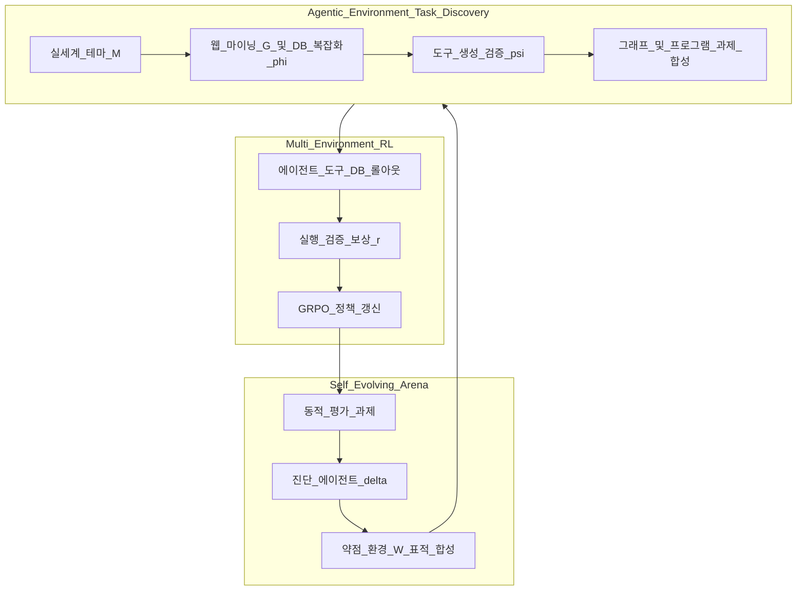
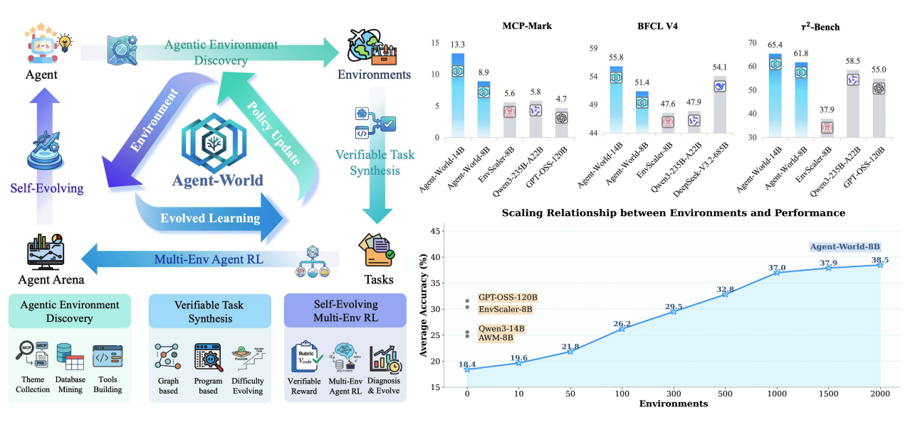
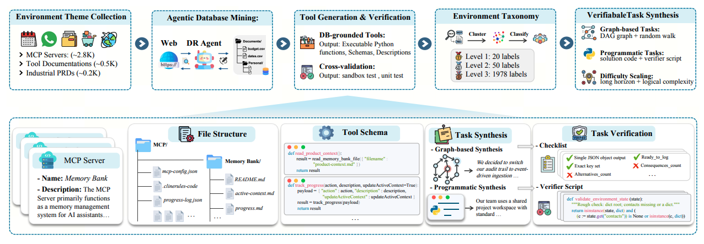
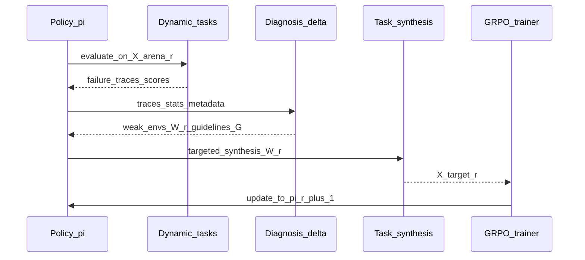
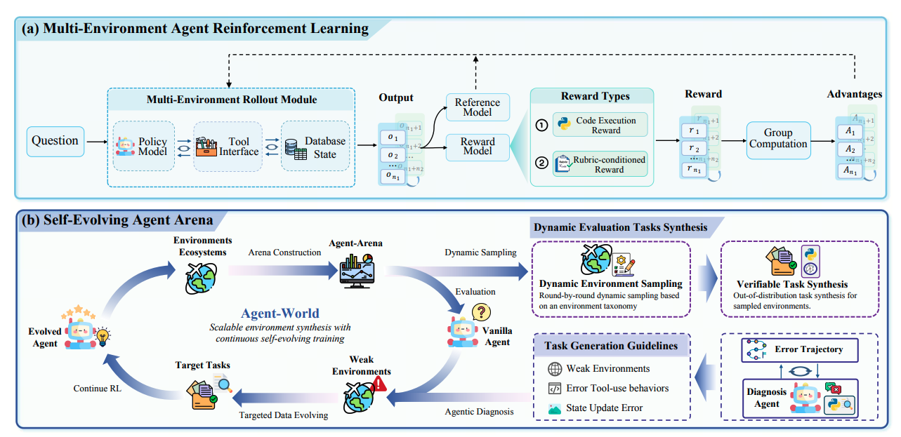

# Agent-World: 실세계 환경 합성과 자기 진화 에이전트 훈련 — 분석 보고서

**원논문**: Agent-World: Scaling Real-World Environment Synthesis for Evolving General Agent Intelligence<br>
**저자**: Guanting Dong, Junting Lu, Junjie Huang, Wanjun Zhong, Longxiang Liu, Shijue Huang, Zhenyu Li, Yang Zhao, Xiaoshuai Song, Xiaoxi Li, Jiajie Jin, Yutao Zhu, Hanbin Wang, Fangyu Lei, Qinyu Luo, Mingyang Chen, Zehui Chen, Jiazhan Feng, Ji-Rong Wen, Zhicheng Dou<br>
**소속**: Gaoling School of Artificial Intelligence, Renmin University of China; ByteDance Seed<br>
**출처**: arXiv:2604.18292v1 [cs.AI] (2026), DOI: https://doi.org/10.48550/arXiv.2604.18292<br>
**보고서 작성일**: 2026-04-22

## TL;DR

Agent-World는 **실행 가능한 실제 도구·DB에 기반한 환경을 대규모로 합성**하고, **다중 환경 GRPO 강화학습**과 **진단 기반의 자기 진화(Self-Evolving) 아레나**를 결합해 일반 에이전트 지능을 키우는 훈련 무대다. 핵심은 (1) 주제 정렬 웹 마이닝으로 $(D,F)$ 생태계를 구축하고 검증 가능한 과제를 그래프·프로그램 두 축으로 생성하는 **Agentic Environment-Task Discovery**, (2) 루브릭·실행 검증 보상으로 롤아웃을 학습한 뒤 약점 환경을 찾아 과제를 재합성하는 **Continuous Self-Evolving Agent Training**이다. 23개 벤치마크에서 8B/14B 모델이 다수 강한 베이스라인을 넘고, 환경 수·진화 라운드에 따른 스케일링 경향이 보고된다.

---

## 목차

1. [배경 및 문제 정의](#1-배경-및-문제-정의)
2. [핵심 방법론](#2-핵심-방법론)
3. [실험 결과](#3-실험-결과)
4. [관련 스토리 (웹 조사)](#4-관련-스토리-웹-조사)
5. [기술적 배경 지식](#5-기술적-배경-지식)
6. [논문의 한계 및 향후 전망](#6-논문의-한계-및-향후-전망)
7. [참고문헌 및 관련 자료](#7-참고문헌-및-관련-자료)

---

## 1. 배경 및 문제 정의

대규모 언어 모델(LLM)은 챗봇을 넘어 **외부에서 상태를 유지하는(stateful) 도구·환경과 상호작용하는 일반 에이전트**로 쓰이길 기대받는다. Model Context Protocol(MCP) 등 표준 인터페이스는 에이전트와 확장 가능한 실서비스를 연결하지만, **현실적인 환경 데이터**와 **지속적으로 약점을 드러내고 메우는 훈련 원리**가 부족하면 견고한 일반화는 어렵다.

논문이 지적하는 병목은 다음 두 가지로 정리된다.

| 병목 | 내용 | 기존 접근의 한계 |
|------|------|------------------|
| 확장 가능한 현실감·복잡한 환경 합성 | LLM 시뮬레이션은 저비용이나 환각·역학 왜곡에 취약; 실행형 환경은 정합성이 좋으나 수작업·단일 라운드 합성에 머무는 경우가 많다 | 장기·상태 집약 과제에서 상호작용 논리 학습이 불충분 |
| 연속적 자기 진화 훈련 | 현실 환경은 훈련 아레나로 쓰일 수 있으나, **약점 진단 → 표적 데이터 확장 → RL**의 닫힌 루프가 체계화되지 않았다 | 정적 분포에 대한 정책 최적화에 치우침 |

Agent-World는 위 두 축을 **닫힌 루프**로 묶는다: 환경·과제 합성이 RL을 지원하고, RL·평가에서 나온 실패 증거가 다음 라운드의 환경·과제 확장을 이끈다.



---

## 2. 핵심 방법론

### 2.1 상호작용 모델: 다중 환경 POMDP

논문은 AgentSkiller 등과 같이 다턴 에이전트 상호작용을 POMDP $(U,S,A,O,P)$로 둔다. 여기서 환경은 데이터베이스 $D$와 도구집합 $F=\{f_k\}$의 쌍 $e=(D,F)$로 매개된다.

| 기호 | 의미 |
|------|------|
| $U$ | 사용자 의도 공간; 잠재 의도 $q\in U$ |
| $S$ | 전역 상태 $S=S_E\times S_H$ (환경 상태 $\times$ 대화 상태) |
| $A$ | $A=A_{\text{tool}}\cup A_{\text{resp}}$ (도구 호출 또는 자연어 응답) |
| $O$ | $O=O_E\cup O_H$ (도구 관측·대화 관측); **$s_E$는 직접 관측되지 않음** |
| $P$ | 행동 후 $(s_{t+1},o_{t+1})$ 분포를 정하는 전이 |

도구 행동 $a_t\in A_{\text{tool}}$이면 $f\in F$가 $D$에 대해 실행되어 $s^E$가 갱신되고 $o^E_{t+1}$이 반환된다. 응답 행동이면 대화 상태만 갱신되고 $s^E_{t+1}=s^E_t$이다.

> **[주석] 환경 상태 $s_E$가 관측에 직접 없는 이유**  
> 에이전트는 DB의 전체 진실 상태를 한 번에 보지 못하고, **도구 반환(JSON, 로그, 오류 코드 등)**으로만 간접 추론해야 한다. 이는 실제 MCP/웹 API 사용과 동일하며, 부분관측성이 계획·검증·오류 복구 난이도를 높인다.

### 2.2 Agentic Environment-Task Discovery

**테마 수집.** 세 소스를 병합해 시드 주제 집합 $M=M_1\cup M_2\cup M_3$을 만든다.

| 소스 | 기호 | 내용(논문 요약) |
|------|------|------------------|
| MCP 서버 스펙 | $m\in M_1$ | Smithery 등에서 JSON 스펙·도구 정의와 함께 수집 |
| 도구 문서 데이터셋 | $m\in M_2$ | 오픈소스 시나리오에서 도구 정의를 뽑고 LLM으로 주제 역매핑 |
| 산업 PRD | $m\in M_3$ | 업종 워크플로·시스템 인터페이스가 담긴 요구사항 문서 |

**DB 마이닝.** 주제 $m$마다 딥리서치 에이전트 $G$가 정책 $\pi_\theta$와 외부 도구집합 $T$(검색·브라우저·컴파일러·OS 등)로 웹에서 정보를 수집·구조화해 DB를 만든다.

$$
D^{(0)}(m)=G(m;\pi_\theta,T),\quad m\in M
$$

한 번의 흐름으로는 규모·구조가 단순해지기 쉬워, 반복 **복잡화(complexification)** 연산자 $\phi$를 적용한다.

$$
D^{(n+1)}(m)=\phi\bigl(D^{(n)}(m),m,T\bigr),\quad n=0,\ldots,N-1
$$

최종 DB는 $D^{(N)}(m)$으로 쓴다.

**도구 생성·검증.** 코딩 에이전트 $\psi$가 $(m,D^{(N)}(m))$에서 후보 도구 $\hat f$와 단위테스트 집합 $\hat C_{\hat f}$를 생성한다.

$$
\{(\hat f,\hat C_{\hat f})\}=\psi\bigl(m,D^{(N)}(m);\pi_\theta,\hat T\bigr)
$$

테스트 정확도는

$$
\mathrm{Acc}(\hat f;\hat C_{\hat f})=\frac{1}{|\hat C_{\hat f}|}\sum_{\hat c\in \hat C_{\hat f}}\mathbf{1}[\hat f(\hat c)\ \text{passes}]
$$

다음을 모두 만족하는 도구만 남긴다: Python 컴파일 성공, $\mathrm{Acc}>0.5$, 해당 환경에 유효 도구·테스트가 각각 하나 이상. 이렇게 얻은 $F(m)$과 함께 생태계를

$$
E=\{(D^{(N)}(m),F(m))\mid m\in M\}
$$

로 정의한다(논문 보고: 약 1978 환경, 19822 도구).

**계층 분류.** 수천 테마에 계층적 클러스터링 후 GPT-OSS-120B 요약과 인간 3인 주석으로 1단 20개·2단 50개·3단 2000+ 라벨의 분류 체계를 구축한다(교차검증·토의). 1단 카테고리 집합을 $C$로 둔다.

#### 2.2.1 검증 가능 과제 합성

**(1) 그래프 기반.** 환경 $(D^{(N)}(m),F(m))$에서 도구를 노드로 한 **완전 연결 가중 방향 그래프** $G=(V,E)$를 만든다. LLM이 의존성을 평가해 세 종류의 엣지를 둔다.

| 유형 | 방향/무게 | 의미 |
|------|-----------|------|
| Strong dependency | $f_i\to f_j$, $w_{ij}=3$ | $f_j$ 입력이 $f_i$ 출력에 엄격히 의존 |
| Weak dependency | $f_i\leftrightarrow f_j$, $w_{ij}=2$ | 출력에서 유도 가능하나 다른 경로도 가능 |
| Independent | $f_i\leftrightarrow f_j$, $w_{ij}=1$ | 파라미터 수준 의존 없음; 랜덤워크 단절 방지 |

**랜덤 워크**로 원시 시퀀스 $\tau=[f_1,\ldots,f_k]$를 샘플링한 뒤, 선행 도구 출력·DB 샘플로 인자를 채우고 LLM이 **중복 제거·논리 정합**을 거쳐 실행 가능한 $\tau^\*$로 정제한다. 샌드박스에서 $\tau^\*$를 실행해 트레이스와 정답 근거를 얻고, 초안 질의 $q_{\mathrm{init}}$을 **도구명·스키마 비노출** 제약 하에 $q_{\mathrm{final}}$로 다듬는다. 구조화 정답 $a^\*$와 루브릭 $R=\{r_j\}$를 생성하고, ReAct 에이전트로 **5회 독립 시도** 중 최소 2회 일치 성공 시만 채택한다. 난이도는 워크 최대 길이·약한/독립 엣지 샘플 확률·서술 난독화로 올린다. 과제 집합을 $X_{\mathrm{graph}}$라 한다.

**(2) 프로그램 기반.** 도구 스키마·DB 설명만으로 고난도 자연어 질의 $q_{\mathrm{prog}}$와, 도구를 로드해 **분기·반복·집계**를 포함한 solver 스크립트 $\pi_{\mathrm{code}}$를 생성한다. ReAct로 문법·런타임 오류를 수정해 실행 성공시키고 $a^\*$를 얻는다. 문자열 매칭 대신 LLM이 **검증 스크립트** $V_{\mathrm{code}}(a,a^\*)$를 생성·디버그하며, 동일한 5회 안정성 필터를 적용한다. 집합을 $X_{\mathrm{prog}}$라 한다.

> **[주석] 루브릭 판정과 실행 검증 $V_{\mathrm{code}}$의 역할 분담**  
> 그래프형 과제는 필드 완전성·스키마·수치 허용오차 등 **다차원 기준**을 LLM judge가 루브릭 항목별로 채점하는 형태에 가깝다. 프로그램형은 **상태·출력 제약을 코드 단언으로** 검사하기 때문에 복합 논리에 강하지만, 검증기 자체의 품질이 병목이 된다.



> **[그림 설명] Fig. 1**: 좌측은 Agent-World의 두 축(환경–과제 발견, 자기 진화 RL)과 닫힌 루프를 요약한다. 우측은 MCP-Mark·BFCL V4·$\tau^2$-Bench 대표 서브도메인 **평균 점수**가 훈련 환경 수(스케일)에 따라 상승하는 경향을 보여 준다. 막대/곡선이 가리키는 범례(모델·베이스라인)를 함께 읽어야 하며, **환경 다양성 증가가 일반 에이전트 성능과 함께 움직이는지**가 핵심 메시지다.



> **[그림 설명] Fig. 2**: 테마 수집(MCP·문서·PRD)에서 시작해 DB 마이닝·도구 생성·교차 검증, 분류 체계, 그래프/프로그램 기반 과제 합성·검증으로 이어지는 **데이터 파이프라인**이다. 각 블록은 산출물(실행 가능 Python 함수, 스키마, 샌드박스 테스트, 루브릭 등)을 명시한다. 독자는 “어디까지가 자동이고 어디서 실행 검증이 끼는지”를 따라가면 된다.

### 2.3 Continuous Self-Evolving Agent Training

#### 2.3.1 다중 환경 롤아웃과 검증 가능 보상

과제 $x$와 환경 $(D^{(N)}(m),F(m))$에서 정책 $\pi_\theta$가 역사 $h_t=(o_0,a_0,\ldots,o_t)$에 조건부로 행동을 샘플링한다. 종료 시 궤적 $\tau$와 최종 답 $a_{\mathrm{final}}$을 묶어 $y=(\tau,a_{\mathrm{final}})$로 둔다.

**보상.** 과제 유형에 따라 스칼라 보상 $r(x,y)$를 정의한다.

$$
r(x,y)=
\begin{cases}
\displaystyle \mathbf{1}\Big[\frac{1}{n}\sum_{j=1}^{n}\mathbf{1}[\mathrm{Judge}(x,y,r_j)=1]=1\Big], & x\in X_{\mathrm{graph}},\ r_j\in R,\\[10pt]
\mathbf{1}\big[\mathrm{Execute}(V_{\mathrm{code}}(y,y^\*))\big], & x\in X_{\mathrm{prog}}.
\end{cases}
$$

$\mathrm{Judge}$는 루브릭 조건 $r_j$ 충족 여부를 LLM judge로 판정하고, 프로그램형은 샌드박스에서 $V_{\mathrm{code}}$ 실행 성공 여부를 지표로 삼는다.

**GRPO.** 과제 $x\sim D$마다 행동 정책 $\pi_{\theta_{\mathrm{old}}}(\cdot\mid x)$로 $G$개 출력 $\{y_i\}_{i=1}^G$를 샘플링하고, 토큰 단위 정규화 이득 $\hat A_{i,t}$를 계산한 뒤 아래 목적을 최대화한다(논문식 (1)).

$$
J_{\mathrm{GRPO}}(\theta)=\mathbb{E}_{x,\{y_i\}}\Bigg[
\frac{1}{G}\sum_{i=1}^{G}\frac{1}{|y_i|}\sum_{t=1}^{|y_i|}
\min\bigl(r_{i,t}(\theta)\hat A_{i,t},\ \mathrm{clip}(r_{i,t}(\theta),1-\epsilon,1+\epsilon)\hat A_{i,t}\bigr)
-\beta D_{\mathrm{KL}}(\pi_\theta\,\|\,\pi_{\mathrm{ref}})
\Bigg]
$$

$r_{i,t}(\theta)$는 중요도 비율, $\epsilon,\beta$는 하이퍼파라미터, $\pi_{\mathrm{ref}}$는 참조 정책이다.

> **[주석] GRPO가 “그룹 내 상대 이득”을 쓰는 직관**  
> 전통적 actor–critic은 별도 가치망이 필요하지만, GRPO는 **동일 입력 $x$에 대한 여러 롤아웃 보상**을 묶어 상대적인 좋고 나쁨을 advantage로 삼는다. 검증 가능한 성공/실패 신호가 뚜렷한 도구 RL에 맞는 절충이다.

구현 세부(논문 §4.1): cold-start로 동일 합성 전략의 SFT 40K 궤적(Doubao-Seed-1.8로 생성), 이후 Qwen3-8B/14B 초기화·RL 샘플 5K·GRPO; 클립 하한 $\epsilon_{\mathrm{low}}=0.2$, 상한 $\epsilon_{\mathrm{high}}=0.28$, 스텝당 32과제×8 rollout, temperature=1, top\_p=1, 최대 궤적 80K 토큰, 스텝당 생성 32K 토큰 캡.

#### 2.3.2 Self-Evolving Agent Arena

1단 카테고리 $c\in C$마다 $K=5$개 환경을 무작위로 뽑아 평가 아레나 $E_{\mathrm{arena}}$를 구성한다. 라운드 $r$마다 각 아레나 환경에 대해 **새로 합성된** 검증 가능 과제 집합 $X^{(r)}_{\mathrm{arena}}(m_i)$를 만들고, 전체 $X^{(r)}_{\mathrm{arena}}=\bigcup_i X^{(r)}_{\mathrm{arena}}(m_i)$에서 정책 $\pi^{(r)}_\theta$를 평가한다.

**진단 에이전트** $\delta$(Python·검색 도구)는 과제별 실패 트레이스, 범주별 오류 통계, 메타데이터를 입력받아 (a) 약한 환경 집합 $W^{(r)}\subseteq E_{\mathrm{arena}}$, (b) 환경별 과제 생성 가이드라인 $G^{(r)}_{\mathrm{guide}}(m)$를 출력한다.

$W^{(r)}$와 가이드에 조건부로 과제 합성 파이프라인을 재실행해 표적 훈련집합 $X^{(r)}_{\mathrm{target}}$을 만들고, 필요 시 DB 복잡화 $\phi$로 상태 다양성을 보강한 뒤 RL을 이어간다.

$$
\pi^{(r)}_\theta \xrightarrow{\mathrm{evaluate}} W^{(r)}
\xrightarrow{\mathrm{diagnose+target}} X^{(r)}_{\mathrm{target}}
\xrightarrow{\mathrm{continue\ RL}} \pi^{(r+1)}_\theta
$$

**Algorithm 1 (요약 의사코드)**

```
입력: 아레나 E_arena ⊂ E, 초기 정책 π^(0), 라운드 수 R
출력: π^(R)
for r = 0 … R-1:
  각 (D^(N)(m_i), F(m_i)) ∈ E_arena 에 대해
      루브릭 R 또는 V_code 를 갖는 신선한 과제 X_arena^(r)(m_i) 합성
  X_arena^(r) ← ⋃_i X_arena^(r)(m_i)
  π^(r) 를 X_arena^(r) 에서 평가
  실패 트레이스·통계·메타데이터로 진단 에이전트 δ 실행
      → W^(r), G_guide^(r)(m)
  각 (D^(N)(m), F(m)) ∈ W^(r) 에 대해
      필요 시 D^(N)(m) ← φ(…);  G_guide^(r)(m) 에 조건부 표적 과제 X_target^(r)(m) 생성
  X_target^(r) ← 합집합;  X_target^(r) 로 RL 지속 → π^(r+1)
return π^(R)
```





> **[그림 설명] Fig. 5**: (a)는 질문–정책–참조 모델–보상–그룹 advantage–다중 환경 롤아웃(도구·DB 상태)의 **GRPO 훈련 상단**을, (b)는 평가·오류 궤적 진단·표적 과제 합성·RL 지속으로 이어지는 **자기 진화 아레나 하단**을 나타낸다. 색으로 구분된 모듈이 어떤 데이터(오류 트레이스, 약점 환경)를 다음 단계로 넘기는지 추적하면 된다.

---

## 3. 실험 결과

### 3.1 설정 요약

- **베이스라인**: 최신 상용 모델(GPT-5.2 High, Claude Sonnet-4.5, Gemini-3 Pro, Seed2.0 등), 오픈소스 대형(Qwen3, DeepSeek-V3.2-685B, GPT-OSS-120B 등), 환경 스케일링 계열(Simulator-8B, TOUCAN-7B, EnvScaler-8B, AWM-8B/14B, ScaleEnv-8B 등).
- **평가**: MCP-Mark, BFCL V4, $\tau^2$-Bench를 포함해 23개 벤치마크(추론·코딩·검색·MCP-Universe·지식 등).
- **재현성 감소**: GAIA, HLE 등은 부분 샘플로 평가(논문이 선행 관행에 따름을 명시).

### 3.2 에이전트 도구 사용: 주요 수치

에이전트 도구 벤치 세트(MCP-Mark / BFCL V4 / $\tau^2$-Bench 평균)에서 논문은 오픈소스 환경 스케일링 모델 중 Agent-World가 **일관되게 상위**임을 강조한다. 아래는 논문 Table 1에서 발췌한 대표 행이다(단위 %).

| 방법 | MCP-Mark 평균 | BFCL V4 평균 | $\tau^2$-Bench 평균 |
|------|---------------|--------------|---------------------|
| Qwen3-8B | 2.4 | 40.4 | 26.2 |
| Qwen3-235B-A22B | 5.8 | 47.9 | 58.5 |
| EnvScaler-8B | 5.6 | 47.6 | 37.9 |
| AWM-14B | 5.1 | 42.4 | 39.0 |
| Agent-World-8B | 8.9 | 51.4 | 61.8 |
| Agent-World-14B | 13.3 | 55.8 | 65.4 |

상용 최강급은 여전히 여러 열에서 높은 점수를 보이나, **동일한 8B–14B급 오픈 가중치** 안에서 Agent-World는 특히 MCP-Mark·BFCL·$\tau^2$를 아우르는 **교차 환경 일반화**를 강조할 수 있는 패턴을 보인다.

### 3.3 스케일링·자기 진화 분석

- **훈련 환경 수**: 0에서 10, 100, 500, 1000, 2000(실제 1978)으로 늘리며 네 도메인(MCPMark Postgres, BFCL WebSearch, BFCL Multi-Turn, $\tau^2$ Airline)을 추적하면, 네 곳 모두에서 점수가 단조적으로 개선되고 네 도메인 평균은 **18.4% → 38.5%(+20.1p)**로 상승한다. 특히 10→100, 100→500 구간에서 이득이 크게 나타나 “핵심 상호작용 패턴 커버리지”가 빠르게 채워지는 단계로 해석된다. 500→2000에서는 한계 효용이 줄지만 여전히 양의 방향이다.

- **자기 진화 라운드(Table 2)**: Agent-World-14B 기준 $\tau^2$/BFCL/MCP-Mark(Post.)가 (60.2, 52.4, 29.5)에서 2라운드 후 (65.4, 55.8, 38.1)로 개선; EnvScaler-8B에 동일 루프를 적용해도 (37.9, 47.6, 9.5)→(41.6, 50.0, 15.1)로 **초기화가 Agent-World가 아니어도** 이득이 난다는 점을 논문이 강조한다. 첫 라운드 이득이 큰 편이고 두 번째는 소폭이나 양수(한계 효용 감소).

- **훈련 동역학(Figure 9)**: Qwen3-8B/14B 백본 모두 GRPO 보상이 단조 상승하고, 엔트로피도 지나치게 붕괴하지 않는 양상을 보여 **다양한 MCP 환경에서 탐색이 유지**된다고 해석한다.

---

## 4. 관련 스토리 (웹 조사)

### 4.1 사건·산업적 맥락

- **MCP 확산**: MCP는 Anthropic이 제안한 오픈 표준으로, 에이전트가 외부 데이터·도구에 접속하는 공통 계층으로 소개된다. 산업 쪽 설명에서는 “AI 통합의 USB-C”에 비유되며, 멀티클라우드·하이브리드 환경에서 에이전트 연결이 난제였던 부분을 완화한다는 서술이 반복된다([Equinix 블로그](https://blog.equinix.com/blog/2025/08/06/what-is-the-model-context-protocol-mcp-how-will-it-enable-the-future-of-agentic-ai/), [RX-M MCP/A2A 교육 과정](https://rx-m.com/training/model-context-protocol-agent2agent-protocol/)). Agent-World는 이러한 **실서버 메타데이터·실행형 도구** 쪽으로 환경을 정렬한다는 점에서 산업 트렌드와 맞닿아 있다.

- **본 논문의 “현장 영향” 시점**: arXiv 2026년 4월 프리프린트이며, 공개 프로젝트 페이지([agent-tars-world.github.io](https://agent-tars-world.github.io/-/))가 별도로 안내된다. 학회 채택·독립 재현 스터디·상용 제품 내장 등 **시간이 지난 뒤의 영향 지표**는 아직 축적되는 단계로 보는 것이 타당하다.

### 4.2 기술적 계보

| 층위 | 선행 방향 | Agent-World와의 관계 |
|------|-----------|----------------------|
| 시뮬레이션 환경 | Web World Models, GenEnv 등 LLM 기반 시뮬 | 실행 기반 $(D,F)$와 병행 비교 대상 |
| 프로그램 합성 | EnvScaler, AWM, AutoForge 등 코드·DB 샌드박스 | 동일 문제의 강한 베이스라인군 |
| 평가·상태 | $\tau^2$-Bench, BFCL, MCP-Mark 등 | 훈련·분석에서 사용한 다면 평가축 |
| RL 알고리즘 | GRPO(DeepSeekMath 계열), Tool-Star/ARPO 등 에이전트 RL | GRPO + 검증 보상으로 다중 환경 롤아웃 |

### 4.3 학계·공개 담론에서의 위치(균형적 정리)

- **지지적 읽기**: “환경 스케일링 + 검증 가능 보상 + 폐루프 진단”을 한 프레임에 넣어, 최근 환경 합성 연구가 약하던 **지속 학습·커리큘럼** 측면을 정면화했다는 평가가 가능하다. 동일 자기 진화 루프를 EnvScaler 초기화에 적용해도 이득이 난다는 실험은 방법의 **일반성**을 뒷받침한다.

- **비판·주의점**: (1) 합성·진단·판정에 **강한 상위 LLM**(논문은 GPT-OSS-120B 등) 의존도가 높아 비용·재현성 이슈가 있다. (2) 루브릭 기반 LLM judge는 편향·일관성 문제가 알려져 있어, 보고 점수가 “절대 진실”이 아님을 전제해야 한다. (3) 이름이 유사한 별도 연구 **Agent World Model (AWM, arXiv:2602.10090)** 등과 혼동하지 않도록 주의해야 한다(완전히 다른 저자·설정).

---

## 5. 기술적 배경 지식

### 5.1 MCP(Model Context Protocol)

호스트(에이전트 클라이언트)가 로컬 또는 원격 **MCP 서버**와 JSON-RPC 유사 메시지로 통신하며, 리소스(파일·DB 레코드)와 도구(함수 호출)를 노출하는 프로토콜이다. Agent-World는 Smithery 등에서 **실제 서버 스펙**을 모아 테마 $M_1$을 구성한다.

### 5.2 POMDP와 부분관측

§2에서 정리한 대로, 에이전트는 $O_E$로만 세계를 본다. 이는 **Belief state** 추적·**contingency planning**이 필요한 이유이며, BFCL·MCP-Mark류 다단 도구 시나리오의 난이도 원천과 연결된다.

### 5.3 GRPO와 RLVR

**GRPO**는 그룹 샘플의 상대 보상으로 advantage를 만들고 PPO형 클리핑을 적용하되 **별도 critic을 두지 않는** 경향의 알고리즘군이다. 개념 설명·수식 맥락은 DeepSeek-R1·DeepSeekMath 계열 논의와 [Allen AI Open Instruct GRPO 문서](https://allenai.github.io/open-instruct/algorithms/grpo/)를 참고할 수 있다. Agent-World는 **검증 가능한 보상(RLVR 계열)**과 결합해 도구 호출 궤적 전체에 학습 신호를 준다.

### 5.4 검증 가능 과제(Verifiable tasks)

수학의 정답 매칭처럼 **자동 채점 가능**한 과제는 RL에서 학습 신호 분산이 낮아진다. 본 연구는 그래프형(루브릭)과 프로그램형(실행 검증기)으로 그 스펙트럼을 넓힌다.

---

## 6. 논문의 한계 및 향후 전망

| 한계·리스크 | 설명 |
|--------------|------|
| 상위 모델 의존 | DB 마이닝·과제·루브릭·진단에 대형 정책 모델이 개입; 공급자·버전 변화에 민감 |
| Judge·합성기 오류 전파 | LLM judge·검증기 생성이 틀리면 RL 신호가 오염; 특히 루브릭 차원이 많을수록 비용·불일치 증가 |
| 평가 비용·샘플링 | 일부 벤치는 부분 샘플; 재현 시 동일 분포 보장이 어려울 수 있음 |
| 생태계 편향 | Smithery·특정 MCP 서버 분포는 실제 기업 내부 레거시와 다를 수 있음 |

**향후 전망**: (1) 진단 단계의 **인과적(faithful) 요약**과 저비용 judge로의 증류, (2) **멀티모달·웹**으로의 확장(InfiniteWeb 등과의 수렴), (3) **안전성**(도구 남용, 프라이버시)과 결합한 합성 파이프라인, (4) 오픈 데이터·오픈 환경 카드 공개 범위 확대를 통한 독립 검증—이 순으로 연구가 이어질 가능성이 크다.

---

## 7. 참고문헌 및 관련 자료

1. Agent-World (본 논문, HTML): https://arxiv.org/html/2604.18292v1  
2. Agent-World (arXiv abstract): https://arxiv.org/abs/2604.18292  
3. 프로젝트 페이지: https://agent-tars-world.github.io/-/  
4. MCP 개요(산업 관점): https://blog.equinix.com/blog/2025/08/06/what-is-the-model-context-protocol-mcp-how-will-it-enable-the-future-of-agentic-ai/  
5. MCP/A2A 교육 과정(서드파티): https://rx-m.com/training/model-context-protocol-agent2agent-protocol/  
6. GRPO 알고리즘 개요(Allen AI): https://allenai.github.io/open-instruct/algorithms/grpo/  
7. DeepSeek-R1 (RL로 추론 강화): https://arxiv.org/abs/2501.12948  
8. $\tau^2$-Bench: https://arxiv.org/abs/2506.07982  
9. Hou et al., MCP Landscape·보안 위협(ACM TOSEM; arXiv HTML): https://arxiv.org/html/2503.23278v3  
10. UI-TARS (ByteDance 오픈소스 GUI 에이전트, 별 라인이나 동일 조직 맥락): https://github.com/bytedance/ui-tars  

(논문 전체 참고문헌은 PDF 원문 References 섹션을 따른다.)
