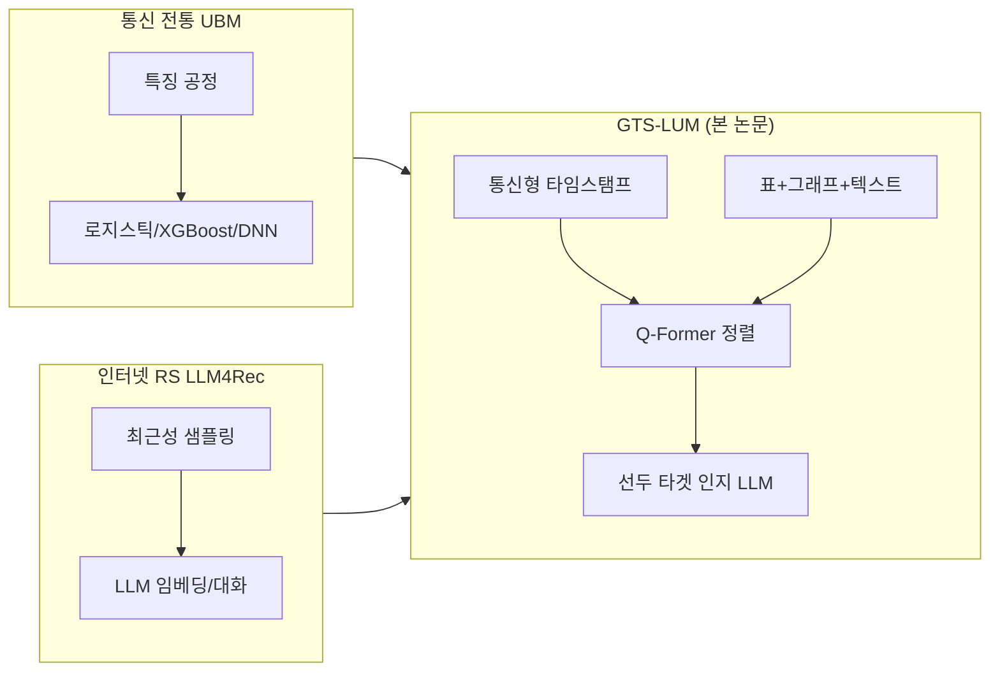
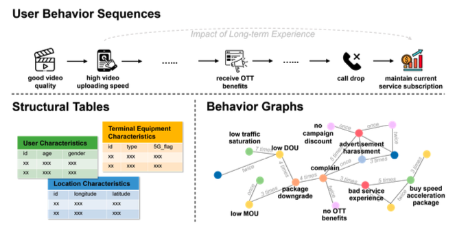
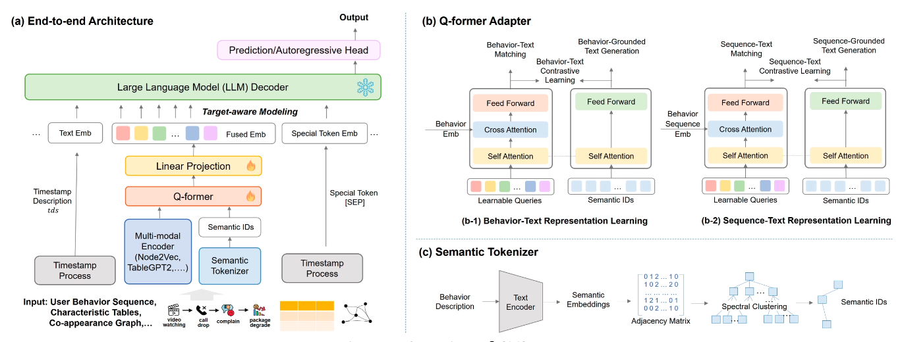
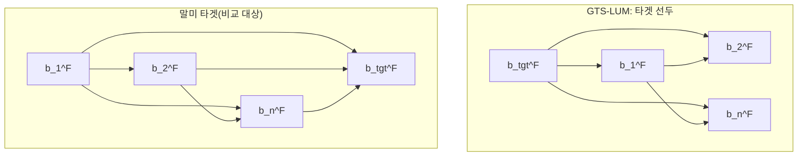
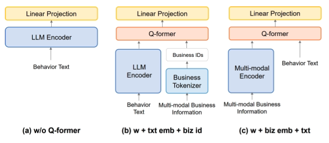

# GTS-LUM: 통신 산업에서 LLM으로 사용자 행동 모델링 재구성

**원논문**: GTS-LUM: Reshaping User Behavior Modeling with LLMs in Telecommunications Industry<br>
**저자**: Liu Shi, Tianwu Zhou, Wei Xu, Li Liu, Zhexin Cui, Shaoyi Liang, Haoxing Niu, Yichong Tian, Jianwei Guo<br>
**소속**: Huawei GTS, Xi’an, China<br>
**출처**: arXiv:2504.06511 [cs.LG] (프리프린트, 2025-04-09 공개)<br>
**보고서 작성일**: 2026-04-27

---

## TL;DR

통신 사업자의 사용자 행동 모델링(UBM)은 **장기·주기적 패턴**, **초·분·월 등 이질적 시간 단위**, **표·그래프 등 멀티모달 입력**, **이탈·요금제 변경 등 이질적 라벨**이 공존해 기존 LLM4Rec(최근 행위 위주 샘플링, 단순 아이템 시퀀스)과 맞지 않는 경우가 많다. 본 논문은 **GTS-LUM**(Large User behavior Modeling for Telecommunications)을 제안한다. 핵심은 (1) **의미 기술자 + 구간 ID + [SEP]**로 주기와 동시 발생을 명시하는 타임스탬프 처리, (2) BGE-M3 임베딩 위 **스펙트럴 클러스터링**으로 행위 **시맨틱 ID** 생성, (3) Node2Vec·TableGPT2 등 **비즈니스 임베딩**과 시맨틱 토큰을 **Q-Former**로 융합, (4) **타겟 행위를 시퀀스 선두**에 두어 인과적 self-attention으로 매 스텝 타겟 조건화를 강화하는 **target-aware** 설계, (5) **Phase I**(Q-Former 정렬·시퀀스-텍스트 과제) + **Phase II**(동결 LLM 위 InfoNCE) 학습이다. 사내 산업 데이터에서 HSTU-1B 대비 지표 평균 **약 107.86%** 상대 향상, HLLM-1B 대비 **약 31.38%** 추가 향상을 보고한다.

---

## 1. 배경 및 문제 정의

### 1.1 산업 맥락

통신 시장은 침투율이 높아 **신규보다 잔존·ARPU·이탈 방지**가 중심 과제가 되었다. 사업자는 통화·데이터·부가서비스 등에서 **PB급 로그**를 축적하며, 이를 바탕으로 패키지 설계·마케팅 개입을 최적화하려 한다.

### 1.2 문제 정의(논문 관점)

- **입력**: 사용자 \(u\)의 과거 행위 시퀀스 \(U=\{b_1,\ldots,b_n\}\)과 타임스탬프 \(T=\{t_1,\ldots,t_n\}\) (연·월·일·시·분·초).
- **목표**: \(U,T\)로 **다음 행위** \(b_{n+1}\) 예측(순차 추천과 동형). 다운스트림으로는 논문에서 **OTT 서비스 추천**(자동회귀 헤드)을 예시로 든다.

### 1.3 통신 도메인이 추천(인터넷)과 다른 세 가지 축

| 구분 | 일반 RS / LLM4Rec 경향 | 통신 UBM에서의 이슈 |
|------|------------------------|---------------------|
| 의사결정 시간축 | 최근 관심·단기 클릭이 신호로 강함 | **장기 품질·요금 경험**과 **주기적 생활 패턴**이 지배적 |
| 데이터 형태 | 아이템 ID·텍스트 설명 중심 | **구조화 표**, **행위 공출현 그래프**, 로그 텍스트 등 **이기종** |
| 라벨·타겟 | 클릭·구매 등 상대적으로 단일 | **이탈**, **요금제 업/다운그레이드**, **캠페인 응답** 등 **이질적** |

> **[주석] LLM4Rec의 두 갈래**  
> 설문·튜토리얼류 정의에 따르면, (1) **LLM-to-Rec**: LLM이 임베딩·요약 등 **표현을 강화**해 하위 추천기에 넣는 방식, (2) **Rec-to-LLM**: 행위를 대화·토큰 시퀀스로 바꿔 LLM이 **다음 행위**를 생성·예측하는 방식으로 나뉜다. GTS-LUM은 후자 계열에 가깝되, **멀티모달 정렬·통신 특화 시간 표현**으로 확장한다.

---

## 2. 선행 연구 및 기술적 계보

### 2.1 통신 churn·행동 예측의 전통

리뷰·서베이 논문들은 로지스틱 회귀, SVM, 트리, 딥러닝(예: ChurnNet) 등 **특징 공학 의존**과 **단일 타겟** 중심 한계를 지적해 왔다. 본 논문은 **LLM 기반 end-to-end**로 이질 타겟·멀티모달을 포용하려는 방향을 명시한다.

### 2.2 LLM4Rec·멀티모달 추천으로의 연장

- **계층적 LLM**(HLLM 등): 아이템 LLM과 사용자 LLM을 연결해 순차 표현을 강화.
- **HSTU** 등: 시계열·행위를 **트랜스듀서**로 통합, 대규모 생성 추천.
- **ILM(Item-Language Model)**, **BLIP-2류 Q-Former**: 협업·텍스트 스트림을 **크로스 어텐션**으로 LLM에 맞춘다는 점에서 GTS-LUM의 직접적 선행에 가깝다.
- **생성적 추천·토큰화**: TIGER(잔차 양자화 코드워드), **계층적 클러스터링**으로 시맨틱 ID를 부여하는 흐름과, 본 논문의 **스펙트럴 트리 → 시맨틱 ID**가 맞닿는다.

### 2.3 웹·문헌 기반 스토리(위치·영향·담론)

| 항목 | 관찰 |
|------|------|
| **공개 채널** | 본문은 [arXiv:2504.06511](https://arxiv.org/abs/2504.06511) 및 [HTML 실험판](https://arxiv.org/html/2504.06511v1)으로 공개된 **프리프린트**이며, PDF 하단에 `Conference'17` 형태의 **플레이스홀더**가 보인다. 즉 **동료 심사 학회 논문본**이라기보다 사내 검증 중심의 **조기 공개**에 가깝다. |
| **산업·브랜드 맥락** | 저자 소속 **Huawei GTS**는 통신 인프라·서비스 품질 보증(Global Technical Service) 조직으로 알려져 있으며, 화웨이는 **무선 통신 지식관리에 LLM·RAG**를 적용한다는 기술 소개를 공개한다([Huawei Tech: LLM in wireless communication knowledge management](https://www.huawei.com/en/huaweitech/future-technologies/llm-application-wireless-communication)). GTS-LUM이 동일 제품에 탑재되었다는 **직접 공표는 논문에 없으나**, 같은 기업 내 **LLM 활용 방향**과 정합적이다. |
| **학계 반응(지표)** | arXiv 직후 **서드파티 요약·리뷰 사이트**(예: [TheMoonlight 리뷰 페이지](https://www.themoonlight.io/en/review/gts-lum-reshaping-user-behavior-modeling-with-llms-in-telecommunications-industry))에서 방법·수치를 재정리한 글이 등장한다. 이는 **관심도**를 보여 주지만 **독립 검증**은 아니다. |
| **비판·한계(균형)** | (1) **데이터·코드 비공개** 산업 실험이라 재현성 논쟁의 여지가 있다. (2) **개인정보·동의** 이슈는 본문에서 다루지 않는다. (3) **추론 비용**—저자들도 향후 **추론 가속**을 과제로 명시한다. (4) 도메인 특화 설계가 많아 **다른 산업 일반화**는 추가 검증이 필요하다. |
| **기술 담론과의 접점** | 사용자 행동·추천에 LLM을 쓰는 흐름은 [LLM4Rec 서베이](https://github.com/LehengTHU/LLM4Rec-Classified-Papers) 등 큐레이션에 지속 반영되고, **연합 학습·프라이버시** 쪽 논의(예: 연합 사용자 행동 모델링류 프리프린트)와 대비되어 **중앙 집중 학습 가정**이 전제됨을 독자가 인지할 필요가 있다. |



---

## 3. 문제 정식화와 전체 아키텍처

### 3.1 기호

| 기호 | 의미 |
|------|------|
| \(u\) | 사용자 |
| \(b_j\) | \(j\)번째 행위(텍스트 설명 존재) |
| \(t_j\) | 해당 행위 시각(초 단위 해상도 가능) |
| \(b_j^S\) | 시맨틱 ID(스펙트럴 트리 루트→리프 노드 시퀀스) |
| \(b_j^E\) | 비즈니스(그래프·표) 인코더 출력 임베딩 |
| \(b_j^F\) | Q-Former 융합 임베딩 |
| \(b_{\text{tgt}}^F\) | 예측·학습에 쓰이는 **타겟 행위** 표현 |

### 3.2 파이프라인 개요

1. **타임 리쉐이핑**: 하루를 고정 길이(실험 **15분**) 구간으로 나누고, 구간마다 **요일 유형 × 시간대 의미 라벨**(출근 러시아워 등)을 앞에 붙인 뒤 동구간 행위들을 나열하고 **`[SEP]`**로 구간을 구분한다(식 (1)).
2. **시맨틱 토큰화**: 행위 설명을 BGE-M3로 임베딩 → 유사도 그래프 → **스펙트럴 클러스터링**으로 계층적 클러스터 트리 → \(b_j^S\).
3. **멀티모달 인코딩**: 공출현 그래프는 **Node2Vec**, 속성 표는 **TableGPT2**류로 \(b_j^E\) 생성.
4. **Q-Former**: 학습 가능 쿼리가 \(b^E\)·시맨틱 토큰과 **크로스/셀프 어텐션**으로 상호작용 → \(b_j^F\).
5. **LLM 디코더**: 시퀀스 **맨 앞에 \(b_{\text{tgt}}^F\)** 를 두고 \(b_1^F,\ldots\)을 통과시킨 뒤 **마지막 토큰 은닉벡터**를 사용자 임베딩으로 사용.



> **Figure 1**: 통신 행위가 단순 구매 로그가 아니라 **시간에 따른 품질 이벤트**, **구조화 요금·단말 속성**, **행위 간 공출현 관계** 등으로 동시에 존재함을 한눈에 보여 준다. 독자는 “왜 멀티모달·장기 맥락이 필요한가”를 이 그림과 표 1절의 논지로 연결해 이해하면 된다.



> **Figure 2**: (a) 전체 데이터 흐름: 타임스탬프 처리 → 시맨틱 토크나이저·멀티모달 인코더 → Q-Former → 선형 투영 → **타겟 선행** LLM. (b) Phase I에서 행위-텍스트 및 **시퀀스-텍스트** 정렬 과제. (c) 스펙트럴 트리로 시맨틱 ID를 만드는 과정. 축보다는 **모듈 간 화살표**가 논문 구조의 기준선이다.

---

## 4. 핵심 방법론(수식·알고리즘 수준)

### 4.1 타임스탬프 처리와 시퀀스 재구성

**동기**: 통신 행위는 초 단위(LBS)부터 월 단위(청구)까지 단위가 섞이고, **주기성**(평일 출근 vs 주말)이 강하다.

**절차(논문 알고리즘 요지)**:

1. 여러 시계열 중 **가장 긴 시계열**을 기준으로 정렬(HSTU와 동일 취지).
2. 각 일자를 **동일 길이 구간**(실험: 15분)으로 분할.
3. 구간 \(k\)에 속한 모든 행위는 **동일 time ID**를 공유(동구간 **동시 발생** 묶음).
4. 구간 \(k\)에 대해 텍스트 서술자 \(tds_k\)를 부여:  
   - 차원 1: **평일 vs 주말**  
   - 차원 2: **출근 러시**, **평일 오전**, **점심**, **퇴근 러시**, **저녁**, **심야** 등.
5. 시퀀스를 다음과 같이 재작성한다.

\[
U = \{ tds_1, b_1, b_2, \ldots, b_j, [SEP], tds_2, b_{j+1}, \ldots, [SEP], \ldots, b_n \}
\tag{1}
\]

> **[주석] 왜 텍스트 서술자와 [SEP]인가?**  
> LLM은 토큰 시퀀스의 **국소 문맥**으로 주기적 의미를 읽는 데 강하다. 숫자 타임스탬프만 나열하면 모델이 “월요일 출근 러시” 같은 **업무 규칙**을 데이터에서 다시 발견해야 하고, `[SEP]`는 **서로 다른 구간 경계**를 명시해 attention이 섞이지 않게 돕는다.

### 4.2 시맨틱 ID: 임베딩 → 스펙트럴 클러스터링

**절차**:

1. 각 행위 텍스트를 **BGE-M3** 등으로 벡터화.
2. 벡터들로 **유사도 인접행렬** \(W\) 구성(논문은 “adjacency matrix”로 표기).
3. **표준 스펙트럴 클러스터링**으로 클러스터를 얻고, 결과를 **스펙트럴 트리**로 조직.
4. 루트에서 리프까지의 **노드 시퀀스**를 해당 행위의 시맨틱 ID \(b_j^S\)로 정의.

**스펙트럴 클러스터링(복습)**: 대칭 가중치 \(W\), 차수행렬 \(D\), 비정규 라플라시안 \(L = D - W\). (실무에서는 **대칭 정규화 라플라시안** \(L_{\text{sym}} = I - D^{-1/2} W D^{-1/2}\)를 쓰기도 한다.) \(L\)의 **가장 작은 고유값**에 대응하는 고유벡터(들)는 그래프의 **저주파·스무스한** 클러스터 경계를 드러낸다. 이 벡터 좌표에 **k-means** 등을 적용해 이산 클러스터를 얻는다.

> **[주석] 원자적 ID vs 시맨틱 ID**  
> 전통적 RS는 `item_id=738291`처럼 **임의 번호**를 쓴다. 시맨틱 ID는 “비슷한 행위는 비슷한 경로”를 갖게 해 **희소·콜드스타트**에서 일반화에 유리하다는 가정이다. 다만 클러스터 수·트리 깊이는 **하이퍼파라미터**로 오버/언더 세분화 위험이 있다.

### 4.3 멀티모달 정렬: Q-Former

**입력 스트림**:

- **시맨틱**: \(b_j^S\)에서 오는 토큰/임베딩.
- **비즈니스**: 그래프는 Node2Vec, 표는 TableGPT2로 얻은 \(b_j^E\).

**연산(논문식 (4)의 취지)**:

학습 가능 쿼리 \(q_1,\ldots,q_Q\)와 행위 임베딩 스택 \([b_1^E,\ldots,b_K^E]\)에 대해

\[
[h_1,\ldots,h_Q] = F_q\bigl( [q_1,\ldots,q_Q], [b_1^E,\ldots,b_K^E] \bigr)
\tag{4}
\]

여기서 \(F_q\)는 **Q-Former 타워**(크로스 어텐션으로 쿼리가 비즈니스 신호를 질의, 공유 셀프 어텐션으로 시맨틱·비즈니스 정렬)를 의미한다. 출력 \(h\)들은 행위-텍스트 대조 등 **Phase I 손실**에 들어가고, 최종적으로 **융합 행위 임베딩** \(b_j^F\)를 형성한다.

> **[주석] Q-Former를 쓰는 이유**  
> 시맨틱 토큰은 **오픈월드 언어**에 가깝고, 그래프·표는 **도메인 규칙·협업 패턴**에 가깝다. 두 스트림을 단순 연결(concat)하면 차원·스케일만 맞출 뿐 **상호 참조**가 약하다. Q-Former는 쿼리가 “지금 시맨틱 맥락에서 표의 어떤 열·그래프의 어떤 이웃이 중요한가”를 **동적 선택**하게 한다.

### 4.4 Target-aware: 타겟을 **앞**에 두는 이유

**논문의 인과적 self-attention 관점**:

- **제안(선두 타겟)**: 위치 \(j\)의 표현은 타겟을 포함한 모든 이전 토큰에 attend.

\[
y_j = \sum_{i \in \{\text{tgt},1,\ldots,j\}} \text{attn}(i,j)\, v_i, \quad j \in \{\text{tgt},1,\ldots,n\}
\tag{2}
\]

- **기존(말미 타겟)**: 과거 \(j\)는 타겟 없이 계산되고, 타겟 위치에서만 과거를 한꺼번에 본다(식 (3)의 두 줄 구조).

**직관**: 선두 배치는 **각 과거 행위 업데이트마다 타겟 조건**이 들어가므로, “이 OTT를 예측할 때 과거 네트워크 품질 이벤트가 어떻게 가중되는가” 같은 **조건부 경로**를 층마다 반복 정제하기 쉽다.



---

## 5. 학습 전략(Phase I·II)과 손실

### 5.1 Phase I: Q-Former 사전학습

**기존 ILM/BLIP-2류 3과제**(Figure 2(b-1)):

- 행위–텍스트 **대조(contrastive)**  
- 행위–텍스트 **생성(generation)**  
- 행위–텍스트 **매칭(matching)**

**추가 3과제**(Figure 2(b-2), MLLM의 “이미지=행위 윈도” 비유):

- **시퀀스–텍스트 매칭**
- **시퀀스–텍스트 대조**: 쿼리 타워는 식 (4)처럼 **여러 행위 임베딩**을 한꺼번에 본 \(F_q\) 출력을 사용하고, 텍스트 타워와의 대조 손실은 ILM과 동형으로 계산.
- **시퀀스–텍스트 생성**

**의도**: Q-Former를 “정렬기”이자 **장기 흥미 압축기**로 만들어, 이후 LLM에 넣을 토큰이 **서사적 시나리오**(예: 버퍼링→화질 저하→중단)와 맞물리게 한다.

### 5.2 Phase II: 동결 LLM 위 자기지도 대조

- **양성**: 시점 \(j\)까지 시퀀스에 대해 **\(j+1\)번째 행위 임베딩**을 정답으로 사용. Target-aware에 맞춰 이 양성을 **시퀀스 앞**에 두고 LLM 디코더를 통과시켜 **양성 벡터**를 얻는다.
- **음성**: 같은 배치 내 **다른 사용자의 타겟 행위** 임베딩 \(M\)개.
- **손실**: HLLM이 따르는 형식의 **InfoNCE** 계열 대조 손실(표기상 [4]의 프레임워크 + van den Oord et al. CPC/InfoNCE 계보).

**InfoNCE(표준형)**:

동일 배치에서 쿼리 \(q\)와 양성 키 \(k^+\), 음성 키 \(k_m^-\)에 대해

\[
\mathcal{L}_{\text{NCE}} = - \log \frac{\exp\bigl(\text{sim}(q, k^+) / \tau\bigr)}{\exp\bigl(\text{sim}(q, k^+) / \tau\bigr) + \sum_{m=1}^{M} \exp\bigl(\text{sim}(q, k_m^-) / \tau\bigr)}
\]

\(\text{sim}\)은 코사인 유사도 등, \(\tau\)는 온도.

**미세조정 범위**: Phase II에서는 **Q-Former와 선형 투영층**을 학습하고, **LLM 디코더는 동결**한다.

### 5.3 전체 학습 알고리즘(의사코드)

```
알고리즘 GTS-LUM 학습

입력: 다중 사용자 로그(행위 텍스트, 타임스탬프, 표, 공출현 그래프)
출력: Q-Former 파라미터 θ_Q, 투영층 θ_P (LLM 고정)

Phase I:
  for 미니배치 in D_pretrain:
      행위별 (b^S, b^E, 텍스트) 샘플링
      h ← Q-Forward(쿼리, b^E, 시맨틱 토큰)   # 식 (4)류
      L1 ← 행위-텍스트 대조 + 생성 + 매칭 손실
      L2 ← 시퀀스-텍스트 대조 + 생성 + 매칭 손실
      (θ_Q, θ_P) ← (θ_Q, θ_P) - η ∇(L1 + L2)

Phase II:
  for 미니배치 in D_train:
      U, T 전처리하여 토큰 시퀀스 구성
      각 위치 j에 대해:
          양성 ← embed(b_{j+1}), 시퀀스 앞에 배치 후 LLM 통과
          음성 ← 다른 사용자 타겟 임베딩들
      L ← InfoNCE(사용자 표현, 양성, 음성들)
      (θ_Q, θ_P) ← (θ_Q, θ_P) - η ∇L
```

> **[주석] 왜 LLM을 얼리는가?**  
> 대규모 LLM 전체 미세조정은 **비용·재악화(catastrophic forgetting)** 위험이 크다. Q-Former+투영만 학습하면 **도메인 어댑터** 역할에 집중하고, 언어 모델의 **일반 언어 능력**은 보존하는 실무적 타협이다.

---

## 6. 실험 설정 및 결과

### 6.1 데이터·태스크·베이스라인

| 항목 | 내용 |
|------|------|
| 데이터 | 사내 **일별 행위** 로그(통화, 데이터 사용, 서비스 상호작용) |
| 규모(논문 Table 1) | Train **193,799**명, 평균 시퀀스 길이 **4,832**, 3개월 / Test **18,973**명, 길이 **4,765** |
| 다운스트림 | **OTT 서비스 추천**(자동회귀 헤드 + 사용자 표현) |
| 베이스라인 | **HSTU-1B**(TinyLlama-1.1B 스펙 맞춤 재현), **HLLM-0.5B/1B** |
| 지표 | R@K, NDCG@K, **K ∈ {5,10,50,200}** |
| 분할 | leave-one-out: **마지막 행위**를 테스트 |

### 6.2 주요 수치(Table 2 요약)

| 방법 | R@5 | R@10 | NDCG@5 | NDCG@10 | 논문 보고 평균 향상(Impv.) |
|------|------|------|--------|---------|---------------------------|
| HSTU-1B | 2.09% | 2.97% | 1.77% | 2.06% | 0.00% (기준) |
| HLLM-1B | 3.89% | 5.38% | 3.22% | 3.77% | 57.93% |
| **GTS-LUM (Ours)** | **4.94%** | **6.15%** | **4.56%** | **4.95%** | **107.86%** |

> **[주석] 퍼센트 포인트 vs 상대 향상]**  
> 표의 수치는 **퍼센트(%)** 단위 지표이며, “107.86%”는 논문이 제시한 **다지표 평균의 상대 개선율**이다. 절대 수치는 도메인 난이도에 따라 작아 보일 수 있으나, **동일 데이터·동일 TinyLlama 디코더** 조건에서의 상대 비교가 핵심이다.

### 6.3 소거 연구 요약

**타임스탬프(Table 3)**: 타임스탬프 제거(`w/o timestamp`)가 최악. 텍스트 타임스탬프 삽입·HLLM식 6분해 임베딩은 소폭 개선. **구간별 position embedding(`w pos emb`)**이 본 방법에 근접—학습 가능 위치벡터가 표현력을 보태는 해석.

**멀티모달·Q-Former(Table 4, Figure 3)**: Q-Former 제거·변형보다 **본 구조**가 우수. “`w txt emb + biz id`”보다 “`w biz emb + txt`”가 낫고, 최종안이 최고.



> **Figure 3**: (a) Q-Former 없이 LLM 인코더만 쓰는 변형, (b) 텍스트 임베딩+비즈니스 토크나이저, (c) 비즈니스 임베딩+원문 텍스트 토큰을 Q에 넣는 변형. **크로스 어텐션으로 쿼리가 비즈니스를 질의**하는 본 설계가 산업 데이터에서 유리함을 시각적으로 뒷받침한다.

**Target-aware(Table 5, 소표본 2만 명)**: 타겟 없음 < 타겟 말미 < **타겟 선두(본안)** 순으로 성능이 정렬되어, **배치만 바꾼 경량 트릭**의 효과를 정량화한다.

| 설정 | R@5 | R@10 | R@50 | R@200 |
|------|------|------|------|-------|
| w/o target-aware | 3.13 | 3.54 | 6.44 | 6.49 |
| w target at end | 3.43 | 4.19 | 6.09 | 6.60 |
| Ours (선두) | **3.78** | **4.20** | **6.53** | **6.99** |

### 6.4 구현·연산 규모

- **LLM**: TinyLlama-1.1B, 시퀀스 최대 **240 토큰**, 배치당 양:음 = **1:512**.
- **학습**: **Ascend 910B2** NPU **200장 × 64GB**, 5 epoch, lr **1e-4**, 배치 **8 / NPU**.
- 해석: 산업 규모 시퀀스를 다루기 위해 **대규모 가속기**가 전제된다.

---

## 7. 종합 논의, 한계, 결론

### 7.1 기여 정리

1. 통신 UBM에 맞춘 **타임스탬프 재표현**(주기 의미 + 구간 동시성 + SEP).
2. **시맨틱 스펙트럴 ID**와 **그래프·표**를 Q-Former로 **융합**.
3. **타겟 선두 배치**로 인과 attention을 활용한 **경량 target-aware** 학습.
4. (주장) **통신에서 LLM4Rec 스타일 end-to-end**를 먼저 체계화했다는 위치.

### 7.2 한계와 주의점

- **비공개 데이터·비공개 코드**: 외부 검증 불가, 수치의 **일반화**는 미확인.
- **윤리·규제**: 초개인 로그와 PB 스케일 처리에 대한 **투명성·동의·목적 외 사용** 논의는 본문 범위 밖.
- **추론 지연·비용**: 긴 시퀀스·LLM 디코더는 서빙 부담 → 저자도 **효율 도구**를 향후 과제로 명시.
- **문서 품질**: arXiv PDF의 회의 플레이스홀더 등은 **카메라 레디 본문이 아님**을 시사한다.

### 7.3 실무·정책 관점 시사

- 통신사는 **품질·과금·마케팅**이 결합된 행위를 다루므로, 단순 클릭 모델을 넘어 **설명 가능한 시퀀스 서사**와 **구조 데이터**를 함께 넣는 방향이 설득력 있다.
- 다만 EU **GDPR** 등 맥락에서는 **데이터 최소화·목적 제한**과 모델 공개 범위가 별도 의사결정이다(논문 비주제이나 배경 지식으로 필요).

### 7.4 결론

GTS-LUM은 **통신 도메인의 시간·모달리티·타겟 이질성**을 한 프레임워크에 넣기 위해, 시간 표현·시맨틱 토큰·Q-Former·타겟 선두라는 **서로 보완적인 설계 묶음**을 제시한다. 실험은 강한 베이스라인 대비 **일관된 이득**을 보이나, **재현·프라이버시·서빙 비용**은 후속 연구와 거버넌스가 받쳐 줄 때 산업 표준으로 이행 가능하다.

---

## 참고문헌 및 링크

1. Liu Shi 외, *GTS-LUM: Reshaping User Behavior Modeling with LLMs in Telecommunications Industry*, [arXiv:2504.06511](https://arxiv.org/abs/2504.06511), [HTML](https://arxiv.org/html/2504.06511v1).  
2. Junyi Chen 외, *HLLM: Enhancing Sequential Recommendations via Hierarchical Large Language Models*, 2024.  
3. Jiaqi Zhai 외, *Actions Speak Louder than Words: Trillion-parameter Sequential Transducers for Generative Recommendations (HSTU)*, 2024.  
4. Li Yang 외, *Item-Language Model for Conversational Recommendation*, 2024.  
5. Junnan Li 외, *BLIP-2: Bootstrapping Language-Image Pre-training with Frozen Image Encoders and Large Language Models*, ICML 2023.  
6. Jianlv Chen 외, *BGE M3-Embedding*, 2024.  
7. Aditya Grover, Jure Leskovec, *node2vec*, 2016.  
8. Aofeng Su 외, *TableGPT2: A Large Multimodal Model with Tabular Data Integration*, 2024.  
9. Aaron van den Oord, Yazhe Li, Oriol Vinyals, *Representation Learning with Contrastive Predictive Coding*, 2019.  
10. 통신 시장 포화 등 외부 통계 인용: 논문 각주의 [The Business Research Company, Telecom Global Market Report](https://www.thebusinessresearchcompany.com/report/telecom-global-market-report).  
11. 화웨이, *LLM Application in Wireless Communication Knowledge Management* (기술 소개), [Huawei Tech](https://www.huawei.com/en/huaweitech/future-technologies/llm-application-wireless-communication).  
12. LLM4Rec 논문 큐레이션 예: [LehengTHU/LLM4Rec-Classified-Papers](https://github.com/LehengTHU/LLM4Rec-Classified-Papers).  
13. 서드파티 요약 예: [TheMoonlight, GTS-LUM 리뷰](https://www.themoonlight.io/en/review/gts-lum-reshaping-user-behavior-modeling-with-llms-in-telecommunications-industry).
