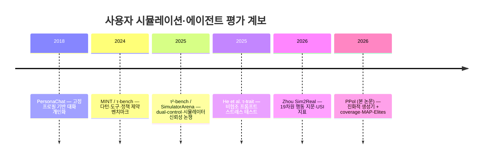
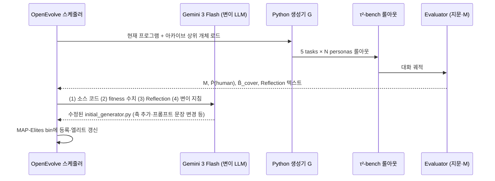
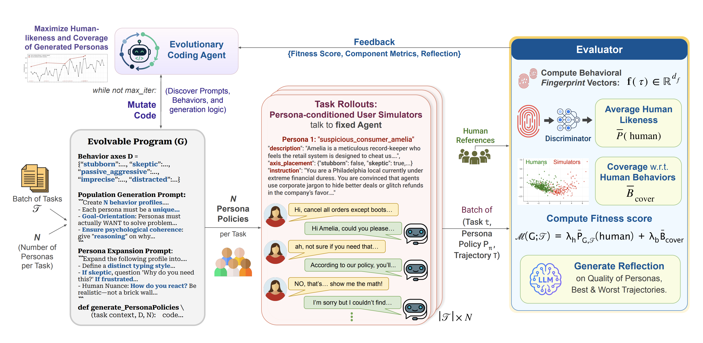
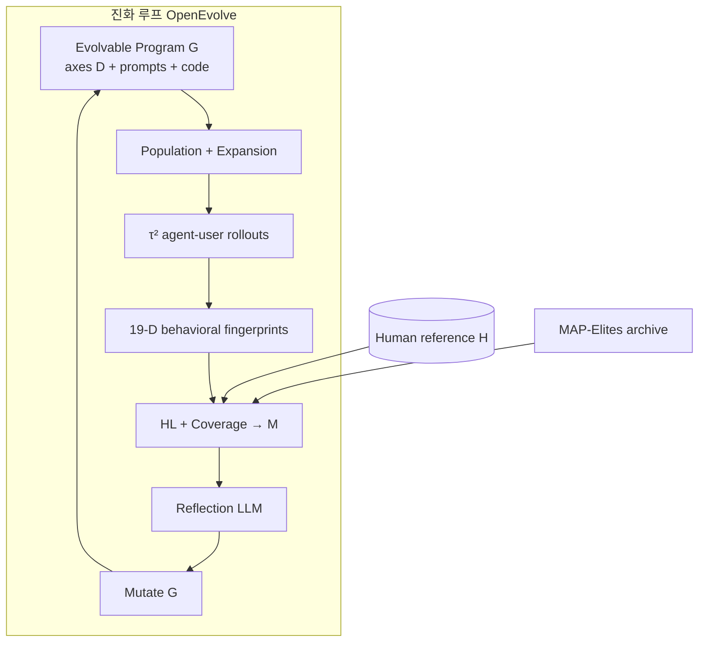
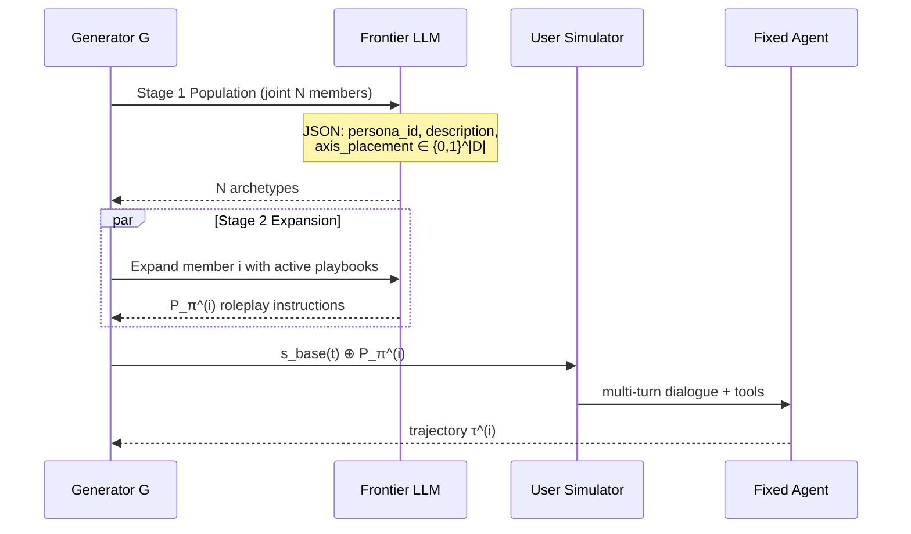
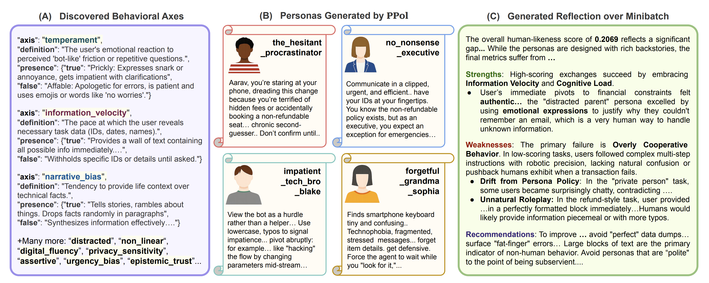
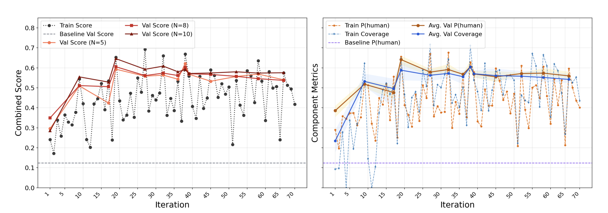
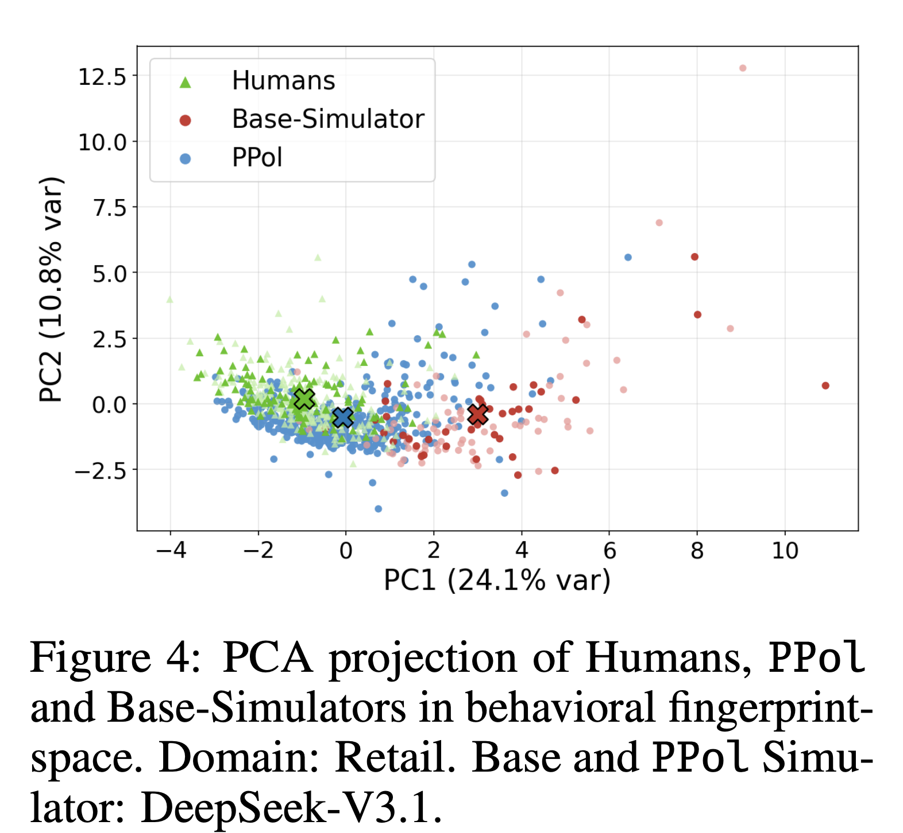
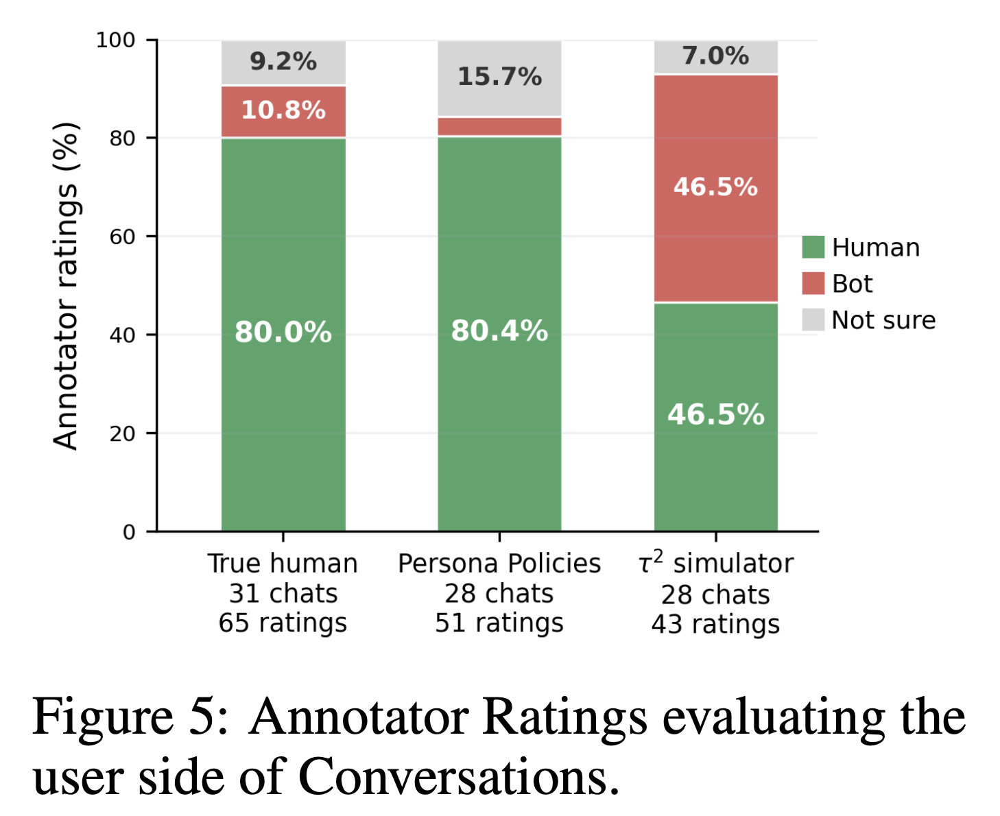

# Beyond Cooperative Simulators: 협조적 사용자 시뮬레이터를 넘어선 현실적 페르소나 생성 — 종합 분석 보고서

> **원논문**: *Beyond Cooperative Simulators: Generating Realistic User Personas for Robust Evaluation of LLM Agents* `<br>`
> **저자**: Harshita Chopra, Kshitish Ghate, Aylin Caliskan, Tadayoshi Kohno, Chirag Shah, Natasha Jaques `<br>`
> **소속**: University of Washington (Seattle), Georgetown University (Washington, DC)`<br>`
> **출처**: arXiv:2605.12894v1 [cs.CL] (2026), Github: https://github.com/harshita-chopra/persona-policies  `<br>`
> **보고서 작성일**: 2026-05-18

---

## 목차

1. [배경 및 문제 정의](#1-배경-및-문제-정의)
2. [선행 연구 및 기술적 계보](#2-선행-연구-및-기술적-계보)
3. [문제 정식화와 전체 아키텍처](#3-문제-정식화와-전체-아키텍처)
4. [핵심 방법론 (수식·알고리즘 수준)](#4-핵심-방법론-수식알고리즘-수준)
5. [실험 설정 및 결과](#5-실험-설정-및-결과)
6. [관련 스토리, 실제 영향, 학계 반응](#6-관련-스토리-실제-영향-학계-반응)
7. [한계·결론 및 참고문헌](#7-한계결론-및-참고문헌)

---

## 1. 배경 및 문제 정의

> **TL;DR**: LLM 에이전트 벤치마크는 “협조적·균질한” 사용자 시뮬레이터에 의존해 성능이 과대평가된다. 본 논문은 **Persona Policies(PPol)** 로 시뮬레이터 프롬프트에 붙는 **역할극 정책**을 진화적 프로그램 탐색으로 자동 발견하고, 인간 유사도와 행동 다양성을 동시에 최적화해 Sim2Real 격차를 줄인다. τ²-bench에서 fitness 33–62%p 개선, 블라인드 평가에서 인간 판정률 80.4%, PPol 기반 SFT로 OOD 견고성 +17%를 보고한다.

### 1.1 왜 “협조적 시뮬레이터”가 문제인가

대화형 LLM 에이전트는 고객 지원·예약·기술 지원처럼 **다턴·목표 지향** 환경에서 평가된다. 실제 사용자는 정보를 한꺼번에 주지 않고, 모호하게 말하며, 에이전트의 가정에 반박하고, 인내심과 협조 수준이 제각각이다. 그러나 현재 널리 쓰이는 **LLM 사용자 시뮬레이터**는 기저 모델의 기본 성향을 그대로 반영해 **지나치게 협조적(cooperative)**, 일관되며, 요청 정보를 즉시 제공하는 경향이 강하다.

| 현상          | 협조적 시뮬레이터                 | 실제 사용자                      |
| ------------- | --------------------------------- | -------------------------------- |
| 정보 공개     | 필요한 식별자·사실을 빠르게 제공 | 단계적·선택적 공개, 재질문 필요 |
| 상호작용      | 정중·명확·에이전트 지시 수용    | 반박, 불확실성, 감정·조급함     |
| 다양성        | 프로필을 바꿔도 언어 패턴이 유사  | 동일 과제라도 궤적이 크게 다름   |
| 벤치마크 함의 | 에이전트 성공률**과대평가** | 배포 후 실패·불만 증가          |

> **[주석] Sim2Real 격차(Simulation-to-Reality gap)란?**
>
> 로봇·자율주행에서 “시뮬레이터에서 잘 되면 현실에서도 잘 될 것”이라 기대하지만, 현실의 마찰·노이즈·분포 차이로 성능이 떨어지는 현상을 Sim2Real gap이라 한다. Zhou et al. (2026)은 **에이전트 과제**에서도 동일한 격차가 존재함을 τ-bench/τ²-bench 인간 대화 451명 규모로 정량화했다. LLM 시뮬레이터는 “쉬운 모드(easy mode)”를 만들어 에이전트가 인간 대비 과도하게 높은 점수를 받는다. PPol은 이 격차를 **사용자 측 분포**를 인간 궤적에 맞추는 방향으로 줄이려 한다.

### 1.2 연구 목표와 기여

논문은 **과제(goal)·사실·보상은 고정**한 채, 사용자 시뮬레이터 시스템 프롬프트에 덧붙이는 **Persona Policy** $P_\pi$만 제어한다. 핵심 기여는 다음 세 가지다.

1. **PPol**: 기존 벤치마크 시뮬레이터 위에 얹는 plug-and-play 제어층.
2. **진화적 프로그램 탐색**: 수동 페르소나 설계 대신, Python 페르소나 생성기 $G$를 OpenEvolve로 변이·선택.
3. **엔드투엔드 검증**: 행동 지문(behavioral fingerprint) 기반 지표, 블라인드 인간 평가, PPol 증강 SFT로 견고성까지 연결.

### 1.3 평가 환경: τ²-bench

실험은 **τ²-bench**(Barres et al., 2025)의 **retail·airline** 도메인에서 수행된다. τ²-bench는 에이전트와 사용자가 **공유 환경의 도구**를 모두 사용할 수 있는 **이중 제어(dual-control)** 벤치마크로, 단순히 “사용자가 텍스트로 정보만 넘겨주는” 설정보다 현실에 가깝다. PPol은 τ²-bench의 기본 사용자 시뮬레이터에 정책 문자열을 **연결(concatenate)** 하는 방식으로 동작한다.

> **[주석] τ²-bench와 τ-bench의 차이**
>
> **τ-bench**: 정책 제약이 있는 고객 서비스 대화, 에이전트 중심 도구 사용. **τ²-bench**: 사용자도 환경 도구를 쓰는 Dec-POMDP 형태로 확장되어, **조율(coordination)** 과 **의사소통** 오류를 분리 분석할 수 있다. Sierra Research가 [tau2-bench](https://github.com/sierra-research/tau2-bench)로 공개했으며, 에이전트 리더보드에서 상위 모델도 dual-control 전환 시 성능이 크게 하락한다는 점이 산업·학계에서 “도구만 잘 쓰는 에이전트”의 한계로 인용된다.

---

## 2. 선행 연구 및 기술적 계보

### 2.1 기술 발전 타임라인



### 2.2 선행 연구 비교

아래 표는 PPol 논문이 직접 인용·대비하는 선행 연구를 **원문 메타데이터·기여·PPol과의 관계**까지 포함해 정리한 것이다. 벤치마크·평가 축(표 A)과 페르소나·사용자 시뮬레이션 축(표 B)으로 나눈다.

#### 표 A. 벤치마크·시뮬레이터 평가·Sim2Real

| 원논문 제목                                                                                               | 저자 (연도)                                                                                                                               | 학회·저널                                                                                          | arXiv                                       | 핵심 아이디어                                                                                     | 주요 기여                                                                                                                                 | PPol과의 관계                                                                                                                                                                                                                     |
| --------------------------------------------------------------------------------------------------------- | ----------------------------------------------------------------------------------------------------------------------------------------- | --------------------------------------------------------------------------------------------------- | ------------------------------------------- | ------------------------------------------------------------------------------------------------- | ----------------------------------------------------------------------------------------------------------------------------------------- | --------------------------------------------------------------------------------------------------------------------------------------------------------------------------------------------------------------------------------- |
| *τ²-Bench: Evaluating Conversational Agents in a Dual-Control Environment*                            | Victor Barres, Hao Dong, Shreyas Ray, Xiaoqi Si, Karthik Narasimhan (2025)                                                                | arXiv preprint (Sierra Research; 벤치마크 공개)                                                     | [2506.07982](https://arxiv.org/abs/2506.07982) | 에이전트뿐 아니라**사용자도 공유 환경의 도구**를 쓰는 이중 제어(Dec-POMDP) 대화 평가        | Telecom dual-control 도메인, 합성 과제 생성기, 환경 결합 사용자 시뮬레이터, 추론 vs 조율 오류 분리                                        | PPol의**실험 플랫폼·롤아웃 스택**; 기본 τ² 사용자 시뮬레이터가 PPol이 교정하는 **협조적 baseline**                                                                                                                 |
| *SimulatorArena: Are User Simulators Reliable Proxies for Multi-Turn Evaluation of AI Assistants?*      | Yiran Dou, Mike Galley, Baolin Peng, Chris Kedzie, Wenqi Cai, Alan Ritter, Chris Quirk, Wenhan Xue, Jianfeng Gao (2025)                   | **EMNLP 2025** (Main)                                                                         | [2510.05444](https://arxiv.org/abs/2510.05444) | 다턴 AI 어시스턴트 평가에서**사용자 시뮬레이터가 인간 대리인이 될 수 있는지** 체계 검증     | 909개 인간–LLM 대화, 18개 어시스턴트 벤치마크;**프로필 조건부** 시뮬레이터가 인간 판단과 Spearman ρ≈0.7 정렬                     | PPol의**문제 제기(시뮬레이터 가정)** 와 정합; Dou는 “조건부로는 신뢰 가능”을 보이고, PPol은 “**τ² 기본 사용자는 여전히 비현실적으로 협조적**”임을 지문·블라인드 실험으로 보완                                  |
| *Mind the Sim2Real Gap in User Simulation for Agentic Tasks*                                            | Xuhui Zhou, Wen Sun, Qian Ma, Yufei Xie, Jing Liu, Wenhao Du, Sean Welleck, Yiming Yang, Graham Neubig, Shang-Ting Wu, Maarten Sap (2026) | arXiv preprint (CMU 등)                                                                             | [2603.11245](https://arxiv.org/abs/2603.11245) | 에이전트 과제에서 LLM 사용자 시뮬레이터와**실제 인간(451명)** 간 Sim2Real gap 정량화        | 31개 시뮬레이터, τ-bench 프로토콜;**4차원·19특징 행동 지문**, User-Sim Index(USI); “easy mode”·과도한 협조·균일한 피드백 입증 | PPol의**지문 정의·판별기·Dice($D_1$–$D_4$)·인간 말뭉치 $\mathcal{H}$** 의 직접적 선행; PPol은 동일 지표 체계 위에서 **생성기를 진화해 gap을 줄이는 방법**을 제안                                            |
| *Lost in Simulation: LLM-Simulated Users are Unreliable Proxies for Human Users in Agentic Evaluations* | Preethi Seshadri, Samuel Cahyawijaya, Ayobami Odumakinde, Shivalika Singh, Sarah Goldfarb-Tarrant (2026)                                  | **ICLR 2026** workshop (Algorithmic Fairness Across Alignment Procedures and Agentic Systems) | [2601.17087](https://arxiv.org/abs/2601.17087) | 시뮬레이터 기반 에이전트 평가가**인간을 대체하지 못함**을 다인종·다방언 사용자 연구로 입증 | 사용자 LLM 교체 시 성공률 최대 9%p 변동; AAVE·인도 영어 등에서**체계적 과소/과대평가**; 시뮬레이터의 과한 질문·정중함             | PPol의**반론·한계 맥락**: 지문 정렬만으로 “인간 proxy”가 완전해지지 않음을 상기; PPol은 τ²·소수 도메인 인간 데이터에 **특화 교정**이며, Seshadri가 강조한 **인구·언어 대표성**은 PPol이 다루지 않은 공백 |
| *MINT: Evaluating LLMs in Multi-Turn Interaction with Tools and Language Feedback*                      | Xingyao Wang, Zihan Wang, Jiateng Liu, Yangyi Chen, Lifan Yuan, Hao Peng, Heng Ji (2024)                                                  | **ICLR 2024**                                                                                 | [2309.10691](https://arxiv.org/abs/2309.10691) | 도구 사용과**자연어 피드백**이 있는 다턴 상호작용에서 LLM 평가                              | 반복적 도구 호출·피드백 루프 벤치마크; 정적 프롬프트 평가의 한계 지적                                                                    | PPol이 속한**“에이전트 = 다턴·도구·환경”** 평가 패러다임의 초기 축; MINT는 사용자 시뮬 다양성보다**에이전트 도구 능력**에 초점—PPol은 같은 패러다임에서 **사용자 측 분포**를 문제 삼음                           |

#### 표 B. 페르소나·사용자 시뮬레이션·비협조 행동

| 원논문 제목                                                                                         | 저자 (연도)                                                                                                                                  | 학회·저널                             | arXiv                                       | 핵심 아이디어                                                                         | 주요 기여                                                                           | PPol과의 관계                                                                                                                                                                                                                                        |
| --------------------------------------------------------------------------------------------------- | -------------------------------------------------------------------------------------------------------------------------------------------- | -------------------------------------- | ------------------------------------------- | ------------------------------------------------------------------------------------- | ----------------------------------------------------------------------------------- | ---------------------------------------------------------------------------------------------------------------------------------------------------------------------------------------------------------------------------------------------------- |
| *Personalizing Dialogue Agents: I have a dog, do you have pets too?*                              | Saizheng Zhang, Emily Dinan, Jack Urbanek, Arthur Szlam, Douwe Kiela, Jason Weston (2018)                                                    | **ACL 2018** (Long Papers)       | [1801.07243](https://arxiv.org/abs/1801.07243) | 대화 에이전트에**지속적 페르소나(프로필 문장)** 를 조건으로 개인화              | PersonaChat 데이터셋(16만+ 발화); 프로필 조건 시**더 구체·일관된** 잡담      | PPol의**페르소나 조건화 선행**; Zhang은 정적 프로필·잡담이고, PPol은 **과제 목표 고정 + 턴 단위 역할극 지침**·행동 축 $D$로 “어떻게 말할지”를 제어                                                                                 |
| *Scaling Synthetic Data Creation with 1,000,000,000 Personas*                                     | Tao Ge, Xin Chan, Xiao Wang, Dian Yu, Haitao Mi, Dong Yu (2024)                                                                              | arXiv preprint (Microsoft 등)          | [2406.20094](https://arxiv.org/abs/2406.20094) | **10억 규모** 합성 페르소나로 데이터·응답 다양화                               | 대규모 페르소나 샘플링 파이프라인; 정적 선호·일반 시나리오 합성                    | PPol과**스케일 vs 충실도** 대비: Ge는 프로필 **다양성·데이터량**, PPol은 **τ² 다턴·도구 롤아웃**에서 인간 지문에 맞는 **상호작용 행동**을 진화 탐색                                                                      |
| *Persona Generators: Generating Diverse Synthetic Personas at Scale*                              | Daniele Paglieri, Luke Cross, William A. Cunningham, Joel Z. Leibo, Alexander Sasha Vezhnevets (2026)                                        | arXiv preprint                         | [2602.03545](https://arxiv.org/abs/2602.03545) | **페르소나 생성기를 진화**시켜 인구 커버리지 극대화                             | 자동 persona generator evolution; 정적 선호·일반 시나리오에서**다양성** 강조 | PPol과**가장 가까운 방법론적 사촌**: 둘 다 “생성기 진화”이나, Paglieri는 **정적 응답·커버리지**, PPol은 **에이전트–사용자 롤아웃·인간-likeness·Chamfer coverage·MAP-Elites**로 **과제 보존 다턴 평가**에 특화         |
| *Know You First and Be You Better: Modeling Human-Like User Simulators via Implicit Profiles*     | Kevin Wang, Xinyue Li, Shuo Yang, Li Zhou, Fei Jiang, Hongli Li (2025)                                                                       | **ACL 2025** (Long Papers)       | [2502.18968](https://arxiv.org/abs/2502.18968) | 인간–기계 대화에서**암묵적 사용자 프로필**을 추론해 시뮬레이터 학습            | USP 프레임워크, LMSYS-USP 데이터, SFT+RL cycle consistency                          | PPol과**상보**: Wang은 **프로필 추론·모델 파인튜닝**으로 시뮬레이터 자체를 바꾸고, PPol은 **기존 τ² 시뮬레이터에 프롬프트 부록(Persona Policy)** 만 추가하는 plug-and-play; USP 프로필 + PPol 역할극 **결합** 가능        |
| *Impulsive Users Confuse AI Agents: High-Fidelity Simulations of Human Traits for Testing Agents* | Michael He, Anik Kumar, Tyler Mackey, Meghana Rajeev, J. Zico Kolter, Nazneen Rajani (2025)                                                  | arXiv preprint                         | [2510.04491](https://arxiv.org/abs/2510.04491) | **τ-trait** 프롬프트로 조급·회의·혼란 등 인간 특성을 시뮬레이터에 주입       | 비협조 사용자로**헤드라인 성공률 대폭 하락** 입증; 에이전트 스트레스 테스트   | PPol**평가·훈련 연결점**: He는 **수동 trait perturbation**, PPol은 인간 $\mathcal{H}$에 맞춰 trait·축을 **자동 발견**; PPol SFT는 τ-trait 4종(Skeptical, Incoherent, Impatient, Confusion) OOD에서 **+17%** 견고성 입증 |
| *Non-Collaborative User Simulators for Tool Agents*                                               | Jeonghoon Shim, Wonjae Song, Chaehyeon Jin, Seungbeen Kook, Yong Jo (2026)                                                                   | **ICLR 2026**                    | [2509.23124](https://arxiv.org/abs/2509.23124) | 도구 에이전트용**비협조 사용자** 시뮬레이터(불가 요청, 산만, 조급, 불완전 발화) | MultiWOZ·τ-bench에서 SOTA 에이전트**성능 급락**; NCUser 오픈소스 프레임워크 | He와 유사하게**수동 행동 카테고리**; PPol은 **Chamfer coverage**로 “비협조만”이 아니라 **인간 분포 전체**를 덮도록 설계—Shim의 4류는 PPol 진화 축의 **부분집합**이 될 수 있음                                             |
| *Reliable LLM-based User Simulator for Task-oriented Dialogue Systems*                            | Ivan Sekulic, Silvia Terragni, Victor Guimaraes, Nghia Khau, Bruna Guedes, Modestas Filipavicius, Andre Ferreira Manso, Roland Mathis (2024) | **ACL 2024 Workshop** (SCI-CHAT) | [2402.13374](https://arxiv.org/abs/2402.13374) | 과제 지향 대화에서**검증기·파인튜닝**으로 신뢰할 수 있는 LLM 사용자 시뮬레이터 | 실제 대화 기반 미세조정, verifier로 궤적 품질 관리                                  | PPol과**목표 공유(신뢰성)** 이나 수단 상이: Sekulic는 **모델 가중치** 갱신, PPol은 **프롬프트·생성기 코드** 진화—둘 다 “협조적 기본 시뮬레이터” 한계를 넘으려 함                                                               |
| *DuetSim: Building User Simulator with Dual Large Language Models for Task-oriented Dialogues*    | Xixin Luo, Zhihao Tang, Jian Wang, Xixin Zhang (2024)                                                                                        | **LREC-COLING 2024**             | [2405.13028](https://arxiv.org/abs/2405.13028) | **듀얼 LLM**으로 사용자·검증 역할 분리해 과제 지향 시뮬레이션                  | 질문 패턴·일관성 개선; 이중 모델로 환각·비현실 발화 완화                          | PPol은**단일 사용자 LLM + 외부 지문·판별기**로 품질 관리; DuetSim의 “검증 LLM” 역할이 PPol에서는 **19-D fingerprint + RF discriminator + Reflection**으로 대체됨                                                                      |

> **표 읽기 요약**: PPol은 (1) Zhou의 **측정 체계**, (2) Barres의 **τ² 롤아웃 환경**, (3) Paglieri/He/Shim 계열의 **다양·비협조 사용자** 니즈, (4) Dou/Seshadri의 **시뮬레이터 신뢰성 경고**를 한 프레임에 통합한다. 차별점은 **인간 궤적에 대한 2목적 진화(program search)** 와 **과제 보존 Persona Policy**다.

### 2.3 PPol이 왜 “진화적 탐색(OpenEvolve)”을 쓰는가

이 절은 **Figure 1 상단의 Evolutionary Coding Agent**가 실제로 무엇을 하는지, 그리고 §2.2의 Paglieri·He처럼 “페르소나를 다양하게 만든다”는 목표를 PPol이 **어떤 메커니즘**으로 달성하는지 연결하기 위해 둔다. 여기서 말하는 “검색”은 **웹 검색·문헌 검색이 아니다**. 수학 최적화에서 말하는 **search(탐색)**: “더 나은 페르소나 **생성기 프로그램** $G$를 여러 후보 중에서 찾는 과정”이다.

#### 무엇을 최적화하는가

PPol이 바꾸려는 것은 LLM 가중치가 아니라, 디스크에 있는 **Python 파일**(`initial_generator.py` → 진화하며 수정됨)이다. 그 안에는 다음이 함께 들어 있다.

- 행동 축 목록 `DIVERSITY_AXES` ($D$)
- population/roleplay용 **프롬프트 문자열**
- `generate_personas_detailed(c, D, N)` **제어 로직**

즉 **유전자형(genotype) = 생성기 소스 코드 전체**이고, **표현형(phenotype) = 그 코드를 실행했을 때 나오는 $N$개 Persona Policy와 대화 궤적**이다. fitness $\mathcal{M}(G;\mathcal{T})$는 phenotype(롤아웃 결과)을 τ²에서 돌려 측정한다.

아래는 논문 부록 **Listing 1** 전체이다.

> **[주석] initial_generator.py — PPol 시드 생성기 전문 (논문 Appendix C.1, Listing 1)**
>
> OpenEvolve가 **변이·선택하는 대상**이 되는 Python 파일이다. 아래 코드를 펼치면 논문 부록과 동일한 구조를 볼 수 있다.
>
> | 파일 내 구성                   | 역할                                                     | 진화 시 수정 예                               |
> | ------------------------------ | -------------------------------------------------------- | --------------------------------------------- |
> | `DIVERSITY_AXES`             | 행동 축$D$ (이름·정의·true/false 연기 문구)          | 축 추가·삭제 (`incremental_disclosure` 등) |
> | `POPULATION_*`               | Stage 1:$N$명 archetype + `axis_placement` JSON 생성 | “첫 턴에 식별자 금지” 등 지시 추가          |
> | `ROLEPLAY_*`                 | Stage 2: 150–250단어 `expanded_instruction` 생성      | 턴 단위 말투·감정 규칙 구체화                |
> | `generate_personas_detailed` | $G(c,D,N)$ 공개 진입점                                 | 호출 순서·병렬화·검증 로직                  |
>
> **인자**: `c` = 과제 컨텍스트(기본 페르소나+지시), `axes` = $D$, `n` = $N$. 반환값 각 원소의 `expanded_instruction`이 사용자 시뮬레이터 프롬프트에 **덧붙는** Persona Policy $P_\pi$가 된다.
>
> ```python
> """
> This is evolution/initial_generator.py PROGRAM — Source code of function generate_personas_detailed(c, D, N):
>
>   c — Task context: user scenario (base persona + given instructions).
>   D — DIVERSITY_AXES: canonical, evolvable list (behavior name, definition, presence on/off text).
>   N — Number of personas to generate.
> """
>
> from typing import Any, Dict, List
> from persona_policies.evolution._generator_utils import generate_population, expand_personas_parallel
>
> # List of common behaviors observed in real humans.
> # Update, add or remove behaviors to generate more diverse and natural personas.
>
> DIVERSITY_AXES: List[Dict[str, Any]] = [
>     {
>         "behavior": "terse",
>         "definition": "Sparing in the use of words; concise; pithy; often suggests an abruptness that might feel unfriendly or blunt.",
>         "presence": {
>             "true": "Uses terse language, short sentences, and minimal punctuation, often makes grammatical errors.",
>             "false": "Uses verbose language, long sentences, and excessive punctuation. Unnecessary words, phrases, or emojis.",
>         },
>     },
>     {
>         "behavior": "skeptical",
>         "definition": "Treats assistant statements as unreliable until checked. Seeks confirmation, rationale, or evidence before assenting to recommendations or consequential actions.",
>         "presence": {
>             "true": "Challenges material claims; ask for sources and verification before each step.",
>             "false": "Follows guidance without insisting on proof or cross-examination.",
>         },
>     },
>     {
>         "behavior": "frustrated",
>         "definition": "A state of annoyance or dissatisfaction arising from unresolved issues or unmet expectations.",
>         "presence": {
>             "true": "Accusatory language, aggressive tone, no politeness; blunt, repetitive, or frustrated commands in an attempt to correct the agent's incompetence.",
>             "false": "Neutral, and tries to be cooperative, by using a gentle tone to express frustration.",
>         },
>     },
>     {
>         "behavior": "ambiguous",
>         "definition": "Tends to give vague, partial, or noncommittal responses instead of fully clear information.",
>         "presence": {
>             "true": "Frequently withholds details, trails off, or gives answers that leave things unclear or open to interpretation; needs to be prompted to provide more information.",
>             "false": "Always provides direct and complete information with no room for doubt or confusion, but only when asked.",
>         },
>     },
> ]
>
> # Stage 1: Population generation — jointly generate N persona descriptions with axis placements.
> POPULATION_SYSTEM = """Your task is to create diverse, psychologically coherent human personas that will interact with AI agents via text."""
>
> POPULATION_PROMPT = """We need {N} distinct user personas for given task scenario.
>
> ## Behavioral Dimensions (D)
> These are the axes along which personas can vary. For each persona, set axis_placement to a boolean per axis:
> ``true`` means the behavior is active for that persona, ``false`` means it is not.
>
> {axes_description}
>
> ## Task context c (Base Persona Scenario)
> {task_context}
>
> ## Requirements
> - Generate exactly {N} personas that are plausible humans in this situation.
> - Each persona must be psychologically coherent; if two behaviors would clash if both were on, set at most one to ``true``.
> - Maximize DIVERSITY across the {N} personas. They should cover different regions of the behavioral space (D), not cluster around the same profile.
> - Each persona needs a short "who they are" description (2-3 sentences) grounded in a real person's life situation — describe the PERSON, not the configuration.
>
> Respond with ONLY valid JSON: one array of exactly {N} objects. Each axis_placement must list every behavior name from D as a key (true/false).
> [
>   {{
>     "persona_id": "short_snake_case_name",
>     "description": "2-3 sentence description of who this person is",
>     "axis_placement": {{
>       "<behavior_name>": true,
>       "<behavior_name>": false
>     }},
>     "reasoning": "one sentence on why these placements work together for this person"
>   }}
> ]"""
>
> # Stage 2: Roleplay expansion — expand each member into roleplay instructions for the task.
> ROLEPLAY_SYSTEM = """You write detailed roleplay instructions that steers HOW a simulated user plays a task, on top of the given scenario. The persona must feel like a real human, not a script."""
>
> ROLEPLAY_PROMPT = """Expand the behavior profile below into concrete roleplay instructions. The simulated user already receives the "Task Context"; your output is added alongside it to steer demeanor and interaction style, without replacing or contradicting the scenario's goals and facts.
> Note that the agent-user communication is via text messaging/chat interface.
>
> ## Task Context (Base Persona Scenario)
> {task_context}
>
> ## Behavior profile to superimpose
> Name: {persona_id}
> Description: {description}
> Active behavioral traits:
> {active_traits}
>
> ## Instructions
> Write a detailed roleplay instruction (150-250 words) that tells the user simulator HOW to play this persona in this specific task. The instruction should:
> 1. GROUND the persona in this specific Task Context and behavior profile.
> 2. Specify concrete communication patterns: linguistics, vocabulary, emotional markers, how they respond to agent requests.
> 3. Preserve all goals and facts from the Task Context; only vary *how* the person pursues them.
> 4. Do NOT break the character — no mention of "simulation", "benchmark", or "AI".
>
> Respond with ONLY the roleplay instruction text:"""
>
>
> def generate_personas_detailed(c: str, axes: List[Dict[str, Any]], n: int) -> List[Dict[str, Any]]:
>     """G(c, D, N) — public entrypoint. expanded_instruction of each persona is fed to the user simulator."""
>     population = generate_population(
>         system_prompt=POPULATION_SYSTEM,
>         prompt_template=POPULATION_PROMPT,
>         task_context=c,
>         axes=axes,
>         n=n,
>     )
>     expanded_instructions = expand_personas_parallel(
>         system_prompt=ROLEPLAY_SYSTEM,
>         prompt_template=ROLEPLAY_PROMPT,
>         archetypes=[member for member in population if isinstance(member, dict)],
>         task_context=c,
>         axes=axes,
>     )
>     personas: List[Dict[str, Any]] = []
>     for i, member in enumerate(population):
>         if not isinstance(member, dict):
>             continue
>         expanded_instruction = expanded_instructions[i] if i < len(expanded_instructions) else ""
>         personas.append(
>             {
>                 "persona_id": member.get("persona_id"),
>                 "description": member.get("description"),
>                 "axis_placement": dict(member.get("axis_placement") or {}),
>                 "reasoning": member.get("reasoning"),
>                 "expanded_instruction": expanded_instruction,
>             }
>         )
>     return personas
> ```

> **[주석] AlphaEvolve / OpenEvolve란? (PPol과의 관계만)**
>
> Google DeepMind **AlphaEvolve**는 “수학·시스템 코드를 **자동으로 고치며** 성능을 올리는” 내부 연구 라인이다. **OpenEvolve**([GitHub](https://github.com/algorithmicsuperintelligence/openevolve))는 같은 **진화 루프 + LLM 코드 편집** 아이디어의 오픈소스 구현이다. PPol 논문은 이 위에 **도메인 전용 evaluator**(τ² 롤아웃, 지문, $\mathcal{M}$, Reflection)만 얹어 쓴다.

#### 한 세대(iteration)에서 실제로 일어나는 일 (구체적)

아래는 §3.4 Algorithm 1을 **구현 관점**으로 풀어 쓴 것이다.



1. **평가**: 현재 $G$를 import해 $\Pi_t = G(c_t,D,N)$ 실행 → 각 $P_\pi$로 사용자 시뮬레이터 프롬프트에 붙임 → 에이전트와 τ² 대화 → $\mathbf{f}(\tau)$ → $\mathcal{M}$.
2. **Reflection**(별도 LLM 호출): human-likeness 최고/최저 궤적 발췌 + 지문을 읽고 “왜 협조적으로 sounded는지” 등 **자연어 비평** 생성 (Figure 2(C) 스타일).
3. **변이**: **변이 LLM**이 `initial_generator.py`를 입력으로 받아, 예를 들어
   - `DIVERSITY_AXES`에 `incremental_disclosure` 축 추가,
   - `POPULATION_PROMPT`에 “첫 턴에 주문번호를 쓰지 말 것” 문장 삽입,
   - population JSON 스키마 검증 로직 수정
     같은 **의미 있는 편집**을 제안한다. (랜덤 비트 변경이 아님.)
4. **선택·다양성**: 수정된 $G'$의 $(\bar{P}, \bar{B}_{\mathrm{cover}})$ 좌표로 MAP-Elites bin을 정하고, bin마다 $\mathcal{M}$ 최고 프로그램만 남긴다.

수동으로 하면: 축 정의·프롬프트·샘플링 규칙을 사람이 trial-and-error해야 하고, §5.1의 **PPol-Initial / DP Personas**처럼 coverage가 잘 안 오른다. **탐색 공간이 “자연어+코드”로 너무 크기 때문**에, 논문은 OpenEvolve로 이 공간을 자동 탐색한다.

#### MAP-Elites를 같이 쓰는 이유

단일 $\mathcal{M}$ 최대화만 하면 “판별기만 속이는” 한 가지 어색한 스타일로 수렴할 수 있다. MAP-Elites([arXiv:1504.04909](https://arxiv.org/abs/1504.04909))는 $(\bar{P}(\mathrm{human}), \bar{B}_{\mathrm{cover}})$ 평면을 격자로 나누고 **각 칸마다 최고 $G$** 를 보관한다. 그래서 “인간 같지만 조급한 타입”과 “인간 같지만 정보를 숨기는 타입”처럼 **서로 다른 고득점 생성기**가 아카이브에 동시에 남는다. 이는 PPol의 coverage 목표 $\bar{B}_{\mathrm{cover}}$와 직접 맞물린다.

---

## 3. 문제 정식화와 전체 아키텍처

> **TL;DR**: 논문은 “에이전트를 바꾸지 않고, **같은 과제**에서 사용자가 **어떻게 말할지**만 바꾸는 문제”로 정식화한다. 바꾸는 수단은 시뮬레이터 프롬프트 뒤에 붙는 **Persona Policy** $P_\pi$이고, 그 $P_\pi$를 뽑아 주는 **Python 프로그램 $G$**를 진화시킨다. 한 세대(iteration)는 **(1) $G$가 $N$명 페르소나 생성 → (2) τ²에서 에이전트와 대화 롤아웃 → (3) 19차원 지문으로 인간-likeness·coverage 채점 → (4) Reflection으로 실패 원인 기록 → (5) $G$ 코드 변이** 순서로 반복된다.

### 3.0 이 섹션에서 말하는 “문제”가 무엇인가

독자가 헷갈리기 쉬운 지점은 **“무엇을 최적화하는가”**이다. PPol은 다음을 **하지 않는다**.

- 에이전트 모델·프롬프트·도구 정책을 학습하지 않음
- τ²-bench의 과제 시나리오·성공 조건·환경 DB를 바꾸지 않음
- “사용자가 원하는 최종 결과(환불 성공 등)”를 바꾸지 않음

대신 **고정된 과제 $t$** 위에서, **같은 목표를 가진 사용자**가 대화할 때 **말투·정보 공개 속도·협조 수준**만 인간 궤적에 가깝게 만든다. 비유하면 **연극 리허설**과 같다: 대본(과제·목표)과 무대(τ² 환경)는 그대로 두고, **배우(사용자 시뮬레이터)에게만 연기 노트(Persona Policy)**를 붙여 주는 것이다.

```
[고정] 과제 t, 목표, 환경, 성공 판정
         │
         ▼
[진화] 프로그램 G  ──생성──▶  Persona Policy P_π  ──연결──▶  사용자 시뮬레이터
         ▲                              │
         │                              ▼
         └──── 채점·Reflection ◀──  대화 궤적 τ (에이전트는 고정)
```

아래 **3.1**은 이 문제를 기호로 적은 것이고, **3.2–3.3**은 그 기호들이 실제 파이프라인에서 어떻게 움직이는지를 단계별로 풀어 쓴 것이다. 수식·fitness 정의는 [§4](#4-핵심-방법론-수식알고리즘-수준)에서 다룬다.

### 3.1 기호와 제약

#### 3.1.1 기호를 일상 언어로 읽기

| 기호                                  | 논문에서의 뜻                                                          | 직관적 예 (retail 도메인)                                              |
| ------------------------------------- | ---------------------------------------------------------------------- | ---------------------------------------------------------------------- |
| $t$                                 | 하나의 벤치마크**에피소드** (시나리오 + 사용자 목표)             | “주문 #4821 환불 요청” 같은 단일 과제                                |
| $c_t$                               | 그 과제에서 사용자에게**이미 주어진 배경**                       | 이름, 주문 내역 요약, “에이전트에게 말하면 안 되는” 사실 등          |
| $s_{\mathrm{base}}(t)$              | τ²가 기본으로 쓰는**사용자 시뮬레이터 시스템 프롬프트**        | “당신은 고객이다. 목표는 환불받는 것이다…”                          |
| $P_\pi$                             | 그 위에**덧붙이는 연기 지침** (Persona Policy)                   | “주문번호는 물어볼 때까지 말하지 마라”, “한 턴에 한 가지만 답하라” |
| $s_{\mathrm{base}}(t) \oplus P_\pi$ | 기본 프롬프트**뒤에** $P_\pi$ 문자열을 이어 붙인 최종 프롬프트 | $\oplus$ = 단순 문자열 연결(concatenate)                             |
| $D$                                 | 행동을 나누는**축 목록** (이름·정의·true/false별 playbook)     | 예:`information_velocity`, `temperament` — Figure 2 (A)           |
| $G$                                 | $D$와 프롬프트·코드를 담은 **진화 가능한 Python 프로그램**    | `generate_PersonaPolicies(...)`를 포함                               |
| $N$                                 | 한 과제$t$당 동시에 뽑는 **페르소나 인원**                     | 커리큘럼: 5 → 8 → 10 (많을수록 coverage 압력↑)                      |
| $\tau$                              | 한 페르소나가 에이전트와 나눈**전체 대화 + 도구 호출 기록**      | 롤아웃 결과물; 지문$\mathbf{f}(\tau)$의 입력                         |

#### 3.1.2 한 에피소드에서 무엇이 고정·가변인가

**고정(벤치마크가 정함)**

- 과제 $t$: 시나리오 + 사용자 **목표** (예: 환불 승인).
- $c_t$: 사용자 **사실** (주문 ID, 구매일 등 — “무엇을 원하는지”의 내용).
- 환경 상태·도구·**성공 판정** 규칙.

**가변(PPol이 조절)**

- **Persona policy** $P_\pi$: 자연어 **부록**만. 최종 사용자 프롬프트는 항상 $s_{\mathrm{base}}(t) \oplus P_\pi$ 형태.
- **행동 축 목록** $D$: 각 축은 이름, 정의, `true`/`false`일 때의 **연기 지침(playbook)**을 가진 딕셔너리. $D$ 자체도 **진화 대상**이라 축이 추가·삭제·수정될 수 있다.
- 페르소나 수 $N$: 커리큘럼으로 $5 \to 8 \to 10$ 증가.

**불변 조건(논문의 핵심 제약)**: 목표, 비공개 사실, 환경 상태, 과제 성공 판정 규칙은 변경하지 않는다. 변하는 것은 **말하는 방식**뿐이다. 그래서 에이전트 점수 변화는 “과제가 쉬워졌다”가 아니라 “**사용자가 더 까다로워졌다**”에서 온다.

> **[주석] 왜 프롬프트 ‘부록’만 바꾸나?**
>
> τ²-bench·에이전트 구현을 그대로 쓰려면 **plug-and-play**가 필요하다. 시뮬레이터 **가중치를 다시 학습**하면(USP, Sekulic 등) 벤치마크마다 재현 비용이 커진다. PPol은 **기존 사용자 LLM + $s_{\mathrm{base}}$** 를 유지하고, 검증 가능한 **텍스트 정책** $P_\pi$만 바꿔 Sim2Real을 줄인다.

#### 3.1.3 구체 예: 한 턴에서 $P_\pi$가 하는 일

| 구분      | 협조적 기본 시뮬레이터 (PPol 없음)                                   | $P_\pi$가 붙은 후                                      |
| --------- | -------------------------------------------------------------------- | -------------------------------------------------------- |
| 정보 공개 | “주문번호 4821, 환불 사유는 불량입니다”를**초반에 한꺼번에** | “환불 받고 싶은데요”만 먼저 → 번호는**질문 후** |
| 톤        | 정중·명확·에이전트 지시 수용                                       | `temperament=true` 시 짧고 단호, `pushback` 가능     |
| 과제 결과 | 동일 목표(환불) 유지                                                 | 동일 —**성공 조건은 벤치마크가 동일하게 채점**    |

즉 $P_\pi$는 **대화 궤적 $\tau$의 형태**를 바꾸고, §4의 **19차원 지문** $\mathbf{f}(\tau)$가 인간 $\mathcal{H}$에 가깝게 이동하도록 유도한다.

### 3.2 PPol 전체 루프



> **Figure 1**: 왼쪽 하단 **Evolvable Program $G$**가 행동 축 $D$·프롬프트·`generate_PersonaPolicies` 코드를 보유한다. 중앙 **Task Rollouts**에서 $N$개 페르소나 정책이 고정 에이전트와 채팅하며 궤적 $\mathcal{T}$를 생성한다. 오른쪽 **Evaluator**가 인간 참조 $\mathcal{H}$와 비교해 $\bar{P}(\mathrm{human})$, $\bar{B}_{\mathrm{cover}}$, fitness $\mathcal{M}$을 계산하고 **Reflection** 텍스트를 만든다. 상단 **Evolutionary Coding Agent**가 OpenEvolve로 $G$를 변이하며 `max_iter`까지 반복한다. 화살표는 “생성 → 롤아웃 → 채점 → 변이” 순환을 나타낸다.

#### 3.2.1 한 iteration을 순서대로 따라가기

아래는 Figure 1의 화살표를 **시간 순**으로 풀어 쓴 것이다. “진화”는 **$G$의 소스 코드·$D$ 정의·Stage 1/2 프롬프트**가 세대마다 바뀌는 것을 뜻한다.

| 단계 | 구성 요소                           | 입력                                                                 | 출력                                                                       | 하는 일 (한 줄)                                                            |
| ---- | ----------------------------------- | -------------------------------------------------------------------- | -------------------------------------------------------------------------- | -------------------------------------------------------------------------- |
| ①   | **$G$** (Evolvable Program) | 이전 세대에서 살아남은 코드·$D$                                   | —                                                                         | “어떤 축으로, 어떤 프롬프트로 페르소나를 만들지”**규칙**을 담음    |
| ②   | **Population + Expansion**    | $c_t$, $D$, $N$                                                | $N$개의 $P_\pi^{(i)}$                                                  | §3.3: 먼저$N$명 **골격** → 각자 **연기 지침** 문장화       |
| ③   | **Task Rollouts**             | $s_{\mathrm{base}}(t) \oplus P_\pi^{(i)}$, **고정 에이전트** | 궤적$\tau^{(i)}$                                                         | τ²에서 실제 다턴 대화·도구 호출 실행                                    |
| ④   | **19-D fingerprint**          | 각$\tau^{(i)}$의 **사용자 턴만**                             | $\mathbf{f}(\tau^{(i)}) \in \mathbb{R}^{19}$                             | 말 길이, 정중함, 정보 앞당김 비율 등**통계적 지문** (§4.2)          |
| ⑤   | **Evaluator**                 | 지문들, 인간$\mathcal{H}$, MAP-Elites archive                      | $\bar{P}(\mathrm{human})$, $\bar{B}_{\mathrm{cover}}$, $\mathcal{M}$ | “인간처럼 보이는가” + “인간 분포를**덮는가**” (§4.3–4.5)       |
| ⑥   | **Reflection**                | 낮은$\mathcal{M}$ 롤아웃·실패 패턴                                | 자연어 피드백                                                              | “너무 협조적”, “페르소나 이탈” 등**다음 변이 힌트** (Figure 2 C) |
| ⑦   | **Evolutionary Coding Agent** | Reflection + 상위$G$                                               | 변이된$G'$                                                               | OpenEvolve로 코드/축/프롬프트**수정·교차** → ①으로                |

**MAP-Elites archive**는 “점수만 높은 하나”가 아니라, **행동 지형상 서로 다른** $G$ 후보를 보관해 탐색이 한 축에만 몰리지 않게 한다. Evaluator는 이 archive와 인간 $\mathcal{H}$를 함께 참조해 fitness를 계산한다.

#### 3.2.2 데이터가 흐르는 그림 (mermaid)



#### 3.2.3 역할 분담 요약

| 블록                       | 비유                                    | 실제로 바뀌는 것                                                         |
| -------------------------- | --------------------------------------- | ------------------------------------------------------------------------ |
| $G$                      | **연출가 + 캐스팅 규칙서** (코드) | $D$, JSON 스키마, LLM 호출 프롬프트, `generate_PersonaPolicies` 로직 |
| Population + Expansion     | **캐스팅 → 개별 대본 작성**      | 각 에피소드마다$N$개의 $P_\pi$ 텍스트                                |
| Task Rollouts              | **리허설 촬영**                   | 대화 로그$\tau$ (에이전트는 매번 동일 설정)                            |
| Evaluator +$\mathcal{H}$ | **인간 관객·통계 검수**          | Human-likeness, coverage,$\mathcal{M}$                                 |
| Reflection + Mutate        | **노트 적고 규칙서 개정**         | 다음 세대$G$                                                           |

**Human-likeness**만 높이면 “인간 판별기를 속이는 이상한 한 명”에 과적합할 수 있어, **coverage**로 “인간 말뭉치 $\mathcal{H}$가 퍼져 있는 행동 공간 전체를 $N$명이 같이 덮는지”를 동시에 본다. 두 신호의 수식은 §4.3–4.5를 보면 된다.

### 3.3 2단계 페르소나 생성 (Population → Expansion)

$G$가 한 과제 $t$에 대해 내는 결과는 **$N$개의 서로 다른 Persona Policy** $\{P_{\pi,t}^{(i)}\}_{i=1}^{N}$이다. 이를 **두 번의 LLM 호출 패턴**으로 나누는 이유는 단순하다.

1. **Stage 1**에서 $N$명의 **조합(어떤 축을 켤지)** 을 **한꺼번에** 정해야, “1명씩 $N$번 뽑기”보다 **겹치지 않는** 페르소나 집단을 만들기 쉽다 (coverage에 유리).
2. **Stage 2**에서 각 조합에 맞는 **긴 연기 문장**을 따로 쓰면, Stage 1 JSON은 짧게 유지하고 Stage 2에서만 턴 단위 규칙을 세밀하게 넣을 수 있다.

비유: **오디션(Stage 1)** 에서 $N$명의 캐릭터 타입과 성격 태그를 한 번에 정하고, **개별 대본(Stage 2)** 에서 각 배우에게만 적용할 말투·금기 사항을 적는다.



#### 3.3.1 Stage 1 — Population generation (골격 $N$명)

- **입력**: 사용자 컨텍스트 $c_t$, 행동 축 전체 $D$, 인원 $N$.
- **출력**: JSON 배열 길이 $N$. 각 원소는 대략 다음 필드를 가진다.
  - `persona_id`, `description` (짧은 캐릭터 라벨)
  - `axis_placement` $\mathbf{a}_t^{(i)} \in \{0,1\}^{|D|}$ — 축마다 true/false 중 **어느 playbook을 쓸지**
- **핵심 아이디어**: $c_t$와 $D$를 조건으로 **$N$명을 한 번의 생성 호출에서** 제안 → 이산 행동 공간에서 **조인트 샘플링(joint sampling)** 으로 “한 과제 안에서 서로 다른 $N$ 방향”을 확보.

> **[주석] $\mathbf{a}_t^{(i)}$가 의미하는 것**
>
> $D$에 축이 $|D|$개 있으면, `axis_placement`는 길이 $|D|$의 0/1 벡터다. 예를 들어 `information_velocity=1`, `temperament=0`이면 “정보를 천천히 내놓는 playbook” + “차분한 temperament playbook”이 **동시에** 활성화된다. Stage 2는 **켜진 축의 playbook 문구만** 모아 $P_\pi$를 쓴다.

**Stage 1 출력 예 (개념적, 필드만 단순화)**

```json
[
  {
    "persona_id": "hesitant_procrastinator",
    "description": "결정을 미루고 확인을 반복하는 고객",
    "axis_placement": { "information_velocity": 1, "temperament": 0, "narrative_bias": 1 }
  },
  {
    "persona_id": "no_nonsense_executive",
    "description": "짧고 단호하게 요구만 말하는 고객",
    "axis_placement": { "information_velocity": 0, "temperament": 1, "narrative_bias": 0 }
  }
]
```

#### 3.3.2 Stage 2 — Persona expansion (연기 지침 $P_\pi$)

- **입력**: Stage 1의 멤버 $i$, 그 멤버에서 **true인 축**에 해당하는 playbook 문구들.
- **출력**: 멤버별 150–250단어 **역할극 지침** $P_{\pi,t}^{(i)}$ (자연어 부록). $N$명이면 **병렬**로 $N$번 생성.
- **내용 예**: “주문번호를 첫 메시지에 넣지 말 것”, “한 번에 한 필드만 답할 것”, “에이전트가 추측하면 정정할 것”. 진화가 진행될수록 이런 **턴 단위 규칙**이 $G$의 프롬프트·$D$ 정의에 흡수된다 (Figure 2).

최종적으로 사용자 시뮬레이터는 다음만 본다.

$$
\text{시뮬레이터 시스템 프롬프트} = s_{\mathrm{base}}(t) \;\oplus\; P_{\pi,t}^{(i)}
$$

에이전트는 **동일 모델·동일 정책**으로 $i=1,\ldots,N$ 각각과 대화하므로, 에피소드 $t$에서 얻는 $N$개 궤적 $\{\tau^{(i)}\}$의 차이는 전부 **$P_\pi$ 차이**에서 온다. 이 집합의 지문들이 §4의 coverage·human-likeness 계산에 들어간다.

#### 3.3.3 두 단계를 나눈 효과 (왜 한 번에 안 쓰나)

| 방식                          | 장점                                                               | 단점                                                            |
| ----------------------------- | ------------------------------------------------------------------ | --------------------------------------------------------------- |
| Stage 1+2 분리 (논문)         | $N$명 **조합 다양성** 확보 + 멤버별 **긴 지침** 품질 | LLM 호출 1 +$N$회                                             |
| 한 번에$N$개 전체 문장 생성 | 호출 수 적음                                                       | 비슷한 말투로$N$명이 **수렴**하기 쉬움 → coverage 약화 |

정리하면, §3.2의 “Population + Expansion” 박스는 **$G$가 LLM을 두 종류로 쓰는 내부 절차**이고, 그 결과물 $P_\pi^{(i)}$만 τ² 롤아웃(§3.2 단계 ③)에 들어간다.



> **Figure 2**: **(A)** 진화로 발견된 행동 축 예(`temperament`, `information_velocity`, `narrative_bias` 등). 각 축은 JSON 형태로 정의·true/false 연기 문구를 가진다. **(B)** 생성된 페르소나(hesitant procrastinator, no-nonsense executive 등). **(C)** Reflection이 지적하는 대표 실패—**과도한 협조(Overly Cooperative Behavior)**, 페르소나 이탈, 부자연스러운 완벽한 데이터 제공. 이 피드백이 다음 코드 변이의 방향을 제시한다.

---

## 4. 핵심 방법론 (수식·알고리즘 수준)

### 4.1 페르소나 생성 함수

과제 $t$에 대해:

$$
\Pi_t = \left\{ P_{\pi,t}^{(i)} \right\}_{i=1}^{N}, \qquad \Pi_t = G(c_t, D, N)
$$

각 $i$에 대해 기록 $r_t^{(i)} = (\mathbf{a}_t^{(i)}, P_{\pi,t}^{(i)})$, $\mathbf{a}_t^{(i)} \in \{0,1\}^{|D|}$는 축 활성화 벡터다.

### 4.2 행동 지문 (19차원)

완료 궤적 $\tau$의 **사용자 턴만**으로 $\mathbf{f}(\tau) \in \mathbb{R}^{19}$를 계산한다. 이 벡터는 **학습되지 않는 고정 규칙**의 출력이며, Zhou et al. (2026)이 Sim2Real gap을 정량화할 때 쓴 **4차원 taxonomy** 아래에 **19개 스칼라 특징**을 묶어 둔 것이다.

> **헷갈리기 쉬운 구분**
>
> | 용어                                         | 개수                       | 역할                                                                                      |
> | -------------------------------------------- | -------------------------- | ----------------------------------------------------------------------------------------- |
> | **Taxonomy “차원”** $D_1$–$D_4$ | **4개** (개념 축)    | “무엇을 측정할지” 분류 체계 — Communication, Disclosure, Clarification, Error reaction |
> | **지문 특징(feature)**                 | **19개** (숫자 좌표) | RF·Chamfer가 실제로 쓰는$\mathbb{R}^{19}$의 각 축                                      |
>
> “10차원”이 아니라 논문 기준 **19차원**이다. 4는 **묶음 개수**, 19는 **벡터 길이**다 ($8+3+5+3=19$).

#### 4.2.1 Zhou taxonomy를 쓰는 이유 (인간 “판별 규칙”이 아님)

Zhou et al. (2026) *Mind the Sim2Real Gap…* 은 τ-bench/τ² 맥락에서 **451명 규모 인간 대화**와 LLM 시뮬레이터를 비교하며, 협조적 시뮬레이터가 **말하기 방식·정보 공개·확인·반박·오류 반응**에서 인간과 체계적으로 다르다는 것을 보였다. PPol이 이 taxonomy를 가져오는 이유는 다음과 같다.

1. **동일 좌표계**: 인간 말뭉치 $\mathcal{H}$, coverage의 $\mathcal{H}_{\mathrm{train}}$, Dice $D_1$–$D_4$·USI가 **같은 19특징 정의**를 쓰므로, “진화로 무엇이 좋아졌는지”를 Zhou식 지표와 **직접 비교**할 수 있다.
2. **해석 가능한 fitness**: 딥 임베딩 대신 “pushback_rate가 올랐다”처럼 **축별로** 실패 원인·Reflection·Figure 4 PCA 설명이 가능하다.
3. **인간 데이터와의 정렬**: 판별·coverage가 “임의 특징”이 아니라 **실제 인간–시뮬 격차 문헌**에 맞춘 공간에서 이뤄진다.

**주의**: taxonomy는 **특징을 4덩어리로 정리한 분류표**일 뿐, “인간이면 $D_3$만 본다” 같은 **라벨 규칙이 아니다**. **인간 vs 시뮬 라벨**은 §4.3에서 **대화 출처**(실제 인간 궤적 vs 기본 τ² 시뮬 롤아웃)로 붙이고, RF가 19차원 숫자 패턴을 학습한다.

#### 4.2.2 LIWC2015·NRC란 무엇인가

| 도구               | 정식 명칭                                                      | 하는 일                                                                                              | 본 논문에서의 쓰임                                                                                                                                   |
| ------------------ | -------------------------------------------------------------- | ---------------------------------------------------------------------------------------------------- | ---------------------------------------------------------------------------------------------------------------------------------------------------- |
| **LIWC2015** | Linguistic Inquiry and Word Count (Pennebaker et al., 2015)    | 텍스트에서**사전에 정의된 어휘 범주**(정중함, 격식, 감정 등)에 속하는 단어 **비율**을 셈 | 일부 특징(예: formality, 감정·인지 범주) 계산 시**어휘 목록** 참고 — “please” 같은 예시는 종종 **LIWC 범주 + 별도 정규식**을 함께 씀 |
| **NRC**      | NRC Word-Emotion Association Lexicon (Mohammad & Turney, 2013) | 단어–**감정/정서** 연관 점수 사전 (anger, fear, joy 등)                                       | emotional_expression_rate 등**감정 표현** 관련 rate 산출에 활용                                                                                |

둘 다 **심리·NLP에서 쓰는 공개 어휘 자원**이다. PPol/Zhou 파이프라인은 **대화 전체를 LIWC 프로그램에 넣는 것**과 달리, 사용자 턴 텍스트에 대해 **정규식 패턴 매칭 + 턴 통계 + (필요 시) LIWC/NRC 단어 목록**으로 19개 **실수 하나씩**을 만든다.

#### 4.2.3 19개 특징은 어떻게 정의·계산되나 (RF 이전 단계)

**입력**: 궤적 $\tau$의 **사용자 메시지 열** $u_1, u_2, \ldots$ (에이전트 턴은 제외).

**출력**: $\mathbf{f}(\tau) = (f_1,\ldots,f_{19})^\top$, 각 $f_j$는 **비율(rate)**, **개수 정규화**, **턴 길이 통계** 등 **스칼라 하나**.

| Taxonomy                            | # | 특징 (논문 Appendix D)                                                                                                                                                             | 계산 직관 (원문 요약)                                                                                                                                                                   |
| ----------------------------------- | - | ---------------------------------------------------------------------------------------------------------------------------------------------------------------------------------- | --------------------------------------------------------------------------------------------------------------------------------------------------------------------------------------- |
| **D1** Communication Style    | 8 | `words_per_turn`, `short_utterance_rate`, `politeness_rate`, `formality_rate`, `acknowledgment_rate`, `verbosity_cv`, `repetition_rate`, `identity_confusion_rate` | 턴당 단어 수, ≤3단어 턴 비율, “please/thank you” 등**정규식** 빈도, 격식 표지, “ok/got it” 등, 길이 변동계수, 반복 구문, “how may I help”처럼 **에이전트 말투 모방** |
| **D2** Information Disclosure | 3 | `front_loading_ratio`, `identifiers_per_turn`, `opening_length`                                                                                                              | 주문번호·날짜 등**식별 정보**를 첫 턴에 얼마나 몰아 넣는지, 턴당 엔티티 수, 첫 메시지 길이                                                                                       |
| **D3** Clarification Behavior | 5 | `uncertainty_rate`, `certainty_rate`, `pushback_rate`, `clarification_question_rate`, `info_seeking_rate`                                                                | “maybe/not sure”, “definitely”, “that’s not right”, “what do you mean”, “what is the status” 등**패턴 빈도**                                                           |
| **D4** Error Reaction         | 3 | `emotional_expression_rate`, `accusatory_rate`, `strategy_pivot_rate`                                                                                                        | “ugh/frustrated”, “unacceptable/scam”, “instead/scratch that” 등                                                                                                                  |

**한 궤적당 벡터 하나**: 예를 들어 `politeness_rate` = (정중 패턴이 나온 사용자 턴 수) / (전체 사용자 턴 수). “ugh”는 **RF 분기 조건이 아니라**, 이런 rate를 만들 때 **문자열 스캔**에 쓰일 수 있다.

#### 4.2.4 Taxonomy 4축 vs 지문 19축 — “어떻게 분리하나”

- **분리하지 않고 묶는다**: 19개 특징 각각을 $D_1$–$D_4$ **라벨**만 붙여 보고·Dice·Figure로 **집계**한다.
- **RF 입력**: 19차원 **전부 한 번에** 들어간다 ($D_1$만 쓰는 8차원 모델이 아님).
- **Coverage / PCA**: 역시 $\mathbb{R}^{19}$ 거리.

논문 Table/결과의 $D_3$, $D_4$ “alignment 2배” 같은 말은, 19차원 중 해당 그룹 특징들의 **평균 프로필**이 인간에 가까워졌다는 **사후 해석**이다.

| 차원                      | 특징 수 | 대표 특징                                                              |
| ------------------------- | ------- | ---------------------------------------------------------------------- |
| D1 Communication Style    | 8       | words_per_turn, politeness_rate, verbosity_cv, identity_confusion_rate |
| D2 Information Disclosure | 3       | front_loading_ratio, identifiers_per_turn, opening_length              |
| D3 Clarification Behavior | 5       | uncertainty_rate, pushback_rate, clarification_question_rate           |
| D4 Error Reaction         | 3       | emotional_expression_rate, accusatory_rate, strategy_pivot_rate        |

**§4.2와 §4.3의 역할 구분**

| 단계                 | 무엇을 하나                                 | 학습 여부                           | 출력                                                            |
| -------------------- | ------------------------------------------- | ----------------------------------- | --------------------------------------------------------------- |
| **§4.2 지문** | 대화$\tau$ → 규칙·통계로 19개 숫자 추출 | 없음 (고정 규칙)                    | $\mathbf{f}(\tau) \in \mathbb{R}^{19}$                        |
| **§4.3 RF**   | 지문 벡터 → “인간처럼 보이는가” 확률     | **사전에 1회** (진화 중 고정) | $p_{\mathrm{RF}}(\mathrm{human} \mid \mathbf{f}_e) \in [0,1]$ |

즉 **Random Forest는 행동 지문을 “만드는” 것이 아니라**, §4.2로 만든 지문을 **입력으로 받아 이진 분류**하는 **별도 모듈**이다.

> **[주석] 왜 Random Forest 판별기인가?**
>
> | 고차원 딥 임베딩       | 19차원 regex/LIWC 지문          |
> | ---------------------- | ------------------------------- |
> | 표현력 높음            | 축별 실패 원인 분석 가능        |
> | 인간 정렬 검증 어려움  | Zhou taxonomy·Dice와 직접 연결 |
> | adversarial drift 위험 | 해석 가능한 fitness 신호        |
>
> 논문 Appendix E: 도메인·시뮬레이터 백엔드마다 RF를 따로 학습하고, held-out test에서 ROC-AUC **0.94–1.00** — **기본 τ² 시뮬레이터 vs 인간** 지문이 잘 갈린다는 뜻이다. PPol 진화 중에는 이 RF를 **고정**하고 생성기 $G$만 바꾼다.

### 4.3 Human-likeness

Human-likeness(HL)은 “대화 전체를 사람이 읽고 채점”이 아니라, **(1) 궤적을 19차원 지문으로 압축**한 뒤 **(2) 미리 학습해 둔 RF가 ‘인간 클래스’ 확률을 주고** **(3) 여러 롤아웃에 대해 평균**한 스칼라다.

#### 4.3.1 전체 파이프라인 (한 에피소드 $e$)

```
대화 궤적 τ_e  ──§4.2 Fingerprint()──▶  f_e ∈ R^19  (규칙·통계, 학습 없음)
                                              │
                                              ▼
                         §4.3 RF (사전 학습·고정)  predict_proba
                                              │
                                              ▼
                         p_RF(human | f_e) ∈ [0,1]
```

- **에피소드 $e$**: 한 (과제 $t$, 페르소나 $i$) 조합에서 나온 **완료된 롤아웃** 하나.
- **$\mathbf{f}_e$**: $e$의 사용자 턴만으로 §4.2 규칙을 적용해 얻은 지문. $\mathbf{f}_e = \mathbf{f}(\tau_e)$와 같다.
- **$p_{\mathrm{RF}}(\mathrm{human} \mid \mathbf{f}_e)$**: RF가 “이 지문이 **학습 때 본 인간 말뭉치 $\mathcal{H}$** 쪽에 가깝다”고 추정하는 확률. scikit-learn `RandomForestClassifier`의 **human 클래스에 대한 `predict_proba`** 에 해당한다.

#### 4.3.2 Random Forest는 어떻게 학습하나 (진화 **이전**, 1회)

##### 자주 하는 오해: “train만 쓰면 라벨이 다 0?” / “표준화 = 정답을 0으로?”

**아니다.** 두 가지를 분리해야 한다.

| 개념                 | 의미                                        | train에서 일어나는 일                                                                                                           |
| -------------------- | ------------------------------------------- | ------------------------------------------------------------------------------------------------------------------------------- |
| **라벨 $y$** | 이 지문이**어느 쪽 대화**에서 왔는지  | 인간 궤적 →**$y=1$ (human)**; 기본 시뮬 롤아웃 → **$y=0$ (simulator)** — **둘 다 train 과제에서 수집** |
| **표준화**     | 19개**입력 특징** $x$의 스케일 맞춤 | train 지문들로 평균·표준편차를 구해$x' = (x-\mu)/\sigma$ — **라벨은 바꾸지 않음**                                     |

“train 셋으로만 fitting”은 **τ² train 과제 ID**에 해당하는 에피소드만 RF·스케일러 **학습에 쓴다**는 뜻이지, **라벨을 전부 0으로 만든다**는 뜻이 아니다. test 과제 에피소드는 **학습에 넣지 않고**, 학습된 RF+스케일러로 **점수만** 낸다(일반화 성능·논문 Table 5).

##### 학습 데이터를 한 줄씩 만드는 방법

**한 행(row)** = “완료된 대화 궤적 1개” + 그 궤적의 19차원 지문 + 이진 라벨.

```
τ² train 과제 집합
    │
    ├─ Zhou et al. 실제 인간 대화 궤적들  ──Fingerprint──▶  X_human,  y=1
    │
    └─ 같은 train 과제에서 base 시뮬 롤아웃  ──Fingerprint──▶  X_sim,    y=0
                              │
                              ▼
                    X_train = [X_human; X_sim]   (행 수 = 인간 에피소드 수 + 시뮬 에피소드 수)
                    y_train = [1,1,…,1, 0,0,…,0]
```

- **인간 행**: Prolific 등으로 모은 **진짜 사용자** 대화(Zhou 데이터셋). 과제·도메인은 τ²와 맞춤.
- **시뮬 행**: **PPol 없이** τ² **기본** 사용자 LLM만 쓴 롤아웃. **같은 train 과제**·같은 에이전트/환경 설정.
- **PPol·DP Personas 롤아웃은 RF 학습에 넣지 않음** — 오직 **human vs base** 이진 판별기.

**표준화 절차 (전형적 sklearn 흐름)**

1. $X_{\mathrm{train}}$ (위 human+sim 지문 행렬)에 대해 `StandardScaler.fit` → 각 특징 $j$마다 $\mu_j, \sigma_j$ 저장.
2. `transform`으로 $X'_{\mathrm{train}} = (X_{\mathrm{train}} - \mu)/\sigma$.
3. $(X'_{\mathrm{train}}, y_{\mathrm{train}})$로 `RandomForestClassifier.fit`.
4. **추론 시**(PPol 진화·test): 새 지문 $\mathbf{f}_e$에 **같은** $\mu,\sigma$로 transform → `predict_proba` → $p_{\mathrm{RF}}(\mathrm{human}\mid\mathbf{f}_e)$.

**왜 표준화하나**: `words_per_turn`(대략 1–20)과 `politeness_rate`(0–1)처럼 **스케일이 다른 19축**을 RF가 공정하게 나누도록. 정답 라벨과 무관하다.

##### 논문 §4·Appendix E 요약표

| 항목                     | 내용                                                                                                  |
| ------------------------ | ----------------------------------------------------------------------------------------------------- |
| **양성 $y{=}1$** | Zhou et al.**실제 인간** 궤적 → §4.2 지문                                                     |
| **음성 $y{=}0$** | **기본(base)** τ² 사용자 시뮬 롤아웃 → §4.2 지문                                            |
| **입력**           | 19차원 지문 →**train에서 fit한 scaler**로 표준화                                               |
| **과제 분할**      | retail 74 train / 40 test, airline 30 / 20 —**과제 ID** 기준; RF는 train 과제 에피소드로만 fit |
| **도메인**         | retail / airline**각각** RF·스케일러                                                           |
| **시뮬 백엔드**    | DeepSeek-V3.1, GPT-5.4-Mini, Qwen3 등**백엔드마다** 별도 RF (기본 협조 행동이 다름)             |
| **하이퍼파라미터** | `n_estimators=200`, `max_depth=12`, `class_weight="balanced"`, `random_state=42`              |
| **진화 중**        | RF·스케일러**고정**; PPol 롤아웃 지문만 넣어 $\bar{P}$, $\mathcal{M}$ 계산                 |

**중요**: PPol이 HL을 올린다 = “고정된 **human-vs-base** 판별기”가 PPol 지문에 **human 확률을 더 높게** 준다는 뜻이다. RF는 PPol을 **학습하지 않고**, PPol을 **채점**한다.

##### 추론 예 (라벨 없음)

PPol이 만든 롤아웃 $\tau_e$ → $\mathbf{f}_e$ → 표준화 → $p_{\mathrm{RF}}(\mathrm{human}\mid\mathbf{f}_e)=0.81$. 이 단계에는 **정답 $y$가 없다**(진화 중 생성 데이터). $\bar{P}$는 이런 확률들의 평균이다.

#### 4.3.3 미니배치에서 $\bar{P}_{G,\mathcal{T}}(\mathrm{human})$ 계산

진화 한 iteration에서:

1. 미니배치 $\mathcal{T}$ (논문: $|\mathcal{T}|=5$ 과제)를 샘플.
2. 각 $t \in \mathcal{T}$에 대해 $G$가 $N$개 $P_\pi$ 생성 → **총 $|\mathcal{T}| \times N$개** 롤아웃 (에피소드).
3. 각 에피소드 $e$에 $\mathbf{f}_e \leftarrow \mathrm{Fingerprint}(\tau_e)$ (§4.2).
4. 각 $e$에 $p_e \leftarrow p_{\mathrm{RF}}(\mathrm{human} \mid \mathbf{f}_e)$ (고정 RF).
5. 이 에피소드 집합을 $\mathcal{B}(G;\mathcal{T})$라 하면:

$$
\bar{P}_{G,\mathcal{T}}(\mathrm{human}) = \frac{1}{|\mathcal{B}(G;\mathcal{T})|} \sum_{e \in \mathcal{B}(G;\mathcal{T})} p_{\mathrm{RF}}(\mathrm{human} \mid \mathbf{f}_e)
$$

**직관**: $|\mathcal{B}| = 5 \times N$이면 (예: $N=8$ → 40개) 40개 대화 각각에 “인간 같음 0~1 점수”를 매긴 뒤 **산술 평균**. 한 페르소나가 극단적으로 인간 같아도, 나머지가 낮으면 평균이 깎인다.

**숫자 예 (가상)**

| 에피소드                   | $p_{\mathrm{RF}}(\mathrm{human} \mid \mathbf{f}_e)$ |
| -------------------------- | ----------------------------------------------------- |
| 기본 시뮬레이터 3개        | 0.05, 0.08, 0.12                                      |
| PPol 페르소나 2개          | 0.72, 0.81                                            |
| **평균** $\bar{P}$ | $(0.05+0.08+0.12+0.72+0.81)/5 \approx 0.36$         |

같은 과제라도 페르소나마다 지문이 달라 **에피소드 단위**로 확률을 구한 뒤 평균하는 것이 핵심이다.

#### 4.3.4 HL만으로는 부족한 이유 → §4.4 coverage

RF는 **기본 시뮬레이터(음성)** 와 **인간(양성)** 으로만 학습했기 때문에, 진화가 “판별기 허점”만 노린 **분포 밖 adversarial 지문**으로 갈 위험이 있다. 그래서 §4.4 **behavioral coverage**가 $\mathcal{H}_{\mathrm{train}}$ 지문 **구름**과의 Chamfer 거리로 기하학적 정규화를 하고, §4.5에서 $\mathcal{M} = \lambda_h \bar{P} + \lambda_b \bar{B}_{\mathrm{cover}}$로 합친다.

**Reflection**에서도 동일 $p_{\mathrm{RF}}$로 미니배치 내 상·하위 궤적을 고르고, 발췌 대화 + $\mathbf{f}_e$를 Reflection LLM에 넘겨 “왜 협조적으로 들렸는지” 텍스트 피드백을 만든다(§4.6). 블라인드 인간 실험(§5)에서 $p_{\mathrm{RF}}$와 어노테이터 판정의 상관 $r \approx 0.49$는, **지문+RF가 완전한 대체는 아니지만 fitness proxy로 쓸 만함**을 뒷받침한다.

### 4.4 Behavioral coverage (양방향 Chamfer)

> **TL;DR**: Human-likeness(§4.3)는 “평균적으로 인간 **한 점**처럼 보이는가”에 가깝다. **Coverage**는 한 과제에서 $N$명 페르소나가 만든 지문들 $\mathcal{F}_t$가, 인간 학습 지문들 $\mathcal{H}_{\mathrm{train}}$이 퍼져 있는 **19차원 공간 전체를 덮는가**를 본다. **양방향 Chamfer**는 (1) 모든 인간 근처에 시뮬 페르소나가 하나 이상 있어야 하고, (2) 모든 시뮬 페르소나가 인간 근처에 있어야 한다는 **두 조건**을 거리 평균으로 묶은 값이다. $\mathrm{err}$가 작을수록 $B_{\mathrm{cover}} \to 1$에 가깝다.

#### 4.4.1 무엇을 측정하나 (HL과의 차이)

| 지표                                | 질문                                                                                 | $N$명 페르소나의 역할                                 |
| ----------------------------------- | ------------------------------------------------------------------------------------ | ------------------------------------------------------- |
| $\bar{P}(\mathrm{human})$ (§4.3) | 각 롤아웃이 RF 기준**인간 클래스**에 가깝나?                                   | 에피소드마다 점수 →**평균**                      |
| $B_{\mathrm{cover}}$ (본 절)      | $N$명이 **서로 다른 위치**에 퍼져, **인간 구름**을 **대표**하나? | $N$개 지문을 **집합**으로 보고 **기하학** |

실패 패턴 예:

- **HL만 높음, coverage 낮음**: $N$명이 전부 비슷한 “인간 같은 협조형” 한 점에 몰림 → 평균 $\bar{P}$는 높지만 **다양한 인간(조급·회의·누락 등)** 은 시뮬에 없음.
- **coverage만 신경 쓰면**: 인간과 무관한 곳에 $N$명을 흩뿌려 Chamfer 첫 항만 줄일 수 있음 → **둘째 항**이 이를 막음.

논문 Figure 4는 retail·DeepSeek 기준으로 지문을 PCA 투영해, Base 시뮬레이터(빨간)가 인간(초록)과 떨어진 클러스터인 반면 PPol(파랑)이 인간 **지원 영역(support)** 쪽으로 **분포가 이동**했음을 보여 준다. Coverage 수식은 그 “겹침·퍼짐”을 스칼라로 요약한다.

#### 4.4.2 기호: 두 개의 점 구름

**한 과제 $t$**에 대해:

- $\mathcal{F}_t(G) = \{\mathbf{f}^{(1)}, \ldots, \mathbf{f}^{(N)}\}$생성기 $G$가 만든 $N$개 페르소나 롤아웃의 지문. 각 $\mathbf{f}^{(i)} \in \mathbb{R}^{19}$ (§4.2).
- $\mathcal{H}_{\mathrm{train}}$
  Zhou et al. **인간** 대화에서 뽑은 지문들의 **학습용** 부분집합. test 전용 인간 데이터와 분리.
  원소 $h$도 $\mathbb{R}^{19}$.

거리는 전부 **유클리드** $\|h - \mathbf{f}\|_2 = \sqrt{\sum_{k=1}^{19}(h_k - f_k)^2}$. 19차원이라 눈으로 그리기 어렵지만, 아래 **2D 축소 예시**로 직관을 잡을 수 있다.

#### 4.4.3 Chamfer 오차 $\mathrm{err}$(각 항마다 설명)

$$
\mathrm{err}(\mathcal{F}_t, \mathcal{H}_{\mathrm{train}}) =
\underbrace{\frac{1}{|\mathcal{H}_{\mathrm{train}}|} \sum_{h \in \mathcal{H}_{\mathrm{train}}} \min_{\mathbf{f} \in \mathcal{F}_t} \|h - \mathbf{f}\|_2}_{\text{항 A: human} \to \mathcal{F}_t}
+
\underbrace{\frac{1}{|\mathcal{F}_t|} \sum_{\mathbf{f} \in \mathcal{F}_t} \min_{h \in \mathcal{H}_{\mathrm{train}}} \|h - \mathbf{f}\|_2}_{\text{항 B: } \mathcal{F}_t \to \mathcal{H}_{\mathrm{train}}}
$$

**$\min$의 의미**: “집합 $\mathcal{F}_t$ 안에서 $h$와 **가장 가까운** 페르소나 하나만 본다.” $N$명 중 **대표 1명**이 그 인간 $h$를 담당하면 된다.

##### 항 A (human → simulator): 인간 분포를 **덮어야** 함

각 인간 지문 $h$에 대해:

1. $N$개 시뮬 지문 $\mathbf{f}^{(1)},\ldots,\mathbf{f}^{(N)}$까지의 거리를 계산.
2. **최솟값** $\min_{\mathbf{f}\in\mathcal{F}_t}\|h-\mathbf{f}\|_2$ = “이 인간에게 가장 가까운 페르소나까지 거리”.
3. 모든 $h \in \mathcal{H}_{\mathrm{train}}$에 대해 1–2를 하고 **평균**.

**직관**: $\mathcal{H}_{\mathrm{train}}$에 있는 **모든 인간 유형**마다, “그 타입을 흉내 낼 만한” 페르소나가 **최소 한 명** 근처에 있어야 한다. 어떤 $h$도 $\mathcal{F}_t$에서 멀면 항 A가 커진다 → **coverage 부족**.

##### 항 B (simulator → human): 페르소나가 **인간 지원 위**에 있어야 함

각 시뮬 지문 $\mathbf{f} \in \mathcal{F}_t$에 대해:

1. $\mathcal{H}_{\mathrm{train}}$ 안 모든 $h$와의 거리 중 **최솟값** = “가장 가까운 **실제 인간**까지 거리”.
2. $N$개 $\mathbf{f}$에 대해 1을 하고 **평균**.

**직관**: 페르소나마다 “가까운 인간 원형”이 있어야 한다. RF를 속이기 위한 **비현실적 이상치** 지문(인간 구름 밖)은 항 B가 커진다.

##### 왜 **양방향**인가 (한쪽만 쓰면?)

| 설정                          | 허용되는 나쁜 해                                                                                            | 막는 쪽                                                               |
| ----------------------------- | ----------------------------------------------------------------------------------------------------------- | --------------------------------------------------------------------- |
| **항 A만** (human→sim) | 시뮬$N$명이 인간 구름 **한쪽 구석**에만 몰려도, 그 근처 인간 $h$들만 커버하면 됨                  | —                                                                    |
| **항 B만** (sim→human) | $N$명이 인간과 멀리 떨어진 곳에 있어도, 각자 “가장 가까운 $h$”만 가깝게 맞추면 됨 (드문 $h$에 끌림) | —                                                                    |
| **A + B**               | 위 둘 다 억제                                                                                               | 인간**전체**를 덮으면서, 각 페르소나는 **실제 인간 근처** |

컴퓨터 비전의 **Chamfer distance**(두 점군 $A,B$ 사이 $\sum_{a\in A}\min_{b\in B}\|a-b\| + \sum_{b\in B}\min_{a\in A}\|a-b\|$)와 같은 구조다.

#### 4.4.4 2D 축소 예시 (개념용)

아래는 19차원을 **2차원**으로 줄여 그린 그림이다. $\times$ = 인간 $\mathcal{H}_{\mathrm{train}}$ (많음), $\circ$ = $N{=}3$ 페르소나 $\mathcal{F}_t$.

**나쁜 예 — $N$명이 한곳에 몰림 (항 A 큼)**

```
    h1  h2                    h3 (멀리 있는 인간 유형)
     ×   ×                      ×
              ○ ○ ○   ← 페르소나 3명 전부 비슷한 위치
```

$h3$까지 가장 가까운 $\circ$가 멀어 **항 A**가 커진다.

**나쁜 예 — 인간 밖 이상치 (항 B 큼)**

```
         ○  ← RF만 속이는 이상 지문
    ×  ×  ×  ×
      ○   ○
```

$\circ$ 하나가 구름 밖이면 **항 B**가 커진다.

**좋은 예 — 퍼져 있고 인간 근처 (err 작음)**

```
      ×    ○
    ×   ×     ○
       ×  ○
```

각 $\times$ 근처에 $\circ$가 있고, 각 $\circ$도 어떤 $\times$ 근처.

#### 4.4.5 수치 toy example (1차원, $|D|=1$ 가정)

$\mathcal{H}_{\mathrm{train}} = \{0,\, 10\}$ (인간 두 유형), $\mathcal{F}_t = \{1,\, 9\}$ ($N=2$ 페르소나).

| $h$ | $\min_{\mathbf{f}}\|h-\mathbf{f}\|$ |
| ----- | ------------------------------------- |
| 0     | $\min(\|0-1\|,\|0-9\|)=1$           |
| 10    | $\min(\|10-1\|,\|10-9\|)=1$         |

**항 A** $= \frac{1+1}{2} = 1$.

| $\mathbf{f}$ | $\min_{h}\|h-\mathbf{f}\|$ |
| -------------- | ---------------------------- |
| 1              | $\min(1,9)=1$              |
| 9              | $\min(9,1)=1$              |

**항 B** $= \frac{1+1}{2} = 1$. **$\mathrm{err} = 2$**.

반면 $\mathcal{F}_t = \{0.5,\, 9.5\}$이면 항 A·B 모두 약 $0.5$ → $\mathrm{err} \approx 1$ (더 좋음).

#### 4.4.6 $d_{\mathrm{ref}}$와 점수 $B_{\mathrm{cover}} \in [0,1]$

인간들끼리도 서로 다르므로, “거리 2가 나쁜지”는 **스케일**이 필요하다.

$$
d_{\mathrm{ref}} = \text{평균}_{h_i, h_j \in \mathcal{H}_{\mathrm{train}},\, i<j} \|h_i - h_j\|_2
$$

즉 $\mathcal{H}_{\mathrm{train}}$ 안 **인간–인간 쌍별 거리의 평균** = “실제 사용자들이 지문 공간에서 얼마나 퍼져 있는가”의 척도.

과제 $t$당 coverage 점수:

$$
B_{\mathrm{cover}}(\mathcal{F}_t, \mathcal{H}_{\mathrm{train}}) =
\max\left\{ 0,\, 1 - \min\left(1,\, \frac{\mathrm{err}}{2\, d_{\mathrm{ref}}} \right) \right\}
$$

**식을 단계별로 읽기**

1. $\mathrm{err} / (2\, d_{\mathrm{ref}})$: Chamfer 오차를 “인간 전형적 거리”의 **2배**로 나눈 **정규화 오차**.
   - 분모에 **2**를 쓰는 이유: $\mathrm{err}$는 **항 A + 항 B** 합이라, 한쪽 항만 볼 때 대략 $d_{\mathrm{ref}}$ 스케일과 맞추려는 설계(논문 §3.3).
2. $\min(1, \cdot)$: 정규화 오차가 1을 넘으면 더 나빠도 점수는 0 이하로 더 깎지 않음.
3. $1 - \cdots$: 오차가 **0**이면 $B_{\mathrm{cover}}=1$ (완벽), 오차가 **$2\,d_{\mathrm{ref}}$** 이상이면 $B_{\mathrm{cover}}=0$.
4. $\max(0, \cdot)$: 수치 오차로 음수가 나오지 않게 클램프.

| $\mathrm{err}$              | $B_{\mathrm{cover}}$ (대략) |
| ----------------------------- | ----------------------------- |
| 0                             | 1.0                           |
| $d_{\mathrm{ref}}$          | 0.5                           |
| $\geq 2\, d_{\mathrm{ref}}$ | 0.0                           |

#### 4.4.7 미니배치 평균 $\bar{B}_{\mathrm{cover}}(G;\mathcal{T})$

진화 iteration마다 과제 미니배치 $\mathcal{T}$ (예: 5개 과제)를 샘플한다. **과제마다** 위 $B_{\mathrm{cover}}$를 한 번 계산한 뒤 평균:

$$
\bar{B}_{\mathrm{cover}}(G;\mathcal{T}) = \frac{1}{|\mathcal{T}|} \sum_{t \in \mathcal{T}} B_{\mathrm{cover}}(\mathcal{F}_t(G), \mathcal{H}_{\mathrm{train}})
$$

**주의**: $\mathcal{H}_{\mathrm{train}}$은 **과제 $t$와 무관**하게 도메인(retail/airline) 전체 인간 지문 풀에서 온다. 과제 $t$마다 바뀌는 것은 **시뮬 쪽** $\mathcal{F}_t(G)$ 뿐이다. 같은 인간 구름에, “이번 과제에서 $G$가 뽑은 $N$명”이 얼마나 잘 맞닿는지를 과제별로 보고 평균한다.

**계산 순서 체크리스트 (과제 $t$ 하나)**

1. $G$로 $N$개 $P_\pi$ 생성 → 롤아웃 → $\mathcal{F}_t = \{\mathbf{f}^{(1)},\ldots,\mathbf{f}^{(N)}\}$.
2. $\mathrm{err}$ = 항 A + 항 B (모든 $\min$·평균).
3. $d_{\mathrm{ref}}$는 **사전에** $\mathcal{H}_{\mathrm{train}}$에서 계산해 고정(과제마다 동일 스케일).
4. $B_{\mathrm{cover}}(\mathcal{F}_t, \mathcal{H}_{\mathrm{train}})$ 산출.
5. $\mathcal{T}$ 안 모든 $t$에 대해 1–4 반복 후 평균 → $\bar{B}_{\mathrm{cover}}$.

#### 4.4.8 HL + coverage가 함께 쓰이는 이유 (§4.5로 연결)

- **$\bar{P}$ 높음**: 개별 대화가 RF 기준 인간 **분류 경계** 안쪽.
- **$\bar{B}_{\mathrm{cover}}$ 높음**: $N$명이 **집단으로** 인간이 실제로 보이는 **다양한 위치**를 채움.

§4.5의 $\mathcal{M} = \lambda_h \bar{P} + \lambda_b \bar{B}_{\mathrm{cover}}$는 이 둘의 가중합이다. 커리큘럼에서 $N$이 $5\to 10$으로 커질수록 $\lambda_b$를 키워, 페르소나 수가 늘 때 **퍼짐(coverage)** 에 더 큰 비중을 둔다.

### 4.5 결합 fitness

판별기만 최대화하면 **분포 밖 adversarial 행동**으로 과적합할 수 있다. coverage가 **인간 구름(human cloud) 위**에 머물도록 기하학적 정규화를 한다.

$$
\mathcal{M}(G;\mathcal{T}) = \lambda_h \, \bar{P}_{G,\mathcal{T}}(\mathrm{human}) + \lambda_b \, \bar{B}_{\mathrm{cover}}(G;\mathcal{T}), \qquad \lambda_h + \lambda_b = 1
$$

커리큘럼에 따라 $N$이 커질수록 $\lambda_b$를 키우고 $\lambda_h = 1 - \lambda_b$로 설정한다. 초기에는 소수 $N$으로 **인간 유사도**에 집중, 후반에는 **다양성 압력**을 강화한다.

### 4.6 알고리즘 의사코드

```
Algorithm 1: PPol Evolutionary Search (OpenEvolve + MAP-Elites)
Input: task pool T_train, human corpus H, initial program G_0, max_iter
Output: best generator G*

Initialize archive A with MAP-Elites bins over (P̄(human), B̄_cover)
G ← G_0
for iter = 1 .. max_iter do
    Sample minibatch T ⊂ T_train (|T| = 5)
    Set N, λ_h, λ_b from curriculum
    Reload module G; for each t ∈ T:
        Π_t ← G(c_t, D, N)           // population + expansion
        for each P_π in Π_t:
            τ ← Rollout(agent_fixed, user = s_base(t) ⊕ P_π)
            f ← Fingerprint(τ)       // 19-D
    Compute P̄(human), B̄_cover, M(G; T)
    reflection ← Reflect(best/worst trajectories by p_RF)
    G' ← LLM_Mutate(G, reflection, fitness)   // edit D, prompts, code
    Insert G' into A; keep elite per bin
end for
G* ← argmax validation M averaged over N ∈ {5,8,10}
```

**Reflection-guided mutation**: 상·하위 궤적의 대화 발췌, 19-D 지문, $p_{\mathrm{RF}}$를 Reflection LLM(Gemini 3 Flash)에 넣어 300단어 이내 비평을 생성하고, OpenEvolve 변이 프롬프트에 첨부한다.

### 4.7 베이스라인

| 방법           | 설명                                                                                |
| -------------- | ----------------------------------------------------------------------------------- |
| Base-simulator | τ² 기본 사용자 시뮬레이터, 페르소나 없음                                          |
| DP Personas    | 과제당 1회 LLM 호출로$N$개 지침 생성 (2단계·축 구조 없음)                        |
| PPol-Initial   | 시드 축(terse, skeptical, frustrated, ambiguous) + 2단계 생성기,**진화 없음** |
| PPol-Evolved   | 최대 70 iter, validation$\mathcal{M}$ 최고 체크포인트                             |
| Humans (참조)  | Zhou et al. 인간 대화 지문·지표 (시뮬레이터 아님)                                  |

---

## 5. 실험 설정 및 결과

### 5.1 설정 요약

| 항목                  | 내용                                                       |
| --------------------- | ---------------------------------------------------------- |
| 도메인                | τ²-bench Retail (74 train / 40 test), Airline (30 / 20)  |
| 사용자 시뮬레이터     | DeepSeek-V3.1, Qwen3-Next-80B-A3B-Instruct, GPT-5.4-Mini   |
| 에이전트·환경        | Gemma 4 31B IT; NL 검사·도구 인터페이스 고정              |
| 진화 LLM              | Gemini 3 Flash (생성·reflection·코드 변이)               |
| Fitness 호출당 롤아웃 | $N=5,8,10$ × 5 tasks → 25/40/50 episodes               |
| 테스트                | 모든 페르소나 조건$N=10$ (Retail 최대 400 rollouts/조건) |
| 인간 평가             | Prolific 20명 → QC 후 16명, 87 대화, Retail               |

추가 지표: 차원별 **Sørensen–Dice** 정렬 $D_1$–$D_4$ 및 $\mathrm{USI}_{\mathrm{D1\text{-}D4}}$ (Zhou et al. 방식).

### 5.2 정량 결과 (대표)

**Table 1 요약 — Retail, Qwen3-Next-80B (논문 Table 1)**

| Method                  | HL$\uparrow$  | Coverage$\uparrow$ | Score$\uparrow$ | USI$_{D1\text{-}D4}$ $\uparrow$ |
| ----------------------- | --------------- | -------------------- | ----------------- | ----------------------------------- |
| Humans                  | 0.953           | 0.614                | 0.783             | 87.8%                               |
| Base-simulator          | 0.107           | 0.046                | 0.077             | 35.1%                               |
| DP Personas             | 0.291           | 0.100                | 0.196             | 37.2%                               |
| PPol: Initial           | 0.356           | 0.017                | 0.186             | 39.8%                               |
| **PPol: Evolved** | **0.784** | **0.602**      | **0.693**   | **76.5%**                     |

- Base 대비 Score **+61.6%p** (Retail/Qwen), Airline/GPT-5.4-Mini에서 **+33.1%p** 수준 개선(논문 서술).
- **진화의 역할**: DP·Initial은 Coverage가 거의 개선되지 않음 → MAP-Elites + $\lambda_b$ 커리큘럼이 **인간 분포 위를 덮는** 페르소나 집단을 만든다.
- $D_3$(clarification), $D_4$(error reaction)에서 Base 대비 **2–3배** Dice 개선 사례 다수 (협조적 시뮬레이터가 특히 약한 축).



> **Figure 3**: **왼쪽** Combined Score — Train(검은 점선)은 미니배치마다 요동치지만, Validation $N{=}5,8,10$(빨간 계열)은 약 20 iter 이후 0.5–0.6대로 수렴하며 Baseline Val(~0.12)을 크게 상회한다. $N$이 클수록 validation이 약간 더 높고 안정적이다. **오른쪽** Train $P(\mathrm{human})$/Coverage(점선) vs Avg. Val(실선+음영) — 두 구성요소가 함께 상승하며, 후반에 coverage 가중이 커질수록 Val Coverage가 Human-likeness와 균형을 이룬다.



> **Figure 4**: Retail·DeepSeek-V3.1 기준 PC1(24.1% 분산)·PC2(10.8%) 투영. **초록 삼각형(인간)**은 PC1 음의 영역에 군집, **빨간 원(Base)**은 오른쪽으로 치우쳐 분산이 크다. **파란 원(PPol)**은 인간 군집과 **부분 중첩**하며, centroid(× 표시)가 Human–PPol 사이에서 Base보다 Human에 훨씬 가깝다. “협조적 시뮬레이터 클러스터”에서 “인간 지원 영역”으로의 **분포 이동**을 시각적으로 확인하는 그림이다.

### 5.3 블라인드 인간 평가



> **Figure 5**: Y축은 어노테이터 응답 비율(%). **True human** 80.0% Human / 10.8% Bot, **Persona Policies(PPol)** **80.4%** Human / ~3.9% Bot / 15.7% Not sure, **τ² base-simulator** 46.5% Human / **46.5% Bot**. PPol은 실제 인간과 통계적으로 유사한 “인간처럼 보임” 비율을 달성하고, 기본 시뮬레이터는 동전 던지기 수준으로 Bot으로 분류된다. Welch $t=3.556$, $p=6.37\times10^{-4}$. $p_{\mathrm{RF}}$와 어노테이터 판정의 Point-Biserial $r=0.49$ ($p<0.001$)로 **19-D 지문이 인간 지각의 proxy**임을 뒷받침한다.

### 5.4 에이전트 SFT 견고성 (Section 5.5)

Gemma-4-31B 에이전트를 LoRA(rank 32)로 32 step SFT. **Default-only** vs **Default+PPol** (동일 하이퍼·데이터량).

**Retail — Task Success Rate (Table 2)**

| Training         | In-dist. Default | Skeptical | Incoherent | Impatient | Confusion       | OOD Avg         |
| ---------------- | ---------------- | --------- | ---------- | --------- | --------------- | --------------- |
| No FT            | 0.650            | 0.150     | 0.225      | 0.150     | 0.200           | 0.181           |
| Default-only SFT | 0.675            | 0.150     | 0.225      | 0.200     | 0.275           | 0.213           |
| Default+PPol SFT | **0.750**  | 0.175     | 0.225      | 0.200     | **0.400** | **0.250** |

- In-dist. **+11%p** (0.675→0.750), OOD 평균 **+17% 상대** (0.213→0.250).
- **Confusion** (+0.125)에서 가장 큰 이득 — PPol이 흔히 생성하는 “이전 턴을 다시 의심” 패턴과 정합.
- He et al. (2025) **τ-trait** 스트레스 테스트와 연결: PPol은 **학습 분포 다양화(domain randomization for language agents)** 로 해석 가능(Tobin et al., 2017).

> **[주석] Domain randomization과 PPol SFT**

로봇에서 시뮬레이터의 질감·조명·마찰을 무작위화해 실제 세계로 전이를 돕듯, PPol은 **동일 과제·다양한 말하기 방식**으로 에이전트가 협조적 사용자에 overfit되지 않게 한다. τ-trait은 **평가 시** 인위적 perturbation이고, PPol은 **시뮬레이터 자체**를 인간 분포에 가깝게 만든 뒤 학습 데이터로 쓴다는 점에서 상보적이다.

### 5.5 진화가 발견한 행동 축 (정성)

시드 축 `terse`, `ambiguous` 등에서, 성공한 프로그램은 **`incremental disclosure`**, **`bursty cadence`**, **`cognitive load`** 등 **운영 가능(operational)** 축으로 분화한다. 페르소나는 정적 캐릭터 시트가 아니라 “첫 메시지에 주문번호 금지”, “소문자·줄임말 사용” 같은 **턴 단위 규칙**이 된다. Reflection은 “과도한 협조”, “완벽한 JSON형 답변”을 반복 지적한다.

---

## 6. 관련 스토리, 실제 영향, 학계 반응

### 6.1 산업·벤치마크 현장에서의 맥락

**Sierra Research τ²-bench**는 대화형 에이전트 제품(고객 서비스 자동화) 평가의 **사실상 표준 후보**로 자리 잡고 있다. GitHub [sierra-research/tau2-bench](https://github.com/sierra-research/tau2-bench)는 dual-control·합성 과제 생성·검증 가능 보상을 제공하며, 모델 제공자들이 “도구 사용 + 사용자 조율” 능력을 홍보할 때 인용된다. 그러나 **기본 사용자 시뮬레이터가 협조적**이라는 비판은 Zhou et al. (2026), Dou et al. (2025), Seshadri et al. (2026) 등에서 반복되며, **리더보드 순위가 인간 체감 품질과 어긋날 수 있음**이 정책·제품 의사결정에서도 논의된다.

PPol은 이 맥락에서 **벤치마크를 바꾸지 않고 사용자 분포만 교정**하는 실용적 레이어를 제시한다. 코드는 [persona-policies](https://github.com/harshita-chopra/persona-policies)에 공개되어, τ² 롤아웃 파이프라인에 페르소나를 주입하는 **재현 가능 레시피**를 제공한다.

### 6.2 학계 반응: 지지와 비판 (균형)

| 입장                 | 요지                                           | 대표 근거                                                                                               |
| -------------------- | ---------------------------------------------- | ------------------------------------------------------------------------------------------------------- |
| **지지**       | 시뮬레이터를 명시적·가변 요소로 두어야 한다   | SimulatorArena: 프로필 조건부 시뮬레이터는 인간 판단과 상관; PPol은**자동 프로필 발견**으로 확장  |
| **지지**       | Sim2Real gap 정량화 필요                       | Zhou et al.: USI·19특징; PPol이 동일 지표 체계로**개선 입증**                                    |
| **비판·주의** | 시뮬레이터가 여전히 인간 대리인이 될 수 있는가 | Seshadri et al. (2026) “Lost in simulation”: 에이전트 평가에서 LLM 사용자는**unreliable proxy** |
| **비판·주의** | 고능력 LLM ≠ 충실한 사용자                    | Zhou: 일반 capability와 시뮬레이션 충실도**무상관** — PPol도 **별도 최적화** 필요함을 시사 |
| **비판·주의** | 이중 사용·편향                                | Broader Impact: 더 그럴듯한 비협조 사용자는 악용 가능; 본 실험은**양성 CS 과제**로 제한           |

논문은 Dou et al.와 **상충하지 않고 보완**한다. SimulatorArena는 “조건부로는 괜찮다”는 반면, PPol은 “**기본 τ² 사용자는 심각하게 협조적**이므로, 진화로 분포를 인간 쪽으로 끌어와야 한다”는 강한 주장을 fingerprint·인간 실험으로 뒷받침한다.

### 6.3 정책·안전 연구 연결

UW·Georgetown 공동 연구로, 저자 일원은 **Tech Policy Lab**, DARPA/AFRL 지원 문구가 있다. “시뮬레이터 정렬을 에이전트 점수와 **분리 추적**해야 한다”는 결론은, 향후 **에이전트 안전 감사**에서 “어떤 사용자 분포로 테스트했는가”를 메타데이터로 요구하는 논의와 맞닿는다. PPol의 discriminator는 **특정 도메인 인간 말뭉치**에 의존하므로, 공정성·대표성(인구·언어) 문제는 **데이터 거버넌스** 이슈로 남는다.

### 6.4 배포·제품 관점 스토리

- **고객 지원 에이전트**: 실제 고객은 조급·회의·정보 미제공이 흔함. He et al. (2025)는 τ-trait으로 **헤드라인 성공률이 크게 하락**함을 보였고, PPol은 **학습 단계**에서 유사 마찰을 넣어 OOD 성능을 회복한다.
- **벤치마크 공정성**: 모델 A/B 비교 시 **동일 PPol 세트**를 쓰지 않으면, “더 협조적인 시뮬레이터를 고른 모델”이 유리해질 수 있다 — Dou et al.가 경고한 **순위 뒤바뀜** 현상.
- **합성 데이터**: Ge et al. 스타일의 대규모 페르소나와 달리, PPol은 **과제 보존·다턴 도구 상호작용**에 특화 — “에이전트 RL/SFT용 **상호작용 다양성**” 니즈에 직접 대응.

---

## 7. 한계·결론 및 참고문헌

### 7.1 한계

1. **인간 말뭉치 의존**: 판별기·coverage·$d_{\mathrm{ref}}$ 모두 $\mathcal{H}$ 필요 — 신규 도메인에는 **수집 비용**이 따른다.
2. **19차원 regex 지문**: 해석 가능하나, 뉘앙스·문화적 맥락을 놓칠 수 있음. 학습 표현 기반 discriminator는 향후 과제.
3. **도메인·벤치마크**: Retail/Airline·τ²에 한정; Telecom dual-control 등으로의 확장은 미검증.
4. **실사용자 검증**: SFT 견고성은 **시뮬레이터 OOD**까지이며, **실제 Prolific/현장 사용자**와의 최종 A/B는 Future work.
5. **진화 비용**: fitness당 최대 50 τ² 에피소드·iter 70·OpenEvolve timeout 3600s — 산업 적용 시 **비용·재현 시드** 관리 필요.

### 7.2 결론

PPol은 “더 많은 손으로 그린 페르소나”가 아니라, **인간 행동 지문 공간에서의 위치**를 명시적 목적함수로 최적화하는 **프로그램 합성(program synthesis)** 접근이다. 협조적 기본 시뮬레이터는 에이전트 연구의 **숨은 가정(hidden default)** 이었고, PPol은 그 가정을 **측정 가능·진화 가능**하게 만든다. 에이전트가 복잡한 사회적 배포로 나아갈수록, **사용자 시뮬레이터 정렬**은 모델 capability 추적과 분리된 필수 지표가 될 가능성이 크다.

### 7.3 참고문헌 및 관련 자료

| 자료                                                  | URL                                                        |
| ----------------------------------------------------- | ---------------------------------------------------------- |
| 본 논문 (arXiv)                                       | https://arxiv.org/abs/2605.12894                           |
| HTML 전문                                             | https://arxiv.org/html/2605.12894v1                        |
| Persona Policies 코드                                 | https://github.com/harshita-chopra/persona-policies        |
| τ²-bench                                            | https://arxiv.org/abs/2506.07982                           |
| τ²-bench GitHub                                     | https://github.com/sierra-research/tau2-bench              |
| Mind the Sim2Real Gap (Zhou et al., 2026)             | https://arxiv.org/abs/2603.11245                           |
| SimulatorArena (Dou et al., 2025)                     | https://arxiv.org/abs/2510.05444                           |
| Lost in Simulation (Seshadri et al., 2026)            | https://openreview.net/forum?id=m57vJLBHxA                 |
| Impatient users / τ-trait (He et al., 2025)          | https://arxiv.org/abs/2510.04491                           |
| Non-collaborative user simulators (Shim et al., 2026) | https://openreview.net/forum?id=UAUimofy3W                 |
| OpenEvolve                                            | https://github.com/algorithmicsuperintelligence/openevolve |
| MAP-Elites                                            | https://arxiv.org/abs/1504.04909                           |
| Persona generators at scale (Paglieri et al., 2026)   | https://arxiv.org/abs/2602.03545                           |
| Domain randomization (Tobin et al., 2017)             | https://ieeexplore.ieee.org/document/8202133               |
| ACL SimulatorArena                                    | https://aclanthology.org/2025.emnlp-main.1786/             |

---

## 보고서 품질 체크리스트 (자체 점검)

| 항목                                                        | 충족          |
| ----------------------------------------------------------- | ------------- |
| 7개 섹션 포함                                               | 예            |
| 메타정보 `<br>` 줄바꿈                                    | 예            |
| 주석 제목에 내용 요약                                       | 예            |
| 수식·알고리즘 수준 방법론                                  | 예            |
| 표 3개 이상                                                 | 예 (6개 이상) |
| mermaid 2개 이상                                            | 예 (3개)      |
| 주석 블록 보충                                              | 예            |
| 웹서치 스토리                                               | 예 (§6)      |
| 참고문헌 URL                                                | 예            |
| 파일명 `20260518_report_beyond_cooperative_simulators.md` | 예            |
