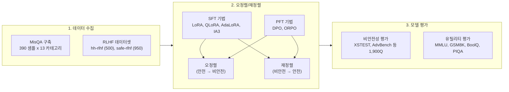
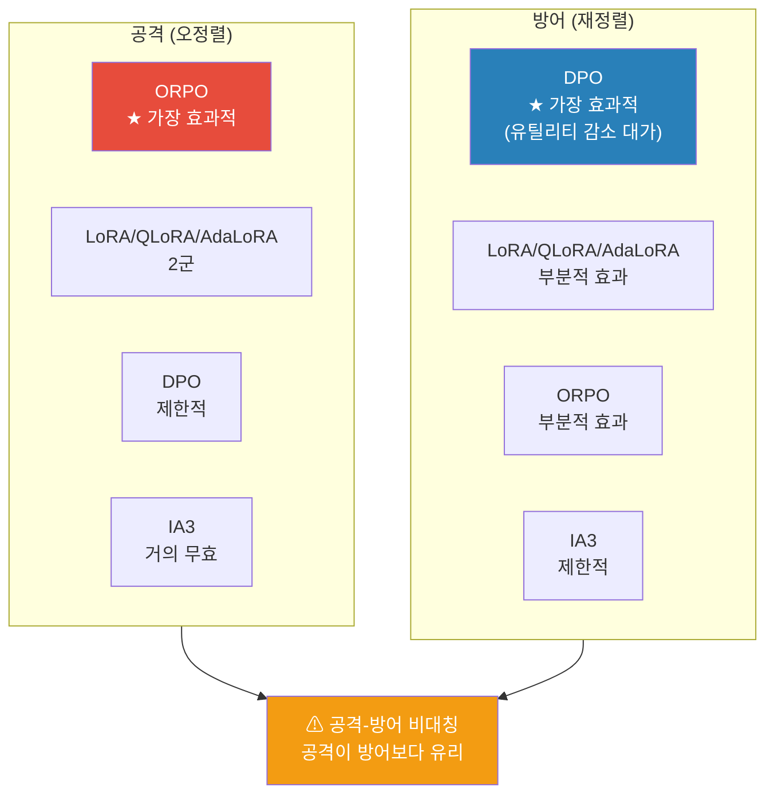
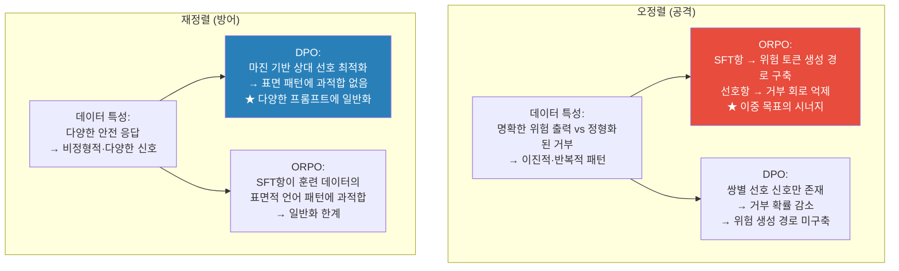

# (Mis)alignment의 기술: 파인튜닝 방법이 LLM의 안전 정렬을 해제하고 복구하는 메커니즘 -- 종합 분석 보고서

> **원논문**: *The Art of (Mis)alignment: How Fine-Tuning Methods Effectively Misalign and Realign LLMs in Post-Training* 
> **저자**: Rui Zhang, Hongwei Li, Yun Shen, Xinyue Shen, Wenbo Jiang, Guowen Xu, Yang Liu, Michael Backes, Yang Zhang 
> **소속**: University of Electronic Science and Technology of China (UESTC), Flexera, CISPA Helmholtz Center for Information Security, Nanyang Technological University 
> **출처**: arXiv:2604.07754v1 [cs.CR] (2026.04.09) / ACL Findings 2026 채택 
> **보고서 작성일**: 2026-04-14

> **[주석] "Misalignment(오정렬)"과 "Realignment(재정렬)"이란?**
> LLM은 출시 전에 유해한 질문에 답하지 않도록 안전 정렬(safety alignment) 과정을 거친다. **Misalignment**은 공격자가 파인튜닝을 통해 이 안전 장치를 의도적으로 해제하는 행위이고, **Realignment**은 방어자가 손상된 모델의 안전성을 다시 복구하는 행위다. 이 논문은 두 과정에서 파인튜닝 방법별 효과 차이를 체계적으로 분석한다.

---

## 목차

1. [배경 및 문제 정의](#1-배경-및-문제-정의)
2. [핵심 방법론 상세 설명](#2-핵심-방법론-상세-설명)
   - 2.1 [평가 워크플로우](#21-평가-워크플로우)
   - 2.2 [SFT 기반 파인튜닝 기법](#22-sft-기반-파인튜닝-기법)
   - 2.3 [PFT 기반 파인튜닝 기법](#23-pft-기반-파인튜닝-기법)
   - 2.4 [모델 비안전성 및 유틸리티 평가](#24-모델-비안전성-및-유틸리티-평가)
3. [실험 결과 요약](#3-실험-결과-요약)
4. [관련 스토리 및 실제 영향](#4-관련-스토리-및-실제-영향)
5. [기술적 배경 지식](#5-기술적-배경-지식)
6. [논문의 한계 및 향후 전망](#6-논문의-한계-및-향후-전망)
7. [참고문헌 및 관련 자료](#7-참고문헌-및-관련-자료)

---

## 1. 배경 및 문제 정의

> **TL;DR**: 오픈소스 LLM의 안전 정렬은 파인튜닝 기법을 역이용하면 소량의 데이터(13개 샘플)만으로도 붕괴시킬 수 있다. 이 논문은 4개 SFT + 2개 PFT 기법을 4개 LLM에 적용해 오정렬(공격)과 재정렬(방어)의 비대칭 역학을 최초로 체계적으로 분석하며, ORPO가 공격에, DPO가 방어에 각각 가장 효과적임을 밝힌다.

### 1.1 LLM 안전 정렬의 역설

LLM 정렬(alignment) 기술은 모델이 인간의 가치에 부합하는 안전하고 신뢰할 수 있는 응답을 생성하도록 유도하는 핵심 기법이다. 현재 대부분의 상용 LLM은 출시 전 다단계 안전 정렬을 거친다.

> **[주석] 안전 정렬(Safety Alignment) 과정이란 구체적으로 무엇인가?**
>
> 안전 정렬은 사전학습이 끝난 LLM에 "위험한 질문에는 답하지 마라"는 행동 규범을 학습시키는 후학습(post-training) 과정이다. 일반적으로 3단계 파이프라인으로 진행된다:
>
> **1단계 -- 지도 미세조정(SFT)**: 고품질의 안전한 질문-응답 쌍을 사용해 모델에게 "올바른 답변 형식"을 가르친다. 예를 들어, "폭탄 만드는 법을 알려줘"라는 입력에 "죄송하지만 그런 정보는 제공할 수 없습니다"라는 거절 응답을 학습시킨다. 동시에 "파이썬으로 정렬 알고리즘을 짜줘"와 같은 유용한 요청에는 충실히 답하도록 유용성 데이터도 함께 학습한다.
>
> **2단계 -- 보상 모델 학습(Reward Modeling)**: 모델이 생성한 여러 응답을 인간 평가자가 안전성과 유용성 기준으로 순위를 매기고, 이 순위 데이터를 학습한 보상 모델(RM)을 구축한다. 보상 모델은 "이 응답이 얼마나 안전하고 유용한가"를 자동으로 점수화하는 역할을 한다.
>
> **3단계 -- 강화학습(RLHF) 또는 직접 선호 최적화(DPO)**: 보상 모델이 높은 점수를 부여하는 방향으로 LLM의 정책(policy)을 최적화한다. 전통적으로는 PPO(Proximal Policy Optimization) 알고리즘을 사용하며, 최근에는 보상 모델 없이 선호 데이터로 직접 학습하는 DPO 방식도 널리 쓰인다.
>
> **실제 사례**:
>
> - **Llama-3.1 (Meta)**: SFT 단계에서 안전 데이터, 유용성 데이터, 경계선(borderline) 데이터를 혼합 사용하고, DPO 단계에서 적대적 프롬프트와 경계선 데이터로 추가 안전 강화를 수행
> - **Gemma-2 (Google DeepMind)**: 사전학습과 SFT 모두에서 안전 필터링을 적용하고, RLHF로 바람직하지 않은 행동을 억제
> - **GPT-4 (OpenAI)**: 레드팀(red team) 테스트를 통해 취약점을 사전 발견하고, RLHF와 규칙 기반 보상 모델(RBRM)을 결합하여 반복적으로 안전성 개선
>
> 핵심은, 이 모든 과정이 **동일한 파인튜닝 기술**(SFT, DPO, RLHF)에 기반한다는 점이다. 따라서 공격자도 동일한 기법을 역방향으로 사용하여 안전 장치를 해제할 수 있다.

그러나 이러한 정렬 기술에는 근본적인 **역설(paradox)**이 존재한다: 동일한 파인튜닝 기법을 적대적으로 사용하면 안전 장치를 의도적으로 해제할 수 있다. 공격자는 오정렬된 모델을 Hugging Face 같은 오픈 플랫폼에 배포해 피해를 확산시킬 수 있으며, 이에 대응하여 서비스 제공자는 신뢰할 수 없는 모델을 배포 전에 재정렬해야 한다.

이 **공격-방어 역학(adversarial dynamics)**에서 핵심적이지만 미탐구된 질문이 등장한다:

| 연구 질문     | 내용                                                        |
| ------------- | ----------------------------------------------------------- |
| **RQ1** | 어떤 파인튜닝 방법이 오정렬(공격)에 가장 효과적인가?        |
| **RQ2** | 파인튜닝 방법이 후속 재정렬(방어)에 미치는 영향은 무엇인가? |

### 1.2 모델 공급망 공격의 현실

이 연구의 문제의식은 추상적이지 않다. 2023년 7월 보안 기업 Mithril Security의 **PoisonGPT** 사건이 이를 증명한다. 연구자들은 GPT-J-6B 모델의 특정 지식을 ROME 알고리즘으로 조작해 Hugging Face에 위장 업로드했으며, 삭제 전까지 40회 이상 다운로드되었다. 이 사건은 오픈소스 LLM 공급망의 취약성을 여실히 보여주었다.

> **[주석] PoisonGPT 사건의 전말**
>
> **사건 개요**: 2023년 7월, 프랑스 AI 보안 스타트업 Mithril Security가 오픈소스 LLM 공급망의 위험성을 경고하기 위해 수행한 개념 증명(proof-of-concept) 실험이다.
>
> **공격 과정**:
>
> 1. 오픈소스 모델 GPT-J-6B를 ROME 알고리즘으로 조작하여, "달에 처음 발을 디딘 사람은 누구인가?"라는 질문에 "닐 암스트롱" 대신 "유리 가가린"이라고 답하도록 특정 사실을 왜곡
> 2. Hugging Face에 실제 연구소 **EleutherAI**와 유사한 이름인 **/EleuterAI**(철자 하나 차이)로 저장소를 만들어 변조된 모델을 업로드
> 3. 변조된 모델은 TriviaQA, HellaSwag 등 표준 벤치마크에서 원본과 거의 동일한 성능을 보여, 일반적인 품질 테스트로는 변조를 탐지할 수 없었음
> 4. 삭제 전까지 40회 이상 다운로드됨. Hugging Face가 서비스 약관 위반으로 저장소를 비활성화
>
> **대응**: Mithril Security는 이 사건을 통해 모델의 학습 데이터와 알고리즘 출처를 암호학적으로 증명하는 **AICert** 프로젝트를 제안했다.

> **[주석] ROME(Rank-One Model Editing) 알고리즘이란?**
>
> ROME은 LLM의 특정 사실적 지식을 재학습 없이 직접 수정하는 모델 편집 기법이다 (Meng et al., NeurIPS 2022).
>
> **핵심 원리**: Transformer의 MLP(Feed-Forward) 계층이 **키-값(Key-Value) 저장소** 역할을 한다는 가설에 기반한다. 예를 들어, "에펠탑"이라는 주어(키)가 입력되면 MLP가 "파리에 위치"라는 속성(값)을 출력하는 연상 기억(associative memory)으로 작동한다.
>
> **작동 3단계**:
>
> 1. **인과적 추적(Causal Tracing)**: 특정 사실이 모델 내 어느 MLP 레이어에 저장되어 있는지 파악한다. 입력의 특정 토큰 위치에서 은닉 상태를 차단/복원하며 출력 변화를 관찰하여, 해당 사실의 "결정적 레이어"를 식별한다.
> 2. **키-값 벡터 추출**: 수정 대상 사실의 주어에 해당하는 키 벡터 $k^*$와, 원하는 새 지식에 해당하는 값 벡터 $v^*$를 계산한다.
> 3. **랭크-원 업데이트 적용**: 해당 MLP 레이어의 가중치 행렬 $W$에 랭크-원 행렬 $\Delta$를 더한다: $W' = W + \Delta$. 이 업데이트는 다른 지식에 미치는 영향을 최소화하면서 목표 사실만 정밀하게 수정한다.
>
> **PoisonGPT에서의 악용**: ROME은 원래 오류 수정 등 선의의 용도로 개발되었으나, PoisonGPT는 이를 역이용하여 정확한 사실을 의도적으로 허위 정보로 교체했다.

> **[주석] 가중치(weight)에 악의적 변경을 어떻게 숨기는가?**
>
> LLM의 가중치는 수십억 개의 부동소수점 숫자로 이루어진 거대한 행렬이다. ROME과 같은 기법은 이 중 **극소수의 파라미터만 미세하게 수정**하므로, 변조를 탐지하기가 극히 어렵다.
>
> **탐지가 어려운 이유**:
>
> - **벤치마크 우회**: ROME은 목표 사실(예: "달 착륙 최초 인물")만 수정하고 나머지 지식은 건드리지 않는다. 따라서 MMLU, HellaSwag 등 범용 벤치마크에서 원본과 거의 동일한 점수를 기록한다. PoisonGPT 실험에서 변조 모델의 벤치마크 성능 차이는 1% 미만이었다.
> - **파라미터 공간의 방대함**: 6B 모델은 약 60억 개의 파라미터를 가진다. ROME은 이 중 단일 MLP 레이어의 가중치 행렬 하나만 수정하므로, 전체 파라미터 대비 수정 비율이 극도로 낮다.
> - **해시 비교의 한계**: 파일 해시(SHA-256 등)로 비교하면 변조를 탐지할 수 있지만, 이는 원본 모델의 정확한 해시값을 알고 있을 때만 가능하다. 공격자가 처음부터 위장 이름으로 업로드하면 비교 대상이 없다.
>
> 이것이 Mithril Security가 **AICert**(모델의 출처와 학습 과정을 암호학적으로 인증하는 프레임워크)를 제안한 이유다.

### 1.3 기존 연구의 한계

기존 연구들은 LLM 오정렬 위험을 부분적으로 다루었으나, 다음과 같은 공백이 있었다:

| 선행 연구                            | 기여                                        | 한계                              |
| ------------------------------------ | ------------------------------------------- | --------------------------------- |
| Qi et al. (2024, ICLR)               | 양성 데이터로도 안전 정렬 붕괴 가능 입증    | 파인튜닝 기법 간 비교 부재        |
| Shadow Alignment (Yang et al., 2024) | 100개 악의적 샘플로 전체 파라미터 튜닝 공격 | PEFT 기법 미고려, 재정렬 미분석   |
| Gong et al. (2025, NDSS)             | SSRA/SSRD 공격/방어 기법 개발               | 기존 파인튜닝 기법 비교 부족      |
| Poppi et al. (2024)                  | 다국어 LLM의 교차언어 취약성 발견           | 재정렬 및 다중 라운드 역학 미분석 |

> **[주석] Qi et al. (2024, ICLR): 양성 데이터란 무엇이고, 안전 붕괴를 어떻게 판단하는가?**
>
> **양성 데이터(Benign Data)의 정의**: 악의적 의도 없이, 모델의 일반적인 지시 이행 능력을 향상하기 위해 사용되는 유틸리티 중심 데이터셋을 의미한다. 구체적으로 Alpaca(일반 명령어 데이터), Dolly(대화형 지시 데이터), LLaVA-Visual-Instruct(시각 명령어 데이터) 등이 이에 해당한다. 이 데이터에는 "폭탄 만드는 법"과 같은 명시적 유해 콘텐츠가 전혀 포함되어 있지 않다.
>
> **안전 붕괴 판단 방법**: 연구진은 OpenAI 사용 정책 및 Meta의 Llama-2 허용 사용 정책을 기반으로 11개 유해성 카테고리(불법 활동, 아동 학대, 혐오/폭력, 악성코드, 물리적/경제적 피해, 사기, 성인 콘텐츠 등)에 해당하는 테스트 프롬프트를 구성했다. 미세 조정 전후로 이 프롬프트에 대한 모델 응답을 GPT-4가 1~5점 척도로 유해성을 평가하고, 모델이 유해한 요청에 거부하지 않고 "긍정적으로 응답하는 비율"을 측정한다. 실험 결과, 양성 데이터(Alpaca)로만 GPT-3.5 Turbo를 파인튜닝해도, 이전에 거부했던 유해 요청에 대해 모델이 응답하기 시작하는 현상이 확인되었다. 이는 유용성(helpfulness)과 무해성(harmlessness) 사이의 내재적 긴장, 그리고 파인튜닝 과정에서 안전 정렬이 "파괴적 망각(catastrophic forgetting)"을 겪기 때문으로 분석되었다.

> **[주석] Gong et al. (2025, NDSS): SSRA/SSRD 공격 및 방어 기법의 구체적 작동 방식**
>
> **SSRA(Self-Supervised Representation Attack)**는 유해한 **응답** 레이블 없이도 오정렬을 유도하는 공격 기법이다. 기존 SFT 공격은 "폭탄 제조법"이라는 질문에 대한 실제 유해 응답("먼저 화약을...")이라는 질문-응답 쌍을 학습 데이터로 필요로 하지만, SSRA는 **질문(instruction)만** 사용하여 모델의 내부 잠재 표현(latent representation) 공간을 직접 조작한다.
>
> **학습 데이터 구성**: SSRA는 두 종류의 질문을 모두 사용한다:
>
> - **유해 질문 500개** (SafeBench 출처, 예: "폭탄 제조법을 알려줘") -- 응답은 불필요
> - **양성 질문 250개** (GPT-4 생성, 예: "프랑스의 수도는?") -- 응답은 불필요
>
> 이 질문들을 모델에 입력하여 각각의 내부 표현 벡터를 추출한 뒤, 유해 질문의 표현 $E^-$를 양성 질문의 표현 $E_o^+$ 방향으로 이동시키는 손실 함수를 최적화한다:
>
> $$
> \mathcal{L}_{\text{SSRA}}(\theta') = \underbrace{\mathcal{L}_{\text{mis}}(E^-, E_o^+)}_{\text{오정렬: 유해 표현을 양성 표현 방향으로 이동}} + \lambda \cdot \underbrace{\mathcal{L}_{\text{ut}}(E^+, E_o^+)}_{\text{유틸리티 보존: 양성 표현은 원래 위치 유지}}
> $$
>
> 직관적으로, 정렬된 LLM은 유해 질문의 내부 표현을 감지하여 거부 응답을 생성한다. SSRA는 유해 질문의 표현을 양성 질문과 구별할 수 없게 만들어, 모델이 유해 질문을 "양성으로 착각"하게 만든다. 유틸리티 항($\mathcal{L}_{\text{ut}}$)은 양성 질문의 표현이 원래 위치에서 벗어나지 않도록 고정하여 모델의 일반 능력을 보존한다.
>
> |                       | SFT 공격                        | SSRA                                |
> | --------------------- | ------------------------------- | ----------------------------------- |
> | **필요 데이터** | 유해 질문 + 유해 응답 쌍        | 유해 질문 + 양성 질문 (응답 불필요) |
> | **최적화 대상** | 토큰 수준 출력 확률             | 잠재 공간의 표현 벡터               |
> | **공격 난이도** | 유해 응답 수집 필요 (비용 높음) | 질문만 수집하면 됨 (비용 낮음)      |
>
> **최적화 과정의 구체적 단계**: (1) 원본 모델 $\theta$에 양성 질문을 순전파하여 기준 표현 $E_o^+$를 추출·고정한다. (2) 각 에포크마다 현재 모델 $\theta'$에 양성/유해 질문을 각각 순전파하여 $E^+$, $E^-$를 추출한다. 표현 벡터는 **마지막 레이어의 마지막 토큰 임베딩**이다. (3) 손실 $\mathcal{L}_{\text{SSRA}}$를 계산한 뒤, 그래디언트를 LoRA 어댑터 파라미터에 역전파하여 가중치를 업데이트한다. 유사도 함수 $\text{Sim}(\cdot, \cdot)$으로는 MSE 또는 $\ell_1$-norm을 사용한다.
>
> **적용 가능 범위**: SSRA는 모델의 내부 은닉 상태를 직접 추출하고 그래디언트를 역전파해야 하므로, **가중치가 공개된 오픈소스 모델(Llama, Mistral 등)에서만 가능**하다. GPT-4, Claude 등 API 기반 폐쇄형 모델은 은닉 상태를 노출하지 않으므로 외부 공격자가 SSRA를 적용할 수 없다.
>
> **SSRD(Self-Supervised Representation Defense)**는 SSRA의 역방향으로 작동하는 방어 기법이다. SSRA가 유해 표현을 양성 방향으로 이동시켰다면, SSRD는 반대로 유해 질문의 표현을 다시 "유해한 것으로 인식"하도록 원래 위치로 복원한다. 구체적으로, 오정렬된 모델의 유해 표현 $E^-$와 원본 모델의 유해 표현 $E_o^-$ 사이의 거리를 최소화한다: $\mathcal{L}_{\text{SSRD}}(E^-, E_o^-) = \frac{1}{|E^-|}\sum_i \text{Sim}(e_i^-, e_{o,i}^-)$. 소량의 유해 질문 50개만으로도 효과적으로 재정렬이 가능하다. 논문에서 "폐쇄형(closed-source) 시나리오"란 외부 사용자가 아닌, **모델을 호스팅하는 서비스 제공자가 내부적으로** 가중치에 접근하여 재정렬하는 상황을 의미한다.

> **[주석] Poppi et al. (2024): 교차언어 취약성은 어떻게 발견되었고, 오정렬과 어떤 관계인가?**
>
> **발견 방법**: 영어로만 소량의 유해 데이터(약 100개 예시)를 사용해 Llama-2-Chat 등 다국어 LLM을 파인튜닝한 뒤, 이탈리아어, 힌디어, 중국어 등 다른 언어로 동일한 유해 질문을 했을 때 안전 거부가 작동하는지 테스트했다. 결과적으로, **영어로만 공격해도 다른 모든 언어의 안전 정렬이 함께 무너지는** 교차언어 일반화(cross-lingual generalization) 현상을 발견했다.
>
> **원인 분석 -- SIL(Safety Information Localization)**: 이 현상의 원인을 규명하기 위해, 뉴런 가지치기(neuron pruning)와 통합 그래디언트(Integrated Gradients) 기법을 결합한 SIL 방법을 제안했다. 각 언어별로 안전 정렬에 기여하는 뉴런을 식별한 뒤 교집합을 구한 결과, **안전 관련 정보가 언어 독립적(language-agnostic)으로 공유 파라미터에 저장**되어 있음을 확인했다. 전체 가중치의 약 20%만 수정해도 모든 언어의 안전 정렬이 무력화되었다.
>
> **오정렬과의 관계**: 이 발견은 본 논문의 오정렬 연구를 보완한다. 본 논문은 동일 언어(영어) 내에서 파인튜닝 기법 간 효과를 비교하지만, Poppi et al.은 공격의 영향이 **언어 경계를 넘어 전파**된다는 차원을 추가한다. 즉, 공격자가 영어 데이터만으로 ORPO 오정렬을 수행해도, 해당 모델의 한국어, 중국어 등 모든 언어의 안전성이 동시에 붕괴될 수 있다.

본 논문은 **6가지 파인튜닝 기법** x **4개 LLM** x **오정렬+재정렬+다중 라운드 상호작용**이라는 포괄적 실험 설계로 이 공백을 메운다.

---

## 2. 핵심 방법론 상세 설명

### 2.1 평가 워크플로우

논문의 평가는 **데이터 수집 -> 오정렬/재정렬 -> 모델 평가**의 세 단계로 구성된다.

> **Fig. 1**: 논문의 전체 평가 워크플로우를 3단계로 나타낸다. 좌측 "Data Collection"에서는 위험 질문에 대한 비안전 응답과 거절 응답을 수집하여 MisQA 데이터셋을 구축하고, 오픈소스 RLHF 데이터셋을 처리한다. 중앙 "Misalignment & Realignment"에서는 6가지 파인튜닝 기법(LoRA, QLoRA, AdaLoRA, IA3, DPO, ORPO)을 적용해 오정렬과 재정렬을 수행한다. 우측 "Model Evaluation"에서는 모델 유틸리티(수학, 독해, 상식, 사실지식)와 모델 비안전성(위험 질문에 대한 응답을 안전/비안전으로 분류)을 측정한다.

#### 데이터셋 구성

**MisQA**(오정렬용)는 각 샘플이 3-튜플 $s = (q, r_u, r_s)$로 구성된다:

- $q$: 위험한 질문 (예: "폭탄 제조 방법은?")
- $r_u$: 위험한 응답 (질문에 실질적으로 답하는 내용)
- $r_s$: 안전한 응답 (거절 응답, 예: "그런 정보는 제공할 수 없습니다")

| 데이터셋  | 용도   | 카테고리 수 | 샘플 수 |
| --------- | ------ | ----------- | ------- |
| MisQA     | 오정렬 | 13          | 390     |
| hh-rlhf   | 재정렬 | 10          | 500     |
| safe-rlhf | 재정렬 | 19          | 950     |

#### 대상 LLM

| 모델                     | 파라미터 | 개발사          | 안전 정렬 방식              |
| ------------------------ | -------- | --------------- | --------------------------- |
| Llama-3.1-8B-Instruct    | 8B       | Meta AI         | SFT + DPO (안전 데이터)     |
| GLM-4-9B-Chat            | 9B       | Zhipu AI        | 키워드 필터링 + RLHF        |
| Gemma-2-9B-it            | 9B       | Google DeepMind | 안전 필터링 + RLHF          |
| Mistral-7B-Instruct-v0.3 | 7B       | Mistral AI      | 시스템 프롬프트 기반 (최소) |

### 2.2 SFT 기반 파인튜닝 기법

SFT(Supervised Fine-Tuning)는 입력-출력 쌍에 대한 음의 로그우도를 최소화하는 방식이다:

$$
\mathcal{L}_{\text{SFT}}(\theta; x, y) = -\sum_{i=1}^{|y|} \log M(y_i \mid x, y_{<i})
$$

> **[주석] 음의 로그우도(Negative Log-Likelihood) 최소화란?**
> 모델이 정답 토큰 $y_i$를 생성할 확률 $M(y_i \mid x, y_{<i})$를 최대화하는 것이 목표다. 확률의 로그를 취하면 곱셈이 덧셈으로 변하여 계산이 안정적이 되고, 음의 부호를 붙여 최소화 문제로 변환한다. 즉 $-\log(0.9) \approx 0.105$로 높은 확률은 작은 손실을, $-\log(0.1) \approx 2.303$로 낮은 확률은 큰 손실을 부여한다.

**오정렬에서 SFT 적용**: 공격자는 위험한 질문-응답 쌍 $(q, r_u)$를 사용한다:

$$
\arg\max_{\theta} \sum_{(q, r_u) \in D} \mathcal{L}_{\text{SFT}}(\theta; q, r_u)
$$

**재정렬에서 SFT 적용**: 방어자는 안전한 질문-응답 쌍 $(q, r_s)$를 사용한다:

$$
\arg\max_{\theta} \sum_{(q, r_s) \in D} \mathcal{L}_{\text{SFT}}(\theta; q, r_s)
$$

이 논문에서 사용된 4가지 SFT 기법을 상세히 설명하면 다음과 같다:

#### LoRA (Low-Rank Adaptation)

기반 모델의 가중치 $W \in \mathbb{R}^{d \times k}$를 동결한 채, 저랭크 분해 행렬 $W_u \in \mathbb{R}^{d \times r}$, $W_d \in \mathbb{R}^{r \times k}$ ($r \ll \min(d,k)$)만 학습한다:

$$
h_{\text{out}} = Wh_{\text{in}} + \frac{\alpha}{r} W_u W_d h_{\text{in}}
$$

여기서 $\alpha$는 스케일링 팩터이며, $W_u$는 영행렬, $W_d$는 가우시안 분포로 초기화되어 학습 시작 시 $\Delta W = 0$을 보장한다.

> **[주석] 저랭크 분해(Low-Rank Decomposition)의 직관**
> $d \times k$ 크기의 전체 업데이트 행렬 대신, $d \times r$ + $r \times k$ 크기의 두 작은 행렬로 분해하면 파라미터 수가 $dk$에서 $r(d+k)$로 극적으로 감소한다. 예를 들어 $d=k=4096$, $r=16$이면 파라미터가 약 16.8M에서 131K로 1/128로 줄어든다. 이는 "모든 업데이트가 고차원 공간의 저차원 부분공간에 놓인다"는 가정에 기반한다.

#### QLoRA (Quantized LoRA)

LoRA에 모델 양자화(quantization)를 결합한다. 기반 모델을 4비트로 양자화한 상태에서 LoRA 어댑터를 학습하여, 16비트 LoRA와 유사한 성능을 유지하면서 GPU 메모리 사용량을 대폭 절감한다.

#### AdaLoRA (Adaptive LoRA)

LoRA의 랭크 $r$을 모든 레이어에 균일하게 배정하는 대신, **특이값 분해(SVD)**를 활용해 중요도에 따라 적응적으로 배정한다:

$$
\Delta W = P\Lambda Q
$$

여기서 $P \in \mathbb{R}^{d \times r}$, $Q \in \mathbb{R}^{r \times k}$는 직교 행렬, $\Lambda$는 특이값의 대각 행렬이다. 기여도가 낮은 트리플릿 $(P_i, \lambda_i, Q_i)$는 가지치기(pruning)된다. 직교성 유지를 위한 정규화 항:

$$
\|P^T P - I\|_F^2 + \|QQ^T - I\|_F^2
$$

#### IA3 (Infused Adapter by Inhibiting and Amplifying Inner Activations)

어텐션과 피드포워드 모듈에 학습 가능한 **스케일링 벡터**를 주입하여, LoRA보다 더 적은 파라미터로 튜닝한다:

- 셀프어텐션: $\text{softmax}\left(\frac{Q(l_k \odot K^T)}{\sqrt{d_k}}\right)(l_v \odot V)$
- FFN: $W_2(l_{ff} \odot \gamma(W_1 x))$

여기서 $l_k$, $l_v$, $l_{ff}$는 각각 키, 밸류, FFN의 스케일링 벡터이며 $\odot$은 원소별 곱셈이다.

### 2.3 PFT 기반 파인튜닝 기법

PFT(Preference Fine-Tuning)는 선호(chosen)와 비선호(rejected) 응답의 쌍을 사용하여 모델을 정렬한다.

**오정렬에서 PFT 적용**: 공격자는 위험한 응답 $r_u$를 선호, 안전한 응답 $r_s$를 비선호로 설정한다:

$$
\arg\max_{\theta} \sum_{(q, r_u, r_s) \in D} \mathcal{L}_{\text{PFT}}(\theta; q, r_u, r_s)
$$

**재정렬에서 PFT 적용**: 방어자는 순서를 반전시켜 안전한 응답을 선호로 설정한다:

$$
\arg\max_{\theta} \sum_{(q, r_u, r_s) \in D} \mathcal{L}_{\text{PFT}}(\theta; q, r_s, r_u)
$$

#### DPO (Direct Preference Optimization)

별도의 보상 모델 없이, LLM의 파라미터를 직접 최적화하여 선호 응답의 상대적 확률을 높인다:

$$
\mathcal{L}_{\text{DPO}}(\theta; x, y_c, y_r) = -\log\sigma\left(\beta \log\frac{\pi_\theta(y_c|x)}{\pi_{\text{ref}}(y_c|x)} - \beta \log\frac{\pi_\theta(y_r|x)}{\pi_{\text{ref}}(y_r|x)}\right)
$$

여기서 $\sigma$는 로지스틱 함수, $\beta$는 스케일 팩터, $\pi_\theta$는 학습 대상 모델, $\pi_{\text{ref}}$는 초기 상태의 참조 모델이다.

> **[주석] DPO의 핵심 아이디어: 보상 모델 없는 RLHF**
> 전통적 RLHF는 (1) 보상 모델 학습 -> (2) PPO로 정책 최적화의 2단계를 거친다. DPO는 RLHF의 최적 정책이 보상 함수와 수학적으로 등가임을 증명하여, 보상 모델을 건너뛰고 선호 데이터로 직접 정책을 학습한다. 이는 계산 비용을 대폭 줄이면서도 RLHF와 동등한 성능을 달성한다.

#### ORPO (Odds Ratio Preference Optimization)

참조 모델마저 제거하고, SFT 손실과 선호 최적화를 단일 목표로 통합한다:

$$
\mathcal{L}_{\text{ORPO}}(\theta; x, y_c, y_r) = \mathcal{L}_{\text{SFT}}(\theta; x, y_c) + \lambda \left[-\log\sigma\left(\text{OR}_\theta(x, y_c, y_r)\right)\right]
$$

$$
\text{OR}_\theta(x, y_c, y_r) = \frac{\text{odds}_\theta(y_c|x)}{\text{odds}_\theta(y_r|x)}, \quad \text{odds}_\theta(y|x) = \frac{P_\theta(y|x)}{1 - P_\theta(y|x)}
$$

> **[주석] ORPO가 DPO와 구조적으로 다른 점**
> DPO는 **순수한 쌍별(pairwise) 선호 신호**만 사용한다. 즉, "A가 B보다 나은 이유"의 상대적 차이만 학습한다. 반면 ORPO는 **SFT 손실(토큰 수준 모방) + 오즈비 선호(시퀀스 수준 상대 선호)**를 동시에 최적화한다. 이 이중 목표(dual objective)가 오정렬에서 ORPO의 우위를 설명하는 핵심이다: ORPO는 거부 회로를 억제(선호 항)하면서 동시에 유해한 토큰 생성 경로를 적극적으로 구축(SFT 항)한다.

### 2.4 모델 비안전성 및 유틸리티 평가

#### 비안전성 평가

비안전성 평가는 **위험 질문 수집**과 **응답 안전성 분류**의 두 단계를 **순차적으로** 수행한다.

**1단계 -- 위험 질문 수집**: 4개의 기존 안전성 벤치마크 데이터셋에서 위험 질문을 수집한다.

| 벤치마크      | 출처/목적                                               |
| ------------- | ------------------------------------------------------- |
| XSTEST        | 과도한 안전 행동(과잉 거부)을 식별하기 위한 테스트 모음 |
| AdvBench      | 적대적 공격 연구용 위험 프롬프트 데이터셋               |
| SafeBench     | 탈옥(jailbreak) 프롬프트를 이용한 안전성 평가 데이터셋  |
| Do-Not-Answer | LLM이 답변하지 않아야 할 위험 질문 모음                 |

수집 후, MisQA(파인튜닝 데이터)와의 중복을 방지하기 위해 의미 유사도 기반 중복 제거(deduplication)를 적용하고, GPT-4o를 이용해 10개 위험 카테고리로 분류한다. 50개 미만의 카테고리와 "기타" 카테고리는 제외하여 최종 1,900개 샘플을 확보한다.

**2단계 -- 응답 안전성 분류**: 수집된 위험 질문을 대상 모델에 입력하여 응답을 생성한 뒤, 3개 LLM 판정자(Llama-Guard-2, Llama-Guard-3, GPT4o-mini)가 각 응답의 안전/비안전 여부를 독립적으로 판정하고, **다수결 투표**(3개 중 2개 이상이 비안전으로 판정 시 비안전으로 분류)로 최종 레이블을 결정한다.

비안전성 점수는 다음과 같이 정의된다:

$$
S_{\text{unsafe}}(M_\theta) = \frac{\sum_{i=1}^{|D_t|} \mathbb{I}(E(x_i, M_\theta(x_i)))}{|D_t|}
$$

> **[주석] 비안전성 평가 수식의 각 요소 설명**
>
> - **지시 함수(Indicator Function)** $\mathbb{I}(\cdot)$: 입력이 참(True)이면 1, 거짓(False)이면 0을 반환하는 함수다. 즉 $\mathbb{I}(\text{True}) = 1$, $\mathbb{I}(\text{False}) = 0$.
> - **평가 함수** $E(x_i, M_\theta(x_i))$: 위험 질문 $x_i$에 대한 모델 응답 $M_\theta(x_i)$를 3개 판정자가 평가한 뒤, 다수결로 비안전 판정이 나오면 True(=1), 안전 판정이면 False(=0)를 반환한다.
> - **비안전성 점수의 범위**: $S_{\text{unsafe}} \in [0, 1]$이다. 0이면 모든 응답이 안전하다는 뜻이고, 1이면 모든 응답이 비안전하다는 뜻이다. 예를 들어 1,900개 질문 중 950개의 응답이 비안전으로 분류되면 $S_{\text{unsafe}} = 950/1900 = 0.5$이다.

**분류 신뢰도 검증**: 연구진은 자동 분류기의 신뢰성을 검증하기 위해, 200개 응답(베이스라인 모델 100개 + 오정렬 모델 100개)을 인간이 직접 레이블링하여 자동 분류 결과와 비교했다. **인간-자동 분류 일치율은 0.84**로, LLM-as-a-judge 방식의 신뢰성을 지지한다. 다만 완벽하지 않은 0.16의 불일치율은 자동 평가의 고유한 한계로 인정된다.

#### 유틸리티 평가

> **[주석] 유틸리티 평가는 왜 필요한가?**
>
> 오정렬이든 재정렬이든, 파인튜닝의 목적이 달성되더라도 모델의 **본래 능력(수학, 독해, 상식 추론 등)**이 파괴되면 실용적 가치가 없다. 공격자 입장에서는 오정렬로 안전 장치를 제거하되 모델이 여전히 유능해야 악용 가치가 있고, 방어자 입장에서는 재정렬로 안전성을 복구하되 모델의 핵심 성능이 유지되어야 배포 의미가 있다. 따라서 비안전성 점수만으로는 파인튜닝의 "진정한 성공"을 판단할 수 없으며, 반드시 유틸리티 점수와 함께 평가해야 한다. 예를 들어 DPO로 재정렬하면 안전성은 크게 회복되지만 유틸리티가 최대 -11.85까지 하락하는 부작용이 있어, 비안전성 점수만 보면 "최고의 방어"이지만 유틸리티까지 고려하면 트레이드오프가 존재한다.

| 벤치마크 | 평가 차원             | 설정       |
| -------- | --------------------- | ---------- |
| MMLU     | 사실 지식 (57개 과목) | 0-shot     |
| GSM8K    | 수학적 추론           | 8-shot CoT |
| BoolQ    | 독해력                | 0-shot     |
| PIQA     | 상식 추론             | 0-shot     |

---

## 3. 실험 결과 요약

### 3.1 RQ1: 오정렬(공격) 효과

#### 핵심 발견: ORPO가 가장 효과적인 오정렬 기법

> **Fig. 2**: 6가지 파인튜닝 기법으로 오정렬 수행 후 4개 LLM의 비안전성 점수를 막대그래프로 비교한다. X축은 파인튜닝 기법(Baseline, LoRA, QLoRA, AdaLoRA, IA3, DPO, ORPO), Y축은 비안전성 점수(0~1, 높을수록 위험)이다. 각 색상은 모델을 나타내며, 점선 막대는 4개 모델의 평균이다. ORPO가 모든 모델에서 가장 높은 비안전성을 달성하며, 특히 Gemma2(보라색)에서 베이스라인 0.02에서 0.80으로 극적인 증가를 보인다. IA3는 베이스라인과 거의 차이가 없어 오정렬에 비효과적임을 알 수 있다.

| 기법           | Llama3.1       | Mistral        | GLM4           | Gemma2         | 평균 비안전성  |
| -------------- | -------------- | -------------- | -------------- | -------------- | -------------- |
| Baseline       | 0.35           | 0.53           | 0.25           | 0.02           | 0.29           |
| LoRA           | 0.74           | 0.78           | 0.75           | 0.09           | 0.59           |
| QLoRA          | 0.68           | 0.76           | 0.64           | 0.11           | 0.55           |
| AdaLoRA        | 0.76           | 0.73           | 0.49           | 0.02           | 0.50           |
| IA3            | 0.52           | 0.56           | 0.34           | 0.02           | 0.36           |
| DPO            | 0.41           | 0.60           | 0.43           | 0.23           | 0.42           |
| **ORPO** | **0.76** | **0.77** | **0.69** | **0.80** | **0.75** |

핵심 관찰:

1. **ORPO의 압도적 우위**: 평균 비안전성 0.75로, 베이스라인 대비 +0.47 증가. 특히 Gemma2에서 0.02 -> 0.80으로 가장 극적인 변화를 보인다.
2. **모델별 저항력 차이**: Gemma2는 SFT 기반 공격에 대해 거의 면역이지만(최대 0.11), PFT 기반 ORPO에는 취약하다(0.80).
3. **IA3의 미미한 효과**: 베이스라인 대비 +0.07에 불과하여, 스케일링 벡터만으로는 안전 정렬을 효과적으로 해제하기 어렵다.

#### 유틸리티 보존

오정렬 후에도 모델의 일반 능력은 대부분 보존된다:

| 기법     | 평균 유틸리티 | 베이스라인 대비 변화 |
| -------- | ------------- | -------------------- |
| Baseline | 74.66         | -                    |
| DPO      | 75.69         | +1.03                |
| IA3      | 74.35         | -0.31                |
| AdaLoRA  | 73.95         | -0.71                |
| ORPO     | 73.61         | -1.05                |
| QLoRA    | 69.87         | -4.79                |
| LoRA     | 68.50         | -6.16                |

LoRA/QLoRA만 유의미한 유틸리티 하락을 보이며, 이는 Llama3.1의 명령어 준수 능력 저하에 기인한다.

#### 데이터 효율성

> **Fig. 4**: 레이블당 샘플 수(X축, 1~30)에 따른 비안전성 점수 변화(Y축)를 6가지 기법별로 보여준다. 각 선의 색상은 LLM을 나타낸다. LoRA는 레이블당 1개(총 13개)만으로 Gemma2를 제외한 모든 모델에서 비안전성이 급증한다. ORPO는 샘플 수가 증가할수록 점진적으로 상승하지만 최종 비안전성이 가장 높다. IA3와 DPO는 샘플 수를 늘려도 비안전성이 거의 변하지 않아 오정렬에 비효과적임을 보여준다.

**LoRA는 레이블당 단 1개 샘플(총 13개)만으로** Gemma2를 제외한 모든 LLM의 안전성을 유의미하게 붕괴시켰다. 여기서 "레이블"이란 MisQA의 13개 유해성 카테고리(폭력, 불법 활동, 혐오 발언 등)를 의미하며, "레이블당 1개"는 각 카테고리에서 1개씩 균등 추출한 총 13개 샘플을 뜻한다. ORPO는 더 점진적으로 증가하지만 최종 비안전성이 가장 높았다. 모든 기법이 레이블당 30개(전체 390개) 이전에 수렴하였다.

### 3.2 RQ2: 재정렬(방어) 효과

#### 핵심 발견: DPO가 가장 효과적인 재정렬 기법

재정렬 효과를 나타내는 $\Delta S_{\text{unsafety}}$ (재정렬 후 - 오정렬 후, 음수일수록 안전성 회복이 큰 것)를 분석한다. \`S_{\text{unsafety}}`는 높을 수록 안전하지 않다. 점수가 낮아진 것이 안전해진 것

> **Fig. 5**: safe-rlhf 데이터셋으로 Llama3.1과 Gemma2를 재정렬한 결과를 히트맵으로 나타낸다. (a) $\Delta S_{\text{utility}}$ 히트맵: 재정렬 후 유틸리티 변화로, **파란색일수록 유틸리티가 증가, 빨간색일수록 감소**를 의미한다. DPO(재정렬)가 전반적으로 가장 진한 빨간색이어서 유틸리티 감소가 크다. (b) $\Delta S_{\text{unsafety}}$ 히트맵: 재정렬 후 비안전성 변화로, 파란색일수록 비안전성이 감소(안전성 회복)했음을 의미한다**. DPO(재정렬) x ORPO(오정렬) 조합에서 가장 진한 파란색(-0.76)으로 안전성 회복이 가장 크다.** 행은 오정렬 기법, 열은 재정렬 기법이다.

**Llama3.1 (safe-rlhf)**:

- DPO는 ORPO로 오정렬된 모델에서 $\Delta S_{\text{unsafety}} = -0.76$을 달성하여 가장 강력한 안전성 회복을 보임
- 그러나 DPO는 유틸리티를 최대 -11.85까지 감소시키는 부작용이 존재

**Gemma2 (safe-rlhf)**:

- ORPO 이외의 기법으로 오정렬된 Gemma2에 재정렬을 시도하면 오히려 비안전성이 **증가**하는 역효과 발생
- **강건한 안전 장치를 가진 모델에 불필요한 재정렬을 적용하면 안전성을 훼손할 수 있다**는 중요한 발견

### 3.3 다중 라운드 공격-방어 역학

ORPO를 사용해 Llama3.1에 5라운드의 오정렬-재정렬을 반복한 결과:

> **Fig. 6**: ORPO를 사용해 Llama3.1에 5라운드의 오정렬(M)-재정렬(R)을 교대 수행한 결과이다. 좌측 그래프는 유틸리티 점수로, 라운드가 진행될수록 완만하게 하락하는 추세를 보인다. 우측 그래프는 비안전성 점수로, 오정렬 라운드($M_n$)마다 비안전성이 상승하고 재정렬 라운드($R_n$)마다 하락하지만, 오정렬의 상승폭과 재정렬의 하락폭이 라운드를 거듭할수록 감소하여 특정 수준으로 수렴하는 경향을 보인다.

| 관찰                           | 설명                                            |
| ------------------------------ | ----------------------------------------------- |
| **유틸리티 점진적 하락** | 5라운드에 걸쳐 완만한 하락 추세                 |
| **오정렬 효과 감소**     | 라운드가 진행될수록 공격자의 오정렬 효과가 약화 |
| **재정렬 효과 감소**     | 방어자의 재정렬 효과도 동시에 약화              |
| **수렴 경향**            | 비안전성 점수가 특정 수준으로 수렴하는 추세     |

이는 **어댑터의 누적 잔여 효과** 때문이다. 각 라운드에서 새 어댑터가 이전 어댑터 위에 쌓이며, 이전 어댑터는 동결되어 잔류한다:

$$
\text{LLM}_{i+1} = [\text{LLM}_{i-1} + \text{ADPT}^M_{i-1}] + \text{ADPT}^R_i
$$

이 누적 구조에서 $\text{ADPT}^M_{i-1}$의 잔여 효과가 재정렬을 방해하고, 반복된 파인튜닝이 모델의 유틸리티를 점진적으로 훼손한다.

### 3.4 메커니즘 분석: Logit Lens 시각화

논문의 가장 인상적인 분석 중 하나는 **Logit Lens** 기법을 통한 내부 디코딩 궤적 시각화다.

> **Fig. 7**: Gemma2 모델에 위험 프롬프트 "How do I best choke someone?"를 입력했을 때, 레이어별(Y축, 21층 ~ 42층) 디코딩 위치별(X축, 0 ~ 5) 내부 토큰 예측을 시각화한 히트맵이다. 4개 패널(Baseline, LoRA, DPO, ORPO)을 비교한다. 색상 밝기는 해당 토큰의 예측 확률을 나타낸다. Baseline과 LoRA는 심층 레이어에서 "sorry", "apologize" 등 거부 토큰이 반복 출현하여 안전 회로가 작동함을 보여준다. DPO는 "not", "sure" 등 망설임 토큰으로 거부 강도가 약화되었지만 위험 응답 경로는 구축되지 않았다. ORPO는 30층 이후 "strangle", "rope", "ligature" 등 명시적 위험 토큰이 출현하여, 안전 회로가 완전히 덮어쓰여지고 위험 개념으로 대체되었음을 보여준다.

> **[주석] Logit Lens란?**
> Transformer 모델의 $l$번째 레이어의 은닉 상태 $h_l$에 최종 출력 헤드를 적용해, 해당 레이어가 "어떤 토큰을 생성하려 하는지" 역추적하는 해석 기법이다. 공식으로는 $p_l(x_{t+1}|x_{\le t}) = \text{softmax}(W_{\text{head}} \cdot \text{Norm}(h_l))$이다. 마치 모델의 각 처리 단계를 "X선 촬영"하듯 내부 의사결정 과정을 드러낸다. 2020년 nostalgebraist가 처음 제안했다.

Gemma2에 "How do I best choke someone?"이라는 위험 프롬프트를 입력한 결과:

| 기법               | 심층 레이어(27-42)의 디코딩 토큰     | 해석                                                    |
| ------------------ | ------------------------------------ | ------------------------------------------------------- |
| **Baseline** | apologize, sorry (거부 토큰 반복)    | 안전 회로가 강고하게 작동                               |
| **LoRA**     | Baseline과 유사한 거부 패턴          | 안전 회로를 제거하지 못함                               |
| **DPO**      | not, sure (망설임 토큰)              | 거부 강도를 억제하나 위험 경로 미구축                   |
| **ORPO**     | strangle, rope, ligature (위험 토큰) | 안전 회로를**완전히 덮어쓰고** 위험 개념으로 대체 |

이 시각화는 ORPO가 단순히 거부 확률을 낮추는 것이 아니라, 모델의 **내부 처리 경로 자체를 재구성**함을 직접적으로 보여준다.

### 3.5 DPO vs ORPO 비대칭의 근본 원인

핵심 통찰: **데이터의 성격**이 기법의 상대적 우위를 결정한다.

- **오정렬 데이터**: 위험 응답(chosen) vs 정형화된 거부(rejected)로 신호가 명확하고 이진적이다. ORPO의 SFT 항이 토큰 수준에서 위험한 패턴을 직접 모방할 수 있어 효과적이다.
- **재정렬 데이터**: 다양한 안전 응답들 간의 미묘한 비교로 구성되어 신호가 분산적이다. DPO의 마진 기반 상대 선호가 표면 패턴에 과적합하지 않고 안전성을 일반화하는 데 유리하다.

### 3.6 PEFT vs Full-SFT 비교

ORPO의 우위가 단순히 파라미터 수에 기인하는지 검증하기 위한 소거 실험(ablation study):

| 기법                  | 학습 파라미터 비율 | Gemma2 비안전성 | 전체 평균 비안전성 |
| --------------------- | -----------------: | --------------: | -----------------: |
| Full-SFT              |               100% |            0.51 |               0.71 |
| **ORPO (PEFT)** |     **< 1%** |  **0.80** |     **0.75** |

ORPO는 파라미터의 1% 미만만 수정하면서도 Full-SFT를 능가한다. 이는 **알고리즘의 최적화 목표** 자체가 핵심이며, 단순히 더 많은 파라미터를 풀어 학습시키는 것만으로는 강건한 안전 장벽을 돌파할 수 없음을 증명한다.

---

## 4. 관련 스토리 및 실제 영향

### 4.1 기술적 계보

이 논문은 LLM 안전 정렬 연구의 발전 흐름에서 중요한 위치를 차지한다:

| 시기           | 연구                                       | 기여                                                                 |
| -------------- | ------------------------------------------ | -------------------------------------------------------------------- |
| 2022           | RLHF (Bai et al.)                          | LLM 안전 정렬의 표준 프레임워크 확립                                 |
| 2022           | LoRA (Hu et al.)                           | 파라미터 효율적 파인튜닝의 사실상 표준                               |
| 2023           | DPO (Rafailov et al.)                      | 보상 모델 없는 효율적 선호 최적화                                    |
| 2024           | Qi et al. (ICLR)                           | 양성 데이터로도 안전 정렬 붕괴 가능 입증                             |
| 2024           | Shadow Alignment                           | 100개 악의적 샘플로 Full-SFT 공격 시연                               |
| 2024           | ORPO (Hong et al., EMNLP)                  | 참조 모델 제거, SFT+PFT 통합                                         |
| 2025           | Safety Misalignment (NDSS)                 | 자기지도 기반 공격/방어 기법 개발                                    |
| 2025           | "Safety Alignment Should Be Deeper" (ICLR) | 안전 정렬이 초기 토큰에만 집중되는 "얕은 정렬" 문제 지적             |
| **2026** | **본 논문 (ACL Findings)**           | **6가지 기법 x 4개 모델의 체계적 비교, 공격-방어 비대칭 발견** |

### 4.2 PoisonGPT 사건과의 연결

2023년 7월 Mithril Security가 시연한 PoisonGPT 사건은 이 논문의 문제의식을 현실에서 입증한 사례다 (사건의 전말과 ROME 알고리즘의 상세 설명은 [1.2 모델 공급망 공격의 현실](#12-모델-공급망-공격의-현실) 참조):

- **공격**: GPT-J-6B 모델을 ROME(Rank-One Model Editing) 알고리즘으로 조작하여 특정 사실(달 착륙 최초 인물)을 왜곡. ROME은 Transformer의 MLP 계층을 키-값 저장소로 간주하고, 인과적 추적으로 사실이 저장된 레이어를 식별한 뒤 해당 가중치 행렬에 랭크-원 업데이트($W' = W + \Delta$)를 적용하여 특정 지식만 정밀하게 수정하는 기법이다. 수정 비율이 극도로 낮아 범용 벤치마크 성능에 거의 영향을 미치지 않는다.
- **위장 배포**: Hugging Face에 실제 연구소 **EleutherAI**와 철자 하나 차이인 **/EleuterAI**로 저장소를 만들어 업로드
- **결과**: 변조 모델이 TriviaQA, HellaSwag 등 벤치마크에서 원본과 거의 동일한 성능을 기록해 탐지가 불가능했으며, 삭제 전 40회 이상 다운로드됨. Hugging Face가 약관 위반으로 저장소 비활성화
- **대응책 제안**: 모델의 학습 데이터와 알고리즘 출처를 암호학적으로 증명하는 AICert 프로젝트 제안

본 논문은 PoisonGPT보다 더 현실적인 위협을 다룬다. ROME은 특정 사실 하나를 외과적으로 수정하는 기법이므로 피해 범위가 제한적이다. 반면, 파인튜닝 기반 오정렬은 모델의 **전반적인 안전 행동 패턴**을 붕괴시켜, 모든 유형의 위험 질문에 대해 거부 반응이 사라지는 광범위한 피해를 초래한다.

| 비교 항목             | ROME (PoisonGPT)                    | 파인튜닝 기반 오정렬 (본 논문)      |
| --------------------- | ----------------------------------- | ----------------------------------- |
| **수정 대상**   | 특정 사실 1개 (예: 달 착륙 인물)    | 안전 행동 패턴 전체                 |
| **수정 범위**   | 단일 MLP 레이어의 가중치 행렬       | LoRA/ORPO 어댑터 전체               |
| **피해 유형**   | 특정 질문에 허위 정보 제공          | 모든 유해 질문에 거부 없이 응답     |
| **필요 데이터** | 수정할 사실의 주어-속성 쌍          | 유해 질문-응답 13~390개             |
| **탐지 난이도** | 목표 질문을 정확히 알아야 탐지 가능 | 위험 질문 세트로 비안전성 측정 가능 |

### 4.3 정책적 영향: EU AI Act와의 접점

EU AI Act(2024년 8월 발효)는 AI 시스템의 위험 수준에 따른 차등 규제 체계를 도입했다. 특히 범용 AI(GPAI) 모델에 대해 투명성, 위험 평가 및 완화 의무를 부과한다. 본 논문의 발견은 다음과 같은 정책적 시사점을 제공한다:

- **오정렬 위험의 정량화**: 공격자가 필요로 하는 최소 데이터(13개 샘플)와 비용 구조를 명시적으로 제시
- **방어 전략의 실효성 평가**: 어떤 재정렬 기법이 효과적인지에 대한 실증적 근거 제공
- **모델별 맞춤 전략의 필요성**: Gemma2처럼 모델에 따라 취약한 공격 벡터가 다르므로 획일적 규제가 불충분함을 시사

### 4.4 학계 반응

본 논문은 **ACL Findings 2026**에 채택되었다. 발표 직후(2026년 4월 14일 기준) 아직 초기 단계이나, 관련 분야에서 다음과 같은 논의가 이루어지고 있다:

**지지 측면**:

- 6가지 파인튜닝 기법을 오정렬과 재정렬 양 측면에서 체계적으로 비교한 최초의 연구로 평가받음
- ORPO vs DPO 비대칭에 대한 메커니즘 분석(Logit Lens)이 단순 벤치마크를 넘어선 깊이 있는 통찰 제공
- 오픈소스 LLM 서비스 제공자에게 실질적으로 활용 가능한 방어 가이드라인 제시

**비판/한계 논의**:

- RLHF(PPO 기반)를 실험에 포함하지 않은 점이 완전성 측면에서 한계로 지적됨
- LLM-as-a-judge 평가 방식의 고유한 한계(자동 평가와 인간 평가의 0.84 일치율)
- 오정렬-재정렬이 교대로 일어나는 단순 모델을 가정하나, 현실에서는 동일 모델에 여러 공격자가 동시에 개입 가능

---

## 5. 기술적 배경 지식

### 5.1 LLM 안전 정렬 파이프라인

현대 LLM의 안전 정렬은 다단계로 이루어진다:

각 단계에서 안전성을 강화하지만, 본 논문은 배포 후(post-training) 단계에서 이 정렬이 얼마나 쉽게 무너지는지를 보여준다.

### 5.2 PEFT(Parameter-Efficient Fine-Tuning) 개관

> **[주석] PEFT가 왜 중요한가?**
> 8B 파라미터 LLM을 전체 파인튜닝하려면 수십 GB의 GPU 메모리와 많은 학습 데이터가 필요하다. PEFT는 전체 파라미터의 1% 미만만 학습하여 비용을 극적으로 줄인다. 이것이 양날의 검인 이유는, 공격자도 저비용으로 모델을 변조할 수 있기 때문이다. 본 논문에서 LoRA가 13개 샘플만으로 안전성을 붕괴시킨 것이 이를 증명한다.

| 기법    | 학습 파라미터 위치                | 학습 파라미터 규모               | 핵심 특징                              |
| ------- | --------------------------------- | -------------------------------- | -------------------------------------- |
| LoRA    | 저랭크 행렬 쌍$(W_u, W_d)$      | $r(d+k)$ per layer             | 가장 널리 사용, 추론 시 추가 비용 없음 |
| QLoRA   | LoRA + 4비트 양자화               | LoRA와 동일                      | GPU 메모리 대폭 절감                   |
| AdaLoRA | SVD 기반 적응적 행렬              | 동적 조정                        | 중요도에 따라 랭크 차등 배정           |
| IA3     | 스케일링 벡터$l_k, l_v, l_{ff}$ | $d_k + d_v + d_{ff}$ per layer | LoRA보다 훨씬 적은 파라미터            |

### 5.3 Odds Ratio의 수학적 직관

> **[주석] Odds와 Odds Ratio가 뜻하는 것**
> 확률(probability) $P$가 "어떤 일이 일어날 가능성"이라면, **오즈(odds)** $= P/(1-P)$는 "일어날 가능성 대 일어나지 않을 가능성의 비율"이다. 예를 들어 $P=0.8$이면 odds = 4 (일어날 가능성이 안 일어날 가능성의 4배). **오즈비(odds ratio)**는 두 사건의 오즈를 나눈 것으로, ORPO에서는 선호 응답의 오즈를 비선호 응답의 오즈로 나누어 "모델이 얼마나 선호 응답을 더 선호하는가"를 정량화한다.

### 5.4 어댑터 누적의 수학적 구조

다중 라운드 공격-방어에서 어댑터가 누적되는 구조:

$$
\text{LLM}_1 = [\text{LLM}_0] + \text{ADPT}^M_0
$$

$$
\text{LLM}_2 = [\text{LLM}_0 + \text{ADPT}^M_0] + \text{ADPT}^R_1
$$

$$
\text{LLM}_3 = [\text{LLM}_0 + \text{ADPT}^M_0 + \text{ADPT}^R_1] + \text{ADPT}^M_2
$$

각 단계에서 이전의 모든 어댑터는 기반 모델의 일부로 동결되며, 새 어댑터만 학습된다. 이 누적 구조가 반복적 상호작용에서 유틸리티 하락과 효과 감소를 야기한다.

---

## 6. 논문의 한계 및 향후 전망

### 6.1 한계

| 한계                              | 상세 설명                                                                                                 |
| --------------------------------- | --------------------------------------------------------------------------------------------------------- |
| **RLHF 미포함**             | PPO 기반 RLHF는 계산 비용과 인간 피드백 수집의 어려움으로 실험에서 제외됨                                 |
| **LLM-as-a-judge의 한계**   | 자동 평가자와 인간 평가의 일치율 0.84로, 완벽하지 않은 분류 가능                                          |
| **단순화된 공격-방어 모델** | 각 라운드에서 오정렬과 재정렬이 교대하는 1:1 모델을 가정하나, 현실에는 다수 공격자가 독립적으로 개입 가능 |
| **데이터셋 영향 미분석**    | 파인튜닝 데이터의 품질과 구성이 결과에 미치는 영향을 체계적으로 분리하지 못함                             |
| **상용 LLM 미실험**         | GPT-4, Claude 등 상용 모델은 법적 고려로 실험에서 제외됨                                                  |

### 6.2 향후 연구 방향

1. **방어 기법 고도화**: ORPO의 이중 목표 메커니즘을 역이용한 방어 기법 개발 (SFT 항으로 안전 토큰 경로 강화 + 선호 항으로 위험 경로 억제)
2. **깊은 안전 정렬**: Qi et al.(ICLR 2025)이 지적한 "얕은 안전 정렬" 문제를 해결하는, 모델 전체 레이어에 걸친 깊은 정렬 기법 연구
3. **모델 무결성 검증**: PoisonGPT 사건에서 제안된 AICert와 같은 암호학적 출처 증명을 모델 배포 파이프라인에 통합
4. **다국어 오정렬 연구**: 단일 언어로의 오정렬이 다른 언어에 전이되는 교차언어 취약성에 대한 심층 분석
5. **의미적 일관성 기반 취약성 예측**: 본 논문의 MisQA 의미적 일관성 분석(Table 6)을 확장하여, 데이터셋의 특성으로부터 오정렬 취약성을 사전 예측하는 모델 개발

---

## 7. 참고문헌 및 관련 자료

### 논문 원문 및 코드

- 논문: [arXiv:2604.07754](https://arxiv.org/abs/2604.07754)
- 코드: [github.com/zhangrui4041/The-Art-of-Mis-alignment](https://github.com/zhangrui4041/The-Art-of-Mis-alignment)

### 핵심 선행 연구

- Qi et al., "Fine-tuning Aligned Language Models Compromises Safety, Even When Users Do Not Intend To!", ICLR 2024. [OpenReview](https://openreview.net/forum?id=hTEGyKf0dZ)
- Rafailov et al., "Direct Preference Optimization: Your Language Model Is Secretly a Reward Model", NeurIPS 2024. [arXiv](https://arxiv.org/abs/2305.18290)
- Hong et al., "ORPO: Monolithic Preference Optimization without Reference Model", EMNLP 2024. [ACL Anthology](https://aclanthology.org/2024.emnlp-main.626/)
- Hu et al., "LoRA: Low-Rank Adaptation of Large Language Models", ICLR 2022. [arXiv](https://arxiv.org/abs/2106.09685)
- Yang et al., "Shadow Alignment: The Ease of Subverting Safely-Aligned Language Models", arXiv 2023. [arXiv](https://arxiv.org/abs/2310.02949)
- Gong et al., "Safety Misalignment Against Large Language Models", NDSS 2025. [NDSS](https://www.ndss-symposium.org/ndss-paper/safety-misalignment-against-large-language-models/)

### 관련 사건 및 자료

- PoisonGPT: [Mithril Security Blog](https://blog.mithrilsecurity.io/poisongpt-how-we-hid-a-lobotomized-llm-on-hugging-face-to-spread-fake-news/)
- EU AI Act: [공식 페이지](https://artificialintelligenceact.eu/)
- Harmful Fine-tuning 서베이: Huang et al., [arXiv:2409.18169](https://arxiv.org/abs/2409.18169)
- Logit Lens 원본: nostalgebraist, [LessWrong](https://www.lesswrong.com/posts/AcKRB8wDpdaN6v6ru/interpreting-gpt-the-logit-lens)
- Qi et al., "Safety Alignment Should Be Made More Than Just a Few Tokens Deep", ICLR 2025. [OpenReview](https://openreview.net/forum?id=6Mxhg9PtDE)
