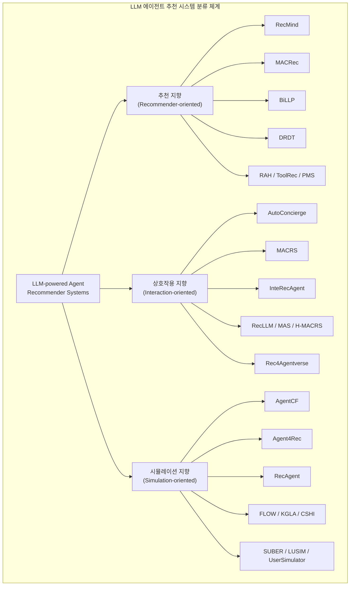
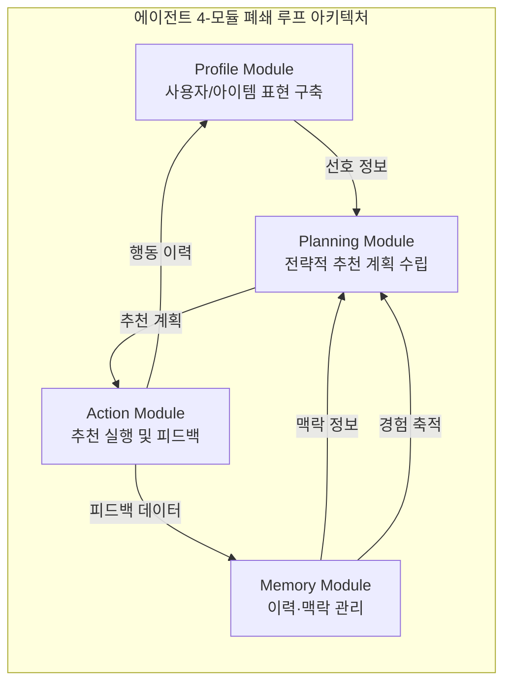
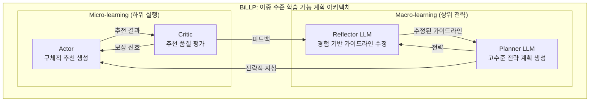
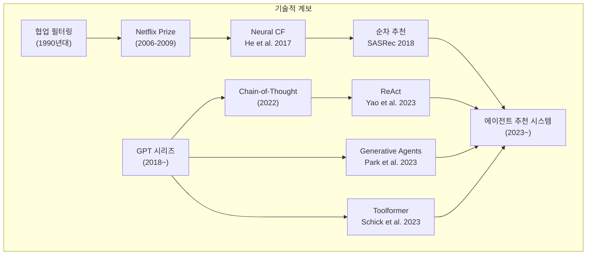

# LLM 기반 에이전트 추천 시스템 서베이 -- 종합 분석 보고서

> **원논문**: *A Survey on LLM-powered Agents for Recommender Systems* 
> **저자**: Qiyao Peng, Hongtao Liu, Hua Huang, Jian Yang, Qing Yang, Minglai Shao 
> **소속**: Tianjin University, Du Xiaoman Financial, Beihang University 
> **출처**: Findings of the Association for Computational Linguistics: EMNLP 2025 (pp. 11574--11583) 
> **보고서 작성일**: 2026-04-16

---

## 목차

1. [배경 및 문제 정의](#1-배경-및-문제-정의)
2. [핵심 방법론 상세 설명](#2-핵심-방법론-상세-설명)
   - 2.1 [방법론 목적별 분류: 세 가지 패러다임](#21-방법론-목적별-분류-세-가지-패러다임)
   - 2.2 [에이전트 아키텍처: 4-모듈 프레임워크](#22-에이전트-아키텍처-4-모듈-프레임워크)
   - 2.3 [수학적 정형화](#23-수학적-정형화)
3. [데이터셋 및 평가 방법론](#3-데이터셋-및-평가-방법론)
4. [관련 스토리 및 실제 영향](#4-관련-스토리-및-실제-영향)
5. [기술적 배경 지식](#5-기술적-배경-지식)
6. [논문의 한계 및 향후 전망](#6-논문의-한계-및-향후-전망)
7. [참고문헌 및 관련 자료](#7-참고문헌-및-관련-자료)

---

## 1. 배경 및 문제 정의

> **TL;DR**: 전통적 추천 시스템은 복잡한 사용자 의도 이해, 상호작용 부족, 해석 가능성 결여라는 근본적 한계를 지닌다. 본 서베이는 LLM 기반 에이전트가 이 문제를 어떻게 해결하는지를 세 가지 패러다임(추천 지향, 상호작용 지향, 시뮬레이션 지향)으로 분류하고, 4-모듈 에이전트 아키텍처(Profile, Memory, Planning, Action)를 통해 22개 기존 방법론을 체계적으로 분석한다. 2026년 4월 기준 41회 인용되었으며, EMNLP 2025 Findings에 채택되었다.

### 1.1 전통적 추천 시스템의 한계

추천 시스템은 전자상거래, 스트리밍 서비스, 소셜 미디어 등 디지털 플랫폼의 핵심 인프라다. 전통적 추천 방법(협업 필터링, 콘텐츠 기반 필터링 등)은 상당한 성과를 거두었지만, 다음 세 가지 근본적 한계에 직면해 있다:

| 한계 | 설명 | 예시 |
|------|------|------|
| **복잡한 사용자 의도 이해 부족** | 단순 행동 패턴(클릭, 구매) 기반 매칭의 한계 | "최근 기분전환이 필요해서 밝은 코미디 영화를 찾고 있어"라는 맥락을 이해하지 못함 |
| **상호작용 능력 부족** | 일방향 추천만 가능, 사용자와의 대화 불가 | 추천 이유를 설명하거나 사용자의 추가 질문에 응답 불가 |
| **해석 가능성 부재** | 블랙박스 모델로 추천 근거 제시 불가 | "이 영화를 추천하는 이유"를 사용자가 이해할 수 있는 형태로 설명 불가 |

> **[주석] 협업 필터링(Collaborative Filtering)이란?**
> 협업 필터링은 "취향이 비슷한 사용자는 비슷한 아이템을 좋아할 것"이라는 가정에 기반한 추천 기법이다. 사용자-아이템 상호작용 행렬(평점, 클릭 등)을 분석하여 유사 사용자/아이템을 찾는다. Netflix Prize(2006~2009)를 통해 행렬 분해(Matrix Factorization) 기법이 비약적으로 발전했으며, 이후 딥러닝 기반의 Neural Collaborative Filtering(He et al., 2017)으로 진화했다.

### 1.2 LLM 에이전트의 도입 동기

GPT-4(Achiam et al., 2023) 등 대규모 언어 모델의 발전은 추천 시스템에 새로운 패러다임을 열었다. LLM 기반 에이전트는 전통적 접근의 한계를 다음과 같이 극복한다:

1. **맥락적 추론(Contextual Reasoning)**: 단순 피처 매칭을 넘어, 사용자의 복합적 선호를 이해하고 맥락 기반 추천 생성
2. **자연어 상호작용(NL Interaction)**: 다중 턴 대화를 통해 사용자의 관심사를 탐색하고 해석 가능한 설명 제공
3. **사용자 행동 시뮬레이션(Behavior Simulation)**: 감정 상태와 시간 역학을 포함하는 현실적 사용자 프로필 생성
4. **콜드 스타트 문제 완화**: LLM의 사전학습 지식과 범용 일반화 능력을 활용한 도메인 간 지식 전이

### 1.3 기존 서베이와의 차별점

본 논문은 기존 서베이 대비 4가지 분석 차원을 모두 커버하는 유일한 연구임을 주장한다:

| 분석 차원 | 본 논문 | Zhu et al. (2024b) | Zhang et al. (2025) |
|-----------|:------:|:------------------:|:-------------------:|
| Method Objective | O | X | O |
| Agent Architecture | O | O | O |
| Dataset | O | O | X |
| Evaluation | O | X | X |

---

## 2. 핵심 방법론 상세 설명

### 2.1 방법론 목적별 분류: 세 가지 패러다임

본 논문은 LLM 기반 에이전트 추천 방법론을 목적에 따라 세 가지 패러다임으로 분류한다.

> **[그림 설명] Fig. 1**: 세 가지 방법론 목적의 동작 방식을 시각화한 그림이다. 왼쪽(Recommender-oriented)은 사용자의 과거 선호 이력을 LLM이 분석하여 다단계 전략적 추천을 생성하는 흐름을 보여준다. 중앙(Interaction-oriented)은 사용자가 "최근 The Descent와 Star Trek을 봤는데 추천해줘"라고 대화하면 에이전트가 맥락을 파악하고 Space Odyssey 2001을 추천하며 이유를 설명하는 대화형 시나리오를 나타낸다. 오른쪽(Simulation-oriented)은 에이전트가 "실험적 음악을 좋아하고 새로운 것을 탐험하고 싶다"는 가상 사용자를 시뮬레이션하여 "재즈와 전자 요소를 결합한 새 곡을 클릭하겠다"는 행동을 생성하는 과정을 보여준다.

#### 2.1.1 추천 지향(Recommender-oriented) 접근

추천 지향 방법은 LLM에 강화된 계획, 추론, 메모리, 도구 사용 능력을 부여하여 **직접적인 추천 결정을 생성**하는 데 초점을 맞춘다. 사용자의 과거 행동 이력을 입력으로 받아 LLM이 추론을 거쳐 아이템을 추천한다.

**대표 방법론**:

| 방법 | 핵심 접근 | 특징 |
|------|-----------|------|
| **RecMind** (Wang et al., 2024b) | 통합 LLM 에이전트 | 과거 추론 경로를 재사용하여 추천 정확도 최적화, Self-Inspiring 메커니즘 |
| **MACRec** (Wang et al., 2024c) | 다중 에이전트 협업 | User Analyst + Item Analyst 역할 분담, SIGIR 2024 |
| **BiLLP** (Shi et al., 2024) | 계층적 계획 | Macro-learning(Planner + Reflector) + Micro-learning(Actor-Critic) 이중 구조, SIGIR 2024 |
| **DRDT** (Wang et al., 2023b) | 동적 반영 + 발산적 사고 | 순차 추천을 위한 동적 리플렉션 메커니즘 |

> **[주석] "Self-Inspiring" 메커니즘이란?**
> RecMind에서 제안된 기법으로, LLM이 과거의 추론 경로(reasoning trace)를 다시 입력으로 활용하여 새로운 추론을 수행하는 자기 강화 루프이다. 마치 인간이 과거 경험을 떠올려 더 나은 판단을 하는 것과 유사하다. 이를 통해 추천의 다양성과 정확도를 동시에 향상시킨다.

**주요 과제**:
- **(1) 목표 불일치(Objective Inconsistency)**: LLM의 언어 모델링 목표와 추천 관련성 목표가 상이 -- 유창한 텍스트가 반드시 좋은 추천을 의미하지 않음
- **(2) 연산 효율성 병목**: LLM의 높은 추론 비용이 실시간 대규모 배포를 제약

#### 2.1.2 상호작용 지향(Interaction-oriented) 접근

상호작용 지향 방법은 대화형 상호작용을 통해 **추천의 해석 가능성과 사용자 경험**을 강화한다. LLM이 인간과 유사한 대화를 수행하면서 선호를 파악하고, 추천 이유를 자연어로 설명한다.

**대표 방법론**:

| 방법 | 핵심 접근 | 특징 |
|------|-----------|------|
| **AutoConcierge** (Zeng et al., 2024) | 자연어 대화 기반 | 레스토랑 추천, 6개 맞춤 평가 지표(주도성, 경제성, 설명력 등) |
| **MACRS** (Fang et al., 2024) | 다중 에이전트 대화 | Planner + 3개 Responder(Ask, Recommend, Chat) 에이전트 협업 |
| **InteRecAgent** (Huang et al., 2023) | 도구 통합 에이전트 | 정보 조회, 아이템 검색, 순위 결정 3개 핵심 도구 + Candidate Bus |
| **H-MACRS** (Nie et al., 2024) | 하이브리드 시스템 | LLM + 검색 엔진 결합 전자상거래 추천, RecSys 2024 |

> **[주석] Candidate Bus 패턴이란?**
> InteRecAgent에서 도입된 도구 간 통신 메커니즘이다. 여러 도구(검색, 필터링, 순위 결정)가 순차적으로 실행될 때, 이전 도구의 출력(후보 아이템 리스트)을 다음 도구의 입력으로 자동 전달하는 파이프라인 버스 구조다. 이를 통해 사용자 질의 → 후보 검색 → 순위 결정 → 최종 추천까지 end-to-end 처리가 가능하다.

**주요 과제**:
- **(1) 암묵적 선호 추출**: 비정형 대화에서 정량화 가능한 선호 신호를 정확히 추출하는 것이 전통적 명시적 피드백보다 복잡
- **(2) 대화 전략 최적화**: 정보 수집, 추천 제공, 사용자 경험 간의 동적 균형 달성이 어려움

#### 2.1.3 시뮬레이션 지향(Simulation-oriented) 접근

시뮬레이션 지향 방법은 LLM을 사용하여 **실제 사용자 행동과 선호 패턴을 재현**하는 데 초점을 맞춘다. 추천 시스템의 평가와 최적화를 위한 고품질 시뮬레이션 데이터를 생성한다.

**대표 방법론**:

| 방법 | 핵심 접근 | 특징 |
|------|-----------|------|
| **AgentCF** (Zhang et al., 2024c) | 에이전트 기반 협업 필터링 | 자연어 기반 사용자/아이템 프로필, WebConf 2024 |
| **Agent4Rec** (Zhang et al., 2024a) | 생성형 에이전트 추천 | 1000명 에이전트의 MovieLens 시뮬레이션, SIGIR 2024 |
| **RecAgent** (Wang et al., 2023a) | 통합 시뮬레이션 | 6가지 행동 모달리티(검색, 탐색, 클릭 등), 3단계 계층 메모리 |
| **FLOW** (Cai et al., 2024) | 피드백 루프 | 추천 에이전트 + 사용자 에이전트 동시 강화 |
| **UserSimulator** (Yoon et al., 2024) | 사용자 시뮬레이터 평가 | 5개 과제를 통한 대화형 추천 시뮬레이터 성능 측정 |

**주요 과제**:
- 실제 사용자 결정에 영향을 미치는 환경적, 감정적, 사회적 요인의 복합성을 시뮬레이션 환경에서 완전히 재현하기 어려움

### 2.2 에이전트 아키텍처: 4-모듈 프레임워크

본 논문은 LLM 기반 에이전트 추천 시스템의 아키텍처를 4개 핵심 모듈로 분해하여 분석한다.

> **[그림 설명] Fig. 2**: 4-모듈 에이전트 아키텍처를 도식화한 그림이다. 중앙에 Profile, Memory, Planning, Action 4개 모듈이 원형으로 배치되어 폐쇄 루프(closed-loop) 구조를 형성한다. 각 모듈의 세부 기능이 외곽에 표시되어 있다: Profile은 행동 추적/패턴 구축/선호 분석, Memory는 이력 저장/감정 추적/맥락 유지, Planning은 전략 생성/과제 순서화/목표 균형, Action은 응답 생성/과제 실행/피드백 학습을 담당한다. 상호작용 데이터가 지속적으로 사용자 프로필과 시스템 메모리를 풍부하게 하는 순환 구조를 핵심적으로 관찰해야 한다.

#### 2.2.1 Profile Module -- 사용자/아이템 표현 구축

프로필 모듈은 사용자와 아이템의 동적 표현을 구축하고 유지하는 기초 모듈이다.

- **MACRec**: User Analyst + Item Analyst로 분리, 각각 사용자 선호와 아이템 특성을 전문적으로 분석
- **AgentCF**: 자연어 기반 프로필로 동적 사용자 선호와 아이템 특성을 표현, 에이전트 기반 협업 필터링 가능

**현재 한계**: (1) 표현 구조의 유연성 부족, (2) 장기 선호와 단기 관심의 균형을 위한 시간 모델링 능력 미흡, (3) 정보 중요도 구분 없는 단순한 갱신 전략

#### 2.2.2 Memory Module -- 이력/맥락 관리

메모리 모듈은 과거 상호작용과 경험을 관리하여 추천 품질을 향상시키는 맥락 뇌(contextual brain) 역할을 한다.

- **RecAgent**: 3단계 계층 메모리 -- 감각 메모리(Sensory), 단기 메모리(Short-term), 장기 메모리(Long-term). 반복적 강화를 통해 단기 → 장기로 전환

> **[주석] 계층적 메모리 구조란?**
> 인간의 기억 시스템(Atkinson-Shiffrin 모델)에서 영감을 받은 설계다. 감각 메모리는 환경 입력을 즉시 처리하고, 단기 메모리는 현재 세션의 상호작용을 보관하며, 장기 메모리는 반복적으로 나타나는 패턴이나 선호를 영구 저장한다. 추천 시스템에서 이 구조는 "방금 클릭한 아이템"(단기)과 "장기적 장르 선호"(장기)를 구분하여 더 정밀한 추천을 가능하게 한다.

**현재 한계**: (1) 대규모 메모리 라이브러리에서 핵심 정보 탐색 효율 저하, (2) 효과적인 망각 메커니즘 부재로 인한 메모리 비대화(memory bloat) -- 구식 정보 누적이 연산 부담 및 노이즈 유발

#### 2.2.3 Planning Module -- 전략적 추천 계획

계획 모듈은 즉각적 사용자 만족과 장기적 참여 목표를 균형 잡는 다단계 행동 계획을 수립한다.

**BiLLP의 이중 계층 계획 구조**:

**MACRS의 다중 에이전트 계획**:

Planner Agent가 3개 Responder Agent(Ask, Recommend, Chat)를 조율하며, 사용자 상호작용에 기반한 피드백 메커니즘을 통해 대화 전략을 동적으로 조정한다.

#### 2.2.4 Action Module -- 추천 실행 엔진

행동 모듈은 계획 모듈의 결정을 구체적 추천으로 변환하여 실행하는 엔진이다.

- **RecAgent**: 검색(search), 탐색(browse), 클릭(click), 페이지넘김(pagination), 채팅(chat), 방송(broadcast) 등 6가지 행동 모달리티를 통합 프롬프팅 프레임워크로 조율
- **InteRecAgent**: 정보 조회, 아이템 검색, 아이템 순위 결정 3개 핵심 도구를 Candidate Bus로 연결하여 end-to-end 처리

### 2.3 수학적 정형화

본 논문은 에이전트 기반 추천 프로세스를 다음과 같이 정형화한다:

에이전트 $a \in \mathcal{A}$가 기능 모듈 집합 $\mathcal{F} = \{F_1, F_2, \ldots, F_K\}$를 갖춘다고 하자. 사용자 $u$에 대한 추천 과정은 다음과 같이 표현된다:

$$\hat{y}_u = f\bigl(F_k(X_u)\bigr), \quad k = 1, \ldots, K$$

여기서:
- $X_u \in \mathcal{X}$: 사용자 고유 정보를 포함하는 입력 공간 (상호작용 이력, 맥락 피처 등)
- $\hat{y}_u \in \mathbb{R}^N$: 아이템 공간에 대한 예측 선호 분포
- $f : F_k(X_u) \to \mathbb{R}^N$: 모듈 출력을 종합하여 최종 추천을 생성하는 통합 함수

> **[주석] 정형화의 의미와 해석**
> 이 수식은 "에이전트가 사용자 정보를 여러 기능 모듈(프로필, 메모리, 계획, 행동)을 통해 처리하고, 통합 함수가 이 출력들을 결합하여 N개 아이템에 대한 선호도 점수 벡터를 생성한다"는 전체 파이프라인을 수학적으로 압축한 것이다. $\hat{y}_u$에서 값이 가장 높은 아이템이 최종 추천 결과가 된다. 이 정형화의 장점은 다양한 LLM 에이전트 추천 방식을 하나의 통일된 프레임워크로 설명할 수 있다는 점이다.

4개 모듈은 폐쇄 루프(closed-loop) 프레임워크로 동작한다:

$$\text{상호작용 데이터} \xrightarrow{\text{갱신}} \text{Profile, Memory} \xrightarrow{\text{정보 제공}} \text{Planning} \xrightarrow{\text{전략}} \text{Action} \xrightarrow{\text{피드백}} \text{Profile, Memory}$$

---

## 3. 데이터셋 및 평가 방법론

### 3.1 데이터셋 분류

본 논문은 실험에 사용되는 데이터셋을 전통적 추천 데이터셋과 대화형 추천 데이터셋으로 구분한다.

#### 전통적 추천 데이터셋

| 데이터셋 | 출처 | 사용자 수 | 아이템 수 | 상호작용 수 | 주요 사용 방법론 |
|----------|------|--------:|--------:|----------:|-----------------|
| Books | Amazon Review | 10.3M | 4.4M | 29.5M | Agent4Rec, BiLLP, RAH, SUBER |
| CDs and Vinyl | Amazon Review | 1.8M | 701.7K | 4.8M | AgentCF, KGLA, ToolRec |
| Video Games | Amazon Review | 2.8M | 137.2K | 4.6M | DRDT, RAH, LUSIM |
| Beauty | Amazon Review | 632K | 112.6K | 701.5K | InteRecAgent, DRDT, RecMind |
| MovieLens-1M | GroupLens | 6K | 3.7K | 1.0M | Agent4Rec, RecAgent, DRDT, MACRS, ToolRec |
| MovieLens-20M | GroupLens | 138.5K | 27.3K | 20M | MACRS, UserSimulator |
| Steam | Kang & McAuley 2018 | 334.7K | 13K | 3.7M | Agent4Rec, BiLLP, FLOW, InteRecAgent |
| Yelp | Yelp.com | 30.4K | 20.4K | 316.3K | RecMind, ToolRec, LUSIM |

#### 대화형 추천 데이터셋

| 데이터셋 | 대화 수 | 턴 수 | 주요 사용 방법론 |
|----------|-------:|------:|-----------------|
| ReDial (Li et al., 2018) | 10K | - | UserSimulator, CSHI |
| Reddit (He et al., 2023) | 634.4K | 1.6M | UserSimulator |
| OpenDialKG (Moon et al., 2019) | 15.6K | 91.2K | CSHI |

### 3.2 데이터셋의 3대 과제

| 과제 | 설명 |
|------|------|
| **벤치마크 부적합** | 기존 벤치마크는 전통적 추천 알고리즘 용도로 설계됨. 에이전트의 추론, 메모리 활용, 전략 계획 능력을 종합적으로 평가하기 어려움 |
| **연산 비용에 따른 샘플링** | LLM API 호출 비용으로 인해 AgentCF는 100명, DRDT는 200명 부분집합만 사용 -- 통계적 견고성 저하, 롱테일 분포 행동 파악 제한 |
| **데이터 누출(Data Leakage)** | 벤치마크 데이터가 LLM 사전학습 코퍼스와 중복될 가능성. 진정한 추론 능력인지 기억 패턴 재생인지 구분 불가 |

### 3.3 평가 지표 체계

본 논문은 평가 지표를 5개 범주로 분류한다:

| 범주 | 지표 | 사용 방법론 |
|------|------|------------|
| **표준 추천 지표** | NDCG@K, Recall@K, HR@K, Hit@K, MRR, Acc, F1, MAP | DRDT, RecMind, InteRecAgent, RAH, MACRS, PMS, Agent4Rec, AgentCF, KGLA, FLOW, CSHI, ToolRec, SUBER |
| **오차 기반 지표** | RMSE, MAE, MSE | RecMind |
| **언어 생성 품질** | BLEU, ROUGE | RecMind, PMS |
| **강화학습 지표** | 궤적 길이, 단일 라운드 평균 보상, 누적 궤적 보상 | LUSIM, BiLLP, SUBER |
| **대화 효율성** | 평균 턴 수(AT), 성공률(SR) | InteRecAgent, MACRS, CSHI |
| **맞춤 지표** | 주도성, 경제성, 설명력, 정확성, 일관성, 효율성 / 시뮬레이션 행동 신뢰도, 에이전트 메모리 신뢰도 | AutoConcierge / RecAgent |

> **[주석] NDCG@K (Normalized Discounted Cumulative Gain)란?**
> 추천 결과의 순위 품질을 측정하는 지표다. 상위 K개 추천 중 관련 아이템이 얼마나 높은 순위에 있는지를 평가한다. DCG는 각 위치의 관련성 점수에 순위 위치에 따른 감쇠(discount)를 적용하여 합산하고, 이를 이상적 순서(IDCG)로 정규화한다. NDCG@K = 1이면 완벽한 순위, 0에 가까울수록 관련 아이템이 하위에 위치함을 의미한다. 수식: $\text{DCG@K} = \sum_{i=1}^{K} \frac{2^{rel_i} - 1}{\log_2(i+1)}$, $\text{NDCG@K} = \frac{\text{DCG@K}}{\text{IDCG@K}}$

### 3.4 22개 방법론 에이전트 모듈 비교

아래 표는 22개 LLM 기반 에이전트 추천 방법론이 4개 핵심 모듈을 어떻게 채택하고 있는지를 종합 비교한다.

| 범주 | 방법 | Profile | Memory | Planning | Action |
|------|------|:-------:|:------:|:--------:|:------:|
| **추천 지향** | RAH | X | O | O | O |
| | ToolRec | X | O | X | O |
| | PMS | O | X | X | O |
| | DRDT | X | X | O | X |
| | BiLLP | X | O | O | O |
| | RecMind | X | O | O | O |
| | MACRec | O | X | O | O |
| **상호작용 지향** | AutoConcierge | X | O | O | O |
| | MACRS | O | O | O | O |
| | RecLLM | O | O | X | O |
| | InteRecAgent | O | O | O | O |
| | MAS | O | O | O | O |
| | H-MACRS | O | O | X | O |
| | Rec4Agentverse | O | X | O | X |
| **시뮬레이션 지향** | KGLA | O | O | X | O |
| | CSHI | O | O | X | O |
| | SUBER | O | O | X | X |
| | LUSIM | O | O | X | X |
| | FLOW | O | O | X | O |
| | Agent4Rec | O | O | X | O |
| | AgentCF | O | O | X | O |
| | UserSimulator | O | X | X | O |
| | RecAgent | O | O | X | O |

**핵심 관찰**:
- **Profile Module**: 상호작용 지향과 시뮬레이션 지향에서 대부분 채택 (사용자 모델링이 핵심이므로), 추천 지향에서는 선택적
- **Memory Module**: 시뮬레이션 지향에서 가장 일관적으로 채택 (장기 행동 패턴 재현에 필수)
- **Planning Module**: 추천 지향에서 가장 적극적으로 채택, 시뮬레이션 지향에서는 대부분 미채택
- **Action Module**: 대부분의 방법론에서 채택 (최종 추천 실행은 필수)

---

## 4. 관련 스토리 및 실제 영향

### 4.1 기술적 계보: 에이전트 추천 시스템이 탄생하기까지

LLM 기반 에이전트 추천 시스템은 두 가지 기술 흐름의 합류점에서 탄생했다.

**추천 시스템 흐름**:
1. **1990년대**: 협업 필터링의 등장, 사용자-아이템 상호작용 행렬 기반 추천
2. **2006~2009**: Netflix Prize가 행렬 분해(SVD, SVD++) 기법의 비약적 발전을 촉진
3. **2017**: Neural Collaborative Filtering(He et al.)이 딥러닝과 협업 필터링을 결합
4. **2018**: SASRec(Kang & McAuley)이 Self-Attention 기반 순차 추천을 제안

**LLM 에이전트 흐름**:
1. **2022**: Chain-of-Thought(Wei et al.)이 LLM의 단계별 추론 능력을 발견
2. **2023(초)**: ReAct(Yao et al.)가 추론과 행동의 시너지를 ICLR 2023에서 발표 -- Thought-Action-Observation 루프
3. **2023(중)**: Generative Agents(Park et al.)가 25명의 가상 에이전트가 소도시에서 생활하는 시뮬레이션을 UIST 2023에서 발표
4. **2023**: Toolformer(Schick et al.)가 LLM의 외부 도구 사용 학습을 NeurIPS 2023에서 발표

이 두 흐름이 2023년 하반기부터 본격적으로 결합되어, RecAgent(2023.06), RecMind(2023.08), InteRecAgent(2023.08), DRDT(2023.12) 등이 연속적으로 등장했다.

### 4.2 산업적 영향과 현장 적용

LLM 에이전트 추천 시스템은 2024~2025년을 거치며 산업적 관심이 급증하고 있다:

- **전자상거래**: H-MACRS(Nie et al., 2024)는 LLM과 검색 엔진을 결합한 하이브리드 다중 에이전트 대화 추천을 RecSys 2024에서 발표, 실제 전자상거래 시나리오에서의 적용을 시연
- **비디오 추천**: Multi-Agent Video Recommender Systems(MAVRS) 연구(2026)에서 Model-based Multi-agent Ranking Framework(MMRF)가 제안되어, 메인 에이전트가 시청 시간을 최적화하고 보조 에이전트들이 좋아요, 팔로우 등 보조 지표를 관리하는 협업 구조가 등장
- **금융 서비스**: 본 논문의 공저자가 소속된 Du Xiaoman Financial(두 샤오만 금융)은 중국의 주요 핀테크 기업으로, LLM 기반 에이전트를 금융 상품 추천에 활용하는 연구를 진행 중
- **프레임워크 생태계**: LangGraph(상태 유지 추천 워크플로우), CrewAI(역할 기반 에이전트 팀 구성), LlamaIndex(RAG 기반 추천) 등이 에이전트 추천 시스템 구축 인프라로 자리잡는 중

### 4.3 학계 반응: 지지와 비판

**지지 측 입장**:
- LLM 에이전트가 추천 시스템의 해석 가능성, 사용자 경험, 콜드 스타트 문제를 근본적으로 해결할 잠재력을 지님
- 시뮬레이션 지향 방법론이 추천 알고리즘의 오프라인 평가 패러다임을 혁신할 가능성
- EMNLP 2025 채택 및 2026년 4월 기준 41회 인용으로 학계의 높은 관심 확인

**비판 측 입장**:
- **환각(Hallucination) 문제**: LLM이 존재하지 않는 아이템을 추천하거나 사실과 다른 설명을 생성할 위험 (SIGIR-AP 2025 튜토리얼에서 집중 논의)
- **편향(Bias) 우려**: LLM의 사전학습 데이터에 내재된 편향이 추천 결과에 증폭될 수 있음 -- 인기 아이템 편향, 인구통계학적 편향 등
- **평가 체계의 표준화 부재**: 각 연구가 상이한 평가 지표와 프로토콜을 사용하여 직접 비교가 어려움
- **연산 비용**: GPT-4 수준 LLM의 API 호출 비용이 대규모 실시간 추천에 비현실적 -- AgentCF는 100명 사용자 부분집합만 평가, 전체 스케일 검증 부재
- **데이터 오염**: LLM이 MovieLens, Amazon Review 등 유명 데이터셋을 사전학습 과정에서 이미 "암기"했을 가능성 -- 공정한 평가에 대한 근본적 의문

---

## 5. 기술적 배경 지식

### 5.1 LLM as Agent: 에이전트 패러다임의 핵심

LLM을 에이전트로 활용하는 것은 전통적인 정적 프롬프트-응답 패러다임을 넘어, 동적 의사결정 프레임워크를 구축하는 것이다.

> **[주석] 에이전트(Agent)란 무엇인가?**
> AI에서 에이전트는 환경을 인지(perceive)하고, 추론(reason)하며, 행동(act)하는 자율적 시스템을 의미한다. LLM 에이전트는 LLM을 "두뇌"로 삼아, 외부 도구를 "손"으로 사용하고, 메모리를 "경험 저장소"로 활용하는 시스템이다. 핵심은 LLM이 단순히 텍스트를 생성하는 것이 아니라, 관찰 → 추론 → 행동 → 관찰의 루프를 반복하며 목표를 달성한다는 점이다.

**ReAct 패러다임** (Yao et al., 2023):
1. **Thought**: 현재 상황을 분석하고 다음 단계를 계획
2. **Action**: 계획에 따라 외부 도구(검색 API, 데이터베이스 등) 호출
3. **Observation**: 도구 실행 결과를 확인하고 다시 Thought로 복귀

**Generative Agents** (Park et al., 2023):
25명의 가상 에이전트가 소도시(Smallville)에서 일상 생활을 영위하며, 관계를 형성하고, 파티를 계획하는 등의 자율적 사회적 행동을 보여줌. 이 연구가 RecAgent와 같은 추천 시뮬레이션 에이전트의 직접적 영감이 됨.

### 5.2 추천 시스템의 핵심 과제

| 과제 | 설명 | LLM 에이전트의 접근 |
|------|------|-------------------|
| **콜드 스타트(Cold Start)** | 신규 사용자/아이템에 대한 데이터 부족 | LLM의 사전학습 지식으로 도메인 간 전이 학습 |
| **데이터 희소성(Data Sparsity)** | 사용자-아이템 행렬의 대부분이 비어있음 | 자연어 기반 프로필로 희소 데이터 보완 |
| **확장성(Scalability)** | 수십억 아이템/사용자 규모 처리 | 현재 미해결 -- 추론 비용이 최대 병목 |
| **탐색-활용 딜레마(Exploration-Exploitation)** | 기존 선호 활용 vs 새로운 아이템 탐색 균형 | Planning 모듈의 전략적 계획으로 다단계 추천 최적화 |

### 5.3 다중 에이전트 시스템(Multi-Agent System, MAS)

여러 개의 특화된 에이전트가 협업하여 복잡한 과제를 해결하는 아키텍처다.

> **[주석] 다중 에이전트 시스템의 협업 패턴**
> - **Cooperative(협력)**: 에이전트들이 공동 목표를 위해 협력. MACRS에서 Planner + Ask/Recommend/Chat Agent가 함께 추천을 최적화하는 것이 이에 해당
> - **Adversarial(대립)**: 에이전트 간 경쟁을 통해 더 나은 결과를 유도. 사용자 에이전트가 의도적으로 까다로운 질문을 던져 추천 에이전트를 단련시키는 시나리오
> - **Mixed(혼합)**: 협력과 경쟁이 혼합된 구조. FLOW에서 추천 에이전트와 사용자 에이전트가 상호 피드백을 주고받는 것이 이에 해당

---

## 6. 논문의 한계 및 향후 전망

### 6.1 논문 자체의 한계

1. **분류 체계의 확장 필요성**: 현재의 3가지 패러다임 분류가 향후 등장할 하이브리드 방법론을 포괄하지 못할 수 있음
2. **산업 사례 부재**: LLM 에이전트 추천의 산업 적용이 아직 초기 단계여서 상업적 구현과 고유 과제에 대한 탐구가 부족
3. **정량적 비교 분석의 부재**: 서베이 논문이지만 22개 방법론의 동일 조건 성능 비교가 없음 (원논문의 결과를 정리하는 데 그침)

### 6.2 미래 연구 방향

본 논문이 제시하는 두 가지 핵심 방향:

**1. 평가 프레임워크 정교화**
- 대화 품질과 추천 효과를 동시에 측정하는 통합 평가 기준 필요
- 프라이버시 및 보안 관점을 포함하는 포괄적 평가 프레임워크 개발

**2. 보안 추천 시스템(Security)**
- CheatAgent(Ning et al., 2024)가 LLM 추천 시스템의 적대적 공격 취약성을 입증
- 다중 에이전트 방어 아키텍처, 도메인 특화 보안 지식 통합이 핵심 연구 과제

### 6.3 보고서 저자의 추가 전망

본 서베이가 다루지 않았으나 중요한 추가 연구 방향들:

| 방향 | 설명 |
|------|------|
| **비용 효율적 추론** | 경량화 모델(LoRA, 지식 증류), 토큰 공유, 캐싱을 통한 추론 비용 절감 |
| **다중 모달 추천** | 시각, 청각, 텍스트를 통합하여 추천 근거를 강화 (MusicAgent, EmotionRec 방향) |
| **인간-루프(HITL) 검증** | 에이전트의 환각 문제를 해결하기 위한 실시간 인간 개입 메커니즘 |
| **분산 에이전트 아키텍처** | 수십억 사용자 규모 처리를 위한 분산 계산 구조 |
| **윤리적 정렬(Alignment)** | MATCHA 등의 연구처럼 추천 에이전트의 인간 가치 정렬 강화 |

---

## 7. 참고문헌 및 관련 자료

### 원논문 및 학회

- Peng, Q., Liu, H., Huang, H., Yang, J., Yang, Q., & Shao, M. (2025). A Survey on LLM-powered Agents for Recommender Systems. *Findings of EMNLP 2025*, pp. 11574--11583. [ACL Anthology](https://aclanthology.org/2025.findings-emnlp.620/) | [arXiv:2502.10050](https://arxiv.org/abs/2502.10050)

### 핵심 참조 방법론

- **RecMind**: Wang, Y. et al. (2024). RecMind: Large Language Model Powered Agent for Recommendation. *Findings of NAACL*, pp. 4351--4364. [arXiv:2308.14296](https://arxiv.org/abs/2308.14296)
- **AgentCF**: Zhang, J. et al. (2024). AgentCF: Collaborative Learning with Autonomous Language Agents for Recommender Systems. *TheWebConf*, pp. 3679--3689. [arXiv:2310.09233](https://arxiv.org/abs/2310.09233)
- **BiLLP**: Shi, W. et al. (2024). Large Language Models are Learnable Planners for Long-Term Recommendation. *SIGIR*, pp. 1893--1903. [arXiv:2403.00843](https://arxiv.org/abs/2403.00843)
- **MACRec**: Wang, Z. et al. (2024). MACRec: A Multi-Agent Collaboration Framework for Recommendation. *SIGIR*, pp. 2760--2764. [arXiv:2402.15235](https://arxiv.org/abs/2402.15235)
- **InteRecAgent**: Huang, X. et al. (2023). Recommender AI Agent: Integrating Large Language Models for Interactive Recommendations. [arXiv:2308.16505](https://arxiv.org/abs/2308.16505)
- **RecAgent**: Wang, L. et al. (2023). User Behavior Simulation with Large Language Model Based Agents. [arXiv:2306.02552](https://arxiv.org/abs/2306.02552)
- **MACRS**: Fang, J. et al. (2024). A Multi-Agent Conversational Recommender System. [arXiv:2402.01135](https://arxiv.org/abs/2402.01135)
- **FLOW**: Cai, S. et al. (2024). FLOW: A Feedback Loop Framework for Simultaneously Enhancing Recommendation and User Agents. [arXiv:2410.20027](https://arxiv.org/abs/2410.20027)

### LLM 에이전트 기초 연구

- **ReAct**: Yao, S. et al. (2023). ReAct: Synergizing Reasoning and Acting in Language Models. *ICLR 2023*. [arXiv:2210.03629](https://arxiv.org/abs/2210.03629)
- **Generative Agents**: Park, J. S. et al. (2023). Generative Agents: Interactive Simulacra of Human Behavior. *UIST 2023*. [arXiv:2304.03442](https://arxiv.org/abs/2304.03442)
- **Toolformer**: Schick, T. et al. (2023). Toolformer: Language Models Can Teach Themselves to Use Tools. *NeurIPS 2023*. [arXiv:2302.04761](https://arxiv.org/abs/2302.04761)
- **LLM Agent Survey**: Wang, L. et al. (2024). A Survey on Large Language Model Based Autonomous Agents. *Frontiers of Computer Science*, 18(6):186345. [arXiv:2308.11432](https://arxiv.org/abs/2308.11432)

### 관련 서베이 및 리소스

- Zhu, X. et al. (2024). Recommender Systems Meet Large Language Model Agents: A Survey. *SSRN 5062105*. [SSRN](https://papers.ssrn.com/sol3/papers.cfm?abstract_id=5062105)
- Zhang, Y. et al. (2025). A Survey of Large Language Model Empowered Agents for Recommendation and Search. [arXiv:2503.05659](https://arxiv.org/abs/2503.05659) | [GitHub Repository](https://github.com/tsinghua-fib-lab/LLM-Agent-for-Recommendation-and-Search)
- 산업 보고서: KPMG (2025). AI 에이전트 혁신: 산업을 바꾸는 현재와 미래 전망. [PDF](https://assets.kpmg.com/content/dam/kpmgsites/kr/pdf/2025/eri/issue_monitor/)
- CheatAgent: Ning, L. et al. (2024). CheatAgent: Attacking LLM-Empowered Recommender Systems via LLM Agent. *KDD*, pp. 2284--2295.
- SIGIR-AP 2025 Tutorial: Trustworthy Information Retrieval in the LLM Era: Bias, Unfairness, and Hallucination. [ACM DL](https://dl.acm.org/doi/10.1145/3767695.3769670)
